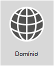

# <a name="external-domain-name-system-records-for-office-365"></a><span data-ttu-id="4b166-103">Registros de Sistema de Nomes de Domínio Externos para o Office 365</span><span class="sxs-lookup"><span data-stu-id="4b166-103">External Domain Name System records for Office 365</span></span>



<span data-ttu-id="4b166-p101">**Deseja ver uma lista personalizada de registros DNS para sua organização do Office 365?** Encontre [ as informações necessárias para criar registros DNS do Office 365](https://support.office.microsoft.com/article/Gather-the-information-you-need-to-create-Office-365-DNS-records-77f90d4a-dc7f-4f09-8972-c1b03ea85a67) para seu domínio no Office 365.  </span><span class="sxs-lookup"><span data-stu-id="4b166-p101">**Want to see a customized list of DNS records for your Office 365 organization?** You can [find the info you need to create Office 365 DNS records](https://support.office.microsoft.com/article/Gather-the-information-you-need-to-create-Office-365-DNS-records-77f90d4a-dc7f-4f09-8972-c1b03ea85a67) for your domain in Office 365.</span></span>

<span data-ttu-id="4b166-p102">**Precisa de ajuda passo a passo para adicionar esses registros ao host de DNS de seu domínio, como GoDaddy ou eNom?** [Encontre links de instruções passo a passo para vários hosts DNS conhecidos](../admin/get-help-with-domains/create-dns-records-at-any-dns-hosting-provider.md). </span><span class="sxs-lookup"><span data-stu-id="4b166-p102">**Need step-by-step help to add these records at your domain's DNS host, such as GoDaddy or eNom?** [Find links to step-by-step instructions for many popular DNS hosts](../admin/get-help-with-domains/create-dns-records-at-any-dns-hosting-provider.md).</span></span>

<span data-ttu-id="4b166-p103">**Ainda deseja usar a lista de referências para sua implantação personalizada?** A lista abaixo deve ser usada como uma referência para sua implantação personalizada do Office 365. Será necessário selecionar quais registros se aplicam à sua organização e preencher os valores apropriados. </span><span class="sxs-lookup"><span data-stu-id="4b166-p103">**Sticking around to use the reference list for your own custom deployment?** The below list should be used as a reference for your custom Office 365 deployment. You will need to select which records apply to your organization and fill in the appropriate values.</span></span>

<span data-ttu-id="4b166-112">**Volte para o** [Planejamento de rede e ajuste de desempenho para o Office 365](./network-planning-and-performance.md).</span><span class="sxs-lookup"><span data-stu-id="4b166-112">**Go back to** [Network planning and performance tuning for Office 365](./network-planning-and-performance.md).</span></span>

<span data-ttu-id="4b166-p104">Geralmente, os registros SPF e MX são os mais difíceis de entender. Atualizamos nossa orientação para registros SPF no final deste artigo. O mais importante é lembrar que _você pode ter apenas um único registro SPF para seu domínio_. Você pode ter vários registros MX, mas isso costuma causar problemas de entrega de emails. Ter um único registro MX que direciona os emails para um sistema de email elimina muitos desses possíveis problemas.</span><span class="sxs-lookup"><span data-stu-id="4b166-p104">Often the SPF and MX records are the hardest to figure out. We've updated our SPF records guidance at the end of this article. The important thing to remember is that _you can only have a single SPF record for your domain_. You can have multiple MX records; however, that can cause problems for mail delivery. Having a single MX record that directs email to one mail system removes many potential problems.</span></span>
  
<span data-ttu-id="4b166-p105">As seções abaixo são organizadas por serviço no Office 365. Para ver uma lista personalizada de registros DNS do Office 365 para seu domínio, entre no Office 365 e [Reúna as informações necessárias para criar registros DNS do Office 365](https://support.office.com/article/77f90d4a-dc7f-4f09-8972-c1b03ea85a67).</span><span class="sxs-lookup"><span data-stu-id="4b166-p105">The sections below are organized by service in Office 365. To see a customized list of the Office 365 DNS records for your domain, sign in to Office 365 and [Gather the information you need to create Office 365 DNS records](https://support.office.com/article/77f90d4a-dc7f-4f09-8972-c1b03ea85a67).</span></span>
  
## <a name="external-dns-records-required-for-office-365-core-services"></a><span data-ttu-id="4b166-119">Registros DNS externos exigidos para o Office 365 (serviços essenciais)</span><span class="sxs-lookup"><span data-stu-id="4b166-119">External DNS records required for Office 365 (core services)</span></span>
<span data-ttu-id="4b166-120"><a name="BKMK_ReqdCore"> </a></span><span class="sxs-lookup"><span data-stu-id="4b166-120"><a name="BKMK_ReqdCore"> </a></span></span>

<span data-ttu-id="4b166-p106">Cada cliente do Office 365 precisa adicionar dois registros ao seu DNS externo. O primeiro CNAME garante que o Office 365 possa direcionar estações de trabalho à plataforma de identidade apropriada. O segundo registro necessário é um registro para comprovar que você possui o nome de domínio.</span><span class="sxs-lookup"><span data-stu-id="4b166-p106">Every Office 365 customer needs to add two records to their external DNS. The first CNAME record ensures that Office 365 can direct workstations to authenticate with the appropriate identity platform. The second required record is to prove you own your domain name.</span></span>
  
|<span data-ttu-id="4b166-124">**Registro DNS**</span><span class="sxs-lookup"><span data-stu-id="4b166-124">**DNS record**</span></span> <br/> |<span data-ttu-id="4b166-125">**Objetivo**</span><span class="sxs-lookup"><span data-stu-id="4b166-125">**Purpose**</span></span> <br/> |<span data-ttu-id="4b166-126">**Valor a ser usado**</span><span class="sxs-lookup"><span data-stu-id="4b166-126">**Value to use**</span></span> <br/> |
|----------|-----------|------------|
|<span data-ttu-id="4b166-127">**CNAME**</span><span class="sxs-lookup"><span data-stu-id="4b166-127">**CNAME**</span></span> <br/> <span data-ttu-id="4b166-128">**(Suite)**</span><span class="sxs-lookup"><span data-stu-id="4b166-128">**(Suite)**</span></span> <br/> |<span data-ttu-id="4b166-p107">Usado pelo Office 365 para direcionar a autenticação para a plataforma de identificação correta. [Mais informações](../admin/services-in-china/purpose-of-cname.md?viewFallbackFrom=o365-worldwide)</span><span class="sxs-lookup"><span data-stu-id="4b166-p107">Used by Office 365 to direct authentication to the correct identity platform. [More information](../admin/services-in-china/purpose-of-cname.md?viewFallbackFrom=o365-worldwide)</span></span> <br/> <span data-ttu-id="4b166-131">**Observação:** Este CNAME só se aplica ao Office 365 operado pela 21Vianet.</span><span class="sxs-lookup"><span data-stu-id="4b166-131">**Note:** This CNAME only applies to Office 365 operated by 21Vianet.</span></span> [<span data-ttu-id="4b166-132">Mais informações</span><span class="sxs-lookup"><span data-stu-id="4b166-132">More information</span></span>](/office365/servicedescriptions/office-365-platform-service-description/office-365-operated-by-21vianet)  |<span data-ttu-id="4b166-133">**Alias:** msoid</span><span class="sxs-lookup"><span data-stu-id="4b166-133">**Alias:** msoid</span></span>  <br/> <span data-ttu-id="4b166-134">**Destino:** clientconfig.partner.microsoftonline-p.net.cn</span><span class="sxs-lookup"><span data-stu-id="4b166-134">**Target:** clientconfig.partner.microsoftonline-p.net.cn</span></span>  <br/> |
|<span data-ttu-id="4b166-135">**TXT**</span><span class="sxs-lookup"><span data-stu-id="4b166-135">**TXT**</span></span> <br/> <span data-ttu-id="4b166-136">**(Verificação de domínio)**</span><span class="sxs-lookup"><span data-stu-id="4b166-136">**(Domain verification)**</span></span> <br/> |<span data-ttu-id="4b166-p109">Usado pelo Office 365 somente para verificar se você é o proprietário do seu domínio. Não afeta nada mais.</span><span class="sxs-lookup"><span data-stu-id="4b166-p109">Used by Office 365 to verify only that you own your domain. It doesn't affect anything else.</span></span>  <br/> |<span data-ttu-id="4b166-139">**Host:** @ (ou, para alguns provedores de hospedagem DNS, o nome do seu domínio)</span><span class="sxs-lookup"><span data-stu-id="4b166-139">**Host:** @ (or, for some DNS hosting providers, your domain name)</span></span>  <br/> <span data-ttu-id="4b166-140">**Valor do TXT:** _uma cadeia de texto fornecida pelo_ Office 365</span><span class="sxs-lookup"><span data-stu-id="4b166-140">**TXT Value:** _A text string provided by_ Office 365</span></span>  <br/> <span data-ttu-id="4b166-141">O **assistente de configuração de domínio** do Office 365 fornece os valores usados para criar esse recurso.</span><span class="sxs-lookup"><span data-stu-id="4b166-141">The Office 365 **domain setup wizard** provides the values that you use to create this record.</span></span>  <br/> |


## <a name="external-dns-records-required-for-email-in-office-365-exchange-online"></a><span data-ttu-id="4b166-142">Registros DNS externos exigidos para email no Office 365 (Exchange Online)</span><span class="sxs-lookup"><span data-stu-id="4b166-142">External DNS records required for email in Office 365 (Exchange Online)</span></span>
<span data-ttu-id="4b166-143"><a name="BKMK_ReqdCore"> </a></span><span class="sxs-lookup"><span data-stu-id="4b166-143"><a name="BKMK_ReqdCore"> </a></span></span>

<span data-ttu-id="4b166-p110">OO email no Office 365 exige diversos registros diferentes. Os três registros principais que todos os clientes devem usar são a Descoberta Automática, MX e SPF.</span><span class="sxs-lookup"><span data-stu-id="4b166-p110">Email in Office 365 requires several different records. The three primary records that all customers should use are the Autodiscover, MX, and SPF records.</span></span>
  
- <span data-ttu-id="4b166-146">**O registro de Descoberta Automática** permite que os computadores clientes encontrem o Exchange automaticamente e configurem o cliente corretamente.</span><span class="sxs-lookup"><span data-stu-id="4b166-146">**The Autodiscover record** allows client computers to automatically find Exchange and configure the client properly.</span></span>

- <span data-ttu-id="4b166-p111">**O registro MX** informa aos outros sistemas de email aonde enviar emails para o seu domínio. **Observação:** Quando você altera seu email para o Office 365, ao atualizar o registro MX do seu domínio, TODOS os emails enviados para esse domínio são enviados para o Office 365.</span><span class="sxs-lookup"><span data-stu-id="4b166-p111">**The MX record** tells other mail systems where to send email for your domain. **Note:** When you change your email to Office 365, by updating your domain's MX record, ALL email sent to that domain will start coming to Office 365.</span></span>  
<span data-ttu-id="4b166-149">Você só quer migrar alguns endereços de email para o Office 365?</span><span class="sxs-lookup"><span data-stu-id="4b166-149">Do you just want to switch a few email addresses to Office 365?</span></span> <span data-ttu-id="4b166-150">Você pode [Coordenar o Office 365 com alguns endereços de email em seu domínio personalizado](https://support.office.com/article/39cee536-6a03-40cf-b9c1-f301bb6001d7).</span><span class="sxs-lookup"><span data-stu-id="4b166-150">You can [Pilot Office 365 with a few email addresses on your custom domain](https://support.office.com/article/39cee536-6a03-40cf-b9c1-f301bb6001d7).</span></span>

- <span data-ttu-id="4b166-151">**O registro TXT para SPF** é usado por sistemas de email do destinatário para validar se o servidor que envia seu email é aquele que você aprova.</span><span class="sxs-lookup"><span data-stu-id="4b166-151">**The TXT record for SPF** is used by recipient email systems to validate that the server sending your email is one that you approve.</span></span> <span data-ttu-id="4b166-152">Isso ajuda a evitar problemas como a falsificação e o phishing de emails.</span><span class="sxs-lookup"><span data-stu-id="4b166-152">This helps prevent problems like email spoofing and phishing.</span></span> <span data-ttu-id="4b166-153">Consulte os [Registros DNS externos necessários para SPF](external-domain-name-system-records.md#BKMK_SPFrecords) neste artigo para ajudá-lo a entender o que incluir em seu registro.</span><span class="sxs-lookup"><span data-stu-id="4b166-153">See the [External DNS records required for SPF](external-domain-name-system-records.md#BKMK_SPFrecords) in this article to help you understand what to include in your record.</span></span>

<span data-ttu-id="4b166-154">Os clientes de email que estão usando a Federação do Exchange também terão um registro CNAME e TXT adicional listado no final da tabela.</span><span class="sxs-lookup"><span data-stu-id="4b166-154">Email customers who are using Exchange Federation will also need the additional CNAME and TXT record listed at the bottom of the table.</span></span>
  
|<span data-ttu-id="4b166-155">**Registro DNS**</span><span class="sxs-lookup"><span data-stu-id="4b166-155">**DNS record**</span></span> <br/> |<span data-ttu-id="4b166-156">**Objetivo**</span><span class="sxs-lookup"><span data-stu-id="4b166-156">**Purpose**</span></span> <br/> |<span data-ttu-id="4b166-157">**Valor a ser usado**</span><span class="sxs-lookup"><span data-stu-id="4b166-157">**Value to use**</span></span> <br/> |
|----------|-----------|------------|
|<span data-ttu-id="4b166-158">**CNAME**</span><span class="sxs-lookup"><span data-stu-id="4b166-158">**CNAME**</span></span> <br/> <span data-ttu-id="4b166-159">**(Exchange Online)**</span><span class="sxs-lookup"><span data-stu-id="4b166-159">**(Exchange Online)**</span></span> <br/> |<span data-ttu-id="4b166-p114">Ajuda os clientes do Outlook a se conectarem com facilidade ao serviço do Exchange Online usando o serviço de Descoberta Automática. A Descoberta Automática encontra automaticamente o host correto do Exchange Server e configura o Outlook para os usuários.</span><span class="sxs-lookup"><span data-stu-id="4b166-p114">Helps Outlook clients to easily connect to the Exchange Online service by using the Autodiscover service. Autodiscover automatically finds the correct Exchange Server host and configures Outlook for users.</span></span>  <br/> |<span data-ttu-id="4b166-162">**Alias:** descoberta automática</span><span class="sxs-lookup"><span data-stu-id="4b166-162">**Alias:** Autodiscover</span></span>  <br/> <span data-ttu-id="4b166-163">**Destino:** autodiscover.outlook.com</span><span class="sxs-lookup"><span data-stu-id="4b166-163">**Target:** autodiscover.outlook.com</span></span>  <br/> |
|<span data-ttu-id="4b166-164">**MX**</span><span class="sxs-lookup"><span data-stu-id="4b166-164">**MX**</span></span> <br/> <span data-ttu-id="4b166-165">**(Exchange Online)**</span><span class="sxs-lookup"><span data-stu-id="4b166-165">**(Exchange Online)**</span></span> <br/> |<span data-ttu-id="4b166-166">Envia emails de entrada de seu domínio para o serviço Exchange Online no Office 365.</span><span class="sxs-lookup"><span data-stu-id="4b166-166">Sends incoming mail for your domain to the Exchange Online service in Office 365.</span></span>  <br/> [!NOTE] <span data-ttu-id="4b166-167">Quando os emails estão sendo enviados para o Exchange Online, você deve remover os registros MX que apontam para o sistema antigo.</span><span class="sxs-lookup"><span data-stu-id="4b166-167">Once email is flowing to Exchange Online, you should remove the MX records that are pointing to your old system.</span></span>   |<span data-ttu-id="4b166-168">**Domínio:** por exemplo, contoso.com</span><span class="sxs-lookup"><span data-stu-id="4b166-168">**Domain:** For example, contoso.com</span></span>  <br/> <span data-ttu-id="4b166-169">**Servidor de email de destino:**\<MX token\>.mail.protection.outlook.com</span><span class="sxs-lookup"><span data-stu-id="4b166-169">**Target email server:**\<MX token\>.mail.protection.outlook.com</span></span>  <br/> <span data-ttu-id="4b166-170">**Preferência/Prioridade:** menor do que outros registros MX (isso garante que o email seja entregue ao Exchange Online), por exemplo, 1 ou “baixa”</span><span class="sxs-lookup"><span data-stu-id="4b166-170">**Preference/Priority:** Lower than any other MX records (this ensures mail is delivered to Exchange Online) - for example 1 or 'low'</span></span>  <br/>  <span data-ttu-id="4b166-171">Encontre o seu \<MX token\> seguindo estas etapas:</span><span class="sxs-lookup"><span data-stu-id="4b166-171">Find your \<MX token\> by following these steps:</span></span>  <br/>  <span data-ttu-id="4b166-172">Entre no Office 365, vá para o administrador do Office 365 \>Domínios.</span><span class="sxs-lookup"><span data-stu-id="4b166-172">Sign in to Office 365, go to Office 365 admin \> Domains.</span></span>  <br/>  <span data-ttu-id="4b166-173">Na coluna Ação de seu domínio, escolha Corrigir problemas.</span><span class="sxs-lookup"><span data-stu-id="4b166-173">In the Action column for your domain, choose Fix issues.</span></span>  <br/>  <span data-ttu-id="4b166-174">Na seção de registros MX, escolha O que corrigir?</span><span class="sxs-lookup"><span data-stu-id="4b166-174">In the MX records section, choose What do I fix?</span></span>  <br/>  <span data-ttu-id="4b166-175">Siga as instruções nesta página para atualizar seu registro MX.</span><span class="sxs-lookup"><span data-stu-id="4b166-175">Follow the directions on this page to update your MX record.</span></span>  <br/> [<span data-ttu-id="4b166-176">O que é prioridade MX?</span><span class="sxs-lookup"><span data-stu-id="4b166-176">What is MX priority?</span></span>](../admin/setup/domains-faq.yml) <br/> |
|<span data-ttu-id="4b166-177">**SPF (TXT)**</span><span class="sxs-lookup"><span data-stu-id="4b166-177">**SPF (TXT)**</span></span> <br/> <span data-ttu-id="4b166-178">**(Exchange Online)**</span><span class="sxs-lookup"><span data-stu-id="4b166-178">**(Exchange Online)**</span></span>  <br/> |<span data-ttu-id="4b166-p115">Ajuda a impedir que outras pessoas usem seu domínio para enviar spam ou outros emails mal-intencionados. Os registros SPF (sender policy framework) identificam os servidores autorizados a enviar email de seu domínio.</span><span class="sxs-lookup"><span data-stu-id="4b166-p115">Helps to prevent other people from using your domain to send spam or other malicious email. Sender policy framework (SPF) records work by identifying the servers that are authorized to send email from your domain.</span></span>  <br/> |[<span data-ttu-id="4b166-181">Registros DNS externos necessários para SPF</span><span class="sxs-lookup"><span data-stu-id="4b166-181">External DNS records required for SPF</span></span>](external-domain-name-system-records.md#BKMK_SPFrecords) <br/> |
|<span data-ttu-id="4b166-182">**TXT**</span><span class="sxs-lookup"><span data-stu-id="4b166-182">**TXT**</span></span> <br/> <span data-ttu-id="4b166-183">**(Federação do Exchange)**</span><span class="sxs-lookup"><span data-stu-id="4b166-183">**(Exchange federation)**</span></span> <br/> |<span data-ttu-id="4b166-184">Usado na federação do Exchange para implantação híbrida.</span><span class="sxs-lookup"><span data-stu-id="4b166-184">Used for Exchange federation for hybrid deployment.</span></span>  <br/> |<span data-ttu-id="4b166-185">**Registro TXT 1:** por exemplo, contoso.com e um texto de hash associado, gerado de forma personalizada e à prova de domínio (por exemplo, Y96nu89138789315669824)</span><span class="sxs-lookup"><span data-stu-id="4b166-185">**TXT record 1:** For example, contoso.com and associated custom-generated, domain-proof hash text (for example, Y96nu89138789315669824)</span></span>  <br/> <span data-ttu-id="4b166-186">**Registro TXT 2:** por exemplo, exchangedelegation.contoso.com e um texto de hash associado gerado de forma personalizada e à prova de domínio (por exemplo, Y3259071352452626169)</span><span class="sxs-lookup"><span data-stu-id="4b166-186">**TXT record 2:** For example, exchangedelegation.contoso.com and associated custom-generated, domain-proof hash text (for example, Y3259071352452626169)</span></span>  <br/> |
|<span data-ttu-id="4b166-187">**CNAME**</span><span class="sxs-lookup"><span data-stu-id="4b166-187">**CNAME**</span></span> <br/> <span data-ttu-id="4b166-188">**(Federação do Exchange)**</span><span class="sxs-lookup"><span data-stu-id="4b166-188">**(Exchange federation)**</span></span> <br/> |<span data-ttu-id="4b166-p116">Ajuda os clientes do Outlook a se conectarem com facilidade ao serviço do Exchange Online usando o serviço de Descoberta Automática quando sua empresa estiver usando a federação do Exchange. A Descoberta Automática encontra automaticamente o host correto do Exchange Server e configura o Outlook para os usuários.</span><span class="sxs-lookup"><span data-stu-id="4b166-p116">Helps Outlook clients to easily connect to the Exchange Online service by using the Autodiscover service when your company is using Exchange federation. Autodiscover automatically finds the correct Exchange Server host and configures Outlook for your users.</span></span>  <br/> |<span data-ttu-id="4b166-191">**Alias:** por exemplo, Autodiscover.service.contoso.com</span><span class="sxs-lookup"><span data-stu-id="4b166-191">**Alias:** For example, Autodiscover.service.contoso.com</span></span>  <br/> <span data-ttu-id="4b166-192">**Destino:** autodiscover.outlook.com</span><span class="sxs-lookup"><span data-stu-id="4b166-192">**Target:** autodiscover.outlook.com</span></span>  <br/> |


## <a name="external-dns-records-required-for-skype-for-business-online"></a><span data-ttu-id="4b166-193">Registros DNS externos necessários para o Skype for Business Online</span><span class="sxs-lookup"><span data-stu-id="4b166-193">External DNS records required for Skype for Business Online</span></span>
<span data-ttu-id="4b166-194"><a name="BKMK_ReqdCore"> </a></span><span class="sxs-lookup"><span data-stu-id="4b166-194"><a name="BKMK_ReqdCore"> </a></span></span>

<span data-ttu-id="4b166-195">Há etapas específicas a serem seguidas quando você usa [URLs e intervalos de endereços IP do Office 365](https://support.office.com/article/8548a211-3fe7-47cb-abb1-355ea5aa88a2#BKMK_LYO) para garantir que sua rede esteja configurada corretamente.</span><span class="sxs-lookup"><span data-stu-id="4b166-195">There are specific steps to take when you use  [Office 365 URLs and IP address ranges](https://support.office.com/article/8548a211-3fe7-47cb-abb1-355ea5aa88a2#BKMK_LYO) to make sure your network is configured correctly.</span></span>

> [!NOTE]
> <span data-ttu-id="4b166-196">Esses registros DNS também se aplicam ao Teams, especialmente em um cenário híbrido do Teams e do Skype for Business, onde podem surgir certos problemas de federação.</span><span class="sxs-lookup"><span data-stu-id="4b166-196">These DNS records also apply to Teams, especially in a hybrid Teams and Skype for Business scenario, where certain federation issues could arise.</span></span>
  
|<span data-ttu-id="4b166-197">**Registro DNS**</span><span class="sxs-lookup"><span data-stu-id="4b166-197">**DNS record**</span></span> <br/> |<span data-ttu-id="4b166-198">**Objetivo**</span><span class="sxs-lookup"><span data-stu-id="4b166-198">**Purpose**</span></span> <br/> |<span data-ttu-id="4b166-199">**Valor a ser usado**</span><span class="sxs-lookup"><span data-stu-id="4b166-199">**Value to use**</span></span> <br/> |
|----------|-----------|------------|
|<span data-ttu-id="4b166-200">**SRV**</span><span class="sxs-lookup"><span data-stu-id="4b166-200">**SRV**</span></span> <br/> <span data-ttu-id="4b166-201">**(Skype for Business Online)**</span><span class="sxs-lookup"><span data-stu-id="4b166-201">**(Skype for Business Online)**</span></span> <br/> |<span data-ttu-id="4b166-p117">Permite que o domínio do Office 365 compartilhe recursos de mensagens instantâneas (IM) com clientes externos habilitando a federação SIP. Leia mais sobre [URLs e intervalos de endereços IP do Office 365](https://support.office.com/article/8548a211-3fe7-47cb-abb1-355ea5aa88a2#BKMK_LYO).  </span><span class="sxs-lookup"><span data-stu-id="4b166-p117">Allows your Office 365 domain to share instant messaging (IM) features with external clients by enabling SIP federation. Read more about [Office 365 URLs and IP address ranges](https://support.office.com/article/8548a211-3fe7-47cb-abb1-355ea5aa88a2#BKMK_LYO).  </span></span><br/> |<span data-ttu-id="4b166-204">**Serviço:** sipfederationtls</span><span class="sxs-lookup"><span data-stu-id="4b166-204">**Service:** sipfederationtls</span></span>  <br/> <span data-ttu-id="4b166-205">**Protocolo:** TCP</span><span class="sxs-lookup"><span data-stu-id="4b166-205">**Protocol:** TCP</span></span>  <br/> <span data-ttu-id="4b166-206">**Priority:** 100</span><span class="sxs-lookup"><span data-stu-id="4b166-206">**Priority:** 100</span></span>  <br/> <span data-ttu-id="4b166-207">**Peso:** 1</span><span class="sxs-lookup"><span data-stu-id="4b166-207">**Weight:** 1</span></span>  <br/> <span data-ttu-id="4b166-208">**Porta:** 5061</span><span class="sxs-lookup"><span data-stu-id="4b166-208">**Port:** 5061</span></span>  <br/> <span data-ttu-id="4b166-209">**Destino:** sipfed.online.lync.com</span><span class="sxs-lookup"><span data-stu-id="4b166-209">**Target:** sipfed.online.lync.com</span></span>  <br/> <span data-ttu-id="4b166-210">**Observação:** Se o firewall ou o servidor proxy bloquearem pesquisas SRV em um DNS externo, você deverá adicionar esse registro ao registro DNS interno.</span><span class="sxs-lookup"><span data-stu-id="4b166-210">**Note:** If the firewall or proxy server blocks SRV lookups on an external DNS, you should add this record to the internal DNS record.</span></span>   |
|<span data-ttu-id="4b166-211">**SRV**</span><span class="sxs-lookup"><span data-stu-id="4b166-211">**SRV**</span></span> <br/> <span data-ttu-id="4b166-212">**(Skype for Business Online)**</span><span class="sxs-lookup"><span data-stu-id="4b166-212">**(Skype for Business Online)**</span></span> <br/> |<span data-ttu-id="4b166-213">Usado pelo Skype for Business para coordenar o fluxo de informações entre clientes do Lync.</span><span class="sxs-lookup"><span data-stu-id="4b166-213">Used by Skype for Business to coordinate the flow of information between Lync clients.</span></span>  <br/> |<span data-ttu-id="4b166-214">**Serviço:** sip</span><span class="sxs-lookup"><span data-stu-id="4b166-214">**Service:** sip</span></span>  <br/> <span data-ttu-id="4b166-215">**Protocolo:** TLS</span><span class="sxs-lookup"><span data-stu-id="4b166-215">**Protocol:** TLS</span></span>  <br/> <span data-ttu-id="4b166-216">**Priority:** 100</span><span class="sxs-lookup"><span data-stu-id="4b166-216">**Priority:** 100</span></span>  <br/> <span data-ttu-id="4b166-217">**Peso:** 1</span><span class="sxs-lookup"><span data-stu-id="4b166-217">**Weight:** 1</span></span>  <br/> <span data-ttu-id="4b166-218">**Porta:** 443</span><span class="sxs-lookup"><span data-stu-id="4b166-218">**Port:** 443</span></span>  <br/> <span data-ttu-id="4b166-219">**Destino:** sipdir.online.lync.com</span><span class="sxs-lookup"><span data-stu-id="4b166-219">**Target:** sipdir.online.lync.com</span></span>  <br/> |
|<span data-ttu-id="4b166-220">**CNAME**</span><span class="sxs-lookup"><span data-stu-id="4b166-220">**CNAME**</span></span> <br/> <span data-ttu-id="4b166-221">**(Skype for Business Online)**</span><span class="sxs-lookup"><span data-stu-id="4b166-221">**(Skype for Business Online)**</span></span> <br/> |<span data-ttu-id="4b166-222">Usado pelo cliente do Lync para ajudar a localizar o serviço do Skype for Business Online e entrar.</span><span class="sxs-lookup"><span data-stu-id="4b166-222">Used by the Lync client to help find the Skype for Business Online service and sign in.</span></span>  <br/> |<span data-ttu-id="4b166-223">**Alias:** sip</span><span class="sxs-lookup"><span data-stu-id="4b166-223">**Alias:** sip</span></span>  <br/> <span data-ttu-id="4b166-224">**Destino:** sipdir.online.lync.com</span><span class="sxs-lookup"><span data-stu-id="4b166-224">**Target:** sipdir.online.lync.com</span></span>  <br/> <span data-ttu-id="4b166-225">Para obter mais informações, confira [URLs e intervalos de endereços IP do Office 365](https://support.office.com/article/8548a211-3fe7-47cb-abb1-355ea5aa88a2#BKMK_LYO).</span><span class="sxs-lookup"><span data-stu-id="4b166-225">For more information, see [Office 365 URLs and IP address ranges](https://support.office.com/article/8548a211-3fe7-47cb-abb1-355ea5aa88a2#BKMK_LYO).</span></span>  <br/> |
|<span data-ttu-id="4b166-226">**CNAME**</span><span class="sxs-lookup"><span data-stu-id="4b166-226">**CNAME**</span></span> <br/> <span data-ttu-id="4b166-227">**(Skype for Business Online)**</span><span class="sxs-lookup"><span data-stu-id="4b166-227">**(Skype for Business Online)**</span></span> <br/> |<span data-ttu-id="4b166-228">Usado pelo cliente móvel do Lync para ajudar a localizar o serviço do Skype for Business Online e entrar.</span><span class="sxs-lookup"><span data-stu-id="4b166-228">Used by the Lync mobile client to help find the Skype for Business Online service and sign in.</span></span>  <br/> |<span data-ttu-id="4b166-229">**Alias:** lyncdiscover</span><span class="sxs-lookup"><span data-stu-id="4b166-229">**Alias:** lyncdiscover</span></span>  <br/> <span data-ttu-id="4b166-230">**Destino:** webdir.online.lync.com</span><span class="sxs-lookup"><span data-stu-id="4b166-230">**Target:** webdir.online.lync.com</span></span>  <br/> |

## <a name="external-dns-records-required-for-office-365-single-sign-on"></a><span data-ttu-id="4b166-231">Registros DNS externos exigidos para Acesso por Logon Único ao Office 365</span><span class="sxs-lookup"><span data-stu-id="4b166-231">External DNS records required for Office 365 Single Sign-On</span></span>
<span data-ttu-id="4b166-232"><a name="BKMK_ReqdCore"> </a></span><span class="sxs-lookup"><span data-stu-id="4b166-232"><a name="BKMK_ReqdCore"> </a></span></span>

|<span data-ttu-id="4b166-233">**Registro DNS**</span><span class="sxs-lookup"><span data-stu-id="4b166-233">**DNS record**</span></span> <br/> |<span data-ttu-id="4b166-234">**Objetivo**</span><span class="sxs-lookup"><span data-stu-id="4b166-234">**Purpose**</span></span> <br/> |<span data-ttu-id="4b166-235">**Valor a ser usado**</span><span class="sxs-lookup"><span data-stu-id="4b166-235">**Value to use**</span></span> <br/> |
|----------|-----------|------------|
|<span data-ttu-id="4b166-236">**Host (A)**</span><span class="sxs-lookup"><span data-stu-id="4b166-236">**Host (A)**</span></span> <br/> |<span data-ttu-id="4b166-p118">Usado para logon único (SSO). Fornece o ponto de extremidade para que seus usuários externos (e usuários locais, se você quiser) se conectem aos proxies do servidor de federação dos Serviços de Federação do Active Directory (AD FS) ou ao IP virtual com balanceamento de carga (VIP).</span><span class="sxs-lookup"><span data-stu-id="4b166-p118">Used for single sign-on (SSO). It provides the endpoint for your off-premises users (and on-premises users, if you like) to connect to your Active Directory Federation Services (AD FS) federation server proxies or load-balanced virtual IP (VIP).</span></span>  <br/> |<span data-ttu-id="4b166-239">**Destino:** por exemplo, sts.contoso.com</span><span class="sxs-lookup"><span data-stu-id="4b166-239">**Target:** For example, sts.contoso.com</span></span>  <br/> |

## <a name="external-dns-records-required-for-spf"></a><span data-ttu-id="4b166-240">Registros DNS externos necessários para SPF</span><span class="sxs-lookup"><span data-stu-id="4b166-240">External DNS records required for SPF</span></span>
<span data-ttu-id="4b166-241"><a name="BKMK_SPFrecords"> </a></span><span class="sxs-lookup"><span data-stu-id="4b166-241"><a name="BKMK_SPFrecords"> </a></span></span>

> [!IMPORTANT]
> <span data-ttu-id="4b166-p119">A SPF foi projetada para ajudar a evitar a falsificação, mas existem técnicas de falsificação que a SPF não ajuda a proteger. Para proteger contra essas técnicas, depois de configurar a SPF, você também deve configurar o DKIM e o DMARC para o Office 365. Para começar, confira [Use DKIM to validate outbound email sent from your domain in Office 365](../security/office-365-security/use-dkim-to-validate-outbound-email.md). A seguir, veja [Use DMARC to validate email in Office 365](../security/office-365-security/use-dmarc-to-validate-email.md).</span><span class="sxs-lookup"><span data-stu-id="4b166-p119">SPF is designed to help prevent spoofing, but there are spoofing techniques that SPF cannot protect against. In order to protect against these, once you have set up SPF, you should also configure DKIM and DMARC for Office 365. To get started, see [Use DKIM to validate outbound email sent from your domain in Office 365](../security/office-365-security/use-dkim-to-validate-outbound-email.md). Next, see [Use DMARC to validate email in Office 365](../security/office-365-security/use-dmarc-to-validate-email.md).</span></span>
  
<span data-ttu-id="4b166-p120">Os registros SPF são registros TXT que ajudam a impedir que outras pessoas usem seu domínio para enviar spam ou outros emails mal-intencionados. Os registros SPF (sender policy framework) identificam os servidores autorizados a enviar emails de seu domínio.</span><span class="sxs-lookup"><span data-stu-id="4b166-p120">SPF records are TXT records that help to prevent other people from using your domain to send spam or other malicious email. Sender policy framework (SPF) records work by identifying the servers that are authorized to send email from your domain.</span></span>
  
<span data-ttu-id="4b166-p121">Você só pode ter um registro SPF (ou seja, um registro TXT que define SPF) para seu domínio. Este registro único pode ter algumas inclusões diferentes, mas o total de pesquisas DNS resultantes não pode ser superior a 10 (isso ajuda a evitar ataques de negação de serviço). Confira a tabela e os outros exemplos a seguir para ajudá-lo a criar ou atualizar os valores de registro SPF corretos para seu ambiente.</span><span class="sxs-lookup"><span data-stu-id="4b166-p121">You can only have one SPF record (that is, a TXT record that defines SPF) for your domain. That single record can have a few different inclusions but the total DNS lookups that result can't be more than 10 (this helps prevent denial of service attacks). See the table and other examples below to help you create or update the right SPF record values for your environment.</span></span>
  
### <a name="structure-of-an-spf-record"></a><span data-ttu-id="4b166-251">Estrutura de um registro SPF</span><span class="sxs-lookup"><span data-stu-id="4b166-251">Structure of an SPF record</span></span>

<span data-ttu-id="4b166-p122">Todos os registros SPF contêm três partes: a declaração de que é um registro SPF, os domínios e endereços IP que devem enviar emails e uma regra de aplicação. Você precisa das três partes para ter um registro SPF válido. Veja um exemplo do registro SPF mais comum para o Office 365 quando você usa apenas o email do Exchange Online:</span><span class="sxs-lookup"><span data-stu-id="4b166-p122">All SPF records contain three parts: the declaration that it is an SPF record, the domains, and IP addresses that should be sending email, and an enforcement rule. You need all three in a valid SPF record. Here's an example of a common SPF record for Office 365 when you use only Exchange Online email:</span></span>
  
``` dns
TXT Name @
Values: v=spf1 include:spf.protection.outlook.com -all
```

<span data-ttu-id="4b166-p123">Um sistema de email que recebe um email do seu domínio analisa o registro SPF, e se o servidor de email que enviou a mensagem for um servidor do Office 365, a mensagem é aceita. Se o servidor que enviou a mensagem fosse seu antigo sistema de email ou um sistema mal-intencionado na Internet, por exemplo, a verificação de SPF poderia falhar e a mensagem não seria entregue. Verificações como esta ajudam a evitar mensagens de falsificação e de phishing.</span><span class="sxs-lookup"><span data-stu-id="4b166-p123">An email system that receives an email from your domain looks at the SPF record, and if the email server that sent the message was an Office 365 server, the message is accepted. If the server that sent the message was your old mail system or a malicious system on the Internet, for example, the SPF check might fail and the message wouldn't be delivered. Checks like this help to prevent spoofing and phishing messages.</span></span>
  
### <a name="choose-the-spf-record-structure-you-need"></a><span data-ttu-id="4b166-258">Escolha a estrutura de registro de SPF que precisar</span><span class="sxs-lookup"><span data-stu-id="4b166-258">Choose the SPF record structure you need</span></span>

<span data-ttu-id="4b166-259">Para cenários em que você não está usando apenas o email do Exchange Online no Office 365 (por exemplo, quando você também usa o email proveniente do SharePoint Online), use a tabela a seguir para determinar o que incluir no valor do registro.</span><span class="sxs-lookup"><span data-stu-id="4b166-259">For scenarios where you're not just using Exchange Online email for Office 365 (for example, when you use email originating from SharePoint Online as well), use the following table to determine what to include in the value of the record.</span></span>
  
> [!NOTE]
> <span data-ttu-id="4b166-p124">Se você tiver um cenário complicado que inclui, por exemplo, servidores de email de borda para o gerenciamento de tráfego de email em seu firewall, você terá um registro SPF mais detalhado para configurar. Saiba como: [Configurar registros SPF no Office 365 para ajudar a evitar falsificação](../security/office-365-security/set-up-spf-in-office-365-to-help-prevent-spoofing.md). Você também pode aprender muito mais sobre como o SPF funciona com o Office 365 lendo [Como o Office 365 usa Sender Policy Framework (SPF) para ajudar a evitar falsificação](../security/office-365-security/how-office-365-uses-spf-to-prevent-spoofing.md).</span><span class="sxs-lookup"><span data-stu-id="4b166-p124">If you have a complicated scenario that includes, for example, edge email servers for managing email traffic across your firewall, you'll have a more detailed SPF record to set up. Learn how: [Set up SPF records in Office 365 to help prevent spoofing](../security/office-365-security/set-up-spf-in-office-365-to-help-prevent-spoofing.md). You can also learn much more about how SPF works with Office 365 by reading [How Office 365 uses Sender Policy Framework (SPF) to help prevent spoofing](../security/office-365-security/how-office-365-uses-spf-to-prevent-spoofing.md).</span></span>
  
| <span data-ttu-id="4b166-263">Número</span><span class="sxs-lookup"><span data-stu-id="4b166-263">Number</span></span>|<span data-ttu-id="4b166-264">Se você estiver usando...</span><span class="sxs-lookup"><span data-stu-id="4b166-264">If you're using…</span></span>  <br/> |<span data-ttu-id="4b166-265">Finalidade</span><span class="sxs-lookup"><span data-stu-id="4b166-265">Purpose</span></span>  <br/> |<span data-ttu-id="4b166-266">Adicionar isso inclui</span><span class="sxs-lookup"><span data-stu-id="4b166-266">Add these includes</span></span>  <br/> |
|:-----|:-----|:-----|:-----|
|<span data-ttu-id="4b166-267">1</span><span class="sxs-lookup"><span data-stu-id="4b166-267">1</span></span>  <br/> |<span data-ttu-id="4b166-268">Todos os sistemas de email (obrigatório)</span><span class="sxs-lookup"><span data-stu-id="4b166-268">All email systems (required)</span></span>  <br/> |<span data-ttu-id="4b166-269">Todos os registros SPF começam com esse valor</span><span class="sxs-lookup"><span data-stu-id="4b166-269">All SPF records start with this value</span></span>  <br/> |<span data-ttu-id="4b166-270">v=spf1</span><span class="sxs-lookup"><span data-stu-id="4b166-270">v=spf1</span></span>  <br/> |
|<span data-ttu-id="4b166-271">2</span><span class="sxs-lookup"><span data-stu-id="4b166-271">2</span></span>  <br/> |<span data-ttu-id="4b166-272">Exchange Online (comum)</span><span class="sxs-lookup"><span data-stu-id="4b166-272">Exchange Online (common)</span></span>  <br/> |<span data-ttu-id="4b166-273">Usar apenas com o Exchange Online</span><span class="sxs-lookup"><span data-stu-id="4b166-273">Use with just Exchange Online</span></span>  <br/> |<span data-ttu-id="4b166-274">include:spf.protection.outlook.com</span><span class="sxs-lookup"><span data-stu-id="4b166-274">include:spf.protection.outlook.com</span></span>  <br/> |
|<span data-ttu-id="4b166-275">3</span><span class="sxs-lookup"><span data-stu-id="4b166-275">3</span></span>  <br/> |<span data-ttu-id="4b166-276">Sistema de email de terceiros (menos comum)</span><span class="sxs-lookup"><span data-stu-id="4b166-276">Third-party email system (less common)</span></span>  <br/> ||<span data-ttu-id="4b166-277">include:\<email system like mail.contoso.com\></span><span class="sxs-lookup"><span data-stu-id="4b166-277">include:\<email system like mail.contoso.com\></span></span>  <br/> |
|<span data-ttu-id="4b166-278">4</span><span class="sxs-lookup"><span data-stu-id="4b166-278">4</span></span>  <br/> |<span data-ttu-id="4b166-279">Sistema de email local (menos comum)</span><span class="sxs-lookup"><span data-stu-id="4b166-279">On-premises mail system (less common)</span></span>  <br/> |<span data-ttu-id="4b166-280">Usar se você estiver usando o Exchange Online Protection ou o Exchange Online e outro sistema de email</span><span class="sxs-lookup"><span data-stu-id="4b166-280">Use if you're using Exchange Online Protection or Exchange Online plus another mail system</span></span>  <br/> |<span data-ttu-id="4b166-281">ip4:\<0.0.0.0\></span><span class="sxs-lookup"><span data-stu-id="4b166-281">ip4:\<0.0.0.0\></span></span>  <br/> <span data-ttu-id="4b166-282">ip6:\< : : \></span><span class="sxs-lookup"><span data-stu-id="4b166-282">ip6:\< : : \></span></span>  <br/> <span data-ttu-id="4b166-283">include:\<mail.contoso.com\></span><span class="sxs-lookup"><span data-stu-id="4b166-283">include:\<mail.contoso.com\></span></span>  <br/> <span data-ttu-id="4b166-284">O valor entre colchetes (\<\>) deve ser outros sistemas de email que enviarão emails para seu domínio.</span><span class="sxs-lookup"><span data-stu-id="4b166-284">The value in brackets (\<\>) should be other mail systems that will send email for your domain.</span></span>  <br/> |
|<span data-ttu-id="4b166-285">5</span><span class="sxs-lookup"><span data-stu-id="4b166-285">5</span></span>  <br/> |<span data-ttu-id="4b166-286">Todos os sistemas de email (obrigatório)</span><span class="sxs-lookup"><span data-stu-id="4b166-286">All email systems (required)</span></span>  <br/> ||<span data-ttu-id="4b166-287">-tudo</span><span class="sxs-lookup"><span data-stu-id="4b166-287">-all</span></span>  <br/> |

### <a name="example-adding-to-an-existing-spf-record"></a><span data-ttu-id="4b166-288">Exemplo: adicionar a um registro SPF existente</span><span class="sxs-lookup"><span data-stu-id="4b166-288">Example: Adding to an existing SPF record</span></span>
<span data-ttu-id="4b166-289"><a name="bkmk_addtospf"> </a></span><span class="sxs-lookup"><span data-stu-id="4b166-289"><a name="bkmk_addtospf"> </a></span></span>

<span data-ttu-id="4b166-p125">Se você já tiver um registro SPF, será preciso adicionar ou atualizar os valores para o Office 365. Por exemplo, digamos que seu registro SPF existente para contoso.com seja esse:</span><span class="sxs-lookup"><span data-stu-id="4b166-p125">If you already have an SPF record, you'll need to add or update values for Office 365. For example, say your existing SPF record for contoso.com is this:</span></span>
  
``` dns
TXT Name @
Values: v=spf1 ip4:60.200.100.30 include:smtp.adatum.com -all
```

<span data-ttu-id="4b166-p126">Agora você está atualizando seu registro SPF para o Office 365. Você editará seu registro atual para ter um registro SPF que inclua os valores que você precisa. Para o Office 365, "spf.protection.outlook.com".</span><span class="sxs-lookup"><span data-stu-id="4b166-p126">Now you're updating your SPF record for Office 365. You'll edit your current record so you have an SPF record that includes the values that you need. For Office 365, "spf.protection.outlook.com".</span></span>
  
<span data-ttu-id="4b166-295">Correto:</span><span class="sxs-lookup"><span data-stu-id="4b166-295">Correct:</span></span>
  
``` dns
TXT Name @
Values: v=spf1 ip4:60.200.100.30 include:spf.protection.outlook.com include:smtp.adatum.com -all
```

<span data-ttu-id="4b166-296">Incorreto:</span><span class="sxs-lookup"><span data-stu-id="4b166-296">Incorrect:</span></span>
  
``` dns
Record 1:
TXT Name @
Values: v=spf1 ip4:60.200.100.30 include:smtp.adatum.com -all
Record 2:
Values: v=spf1 include:spf.protection.outlook.com -all
```

### <a name="more-examples-of-common-spf-values"></a><span data-ttu-id="4b166-297">Mais exemplos de valores de SPF comuns</span><span class="sxs-lookup"><span data-stu-id="4b166-297">More examples of common SPF values</span></span>
<span data-ttu-id="4b166-298"><a name="bkmk_addtospf"> </a></span><span class="sxs-lookup"><span data-stu-id="4b166-298"><a name="bkmk_addtospf"> </a></span></span>

<span data-ttu-id="4b166-p127">Se você estiver usando o pacote completo do Office 365 e estiver usando MailChimp para enviar emails de marketing em seu nome, seu registro SPF em contoso.com pode se parecer com o seguinte, que usa as linhas 1, 3 e 5 da tabela acima. Lembre-se, as linhas 1 e 5 são necessárias.</span><span class="sxs-lookup"><span data-stu-id="4b166-p127">If you are using the full Office 365 suite and are using MailChimp to send marketing emails on your behalf, your SPF record at contoso.com might look like the following, which uses rows 1, 3, and 5 from the table above. Remember, rows 1 and 5 are required.</span></span>
  
``` dns
TXT Name @
Values: v=spf1 include:spf.protection.outlook.com include:servers.mcsv.net -all
```

<span data-ttu-id="4b166-301">Como alternativa, se você tiver uma configuração híbrida do Exchange na qual o email é enviado do Office 365 e também do seu sistema de email local, seu registro SPF em contoso.com pode ser assim:</span><span class="sxs-lookup"><span data-stu-id="4b166-301">Alternatively, if you have an Exchange Hybrid configuration where email will be sent from both Office 365 and your on-premises mail system, your SPF record at contoso.com might look like this:</span></span>
  
``` dns
TXT Name @
Values: v=spf1 include:spf.protection.outlook.com include:mail.contoso.com -all
```

<span data-ttu-id="4b166-p128">Existem alguns exemplos comuns que podem ajudar você a adaptar seu registro SPF existente quando você adicionar seu domínio ao Office 365 para emails. Se você tiver um cenário complicado que inclua, por exemplo, servidores de email de borda para o gerenciamento de tráfego de email em seu firewall, você terá um registro SPF mais detalhado para configurar. Saiba como: [Configurar registros SPF no Office 365 para evitar a falsificação](../security/office-365-security/set-up-spf-in-office-365-to-help-prevent-spoofing.md).</span><span class="sxs-lookup"><span data-stu-id="4b166-p128">These are some common examples that can help you adapt your existing SPF record when you add your domain to Office 365 for email. If you have a complicated scenario that includes, for example, edge email servers for managing email traffic across your firewall, you'll have a more detailed SPF record to set up. Learn how: [Set up SPF records in Office 365 to help prevent spoofing](../security/office-365-security/set-up-spf-in-office-365-to-help-prevent-spoofing.md).</span></span>
  
<span data-ttu-id="4b166-305">Aqui está um link curto que você pode usar para voltar: [https://aka.ms/o365edns]()</span><span class="sxs-lookup"><span data-stu-id="4b166-305">Here's a short link you can use to come back: [https://aka.ms/o365edns]()</span></span>
