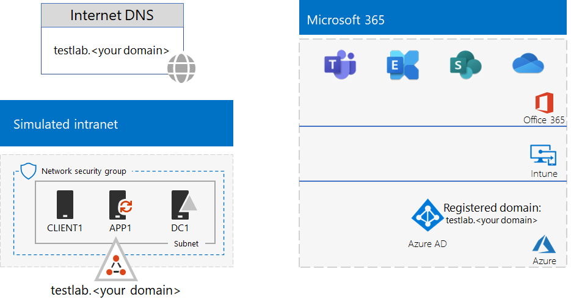

# <a name="federated-identity-for-your-microsoft-365-test-environment"></a>Identidade federada para o seu ambiente de teste do Microsoft 365

*Este Guia de Laboratório de Teste pode ser usado para ambientes de teste do Microsoft 365 para empresas e do Office 365 Enterprise.*

O Microsoft 365 suporta a identidade federada. Isto significa que em vez de executar a validação das credenciais em si, o Microsoft 365 remete o utilizador de ligação a um servidor de autenticação federado que o Microsoft 365 confia. Se as credenciais do usuário estiverem corretas, o servidor de autenticação federado emite um token de segurança que, por sua vez, o cliente envia ao Microsoft 365 como prova de autenticação. A identidade federada permite o descarregamento e a ampliação da autenticação para uma inscrição no Microsoft 365 e cenários avançados de autenticação e segurança.
  
Este artigo descreve como configurar a autenticação federada para seu ambiente de teste do Microsoft 365, resultando no seguinte:


  
Esta configuração consiste em:
  
- Uma assinatura de avaliação ou produção do Microsoft 365 E5.
    
- Uma intranet de organização simplificada conectada à Internet, consistindo em cinco máquinas virtuais em uma sub-rede de uma rede virtual do Azure (DC1, APP1, CLIENT1, ADFS1 e PROXY1). O Azure AD Connect é executado no APP1 para sincronizar a lista de contas no domínio dos Serviços de Domínio Active Directory com o Microsoft 365. O PROXY1 recebe as solicitações de autenticação de entrada. O ADFS1 valida credenciais com DC1 e emite tokens de segurança.
    
A configuração desse ambiente de teste envolve cinco fases:
- [Fase 1: configurar a sincronização de hash de senha do ambiente de teste do Microsoft 365](#phase-1-configure-password-hash-synchronization-for-your-microsoft-365-test-environment)
- [Fase 2: Criar o servidor AD FS](#phase-2-create-the-ad-fs-server)
- [Fase 3: crie o servidor de proxy da web](#phase-3-create-the-web-proxy-server)
- [Fase 4: crie um certificado autoassinado e configure o ADFS1 e o PROXY1](#phase-4-create-a-self-signed-certificate-and-configure-adfs1-and-proxy1)
- [Fase 5: configure o Microsoft 365 da identidade federada.](#phase-5-configure-microsoft-365-for-federated-identity)
    
> [!NOTE]
> Você não pode configurar esse ambiente de teste com uma assinatura de avaliação do Azure.
  
## <a name="phase-1-configure-password-hash-synchronization-for-your-microsoft-365-test-environment"></a>Fase 1: configurar a sincronização de hash de senha do ambiente de teste do Microsoft 365

Siga as instruções na [sincronização de hash de senha do Microsoft 365.](password-hash-sync-m365-ent-test-environment.md) A configuração resultante tem esta aparência:
  

  
Esta configuração consiste em:
  
- Uma assinatura paga ou de avaliação do Microsoft 365 E5.
- Uma intranet de organização simplificada conectada à Internet, que consiste nas máquinas virtuais DC1, APP1 e CLIENT1 em uma sub-rede de uma rede virtual do Azure. O Azure AD Connect é executado no APP1 para sincronizar periodicamente o domínio testlab dos Serviços de Domínio Active Directory (AD DS) com o locatário do Azure AD de suas assinaturas do Microsoft 365.

## <a name="phase-2-create-the-ad-fs-server"></a>Fase 2: Criar o servidor AD FS

Um servidor AD FS fornece autenticação federada entre o Microsoft 365 e as contas no domínio corp.contoso.com hospedado no DC1.
  
Para criar uma máquina virtual do Azure para ADFS1, preencha o nome da assinatura e do grupo de recursos, o local do Azure para a Configuração da base e execute estes comandos no prompt de comando do Azure PowerShell no computador local.
  
```powershell
$subscrName="<your Azure subscription name>"
$rgName="<the resource group name of your Base Configuration>"
$vnetName="TlgBaseConfig-01-VNET"
# NOTE: If you built your simulated intranet with Azure PowerShell, comment the previous line with a "#" and remove the "#" from the next line.
#$vnetName="TestLab"
Connect-AzAccount
Select-AzSubscription -SubscriptionName $subscrName
$staticIP="10.0.0.100"
$locName=(Get-AzResourceGroup -Name $rgName).Location
$vnet=Get-AzVirtualNetwork -Name $vnetName -ResourceGroupName $rgName
$pip = New-AzPublicIpAddress -Name ADFS1-PIP -ResourceGroupName $rgName -Location $locName -AllocationMethod Dynamic
$nic = New-AzNetworkInterface -Name ADFS1-NIC -ResourceGroupName $rgName -Location $locName -SubnetId $vnet.Subnets[0].Id -PublicIpAddressId $pip.Id -PrivateIpAddress $staticIP
$vm=New-AzVMConfig -VMName ADFS1 -VMSize Standard_D2_v2
$cred=Get-Credential -Message "Type the name and password of the local administrator account for ADFS1."
$vm=Set-AzVMOperatingSystem -VM $vm -Windows -ComputerName ADFS1 -Credential $cred -ProvisionVMAgent -EnableAutoUpdate
$vm=Set-AzVMSourceImage -VM $vm -PublisherName MicrosoftWindowsServer -Offer WindowsServer -Skus 2016-Datacenter -Version "latest"
$vm=Add-AzVMNetworkInterface -VM $vm -Id $nic.Id
$vm=Set-AzVMOSDisk -VM $vm -Name "ADFS-OS" -DiskSizeInGB 128 -CreateOption FromImage -StorageAccountType "Standard_LRS"
New-AzVM -ResourceGroupName $rgName -Location $locName -VM $vm
```

Em seguida, use o [portal do Azure](https://portal.azure.com) para se conectar à máquina virtual do ADFS1 usando o nome da conta e a senha do administrador local do ADFS1, depois abra um prompt de comando do Windows PowerShell.
  
Para verificar a comunicação da rede e a resolução de nome entre o ADFS1 e o DC1, execute o comando **ping dc1.corp.contoso.com** e verifique se há quatro respostas.
  
Em seguida, associe a máquina virtual do ADFS1 ao domínio CORP com estes comandos no prompt do Windows PowerShell no ADFS1.
  
```powershell
$cred=Get-Credential -UserName "CORP\User1" -Message "Type the User1 account password."
Add-Computer -DomainName corp.contoso.com -Credential $cred
Restart-Computer
```

A configuração resultante tem esta aparência:
  

  
## <a name="phase-3-create-the-web-proxy-server"></a>Fase 3: crie o servidor de proxy da web

O PROXY1 fornece proxy de mensagens de autenticação entre ADFS1 e os usuários que tentarem se autenticar.
  
Para criar uma máquina virtual do Azure para o PROXY1, preencha o nome do grupo de recursos e execute estes comandos no prompt de comando do Azure PowerShell no computador local.
  
```powershell
$rgName="<the resource group name of your Base Configuration>"
$vnetName="TlgBaseConfig-01-VNET"
# NOTE: If you built your simulated intranet with Azure PowerShell, comment the previous line with a "#" and remove the "#" from the next line.
#$vnetName="TestLab"
$staticIP="10.0.0.101"
$locName=(Get-AzResourceGroup -Name $rgName).Location
$vnet=Get-AzVirtualNetwork -Name $vnetName -ResourceGroupName $rgName
$pip = New-AzPublicIpAddress -Name PROXY1-PIP -ResourceGroupName $rgName -Location $locName -AllocationMethod Static
$nic = New-AzNetworkInterface -Name PROXY1-NIC -ResourceGroupName $rgName -Location $locName -SubnetId $vnet.Subnets[0].Id -PublicIpAddressId $pip.Id -PrivateIpAddress $staticIP
$vm=New-AzVMConfig -VMName PROXY1 -VMSize Standard_D2_v2
$cred=Get-Credential -Message "Type the name and password of the local administrator account for PROXY1."
$vm=Set-AzVMOperatingSystem -VM $vm -Windows -ComputerName PROXY1 -Credential $cred -ProvisionVMAgent -EnableAutoUpdate
$vm=Set-AzVMSourceImage -VM $vm -PublisherName MicrosoftWindowsServer -Offer WindowsServer -Skus 2016-Datacenter -Version "latest"
$vm=Add-AzVMNetworkInterface -VM $vm -Id $nic.Id
$vm=Set-AzVMOSDisk -VM $vm -Name "PROXY1-OS" -DiskSizeInGB 128 -CreateOption FromImage -StorageAccountType "Standard_LRS"
New-AzVM -ResourceGroupName $rgName -Location $locName -VM $vm
```

> [!NOTE]
> Um endereço IP estático público é atribuído ao PROXY1 porque você cria um registro DNS público que aponta para ele e não deverá ser alterado ao reiniciar a máquina virtual do PROXY1.
  
Em seguida, adicione uma regra ao grupo de segurança de rede da sub-rede CorpNet para permitir o tráfego de entrada não solicitado da Internet para o endereço IP privado do PROXY1 e a porta TCP 443. Execute estes comandos no prompt de comando do Azure PowerShell no computador local.
  
```powershell
$rgName="<the resource group name of your Base Configuration>"
Get-AzNetworkSecurityGroup -Name CorpNet -ResourceGroupName $rgName | Add-AzNetworkSecurityRuleConfig -Name "HTTPS-to-PROXY1" -Description "Allow TCP 443 to PROXY1" -Access "Allow" -Protocol "Tcp" -Direction "Inbound" -Priority 101 -SourceAddressPrefix "Internet" -SourcePortRange "*" -DestinationAddressPrefix "10.0.0.101" -DestinationPortRange "443" | Set-AzNetworkSecurityGroup
```

Em seguida, use o [portal do Azure](https://portal.azure.com) para se conectar à máquina virtual do PROXY1 usando o nome e a senha da conta do administrador local do PROXY1, depois abra um prompt de comando do Windows PowerShell no PROXY1.
  
Para verificar a comunicação da rede e a resolução de nome entre o PROXY1 e o DC1, execute o comando **ping dc1.corp.contoso.com** e verifique se há quatro respostas.
  
Em seguida, associe a máquina virtual do PROXY1 ao domínio CORP com estes comandos no prompt do Windows PowerShell no PROXY1.
  
```powershell
$cred=Get-Credential -UserName "CORP\User1" -Message "Type the User1 account password."
Add-Computer -DomainName corp.contoso.com -Credential $cred
Restart-Computer
```

Exibe o endereço IP público do PROXY1 com estes comandos do Azure PowerShell no computador local.
  
```powershell
Write-Host (Get-AzPublicIpaddress -Name "PROXY1-PIP" -ResourceGroup $rgName).IPAddress
```

Em seguida, trabalhe com seu provedor de DNS público e crie um novo registro público de DNS A para **fs.testlab.**\<*your DNS domain name*>que resolve para o endereço IP exibido pelo comando **Write-Host**. De agora em diante, o **fs.testlab.**\<*your DNS domain name*>seu nome de domínio DNS> é conhecido como o *FQDN do serviço de federação*.
  
Em seguida, use o [portal do Azure](https://portal.azure.com) para se conectar à máquina virtual DC1 usando as credenciais CORP\\Usuário1 e execute este comando em um prompt de comando do Windows PowerShell de nível de administrador:
  
```powershell
Add-DnsServerPrimaryZone -Name corp.contoso.com -ZoneFile corp.contoso.com.dns
Add-DnsServerResourceRecordA -Name "fs" -ZoneName corp.contoso.com -AllowUpdateAny -IPv4Address "10.0.0.100" -TimeToLive 01:00:00
```
Esses comandos criam um registro DNS A interno para que as máquinas virtuais na rede virtual do Azure possam resolver o FQDN do serviço de federação interno para o endereço IP privado do ADFS1.
  
A configuração resultante tem esta aparência:
  

  
## <a name="phase-4-create-a-self-signed-certificate-and-configure-adfs1-and-proxy1"></a>Fase 4: crie um certificado autoassinado e configure o ADFS1 e o PROXY1

Nesta fase, crie um certificado digital autoassinado para o seu FQDN de serviço de federação e configure o ADFS1 e o PROXY1 como um farm do AD FS.
  
Em seguida, use o [portal do Azure](https://portal.azure.com) para se conectar à máquina virtual DC1 usando as credenciais CORP\\Usuário1 e abra um prompt de comando de nível de administrador do Windows PowerShell:
  
Em seguida, crie uma conta de serviço do AD FS com este comando no prompt de comando do Windows PowerShell no DC1:
  
```powershell
New-ADUser -SamAccountName ADFS-Service -AccountPassword (read-host "Set user password" -assecurestring) -name "ADFS-Service" -enabled $true -PasswordNeverExpires $true -ChangePasswordAtLogon $false
```
Observe que esse comando solicita que você fornece a senha da conta. Escolha uma senha forte e grave-a em um local seguro. Você precisará dela para esta fase e para a Fase 5.
  
Use o [portal do Azure](https://portal.azure.com) para se conectar à máquina virtual ADFS1 usando as credenciais CORP\\Usuário1. Abra um prompt de comando do Windows PowerShell de nível de administrador no ADFS1, preencha o FQDN de serviço de Federação e execute estes comandos para criar um certificado autoassinado:
  
```powershell
$fedServiceFQDN="<federation service FQDN>"
New-SelfSignedCertificate -DnsName $fedServiceFQDN -CertStoreLocation "cert:\LocalMachine\My"
New-Item -path c:\Certs -type directory
New-SmbShare -name Certs -path c:\Certs -changeaccess CORP\User1
```

Em seguida, use estas etapas para salvar o novo certificado autoassinado como um arquivo.
  
1. Selecione **Iniciar,** digite **mmc.exe** e pressione **Enter**.
    
2. Selecione   >  **Adicionar/Remover Snap-in de Arquivo.**
    
3. Em **Adicionar ou Remover Snap-ins,** clique duas vezes em **Certificados** na lista de snap-ins disponíveis, selecione Conta de computador e selecione **Próximo**.
    
4. Em **Selecionar Computador,** selecione **Concluir** e, em seguida, selecione **OK**.
    
5. No painel da árvore, abra **Certificados (Computador Local) > Pessoal > Certificados**.
    
6. Selecione e segure (ou clique com o botão direito do mouse) no certificado com o FQDN do serviço de federação, selecione Todas as tarefas e selecione **Exportar.**
    
7. Na página **de boas-vindas,** selecione **Próximo**.
    
8. Na página **Exportar chave privada,** selecione **Sim** e, em seguida, selecione **Próximo**.
    
9. Na página **Exportar Formato de Arquivo,** selecione **Exportar todas as propriedades estendidas** e, em seguida, selecione **Próximo**.
    
10. Na página **Segurança,** selecione **Senha e** insira uma senha em **Senha** e **Confirme a senha.**
    
11. Na página **Arquivo a Ser Exportado,** selecione **Procurar**.
    
12. Navegue até **a pasta C: \\ Certs,** insira **SSL** no **nome** do arquivo e selecione **Salvar.**
    
13. Na página **Arquivo a Ser Exportado,** selecione **Próximo**.
    
14. Na página **Concluindo o Assistente para Exportação de Certificados,** selecione **Concluir.** Quando solicitado, selecione **OK**.
    
Depois instale o serviço do AD FS usando esse comando no prompt de comando do Windows PowerShell em ADFS1:
  
```powershell
Install-WindowsFeature ADFS-Federation -IncludeManagementTools
```

Aguarde a instalação ser concluída.
  
Em seguida, configure o serviço do AD FS com estas etapas:
  
1. Selecione **Iniciar** e, em seguida, selecione o **ícone do Gerenciador do** Servidor.
    
2. No painel de árvore do Gerenciador do Servidor, selecione **AD FS**.
    
3. Na barra de ferramentas na parte superior, selecione o símbolo de cuidado laranja e, em seguida, selecione Configurar o serviço de **federação neste servidor.**
    
4. Na página **de boas-vindas** do Assistente de Configuração dos Serviços de Federação do Active Directory , selecione **Próximo**.
    
5. Na página **Conectar-se ao AD DS,** selecione **Próximo**.
    
6. Na página **Especificar Propriedades do Serviço**:
    
  - Para **Certificado SSL,** selecione a seta para baixo e selecione o certificado com o nome do FQDN do serviço de federação.
    
  - Em **Nome de Exibição do Serviço de Federação,** insira o nome da sua organização fictícia.
    
  - Selecione **Avançar**.
    
7. Na página **Especificar Conta de Serviço,** selecione **Selecionar** nome **da conta.**
    
8. Em **Selecionar Usuário ou Conta de Serviço,** insira **ADFS-Service**, selecione **Verificar Nomes** e selecione **OK**.
    
9. In **Account Password**, enter the password for the ADFS-Service account, and then select **Next**.
    
10. Na página Especificar **Banco de Dados de Configuração,** selecione **Próximo**.
    
11. Na página **Opções de Revisão,** selecione **Próximo**.
    
12. Na página **Verificações de Pré-requisitos,** selecione **Configurar**.

13. Na página **Resultados,** selecione **Fechar**.
    
14. Selecione **Iniciar,** selecione o ícone de energia, selecione **Reiniciar** e, em seguida, **selecione Continuar**.
    
No [portal do Azure](https://portal.azure.com), conecte-se ao PROXY1 com as credenciais da conta CORP\\Usuário1.
  
Em seguida, use estas etapas para instalar o certificado autoassinado em **ambos PROXY1 e APP1**.
  
1. Selecione **Iniciar,** digite **mmc.exe** e pressione **Enter**.
    
2. Selecione **Arquivo > Adicionar/Remover Snap-in.**
    
3. Em **Adicionar ou Remover Snap-ins,** clique duas vezes em **Certificados** na lista de snap-ins disponíveis, selecione Conta de computador e selecione **Próximo**.
    
4. Em **Selecionar Computador,** selecione **Concluir** e, em seguida, selecione **OK**.
    
5. No painel de árvore, abra **Certificados Pessoais (Computador**  >    >  Local).
    
6. Selecione e segure (ou clique com o botão direito do mouse) **Pessoal,** selecione **Todas as** tarefas e selecione **Importar**.
    
7. Na página **de boas-vindas,** selecione **Próximo**.
    
8. Na página **Arquivo a ser Importado,** insira **\\ \\ adfs1 \\ certs \\ ssl.pfx** e selecione **Next**.
    
9. Na página **Proteção de chave privada,** insira a senha do certificado em **Senha** e selecione **Próximo.**
    
10. Na página **Armazenamento de certificados,** selecione **Próximo.**
    
11. Na página **Concluindo,** selecione **Concluir**.
    
12. Na página **Armazenamento de Certificados,** selecione **Próximo**.
    
13. Quando solicitado, selecione **OK**.
    
14. No painel de árvore, selecione **Certificados.**
    
15. Selecione e segure (ou clique com o botão direito do mouse) no certificado e selecione **Copiar.**
    
16. No painel de árvore, abra Certificados de Autoridades de **Certificação**  >  **Confiáveis.**
    
17. Mova o ponteiro do mouse para baixo da lista de certificados instalados, selecione e segure (ou clique com o botão direito do mouse) e selecione **Colar.**
    
Abra um prompt de comando do Windows PowerShell de nível de administrador e execute o seguinte comando:
  
```powershell
Install-WindowsFeature Web-Application-Proxy -IncludeManagementTools
```

Aguarde a instalação ser concluída.
  
Use estas etapas para configurar o serviço de proxy de aplicativo web para usar o ADFS1 como seu servidor de federação:
  
1. Selecione **Iniciar** e Gerenciador do **Servidor.**
    
2. No painel de árvore, selecione **Acesso Remoto.**
    
3. Na barra de ferramentas na parte superior, selecione o símbolo de cuidado laranja e, em seguida, selecione Abrir o Assistente **de Proxy de Aplicativo da Web.**
    
4. Na página **de boas-vindas** do Assistente de Configuração de Proxy de Aplicativo Web, selecione **Próximo**.
    
5. Na página **Servidor de Federação**:
    
  - Na caixa **nome do serviço de Federação,** insira o FQDN do serviço de federação.
    
  - Na caixa **Nome de** usuário, digite **CORP \\ User1**.
    
  - Na caixa **Senha,** digite a senha da conta Usuário1.
    
  - Selecione **Avançar**.
    
6. Na página Certificado proxy **do AD FS,** selecione a seta para baixo, selecione o certificado com o FQDN do serviço de federação e selecione **Próximo.**
    
7. Na página **Confirmação,** selecione **Configurar**.
    
8. Na página **Resultados,** selecione **Fechar**.
    
## <a name="phase-5-configure-microsoft-365-for-federated-identity"></a>Fase 5: configure o Microsoft 365 da identidade federada.

Use o [portal do Azure](https://portal.azure.com) para conectar a máquina virtual APP1 com as credenciais da conta CORP\\Usuário1.
  
Use estas etapas para configurar o Azure AD Connect e sua assinatura do Microsoft 365 da autenticação federada:
  
1. Na área de trabalho, clique duas vezes em **Azure AD Connect**.
    
2. Na página **Bem-vindo ao Azure AD Connect,** selecione **Configurar.**
    
3. Na página **Tarefas adicionais,** selecione **Alterar login do usuário** e, em seguida, selecione **Próximo**.
    
4. Na página **Conectar-se ao Azure AD,** insira o nome e a senha da sua conta de administrador global e selecione **Next.**
    
5. Na página **De usuário, selecione** **Federação com AD FS** e, em seguida, selecione **Próximo**.
    
6. Na página do farm do **AD FS,** selecione Usar um farm do  **AD FS** existente, insira **ADFS1** na caixa Nome do Servidor e selecione **Próximo.**
    
7. Quando solicitado a inserir credenciais de servidor, insira as credenciais da conta CORP User1 e \\ selecione **OK**.
    
8. Na página **Credenciais de Administrador** de Domínio,  insira **CORP \\ User1** na  caixa Nome de usuário, digite a senha da conta na caixa Senha e selecione **Next**.
    
9. Na página da conta de serviço do **AD FS,** insira  **CORP \\ ADFS-Service** na caixa Nome de Usuário do Domínio, digite a senha da conta na caixa Senha do Usuário de Domínio e selecione **Próximo**. 
    
10. Na página Domínio do **Azure AD,** em **Domínio,** selecione o nome do domínio que você criou e adicionou anteriormente à sua assinatura na Fase 1 e, em seguida, selecione **Próximo**.
    
11. Na página **Pronto para configurar,** selecione **Configurar**.
    
12. Na página **Instalação completa,** selecione **Verificar**.
    
    Você deverá ver mensagens indicando que a configuração da intranet e da Internet foi verificada.
    
13. Na página **Instalação completa,** selecione **Sair**.
    
Para demonstrar que a autenticação federada está funcionando, faça o seguinte:
  
1. Abra uma nova instância privada no navegador do computador local e acesse [https://admin.microsoft.com](https://admin.microsoft.com).
    
2. Para as credenciais de entrada, insira **user1@.** \<*the domain created in Phase 1*>
    
    Por exemplo, se seu domínio de teste **testlab.contoso.com**, digite "user1@testlab.contoso.com". Pressione a **tecla Tab** ou permita que o Microsoft 365 o redirecione automaticamente.
    
    Agora você deverá ver que **sua conexão não é uma página** privada. Você está vendo isso porque instalou um certificado auto-assinado no ADFS1 que seu computador desktop não consegue validar. Em uma implantação de produção de autenticação federada, você usaria um certificado de uma autoridade de certificação confiável e seus usuários não veriam essa página.
    
3. Na página **Sua conexão não é privada,** selecione **Avançado** e, em seguida, selecione **Prosseguir para \<*your federation service FQDN*>**. 
    
4. Na página com o nome da sua organização fictícia, entre com o seguinte:
    
  - **CORP\\Usuário1** como o nome
    
  - A senha da conta Usuário1
    
    Você verá a **home page do Microsoft Office**.
    
Esse procedimento demonstra que sua assinatura de avaliação está federada com o domínio AD DS corp.contoso.com hospedado no DC1. Aqui estão os conceitos básicos do processo de autenticação:
  
1. Quando você usa o domínio federado criado na Fase 1 no nome da conta de login, o Microsoft 365 redireciona o navegador para o seu serviço de federação FQDN e PROXY1.
    
2. PROXY1 envia a página de entrada da empresa fictícia para o seu computador local.
    
3. Quando você envia CORP\\Usuário1 e a senha PROXY1, ele o encaminha para o ADFS1.
    
4. O ADFS1 valida CORP\\Usuário1 e a senha com o DC1 e envia um token de segurança para o seu computador local.
    
5. Seu computador local envia o token de segurança para o Microsoft 365.
    
6. O Microsoft 365 valida que o token de segurança foi criado pelo ADFS1 e permite o acesso.
    
Sua assinatura de avaliação já está configurada com autenticação federada. Você pode usar esse ambiente de desenvolvimento/teste dos cenários de autenticação avançados.
  
## <a name="next-step"></a>Próxima etapa

Quando estiver pronto para implantar a autenticação federada pronta para produção e alta disponibilidade para o Microsoft 365 no Azure, confira Implantar a autenticação federada de alta disponibilidade para [o Microsoft 365 no Azure.](deploy-high-availability-federated-authentication-for-microsoft-365-in-azure.md)
  
