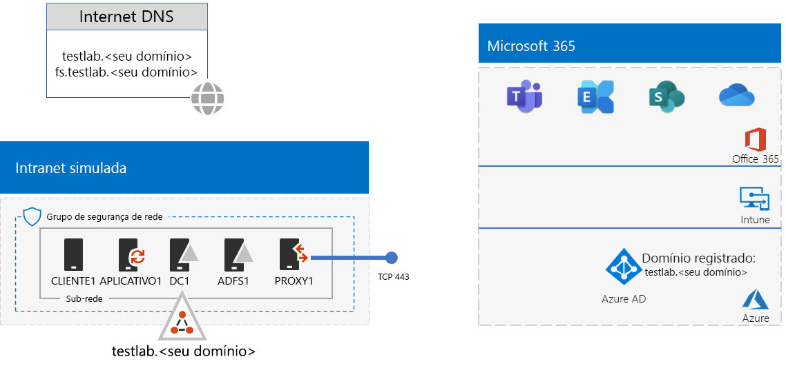
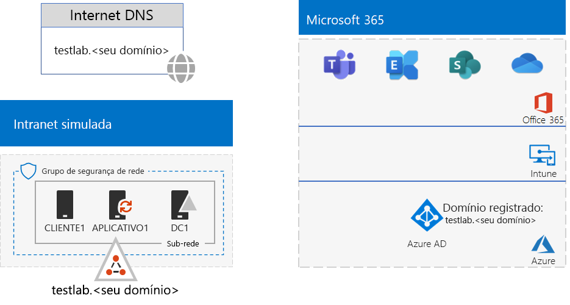
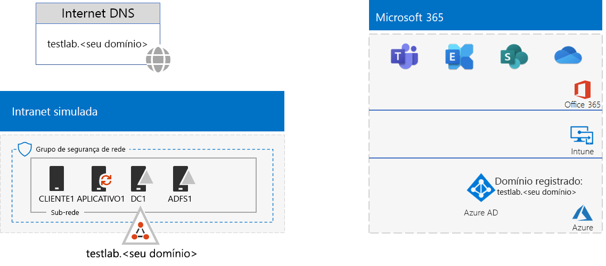

# <a name="federated-identity-for-your-microsoft-365-test-environment"></a><span data-ttu-id="84216-103">Identidade federada para o seu ambiente de teste do Microsoft 365</span><span class="sxs-lookup"><span data-stu-id="84216-103">Federated identity for your Microsoft 365 test environment</span></span>

<span data-ttu-id="84216-104">*Este Guia de Laboratório de Testes pode ser usado para ambientes de teste do Microsoft 365 Enterprise e do Office 365 Enterprise.*</span><span class="sxs-lookup"><span data-stu-id="84216-104">*This Test Lab Guide can be used for both Microsoft 365 Enterprise and Office 365 Enterprise test environments.*</span></span>

<span data-ttu-id="84216-p101">O Office 365 dá suporte à identidade federada, ou seja, em vez de executar a validação de credenciais em si, o Office 365 refere-se a conectar o usuário a um servidor de autenticação federada em que o Office 365 confia. Se as credenciais do usuário estiverem corretas, o servidor de autenticação federada emite um token de segurança que o cliente envia ao Office 365 como prova de autenticação. A identidade federada permite a liberação e a ampliação da autenticação para uma assinatura do Office 365 e cenários avançados de autenticação e segurança.</span><span class="sxs-lookup"><span data-stu-id="84216-p101">Office 365 supports federated identity. This means that instead of performing the validation of credentials itself, Office 365 refers the connecting user to a federated authentication server that Office 365 trusts. If the user's credentials are correct, the federated authentication server issues a security token that the client then sends to Office 365 as proof of authentication. Federated identity allows for the offloading and scaling up of authentication for an Office 365 subscription and advanced authentication and security scenarios.</span></span>
  
<span data-ttu-id="84216-109">Este artigo descreve como você pode configurar a autenticação federada para o seu ambiente de teste do Microsoft 365 ou Office 365, resultando no seguinte:</span><span class="sxs-lookup"><span data-stu-id="84216-109">This article describes how you can configure federated authentication for your Microsoft 365 or Office 365 test environment, resulting in the following:</span></span>


  
<span data-ttu-id="84216-111">Esta configuração consiste em:</span><span class="sxs-lookup"><span data-stu-id="84216-111">This configuration consists of:</span></span> 
  
- <span data-ttu-id="84216-112">Uma assinatura de avaliação ou de produção do Microsoft 365 E5 ou Office 365 E5.</span><span class="sxs-lookup"><span data-stu-id="84216-112">A Microsoft 365 E5 or Office 365 E5 trial or production subscription.</span></span>
    
- <span data-ttu-id="84216-p102">Uma intranet simplificada da organização, conectada à Internet, consistindo em cinco máquinas virtuais na sub-rede de uma rede virtual Azure (DC1, APP1, CLIENT1, ADFS1 e PROXY1). O Azure AD Connect é executado no APP1 para sincronizar a lista de contas no domínio do Active Directory Domain Services ao Office 365. O PROXY1 recebe as solicitações de autenticação de entrada. O ADFS1 valida as credenciais com o DC1 e emite tokens de segurança.</span><span class="sxs-lookup"><span data-stu-id="84216-p102">A simplified organization intranet connected to the Internet, consisting of five virtual machines on a subnet of an Azure virtual network (DC1, APP1, CLIENT1, ADFS1, and PROXY1). Azure AD Connect runs on APP1 to synchronize the list of accounts in the Active Directory Domain Services domain to Office 365. PROXY1 receives the incoming authentication requests. ADFS1 validates credentials with DC1 and issues security tokens.</span></span>
    
<span data-ttu-id="84216-117">Há cinco etapas para configurar esse ambiente de teste:</span><span class="sxs-lookup"><span data-stu-id="84216-117">There are five phases to setting up this test environment:</span></span>
  
1. <span data-ttu-id="84216-118">Criar o ambiente de teste de empresa simulada com sincronização de hash de senha.</span><span class="sxs-lookup"><span data-stu-id="84216-118">Create the simulated enterprise test environment with password hash synchronization.</span></span>
    
2. <span data-ttu-id="84216-119">Crie o servidor AD FS (ADFS1).</span><span class="sxs-lookup"><span data-stu-id="84216-119">Create the AD FS server (ADFS1).</span></span>
    
3. <span data-ttu-id="84216-120">Crie o servidor de proxy da web (PROXY1).</span><span class="sxs-lookup"><span data-stu-id="84216-120">Create the web proxy server (PROXY1).</span></span>
    
4. <span data-ttu-id="84216-121">Crie um certificado autoassinado e configure o ADFS1 e o PROXY1.</span><span class="sxs-lookup"><span data-stu-id="84216-121">Create a self-signed certificate and configure ADFS1 and PROXY1.</span></span>
    
5. <span data-ttu-id="84216-122">Configure o Office 365 com a identidade federada.</span><span class="sxs-lookup"><span data-stu-id="84216-122">Configure Office 365 for federated identity.</span></span>
    
> [!NOTE]
> <span data-ttu-id="84216-123">Você não pode configurar o ambiente de teste com uma assinatura de avaliação do Azure.</span><span class="sxs-lookup"><span data-stu-id="84216-123">You cannot configure this test environment with an Azure Trial subscription.</span></span> 
  
## <a name="phase-1-configure-password-hash-synchronization-for-your-microsoft-365-test-environment"></a><span data-ttu-id="84216-124">Fase 1: configurar a sincronização de hash de senha do ambiente de teste do Microsoft 365</span><span class="sxs-lookup"><span data-stu-id="84216-124">Phase 1: Configure password hash synchronization for your Microsoft 365 test environment</span></span>

<span data-ttu-id="84216-p103">Siga as instruções em [sincronização de hash de senha para o Microsoft 365](password-hash-sync-m365-ent-test-environment.md). Aqui está a configuração resultante.</span><span class="sxs-lookup"><span data-stu-id="84216-p103">Follow the instructions in [password hash synchronization for Microsoft 365](password-hash-sync-m365-ent-test-environment.md). Here is your resulting configuration.</span></span>
  

  
<span data-ttu-id="84216-128">Esta configuração consiste em:</span><span class="sxs-lookup"><span data-stu-id="84216-128">This configuration consists of:</span></span> 
  
- <span data-ttu-id="84216-129">Uma assinatura de avaliação ou assinatura paga do Microsoft 365 E5 ou Office 365 E5.</span><span class="sxs-lookup"><span data-stu-id="84216-129">A Microsoft 365 E5 or Office 365 E5 trial or paid subscriptions.</span></span>
- <span data-ttu-id="84216-130">Uma intranet de organização simplificada conectado à Internet, que consiste em máquinas virtuais do DC1 APP1 e CLIENT1 em uma sub-rede de uma rede virtual do Azure.</span><span class="sxs-lookup"><span data-stu-id="84216-130">A simplified organization intranet connected to the Internet, consisting of the DC1, APP1, and CLIENT1 virtual machines on a subnet of an Azure virtual network.</span></span> <span data-ttu-id="84216-131">O Azure Ad Connect é executado periodicamente no APP1 para sincronizar o domínio TESTLAB do AD DS com o locatário do Azure AD de suas assinaturas do Microsoft 365 ou Office 365.</span><span class="sxs-lookup"><span data-stu-id="84216-131">Azure AD Connect runs on APP1 to synchronize the TESTLAB AD DS domain to the Azure AD tenant of your Microsoft 365 or Office 365 subscriptions periodically.</span></span>

## <a name="phase-2-create-the-ad-fs-server"></a><span data-ttu-id="84216-132">Fase 2: Criar o servidor AD FS</span><span class="sxs-lookup"><span data-stu-id="84216-132">Phase 2: Create the AD FS server</span></span>

<span data-ttu-id="84216-133">Um servidor do AD FS fornece autenticação federada entre o Office 365 e contas do domínio corp.contoso.com hospedado no DC1.</span><span class="sxs-lookup"><span data-stu-id="84216-133">An AD FS server provides federated authentication between Office 365 and the accounts in the corp.contoso.com domain hosted on DC1.</span></span>
  
<span data-ttu-id="84216-134">Para criar uma máquina virtual do Azure para ADFS1, preencha o nome da assinatura e do grupo de recursos, o local do Azure para a Configuração da base e execute estes comandos no prompt de comando do Azure PowerShell no computador local.</span><span class="sxs-lookup"><span data-stu-id="84216-134">To create an Azure virtual machine for ADFS1, fill in the name of your subscription and the resource group and Azure location for your Base Configuration, and then run these commands at the Azure PowerShell command prompt on your local computer.</span></span>
  
```powershell
$subscrName="<your Azure subscription name>"
$rgName="<the resource group name of your Base Configuration>"
$vnetName="TlgBaseConfig-01-VNET"
# NOTE: If you built your simulated intranet with Azure PowerShell, comment the previous line with a "#" and remove the "#" from the next line.
#$vnetName="TestLab"
Connect-AzAccount
Select-AzSubscription -SubscriptionName $subscrName
$staticIP="10.0.0.100"
$locName=(Get-AzResourceGroup -Name $rgName).Location
$vnet=Get-AzVirtualNetwork -Name $vnetName -ResourceGroupName $rgName
$pip = New-AzPublicIpAddress -Name ADFS1-PIP -ResourceGroupName $rgName -Location $locName -AllocationMethod Dynamic
$nic = New-AzNetworkInterface -Name ADFS1-NIC -ResourceGroupName $rgName -Location $locName -SubnetId $vnet.Subnets[0].Id -PublicIpAddressId $pip.Id -PrivateIpAddress $staticIP
$vm=New-AzVMConfig -VMName ADFS1 -VMSize Standard_D2_v2
$cred=Get-Credential -Message "Type the name and password of the local administrator account for ADFS1."
$vm=Set-AzVMOperatingSystem -VM $vm -Windows -ComputerName ADFS1 -Credential $cred -ProvisionVMAgent -EnableAutoUpdate
$vm=Set-AzVMSourceImage -VM $vm -PublisherName MicrosoftWindowsServer -Offer WindowsServer -Skus 2016-Datacenter -Version "latest"
$vm=Add-AzVMNetworkInterface -VM $vm -Id $nic.Id
$vm=Set-AzVMOSDisk -VM $vm -Name "ADFS-OS" -DiskSizeInGB 128 -CreateOption FromImage -StorageAccountType "Standard_LRS"
New-AzVM -ResourceGroupName $rgName -Location $locName -VM $vm
```

<span data-ttu-id="84216-135">Em seguida, use o [portal do Azure](https://portal.azure.com) para se conectar à máquina virtual do ADFS1 usando o nome da conta e a senha do administrador local do ADFS1, depois abra um prompt de comando do Windows PowerShell.</span><span class="sxs-lookup"><span data-stu-id="84216-135">Next, use the [Azure portal](https://portal.azure.com) to connect to the ADFS1 virtual machine using the ADFS1 local administrator account name and password, and then open a Windows PowerShell command prompt.</span></span>
  
<span data-ttu-id="84216-136">Para verificar a comunicação da rede e a resolução de nome entre o ADFS1 e o DC1, execute o comando **ping dc1.corp.contoso.com** e verifique se há quatro respostas.</span><span class="sxs-lookup"><span data-stu-id="84216-136">To check name resolution and network communication between ADFS1 and DC1, run the **ping dc1.corp.contoso.com** command and check that there are four replies.</span></span>
  
<span data-ttu-id="84216-137">Em seguida, associe a máquina virtual do ADFS1 ao domínio CORP com estes comandos no prompt do Windows PowerShell no ADFS1.</span><span class="sxs-lookup"><span data-stu-id="84216-137">Next, join the ADFS1 virtual machine to the CORP domain with these commands at the Windows PowerShell prompt on ADFS1.</span></span>
  
```powershell
$cred=Get-Credential -UserName "CORP\User1" -Message "Type the User1 account password."
Add-Computer -DomainName corp.contoso.com -Credential $cred
Restart-Computer
```

<span data-ttu-id="84216-138">Esta é a configuração resultante.</span><span class="sxs-lookup"><span data-stu-id="84216-138">Here is your resulting configuration.</span></span>
  

  
## <a name="phase-3-create-the-web-proxy-server"></a><span data-ttu-id="84216-140">Fase 3: crie o servidor de proxy da web</span><span class="sxs-lookup"><span data-stu-id="84216-140">Phase 3: Create the web proxy server</span></span>

<span data-ttu-id="84216-141">O PROXY1 fornece proxy de mensagens de autenticação entre ADFS1 e os usuários que tentarem se autenticar.</span><span class="sxs-lookup"><span data-stu-id="84216-141">PROXY1 provides proxying of authentication messages between users trying to authenticate and ADFS1.</span></span>
  
<span data-ttu-id="84216-142">Para criar uma máquina virtual do Azure para o PROXY1, preencha o nome do grupo de recursos e execute estes comandos no prompt de comando do Azure PowerShell no computador local.</span><span class="sxs-lookup"><span data-stu-id="84216-142">To create an Azure virtual machine for PROXY1, fill in the name of your resource group and Azure location, and then run these commands at the Azure PowerShell command prompt on your local computer.</span></span>
  
```powershell
$rgName="<the resource group name of your Base Configuration>"
$vnetName="TlgBaseConfig-01-VNET"
# NOTE: If you built your simulated intranet with Azure PowerShell, comment the previous line with a "#" and remove the "#" from the next line.
#$vnetName="TestLab"
$staticIP="10.0.0.101"
$locName=(Get-AzResourceGroup -Name $rgName).Location
$vnet=Get-AzVirtualNetwork -Name $vnetName -ResourceGroupName $rgName
$pip = New-AzPublicIpAddress -Name PROXY1-PIP -ResourceGroupName $rgName -Location $locName -AllocationMethod Static
$nic = New-AzNetworkInterface -Name PROXY1-NIC -ResourceGroupName $rgName -Location $locName -SubnetId $vnet.Subnets[0].Id -PublicIpAddressId $pip.Id -PrivateIpAddress $staticIP
$vm=New-AzVMConfig -VMName PROXY1 -VMSize Standard_D2_v2
$cred=Get-Credential -Message "Type the name and password of the local administrator account for PROXY1."
$vm=Set-AzVMOperatingSystem -VM $vm -Windows -ComputerName PROXY1 -Credential $cred -ProvisionVMAgent -EnableAutoUpdate
$vm=Set-AzVMSourceImage -VM $vm -PublisherName MicrosoftWindowsServer -Offer WindowsServer -Skus 2016-Datacenter -Version "latest"
$vm=Add-AzVMNetworkInterface -VM $vm -Id $nic.Id
$vm=Set-AzVMOSDisk -VM $vm -Name "PROXY1-OS" -DiskSizeInGB 128 -CreateOption FromImage -StorageAccountType "Standard_LRS"
New-AzVM -ResourceGroupName $rgName -Location $locName -VM $vm
```

> [!NOTE]
> <span data-ttu-id="84216-143">Um endereço IP estático público é atribuído ao PROXY1 porque você cria um registro DNS público que aponta para ele e não deverá ser alterado ao reiniciar a máquina virtual do PROXY1.</span><span class="sxs-lookup"><span data-stu-id="84216-143">PROXY1 is assigned a static public IP address because you will create a public DNS record that points to it and it must not change when you restart the PROXY1 virtual machine.</span></span> 
  
<span data-ttu-id="84216-p105">Em seguida, adicione uma regra ao grupo de segurança de rede para a sub-rede da CorpNet para permitir o tráfego de entrada não solicitada da Internet para o endereço IP particular do PROXY1 e da porta 443 de TCP. Execute esses comandos no prompt de comando do Azure PowerShell no computador local.</span><span class="sxs-lookup"><span data-stu-id="84216-p105">Next, add a rule to the network security group for the CorpNet subnet to allow unsolicited inbound traffic from the Internet to PROXY1's private IP address and TCP port 443. Run these commands at the Azure PowerShell command prompt on your local computer.</span></span>
  
```powershell
$rgName="<the resource group name of your Base Configuration>"
Get-AzNetworkSecurityGroup -Name CorpNet -ResourceGroupName $rgName | Add-AzNetworkSecurityRuleConfig -Name "HTTPS-to-PROXY1" -Description "Allow TCP 443 to PROXY1" -Access "Allow" -Protocol "Tcp" -Direction "Inbound" -Priority 101 -SourceAddressPrefix "Internet" -SourcePortRange "*" -DestinationAddressPrefix "10.0.0.101" -DestinationPortRange "443" | Set-AzNetworkSecurityGroup
```

<span data-ttu-id="84216-146">Em seguida, use o [portal do Azure](https://portal.azure.com) para se conectar à máquina virtual do PROXY1 usando o nome e a senha da conta do administrador local do PROXY1, depois abra um prompt de comando do Windows PowerShell no PROXY1.</span><span class="sxs-lookup"><span data-stu-id="84216-146">Next, use the [Azure portal](https://portal.azure.com) to connect to the PROXY1 virtual machine using the PROXY1 local administrator account name and password, and then open a Windows PowerShell command prompt on PROXY1.</span></span>
  
<span data-ttu-id="84216-147">Para verificar a comunicação da rede e a resolução de nome entre o PROXY1 e o DC1, execute o comando **ping dc1.corp.contoso.com** e verifique se há quatro respostas.</span><span class="sxs-lookup"><span data-stu-id="84216-147">To check name resolution and network communication between PROXY1 and DC1, run the **ping dc1.corp.contoso.com** command and check that there are four replies.</span></span>
  
<span data-ttu-id="84216-148">Em seguida, associe a máquina virtual do PROXY1 ao domínio CORP com estes comandos no prompt do Windows PowerShell no PROXY1.</span><span class="sxs-lookup"><span data-stu-id="84216-148">Next, join the PROXY1 virtual machine to the CORP domain with these commands at the Windows PowerShell prompt on PROXY1.</span></span>
  
```powershell
$cred=Get-Credential -UserName "CORP\User1" -Message "Type the User1 account password."
Add-Computer -DomainName corp.contoso.com -Credential $cred
Restart-Computer
```

<span data-ttu-id="84216-149">Exiba o endereço IP público do PROXY1 com estes comandos do Azure PowerShell no computador local:</span><span class="sxs-lookup"><span data-stu-id="84216-149">Display the public IP address of PROXY1 with these Azure PowerShell commands on your local computer:</span></span>
  
```powershell
Write-Host (Get-AzPublicIpaddress -Name "PROXY1-PIP" -ResourceGroup $rgName).IPAddress
```

<span data-ttu-id="84216-p106">Em seguida, trabalhe com seu provedor de DNS público e crie um novo registro público de DNS A para **fs.testlab.** \<seu nome de domínio DNS> que resolve o endereço IP exibido pelo comando **Write-Host**. De agora em diante, o **fs.testlab.** \<seu nome de domínio DNS> é conhecido como o *FQDN do serviço de federação*.</span><span class="sxs-lookup"><span data-stu-id="84216-p106">Next, work with your public DNS provider and create a new public DNS A record for **fs.testlab.**\<your DNS domain name> that resolves to the IP address displayed by the **Write-Host** command. The **fs.testlab.**\<your DNS domain name> is hereafter referred to as the  *federation service FQDN*.</span></span>
  
<span data-ttu-id="84216-152">Em seguida, use o [portal do Azure](https://portal.azure.com) para se conectar à máquina virtual DC1 usando as credenciais CORP\\Usuário1 e execute este comando em um prompt de comando do Windows PowerShell de nível de administrador:</span><span class="sxs-lookup"><span data-stu-id="84216-152">Next, use the [Azure portal](https://portal.azure.com) to connect to the DC1 virtual machine using the CORP\\User1 credentials, and then run the following commands at an administrator-level Windows PowerShell command prompt:</span></span>
  
```powershell
Add-DnsServerPrimaryZone -Name corp.contoso.com -ZoneFile corp.contoso.com.dns
Add-DnsServerResourceRecordA -Name "fs" -ZoneName corp.contoso.com -AllowUpdateAny -IPv4Address "10.0.0.100" -TimeToLive 01:00:00
```
<span data-ttu-id="84216-153">Esses comandos criam um registro DNS A interno para que as máquinas virtuais na rede virtual do Azure possam resolver o FQDN da federação interna para o endereço IP privado do ADFS1.</span><span class="sxs-lookup"><span data-stu-id="84216-153">These commands create an internal DNS A record so that virtual machines on the Azure virtual network can resolve the internal federation FQDN to ADFS1's private IP address.</span></span>
  
<span data-ttu-id="84216-154">Esta é a configuração resultante.</span><span class="sxs-lookup"><span data-stu-id="84216-154">Here is your resulting configuration.</span></span>
  

  
## <a name="phase-4-create-a-self-signed-certificate-and-configure-adfs1-and-proxy1"></a><span data-ttu-id="84216-156">Fase 4: crie um certificado autoassinado e configure o ADFS1 e o PROXY1</span><span class="sxs-lookup"><span data-stu-id="84216-156">Phase 4: Create a self-signed certificate and configure ADFS1 and PROXY1</span></span>

<span data-ttu-id="84216-157">Nesta fase, crie um certificado digital autoassinado para o seu FQDN de serviço de federação e configure o ADFS1 e o PROXY1 como um farm do AD FS.</span><span class="sxs-lookup"><span data-stu-id="84216-157">In this phase, you create a self-signed digital certificate for your federation service FQDN and configure ADFS1 and PROXY1 as an AD FS farm.</span></span>
  
<span data-ttu-id="84216-158">Em seguida, use o [portal do Azure](https://portal.azure.com) para se conectar à máquina virtual DC1 usando as credenciais CORP\\Usuário1 e abra um prompt de comando de nível de administrador do Windows PowerShell:</span><span class="sxs-lookup"><span data-stu-id="84216-158">First, use the [Azure portal](https://portal.azure.com) to connect to the DC1 virtual machine using the CORP\\User1 credentials, and then open an administrator-level Windows PowerShell command prompt.</span></span>
  
<span data-ttu-id="84216-159">Depois crie a conta de serviço do AD FS usando esse comando no prompt de comando do Windows PowerShell em DC1:</span><span class="sxs-lookup"><span data-stu-id="84216-159">Next, create AD FS service account with this command at the Windows PowerShell command prompt on DC1:</span></span>
  
```powershell
New-ADUser -SamAccountName ADFS-Service -AccountPassword (read-host "Set user password" -assecurestring) -name "ADFS-Service" -enabled $true -PasswordNeverExpires $true -ChangePasswordAtLogon $false
```
<span data-ttu-id="84216-p107">Observe que esse comando solicita que você forneça a senha da conta. Escolha uma senha forte e anote-a em um local seguro. Você precisará dela neste fase e na fase 5.</span><span class="sxs-lookup"><span data-stu-id="84216-p107">Note that this command prompts you to supply the account password. Choose a strong password and record it in a secured location. You will need it for this phase and Phase 5.</span></span>
  
<span data-ttu-id="84216-p108">Use o [portal do Azure](https://portal.azure.com) para se conectar à máquina virtual ADFS1 usando as credenciais CORP\\Usuário1. Abra um prompt de comando do Windows PowerShell de nível de administrador no ADFS1, preencha o FQDN de serviço de Federação e execute estes comandos para criar um certificado autoassinado:</span><span class="sxs-lookup"><span data-stu-id="84216-p108">Use the [Azure portal](https://portal.azure.com) to connect to the ADFS1 virtual machine using the CORP\\User1 credentials. Open an administrator-level Windows PowerShell command prompt on ADFS1, fill in your federation service FQDN, and then run these commands to create a self-signed certificate:</span></span>
  
```powershell
$fedServiceFQDN="<federation service FQDN>"
New-SelfSignedCertificate -DnsName $fedServiceFQDN -CertStoreLocation "cert:\LocalMachine\My"
New-Item -path c:\Certs -type directory
New-SmbShare -name Certs -path c:\Certs -changeaccess CORP\User1
```

<span data-ttu-id="84216-165">Em seguida, use estas etapas para salvar o novo certificado autoassinado como um arquivo.</span><span class="sxs-lookup"><span data-stu-id="84216-165">Next, use these steps to save the new self-signed certificate as a file.</span></span>
  
1. <span data-ttu-id="84216-166">Clique em **Iniciar**, digite **mmc.exe** e pressione **Enter**.</span><span class="sxs-lookup"><span data-stu-id="84216-166">Click **Start**, type **mmc.exe**, and then press **Enter**.</span></span>
    
2. <span data-ttu-id="84216-167">Clique em **Arquivo > Adicionar/Remover Snap-in**.</span><span class="sxs-lookup"><span data-stu-id="84216-167">Click **File > Add/Remove Snap-in**.</span></span>
    
3. <span data-ttu-id="84216-168">Em **Adicionar/Remover Snap-in**, clique duas vezes em **Certificados** na lista de snap-ins disponíveis, clique em **Conta do computador** e em **Avançar**.</span><span class="sxs-lookup"><span data-stu-id="84216-168">In **Add or Remove Snap-ins**, double-click **Certificates** in the list of available snap-ins, click **Computer account**, and then click **Next**.</span></span>
    
4. <span data-ttu-id="84216-169">Em **Selecionar Computador**, clique em **Concluir** e em **OK**.</span><span class="sxs-lookup"><span data-stu-id="84216-169">In **Select Computer**, click **Finish**, and then click **OK**.</span></span>
    
5. <span data-ttu-id="84216-170">No painel da árvore, abra **Certificados (Computador Local) > Pessoal > Certificados**.</span><span class="sxs-lookup"><span data-stu-id="84216-170">In the tree pane, open **Certificates (Local Computer) > Personal > Certificates**.</span></span>
    
6. <span data-ttu-id="84216-171">Clique com o botão direito do mouse no certificado com FQDN de serviço de federação, clique em **Todas as Tarefas** e em **Exportar**.</span><span class="sxs-lookup"><span data-stu-id="84216-171">Right-click the certificate with your federation service FQDN, click **All tasks**, and then click **Export**.</span></span>
    
7. <span data-ttu-id="84216-172">Na página **Bem-vindo**, clique em **Avançar**.</span><span class="sxs-lookup"><span data-stu-id="84216-172">On the **Welcome** page, click **Next**.</span></span>
    
8. <span data-ttu-id="84216-173">Na página **Exportar Chave Privada**, clique em **Sim** e em **Avançar**.</span><span class="sxs-lookup"><span data-stu-id="84216-173">On the **Export Private Key** page, click **Yes**, and then click **Next**.</span></span>
    
9. <span data-ttu-id="84216-174">Na página **Formato de Arquivo de Exportação**, clique em **Exportar Todas as Propriedades Estendidas** e em **Avançar**.</span><span class="sxs-lookup"><span data-stu-id="84216-174">On the **Export File Format** page, click **Export all extended properties**, and then click **Next**.</span></span>
    
10. <span data-ttu-id="84216-175">Na pagina **Segurança**, clique em **Senha**, digite uma senha em **Senha** e clique em **Confirmar Senha.**</span><span class="sxs-lookup"><span data-stu-id="84216-175">On the **Security** page, click **Password** and type a password in **Password** and **Confirm password.**</span></span>
    
11. <span data-ttu-id="84216-176">Na página **Arquivo a Ser Exportado**, clique em **Procurar**.</span><span class="sxs-lookup"><span data-stu-id="84216-176">On the **File to Export** page, click **Browse**.</span></span>
    
12. <span data-ttu-id="84216-177">Navegue até a pasta **C:\\Certs**, digite **SSL** em **Nome do Arquivo** e clique em **Salvar.**</span><span class="sxs-lookup"><span data-stu-id="84216-177">Browse to the **C:\\Certs** folder, type **SSL** in **File name**, and then click **Save.**</span></span>
    
13. <span data-ttu-id="84216-178">Na página **Arquivo a Ser Exportado**, clique em **Avançar**.</span><span class="sxs-lookup"><span data-stu-id="84216-178">On the **File to Export** page, click **Next**.</span></span>
    
14. <span data-ttu-id="84216-p109">Na página **Concluindo o Assistente para Exportação de Certificados**, clique em **Concluir** e, quando solicitado, clique em **OK**.</span><span class="sxs-lookup"><span data-stu-id="84216-p109">On the **Completing the Certificate Export Wizard** page, click **Finish**. When prompted, click **OK**.</span></span>
    
<span data-ttu-id="84216-181">Depois instale o serviço do AD FS usando esse comando no prompt de comando do Windows PowerShell em ADFS1:</span><span class="sxs-lookup"><span data-stu-id="84216-181">Next, install the AD FS service with this command at the Windows PowerShell command prompt on ADFS1:</span></span>
  
```powershell
Install-WindowsFeature ADFS-Federation -IncludeManagementTools
```

<span data-ttu-id="84216-182">Aguarde a instalação ser concluída.</span><span class="sxs-lookup"><span data-stu-id="84216-182">Wait for the installation to complete.</span></span>
  
<span data-ttu-id="84216-183">Em seguida, configure o serviço do AD FS com estas etapas:</span><span class="sxs-lookup"><span data-stu-id="84216-183">Next, configure the AD FS service with these steps:</span></span>
  
1. <span data-ttu-id="84216-184">Clique em **Iniciar** e no ícone **Gerenciador do Servidor**.</span><span class="sxs-lookup"><span data-stu-id="84216-184">Click **Start**, and then click the **Server Manager** icon.</span></span>
    
2. <span data-ttu-id="84216-185">No painel da árvore do Gerenciador de Servidores, clique em **AD FS**.</span><span class="sxs-lookup"><span data-stu-id="84216-185">In the tree pane of Server Manager, click **AD FS**.</span></span>
    
3. <span data-ttu-id="84216-186">Na barra de ferramentas, na parte superior, clique no símbolo de cuidado laranja e, em seguida, clique em **Configurar o Serviço de Federação neste Servidor**.</span><span class="sxs-lookup"><span data-stu-id="84216-186">In the tool bar at the top, click the orange caution symbol, and then click **Configure the federation service on this server**.</span></span>
    
4. <span data-ttu-id="84216-187">Na página **Bem-vindo** do Assistente de Configuração de Serviços de Federação do Active Directory (AD FS), clique em **Avançar**.</span><span class="sxs-lookup"><span data-stu-id="84216-187">On the **Welcome** page of the Active Directory Federation Services Configuration Wizard, click **Next**.</span></span>
    
5. <span data-ttu-id="84216-188">Na página **Conectar aos AD DS**, clique em **Avançar**.</span><span class="sxs-lookup"><span data-stu-id="84216-188">On the **Connect to AD DS** page, click **Next**.</span></span>
    
6. <span data-ttu-id="84216-189">Na página **Especificar Propriedades do Serviço**:</span><span class="sxs-lookup"><span data-stu-id="84216-189">On the **Specify Service Properties** page:</span></span>
    
  - <span data-ttu-id="84216-190">Para o **Certificado SSL**, clique na seta para baixo e, em seguida, clique no certificado com o nome do seu FQDN de serviço de federação.</span><span class="sxs-lookup"><span data-stu-id="84216-190">For **SSL Certificate**, click the down arrow, and then click the certificate with the name of your federation service FQDN.</span></span>
    
  - <span data-ttu-id="84216-191">No **Nome de Exibição de Serviços de Federação**, digite o nome da sua organização fictícia.</span><span class="sxs-lookup"><span data-stu-id="84216-191">In **Federation Service Display Name**, type the name of your fictional organization.</span></span>
    
  - <span data-ttu-id="84216-192">Clique em **Avançar**.</span><span class="sxs-lookup"><span data-stu-id="84216-192">Click **Next**.</span></span>
    
7. <span data-ttu-id="84216-193">Na página **Especificar Conta de Serviço**, clique em **Selecionar** para **Nome da Conta**.</span><span class="sxs-lookup"><span data-stu-id="84216-193">On the **Specify Service Account** page, click **Select** for **Account name**.</span></span>
    
8. <span data-ttu-id="84216-194">Em **Selecionar Usuário ou Conta de Serviço**, digite **Serviço ADFS**, clique em **Verificar Nomes** e em **OK**.</span><span class="sxs-lookup"><span data-stu-id="84216-194">In **Select User or Service Account**, type **ADFS-Service**, click **Check Names**, and then click **OK**.</span></span>
    
9. <span data-ttu-id="84216-195">Em **Senha da Conta**, digite a senha da conta de serviço do ADFS e, em seguida, clique em **Avançar**.</span><span class="sxs-lookup"><span data-stu-id="84216-195">In **Account Password**, type the password for the ADFS-Service account, and then click **Next**.</span></span>
    
10. <span data-ttu-id="84216-196">Na página **Especificar Banco de Dados de Configurações**, clique em **Avançar**:</span><span class="sxs-lookup"><span data-stu-id="84216-196">On the **Specify Configuration Database** page, click **Next**.</span></span>
    
11. <span data-ttu-id="84216-197">Na página **Opções de Revisão**, clique em **Avançar**.</span><span class="sxs-lookup"><span data-stu-id="84216-197">On the **Review Options** page, click **Next**.</span></span>
    
12. <span data-ttu-id="84216-198">Na página **Verificações de Pré-requisitos**, clique em **Configurar**.</span><span class="sxs-lookup"><span data-stu-id="84216-198">On the **Pre-requisite Checks** page, click **Configure**.</span></span>
    
13. <span data-ttu-id="84216-199">Na página **Resultados**, clique em **Fechar**.</span><span class="sxs-lookup"><span data-stu-id="84216-199">On the **Results** page, click **Close**.</span></span>
    
14. <span data-ttu-id="84216-200">Clique em **Iniciar**, clique no ícone de Energia, clique em **Reiniciar** e, em seguida, em **Continuar**.</span><span class="sxs-lookup"><span data-stu-id="84216-200">Click **Start**, click the power icon, click **Restart**, and then click **Continue**.</span></span>
    
<span data-ttu-id="84216-201">No [portal do Azure](https://portal.azure.com), conecte-se ao PROXY1 com as credenciais da conta CORP\\Usuário1.</span><span class="sxs-lookup"><span data-stu-id="84216-201">From the [Azure portal](https://portal.azure.com), connect to PROXY1 with the CORP\\User1 account credentials.</span></span>
  
<span data-ttu-id="84216-202">Em seguida, use estas etapas para instalar o certificado autoassinado e configurar o PROXY1.</span><span class="sxs-lookup"><span data-stu-id="84216-202">Next, use these steps to install the self-signed certificate and configure PROXY1.</span></span>
  
1. <span data-ttu-id="84216-203">Clique em **Iniciar**, digite **mmc.exe** e pressione **Enter**.</span><span class="sxs-lookup"><span data-stu-id="84216-203">Click **Start**, type **mmc.exe**, and then press **Enter**.</span></span>
    
2. <span data-ttu-id="84216-204">Clique em **Arquivo > Adicionar/Remover Snap-in**.</span><span class="sxs-lookup"><span data-stu-id="84216-204">Click **File > Add/Remove Snap-in**.</span></span>
    
3. <span data-ttu-id="84216-205">Em **Adicionar/Remover Snap-in**, clique duas vezes em **Certificados** na lista de snap-ins disponíveis, clique em **Conta do computador** e em **Avançar**.</span><span class="sxs-lookup"><span data-stu-id="84216-205">In **Add or Remove Snap-ins**, double-click **Certificates** in the list of available snap-ins, click **Computer account**, and then click **Next**.</span></span>
    
4. <span data-ttu-id="84216-206">Em **Selecionar Computador**, clique em **Concluir** e em **OK**.</span><span class="sxs-lookup"><span data-stu-id="84216-206">In **Select Computer**, click **Finish**, and then click **OK**.</span></span>
    
5. <span data-ttu-id="84216-207">No painel da árvore, abra **Certificados (Computador Local) > Pessoal > Certificados**.</span><span class="sxs-lookup"><span data-stu-id="84216-207">In the tree pane, open **Certificates (Local Computer) > Personal > Certificates**.</span></span>
    
6. <span data-ttu-id="84216-208">Clique com o botão direito do mouse em **Pessoal**, selecione **Todas as Tarefas** e clique em **Importar**.</span><span class="sxs-lookup"><span data-stu-id="84216-208">Right-click **Personal**, click **All tasks**, and then click **Import**.</span></span>
    
7. <span data-ttu-id="84216-209">Na página **Bem-vindo**, clique em **Avançar**.</span><span class="sxs-lookup"><span data-stu-id="84216-209">On the **Welcome** page, click **Next**.</span></span>
    
8. <span data-ttu-id="84216-210">Na página **Arquivo a Ser Importado**, digite**\\\\adfs1\\certs\\ssl.pfx** e, em seguida, clique em **Avançar**.</span><span class="sxs-lookup"><span data-stu-id="84216-210">On the **File to Import** page, type **\\\\adfs1\\certs\\ssl.pfx**, and then click **Next**.</span></span>
    
9. <span data-ttu-id="84216-211">Na página **Proteção de Chave Privada**, digite a senha de certificado na **Senha** e, em seguida, clique em **Avançar.**</span><span class="sxs-lookup"><span data-stu-id="84216-211">On the **Private key protection** page, type the certificate password in **Password**, and then click **Next.**</span></span>
    
10. <span data-ttu-id="84216-212">Na página **Repositório de certificados**, clique em **Avançar**.</span><span class="sxs-lookup"><span data-stu-id="84216-212">On the **Certificate store** page, click **Next.**</span></span>
    
11. <span data-ttu-id="84216-213">Na página **Concluindo**, clique em **Concluir**.</span><span class="sxs-lookup"><span data-stu-id="84216-213">On the **Completing** page, click **Finish**.</span></span>
    
12. <span data-ttu-id="84216-214">Na página **Repositório de Certificados**, clique em **Avançar**.</span><span class="sxs-lookup"><span data-stu-id="84216-214">On the **Certificate Store** page, click **Next**.</span></span>
    
13. <span data-ttu-id="84216-215">Quando solicitado, clique em **OK**.</span><span class="sxs-lookup"><span data-stu-id="84216-215">When prompted, click **OK**.</span></span>
    
14. <span data-ttu-id="84216-216">Clique em **Certificados** no painel de árvore.</span><span class="sxs-lookup"><span data-stu-id="84216-216">Click **Certificates** in the tree pane.</span></span>
    
15. <span data-ttu-id="84216-217">Clique com o botão direito do mouse no certificado e depois em **Copiar**.</span><span class="sxs-lookup"><span data-stu-id="84216-217">Right-click the certificate, and then click **Copy**.</span></span>
    
16. <span data-ttu-id="84216-218">No painel de árvore, abra **Autoridades de Certificação Raiz Confiáveis > Certificados**.</span><span class="sxs-lookup"><span data-stu-id="84216-218">In the tree pane, open **Trusted Root Certification Authorities > Certificates**.</span></span>
    
17. <span data-ttu-id="84216-219">Passe o ponteiro do cursor abaixo da lista de certificados instalados, clique com o botão direito do mouse e clique em **Colar**.</span><span class="sxs-lookup"><span data-stu-id="84216-219">Move your mouse pointer below the list of installed certificates, right-click, and then click **Paste**.</span></span>
    
<span data-ttu-id="84216-220">Abra um prompt de comando do Windows PowerShell de nível de administrador e execute o seguinte comando:</span><span class="sxs-lookup"><span data-stu-id="84216-220">Open an administrator-level PowerShell command prompt and run the following command:</span></span>
  
```powershell
Install-WindowsFeature Web-Application-Proxy -IncludeManagementTools
```

<span data-ttu-id="84216-221">Aguarde a instalação ser concluída.</span><span class="sxs-lookup"><span data-stu-id="84216-221">Wait for the installation to complete.</span></span>
  
<span data-ttu-id="84216-222">Use estas etapas para configurar o serviço de proxy de aplicativo web para usar o ADFS1 como seu servidor de federação:</span><span class="sxs-lookup"><span data-stu-id="84216-222">Use these steps to configure the web application proxy service to use ADFS1 as its federation server:</span></span>
  
1. <span data-ttu-id="84216-223">Clique em **Iniciar** e em **Gerenciador do Servidor**.</span><span class="sxs-lookup"><span data-stu-id="84216-223">Click **Start**, and then click **Server Manager**.</span></span>
    
2. <span data-ttu-id="84216-224">No painel de árvore, clique em **Acesso Remoto**.</span><span class="sxs-lookup"><span data-stu-id="84216-224">In the tree pane, click **Remote Access**.</span></span>
    
3. <span data-ttu-id="84216-225">Na barra de ferramentas, na parte superior, clique no símbolo de cuidado laranja e, em seguida, clique em **Abrir o Assistente de Proxy de Aplicativo Web**.</span><span class="sxs-lookup"><span data-stu-id="84216-225">In the tool bar at the top, click the orange caution symbol, and then click **Open the Web Application Proxy Wizard**.</span></span>
    
4. <span data-ttu-id="84216-226">Na página **Bem-vindo** do Assistente de Configuração do Proxy de Aplicativo Web, clique em **Avançar**.</span><span class="sxs-lookup"><span data-stu-id="84216-226">On the **Welcome** page of the Web Application Proxy Configuration Wizard, click **Next**.</span></span>
    
5. <span data-ttu-id="84216-227">Na página **Servidor de Federação**:</span><span class="sxs-lookup"><span data-stu-id="84216-227">On the **Federation Server** page:</span></span>
    
  - <span data-ttu-id="84216-228">Digite o FQDN do serviço de federação em **Nome do Serviço de Federação**.</span><span class="sxs-lookup"><span data-stu-id="84216-228">Type your federation service FQDN in **Federation service name**.</span></span>
    
  - <span data-ttu-id="84216-229">Digite **CORP\\Usuário1** no **Nome de Usuário**.</span><span class="sxs-lookup"><span data-stu-id="84216-229">Type **CORP\\User1** in **User name**.</span></span>
    
  - <span data-ttu-id="84216-230">Digite a senha da conta do Usuário1 em **Senha**.</span><span class="sxs-lookup"><span data-stu-id="84216-230">Type the password for the User1 account in **Password**.</span></span>
    
  - <span data-ttu-id="84216-231">Clique em **Avançar**.</span><span class="sxs-lookup"><span data-stu-id="84216-231">Click **Next**.</span></span>
    
6. <span data-ttu-id="84216-232">Na página **Certificado Proxy AD FS**, clique na seta para baixo, clique no certificado com o nome do seu FQDN de serviço de federação e depois em **Avançar**.</span><span class="sxs-lookup"><span data-stu-id="84216-232">On the **AD FS Proxy Certificate** page, click the down arrow, click the certificate with your federation service FQDN, and then click **Next**.</span></span>
    
7. <span data-ttu-id="84216-233">Na página **Confirmação**, clique em **Configurar**.</span><span class="sxs-lookup"><span data-stu-id="84216-233">On the **Confirmation** page, click **Configure**.</span></span>
    
8. <span data-ttu-id="84216-234">Na página **Resultados**, clique em **Fechar**.</span><span class="sxs-lookup"><span data-stu-id="84216-234">On the **Results** page, click **Close**.</span></span>

    
## <a name="phase-5-configure-office-365-for-federated-identity"></a><span data-ttu-id="84216-235">Fase 5: Configurar o Office 365 para a identidade federada</span><span class="sxs-lookup"><span data-stu-id="84216-235">Phase 5: Configure Office 365 for federated identity</span></span>

<span data-ttu-id="84216-236">Use o [portal do Azure](https://portal.azure.com) para conectar a máquina virtual APP1 com as credenciais da conta CORP\\Usuário1.</span><span class="sxs-lookup"><span data-stu-id="84216-236">Use the [Azure portal](https://portal.azure.com) to connect to the APP1 virtual machine with the CORP\\User1 account credentials.</span></span>
  
<span data-ttu-id="84216-237">Use estas etapas para configurar o Azure AD Connect e sua assinatura do Office 365 para autenticação federada:</span><span class="sxs-lookup"><span data-stu-id="84216-237">Use these steps to configure Azure AD Connect and your Office 365 subscription for federated authentication:</span></span>
  
1. <span data-ttu-id="84216-238">Na área de trabalho, clique duas vezes em **Azure AD Connect**.</span><span class="sxs-lookup"><span data-stu-id="84216-238">From the desktop, double-click **Azure AD Connect**.</span></span>
    
2. <span data-ttu-id="84216-239">Na página **Bem-vindo ao Azure AD Connect**, clique em **Configurar**.</span><span class="sxs-lookup"><span data-stu-id="84216-239">On the **Welcome to Azure AD Connect** page, click **Configure**.</span></span>
    
3. <span data-ttu-id="84216-240">Na página **Tarefas Adicionais**, clique em **Alterar entrada do usuário** e em **Avançar**.</span><span class="sxs-lookup"><span data-stu-id="84216-240">On the **Additional tasks** page, click **Change user sign-in**, and then click **Next**.</span></span>
    
4. <span data-ttu-id="84216-241">Na página **Conectar ao Azure AD**, digite o nome de sua conta e a senha de administrador global do Office 365 e clique em **Avançar**.</span><span class="sxs-lookup"><span data-stu-id="84216-241">On the **Connect to Azure AD** page, type your Office 365 global administrator account name and password, and then click **Next**.</span></span>
    
5. <span data-ttu-id="84216-242">Na página **Entrada do usuário**, clique em **Federação com AD FS** e em **Avançar**.</span><span class="sxs-lookup"><span data-stu-id="84216-242">On the **User sign-in** page, click **Federation with AD FS**, and then click **Next**.</span></span>
    
6. <span data-ttu-id="84216-243">Na página **Farm do AD FS**, clique em **Usar um farm do AD FS existente**, digite **ADFS1** no **Nome do servidor** e clique em **Avançar**.</span><span class="sxs-lookup"><span data-stu-id="84216-243">On the **AD FS farm** page, click **Use an existing AD FS farm**, type **ADFS1** in **Server Name**, and then click **Next**.</span></span>
    
7. <span data-ttu-id="84216-244">Nas credenciais do servidor, insira as credenciais da conta CORP\\Usuário1 e clique em **OK**.</span><span class="sxs-lookup"><span data-stu-id="84216-244">When prompted for server credentials, enter the credentials of the CORP\\User1 account, and then click **OK**.</span></span>
    
8. <span data-ttu-id="84216-245">Na página de credenciais **Administrador de domínio**, digite **CORP\\Usuário1** no **Nome de usuário** e a senha da conta em **Senha** e clique em **Avançar**.</span><span class="sxs-lookup"><span data-stu-id="84216-245">On the **Domain Administrator** credentials page, type **CORP\\User1** in **Username** and the account password in **Password**, and then click **Next**.</span></span>
    
9. <span data-ttu-id="84216-246">Na página **Conta de Serviço do AD FS**, digite **CORP\\ADFS serviço** no **Nome de Usuário de Domínio** e a senha da conta em **Senha de Usuário de Domínio** e clique em **Avançar**.</span><span class="sxs-lookup"><span data-stu-id="84216-246">On the **AD FS service account** page, type **CORP\\ADFS-Service** in **Domain Username** and the account password in **Domain User Password**, and then click **Next**.</span></span>
    
10. <span data-ttu-id="84216-247">Na página **Domínio do Azure AD**, em **Domínio**, selecione o nome do domínio que você criou anteriormente e adicionou à sua assinatura do Office 365 na fase 1 e clique em **Avançar**.</span><span class="sxs-lookup"><span data-stu-id="84216-247">On the **Azure AD Domain** page, in **Domain**, select the name of the domain you previously created and added to your Office 365 subscription in Phase 1, and then click **Next**.</span></span>
    
11. <span data-ttu-id="84216-248">Na página **Pronto para configurar**, clique em **Configurar**.</span><span class="sxs-lookup"><span data-stu-id="84216-248">On the **Ready to configure** page, click **Configure**.</span></span>
    
12. <span data-ttu-id="84216-249">Na página **Instalação Completa**, clique em **Verificar**.</span><span class="sxs-lookup"><span data-stu-id="84216-249">On the **Installation complete** page, click **Verify**.</span></span>
    
    <span data-ttu-id="84216-250">Você verá mensagens indicando que as configurações da intranet e da Internet foram verificadas.</span><span class="sxs-lookup"><span data-stu-id="84216-250">You should see messages indicating that both the intranet and Internet configuration was verified.</span></span>
    
13. <span data-ttu-id="84216-251">Na página **Instalação Completa**, clique em **Fechar**.</span><span class="sxs-lookup"><span data-stu-id="84216-251">On the **Installation complete** page, click **Exit**.</span></span>
    
<span data-ttu-id="84216-252">Para demonstrar que a autenticação federada está funcionando, faça o seguinte:</span><span class="sxs-lookup"><span data-stu-id="84216-252">To demonstrate that federated authentication is working:</span></span>
  
1. <span data-ttu-id="84216-253">Abra uma nova instância privada no navegador do computador local e acesse [https://admin.microsoft.com](https://admin.microsoft.com).</span><span class="sxs-lookup"><span data-stu-id="84216-253">Open a new private instance of your browser on your local computer and go to [https://admin.microsoft.com](https://admin.microsoft.com).</span></span>
    
2. <span data-ttu-id="84216-254">Como credenciais de entrada, digite **usuário1@**\<domínio criado na Fase 1 >.</span><span class="sxs-lookup"><span data-stu-id="84216-254">For the sign-in credentials, type **user1@**\<the domain created in Phase 1>.</span></span> 
    
    <span data-ttu-id="84216-p110">Por exemplo, se o domínio de teste for **testlab.contoso.com**, digite usuário1@testlab.contoso.com. Pressione a tecla TAB ou deixe que o Office 365 o redirecione automaticamente.</span><span class="sxs-lookup"><span data-stu-id="84216-p110">For example, if your test domain is **testlab.contoso.com**, you would type "user1@testlab.contoso.com". Press TAB or allow Office 365 to automatically redirect you.</span></span>
    
    <span data-ttu-id="84216-p111">Agora você deverá ver a página **Sua conexão não é particular** porque você instalou o certificado autoassinado em ADFS1 que seu computador desktop não consegue validar. Em uma implantação de produção com autenticação federada, será necessário usar um certificado de autoridade de certificação confiável e os usuários não verão esta página.</span><span class="sxs-lookup"><span data-stu-id="84216-p111">You should now see a **Your connection is not private** page. You are seeing this because you installed a self-signed certificate on ADFS1 that your desktop computer cannot validate. In a production deployment of federated authentication, you would use a certificate from a trusted certification authority and your users would not see this page.</span></span>
    
3. <span data-ttu-id="84216-260">Na página **Sua conexão não é particular**, clique em **Avançado** e em **Vá para \<FQDN do seu serviço de federação>**.</span><span class="sxs-lookup"><span data-stu-id="84216-260">On the **Your connection is not private** page, click **Advanced**, and then click **Proceed to \<your federation service FQDN>**.</span></span> 
    
4. <span data-ttu-id="84216-261">Na página com o nome da sua organização fictícia, entre com o seguinte:</span><span class="sxs-lookup"><span data-stu-id="84216-261">On the page with the name of your fictional organization, sign in with the following:</span></span>
    
  - <span data-ttu-id="84216-262">**CORP\\Usuário1** como o nome</span><span class="sxs-lookup"><span data-stu-id="84216-262">**CORP\\User1** for the name</span></span>
    
  - <span data-ttu-id="84216-263">A senha da conta Usuário1</span><span class="sxs-lookup"><span data-stu-id="84216-263">The password for the User1 account</span></span>
    
    <span data-ttu-id="84216-264">Você verá a página **Microsoft Office Home**.</span><span class="sxs-lookup"><span data-stu-id="84216-264">You should see the **Microsoft Office Home** page.</span></span>
    
<span data-ttu-id="84216-p112">Esse procedimento demonstra que sua assinatura de avaliação do Office 365 está federada com o domínio corp.contoso.com do AD DS hospedado no DC1. Veja abaixo as noções básicas do processo de autenticação:</span><span class="sxs-lookup"><span data-stu-id="84216-p112">This procedure demonstrates that your Office 365 trial subscription is federated with the AD DS corp.contoso.com domain hosted on DC1. Here are the basics of the authentication process:</span></span>
  
1. <span data-ttu-id="84216-267">Ao usar o domínio federado criado na Fase 1 como o nome da conta de entrada, o Office 365 redireciona o navegador para o PROXY1 e FQDN do serviço da federação.</span><span class="sxs-lookup"><span data-stu-id="84216-267">When you use the federated domain that you created in Phase 1 within the sign-in account name, Office 365 redirects your browser to your federation service FQDN and PROXY1.</span></span>
    
2. <span data-ttu-id="84216-268">PROXY1 envia a página de entrada da empresa fictícia para o seu computador local.</span><span class="sxs-lookup"><span data-stu-id="84216-268">PROXY1 sends your local computer the fictional company sign-in page.</span></span>
    
3. <span data-ttu-id="84216-269">Quando você envia CORP\\Usuário1 e a senha PROXY1, ele o encaminha para o ADFS1.</span><span class="sxs-lookup"><span data-stu-id="84216-269">When you send CORP\\User1 and the password to PROXY1, it forwards them to ADFS1.</span></span>
    
4. <span data-ttu-id="84216-270">O ADFS1 valida CORP\\Usuário1 e a senha com o DC1 e envia um token de segurança para o seu computador local.</span><span class="sxs-lookup"><span data-stu-id="84216-270">ADFS1 validates CORP\\User1 and the password with DC1 and sends your local computer a security token.</span></span>
    
5. <span data-ttu-id="84216-271">O computador local envia o token de segurança ao Office 365.</span><span class="sxs-lookup"><span data-stu-id="84216-271">Your local computer sends the security token to Office 365.</span></span>
    
6. <span data-ttu-id="84216-272">O Office 365 valida o token de segurança criado por ADFS1 e permite o acesso.</span><span class="sxs-lookup"><span data-stu-id="84216-272">Office 365 validates that the security token was created by ADFS1 and allows access.</span></span>
    
<span data-ttu-id="84216-p113">Agora a assinatura de avaliação do Office 365 está configurada com a autenticação federada. Você pode usar esse ambiente de desenvolvimento/teste em cenários avançados de autenticação.</span><span class="sxs-lookup"><span data-stu-id="84216-p113">Your Office 365 trial subscription is now configured with federated authentication. You can use this dev/test environment for advanced authentication scenarios.</span></span>
  
## <a name="next-step"></a><span data-ttu-id="84216-275">Próxima etapa</span><span class="sxs-lookup"><span data-stu-id="84216-275">Next step</span></span>

<span data-ttu-id="84216-276">Quando estiver pronto para a implementação da autenticação federada pronta para a produção e de alta disponibilidade para o Microsoft 365 ou Office 365 no Azure, confira [Implantar a autenticação federada de alta disponibilidade para o Office 365 no Azure](https://docs.microsoft.com/office365/enterprise/deploy-high-availability-federated-authentication-for-office-365-in-azure).</span><span class="sxs-lookup"><span data-stu-id="84216-276">When you are ready to deploy production-ready, high availability federated authentication for Microsoft 365 or Office 365 in Azure, see [Deploy high availability federated authentication for Office 365 in Azure](https://docs.microsoft.com/office365/enterprise/deploy-high-availability-federated-authentication-for-office-365-in-azure).</span></span>
  
