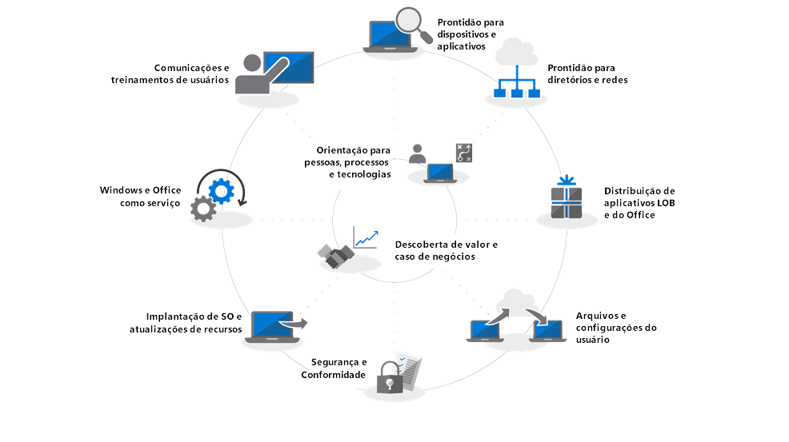

# Introdução – Implantação do Computador Moderno

A Nuvem está mudando a forma como é feito o gerenciamento de computadores, com o Microsoft Intelligent Cloud fornecendo informações acionais para ajudar os profissionais de TI a mudar para um computador moderno. Essa série foi desenvolvida para ajudar você a planejar e fazer a transição para um computador moderno baseado no Windows 10 e no Office 365 ProPlus.

<table>
<thead>
<td></td>
<td>
<strong>Introdução: Orientações sobre pessoas, processos e tecnologia</strong>

Descubra os benefícios de um computador moderno, alterações e considerações importantes em relação a implantações anteriores, além das práticas recomendadas para garantir uma transição suave para o Windows 10 e o Office 365 ProPlus.
</td>
<td></td>
</thead>
</table>

>[!NOTE]
>Nesta série, explicaremos as melhores maneiras de usar as ferramentas existentes e apresentamos novas tecnologias, serviços e métodos habilitados pela nuvem. Para ver o processo completo de implantação de computador, acesse o [Centro de Implantação do Computador Moderno](https://aka.ms/HowToShift).
>

Bem-vindo ao Centro de Implantação do Computador Moderno, nosso lugar central para aprender como ajudar você a planejar e fazer a mudança para o computador moderno. Isso permitirá que você aproveite um espaço de trabalho seguro, impulsionado pelas mais recentes experiências de produtividade, trabalho em equipe e colaboração.

Se você não tiver implantado um novo ambiente de computador por um tempo, a boa notícia é que o processo de implantação foi aprimorado. Os desafios do passado, como a compatibilidade de aplicativos, são um problema muito menor hoje em dia, e novas ferramentas e informações fornecidas da nuvem permitem que você avance com confiança, de forma mais rápida e eficiente do que nunca.

Nesta introdução, descreveremos o que mudou e faremos um tour pela Roda de Implantação de Computador. Isso guiará você pelas etapas recomendadas para a mudança para o Windows 10 e o Office 365 ProPlus, detalhando como aproveitar suas ferramentas e processos existentes enquanto adota tecnologia e abordagens de gerenciamento modernas durante o processo.

## Por que atualizar?

Em combinação, o Windows 10 e o Microsoft Intelligence Cloud aprimoram sua capacidade de oferecer o Espaço de Trabalho mais poderoso, avançado e seguro para seus usuários e permitem simplificar sua infraestrutura de suporte.

Um dos principais locatários das modernas práticas de gerenciamento é composto por dispositivos que estão sempre atualizados. Por meio dessa série, você verá novos recursos que estão sendo fornecidos para ajudá-lo a migrar para o Windows 10 e o Office 365 ProPlus e como se manter atualizado com as versões semestrais de ambos.

[Windows 10 para o profissional de TI](https://www.microsoft.com/pt-BR/itpro/windows-10)

## O que mudou

Vamos começar dando uma olhada no que mudou e melhorou desde a sua última implantação de computador. Se você não mudou seu ambiente de computador por algum tempo, provavelmente está usando o Windows 7, o Office 2010 ou o Office 2013. Se estiver, perceberá que algumas coisas evoluíram desde seu último grande upgrade. Aqui estão algumas das principais mudanças:

**Gerenciamento de Identidade e Acesso** O computador moderno, com sua conectividade aos serviços de produtividade, segurança e gerenciamento da nuvem, tem, em essência, um novo serviço Gerenciamento de Identidade e Acesso: o Azure Active Directory. Isso permite a conectividade segura e de logon único em todos os seus serviços de nuvem. Isso significa que você precisará do Azure AD instalado. Isso permitirá que você aproveite as vantagens dos serviços do Microsoft 365, como o Office 365, o Intune ou o Windows Autopilot.

[Microsoft 365](https://www.microsoft.com/pt-BR/microsoft-365/default.aspx)

**Ambiente de pré-inicialização segura** O firmware UEFI de 64 bits substitui o BIOS. Isso não apenas acelera os tempos de inicialização, mas também é necessário para ativar muitos dos recursos de segurança modernos do Windows 10. O Windows 10 será executado no BIOS, mas o UEFI é altamente recomendado. Se você não tiver mudado do BIOS para o UEFI e 64 bits, agora é a hora. Existem ferramentas para ajudá-lo a fazer essa mudança durante uma atualização do Windows 10 ou depois dela.

[Converter de BIOS em UEFI com MBR2GPT](https://technet.microsoft.com/pt-BR/windows/mt782786.aspx)

**Gerenciamento de dispositivos baseados em nuvem** Serviços como o Microsoft Intune, você gerencia seus dispositivos do Windows 10 como faz com outros dispositivos móveis, tudo em um só lugar. O que torna o Microsoft Intune único é a capacidade de cogerenciar seus dispositivos do Windows 10 com o System Center Configuration Manager. Você pode usar o System Center Configuration Manager para ajudá-lo a mudar para o Windows 10 e, em seguida, adicionar o Microsoft Intune. Trabalhando juntos, o System Center Configuration Manager se torna o Edge inteligente em sua organização, conectado à nuvem inteligente da Microsoft. Isso permite que você gerencie os dispositivos de seus usuários com segurança onde quer que eles estejam, estejam conectados na nuvem da sua organização ou na pública.

[Cogerenciamento para dispositivos Windows 10](https://docs.microsoft.com/pt-BR/sccm/core/clients/manage/co-management-overview)

**Serviço de implantação baseado na nuvem** À medida que você adquire novos computadores, apresentamos um novo serviço em nuvem para ajudá-lo a implantar dispositivos do Microsoft 365. É chamado de serviço de implantação do Windows Autopilot. O AutoPilot é integrado aos seus fornecedores de hardware, e os novos computadores são automaticamente registrados no AutoPilot. Isso permite que o novo computador seja enviado diretamente para o usuário final. Quando o computador é ligado pela primeira vez, ele é rapidamente configurado para a configuração desejada da sua organização e personalizado de acordo com as necessidades específicas do usuário.

[Windows Autopilot](https://www.microsoft.com/pt-BR/windowsforbusiness/windows-autopilot)

**Implantações de Clique para Executar** Ao provisionar aplicativos de desktop do Office, o Office 365 ProPlus é a opção preferida. Isso dá a você acesso às inovações mais recentes do Office, à medida que elas são desenvolvidas. Assim, você não precisará esperar anos antes de obter novos recursos. Você também usará uma nova instalação chamada Clique para Executar.

O Clique para Executar é bem diferente dos pacotes baseados em MSI do passado. O Clique para Executar é mais rápido, mais leve e usa o streaming de programa para permitir que os usuários estejam ativos e em execução em apenas alguns minutos e para serem atualizados em plano de fundo. Não se preocupe, ainda é uma cópia local do Office, e você pode continuar usando suas ferramentas de implantação existentes, como o System Center Configuration Manager, para provisionar e configurar os aplicativos.

[Guia de implantação do Office 365 ProPlus](https://docs.microsoft.com/pt-BR/DeployOffice/deployment-guide-for-office-365-proplus)

**Atualizações semestrais** Depois de migrar para o Windows 10 e o Office 365 ProPlus, as atualizações serão entregues semestralmente com novos recursos. Mas com a Microsoft capaz de fornecer informações da Nuvem para ajudá-lo, você pode distribuir essas atualizações com rapidez e confiança para centenas ou milhares de dispositivos. Como uma atualização in-loco, a atualização de recursos preserva aplicativos, dados e configurações da versão anterior.

## A roda do processo de implantação

Antes de começar, você deve criar um plano de alto nível e obter os patrocinadores necessários. Nossa roda do processo de implantação descreve as etapas essenciais para ajudá-lo a identificar os recursos e membros da equipe principal a serem gerenciados nas seguintes áreas de implantação.

**[Etapa 1: Preparação de dispositivos e aplicativo](https://aka.ms/mdd1)** Para uma implantação bem-sucedida, primeiro você precisa saber o que tem. Isso significa fazer um inventário de seus dispositivos e aplicativos e verificar a compatibilidade.

Para o ajudar nisso, você pode utilizar as ferramentas disponíveis em nosso serviço baseado em nuvem, o Windows Analytics. O Windows Analytics permite que você aproveite a telemetria e inteligência de compatibilidade coletadas de centenas de milhões de computadores para avaliar os aplicativos e drivers que estão sendo executados no dispositivo, para que você possa estabelecer a preparação de seu computador. Você pode até mesmo exportar uma lista de "Computadores prontos para implantação" do Windows Analytics para o System Center Configuration Manager, se você o utiliza, permitindo a criação de coleções orientadas a dados de computadores direcionados à medida que eles estiverem prontos.

[Introdução ao Upgrade Readiness](https://docs.microsoft.com/pt-BR/windows/deployment/upgrade/upgrade-readiness-get-started)

**[Etapa 2: Preparação de diretórios e redes](https://aka.ms/mdd2)** Se você ainda não o fez, implemente o Azure Active Directory para gerenciamento de identidade e acesso em seguida. Você também desejará preparar sua rede para a movimentação de imagens do sistema, pacotes de aplicativos, arquivos do usuário e atualizações através dela. Isso significa uma grande quantidade de dados adicionais; sua rede deve ter a capacidade de lidar com essa carga extra sem afetar o trabalho diário da sua organização. Temos uma gama de otimizações de rede disponíveis desde limitação de largura de banda e opções ponto a ponto até a limpeza dinâmica de largura de banda e atualização diferencial.

[BranchCache versus Cache Par](https://blogs.technet.microsoft.com/swisspfe/2018/01/25/branch-cache-vs-peer-cache/)

**[Etapa 3: Entrega de aplicativos do Office e LOB](https://aka.ms/mdd3)** Embora o Windows continue a oferecer suporte a instalações baseadas em MSI, agora também oferece suporte a mecanismos de instalações mais recentes, otimizados para implantação automatizada e atualizações contínuas. Os clientes do Office 365 ProPlus e do Windows 2019 usam o Clique para Executar, você pode disponibilizar uma variedade de aplicativos UWP e pode se deparar com a implantação cada vez maior de aplicativos de terceiros e aplicativos LOB desenvolvidos internamente que usam os novos aplicativos de empacotamento baseados em MSIX. Essa etapa garante que seus aplicativos estejam prontos para implantações automatizadas e que você esteja preparado para ter sucesso, independentemente de seus aplicativos serem implantados usando Clique para Executar, MSIX, baseados em MSI convencionais, ou serem aplicativos UWP implantados de uma Microsoft Store da Empresa que você definiu acima.

[Introdução do MSIX](https://blogs.msdn.microsoft.com/sgern/2018/06/15/msix-intro/)

**[Etapa 4: Migração de arquivos e configurações do usuário](https://aka.ms/mdd4)** Essa é uma etapa crítica em qualquer substituição de computador ou ciclo de atualização: é necessário garantir que os arquivos, os dados e as configurações dos usuários sejam movidos com êxito e preservados durante a migração. Esta etapa abrange as opções disponíveis para migrações manuais ou automatizadas, incluindo as opções conhecidas e novas.

Como nos upgrades anteriores, a Ferramenta de Migração do Usuário continua sendo uma ferramenta valiosa para automatizar esse processo e continua sendo uma parte integrante das migrações orquestradas usando o System Center Configuration Manager ou o Microsoft Deployment Toolkit. Mas mover todos esses dados durante a migração pode ser um gargalo de tempo para a substituição do computador, devido à física envolvida na transferência, às vezes, de centenas de gigabytes por computador duas vezes: primeiro do computador existente e depois para o novo computador. Uma nova opção habilitada pelo OneDrive, Migração de Pasta Conhecida, é sincronizar documentos, imagens e arquivos de computador do usuário em grande escala, na nuvem, antes da implantação.

[Redirecionar e mover as pastas conhecidas do Windows para o OneDrive](https://docs.microsoft.com/pt-BR/onedrive/redirect-known-folders)

**[Etapa 5: Segurança e Conformidade](https://aka.ms/mdd5)** Segurança e Conformidade é uma área muito vantajosa ao migrar para o Windows 10 e o Office 365 ProPlus. É importante que você se familiarize com os novos recursos internos e compare-os com os que você já tem. Por exemplo, os novos recursos do Windows 10 que usam a segurança baseada em virtualização podem impedir o roubo de credenciais, proteger contra explorações baseadas em navegador e execução de código mal-intencionado, isolando os principais processos e segredos do sistema operacional. Além disso, serviços em nuvem, como a Proteção Avançada contra Ameaças, oferecem uma plataforma unificada para proteção de segurança, detecção pós-violação, investigação e resposta. A Proteção Avançada contra Ameaças também pode protegê-lo contra anexos de email mal-intencionados, hiperlinks inseguros e muito mais.

[Segurança da Microsoft](https://www.microsoft.com/pt-BR/security/default.aspx)

**[Etapa 6: Implantação do sistema operacional e atualizações de recursos](https://aka.ms/mdd6)** Com tudo preparado, a próxima etapa é implantar as imagens do sistema operacional. Muito do trabalho pesado pode ser feito usando as sequências de tarefas e a infraestrutura do System Center Configuration Manager. A abordagem recomendada é implantar em fases, visando e implantando em um "grupo de adoção antecipada" em sua organização usando um conjunto representativo de hardware e aplicativos. Você pode usar os dados desses dispositivos e usuários e ter como destino cada vez mais computadores, de forma gradual.

[Introdução à implantação do sistema operacional no System Center Configuration Manager](https://docs.microsoft.com/pt-BR/sccm/osd/understand/introduction-to-operating-system-deployment)

**[Etapa 7: Windows e Office como serviço](https://aka.ms/mdd7)** Isso representa uma grande mudança na maneira como você mantém o estado real do computador dos usuários. Com essa mudança para o Windows 10 (e o Office 365 ProPlus), você pode passar a gerenciar o Windows (e do Office) como um serviço. Em vez de uma grande mudança de tecnologia em pequenos intervalos de anos, você estará continuamente trazendo novas capacidades, experiências e proteções para o seu usuário. As atualizações de recursos semestrais oferecem novos recursos no outono e na primavera de cada ano, enquanto as Atualizações de Qualidade cumulativas mensais contêm segurança, confiabilidade e correções de bugs. Embora você possa optar por implantar clientes do Office 2019, recomendamos que você mude para o Office ProPlus. Isso segue um plano de serviço semelhante para o Windows, para que seus usuários também recebam atualizações para os aplicativos do Office regularmente.

[Visão geral do Windows como serviço](https://docs.microsoft.com/pt-BR/windows/deployment/update/waas-overview)

**[Etapa 8: Treinamento e comunicações de usuários](https://aka.ms/mdd8)** Esta última etapa é essencial para impulsionar o uso de novos recursos para aprimorar o trabalho em equipe, as comunicações, a segurança e muito mais. Antes que uma ampla implantação seja direcionada a usuários fora dos anéis de adoção antecipada, recomendamos que você implante a comunicação e o treinamento do usuário. Isso ajudará a impulsionar as alterações desejadas em como as pessoas usam novos recursos no Office, no Windows ou em outros aplicativos e serviços LOB. Para ajudar, oferecemos treinamento online gratuito via Microsoft FastTrack. Além disso, publicamos planos e cronogramas de comunicação de amostras grátis juntamente com modelos de email, de redes sociais e de intranet para ajudar na implantação do Windows 10. Como uma organização do Microsoft 365 ou Office 365, sua organização também pode ter direito e suporte direto.

## Próxima etapa

Agora você está a par das novidades e das diferenças, e já lhe apresentamos a nossa roda recomendada do processo de implantação. Com esse gosto pelas orientações e ferramentas de ponta a ponta disponíveis para você fazer a mudança para o computador moderno, vamos começar.

## [Etapa 1: Preparação de dispositivos e aplicativos](https://aka.ms/mdd1)

