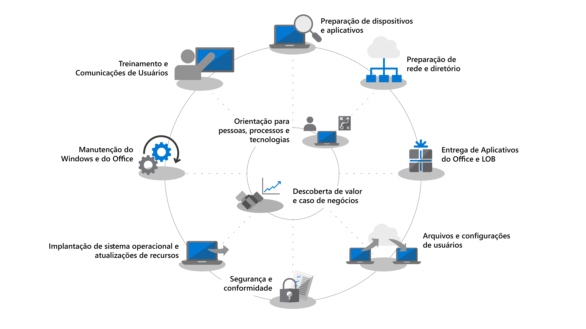
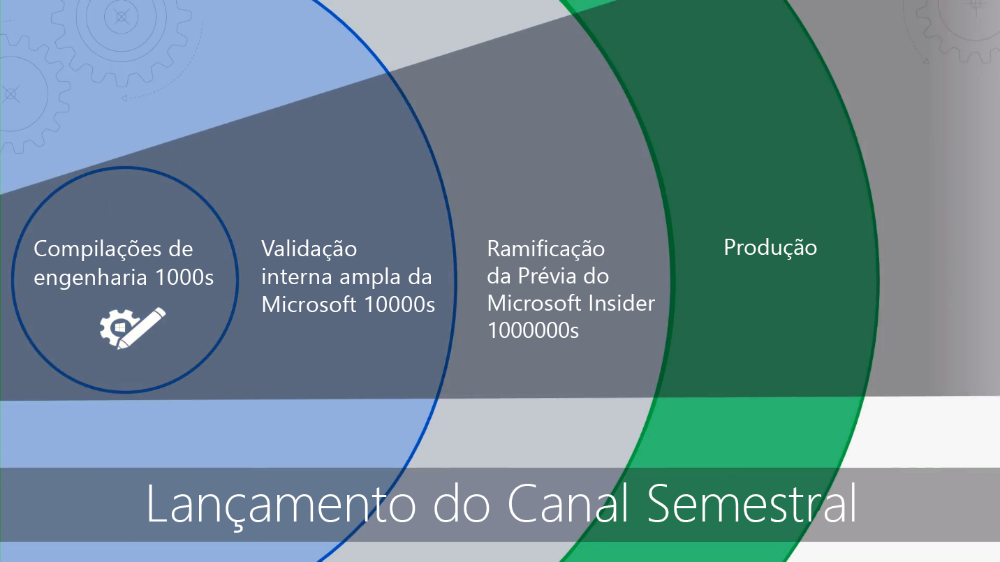

# Introdução - Implantação do ComputadorGetting Started - Desktop Deployment

<table>
<thead>
<td></td>
<td>
<strong>Introdução: Orientações sobre pessoas, processos e tecnologia</strong><strong>Getting Started: People, Process and Technology Guidance</strong>

Descubra os benefícios do Windows 10 e Office 365 ProPlus, alterações e considerações importantes em relação a implantações anteriores, além das práticas recomendadas para garantir uma transição suave para o Windows 10 e o Office 365 ProPlus.Discover the benefits of Windows 10 and Office 365 ProPlus, major changes and considerations versus previous deployments, and best practices to ensure a smooth transition to Windows 10 and Office 365 ProPlus.
</td>
<td></td>
</thead>
</table>

>[!NOTE]
>Nesta série, explicaremos as melhores maneiras de usar as ferramentas existentes e apresentaremos novas tecnologias, serviços e métodos habilitados pela nuvem.In this series we will explain the best ways to use existing tools and introduce you to new technologies, services, and methods enabled by the Cloud.  Para ver o processo completo de implantação do computador, visite o [Centro de Implantação do Computador](https://aka.ms/HowToShift).To see the full desktop deployment process, visit the [Desktop Deployment Center](https://aka.ms/HowToShift).
>

Bem vindo ao Centro de Implantação do Computador, nosso local central para saber como ajudá-lo a se planejar e mudar para o Windows 10 e o Office 365 ProPlus.Welcome to the Desktop Deployment Center, our central place to learn how to help you plan and make the shift to Windows 10 and Office 365 ProPlus. Isso permitirá que você aproveite um espaço de trabalho seguro, com as experiências mais recentes de produtividade, trabalho em equipe e colaborações.This will allow you take advantage of a secure workspace, powered by the latest productivity, teamwork, and collaboration experiences.

Se você não implanta um ambiente de computador há algum tempo, a boa notícia é que muito do processo de implantação foi aprimorado.If you haven’t deployed a new desktop environment for a while, the good news is much about the deployment process has improved. Desafios do passado, como compatibilidade de aplicativos, são questões menos significativas hoje.Challenges of the past, such as application compatibility, are much less of an issue today. Novas ferramentas, assim como informações obtidas da nuvem, permitem que você prossiga com confiança mais rápida e eficientemente do que nunca.New tools, as well as insight delivered from the Cloud, enable you to move forward with confidence faster and more efficiently than ever before.

Nesta introdução, descreveremos o que mudou e faremos um tour pela Roda de Implantação de Computador. Isso guiará você pelas etapas recomendadas para a mudança para o Windows 10 e o Office 365 ProPlus, detalhando como aproveitar suas ferramentas e processos existentes enquanto adota tecnologia e abordagens de gerenciamento modernas durante o processo.In this introduction we’ll outline what has changed and go on a tour of the Desktop Deployment Wheel. This will guide you through the recommended steps for your shift to Windows 10 and Office 365 ProPlus, detailing how to leverage your existing tools and processes while adopting modern management technology and approaches along the way.

## Por que atualizar?Why upgrade?

Em combinação, o Windows 10 e o Microsoft Intelligence Cloud aprimoram sua capacidade de oferecer o espaço de trabalho mais poderoso e seguro para seus usuários enquanto permite que você simplifique sua infraestrutura de suporte.In combination, Windows 10 and the Microsoft Intelligence Cloud enhance your ability to deliver the most empowering and secure workspace for your users while allowing you to simplify your supporting infrastructure.

Um dos principais locatários das práticas modernas de gerenciamento são dispositivos que estão atualizados sempre. One of the key tenants of modern management practices is devices that are always up-to-date. Ao longo desta série, você lerá sobre os novos recursos que estão sendo entregues para ajudá-lo a mover para o Windows 10 e Office 365 ProPlus enquanto se mantém atualizado com as versões semestrais de ambos.Through this series you will read about new capabilities that are being delivered to help you move to Windows 10 and Office 365 ProPlus while staying current with the semi-annual releases of both.

[Windows 10 para o profissional de TIWindows 10 for the IT Pro](https://www.microsoft.com/itpro/windows-10)

[Sobre o Office 365 ProPlus na empresaAbout Office 365 ProPlus in the enterprise](https://docs.microsoft.com/deployoffice/about-office-365-proplus-in-the-enterprise)

## O que mudouWhat has Changed

Vamos começar dando uma olhada no que mudou e melhorou desde a sua última implantação de computador. Se você não mudou seu ambiente de computador por algum tempo, provavelmente está usando o Windows 7, o Office 2010 ou o Office 2013. Se estiver, perceberá que algumas coisas evoluíram desde seu último grande upgrade. Aqui estão algumas das principais mudanças:Let’s start by taking a look at what has changed and improved since your last desktop deployment. If you haven’t shifted your desktop environment in a while you’re likely using Windows 7 and Office 2010 or Office 2013. If you are, you'll notice a few things have evolved since your last major upgrade. Here are some of the core changes:

**Identidades e Acesso:** O Windows 10 e o Office 365 ProPlus, com a conectividade para produtividade de nuvem, segurança e serviços de gerenciamento têm um novo serviço de Gerenciamento de Acesso e Identidades em sua essência: Azure Active Directory (Azure AD).**Identity and Access:** Windows 10 and Office 365 ProPlus, with its connectivity to cloud productivity, security, and management services, has a new Identity and Access Management service at its core: Azure Active Directory (Azure AD). Isso permite logon único e conectividade segura em todos os serviços de nuvem, o que significa que você precisará que o Azure AD esteja em vigor para aproveitar os serviços do Microsoft 365 como Office 365, Intune ou Windows Autopilot.This enables single sign-on and secure connectivity across your cloud services, meaning that you are going to need Azure AD in place to take advantage of Microsoft 365 services such as Office 365, Intune, or Windows Autopilot.

[Microsoft 365Microsoft 365](https://www.microsoft.com/microsoft-365/default.aspx)

**Ambiente Pre-Boot Seguro:** firmware de 64 bits da UEFI substitui BIOS.**Secure Pre-Boot Environment:** 64-bit UEFI firmware replaces BIOS. Isso não só acelera o tempo de inicialização, é necessário ativar muitos dos recursos modernos de segurança no Windows 10.This not only speeds up boot times, it is required to enable many of the modern security capabilities in Windows 10. Apesar de o Windows 10 rodar em BIOS, UEFI é altamente recomendada.While Windows 10 will run on BIOS, UEFI is strongly recommended. Se você não migrou do BIOS para UEFI e aproveitou os 64 bits, esse é o momento certo.If you have not switched from BIOS to UEFI and leveraging 64-bit, now is the time. Há ferramentas para ajudá-lo a mudar durante a atualização do Windows 10 ou depois dela.There are tools to help you make this switch either during a Windows 10 upgrade, or after it.

**Gerenciamento de dispositivos baseados em nuvem:** Serviços como o Microsoft Intune ajudam você a gerenciar seus dispositivos com Windows 10 da mesma forma que gerencia seus outros dispositivos móveis, tudo em um único lugar.**Cloud-based device Management:** Services like Microsoft Intune help you manage your Windows 10 devices as you do other mobile devices, all from one place. O que torna o Microsoft Intune único é a habilidade de co-gerenciar seus dispositivos Windows 10 com o Microsoft Endpoint Configuration Manager.What makes Microsoft Intune unique is the ability to co-manage your Windows 10 devices with Microsoft Endpoint Configuration Manager. Você pode usar o Configuration Manager para ajudá-lo a mudar para o Windows 10 e, em seguida, adicionar o Microsoft Intune.You can use Configuration Manager to help you in your shift to Windows 10, and then add Microsoft Intune. Trabalhando juntos, o Microsoft Endpoint Configuration Manager se torna a borda inteligente dentro de sua organização, conectado à nuvem inteligente da Microsoft.Working together, Microsoft Endpoint Configuration Manager becomes the intelligent edge within your organization, connected to the Microsoft intelligent cloud. Isso permite que você gerencie os dispositivos de seus usuários com segurança onde quer que eles estejam, estejam conectados na nuvem de sua organização ou na nuvem pública.This allows you to manage your users’ devices securely wherever they are, whether connected on your organization’s infrastructure or in the public cloud.

[Cogerenciamento para dispositivos com o Windows 10Co-management for Windows 10 devices](https://docs.microsoft.com/configmgr/core/clients/manage/co-management-overview)

**Serviço de Implantação baseado em nuvem:** Conforme você adquire novos computadores, apresentamos um novo serviço de nuvem para ajudá-lo a implantar os dispositivos com Microsoft 365, chamado de serviço de implantação do Windows Autopilot.**Cloud-based Deployment Service:** As you acquire new PCs we’ve introduced a new cloud service to help you deploy Microsoft 365 devices called the Windows Autopilot deployment service. O Autopilot é integrado aos seus provedores de hardware e novos computadores são registrados automaticamente no Autopilot, permitindo que o novo computador seja enviado diretamente ao usuário final.Autopilot is integrated with your hardware providers and new PCs are automatically registered in Autopilot enabling the new PC to be shipped directly to the end-user. Quando o computador é ligado pela primeira vez, ele é configurado rapidamente para a configuração desejada pela sua organização e personalizado para as necessidades específicas do usuário.When the PC is powered on the first time it is quickly configured to your organizations desired configuration and customized for the specific needs of the user.

[Windows AutopilotWindows Autopilot](https://www.microsoft.com/windowsforbusiness/windows-autopilot)

**Implantações Clique para Executar:** Para provisionar aplicativos da área de trabalho do Office, o Office 365 ProPlus é a opção preferida.**Click-to-Run Deployments:** When provisioning Office desktop apps, Office 365 ProPlus is the preferred option. Isso lhe dá acesso às mais recentes inovações no Office conforme elas são desenvolvidas, para que você não tenha que esperar por anos para conseguir novos recursos.This gives you access to the newest innovations in Office as they are developed, so you won’t need to wait years before getting new capabilities. Você também usará uma nova instalação chamada Clique para Executar.You’ll also use a new installation called Click-to-Run.

Clique para Executar é bem diferente dos pacotes baseados em MSI do passado.Click-to-Run is quite different from the MSI-based packages of the past. Clique para Executar é mais rápido, mais leve e oferece suporte para atualizações em segundo plano para manter seus usuários ativos.Click-to-Run is faster, lighter, and supports updates in the background to keep your users to be up and running. Ele ainda é uma cópia local do Office e você pode continuar a usar suas ferramentas de implantação existentes, como o Microsoft Endpoint Configuration Manager para provisionar e configurar os aplicativos.It is still a local copy of Office and you can continue to use your existing deployment tools, like Microsoft Endpoint Configuration Manager, to provision and configure the apps.

[Guia de implantação do Office 365 ProPlusDeployment guide for Office 365 ProPlus](https://docs.microsoft.com/DeployOffice/deployment-guide-for-office-365-proplus)

**Atualizações Semestrais:** Quando você tiver migrado para o Windows 10 e Office 365 ProPlus, as atualizações serão entregues semestralmente com novos recursos.**Semi-Annual Updates:** Once you have moved to Windows 10 and Office 365 ProPlus, updates are delivered semi-annually with new features. Mas com o Microsoft conseguindo trazer informações da nuvem para ajudar, você pode implantar essas atualizações em centenas a milhares de dispositivos de forma rápida e segura.But with Microsoft able to deliver insights from the cloud to help, you can quickly and confidently roll out these updates to hundreds or thousands of devices. Como uma atualização in-loco, a Atualização de Recurso preserva aplicativos, dados e configurações da versão anterior.Like an in-place upgrade, the Feature Update preserves apps, data, and configurations from the previous release.

## A roda do processo de implantaçãoThe Deployment Process Wheel

Antes de começar, você deve criar um plano de alto nível e integrar os patrocinadores necessários.Before you get started, you’ll want to create a high-level plan and get the necessary sponsors on board. Nossa roda do processo de implantação descreve passos críticos para ajudá-lo a identificar os principais membros da equipe e recursos para gerenciar as seguintes áreas de implantação.Our deployment process wheel outlines critical steps to help you to identify core team members and resources to manage in the following deployment areas.

**[Etapa 1: Preparação do Dispositivo e Aplicativo](https://aka.ms/mdd1)** Para uma implantação bem-sucedida, primeiro você deve saber o que tem.**[Step 1: Device and App readiness](https://aka.ms/mdd1)** For a successful deployment you must first know what you have. Isso significa fazer um inventário de seus dispositivos e aplicativos e verificar a compatibilidade.That means taking an inventory of your devices and apps and verifying compatibility. Para ajudar nisso, você pode aproveitar as ferramentas disponíveis em nosso serviço baseado em nuvem, o Desktop Analytics.To help with this you can leverage the tools available in our cloud-based service, Desktop Analytics. O desktop Analytics permite que você aproveite a inteligência de compatibilidade e os dados de diagnóstico obtidos de milhões de computadores para avaliar os aplicativos e os drivers em execução no seu dispositivo, para que você possa estabelecer a prontidão da área de trabalho.Desktop Analytics allows you tap into compatibility intelligence and diagnostic data gathered from hundreds of millions of PCs, to assess the apps and drivers running on your device so you can establish the readiness of your desktop estate. Você pode até mesmo exportar uma lista de “Computadores prontos para implantação” do Desktop Analytics para o Configuration Manager se você o estiver usando, permitindo a criação de coleções direcionadas por dados dos computadores de destino, à medida que esses computadores ficam prontos para a implantação.You can even export a list of “PCs ready for deployment” from Desktop Analytics to Configuration Manager if you use it, allowing you to build data-driven collections of targeted PCs as they become ready.

[Introdução ao Upgrade ReadinessGet started with Upgrade Readiness](https://docs.microsoft.com/windows/deployment/upgrade/upgrade-readiness-get-started)

**[Etapa 2: Preparação de Diretório e Rede](https://aka.ms/mdd2)** Se você ainda não o fez, deve implantar Azure Active Directory para gerenciamento de identidades e acesso.**[Step 2: Directory and Network Readiness](https://aka.ms/mdd2)** If you haven’t already, you’ll want to implement Azure Active Directory for identity and access management next. Você também deve preparar sua rede para a movimentação de imagens do sistema, pacotes de aplicativos, arquivos de usuário e atualizações nela.You will also want to prepare your network for the movement of system images, application packages, user files, and updates across it. Isso significa uma grande quantidade de dados adicionais; sua rede deve ter a capacidade de lidar com essa carga adicional sem afetar o trabalho diário da sua organização.That means a large amount of additional data; your network must have the capacity to handle this extra load without impact to the day-to-day work of your organization. Temos uma variedade de otimizações de rede disponíveis desde limitação de largura de banda e opções ponto a ponto a busca de largura de banda dinâmica e atualização diferencial.We have a range of networking optimizations available from bandwidth throttling and peer-to-peer options to dynamic bandwidth scavenging and differential updating.

[BranchCache versus Cache ParBranchCache vs. Peer Cache](https://blogs.technet.microsoft.com/swisspfe/2018/01/25/branch-cache-vs-peer-cache/)

**[Etapa 3: Entrega de Aplicativos do Office e de Linha de Negócios](https://aka.ms/mdd3)** Apesar de o Windows continuar oferecendo suporte a instalações baseadas em MSI, ele também oferece suporte a mecanismos de instalações mais novos, otimizados para implantação automatizada e atualizações contínuas.**[Step 3: Office and Line of Business App Delivery](https://aka.ms/mdd3)** While Windows continues to support MSI-based installations it also now supports newer installations mechanisms, optimized for automated deployment and continuous updates. Os clientes do Office 365 ProPlus e Office 2019 usam a tecnologia de instalação Clique para Executar.Office 365 ProPlus and Office 2019 clients use Click-to-Run installation technology. Você pode disponibilizar uma variedade de aplicativos UWP e pode se deparar cada vez mais com a implantação de aplicativos de terceiros e aplicativos de Linha de Negócios desenvolvidos internamente que usam os novos aplicativos de empacotamento baseados em MSIX.You may want to make a range of UWP apps available, and you may increasingly find yourself deploying third-party apps and in-house developed Line of Business Apps that use the new MSIX-based packaging apps. Esta etapa garante que seus aplicativos estejam prontos para implantações automatizadas e que você esteja preparado para o sucesso independentemente de seus aplicativos serem implantados usando Clique para Executar, MSIX, baseados em MSI convencionais ou serem aplicativos UWP implantados de uma Microsoft Store para Empresas que você configurou.This step ensures your apps are ready for automated deployments, and that you are set up for success whether your apps deploy using Click-to-Run, MSIX, conventional MSI-based, or are UWP apps deployed from a Microsoft Store from Business you set up.

[Introdução do MSIXMSIX Intro](https://blogs.msdn.microsoft.com/sgern/2018/06/15/msix-intro/)

**[Etapa 4: Migração de arquivos e configurações do usuário](https://aka.ms/mdd4)** Essa é uma etapa crítica em qualquer substituição de computador ou ciclo de atualização: é necessário garantir que os arquivos, os dados e as configurações dos usuários sejam movidos com êxito e preservados durante a migração.**[Step 4: User Files and Settings Migration](https://aka.ms/mdd4)** This is a critical step in any PC replacement or refresh cycle: you have to ensure users’ files, data, and settings move successfully and are preserved over the migration. Esta etapa abrange as opções disponíveis para migrações manuais ou automatizadas, incluindo opções conhecidas e novas.This step covers the options available for manual or automated migrations, including well-known and new options.

Assim como em atualizações anteriores, a Ferramenta de Migração dos Estados de Usuários continua a ser uma ferramenta valiosa para automatizar este processo e permanece uma parte de migrações coordenadas usando o Microsoft Endpoint Configuration Manager ou o Kit de Ferramentas de Implantação da Microsoft.As in previous upgrades, the User State Migration Tool continues to be a valuable tool to automate this process and it remains an integral part of migrations orchestrated using Microsoft Endpoint Configuration Manager or the Microsoft Deployment Toolkit. Mas mover todos esses dados na migração pode ser um afunilamento do tempo para a substituição do computador por causa da física envolvida na transferência de, às vezes, centenas de gigabytes por computador duas vezes – a primeira do computador existente, a segunda para o novo computador.But moving all this data at migration can be a timing bottleneck for PC replacement due to the physics involved in transferring sometimes hundreds of gigabytes per PC twice – first from the existing desktop, then back down to the new desktop. Uma nova opção habilitada pelo OneDrive é Mover Pastas Conhecidas, usada para sincronizar documentos e imagens do usuário e arquivos da área de trabalho em escala, na nuvem e antes da implantação.A new option enabled by OneDrive is Known Folder Move used to sync user documents, pictures, and desktop files at scale, in the cloud, and ahead of deployment.

[Redirecionar e mover as pastas conhecidas do Windows para o OneDriveRedirect and move Windows known folders to OneDrive](https://docs.microsoft.com/onedrive/redirect-known-folders)

**[Etapa 5: Segurança e Conformidade](https://aka.ms/mdd5)** Segurança e Conformidade é uma área muito vantajosa ao migrar para o Windows 10 e o Office 365 ProPlus. É importante que você se familiarize com os novos recursos internos e compare-os com os que você já tem. Por exemplo, os novos recursos do Windows 10 que usam a segurança baseada em virtualização podem impedir o roubo de credenciais, proteger contra explorações baseadas em navegador e execução de código mal-intencionado, isolando os principais processos e segredos do sistema operacional. Além disso, serviços em nuvem, como a Proteção Avançada contra Ameaças, oferecem uma plataforma unificada para proteção de segurança, detecção pós-violação, investigação e resposta. A Proteção Avançada contra Ameaças também pode protegê-lo contra anexos de email mal-intencionados, hiperlinks inseguros e muito mais.**[Step 5: Security and Compliance](https://aka.ms/mdd5)** Security and Compliance is an area with a lot upside when moving to Windows 10 and Office 365 ProPlus. It is important you familiarize yourself with the new built-in capabilities and compare that with what you already have. For example, new capabilities in Windows 10 using virtualization-based security can prevent credential theft, protect against browser-based exploits and malicious code execution by isolating core processes and secrets from the operating system. In addition, cloud services like Advanced Threat Protection give you a unified platform for security hardening, post-breach detection, investigation, and response. Advanced Threat Protection can also safeguard you against malicious email attachments, unsafe hyperlinks and more.

[Segurança da MicrosoftMicrosoft Security](https://www.microsoft.com/security/default.aspx)

**[Etapa 6: Implantação do sistema operacional e atualizações de recursos](https://aka.ms/mdd6)** Com tudo preparado, a próxima etapa é implantar as imagens do sistema operacional. Muito do trabalho pesado pode ser feito usando as sequências de tarefas e a infraestrutura do System Center Configuration Manager. A abordagem recomendada é implantar em fases, visando e implantando em um "grupo de adoção antecipada" em sua organização usando um conjunto representativo de hardware e aplicativos. Você pode usar os dados desses dispositivos e usuários e ter como destino cada vez mais computadores, de forma gradual.**[Step 6: OS Deployment and Feature Updates](https://aka.ms/mdd6)** With everything prepared, the next step is to deploy the OS images. A lot of the heavy lifting for can be done using System Center Configuration Manage task sequences and infrastructure. The recommended approach is to deploy in phases, first targeting and deploying to an “early adopter group” in your organization using a representative set of hardware and apps. You can then use the data from those devices and users to gradually target more and more PCs.

[Introdução à implantação do sistema operacional no Configuration ManagerIntroduction to operating system deployment in Configuration Manager](https://docs.microsoft.com/configmgr/osd/understand/introduction-to-operating-system-deployment)

**[Etapa 7: Windows e Office como serviço](https://aka.ms/mdd7)** Isso representa uma grande mudança na forma que você mantém o estado real do computador dos usuários.**[Step 7: Windows and Office as a Service](https://aka.ms/mdd7)** This represents a major shift in the way you maintain users’ desktop real-estate. Com essa mudança para o Windows 10 e o Office 365 ProPlus, você pode passar a gerenciar o Windows e o Office como um serviço.With this move to Windows 10 and Office 365 ProPlus you can move to managing Windows and Office as a service. Em vez de uma grande mudança de tecnologia em pequenos intervalos de anos, você estará trazendo novos recursos, experiências e proteções ao seu usuário.In place of a massive shift in technology every few years, you will continually be bringing new capabilities, experiences, and protections to your user. As atualizações de recursos semestrais oferecem novos recursos no outono e primavera de cada ano, enquanto as Atualizações de Qualidade cumulativas contêm segurança, confiabilidade e correção de bugs.Semi-annual feature updates deliver new capabilities in the Fall and Spring of each year, while monthly cumulative Quality Updates will contain security, reliability, and bug fixes. Embora você possa optar por implantar o cliente do Office 2019, recomendamos que você mude para o Office 365 ProPlus.While you can opt to deploy the Office 2019 client, we strongly recommend you to move to Office 365 ProPlus. Isso segue um plano de serviço semelhante para o Windows para que seus usuários também recebam atualizações para os aplicativos do Office regularmente.This follows a similar service plan to Windows so your users get updates to the Office apps on a regular basis too.

[Visão geral do Windows como serviço](https://docs.microsoft.com/windows/deployment/update/waas-overview)
[Visão geral do Office como serviço](https://docs.microsoft.com/DeployOffice/overview-of-update-channels-for-office-365-proplus)[Overview of Windows as a service](https://docs.microsoft.com/windows/deployment/update/waas-overview)
[Overview of Office as a service](https://docs.microsoft.com/DeployOffice/overview-of-update-channels-for-office-365-proplus)

**[Etapa 8: Treinamento e comunicações de usuários](https://aka.ms/mdd8)** Esse último passo é essencial para gerar uso de novos recursos para aperfeiçoar o trabalho em equipe, comunicação, segurança e mais.**[Step 8: User Communications and Training](https://aka.ms/mdd8)** This last step is critical to driving usage of new capabilities for enhancing teamwork, communications, security, and more. Antes que a implantação geral seja direcionada a usuários fora dos círculos de usuários pioneiros, recomendados que você implante o treinamento e comunicações de usuários.Before broad deployment is targeted to users outside early adopter rings, we recommend you roll out user communication and training. Isso vai ajudar a gerar as mudanças desejadas em como as pessoas usam os novos recursos no Office, Windows ou outros aplicativos e serviços da linha de negócios.This will help drive desired changes in how people use new capabilities in Office, Windows, or other line of business apps and services. Para ajudar, fornecemos treinamento online gratuito através do Microsoft FastTrack.To assist, we provide free online training via Microsoft FastTrack. Além disso, publicamos amostras gratuitas de planos de comunicação e cronogramas junto com modelos de e-mail, sociais e de intranet para ajudá-lo na sua implantação do Windows 10.Plus, we’ve published free sample communication plans and timelines together with email, social, and intranet templates to help with your rollout of Windows 10. Como uma organização do Microsoft 365 ou Office 365, sua organização também pode ser qualificada para suporte direto.As a Microsoft 365 or Office 365 organization, your organization may also be eligible for and direct support.

## Próxima etapaNext Step

Agora você sabe o que é novo e diferente no Windows 10 e no Office 365 ProPlus e explicamos nossa roda recomendada do processo de implantação.Now you know what’s new and different in Windows 10 and Office 365 ProPlus, and we have walked through our recommended deployment process wheel. Com essa ideia das orientações e ferramentas de ponta a ponta disponíveis para você mudar para o Windows 10 e Office 365 ProPlus, vamos começar.With this taste for the end-to-end guidance and tools available for you to make the shift to Windows 10 and Office 365 ProPlus, let’s get started.

## [Etapa 1: preparação de dispositivos e aplicativosStep 1: Device and App Readiness](https://aka.ms/mdd1)

