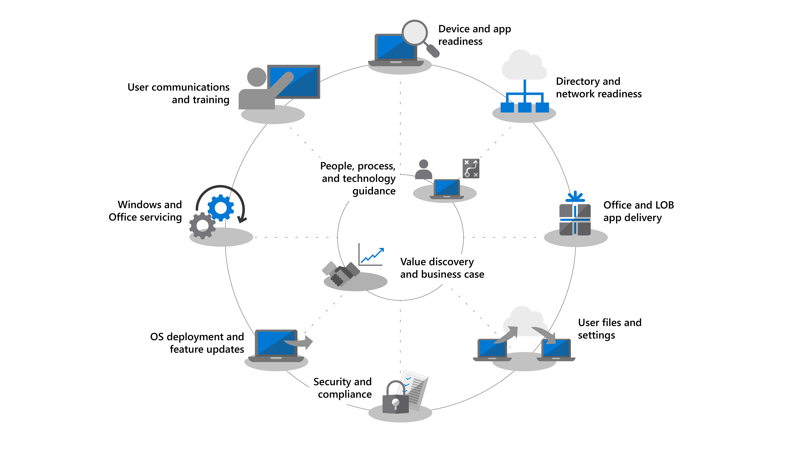

# Introdução - Implantação do Computador

<table>
<thead>
<td></td>
<td>
<strong>Introdução: Orientações sobre pessoas, processos e tecnologia</strong>

Descubra os benefícios do Windows 10 e Office 365 ProPlus, alterações e considerações importantes em relação a implantações anteriores, além das práticas recomendadas para garantir uma transição suave para o Windows 10 e o Office 365 ProPlus.
</td>
<td></td>
</thead>
</table>

>[!NOTE]
>Nesta série, explicaremos as melhores maneiras de usar as ferramentas existentes e apresentaremos novas tecnologias, serviços e métodos habilitados pela nuvem.  Para ver o processo completo de implantação do computador, visite o [Centro de Implantação do Computador](https://aka.ms/HowToShift).
>

Bem vindo ao Centro de Implantação do Computador, nosso local central para saber como ajudá-lo a se planejar e mudar para o Windows 10 e o Office 365 ProPlus. Isso permitirá que você aproveite um espaço de trabalho seguro, com as experiências mais recentes de produtividade, trabalho em equipe e colaborações.

Se você não implanta um ambiente de computador há algum tempo, a boa notícia é que muito do processo de implantação foi aprimorado. Desafios do passado, como compatibilidade de aplicativos, são questões menos significativas hoje. Novas ferramentas, assim como informações obtidas da nuvem, permitem que você prossiga com confiança mais rápida e eficientemente do que nunca.

Nesta introdução, descreveremos o que mudou e faremos um tour pela Roda de Implantação de Computador. Isso guiará você pelas etapas recomendadas para a mudança para o Windows 10 e o Office 365 ProPlus, detalhando como aproveitar suas ferramentas e processos existentes enquanto adota tecnologia e abordagens de gerenciamento modernas durante o processo.

## Por que atualizar?

Em combinação, o Windows 10 e o Microsoft Intelligence Cloud aprimoram sua capacidade de oferecer o espaço de trabalho mais poderoso e seguro para seus usuários enquanto permite que você simplifique sua infraestrutura de suporte.

Um dos principais locatários das práticas modernas de gerenciamento são dispositivos que estão atualizados sempre.  Ao longo desta série, você lerá sobre os novos recursos que estão sendo entregues para ajudá-lo a mover para o Windows 10 e Office 365 ProPlus enquanto se mantém atualizado com as versões semestrais de ambos.

[Windows 10 para o profissional de TI](https://www.microsoft.com/pt-BR/itpro/windows-10)

[Sobre o Office 365 ProPlus na empresa](https://docs.microsoft.com/pt-BR/deployoffice/about-office-365-proplus-in-the-enterprise)

## O que mudou

Vamos começar dando uma olhada no que mudou e melhorou desde a sua última implantação de computador. Se você não mudou seu ambiente de computador por algum tempo, provavelmente está usando o Windows 7, o Office 2010 ou o Office 2013. Se estiver, perceberá que algumas coisas evoluíram desde seu último grande upgrade. Aqui estão algumas das principais mudanças:

**Identidades e Acesso:** O Windows 10 e o Office 365 ProPlus, com a conectividade para produtividade de nuvem, segurança e serviços de gerenciamento têm um novo serviço de Gerenciamento de Acesso e Identidades em sua essência: Azure Active Directory (Azure AD). Isso permite logon único e conectividade segura em todos os serviços de nuvem, o que significa que você precisará que o Azure AD esteja em vigor para aproveitar os serviços do Microsoft 365 como Office 365, Intune ou Windows Autopilot.

[Microsoft 365](https://www.microsoft.com/pt-BR/microsoft-365/default.aspx)

**Ambiente Pre-Boot Seguro:** firmware de 64 bits da UEFI substitui BIOS. Isso não só acelera o tempo de inicialização, é necessário ativar muitos dos recursos modernos de segurança no Windows 10. Apesar de o Windows 10 rodar em BIOS, UEFI é altamente recomendada. Se você não migrou do BIOS para UEFI e aproveitou os 64 bits, esse é o momento certo. Há ferramentas para ajudá-lo a mudar durante a atualização do Windows 10 ou depois dela.

**Gerenciamento de dispositivos baseados em nuvem:** Serviços como o Microsoft Intune ajudam você a gerenciar seus dispositivos com Windows 10 da mesma forma que gerencia seus outros dispositivos móveis, tudo em um único lugar. O que torna o Microsoft Intune único é a habilidade de cogerenciar seus dispositivos com Windows 10 com o System Center Configuration Manager. Você pode usar o System Center Configuration Manager para ajudá-lo a mudar para o Windows 10 e, em seguida, adicionar o Microsoft Intune. Trabalhando juntos, o System Center Configuration Manager se torna a borda inteligente dentro de sua organização, conectado à nuvem inteligente da Microsoft. Isso permite que você gerencie os dispositivos de seus usuários com segurança onde quer que eles estejam, estejam conectados na nuvem de sua organização ou na nuvem pública.

[Cogerenciamento para dispositivos com o Windows 10](https://docs.microsoft.com/pt-BR/sccm/core/clients/manage/co-management-overview)

**Serviço de Implantação baseado em nuvem:** Conforme você adquire novos computadores, apresentamos um novo serviço de nuvem para ajudá-lo a implantar os dispositivos com Microsoft 365, chamado de serviço de implantação do Windows Autopilot. O Autopilot é integrado aos seus provedores de hardware e novos computadores são registrados automaticamente no Autopilot, permitindo que o novo computador seja enviado diretamente ao usuário final. Quando o computador é ligado pela primeira vez, ele é configurado rapidamente para a configuração desejada pela sua organização e personalizado para as necessidades específicas do usuário.

[Windows Autopilot](https://www.microsoft.com/pt-BR/windowsforbusiness/windows-autopilot)

**Implantações Clique para Executar:** Para provisionar aplicativos da área de trabalho do Office, o Office 365 ProPlus é a opção preferida. Isso lhe dá acesso às mais recentes inovações no Office conforme elas são desenvolvidas, para que você não tenha que esperar por anos para conseguir novos recursos. Você também usará uma nova instalação chamada Clique para Executar.

Clique para Executar é bem diferente dos pacotes baseados em MSI do passado. Clique para Executar é mais rápido, mais leve e oferece suporte para atualizações em segundo plano para manter seus usuários ativos. Ele ainda é uma cópia local do Office e você pode continuar a usar suas ferramentas de implantação existentes, como o System Center Configuration Manager para provisionar e configurar os aplicativos.

[Guia de implantação do Office 365 ProPlus](https://docs.microsoft.com/pt-BR/DeployOffice/deployment-guide-for-office-365-proplus)

**Atualizações Semestrais:** Quando você tiver migrado para o Windows 10 e Office 365 ProPlus, as atualizações serão entregues semestralmente com novos recursos. Mas com o Microsoft conseguindo trazer informações da nuvem para ajudar, você pode implantar essas atualizações em centenas a milhares de dispositivos de forma rápida e segura. Como uma atualização in-loco, a Atualização de Recurso preserva aplicativos, dados e configurações da versão anterior.

## A roda do processo de implantação

Antes de começar, você deve criar um plano de alto nível e integrar os patrocinadores necessários. Nossa roda do processo de implantação descreve passos críticos para ajudá-lo a identificar os principais membros da equipe e recursos para gerenciar as seguintes áreas de implantação.

**[Etapa 1: Preparação do Dispositivo e Aplicativo](https://aka.ms/mdd1)** Para uma implantação bem-sucedida, primeiro você deve saber o que tem. Isso significa fazer um inventário de seus dispositivos e aplicativos e verificar a compatibilidade. Para ajudar nisso, você pode aproveitar as ferramentas disponíveis em nosso serviço baseado em nuvem, Windows Analytics. O Windows Analytics permite que você aproveite a inteligência de compatibilidade e os dados de diagnóstico obtidos em milhões de computadores para avaliar os aplicativos e drivers em seu dispositivo para que você possa estabelecer a preparação do estado de seu computador. Você pode até exportar uma lista de “Computadores prontos para implantação” do Windows Analytics para o System Center Configuration Manager se você usá-lo, permitindo que você crie coleções orientadas por dados de computadores direcionados conforme eles ficam prontos.

[Introdução ao Upgrade Readiness](https://docs.microsoft.com/pt-BR/windows/deployment/upgrade/upgrade-readiness-get-started)

**[Etapa 2: Preparação de Diretório e Rede](https://aka.ms/mdd2)** Se você ainda não o fez, deve implantar Azure Active Directory para gerenciamento de identidades e acesso. Você também deve preparar sua rede para a movimentação de imagens do sistema, pacotes de aplicativos, arquivos de usuário e atualizações nela. Isso significa uma grande quantidade de dados adicionais; sua rede deve ter a capacidade de lidar com essa carga adicional sem afetar o trabalho diário da sua organização. Temos uma variedade de otimizações de rede disponíveis desde limitação de largura de banda e opções ponto a ponto a busca de largura de banda dinâmica e atualização diferencial.

[BranchCache versus Cache Par](https://blogs.technet.microsoft.com/swisspfe/2018/01/25/branch-cache-vs-peer-cache/)

**[Etapa 3: Entrega de Aplicativos do Office e de Linha de Negócios](https://aka.ms/mdd3)** Apesar de o Windows continuar oferecendo suporte a instalações baseadas em MSI, ele também oferece suporte a mecanismos de instalações mais novos, otimizados para implantação automatizada e atualizações contínuas. Os clientes do Office 365 ProPlus e Office 2019 usam a tecnologia de instalação Clique para Executar. Você pode disponibilizar uma variedade de aplicativos UWP e pode se deparar cada vez mais com a implantação de aplicativos de terceiros e aplicativos de Linha de Negócios desenvolvidos internamente que usam os novos aplicativos de empacotamento baseados em MSIX. Esta etapa garante que seus aplicativos estejam prontos para implantações automatizadas e que você esteja preparado para o sucesso independentemente de seus aplicativos serem implantados usando Clique para Executar, MSIX, baseados em MSI convencionais ou serem aplicativos UWP implantados de uma Microsoft Store para Empresas que você configurou.

[Introdução do MSIX](https://blogs.msdn.microsoft.com/sgern/2018/06/15/msix-intro/)

**[Etapa 4: Migração de arquivos e configurações do usuário](https://aka.ms/mdd4)** Essa é uma etapa crítica em qualquer substituição de computador ou ciclo de atualização: é necessário garantir que os arquivos, os dados e as configurações dos usuários sejam movidos com êxito e preservados durante a migração. Esta etapa abrange as opções disponíveis para migrações manuais ou automatizadas, incluindo opções conhecidas e novas.

Assim como em atualizações anteriores, a Ferramenta de Migração dos Estados de Usuários continua a ser uma ferramenta valiosa para automatizar este processo e permanece uma parte de migrações coordenadas usando o System Center Configuration Manager ou o Microsoft Deployment Toolkit. Mas mover todos esses dados na migração pode ser um afunilamento do tempo para a substituição do computador por causa da física envolvida na transferência de, às vezes, centenas de gigabytes por computador duas vezes – a primeira do computador existente, a segunda para o novo computador. Uma nova opção habilitada pelo OneDrive é Mover Pastas Conhecidas, usada para sincronizar documentos e imagens do usuário e arquivos da área de trabalho em escala, na nuvem e antes da implantação.

[Redirecionar e mover as pastas conhecidas do Windows para o OneDrive](https://docs.microsoft.com/pt-BR/onedrive/redirect-known-folders)

**[Etapa 5: Segurança e Conformidade](https://aka.ms/mdd5)** Segurança e Conformidade é uma área muito vantajosa ao migrar para o Windows 10 e o Office 365 ProPlus. É importante que você se familiarize com os novos recursos internos e compare-os com os que você já tem. Por exemplo, os novos recursos do Windows 10 que usam a segurança baseada em virtualização podem impedir o roubo de credenciais, proteger contra explorações baseadas em navegador e execução de código mal-intencionado, isolando os principais processos e segredos do sistema operacional. Além disso, serviços em nuvem, como a Proteção Avançada contra Ameaças, oferecem uma plataforma unificada para proteção de segurança, detecção pós-violação, investigação e resposta. A Proteção Avançada contra Ameaças também pode protegê-lo contra anexos de email mal-intencionados, hiperlinks inseguros e muito mais.

[Segurança da Microsoft](https://www.microsoft.com/pt-BR/security/default.aspx)

**[Etapa 6: Implantação do sistema operacional e atualizações de recursos](https://aka.ms/mdd6)** Com tudo preparado, a próxima etapa é implantar as imagens do sistema operacional. Muito do trabalho pesado pode ser feito usando as sequências de tarefas e a infraestrutura do System Center Configuration Manager. A abordagem recomendada é implantar em fases, visando e implantando em um "grupo de adoção antecipada" em sua organização usando um conjunto representativo de hardware e aplicativos. Você pode usar os dados desses dispositivos e usuários e ter como destino cada vez mais computadores, de forma gradual.

[Introdução à implantação do sistema operacional no System Center Configuration Manager](https://docs.microsoft.com/pt-BR/sccm/osd/understand/introduction-to-operating-system-deployment)

**[Etapa 7: Windows e Office como serviço](https://aka.ms/mdd7)** Isso representa uma grande mudança na forma que você mantém o estado real do computador dos usuários. Com essa mudança para o Windows 10 e o Office 365 ProPlus, você pode passar a gerenciar o Windows e o Office como um serviço. Em vez de uma grande mudança de tecnologia em pequenos intervalos de anos, você estará trazendo novos recursos, experiências e proteções ao seu usuário. As atualizações de recursos semestrais oferecem novos recursos no outono e primavera de cada ano, enquanto as Atualizações de Qualidade cumulativas contêm segurança, confiabilidade e correção de bugs. Embora você possa optar por implantar o cliente do Office 2019, recomendamos que você mude para o Office 365 ProPlus. Isso segue um plano de serviço semelhante para o Windows para que seus usuários também recebam atualizações para os aplicativos do Office regularmente.

[Visão geral do Windows como serviço](https://docs.microsoft.com/pt-BR/windows/deployment/update/waas-overview)
[Visão geral do Office como serviço](https://docs.microsoft.com/pt-BR/DeployOffice/overview-of-update-channels-for-office-365-proplus)

**[Etapa 8: Treinamento e comunicações de usuários](https://aka.ms/mdd8)** Esse último passo é essencial para gerar uso de novos recursos para aperfeiçoar o trabalho em equipe, comunicação, segurança e mais. Antes que a implantação geral seja direcionada a usuários fora dos círculos de usuários pioneiros, recomendados que você implante o treinamento e comunicações de usuários. Isso vai ajudar a gerar as mudanças desejadas em como as pessoas usam os novos recursos no Office, Windows ou outros aplicativos e serviços da linha de negócios. Para ajudar, fornecemos treinamento online gratuito através do Microsoft FastTrack. Além disso, publicamos amostras gratuitas de planos de comunicação e cronogramas junto com modelos de e-mail, sociais e de intranet para ajudá-lo na sua implantação do Windows 10. Como uma organização do Microsoft 365 ou Office 365, sua organização também pode ser qualificada para suporte direto.

## Próxima etapa

Agora você sabe o que é novo e diferente no Windows 10 e no Office 365 ProPlus e explicamos nossa roda recomendada do processo de implantação. Com essa ideia das orientações e ferramentas de ponta a ponta disponíveis para você mudar para o Windows 10 e Office 365 ProPlus, vamos começar.

## [Etapa 1: preparação de dispositivos e aplicativos](https://aka.ms/mdd1)

