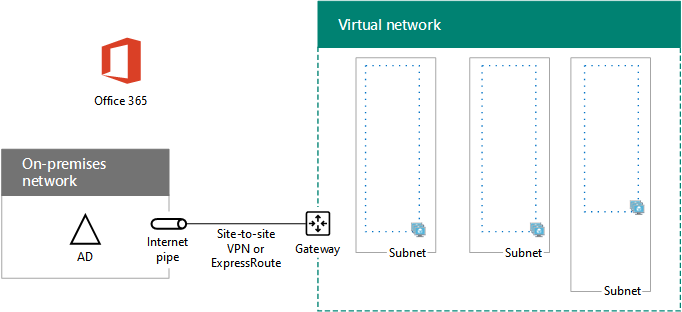

# <a name="high-availability-federated-authentication-phase-1-configure-azure"></a>Autenticação federada de alta disponibilidade Fase 1: configurar o Azure

Nesta fase, você cria os grupos de recursos, a rede virtual (VNet) e os conjuntos de disponibilidade no Azure que hospedarão as máquinas virtuais nas etapas 2, 3 e 4. Você deve concluir essa fase antes de passar para [Phase 2: Configure domain controllers](high-availability-federated-authentication-phase-2-configure-domain-controllers.md). Consulte [implantar a autenticação federada de alta disponibilidade para o Microsoft 365 no Azure](deploy-high-availability-federated-authentication-for-microsoft-365-in-azure.md) para todas as fases.
  
O Azure deve ser provisionado com estes componentes básicos:
  
- Grupo de recursos
    
- Uma rede virtual do Azure (VNet) entre locais com sub-redes para a hospedagem das máquinas virtuais do Azure
    
- Grupos de segurança de rede para a realização do isolamento de sub-redes
    
- Conjuntos de disponibilidade
    
## <a name="configure-azure-components"></a>Configurar componentes do Azure

Antes de começar a configurar componentes do Azure, preencha as tabelas a seguir. Para auxiliar nos procedimentos de configuração do Azure, imprima esta seção e anote as informações necessárias ou copie esta seção em um documento e preencha em seguida. Para as configurações da VNet, preencha a Tabela V.
  
|**Item**|**Definição de configuração**|**Descrição**|**Valor**|
|:-----|:-----|:-----|:-----|
|1.  <br/> |Nome da VNet  <br/> |Um nome a ser atribuído à VNet (exemplo FedAuthNet).  <br/> |  <br/> |
|2.  <br/> |Localização da VNet  <br/> |O datacenter do Azure regional que conterá a rede virtual.  <br/> |  <br/> |
|3.  <br/> |Endereço IP do dispositivo VPN  <br/> |O endereço IPv4 público da interface de seu dispositivo VPN na Internet.  <br/> |  <br/> |
|4.  <br/> |Espaço de endereço da VNet  <br/> |O espaço de endereço da rede virtual. Trabalhe com seu departamento de TI para determinar esse espaço de endereço.  <br/> |  <br/> |
|5.  <br/> |Chave compartilhada IPsec  <br/> |Uma cadeia alfanumérica aleatória com 32 caracteres, que será usada para autenticar ambos os lados da conexão VPN site a site. Trabalhe com seu departamento de TI ou de segurança para determinar esse valor de chave. Como alternativa, confira [Criar uma cadeia de caracteres aleatória para uma chave pré-compartilhada IPsec](https://social.technet.microsoft.com/wiki/contents/articles/32330.create-a-random-string-for-an-ipsec-preshared-key.aspx).  <br/> |  <br/> |
   
 **Tabela V: Configuração de rede virtual entre locais**
  
Em seguida, preencha a Tabela S para as sub-redes desta solução. Todos os espaços de endereço devem estar no formato de Roteamento entre Domínios sem Classificação (CIDR), também conhecido como formato de prefixo de rede. Um exemplo é 10.24.64.0/20.
  
Para as três primeiras sub-redes, especifique um nome e um único espaço de endereços IP com base no espaço de endereço da rede virtual. Para a sub-rede de gateway, determine um espaço de endereço de 27 bits (com um comprimento de prefixo /27) para a sub-rede do gateway do Azure. Use o seguinte:
  
1. Defina os bits variáveis no espaço de endereço da VNet como 1, até os bits que estão sendo usados pela sub-rede do gateway, e depois defina os bits restantes como 0.
    
2. Converta os bits resultantes em decimais e expresse-os como um espaço de endereço com o comprimento de prefixo definido como o tamanho da sub-rede do gateway.
    
Consulte a [calculadora de espaço de endereçamento para sub-redes de gateway do Azure](https://gallery.technet.microsoft.com/scriptcenter/Address-prefix-calculator-a94b6eed) para um bloco de comando do PowerShell e um aplicativo de console C# ou Python que realiza esse cálculo para você.
  
Trabalhe com seu departamento de TI para determinar esses espaços de endereço a partir do espaço de endereço da rede virtual.
  
|**Item**|**Nome da sub-rede**|**Espaço de endereço da sub-rede**|**Objetivo**|
|:-----|:-----|:-----|:-----|
|1.  <br/> |  <br/> |  <br/> |A sub-rede usada pelo controlador de domínio dos serviços de domínio do Active Directory (AD DS) e máquinas virtuais (VMs) do servidor de sincronização de diretórios.  <br/> |
|2.  <br/> |  <br/> |  <br/> |A sub-rede usada pelos VMs do AD FS.  <br/> |
|3.  <br/> |  <br/> |  <br/> |A sub-rede usada pelas VMs de proxy do aplicativo Web.  <br/> |
|4.  <br/> |GatewaySubnet  <br/> |  <br/> |A sub-rede usada pelas VMs do gateway do Azure.  <br/> |
   
 **Tabela S: Sub-redes na rede virtual**
  
Em seguida, preencha a Tabela I para os endereços IP estáticos atribuídos a máquinas virtuais e instâncias de balanceador de carga.
  
|**Item**|**Finalidade**|**Endereço IP na sub-rede**|**Valor**|
|:-----|:-----|:-----|:-----|
|1.  <br/> |Endereço IP estático do primeiro controlador de domínio  <br/> |O quarto endereço IP possível para o espaço de endereço da sub-rede definido no Item 1 da Tabela S.  <br/> |  <br/> |
|2.  <br/> |Endereço IP estático do segundo controlador de domínio  <br/> |O quinto endereço IP possível para o espaço de endereço da sub-rede definido no Item 1 da Tabela S.  <br/> |  <br/> |
|3.  <br/> |Endereço IP estático do servidor de sincronização de diretório  <br/> |O sexto endereço IP possível para o espaço de endereço da sub-rede definido no Item 1 da Tabela S.   <br/> |  <br/> |
|4.  <br/> |Endereço IP estático do balanceador de carga internos para os servidores do AD FS  <br/> |O quarto endereço IP possível para o espaço de endereço da sub-rede definido no Item 2 da Tabela S.  <br/> |  <br/> |
|5.  <br/> |Endereço IP estático do primeiro servidor do AD FS  <br/> |O quinto endereço IP possível para o espaço de endereço da sub-rede definido no Item 2 da Tabela S.  <br/> |  <br/> |
|6.  <br/> |Endereço IP estático do segundo servidor do AD FS  <br/> |O sexto endereço IP possível para o espaço de endereço da sub-rede definido no Item 2 da Tabela S.  <br/> |  <br/> |
|7.  <br/> |Endereço IP estático do primeiro servidor proxy de aplicativos Web  <br/> |O quarto endereço IP possível para o espaço de endereço da sub-rede definido no Item 3 da Tabela S.  <br/> |  <br/> |
|8.  <br/> |Endereço IP estático do segundo servidor proxy de aplicativos Web  <br/> |O quinto endereço IP possível para o espaço de endereço da sub-rede definido no Item 3 da Tabela S.  <br/> |  <br/> |
   
 **Tabela I: Endereços IP estáticos na rede virtual**
  
Para dois servidores de Sistema de Nomes de Domínio (DNS) na sua rede local que você deseja usar ao configurar controladores de domínio inicialmente na sua rede virtual, preencha a Tabela D. Trabalhe com o departamento de TI para determinar essa lista.
  
|**Item**|**Nome amigável do servidor DNS**|**Endereço IP do servidor DNS**|
|:-----|:-----|:-----|
|1.  <br/> |  <br/> |  <br/> |
|2.  <br/> |  <br/> |  <br/> |
   
 **Tabela D: servidores DNS locais**
  
Para rotear pacotes da rede entre locais para a sua rede de organização através da conexão VPN site a site, você deve configurar a rede virtual com uma rede local que tenha uma lista dos espaços de endereço (em notação CIDR) para todos os locais acessíveis na rede local da sua organização. A lista de espaços de endereço que definem a sua rede local deve ser exclusiva e não deve ser ficar sobreposta ao espaço de endereço usado para outras redes virtuais ou locais.
  
Para o conjunto de espaços de endereço da rede local, preencha a Tabela L. Observe que há três entradas em branco listadas, mas geralmente você precisará de mais. Trabalhe com seu departamento de TI para determinar esta lista de espaços de endereço.
  
|**Item**|**Espaço de endereço da rede local**|
|:-----|:-----|
|1.  <br/> |  <br/> |
|2.  <br/> |  <br/> |
|3.  <br/> |  <br/> |
   
 **Tabela L: Prefixos de endereço para a rede local**
  
Agora, vamos começar a criar a infraestrutura do Azure para hospedar sua autenticação federada para o Microsoft 365.
  
> [!NOTE]
> [!OBSERVAçãO] O comando a seguir define o uso da versão mais recente do Azure PowerShell. Confira [introdução ao PowerShell do Azure](https://docs.microsoft.com/powershell/azure/get-started-azureps). 
  
Primeiro, inicie um prompt do Azure PowerShell e faça logon na sua conta.
  
```powershell
Connect-AzAccount
```

> [!TIP]
> Para gerar blocos de comando prontos para executar do PowerShell com base em suas configurações personalizadas, use esta [pasta de trabalho de configuração do Microsoft Excel](https://github.com/MicrosoftDocs/OfficeDocs-Enterprise/raw/live/Enterprise/downloads/O365FedAuthInAzure_Config.xlsx). 

Para obter o nome de sua assinatura, use este comando.
  
```powershell
Get-AzSubscription | Sort Name | Select Name
```

Para versões mais antigas do Azure PowerShell, use esse comando em vez disso.
  
```powershell
Get-AzSubscription | Sort Name | Select SubscriptionName
```

Defina sua assinatura do Azure. Substitua tudo dentro das aspas, incluindo os \< and > caracteres, pelo nome correto.
  
```powershell
$subscrName="<subscription name>"
Select-AzSubscription -SubscriptionName $subscrName
```

Em seguida, crie os novos grupos de recursos. Para determinar um conjunto exclusivo de nomes de grupo de recursos, use este comando para listar os grupos de recurso existentes.
  
```powershell
Get-AzResourceGroup | Sort ResourceGroupName | Select ResourceGroupName
```

Preencha a tabela a seguir para o conjunto de nomes de grupos de recursos exclusivos.
  
|**Item**|**Nome do grupo de recursos**|**Objetivo**|
|:-----|:-----|:-----|
|1.  <br/> |  <br/> |Controladores de domínio:  <br/> |
|2.  <br/> |  <br/> |Servidores do AD FS  <br/> |
|3.  <br/> |  <br/> |Servidores proxy de aplicativos Web  <br/> |
|4.  <br/> |  <br/> |Elementos de infraestrutura  <br/> |
   
 **Tabela R: Grupo de recursos**
  
Crie os novos grupos de recursos com estes comandos.
  
```powershell
$locName="<an Azure location, such as West US>"
$rgName="<Table R - Item 1 - Name column>"
New-AzResourceGroup -Name $rgName -Location $locName
$rgName="<Table R - Item 2 - Name column>"
New-AzResourceGroup -Name $rgName -Location $locName
$rgName="<Table R - Item 3 - Name column>"
New-AzResourceGroup -Name $rgName -Location $locName
$rgName="<Table R - Item 4 - Name column>"
New-AzResourceGroup -Name $rgName -Location $locName
```

Em seguida, você criará a rede virtual do Azure e suas sub-redes.
  
```powershell
$rgName="<Table R - Item 4 - Resource group name column>"
$locName="<your Azure location>"
$vnetName="<Table V - Item 1 - Value column>"
$vnetAddrPrefix="<Table V - Item 4 - Value column>"
$dnsServers=@( "<Table D - Item 1 - DNS server IP address column>", "<Table D - Item 2 - DNS server IP address column>" )
# Get the shortened version of the location
$locShortName=(Get-AzResourceGroup -Name $rgName).Location

# Create the subnets
$subnet1Name="<Table S - Item 1 - Subnet name column>"
$subnet1Prefix="<Table S - Item 1 - Subnet address space column>"
$subnet1=New-AzVirtualNetworkSubnetConfig -Name $subnet1Name -AddressPrefix $subnet1Prefix
$subnet2Name="<Table S - Item 2 - Subnet name column>"
$subnet2Prefix="<Table S - Item 2 - Subnet address space column>"
$subnet2=New-AzVirtualNetworkSubnetConfig -Name $subnet2Name -AddressPrefix $subnet2Prefix
$subnet3Name="<Table S - Item 3 - Subnet name column>"
$subnet3Prefix="<Table S - Item 3 - Subnet address space column>"
$subnet3=New-AzVirtualNetworkSubnetConfig -Name $subnet3Name -AddressPrefix $subnet3Prefix
$gwSubnet4Prefix="<Table S - Item 4 - Subnet address space column>"
$gwSubnet=New-AzVirtualNetworkSubnetConfig -Name "GatewaySubnet" -AddressPrefix $gwSubnet4Prefix

# Create the virtual network
New-AzVirtualNetwork -Name $vnetName -ResourceGroupName $rgName -Location $locName -AddressPrefix $vnetAddrPrefix -Subnet $gwSubnet,$subnet1,$subnet2,$subnet3 -DNSServer $dnsServers

```

Em seguida, crie grupos de segurança de rede para cada sub-rede que tenha máquinas virtuais. Para executar o isolamento de sub-rede, você pode adicionar regras para os tipos específicos de tráfego permitidos ou negados para o grupo de segurança de rede de uma sub-rede.
  
```powershell
# Create network security groups
$vnet=Get-AzVirtualNetwork -ResourceGroupName $rgName -Name $vnetName

New-AzNetworkSecurityGroup -Name $subnet1Name -ResourceGroupName $rgName -Location $locShortName
$nsg=Get-AzNetworkSecurityGroup -Name $subnet1Name -ResourceGroupName $rgName
Set-AzVirtualNetworkSubnetConfig -VirtualNetwork $vnet -Name $subnet1Name -AddressPrefix $subnet1Prefix -NetworkSecurityGroup $nsg

New-AzNetworkSecurityGroup -Name $subnet2Name -ResourceGroupName $rgName -Location $locShortName
$nsg=Get-AzNetworkSecurityGroup -Name $subnet2Name -ResourceGroupName $rgName
Set-AzVirtualNetworkSubnetConfig -VirtualNetwork $vnet -Name $subnet2Name -AddressPrefix $subnet2Prefix -NetworkSecurityGroup $nsg

New-AzNetworkSecurityGroup -Name $subnet3Name -ResourceGroupName $rgName -Location $locShortName
$nsg=Get-AzNetworkSecurityGroup -Name $subnet3Name -ResourceGroupName $rgName
Set-AzVirtualNetworkSubnetConfig -VirtualNetwork $vnet -Name $subnet3Name -AddressPrefix $subnet3Prefix -NetworkSecurityGroup $nsg
$vnet | Set-AzVirtualNetwork
```

Em seguida, use estes comandos para criar os gateways para a conexão VPN site a site.
  
```powershell
$rgName="<Table R - Item 4 - Resource group name column>"
$locName="<Azure location>"
$vnetName="<Table V - Item 1 - Value column>"
$vnet=Get-AzVirtualNetwork -Name $vnetName -ResourceGroupName $rgName
$subnet=Get-AzVirtualNetworkSubnetConfig -VirtualNetwork $vnet -Name "GatewaySubnet"

# Attach a virtual network gateway to a public IP address and the gateway subnet
$publicGatewayVipName="PublicIPAddress"
$vnetGatewayIpConfigName="PublicIPConfig"
New-AzPublicIpAddress -Name $vnetGatewayIpConfigName -ResourceGroupName $rgName -Location $locName -AllocationMethod Dynamic
$publicGatewayVip=Get-AzPublicIpAddress -Name $vnetGatewayIpConfigName -ResourceGroupName $rgName
$vnetGatewayIpConfig=New-AzVirtualNetworkGatewayIpConfig -Name $vnetGatewayIpConfigName -PublicIpAddressId $publicGatewayVip.Id -Subnet $subnet

# Create the Azure gateway
$vnetGatewayName="AzureGateway"
$vnetGateway=New-AzVirtualNetworkGateway -Name $vnetGatewayName -ResourceGroupName $rgName -Location $locName -GatewayType Vpn -VpnType RouteBased -IpConfigurations $vnetGatewayIpConfig

# Create the gateway for the local network
$localGatewayName="LocalNetGateway"
$localGatewayIP="<Table V - Item 3 - Value column>"
$localNetworkPrefix=@( <comma-separated, double-quote enclosed list of the local network address prefixes from Table L, example: "10.1.0.0/24", "10.2.0.0/24"> )
$localGateway=New-AzLocalNetworkGateway -Name $localGatewayName -ResourceGroupName $rgName -Location $locName -GatewayIpAddress $localGatewayIP -AddressPrefix $localNetworkPrefix

# Define the Azure virtual network VPN connection
$vnetConnectionName="S2SConnection"
$vnetConnectionKey="<Table V - Item 5 - Value column>"
$vnetConnection=New-AzVirtualNetworkGatewayConnection -Name $vnetConnectionName -ResourceGroupName $rgName -Location $locName -ConnectionType IPsec -SharedKey $vnetConnectionKey -VirtualNetworkGateway1 $vnetGateway -LocalNetworkGateway2 $localGateway

```

> [!NOTE]
> A autenticação federada de usuários individuais não confia em nenhum recurso local. No entanto, se esta conexão VPN de site a site ficar indisponível, os controladores de domínio no VNet não receberão atualizações para contas de usuário e grupos feitos nos serviços de domínio do Active Directory local. Para garantir que isso não aconteça, é possível configurar a alta disponibilidade para a conexão VPN site a site. Veja mais informações em [Conectividade VNet para VNet e entre instalações altamente disponível](https://docs.microsoft.com/azure/vpn-gateway/vpn-gateway-highlyavailable)
  
Em seguida, registre o endereço IPv4 público do gateway de VPN do Azure para a sua rede virtual na exibição deste comando:
  
```powershell
Get-AzPublicIpAddress -Name $publicGatewayVipName -ResourceGroupName $rgName
```

Em seguida, configure seu dispositivo VPN local para se conectar ao gateway de VPN do Azure. Para saber mais, veja [Configurar seu dispositivo VPN](https://docs.microsoft.com/azure/vpn-gateway/vpn-gateway-about-vpn-devices).
  
Para configurar seu dispositivo VPN local, você precisará do seguinte:
  
- O endereço IPv4 público do gateway de VPN do Azure.
    
- A chave IPsec pré-compartilhada para a conexão VPN de site a site (Tabela V - Item 5 - coluna Valor).
    
Em seguida, certifique-se de que o espaço de endereço da rede virtual seja acessível a partir da sua rede local. Isso é feito geralmente com a inclusão de uma rota correspondente ao espaço de endereço da rede virtual para o seu dispositivo VPN e, em seguida, publicando essa rota ao restante da infraestrutura de roteamento da rede da sua organização. Trabalhe com seu departamento de TI para determinar como fazer isso.
  
Em seguida, defina os nomes de três conjuntos de disponibilidade. Preencha a Tabela A.  
  
|**Item**|**Finalidade**|**Nome do conjunto de disponibilidade**|
|:-----|:-----|:-----|
|1.  <br/> |Controladores de domínio:  <br/> |  <br/> |
|2.  <br/> |Servidores do AD FS  <br/> |  <br/> |
|3.  <br/> |Servidores proxy de aplicativos Web  <br/> |  <br/> |
   
 **Tabela A: Conjuntos de disponibilidade**
  
Você precisará desses nomes quando criar as máquinas virtuais nas fases 2, 3 e 4.
  
Crie os novos conjuntos de disponibilidade com estes comandos do Azure PowerShell.
  
```powershell
$locName="<the Azure location for your new resource group>"
$rgName="<Table R - Item 1 - Resource group name column>"
$avName="<Table A - Item 1 - Availability set name column>"
New-AzAvailabilitySet -ResourceGroupName $rgName -Name $avName -Location $locName -Sku Aligned  -PlatformUpdateDomainCount 5 -PlatformFaultDomainCount 2
$rgName="<Table R - Item 2 - Resource group name column>"
$avName="<Table A - Item 2 - Availability set name column>"
New-AzAvailabilitySet -ResourceGroupName $rgName -Name $avName -Location $locName -Sku Aligned  -PlatformUpdateDomainCount 5 -PlatformFaultDomainCount 2
$rgName="<Table R - Item 3 - Resource group name column>"
$avName="<Table A - Item 3 - Availability set name column>"
New-AzAvailabilitySet -ResourceGroupName $rgName -Name $avName -Location $locName -Sku Aligned  -PlatformUpdateDomainCount 5 -PlatformFaultDomainCount 2
```

Esta é a configuração resultante da conclusão bem-sucedida dessa fase.
  
**Fase 1: a infraestrutura do Azure para autenticação federada de alta disponibilidade para o Microsoft 365**


  
## <a name="next-step"></a>Próxima etapa

Use a [fase 2: configurar os controladores de domínio](high-availability-federated-authentication-phase-2-configure-domain-controllers.md) para continuar com a configuração dessa carga de trabalho.
  
## <a name="see-also"></a>Confira também

[Implantar a autenticação federada de alta disponibilidade para o Microsoft 365 no Azure](deploy-high-availability-federated-authentication-for-microsoft-365-in-azure.md)
  
[Identidade federada para seu ambiente de desenvolvimento/teste do Microsoft 365](federated-identity-for-your-microsoft-365-dev-test-environment.md)
  
[Centro de soluções e arquitetura do Microsoft 365](../solutions/solution-architecture-center.md)

[Noções básicas sobre a identidade do Microsoft 365 e o Azure Active Directory](about-microsoft-365-identity.md)


