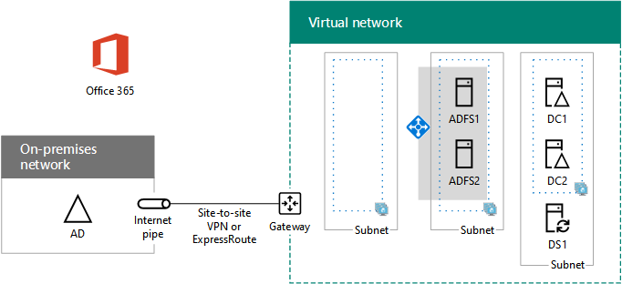

# <a name="high-availability-federated-authentication-phase-3-configure-ad-fs-servers"></a>Autenticação federada de alta disponibilidade Fase 3: configurar servidores de AD FS

Nesta fase de implantação de alta disponibilidade para autenticação federada do Microsoft 365 nos serviços de infraestrutura do Azure, você cria um balanceador de carga interno e dois servidores AD FS.
  
Você deve concluir essa fase antes de passar para a [Fase 4: Configurar proxies de](high-availability-federated-authentication-phase-4-configure-web-application-pro.md)aplicativo Web. Consulte [Deploy high availability federated authentication for Microsoft 365 in Azure](deploy-high-availability-federated-authentication-for-microsoft-365-in-azure.md) for all of the phases.
  
## <a name="create-the-ad-fs-server-virtual-machines-in-azure"></a>Criar máquinas virtuais dos servidores do AD FS no Azure

Use o seguinte bloco de comandos do PowerShell para criar as máquinas virtuais para os dois servidores do AD FS. Este conjunto de comandos do PowerShell usa valores das seguintes tabelas:
  
- Tabela M, para suas máquinas virtuais
    
- Tabela R, para seus grupos de recursos
    
- Tabela V, para suas configurações de rede virtual
    
- Tabela S, para suas sub-redes
    
- Tabela I, para seu endereço IP estático
    
- Tabela A, para seus conjuntos de disponibilidade
    
Lembre-se de que você definiu a Tabela M na Fase [2: Configurar](high-availability-federated-authentication-phase-2-configure-domain-controllers.md) controladores de domínio e Tabelas R, V, S, I e A na Fase [1: Configurar o Azure](high-availability-federated-authentication-phase-1-configure-azure.md).
  
> [!NOTE]
> [!OBSERVAçãO] O comando a seguir define o uso da versão mais recente do Azure PowerShell. Consulte [Começar com o Azure PowerShell](/powershell/azure/get-started-azureps). 
  
Em primeiro lugar, crie um balanceador de carga interno do Azure para os dois servidores do AD FS. Especifique os valores das variáveis, removendo os \< and > caracteres. Quando tiver fornecido todos os valores apropriados, execute o bloco resultante no prompt de comando do Azure PowerShell ou no ISE do PowerShell.
  
> [!TIP]
> Para gerar blocos de comando prontos para execução do PowerShell com base em suas configurações personalizadas, use esta planilha de configuração [do Microsoft Excel](https://github.com/MicrosoftDocs/OfficeDocs-Enterprise/raw/live/Enterprise/downloads/O365FedAuthInAzure_Config.xlsx). 

```powershell
# Set up key variables
$locName="<your Azure location>"
$vnetName="<Table V - Item 1 - Value column>"
$subnetName="<Table R - Item 2 - Subnet name column>"
$privIP="<Table I - Item 4 - Value column>"
$rgName=<Table R - Item 4 - Resource group name column>"

$vnet=Get-AzVirtualNetwork -Name $vnetName -ResourceGroupName $rgName
$subnet=Get-AzVirtualNetworkSubnetConfig -VirtualNetwork $vnet -Name $subnetName

$frontendIP=New-AzLoadBalancerFrontendIpConfig -Name "ADFSServers-LBFE" -PrivateIPAddress $privIP -Subnet $subnet
$beAddressPool=New-AzLoadBalancerBackendAddressPoolConfig -Name "ADFSServers-LBBE"

$healthProbe=New-AzLoadBalancerProbeConfig -Name WebServersProbe -Protocol "TCP" -Port 443 -IntervalInSeconds 15 -ProbeCount 2
$lbrule=New-AzLoadBalancerRuleConfig -Name "HTTPSTraffic" -FrontendIpConfiguration $frontendIP -BackendAddressPool $beAddressPool -Probe $healthProbe -Protocol "TCP" -FrontendPort 443 -BackendPort 443
New-AzLoadBalancer -ResourceGroupName $rgName -Name "ADFSServers" -Location $locName -LoadBalancingRule $lbrule -BackendAddressPool $beAddressPool -Probe $healthProbe -FrontendIpConfiguration $frontendIP
```

Em seguida, crie máquinas virtuais dos servidores do AD FS.
  
Quando tiver fornecido todos os valores apropriados, execute o bloco resultante no prompt de comando do Azure PowerShell ou no ISE do PowerShell.
  
```powershell
# Set up variables common to both virtual machines
$locName="<your Azure location>"
$vnetName="<Table V - Item 1 - Value column>"
$subnetName="<Table R - Item 2 - Subnet name column>"
$avName="<Table A - Item 2 - Availability set name column>"
$rgNameTier="<Table R - Item 2 - Resource group name column>"
$rgNameInfra="<Table R - Item 4 - Resource group name column>"

$rgName=$rgNameInfra
$vnet=Get-AzVirtualNetwork -Name $vnetName -ResourceGroupName $rgName
$subnet=Get-AzVirtualNetworkSubnetConfig -VirtualNetwork $vnet -Name $subnetName
$backendSubnet=Get-AzVirtualNetworkSubnetConfig -Name $subnetName -VirtualNetwork $vnet
$webLB=Get-AzLoadBalancer -ResourceGroupName $rgName -Name "ADFSServers"

$rgName=$rgNameTier
$avSet=Get-AzAvailabilitySet -Name $avName -ResourceGroupName $rgName

# Create the first ADFS server virtual machine
$vmName="<Table M - Item 4 - Virtual machine name column>"
$vmSize="<Table M - Item 4 - Minimum size column>"
$staticIP="<Table I - Item 5 - Value column>"
$diskStorageType="<Table M - Item 4 - Storage type column>"

$nic=New-AzNetworkInterface -Name ($vmName +"-NIC") -ResourceGroupName $rgName -Location $locName -Subnet $backendSubnet -LoadBalancerBackendAddressPool $webLB.BackendAddressPools[0] -PrivateIpAddress $staticIP
$vm=New-AzVMConfig -VMName $vmName -VMSize $vmSize -AvailabilitySetId $avset.Id

$cred=Get-Credential -Message "Type the name and password of the local administrator account for the first AD FS server." 
$vm=Set-AzVMOperatingSystem -VM $vm -Windows -ComputerName $vmName -Credential $cred -ProvisionVMAgent -EnableAutoUpdate
$vm=Set-AzVMSourceImage -VM $vm -PublisherName MicrosoftWindowsServer -Offer WindowsServer -Skus 2016-Datacenter -Version "latest"
$vm=Add-AzVMNetworkInterface -VM $vm -Id $nic.Id
$vm=Set-AzVMOSDisk -VM $vm -Name ($vmName +"-OS") -DiskSizeInGB 128 -CreateOption FromImage -StorageAccountType $diskStorageType
New-AzVM -ResourceGroupName $rgName -Location $locName -VM $vm

# Create the second AD FS virtual machine
$vmName="<Table M - Item 5 - Virtual machine name column>"
$vmSize="<Table M - Item 5 - Minimum size column>"
$staticIP="<Table I - Item 6 - Value column>"
$diskStorageType="<Table M - Item 5 - Storage type column>"

$nic=New-AzNetworkInterface -Name ($vmName +"-NIC") -ResourceGroupName $rgName -Location $locName  -Subnet $backendSubnet -LoadBalancerBackendAddressPool $webLB.BackendAddressPools[0] -PrivateIpAddress $staticIP
$vm=New-AzVMConfig -VMName $vmName -VMSize $vmSize -AvailabilitySetId $avset.Id

$cred=Get-Credential -Message "Type the name and password of the local administrator account for the second AD FS server." 
$vm=Set-AzVMOperatingSystem -VM $vm -Windows -ComputerName $vmName -Credential $cred -ProvisionVMAgent -EnableAutoUpdate
$vm=Set-AzVMSourceImage -VM $vm -PublisherName MicrosoftWindowsServer -Offer WindowsServer -Skus 2016-Datacenter -Version "latest"
$vm=Add-AzVMNetworkInterface -VM $vm -Id $nic.Id
$vm=Set-AzVMOSDisk -VM $vm -Name ($vmName +"-OS") -DiskSizeInGB 128 -CreateOption FromImage -StorageAccountType $diskStorageType
New-AzVM -ResourceGroupName $rgName -Location $locName -VM $vm

```

> [!NOTE]
> Como essas máquinas virtuais são para um aplicativo de intranet, elas não recebem um endereço IP público ou um rótulo de nome de domínio DNS, nem estão expostas à Internet. No entanto, isso também significa que você não pode se conectar a eles no portal do Azure. A opção **Conectar** não está disponível quando você visualiza as propriedades da máquina virtual. Use o acessório Conexão de Área de Trabalho Remota ou outra ferramenta de Área de Trabalho Remota para se conectar à máquina virtual usando seu endereço IP privado ou o nome DNS da intranet.
  
Para cada máquina virtual, use o cliente de área de trabalho remota de sua preferência e crie uma conexão de área de trabalho remota. Use seu nome de computador ou DNS de intranet e as credenciais da conta de administrador local.
  
Para cada máquina virtual, junte-os ao domínio apropriado dos Serviços de Domínio do Active Directory (AD DS) com esses comandos no prompt Windows PowerShell.
  
```powershell
$domName="<AD DS domain name to join, such as corp.contoso.com>"
$cred=Get-Credential -Message "Type the name and password of a domain acccount."
Add-Computer -DomainName $domName -Credential $cred
Restart-Computer
```

Veja a seguir a configuração resultante da conclusão bem-sucedida dessa fase, com nomes de computador de espaço reservado.
  
**Fase 3: Os servidores do AD FS e o balanceador de carga interno para a sua infraestrutura de autenticação federada de alta disponibilidade no Azure**


  
## <a name="next-step"></a>Próxima etapa

Use [a Fase 4: Configurar proxies de](high-availability-federated-authentication-phase-4-configure-web-application-pro.md) aplicativo Web para continuar configurando essa carga de trabalho.
  
## <a name="see-also"></a>Confira também

[Implantar a autenticação federada de alta disponibilidade para o Microsoft 365 no Azure](deploy-high-availability-federated-authentication-for-microsoft-365-in-azure.md)
  
[Identidade federada para seu ambiente de dev/test do Microsoft 365](federated-identity-for-your-microsoft-365-dev-test-environment.md)