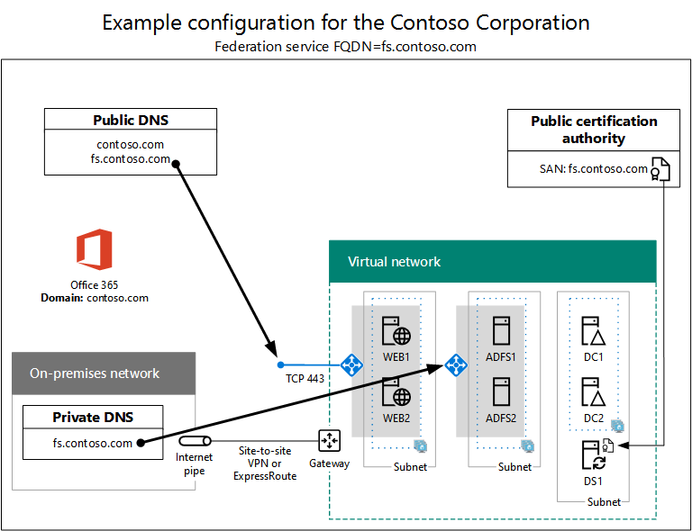

# Autenticação federada de alta disponibilidade Fase 5: Configurar autenticação federada para o Microsoft 365

Nesta fase final da implantação da autenticação federada de alta disponibilidade para o Microsoft 365 nos serviços de infraestrutura do Azure, você obterá e instalará um certificado emitido por uma autoridade de certificação pública, verifique sua configuração e instale e execute o Azure AD Connect no servidor de sincronização de diretórios. O Azure AD Connect configura sua assinatura do Microsoft 365 e seus Serviços de Federação do Active Directory (AD FS) e servidores proxy de aplicativo Web para autenticação federada.
  
Consulte [Deploy high availability federated authentication for Microsoft 365 in Azure](deploy-high-availability-federated-authentication-for-microsoft-365-in-azure.md) for all of the phases.
  
## Obter um certificado público e copiá-lo para o servidor de sincronização de diretórios

Obter um certificado digital de uma autoridade de certificação pública com as seguintes propriedades:
  
- Um certificado X.509 adequado para criar conexões SSL.
    
- A propriedade estendida Nome Alternativo do Assunto (SAN) é definida como FQDN do serviço de federação (exemplo: fs.contoso.com).
    
- O certificado deve ter a chave privada e ser armazenado no formato PFX.
    
Além disso, os computadores e dispositivos da sua organização devem confiar na autoridade de certificação pública que está em emissão do certificado digital. Essa confiança é estabelecida por ter um certificado raiz da autoridade de certificação pública instalada no armazenamento de autoridades de certificação raiz confiáveis em seus computadores e dispositivos. Os computadores que executam o Microsoft Windows geralmente têm um conjunto desses tipos de certificados instalados de autoridades de certificação comumente usadas. Se o certificado raiz da sua autoridade de certificação pública ainda não estiver instalado, você deverá implantá-lo nos computadores e dispositivos da sua organização.
  
Para obter mais informações sobre os requisitos de certificado para autenticação federada, consulte [Prerequisites for federation installation and configuration](/azure/active-directory/connect/active-directory-aadconnect-prerequisites#prerequisites-for-federation-installation-and-configuration).
  
Quando você receber o certificado, copie-o para uma pasta na unidade C: do servidor de sincronização de diretórios. Por exemplo, nomee o arquivo SSL.pfx e armazene-o na pasta C: \\ Certs no servidor de sincronização de diretório.
  
## Verificar sua configuração

Agora você deve estar pronto para configurar o Azure AD Connect e a autenticação federada para o Microsoft 365. Para garantir que você está, aqui está uma lista de verificação:
  
- O domínio público da sua organização é adicionado à sua assinatura do Microsoft 365.
    
- As contas de usuário do Microsoft 365 da sua organização são configuradas com o nome de domínio público da sua organização e podem entrar com êxito.
    
- Você determinou um FQDN de serviço de federação com base em seu nome de domínio público.
    
- Um registro DNS A público para o FQDN do serviço de federação aponta para o endereço IP público do balanceador de carga do Azure voltado para a Internet para os servidores proxy do aplicativo Web.
    
- Um registro DNS A privado para o FQDN do serviço de federação aponta para o endereço IP privado do balanceador de carga interno do Azure para os servidores do AD FS.
    
- Um certificado digital emitido pela autoridade de certificação pública adequado para conexões SSL com a SAN definida como FQDN do serviço de federação é um arquivo PFX armazenado no servidor de sincronização de diretórios.
    
- O certificado raiz da autoridade de certificação pública está instalado no armazenamento autoridades de certificação raiz confiáveis em seus computadores e dispositivos.
    
Veja um exemplo para a organização Contoso:
  
**Um exemplo de configuração para uma infraestrutura de autenticação federada de alta disponibilidade no Azure**

  
## Executar o Azure AD Connect para configurar a autenticação federada

A ferramenta do Azure AD Connect configura os servidores do AD FS, os servidores proxy de aplicativo Web e o Microsoft 365 para autenticação federada com estas etapas:
  
1. Crie uma conexão de área de trabalho remota com seu servidor de sincronização de diretório com uma conta de domínio que tenha privilégios de administrador local.
    
2. Na área de trabalho do servidor de sincronização de diretórios, abra o Internet Explorer e vá para [https://aka.ms/aadconnect](https://aka.ms/aadconnect) .
    
3. Na página **Conexão do Microsoft Azure Active Directory,** clique em **Baixar** e clique em **Executar**.
    
4. Na página **Bem-vindo ao Azure AD Connect,** clique em **Concordo** e clique em **Continuar.**
    
5. Na página **Configurações Expressas**, clique em **Personalizar**.
    
6. Na página **Instalar componentes necessários**, clique em **Instalar**. 
    
7. Na página **Entrada do usuário**, clique em **Federação com AD FS** e em **Avançar**.
    
8. Na página **Conectar-se ao Azure AD,** digite o nome e a senha de uma conta de administrador global para sua assinatura do Microsoft 365 e clique em **Próximo**.
    
9. Na página Conectar **seus** diretórios, certifique-se de que sua floresta local dos Serviços de Domínio do Active Directory (AD DS) está selecionada em **Floresta,** digite o nome e a senha de uma conta de administrador de domínio, clique em **Adicionar** Diretório e clique em **Próximo**.
    
10. Na página configuração de entrada do **Azure AD,** clique em **Próximo**.
    
11. Na página **Filtragem de Domínio e UO,** clique em **Próximo**.
    
12. Na página **Identificar seus** usuários com exclusividade, clique em **Próximo**.
    
13. Na página **Filtrar usuários e dispositivos,** clique em **Próximo**.
    
14. Na página **Recursos opcionais,** clique em **Próximo**.
    
15. Na página **do farm do AD FS,** clique em **Configurar um novo farm do AD FS.**
    
16. Clique **em Procurar** e especifique o local e o nome do certificado SSL da autoridade de certificação pública.
    
17. Quando solicitado, digite a senha do certificado e clique em **OK**.
    
18. Verifique se o **Nome do Assunto e** o Nome do Serviço de **Federação** estão definidos como FQDN do serviço de federação e clique em **Próximo**.
    
19. Na página servidores **do AD FS,** digite o nome do seu primeiro servidor do AD FS (Tabela M - Item 4 - coluna nome da máquina virtual) e clique em **Adicionar**.
    
20. Digite o segundo nome do servidor do AD FS (Tabela M - Item 5 - coluna nome da máquina virtual), clique em **Adicionar** e clique em **Próximo**.
    
21. Na página **Servidores Proxy** de Aplicativo Web, digite o nome do seu primeiro servidor proxy de aplicativo Web (Tabela M - Item 6 - coluna nome da máquina virtual) e clique em **Adicionar**.
    
22. Digite o nome do seu segundo servidor proxy de aplicativo Web (Tabela M - Item 7 - coluna nome da máquina virtual), clique em **Adicionar** e clique em **Próximo**.
    
23. Na página **Credenciais de Administrador** de Domínio, digite o nome de usuário e a senha de uma conta de administrador de domínio e clique em **Próximo**.
    
24. Na página **conta de serviço do AD FS,** digite o nome de usuário e a senha de uma conta de administrador da empresa e clique em **Próximo**.
    
25. Na página **Domínio do Azure AD,** em **Domínio,** selecione o nome de domínio DNS da sua organização e clique em **Próximo**.
    
26. Na página **Pronto para configurar**, clique em **Instalar**.
    
27. Na página **Instalação Completa**, clique em **Verificar**. Você deve ver duas mensagens indicando que a intranet e a configuração da Internet foram verificadas com êxito.
    
  - A mensagem intranet deve listar o endereço IP privado do balanceador de carga interno do Azure para seus servidores do AD FS.
    
  - A mensagem da Internet deve listar o endereço IP público do balanceador de carga voltado para a Internet do Azure para seus servidores proxy de aplicativo Web.
    
28. Na página **Instalação Completa**, clique em **Fechar**.
    
Aqui está a configuração final, com nomes de espaço reservado para os servidores.
  
**Fase 5: a configuração final de uma infraestrutura de autenticação federada de alta disponibilidade no Azure**

  
Sua infraestrutura de autenticação federada de alta disponibilidade para o Microsoft 365 no Azure está concluída.
  
## Confira também

[Implantar a autenticação federada de alta disponibilidade para o Microsoft 365 no Azure](deploy-high-availability-federated-authentication-for-microsoft-365-in-azure.md)
  
[Identidade federada para seu ambiente de dev/test do Microsoft 365](federated-identity-for-your-microsoft-365-dev-test-environment.md)
  
[Centro de soluções e arquitetura do Microsoft 365](../solutions/index.yml)

[Identidade federada do Microsoft 365](https://support.office.com/article/Understanding-Office-365-identity-and-Azure-Active-Directory-06a189e7-5ec6-4af2-94bf-a22ea225a7a9#bk_federated)