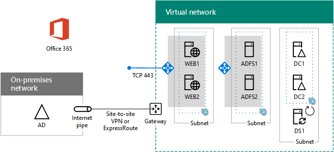

# Autenticação federada de alta disponibilidade fase 5: configurar a autenticação federada para o Microsoft 365

Nesta fase final da implantação da autenticação federada de alta disponibilidade para o Microsoft 365 nos serviços de infraestrutura do Azure, você obtém e instala um certificado emitido por uma autoridade de certificação pública, verifica sua configuração e instala e executa o Azure AD Connect no servidor de sincronização de diretório. O Azure AD Connect configura sua assinatura do Microsoft 365 e seus serviços de Federação do Active Directory (AD FS) e servidores de proxy de aplicativo Web para autenticação federada.
  
Consulte [implantar a autenticação federada de alta disponibilidade para o Microsoft 365 no Azure](deploy-high-availability-federated-authentication-for-microsoft-365-in-azure.md) para todas as fases.
  
## Obter um certificado público e copiá-lo para o servidor de sincronização de diretório

Obtenha um certificado digital de uma autoridade de certificação pública com as seguintes propriedades:
  
- Um certificado X. 509 adequado para a criação de conexões SSL.
    
- A propriedade estendida do nome alternativo da entidade (SAN) é definida como o FQDN do serviço de Federação (exemplo: fs.contoso.com).
    
- O certificado deve ter a chave privada e ser armazenado no formato PFX.
    
Além disso, seus computadores e dispositivos da organização devem confiar na autoridade de certificação pública que está emitindo o certificado digital. Essa relação de confiança é estabelecida com um certificado raiz da autoridade de certificação pública instalada no repositório de autoridades de certificação raiz confiáveis em seus computadores e dispositivos. Os computadores que executam o Microsoft Windows normalmente têm um conjunto desses tipos de certificados instalados a partir de autoridades de certificação comumente usadas. Se o certificado raiz da autoridade de certificação pública ainda não estiver instalado, você deve implantá-lo nos computadores e dispositivos da sua organização.
  
Para obter mais informações sobre os requisitos de certificado para autenticação federada, consulte [pré-requisitos para instalação e configuração de Federação](https://docs.microsoft.com/azure/active-directory/connect/active-directory-aadconnect-prerequisites#prerequisites-for-federation-installation-and-configuration).
  
Ao receber o certificado, copie-o para uma pasta na unidade C: do servidor de sincronização de diretório. Por exemplo, nomeie o arquivo SSL. pfx e armazene-o na pasta C: \\ certs no servidor de sincronização de diretório.
  
## Verificar a configuração

Agora você deve estar pronto para configurar o Azure AD Connect e a autenticação federada para o Microsoft 365. Para garantir que você está, aqui está uma lista de verificação:
  
- O domínio público da sua organização é adicionado à sua assinatura do Microsoft 365.
    
- As contas de usuário do Microsoft 365 da sua organização são configuradas para o nome de domínio público da sua organização e podem entrar com êxito.
    
- Você determinou um FQDN de serviço de Federação com base em seu nome de domínio público.
    
- Um registro de DNS público para o FQDN do serviço de Federação aponta para o endereço IP público do balanceador de carga do Azure voltado para a Internet para os servidores proxy de aplicativo Web.
    
- Um registro de DNS privado para o FQDN do serviço de Federação aponta para o endereço IP privado do balanceador de carga interno do Azure para os servidores do AD FS.
    
- Uma autoridade de certificação pública-isssued certificado digital adequado para conexões SSL com o conjunto SAN como o FQDN do serviço de Federação é um arquivo PFX armazenado no servidor de sincronização de diretório.
    
- O certificado raiz da autoridade de certificação pública é instalado no repositório de autoridades de certificação raiz confiáveis em seus computadores e dispositivos.
    
Veja um exemplo da organização Contoso:
  
**Uma configuração de exemplo para uma infraestrutura de autenticação federada de alta disponibilidade no Azure**

  
## Executar o Azure AD Connect para configurar a autenticação federada

A ferramenta Azure AD Connect configura os servidores do AD FS, os servidores de proxy de aplicativo Web e o Microsoft 365 para autenticação federada com estas etapas:
  
1. Crie uma conexão de área de trabalho remota para seu servidor de sincronização de diretório com uma conta de domínio que tenha privilégios de administrador local.
    
2. Na área de trabalho do servidor de sincronização de diretório, abra o Internet Explorer e vá para [https://aka.ms/aadconnect](https://aka.ms/aadconnect) .
    
3. Na página do **Microsoft Azure Active Directory Connect** , clique em **baixar**e em **executar**.
    
4. Na página **Bem-vindo ao Azure ad Connect** , clique em **concordo**e, em seguida, clique em **continuar.**
    
5. Na página **Configurações Expressas**, clique em **Personalizar**.
    
6. Na página **Instalar componentes necessários**, clique em **Instalar**. 
    
7. Na página **Entrada do usuário**, clique em **Federação com AD FS** e em **Avançar**.
    
8. Na página **conectar ao Azure ad** , digite o nome e a senha de uma conta de administrador global para sua assinatura do Microsoft 365 e clique em **Avançar**.
    
9. Na página **conectar seus diretórios** , verifique se a floresta de serviços de domínio do Active Directory (AD DS) local está selecionada em **floresta**, digite o nome e a senha de uma conta de administrador de domínio, clique em **Adicionar diretório**e, em seguida, clique em **Avançar**.
    
10. Na página **configuração de entrada do Azure ad** , clique em **Avançar**.
    
11. Na página **filtragem de ou domínio** , clique em **Avançar**.
    
12. Na página **identificando exclusivamente os usuários** , clique em **Avançar**.
    
13. Na página **Filtrar usuários e dispositivos** , clique em **Avançar**.
    
14. Na página **recursos opcionais** , clique em **Avançar**.
    
15. Na página **farm do AD FS** , clique em **configurar um novo farm do AD FS**.
    
16. Clique em **procurar** e especifique o local e o nome do certificado SSL da autoridade de certificação pública.
    
17. Quando solicitado, digite a senha do certificado e clique em **OK**.
    
18. Verifique se o **nome do requerente** e o **nome do serviço de Federação** estão definidos para o FQDN do serviço de Federação e clique em **Avançar**.
    
19. Na página **servidores do AD FS** , digite o nome do seu primeiro servidor AD FS (tabela M-item 4-coluna nome da máquina virtual) e clique em **Adicionar**.
    
20. Digite o segundo nome do servidor AD FS (tabela M-item 5-coluna nome da máquina virtual), clique em **Adicionar**e clique em **Avançar**.
    
21. Na página **servidores de proxy de aplicativo Web** , digite o nome do seu primeiro servidor proxy de aplicativo Web (tabela M-item 6-coluna nome da máquina virtual) e clique em **Adicionar**.
    
22. Digite seu segundo nome de servidor proxy de aplicativo Web (tabela M-item 7-coluna nome da máquina virtual), clique em **Adicionar**e, em seguida, clique em **Avançar**.
    
23. Na página **credenciais de administrador de domínio** , digite o nome de usuário e a senha de uma conta de administrador de domínio e clique em **Avançar**.
    
24. Na página **conta de serviço do AD FS** , digite o nome de usuário e a senha de uma conta de administrador corporativo e clique em **Avançar**.
    
25. Na página **domínio do Azure ad** , em **domínio**, selecione o nome de domínio DNS da sua organização e clique em **Avançar**.
    
26. Na página **Pronto para configurar**, clique em **Instalar**.
    
27. Na página **Instalação Completa**, clique em **Verificar**. Você deve ver duas mensagens indicando que a configuração da intranet e da Internet foi verificada com êxito.
    
  - A mensagem intranet deve listar o endereço IP privado do seu balanceador de carga interno do Azure para seus servidores do AD FS.
    
  - A mensagem da Internet deve listar o endereço IP público do balanceador de carga voltado para a Internet do Azure para seus servidores de proxy de aplicativo Web.
    
28. Na página **Instalação Completa**, clique em **Fechar**.
    
Aqui está a configuração final, com nomes de espaços reservados para os servidores.
  
**Fase 5: a configuração final de uma infraestrutura de autenticação federada de alta disponibilidade no Azure**

  
Sua infraestrutura de autenticação federada de alta disponibilidade para o Microsoft 365 no Azure foi concluída.
  
## Confira também

[Implantar a autenticação federada de alta disponibilidade para o Microsoft 365 no Azure](deploy-high-availability-federated-authentication-for-microsoft-365-in-azure.md)
  
[Identidade federada para seu ambiente de desenvolvimento/teste do Microsoft 365](federated-identity-for-your-microsoft-365-dev-test-environment.md)
  
[Centro de soluções e arquitetura do Microsoft 365](../solutions/solution-architecture-center.md)

[Identidade federada para o Microsoft 365](https://support.office.com/article/Understanding-Office-365-identity-and-Azure-Active-Directory-06a189e7-5ec6-4af2-94bf-a22ea225a7a9#bk_federated)

