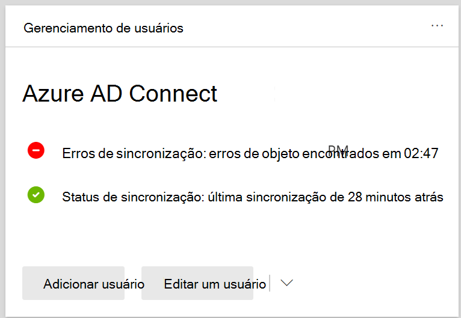

# Exibir erros de sincronização de diretório no Microsoft 365

Você pode exibir os erros de sincronização de diretório no centro de administração do Microsoft 365. Somente os erros de objeto do usuário são exibidos. Para exibir erros com o PowerShell, confira [identificar objetos com o DirSyncProvisioningErrors](https://docs.microsoft.com/azure/active-directory/hybrid/how-to-connect-syncservice-duplicate-attribute-resiliency).

## Exibir erros de sincronização de diretório no centro de administração do Microsoft 365

Para exibir qualquer erro no centro de administração do Microsoft 365:
  
1. Entre no centro de [Administração do Microsoft 365](https://admin.microsoft.com) com uma conta de administrador global. 
    
2. Na **Home** Page, você verá o cartão de **Gerenciamento de usuários** . 
    
    
  
3. No cartão, escolha **erros de sincronização** no **Azure ad Connect** para ver os erros na página **erros de sincronização de diretório** .   
    
    

4. Escolha qualquer um dos erros para exibir o painel de detalhes com informações sobre o erro e dicas sobre como corrigi-lo.

   
  
Após a exibição, confira [corrigir problemas de sincronização de diretório para o Microsoft 365](fix-problems-with-directory-synchronization.md) para corrigir quaisquer problemas identificados.

