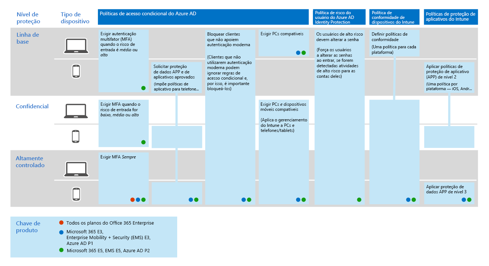
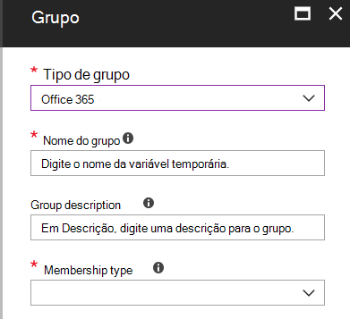

# Identidade comum e políticas de acesso ao dispositivo
Este artigo descreve as políticas comuns recomendadas para proteger o acesso a serviços de nuvem, incluindo aplicativos locais publicados com o proxy de aplicativo do Azure AD. 

Este guia discute como implantar as políticas recomendadas em um ambiente provisionado recentemente. Configurar essas políticas em um ambiente de laboratório separado permite que você entenda e avalie as políticas recomendadas antes de preparar a distribuição para seus ambientes de pré-produção e produção. Seu ambiente provisionado recentemente pode ser apenas na nuvem ou híbrido.  

## Conjunto de políticas 

O diagrama a seguir ilustra o conjunto de políticas recomendado. Ele mostra qual camada de proteção cada política se aplica e se as políticas se aplicam a PCs ou telefones e tablets ou a ambas as categorias de dispositivos. Também indica onde essas políticas estão configuradas.

ao dispositivo[consulte uma versão maior desta imagem](https://github.com/MicrosoftDocs/microsoft-365-docs/raw/public/microsoft-365/media/Identity_device_access_policies_byplan.png)

O restante deste artigo descreve como configurar essas políticas. 

É recomendável usar a autenticação multifator antes de registrar dispositivos no Intune para garantir que o dispositivo esteja na posse do usuário desejado. Você também deve inscrever dispositivos no Intune antes de impor políticas de conformidade do dispositivo.

Para dar tempo para realizar essas tarefas, recomendamos implementar as políticas de linha de base na ordem listada nesta tabela. No entanto, as políticas da MFA de proteção confidencial e altamente regulamentada podem ser implementadas a qualquer momento.

|Nível de Proteção|Políticas|Mais informações|
|:---------------|:-------|:----------------|
|**Baseline**|[Exigir MFA quando o risco de entrada for *médio* ou *alto*](#require-mfa-based-on-sign-in-risk)| |
|        |[Bloquear clientes que não oferecem suporte à autenticação moderna](#block-clients-that-dont-support-modern-authentication)|Os clientes que não usam a autenticação moderna podem ignorar as regras de acesso condicional, portanto, é importante bloquear esses|
|        |[Usuários de alto risco devem alterar a senha](#high-risk-users-must-change-password)|Obriga os usuários a alterarem a senha ao entrar se a atividade de alto risco for detectada para sua conta|
|        |[Aplicar políticas de proteção de dados do aplicativo](#apply-app-data-protection-policies)|Uma política por plataforma (iOS, Android, Windows). As políticas de proteção de aplicativos do Intune (aplicativo) são conjuntos de proteção predefinidos, do nível 1 ao nível 3.|
|        |[Exigir aplicativos aprovados e proteção de aplicativos](#require-approved-apps-and-app-protection)|Impõe proteção de aplicativos móveis para telefones e tablets|
|        |[Definir políticas de conformidade do dispositivo](#define-device-compliance-policies)|Uma política para cada plataforma|
|        |[Exigir PCs compatíveis](#require-compliant-pcs-but-not-compliant-phones-and-tablets)|Impõe o gerenciamento de computadores do Intune|
|**Confidencial**|[Exigir MFA quando o risco de entrada for *baixo*, *médio* ou *alto*](#require-mfa-based-on-sign-in-risk)| |
|         |[Exigir computadores *em conformidade e* dispositivos móveis](#require-compliant-pcs-and-mobile-devices)|Impõe o gerenciamento do Intune para PCs e telefones/tablets|
|**Altamente controlada**|[*Sempre* exigir MFA](#require-mfa-based-on-sign-in-risk)|
| | |

## Atribuindo políticas aos usuários
Antes de configurar as políticas, identifique os grupos do Azure AD que você está usando para cada camada de proteção. Normalmente, a proteção de linha de base se aplica a todas as pessoas na organização. Um usuário que está incluído na linha de base e proteção confidencial terá todas as políticas de linha de base aplicadas mais as políticas confidenciais. A proteção é cumulativa e a política mais restritiva é imposta. 

Uma prática recomendada é criar um grupo do Azure AD para exclusão de acesso condicional. Adicione esse grupo a todas as suas regras de acesso condicional em "exclude". Isso fornece um método para fornecer acesso a um usuário enquanto você soluciona problemas de acesso. Isso é recomendado somente como uma solução temporária. Monitore esse grupo para alterações e certifique-se de que o grupo de exclusão esteja sendo usado apenas conforme o esperado. 

O diagrama a seguir fornece um exemplo de atribuição e exclusões do usuário.

Na ilustração, a "equipe de" projeto de segredo principal X "é atribuída uma política de acesso condicional que requer MFA *sempre*. Seja criterioso ao aplicar níveis mais altos de proteção aos usuários. Os membros desta equipe de projeto serão solicitados a fornecer duas formas de autenticação sempre que fizerem logon, mesmo que não estejam exibindo conteúdo altamente regulamentado.  

Todos os grupos do Azure AD criados como parte dessas recomendações devem ser criados como grupos do Office 365. Isso é importante principalmente para a implantação da AIP (Proteção de Informações do Azure) ao proteger documentos no SharePoint Online.

## Exigir a MFA com base no risco de entrada
Antes de exigir a MFA, primeiro use uma política de registro do MFA de proteção de identidade para registrar usuários para MFA. Depois que os usuários são registrados, é possível aplicar a MFA de entrada. O [trabalho de pré-requisito](identity-access-prerequisites.md) inclui o registro de todos os usuários com a MFA.

Para criar uma nova política de acesso condicional: 

1. Acesse o [Portal do Azure](https://portal.azure.com) e entre com suas credenciais. Após entrar com êxito, você verá o painel do Azure.

2. Escolha **Azure Active Directory** no menu à esquerda.

3. Na seção **Segurança**, escolha **Acesso condicional**.

4. Escolha **Nova política**.

 As tabelas a seguir descrevem as configurações de política de acesso condicional a serem implementadas para essa política.

**Atribuições**

|Tipo|Propriedades|Valores|Anotações|
|:---|:---------|:-----|:----|
|Usuários e grupos|Incluir|Selecionar usuários e grupos – selecione grupos de segurança específicos que contém os usuários de destino|Inicie com o grupo de segurança, incluindo usuários piloto|
||Excluir|Grupo de segurança de exceção, contas de serviço (identidades de aplicativo)|Associação modificada de acordo com a necessidade de uma base temporária|
|Aplicativos em nuvem|Incluir|Selecione os aplicativos para os quais você deseja aplicar essa regra. Por exemplo, selecione Office 365 Exchange Online||
|Condições|Configurado|Sim|Configure específicos para suas necessidades e ambiente|
|Risco de entrada|Nível de risco||Veja as orientações na tabela a seguir|

**Risco de entrada**

Aplique as configurações com base no nível de proteção que você está direcionando.

|Propriedade|Nível de proteção|Valores|Anotações|
|:---|:---------|:-----|:----|
|Nível de risco|Linha de base|Alto, médio|Marque ambos|
| |Confidencial|Alta, média, baixa|Marque todos os três|
| |Altamente controlada| |Deixar todas as opções desmarcadas para sempre impor a MFA|

**Controles de acesso**

|Tipo|Propriedades|Valores|Anotações|
|:---|:---------|:-----|:----|
|Conceder|Conceder acesso|True|Selecionado|
||Exigir MFA|verdadeiro|Verificar|
||Exigir que o dispositivo seja marcado como em conformidade|Falso||
||Exigir dispositivo híbrido associado ao AD do Azure|Falso||
||Exigir aplicativo cliente aprovado|Falso||
||Exigir todos os controles selecionados|verdadeiro|Selecionado|

> [!NOTE]
> Certifique-se de habilitar essa política, escolhendo **Ativar**. Considere também usar a ferramenta [e se](https://docs.microsoft.com/azure/active-directory/active-directory-conditional-access-whatif) para testar a política.

## Bloquear clientes que não oferecem suporte à autenticação moderna
1. Acesse o [Portal do Azure](https://portal.azure.com) e entre com suas credenciais. Após entrar com êxito, você verá o painel do Azure.

2. Escolha **Azure Active Directory** no menu à esquerda.

3. Na seção **Segurança**, escolha **Acesso condicional**.

4. Escolha **Nova política**.

As tabelas a seguir descrevem as configurações de política de acesso condicional a serem implementadas para essa política.

**Atribuições**

|Tipo|Propriedades|Valores|Anotações|
|:---|:---------|:-----|:----|
|Usuários e grupos|Incluir|Selecionar usuários e grupos – selecione grupos de segurança específicos que contém os usuários de destino|Inicie com o grupo de segurança, incluindo usuários piloto|
||Excluir|Grupo de segurança de exceção, contas de serviço (identidades de aplicativo)|Associação modificada de forma temporária, conforme o necessário|
|Aplicativos em nuvem|Incluir|Selecione os aplicativos para os quais você deseja aplicar essa regra. Por exemplo, selecione Office 365 Exchange Online||
|Condições|Configurado|Sim|Configurar aplicativos cliente|
|Aplicativos cliente|Configurado|Sim|Aplicativos móveis e clientes de desktop, outros clientes (selecione ambos)|

**Controles de acesso**

|Tipo|Propriedades|Valores|Anotações|
|:---|:---------|:-----|:----|
|Conceder|Bloquear acesso|True|Selecionado|
||Exigir MFA|Falso||
||Exigir que o dispositivo seja marcado como em conformidade|Falso||
||Exigir dispositivo híbrido associado ao AD do Azure|Falso||
||Exigir aplicativo cliente aprovado|Falso||
||Exigir todos os controles selecionados|verdadeiro|Selecionado|

> [!NOTE]
> Certifique-se de habilitar essa política, escolhendo **Ativar**. Considere também usar a ferramenta [e se](https://docs.microsoft.com/azure/active-directory/active-directory-conditional-access-whatif) para testar a política.

## Usuários de alto risco devem alterar a senha
Para garantir que todas as contas comprometidas de usuários de alto risco sejam forçadas a executar uma alteração de senha ao entrar, você deve aplicar a política a seguir.

Faça logon no [Portal do Microsoft Azure (https://portal.azure.com)](https://portal.azure.com/) com suas credenciais de administrador e, em seguida, navegue até **Azure AD Identity Protection > Política de Risco do Usuário**.

**Atribuições**

|Tipo|Propriedades|Valores|Anotações|
|:---|:---------|:-----|:----|
|Usuários|Incluir|todos os usuários|Selecionada|
||Excluir|Nenhum||
|Condições|Risco do usuário|Alta|Selecionada|

**Controles**

| Tipo | Propriedades | Valores                  | Anotações |
|:-----|:-----------|:------------------------|:------|
|      | Access     | Permitir acesso            | True  |
|      | Acessar     | Requer a alteração de senha | verdadeiro  |

**Revisão:** não aplicável

> [!NOTE]
> Certifique-se de habilitar essa política, escolhendo **Ativar**. Considere também usar a ferramenta [e se](https://docs.microsoft.com/azure/active-directory/active-directory-conditional-access-whatif) para testar a política

## Aplicar políticas de proteção de dados do aplicativo
As políticas de proteção de aplicativos (aplicativo) definem quais aplicativos são permitidos e as ações que eles podem realizar com os dados da sua organização. As opções disponíveis no aplicativo permitem que as organizações adaptem a proteção às suas necessidades específicas. Para alguns, talvez não seja óbvio quais configurações de política são necessárias para implementar um cenário completo. Para ajudar as organizações a priorizar a proteção de ponto de extremidade do cliente móvel, a Microsoft introduziu a taxonomia de sua estrutura de proteção de dados do aplicativo para o gerenciamento de aplicativos móveis iOS e Android. 

A estrutura de proteção de dados do aplicativo é organizada em três níveis de configuração distintos, e cada nível cria o nível anterior: 

- A **proteção de dados do Enterprise Basic** (nível 1) garante que os aplicativos estão protegidos com PIN e criptografados e realiza operações de apagamento seletivo. Para dispositivos Android, esse nível valida o atestado de dispositivo Android. Esta é uma configuração de nível de entrada que fornece controle de proteção de dados semelhante nas políticas de caixa de correio do Exchange Online e apresenta a população e o preenchimento do usuário para o aplicativo. 
- **Enterprise Enhanced Data Protection** (Level 2) apresenta mecanismos de prevenção de perda de dados de aplicativo e requisitos mínimos de so. Esta é a configuração que se aplica à maioria dos usuários móveis que acessam dados corporativos ou de estudante. 
- **Alta proteção de dados da empresa** (nível 3) apresenta mecanismos avançados de proteção de dados, configuração de PIN avançado e defesa contra ameaças móveis de aplicativos. Essa configuração é desejável para usuários que estão acessando dados de alto risco. 

Para ver as recomendações específicas para cada nível de configuração e os aplicativos mínimos que devem ser protegidos, revise a [estrutura de proteção de dados usando políticas de proteção de aplicativos](https://docs.microsoft.com/mem/intune/apps/app-protection-framework). 

Usando os princípios descritos nas configurações de [acesso a dispositivos e identidades](microsoft-365-policies-configurations.md), a linha de base e as camadas de proteção sensíveis mapeiam em conjunto com as configurações de proteção avançada de dados da empresa de nível 2. A camada de proteção altamente regulamentada é mapeada de perto das configurações de alta proteção de dados da empresa de nível 3.

|Nível de Proteção |Política de proteção de aplicativos  |Mais informações  |
|---------|---------|---------|
|Linha de base     | [Proteção avançada de dados de nível 2](https://docs.microsoft.com/mem/intune/apps/app-protection-framework#level-2-enterprise-enhanced-data-protection)        | As configurações de política aplicadas no nível 2 incluem todas as configurações de política recomendadas para o nível 1 e somente adiciona ou atualiza as configurações de política abaixo para implementar mais controles e uma configuração mais sofisticada do que o nível 1.         |
|Confidencial     | [Proteção avançada de dados de nível 2](https://docs.microsoft.com/mem/intune/apps/app-protection-framework#level-2-enterprise-enhanced-data-protection)        | As configurações de política aplicadas no nível 2 incluem todas as configurações de política recomendadas para o nível 1 e somente adiciona ou atualiza as configurações de política abaixo para implementar mais controles e uma configuração mais sofisticada do que o nível 1.        |
|Altamente regulamentado     | [Nível 3 de alta proteção de dados corporativos](https://docs.microsoft.com/mem/intune/apps/app-protection-framework#level-3-enterprise-high-data-protection)        | As configurações de política impostas no nível 3 incluem todas as configurações de política recomendadas para o nível 1 e 2, e somente adiciona ou atualiza as configurações de política abaixo para implementar mais controles e uma configuração mais sofisticada do que o nível 2.        |

Para criar uma nova política de proteção de aplicativos para cada plataforma (iOS e Android) no Microsoft Endpoint Manager usando as configurações da estrutura de proteção de dados, os administradores podem:
1. Crie manualmente as políticas seguindo as etapas descritas em [como criar e implantar políticas de proteção de aplicativos com o Microsoft Intune](https://docs.microsoft.com/mem/intune/apps/app-protection-policies). 
2. Importe os [modelos JSON da estrutura de configuração de política de proteção de aplicativo do Intune](https://github.com/microsoft/Intune-Config-Frameworks/tree/master/AppProtectionPolicies) de exemplo com os [scripts do PowerShell do Intune](https://github.com/microsoftgraph/powershell-intune-samples).

## Exigir aplicativos aprovados e proteção de aplicativos
Para impor as políticas de proteção de aplicativo aplicadas no Intune, você deve criar uma regra de acesso condicional para exigir aplicativos cliente aprovados e as condições definidas nas políticas de proteção de aplicativos. 

A aplicação de políticas de proteção de aplicativos requer um conjunto de políticas descritas em na [requer política de proteção de aplicativo para o acesso de aplicativo em nuvem com acesso condicional](https://docs.microsoft.com/azure/active-directory/conditional-access/app-protection-based-conditional-access). Essas políticas são incluídas neste conjunto recomendado de políticas de configuração de identidade e acesso.

Para criar a regra de acesso condicional que exija aplicativos aprovados e proteção de aplicativos, siga "etapa 1: configurar uma política de acesso condicional do Azure AD para o Office 365" no [cenário 1: os aplicativos do Office 365 exigem aplicativos aprovados com políticas de proteção de aplicativos](https://docs.microsoft.com/azure/active-directory/conditional-access/app-protection-based-conditional-access#scenario-1-office-365-apps-require-approved-apps-with-app-protection-policies), o que permite o Outlook para IOS e Android, mas bloqueia clientes compatíveis com OAuth do Exchange

   > [!NOTE]
   > Essa política garante que os usuários móveis possam acessar todos os pontos de extremidade do Office usando os aplicativos aplicáveis.

Se você estiver habilitando o acesso móvel ao Exchange Online, implemente [os clientes do Block ActiveSync](secure-email-recommended-policies.md#block-activesync-clients), o que impede que os clientes do Exchange ActiveSync aproveitem a autenticação básica para se conectar ao Exchange Online. Essa política não é mostrada na ilustração no início deste artigo. Ele é descrito e desfigurado nas [recomendações de política para proteger o email](secure-email-recommended-policies.md).

 Essas políticas aproveitam os controles Grant [exigem aplicativo cliente aprovado](https://docs.microsoft.com/azure/active-directory/conditional-access/concept-conditional-access-grant#require-approved-client-app) e [exigem a política de proteção de aplicativos](https://docs.microsoft.com/azure/active-directory/conditional-access/concept-conditional-access-grant#require-app-protection-policy).

Por fim, o bloqueio de autenticação herdada para outros aplicativos cliente em iOS e dispositivos Android garante que esses clientes não possam ignorar as regras de acesso condicional. Se você estiver seguindo as orientações deste artigo, já configurou [clientes de bloco que não dão suporte à autenticação moderna](#block-clients-that-dont-support-modern-authentication).

<!---
With Conditional Access, organizations can restrict access to approved (modern authentication capable) iOS and Android client apps with Intune app protection policies applied to them. Several conditional access policies are required, with each policy targeting all potential users. Details on creating these policies can be found in [Require app protection policy for cloud app access with Conditional Access](https://docs.microsoft.com/azure/active-directory/conditional-access/app-protection-based-conditional-access).

1. Follow "Step 1: Configure an Azure AD Conditional Access policy for Office 365" in [Scenario 1: Office 365 apps require approved apps with app protection policies](https://docs.microsoft.com/azure/active-directory/conditional-access/app-protection-based-conditional-access#scenario-1-office-365-apps-require-approved-apps-with-app-protection-policies), which allows Outlook for iOS and Android, but blocks OAuth capable Exchange ActiveSync clients from connecting to Exchange Online.

   > [!NOTE]
   > This policy ensures mobile users can access all Office endpoints using the applicable apps.

2. If enabling mobile access to Exchange Online, implement [Block ActiveSync clients](secure-email-recommended-policies.md#block-activesync-clients), which prevents Exchange ActiveSync clients leveraging basic authentication from connecting to Exchange Online.

   The above policies leverage the grant controls [Require approved client app](https://docs.microsoft.com/azure/active-directory/conditional-access/concept-conditional-access-grant#require-approved-client-app) and [Require app protection policy](https://docs.microsoft.com/azure/active-directory/conditional-access/concept-conditional-access-grant#require-app-protection-policy).

3. Disable legacy authentication for other client apps on iOS and Android devices. For more information, see [Block clients that don't support modern authentication](#block-clients-that-dont-support-modern-authentication).
-->

## Definir políticas de conformidade de dispositivos

As políticas de conformidade de dispositivos definem os requisitos para os quais os dispositivos devem aderir para serem marcados como em conformidade. Crie políticas de conformidade de dispositivo do Intune a partir do centro de administração do Microsoft Endpoint Manager.

Criar uma política para cada plataforma:
- Administrador do dispositivo Android
- Android Enterprise
- iOS/iPadOS
- macOS
- Esta configuração está disponível nos seguintes tipos de dispositivos:
- Windows 8,1 e posterior
- Windows 10 e posterior

Para criar políticas de conformidade de dispositivos, faça logon no [centro de administração do Microsoft Endpoint Manager](https://go.microsoft.com/fwlink/?linkid=2109431) com suas credenciais de administrador e, em seguida, navegue até**políticas**de**políticas** > de conformidade de **dispositivos** > . Selecione **criar política**.

Para que as políticas de conformidade do dispositivo sejam implantadas, elas devem ser atribuídas a grupos de usuários. Você atribui uma política depois de criá-la e salvá-la. No centro de administração, selecione a política e, em seguida, selecione **atribuições**. Após selecionar os grupos para os quais você deseja receber a política, selecione **salvar** para salvar a atribuição de grupo e implantar a política.

Para obter uma orientação passo a passo sobre a criação de políticas de conformidade no Intune, consulte [criar uma política de conformidade no Microsoft Intune](https://docs.microsoft.com/mem/intune/protect/create-compliance-policy) na documentação do Intune.

As configurações a seguir são recomendadas para o Windows 10.

**Integridade do dispositivo: regras de avaliação do serviço de atestado de integridade do Windows**

|Propriedades|Valores|Anotações|
|:---------|:-----|:----|
|Exigir BitLocker|Precisa||
|Exigir que a inicialização segura seja habilitada no dispositivo|Precisa||
|Exigir integridade de código|Precisa||

**Propriedades do dispositivo**

|Tipo|Propriedades|Valores|Anotações|
|:---|:---------|:-----|:----|
|Versão do sistema operacional|Tudo|Não configurado||

**Segurança do sistema**

|Tipo|Propriedades|Valores|Anotações|
|:---|:---------|:-----|:----|
|Password|Exigir uma senha para desbloquear dispositivos móveis|Precisa||
||Senhas simples|Bloquear||
||Tipo de senha|Padrão do dispositivo||
||Tamanho mínimo da senha|6 ||
||Máximo de minutos de inatividade antes que a senha seja necessária|15 |Essa configuração tem suporte para o Android versões 4,0 e superior ou o KNOX 4,0 e superior. Para dispositivos iOS, ele é compatível com iOS 8,0 e superior|
||Vencimento da senha (dias)|41||
||Número de senhas anteriores para evitar reutilização|5 ||
||Exigir senha quando o dispositivo retornar do estado ocioso (móvel e Holographic)|Precisa|Disponível para Windows 10 e posterior|
|Criptografia|Criptografia do armazenamento de dados no dispositivo|Precisa||
|Segurança do dispositivo|Firewall|Precisa||
||Antivírus|Precisa||
||AntiSpyware|Precisa|Esta configuração requer uma solução anti-spyware registrada com a central de segurança do Windows|
|Defender|Microsoft Defender Antimalware|Precisa||
||Versão mínima do Microsoft Defender Antimalware||Compatível apenas com a área de trabalho do Windows 10. A Microsoft recomenda as versões não mais do que cinco atrás da versão mais recente|
||Assinatura do Microsoft Defender Antimalware atualizada|Precisa||
||Proteção em tempo real|Precisa|Compatível apenas com a área de trabalho do Windows 10|

**Microsoft Defender ATP**

|Tipo|Propriedades|Valores|Anotações|
|:---|:---------|:-----|:----|
|Regras de proteção avançada contra ameaças do Microsoft defender|Exigir que o dispositivo esteja no ou abaixo da Pontuação de risco da máquina|Médio||

## Exigir computadores compatíveis (mas telefones e tablets não compatíveis)
Antes de adicionar uma política para exigir computadores compatíveis, não deixe de inscrever dispositivos para gerenciamento no Intune. É recomendável usar a autenticação multifator antes de registrar dispositivos no Intune para garantir que o dispositivo esteja na posse do usuário desejado. 

Para exigir computadores compatíveis:

1. Acesse o [Portal do Azure](https://portal.azure.com) e entre com suas credenciais. Após entrar com êxito, você verá o painel do Azure.

2. Escolha **Azure Active Directory** no menu à esquerda.

3. Na seção **Segurança**, escolha **Acesso condicional**.

4. Escolha **Nova política**.

5. Insira um nome para a política e escolha os **Usuários e grupos** aos quais deseja aplicar a política.

6. Escolha **Aplicativos na nuvem**.

7. Escolha **selecionar aplicativos**, selecione os aplicativos desejados na lista **aplicativos de nuvem** . Por exemplo, selecione Office 365 Exchange Online. Escolha **selecionar** e **concluir**.

8. Para exigir que os computadores em conformidade, mas não compatíveis com telefones e tablets, escolha **condições** e **plataformas de dispositivos**. Escolha **Selecionar plataformas de dispositivo** e selecione **Windows** e **MacOS**.

9. Escolha **Conceder** na seção **Controles de acesso**.

10. Escolha **conceder acesso**, selecione **exigir que o dispositivo seja marcado como em conformidade**. Para vários controles, selecione **exigir todos os controles selecionados**e, em seguida, escolha **selecionar**. 

11. Escolha **Criar**.

Se seu objetivo for exigir computadores móveis *e* PCs compatíveis, não selecione plataformas. Isso impõe a conformidade de todos os dispositivos. 

## Exigir computadores *em conformidade e* dispositivos móveis

Para exigir a conformidade de todos os dispositivos:

1. Acesse o [Portal do Azure](https://portal.azure.com) e entre com suas credenciais. Após entrar com êxito, você verá o painel do Azure.

2. Escolha **Azure Active Directory** no menu à esquerda.

3. Na seção **Segurança**, escolha **Acesso condicional**.

4. Escolha **Nova política**.

5. Insira um nome para a política e escolha os **Usuários e grupos** aos quais deseja aplicar a política.

6. Escolha **Aplicativos na nuvem**.

7. Escolha **selecionar aplicativos**, selecione os aplicativos desejados na lista **aplicativos de nuvem** . Por exemplo, selecione Office 365 Exchange Online. Escolha **selecionar** e **concluir**.

8. Escolha **Conceder** na seção **Controles de acesso**.

9. Escolha **conceder acesso**, selecione **exigir que o dispositivo seja marcado como em conformidade**. Para vários controles, selecione **exigir todos os controles selecionados**e, em seguida, escolha **selecionar**. 

10. Escolha **Criar**.

Ao criar essa política, não selecione plataformas. Isso impõe dispositivos compatíveis.

## Próximas etapas

[Saiba mais sobre recomendações de política para proteger o email](secure-email-recommended-policies.md)
