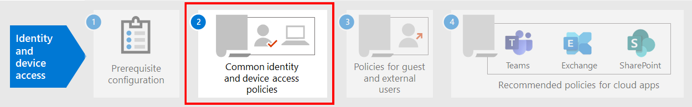

# Trabalho de pré-requisito para implementar as políticas de acesso de dispositivo e identidade

Este artigo descreve os pré-requisitos que precisam ser implementados antes que você possa implantar as políticas recomendadas de identidade e acesso de dispositivo. Este artigo também discute as configurações de cliente de plataforma padrão recomendadas para fornecer a melhor experiência de logon único (SSO) aos seus usuários, bem como os pré-requisitos técnicos para acesso condicional.

## Pré-requisitos

Antes de implementar as políticas recomendadas de identidade e acesso de dispositivos, há vários pré-requisitos que sua organização deve atender para esses modelos de identidade e autenticação para o Microsoft 365 e o Office 365:

- Apenas Nuvem
- Híbrida com autenticação de sincronização de hash de senha (PHS)
- Híbrido com autenticação de passagem (PTA)
- Fica

A tabela a seguir detalha os recursos de pré-requisito e sua configuração que se aplicam a todos os modelos de identidade, exceto quando observado. 

| Configuração | Exceptions |
| :------------- | :-----------: |
|  [Configure o PHS](https://docs.microsoft.com/azure/active-directory/hybrid/how-to-connect-password-hash-synchronization).  Isso deve ser habilitado para detectar credenciais vazadas e agir em busca de acesso condicional com base em risco. **Observação:** Isso é necessário independentemente de sua organização usar a autenticação federada. | Apenas Nuvem |
| [Habilitar o logon único contínuo](https://docs.microsoft.com/azure/active-directory/connect/active-directory-aadconnect-sso) para assinar automaticamente os usuários quando eles estiverem em seus dispositivos de organização conectados à rede da sua organização. | Federado somente na nuvem  |
| [Configurar redes nomeadas](https://docs.microsoft.com/azure/active-directory/active-directory-known-networks-azure-portal). O Azure AD Identity Protection coleta e analisa todos os dados de sessão disponíveis para gerar uma pontuação de risco. Recomendamos que você especifique os intervalos de IP públicos da sua organização para sua rede na configuração de redes nomeadas do Azure AD. O tráfego proveniente desses intervalos recebe uma pontuação reduzida de risco e o tráfego de fora do ambiente da organização recebe uma pontuação de risco maior. | |
|[Registre todos os usuários para redefinição de senha de autoatendimento (SSPR) e autenticação multifator (MFA)](https://docs.microsoft.com/azure/active-directory/authentication/concept-registration-mfa-sspr-converged). Recomendamos que você registre os usuários para a autenticação multifator do Azure antes do tempo. A proteção de identidade do Azure AD usa a autenticação multifator do Azure para executar verificação de segurança adicional. Além disso, para obter a melhor experiência de entrada, recomendamos que os usuários instalem o [aplicativo Microsoft Authenticator](https://docs.microsoft.com/azure/active-directory/user-help/microsoft-authenticator-app-how-to) e o aplicativo do portal da empresa da Microsoft em seus dispositivos. Eles podem ser instalados a partir da loja de aplicativos para cada plataforma. | |
| [Habilitar o registro automático de dispositivos de computadores Windows associados ao domínio](https://docs.microsoft.com/azure/active-directory/active-directory-conditional-access-automatic-device-registration-setup). O acesso condicional garantirá que os dispositivos que se conectam aos aplicativos são associados ao domínio ou estão em conformidade. Para dar suporte a isso em computadores Windows, o dispositivo deve ser registrado com o Azure AD.  Este artigo discute como configurar o registro de dispositivo automático. | Apenas Nuvem |
| **Preparar sua equipe de suporte**. Tenha um plano em vigor para os usuários que não podem concluir a MFA. Isso pode ser adicionado a um grupo de exclusão de política ou registrar novas informações da MFA para elas. Antes de fazer qualquer uma dessas alterações confidenciais de segurança, você precisa garantir que o usuário real está fazendo a solicitação. Exigir que os gerentes dos usuários ajudem na aprovação é uma etapa eficaz. | |  
| [Configurar o write-back de senha para o AD local](https://docs.microsoft.com/azure/active-directory/active-directory-passwords-getting-started). O Write-back de senha permite ao Azure AD exigir que os usuários alterem suas senhas locais quando um comprometimento de conta de alto risco for detectado. Você pode habilitar esse recurso usando o Azure AD Connect de duas maneiras: habilite o **write-back de senha** na tela recursos opcionais do assistente de configuração do Azure ad Connect ou habilite-o por meio do Windows PowerShell. | Apenas Nuvem |
| [Configurar a proteção de senha do Azure ad](https://docs.microsoft.com/azure/active-directory/authentication/concept-password-ban-bad). A proteção de senha do Azure AD detecta e bloqueia senhas fracas conhecidas e suas variantes e também pode bloquear outros termos fracos que sejam específicos da sua organização. As listas de senhas globais excluídas padrão são automaticamente aplicadas a todos os usuários em um locatário do Azure AD. Você pode definir entradas adicionais em uma lista personalizada de senhas proibidas. Quando os usuários alteram ou redefinem suas senhas, essas listas de senhas proibidas são verificadas para impor o uso de senhas seguras. |  |
| [Habilitar a proteção de identidade do Azure Active Directory](https://docs.microsoft.com/azure/active-directory/identity-protection/overview-identity-protection). O Azure AD Identity Protection permite que você detecte possíveis vulnerabilidades que afetam as identidades da sua organização e configure uma política de correção automatizada para riscos de entrada baixa, média e alta e o risco do usuário.  | |
| **Habilitar a autenticação moderna** do [Exchange Online](https://docs.microsoft.com/Exchange/clients-and-mobile-in-exchange-online/enable-or-disable-modern-authentication-in-exchange-online) e do [Skype for Business online](https://social.technet.microsoft.com/wiki/contents/articles/34339.skype-for-business-online-enable-your-tenant-for-modern-authentication.aspx). A autenticação moderna é um pré-requisito para usar MFA. A autenticação moderna está habilitada por padrão para os clientes do Office 2016 e 2019, SharePoint e OneDrive for Business. |  |
|||

## Configurações de cliente recomendadas
Esta seção descreve as configurações do cliente de plataforma padrão recomendamos fornecer a melhor experiência de SSO para seus usuários, bem como os pré-requisitos técnicos para acesso condicional.

### Dispositivos Windows
Recomendamos o Windows 10 (versão 2004 ou posterior), já que o Azure foi projetado para fornecer a experiência de SSO mais suave possível para o AD local e o Azure AD. Os dispositivos de trabalho ou de estudante emitidos devem ser configurados para ingressar no Azure AD diretamente ou se a organização usar o ingresso no domínio do AD local, esses dispositivos devem ser [configurados para registrar-se automaticamente e silenciosamente no Azure ad](https://docs.microsoft.com/azure/active-directory/active-directory-conditional-access-automatic-device-registration-setup).

Para os dispositivos do Windows BYOD, os usuários podem usar **adicionar conta corporativa ou de estudante**. Observe que os usuários do navegador Google Chrome em dispositivos Windows 10 precisam [instalar uma extensão](https://chrome.google.com/webstore/detail/windows-10-accounts/ppnbnpeolgkicgegkbkbjmhlideopiji?utm_source=chrome-app-launcher-info-dialog) para obter a mesma experiência de entrada suave que os usuários do Microsoft Edge. Além disso, se sua organização tiver dispositivos Windows 8 ou 8,1 associados ao domínio, você poderá instalar o Microsoft Workplace Join para computadores não Windows 10. [Baixe o pacote para registrar](https://www.microsoft.com/download/details.aspx?id=53554) os dispositivos com o Azure AD.

### Dispositivos iOS
Recomendamos instalar o [aplicativo Microsoft Authenticator](https://docs.microsoft.com/azure/multi-factor-authentication/end-user/microsoft-authenticator-app-how-to) nos dispositivos de usuário antes de implantar o acesso condicional ou as políticas de MFA. No mínimo, o aplicativo deve ser instalado quando os usuários são solicitados a registrar seus dispositivos com o Azure AD adicionando uma conta corporativa ou de estudante, ou quando instalam o aplicativo portal da empresa do Intune para registrar seus dispositivos no gerenciamento. Isso depende da política de acesso condicional configurada.

### Dispositivos Android
Recomendamos que os usuários instalem o [aplicativo do portal da empresa do Intune](https://play.google.com/store/apps/details?id=com.microsoft.windowsintune.companyportal&hl=en) e o [aplicativo Microsoft Authenticator](https://docs.microsoft.com/azure/multi-factor-authentication/end-user/microsoft-authenticator-app-how-to) antes que as políticas de acesso condicional sejam implantadas ou quando necessárias durante determinadas tentativas de autenticação. Após a instalação do aplicativo, os usuários podem ser solicitados a se registrarem com o Azure AD ou registrar seus dispositivos com o Intune. Isso depende da política de acesso condicional configurada.

Também recomendamos que os dispositivos de propriedade da organização sejam padronizados em OEMs e versões que dão suporte ao Android para trabalho ou ao Samsung Knox para permitir contas de email, sejam gerenciadas e protegidas pela política MDM do Intune.

### Clientes de email recomendados
Os seguintes clientes de email dão suporte a autenticação moderna e acesso condicional. 

|Plataforma|Cliente|Versão/Notas|
|:-------|:-----|:------------|
|**Windows**|Outlook|2019, 2016, 2013   [Habilitar a autenticação moderna](https://docs.microsoft.com/microsoft-365/admin/security-and-compliance/enable-modern-authentication), [atualizações necessárias](https://support.office.com/article/Outlook-Updates-472c2322-23a4-4014-8f02-bbc09ad62213)|
|**iOS**|Outlook para iOS|[Mais recente](https://itunes.apple.com/us/app/microsoft-outlook-email-and-calendar/id951937596?mt=8)|
|**Android**|Outlook para Android|[Mais recente](https://play.google.com/store/apps/details?id=com.microsoft.office.outlook&hl=en)|
|**macOS**|Outlook|2019 e 2016|
|**Linux**|Sem suporte||
|||

### Plataformas de cliente recomendadas ao proteger documentos

Os clientes a seguir são recomendados quando uma política de documentos seguros foi aplicada.

|Plataforma|Word/Excel/PowerPoint|OneNote|Aplicativo OneDrive|Aplicativo do SharePoint|[Cliente de sincronização do OneDrive](https://docs.microsoft.com/onedrive/enable-conditional-access)|
|:-------|:-----|:------------|:-------|:-------------|:-----|
|Windows 8.1|Com suporte|Com suporte|N/D|N/D|Com suporte|
|Windows 10|Com suporte|Com suporte|N/D|N/D|Com suporte|
|Android|Com suporte|Com suporte|Com suporte|Com suporte|N/D|
|iOS|Com suporte|Com suporte|Com suporte|Com suporte|N/D|
|macOS|Com suporte|Com suporte|N/D|N/D|Sem suporte|
|Linux|Incompatível|Incompatível|Incompatível|Incompatível|Incompatível|

### Suporte ao aplicativo cliente do Microsoft 365

Para obter mais informações sobre o suporte ao cliente no Microsoft 365, consulte os seguintes artigos:

- [Suporte ao aplicativo cliente Microsoft 365-acesso condicional](microsoft-365-client-support-conditional-access.md)
- [Suporte ao aplicativo cliente Microsoft 365-autenticação moderna](microsoft-365-client-support-modern-authentication.md)

## Protegendo contas de administrador

Para o Microsoft 365 E3 ou E5 ou com licenças do Azure AD Premium P1 ou P2 separadas, você pode exigir a MFA de contas de administrador com uma política de acesso condicional criada manualmente. Consulte [acesso condicional: exigir MFA para administradores](https://docs.microsoft.com/azure/active-directory/conditional-access/howto-conditional-access-policy-admin-mfa) para os detalhes.

Para edições do Microsoft 365 ou do Office 365 que não suportam acesso condicional, você pode habilitar os [padrões de segurança](https://docs.microsoft.com/azure/active-directory/fundamentals/concept-fundamentals-security-defaults) para exigir a MFA de todas as contas.

Veja algumas recomendações adicionais:

- Use o [Azure ad Privileged Identity Management](https://docs.microsoft.com/azure/active-directory/privileged-identity-management/pim-getting-started) para reduzir o número de contas administrativas persistentes. 
- [Use o gerenciamento de acesso privilegiado](../compliance/privileged-access-management-overview.md) para proteger sua organização contra violações que podem usar contas de administrador privilegiadas existentes com acesso à posição para dados confidenciais ou acesso a definições de configuração críticas. 
- Criar e usar contas separadas às quais as [funções de administrador do Microsoft 365](https://docs.microsoft.com/microsoft-365/admin/add-users/about-admin-roles) são atribuídas *apenas para administração*. Os administradores devem ter sua própria conta de usuário para uso regular não administrativo e só usar uma conta administrativa, quando necessário, para concluir uma tarefa associada à função ou função de trabalho. 
- Siga [as práticas recomendadas](https://docs.microsoft.com/azure/active-directory/admin-roles-best-practices) para proteger contas privilegiadas no Azure AD.

## Próxima etapa

[Configurar as políticas comuns de acesso de dispositivo e identidade](identity-access-policies.md)
