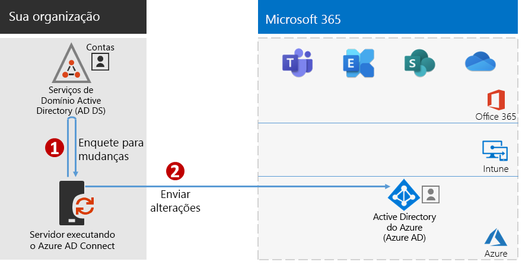
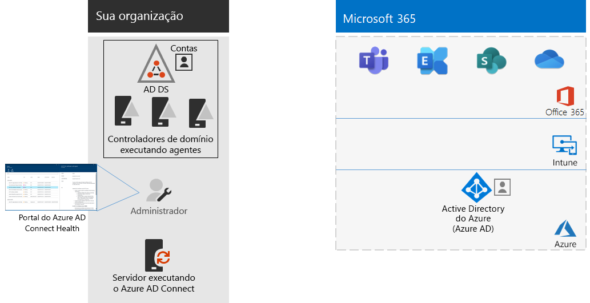

# Fase 4: adicionar suas contas de usuárioStep 4: Add your user accounts

## Criar contas de usuário para identidade somente na nuvemCreate your user accounts for cloud-only identity

Para identidade somente na nuvem, crie seus usuários e grupos no Azure AD (Azure Active Directory).For cloud-only identity, create your users and groups in Azure Active Directory (Azure AD). Você pode usar:You can use:

- O Centro de administração do Microsoft 365The Microsoft 365 admin center
- O Portal do AzureThe Azure portal
- Azure PowerShellAzure PowerShell

## Sincronizar identidades para identidade híbridaSynchronize identities for hybrid identity

*Isso é obrigatório para ambientes híbridos e se aplica às versões E3 e E5 do Microsoft 365 Enterprise**This is required for hybrid environments and applies to both the E3 and E5 versions of Microsoft 365 Enterprise*

Nesta seção, você sincronizará seus Serviços de Domínio do Active Directory (AD DS) local com o locatário do Azure AD usado pelo Office 365, Microsoft Intune e outros serviços baseados em nuvem incluídos no Microsoft 365 Enterprise.In this section, you'll synchronize your on-premises Active Directory Domain Services (AD DS) with the Azure AD tenant used by Office 365, Microsoft Intune, and other cloud-based services included with Microsoft 365 Enterprise.

O Azure AD Connect é a ferramenta da Microsoft com suporte que guia você pela sincronização somente das identidades que você realmente precisa de ambientes AD DS de floresta única ou de várias florestas para o seu locatário do Azure AD.Azure AD Connect is the supported Microsoft tool that guides you through synchronizing only the identities you really need from single or multi-forest AD DS environments to your Azure AD tenant. A figura a seguir mostra o processo básico para a sincronização do Azure AD Connect.The following figure shows the basic process for Azure AD Connect synchronization.

1. O Azure AD Connect em execução em um servidor sonda o AD DS para mudanças em contas, grupos e contatos.Azure AD Connect running on a server polls AD DS for changes in accounts, groups, and contacts.
2. O Azure AD Connect envia essas mudanças para o locatário do Azure AD para a sua assinatura do Microsoft 365.Azure AD Connect sends those changes to the Azure AD tenant of your Microsoft 365 subscription.

A primeira decisão em sua solução de identidade híbrida é o requisito de autenticação. As alternativas a seguir são opções:The first decision in your hybrid identity solution is your authentication requirement. The following options are options:

- Com a **autenticação gerenciada**, o Azure AD lida com o processo de autenticação do login do usuário. Há dois métodos de autenticação gerenciada:With **managed authentication**, Azure AD handles the authentication process for user sign-in. There are two methods for managed authentication: 
    - **Sincronização de hash de senha (PHS)** [Recomendado e obrigatório para alguns recursos premium].**Password Hash Sync (PHS)** [Recommended and required for some premium features]. Esta é a forma mais simples de habilitar a autenticação para objetos de diretório locais no Azure AD.This is the simplest way to enable authentication for on-premises directory objects in Azure AD. O Azure AD Connect extrai a senha especificada como hash do AD DS, realiza o processamento de segurança adicional no hash de senha e a sincroniza com o Azure AD.Azure AD Connect extracts the hashed password from AD DS, does extra security processing on the password hash, and synchronizes it to Azure AD. Para obter mais informações, consulte [Implementar a sincronização de senha com a sincronização do Azure AD Connect](https://docs.microsoft.com/azure/active-directory/hybrid/how-to-connect-password-hash-synchronization).For more information, see [Implement password hash synchronization with Azure AD Connect sync](https://docs.microsoft.com/azure/active-directory/hybrid/how-to-connect-password-hash-synchronization).
    - A **Autenticação de passagem (PTA)** fornece uma solução de validação de senha simples para os serviços baseados no Azure AD.**Pass-through Authentication (PTA)** provides a simple password validation solution for Azure AD-based services. PTA usa um agente em execução em um ou mais servidores locais para validar as autenticações de usuário diretamente com seu AD DS local.PTA uses an agent running on one or more on-premises servers to validate the user authentications directly with your on-premises AD DS. Para saber mais, confira [Entrada do usuário com autenticação de passagem do Azure Active Directory](https://docs.microsoft.com/azure/active-directory/connect/active-directory-aadconnect-pass-through-authentication).For more information, see [User sign-in with Azure Active Directory Pass-through Authentication](https://docs.microsoft.com/azure/active-directory/connect/active-directory-aadconnect-pass-through-authentication).
- Com a **autenticação federada**, o processo de autenticação é redirecionado para outro provedor de identidade por meio de um servidor de federação de identidade, como os Serviços de Federação do Active Directory (AD FS) para o login de um usuário. O provedor de identidade pode fornecer métodos de autenticação adicionais, como a autenticação baseada em cartão inteligente. Para saber mais, confira [Escolhendo o método de autenticação correto para sua solução de identidade híbrida do Azure Active Directory](https://docs.microsoft.com/azure/security/azure-ad-choose-authn).With **federated authentication**, the authentication process is redirected to another identity provider through an identity federation server, such as Active Directory Federation Services (AD FS), for a user’s sign-in. The identity provider can provide additional authentication methods, such as smartcard-based authentication. For more information, see [Choosing the right authentication method for your Azure Active Directory hybrid identity solution](https://docs.microsoft.com/azure/security/azure-ad-choose-authn).

Assista a este vídeo para ter uma visão geral dos modelos de identidade e autenticação do Microsoft 365 Enterprise.Watch this video for an overview of identity models and authentication for Microsoft 365 Enterprise.

 

 

> [!VIDEO https://www.microsoft.com/videoplayer/embed/RE2Pjwu]

Depois que você tiver determinado sua solução de identidade híbrida, baixe e execute a [Ferramenta de Correção de Erros de Sincronização do Diretório da IdFix](https://www.microsoft.com/download/details.aspx?id=36832) para analisar seu AD DS para problemas.After you've determined your hybrid identity solution, download and run the [IdFix Directory Synchronization Error Remediation Tool](https://www.microsoft.com/download/details.aspx?id=36832) to analyze your AD DS for issues.

Depois de resolver todos os problemas identificados pela ferramenta IdFix, confira [Implementar a sincronização da senha hash](https://docs.microsoft.com/azure/active-directory/connect/active-directory-aadconnectsync-implement-password-hash-synchronization)para obter instruções sobre como instalar a ferramenta Azure AD Connect e configurar a sincronização de diretórios entre o seu AD DS local e o locatário Azure AD para as suas assinaturas do Microsoft 365.After resolving all of the issues identified by the IdFix tool, see [Implement password hash synchronization](https://docs.microsoft.com/azure/active-directory/connect/active-directory-aadconnectsync-implement-password-hash-synchronization) for guidance on installing the Azure AD Connect tool and configuring directory synchronization between your on-premises AD DS and the Azure AD tenant for your Microsoft 365 subscription. Depois que a sincronização começar, você deve manter suas contas e grupos de usuário com seu provedor de identidade local, como o AD DS.After synchronization starts, you'll maintain your user accounts and groups with your on-premises identity provider, such as AD DS.

A Microsoft fornece um conjunto de recomendações para [acesso de dispositivo e identidade](microsoft-365-policies-configurations.md) para garantir uma força de trabalho segura e produtiva.Microsoft provides a set of recommendations for [identity and device access](microsoft-365-policies-configurations.md) to ensure a secure and productive workforce. 

- Para obter os requisitos recomendados para ambientes híbridos, confira a coluna **Active Directory com sincronização de hash de senha** em [pré-requisitos](identity-access-prerequisites.md#prerequisites).For recommended requirements for hybrid environments, see the **Active Directory with password hash sync** column in [prerequisites](identity-access-prerequisites.md#prerequisites). 

- Para obter requisitos recomendados para ambientes somente de nuvem, confira a coluna **Somente de nuvem** em [pré-requisitos](identity-access-prerequisites.md#prerequisites).For recommended requirements for cloud only environments, see the **Cloud only** column in [prerequisites](identity-access-prerequisites.md#prerequisites).

Quando seus usuários e grupos locais estiverem no Azure AD, você poderá começar a atribuir licenças e a usar cargas de trabalho de produtividade como o OneDrive for Business e o Exchange Online.Once your on-premises users and groups are present in Azure AD, you can start assigning licenses and using productivity workloads such as OneDrive for Business and Exchange Online.

|||
|:-------|:-----|
|| [Guia de laboratório de teste: Sincronização de hash de senhaTest Lab Guide: Password hash synchronization](password-hash-sync-m365-ent-test-environment.md)  [Guia de laboratório de teste: Autenticação passagemTest Lab Guide: Pass-through authentication](pass-through-auth-m365-ent-test-environment.md) |
|||

Como um ponto de verificação provisório, você pode ver os [critérios de saída](identity-exit-criteria.md#crit-identity-sync) correspondentes a esta seção.As an interim checkpoint, you can see the [exit criteria](identity-exit-criteria.md#crit-identity-sync) corresponding to this section.

## Monitorar a integridade da sincronizaçãoMonitor synchronization health

*Isso é opcional e se aplica tanto à versão E3 quanto à versão E5 do Microsoft 365* *This is optional and applies to both the E3 and E5 versions of Microsoft 365*

Nesta seção, você instalará um agente do Azure AD Connect Health em cada um dos seus controladores de domínio AD DS locais para monitorar sua infraestrutura de identidade e os serviços de sincronização fornecidos pelo Azure AD Connect.In this section, you'll install an Azure AD Connect Health agent on each of your on-premises AD DS domain controllers to monitor your identity infrastructure and the synchronization services provided by Azure AD Connect. As informações de monitoramento são disponibilizadas em um portal do Azure AD Connect Health, onde você pode ver alertas, monitoramento de desempenho, análise de uso e outras informações.The monitoring information is made available in an Azure AD Connect Health portal, where you can view alerts, performance monitoring, usage analytics, and other information.

A decisão da estrutura principal de como usar o Azure AD Connect Health baseia-se em como o Azure AD Connect está sendo usado:The key design decision of how to use Azure AD Connect Health is based on how you are using Azure AD Connect:

- Se você estiver usando a opção de **autenticação gerenciada**, comece [usando o Azure AD Connect Health com a sincronização](https://docs.microsoft.com/azure/active-directory/connect-health/active-directory-aadconnect-health-sync) para entender e configurar o Azure AD Connect Health.If you’re using the **managed authentication** option, start with [Using Azure AD Connect Health with sync](https://docs.microsoft.com/azure/active-directory/connect-health/active-directory-aadconnect-health-sync) to understand and configure Azure AD Connect Health.
- Se você estiver sincronizando apenas os nomes das contas e dos grupos usando a **autenticação federada** com os Serviços de Federação do Active Directory (AD FS), comece [usando o Azure AD Connect Health com os AD FS](https://docs.microsoft.com/azure/active-directory/connect-health/active-directory-aadconnect-health-adfs) para entender e configurar o Azure AD Connect Health.If you're synchronizing just the names of the accounts and groups using **federated authentication** with Active Directory Federation Services (AD FS), start with [Using Azure AD Connect Health with AD FS](https://docs.microsoft.com/azure/active-directory/connect-health/active-directory-aadconnect-health-adfs) to understand and configure Azure AD Connect Health.

Quando você completar esta seção, você:When you complete this section, you’ll have:

- Terá instalado o agente do Azure AD Connect Health nos servidores do provedor de identidade local.The Azure AD Connect Health agent installed on your on-premises identity provider servers.
- Poderá ver, no portal do Azure AD Connect Health, o estado atual de sua infraestrutura local e das atividades de sincronização com o locatário do Azure AD para suas assinaturas do Microsoft 365.The Azure AD Connect Health portal displaying the current state of your on-premises infrastructure and synchronization activities with the Azure AD tenant for your Microsoft 365 subscription.

Como um ponto de verificação provisório, você pode ver os [critérios de saída](identity-exit-criteria.md#crit-identity-sync-health) desta seção.As an interim checkpoint, you can see the [exit criteria](identity-exit-criteria.md#crit-identity-sync-health) for this section.

## Simplificar as atualizações de senhaSimplify password updates

*Isso é opcional para ambientes híbridos e se aplica às versões E3 e E5 do Microsoft 365 Enterprise**This is optional for hybrid environments and applies to both the E3 and E5 versions of Microsoft 365 Enterprise*

Nesta seção, você permitirá que os usuários redefinam suas senhas através do Azure Active Directory (Azure AD) que depois é replicada para os seus serviços locais de domínio do Active Directory (AD DS).In this section, you'll allow users to reset their passwords through Azure Active Directory (Azure AD), which is then replicated to your local Active Directory Domain Services (AD DS). Este processo é conhecido como write-back de senha.This process is known as password writeback. Com o write-back de senha, os usuários não precisam atualizar suas senhas através dos serviços locais de domínio do AD DS, onde as contas de usuário e seus atributos são armazenados.With password writeback, users don’t need to update their passwords through the on-premises AD DS where user accounts and their attributes are stored. Isso é valioso para usuários móveis ou remotos que não têm uma conexão de acesso remoto à rede local.This is valuable to roaming or remote users who do not have a remote access connection to the on-premises network.

O write-back de senha é necessário para o uso por completo das capacidades de Proteção de Identidade do Azure AD, por exemplo para exigir que os usuários alterem a senha local quando for detectado um alto risco de comprometimento da conta.Password writeback is required to fully utilize Azure AD Identity Protection capabilities, such as requiring users to change their on-premises passwords when there has been a high risk of account compromise detected.

Para obter mais informações e instruções de configuração, consulte o artigo sobre o [Azure AD SSPR com o write-back de senha](https://docs.microsoft.com/azure/active-directory/active-directory-passwords-writeback).For additional information and configuration instructions, see [Azure AD SSPR with password writeback](https://docs.microsoft.com/azure/active-directory/active-directory-passwords-writeback).

>[!Note]
>Atualize para a versão mais recente do Azure AD Connect a fim de garantir a melhor experiência possível e o acesso a novos recursos à medida que são lançados. Para saber mais, consulte as informações sobre a [instalação personalizada do Azure AD Connect](https://docs.microsoft.com/azure/active-directory/connect/active-directory-aadconnect-get-started-custom).Upgrade to the latest version of Azure AD Connect to ensure the best possible experience and new features as they are released. For more information, see [Custom installation of Azure AD Connect](https://docs.microsoft.com/azure/active-directory/connect/active-directory-aadconnect-get-started-custom).
>

|||
|:-------|:-----|
|| [Guia de laboratório de teste: write-back de senhaTest Lab Guide: Password writeback](password-writeback-m365-ent-test-environment.md) |
|||

Como um ponto de verificação provisório, você pode ver os [critérios de saída](identity-exit-criteria.md#crit-identity-pw-writeback) desta seção.As an interim checkpoint, you can see the [exit criteria](identity-exit-criteria.md#crit-identity-pw-writeback) for this section.

|||
|:-------|:-----|
|| [Usar grupos de gerenciamentoUse groups for management](identity-use-group-management.md) |
