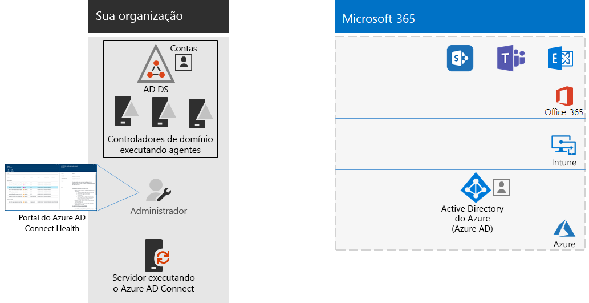

# Etapa 8: Monitorar a integridade da sincronização

*Esta etapa é opcional e se aplica às versões E3 e E5 do Microsoft 365 Enterprise*

Nesta etapa, você vai instalar um agente do Azure AD Connect Health em cada um dos servidores de identidade local para monitorar a infraestrutura de identidade e os serviços de sincronização fornecidos pelo Azure AD Connect. As informações de monitoramento serão disponibilizadas em um portal do Azure AD Connect Health, em que você verá alertas, monitoramento do desempenho, análise de uso e outras informações.

A decisão da estrutura principal de como usar o Azure AD Connect Health baseia-se em como o Azure AD Connect está sendo usado:

- Se você estiver usando a opção de **autenticação gerenciada**, comece [usando o Azure AD Connect Health com a sincronização](https://docs.microsoft.com/azure/active-directory/connect-health/active-directory-aadconnect-health-sync) para entender e configurar o Azure AD Connect Health.
- Se você estiver sincronizando apenas os nomes das contas e dos grupos usando a **autenticação federada** com os Serviços de Federação do Active Directory (AD FS), comece [usando o Azure AD Connect Health com os AD FS](https://docs.microsoft.com/azure/active-directory/connect-health/active-directory-aadconnect-health-adfs) para entender e configurar o Azure AD Connect Health.

Ao concluir essa etapa, você:

- Terá instalado o agente do Azure AD Connect Health nos servidores do provedor de identidade local.
- Poderá ver, no portal do Azure AD Connect Health, o estado atual de sua infraestrutura local e das atividades de sincronização com o locatário do Azure AD para suas assinaturas do Office 365 e EMS.

Como ponto de verificação provisório, você pode consultar os [critérios de saída](identity-exit-criteria.md#crit-identity-sync-health) para esta etapa.

## Próxima etapa

|||
|:-------|:-----|
|| [Simplificar atualizações de senha](identity-password-writeback.md) |

