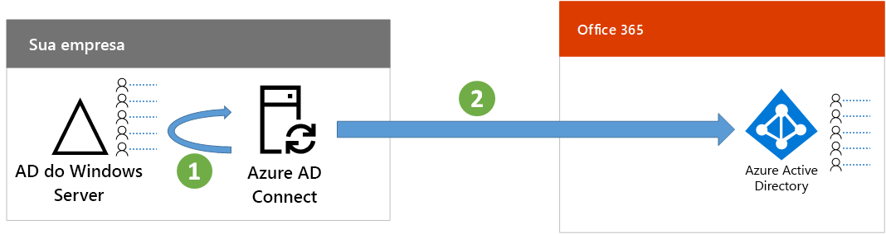

# Etapa 7: Sincronizar as identidadesStep 7: Synchronize identities

*Esta etapa é obrigatória para ambientes híbridos e se aplica às versões E3 e E5 do Microsoft 365 Enterprise**This step is required for hybrid environments and applies to both the E3 and E5 versions of Microsoft 365 Enterprise*

Nesta etapa, você sincronizará seu Windows Server Active Directory (AD) local com o locatário do Azure Active Directory (AD) usado por suas assinaturas do Office 365 e Enterprise Mobility + Security (EMS).In this step, you'll synchronize your on-premises Windows Server Active Directory (AD) with the Azure Active Directory (AD) tenant used by your Office 365 and Enterprise Mobility + Security (EMS) subscriptions.

O Azure AD Connect é a ferramenta da Microsoft compatível que orienta você para sincronizar apenas as identidades de que você realmente precisa de ambientes Windows Server AD com uma ou várias florestas para seu locatário do Azure AD.Azure AD Connect is the supported Microsoft tool that guides you through synchronizing only the identities you really need from single or multi-forest Windows Server AD environments to your Azure AD tenant.

*Como o Azure AD Connect sincroniza seu diretório local ao Azure AD**How Azure AD Connect synchronizes your on-premises directory with Azure AD*

A primeira decisão em sua solução de identidade híbrida é o requisito de autenticação. As alternativas a seguir são opções:The first decision in your hybrid identity solution is your authentication requirement. The following options are options:

- Com a **autenticação gerenciada**, o Azure AD lida com o processo de autenticação do login do usuário. Há dois métodos de autenticação gerenciada:With **managed authentication**, Azure AD handles the authentication process for user sign-in. There are two methods for managed authentication: 
    - **Sincronização de Hash de Senha (PHS)** [Recomendada e obrigatória para alguns recursos premium]. Essa é a maneira mais simples para habilitar a autenticação para objetos de diretório locais no Azure AD. O Azure AD Connect extrai senha hash do AD do Windows Server, executa o processamento de segurança adicional na senha e a salva no Azure AD. Para saber mais, confira [Implementar a sincronização de hash de senha com a sincronização do Azure AD Connect](https://docs.microsoft.com/azure/active-directory/connect/active-directory-aadconnectsync-implement-password-synchronization).**Password Hash Sync (PHS)** [Recommended and required for some premium features]. This is the simplest way to enable authentication for on-premises directory objects in Azure AD. Azure AD Connect extracts the hashed password from Windows Server AD, does extra security processing on the password, and saves it in Azure AD. For more information, see [Implement password hash synchronization with Azure AD Connect sync](https://docs.microsoft.com/azure/active-directory/connect/active-directory-aadconnectsync-implement-password-synchronization).
    - A **Autenticação Passagem (PTA)** fornece uma solução de validação de senha simples para serviços baseados no Azure AD. A PTA usa um agente em um ou mais servidores locais para validar as autenticações do usuário diretamente com o Windows Server AD local. Para saber mais, confira [Login de usuário com a Autenticação de Passagem do Azure Active Directory](https://docs.microsoft.com/azure/active-directory/connect/active-directory-aadconnect-pass-through-authentication).**Pass-through Authentication (PTA)** provides a simple password validation solution for Azure AD-based services. PTA uses an agent running on one or more on-premises servers to validate the user authentications directly with your on-premises Windows Server AD. For more information, see [User sign-in with Azure Active Directory Pass-through Authentication](https://docs.microsoft.com/azure/active-directory/connect/active-directory-aadconnect-pass-through-authentication).
- Com a **autenticação federada**, o processo de autenticação é redirecionado para outro provedor de identidade por meio de um servidor de federação de identidade, como os Serviços de Federação do Active Directory (AD FS) para o login de um usuário. O provedor de identidade pode fornecer métodos de autenticação adicionais, como a autenticação baseada em cartão inteligente. Para saber mais, confira [Escolhendo o método de autenticação correto para sua solução de identidade híbrida do Azure Active Directory](https://docs.microsoft.com/azure/security/azure-ad-choose-authn).With **federated authentication**, the authentication process is redirected to another identity provider through an identity federation server, such as Active Directory Federation Services (AD FS), for a user’s sign-in. The identity provider can provide additional authentication methods, such as smartcard-based authentication. For more information, see [Choosing the right authentication method for your Azure Active Directory hybrid identity solution](https://docs.microsoft.com/azure/security/azure-ad-choose-authn).

Depois de determinar sua solução de identidade híbrida, baixe e execute a [Ferramenta de Correção de Erros de Sincronização de Diretórios IdFix](https://www.microsoft.com/download/details.aspx?id=36832) para verificar se seu Windows Server AD tem problemas.After you've determined your hybrid identity solution, download and run the [IdFix Directory Synchronization Error Remediation Tool](https://www.microsoft.com/download/details.aspx?id=36832) to analyze your Windows Server AD for issues.

Depois de resolver todos os problemas identificados pela ferramenta IdFix, confira [Implementar a sincronização de hash de senha](https://docs.microsoft.com/azure/active-directory/connect/active-directory-aadconnectsync-implement-password-hash-synchronization) para obter instruções sobre como instalar a ferramenta Azure AD Connect e configurar a sincronização de diretórios entre o Windows Server AD local e o locatário do Azure AD para suas assinaturas do Office 365 e do EMS. Depois que a sincronização for iniciada, você manterá suas contas de usuários e grupos com seu provedor de identidade local, como o Windows Server AD.After resolving all of the issues identified by the IdFix tool, see [Implement password hash synchronization](https://docs.microsoft.com/azure/active-directory/connect/active-directory-aadconnectsync-implement-password-hash-synchronization) for guidance on installing the Azure AD Connect tool and configuring directory synchronization between your on-premises Windows Server AD and the Azure AD tenant for your Office 365 and EMS subscriptions. After synchronization starts, you'll maintain your user accounts and groups with your on-premises identity provider, such as Windows Server AD.

A Microsoft fornece um conjunto de recomendações para [acesso de dispositivo e identidade](microsoft-365-policies-configurations.md) para garantir uma força de trabalho segura e produtiva.Microsoft provides a set of recommendations for [identity and device access](microsoft-365-policies-configurations.md) to ensure a secure and productive workforce. 
- Para obter os requisitos recomendados para ambientes híbridos, confira a coluna **Active Directory com sincronização de hash de senha** em [pré-requisitos](identity-access-prerequisites.md#prerequisites).For recommended requirements for hybrid environments, see the **Active Directory with password hash sync** column in [prerequisites](identity-access-prerequisites.md#prerequisites). 

- Para obter requisitos recomendados para ambientes somente de nuvem, confira a coluna **Somente de nuvem** em [pré-requisitos](identity-access-prerequisites.md#prerequisites).For recommended requirements for cloud only environments, see the **Cloud only** column in [prerequisites](identity-access-prerequisites.md#prerequisites).

|||
|:-------|:-----|
|| [Guia de laboratório de teste: Sincronização de hash de senhaTest Lab Guide: Password hash synchronization](password-hash-sync-m365-ent-test-environment.md)  [Guia de laboratório de teste: Autenticação passagemTest Lab Guide: Pass-through authentication](pass-through-auth-m365-ent-test-environment.md) |
|||

Como ponto de verificação provisório, você pode consultar os [critérios de saída](identity-exit-criteria.md#crit-identity-sync) para esta etapa.As an interim checkpoint, you can see the [exit criteria](identity-exit-criteria.md#crit-identity-sync) corresponding to this step.

## Próxima etapaNext step

|||
|:-------|:-----|
|| [Monitorar integridades de sincronizaçãoMonitor synchronization health](identity-azure-ad-connect-health.md) |

