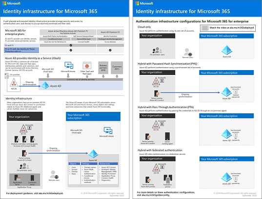

# Roteiro da identidade do Microsoft 365

No Microsoft 365 for Enterprise, uma infraestrutura de identidade bem planejada e executada abre a forma de segurança mais forte, incluindo a restrição de acesso às cargas de trabalho de produtividade e seus dados apenas para usuários e dispositivos autenticados.

Para obter uma visão geral dos modelos de identidade e autenticação do Microsoft 365 for Enterprise, Assista a este vídeo.

 

> [!VIDEO https://www.microsoft.com/videoplayer/embed/RE2Pjwu]

Para obter informações sobre os recursos de identidade de cada Microsoft 365 for Enterprise Plan, a função do Azure Active Directory, tanto os componentes locais quanto os baseados em nuvem, e as configurações de autenticação mais comuns, confira o [pôster de infraestrutura de identidade](../downloads/m365e-identity-infra.pdf).

Revise este cartaz de duas páginas para aumentar rapidamente os conceitos de identidade e as configurações do Microsoft 365 para empresas.

Você também pode [baixar este cartaz](https://github.com/MicrosoftDocs/microsoft-365-docs/raw/public/microsoft-365/downloads/m365e-identity-infra.pdf) e pode imprimi-lo em formato carta, legal ou tablóide (11 x 17).

## Plano

Para planejar sua implementação de identidade:

- [Entender os diferentes modelos de identidade](about-microsoft-365-identity.md)
- [Planejar a identidade híbrida e a sincronização de diretórios](plan-for-directory-synchronization.md)

## Implantar

Para implantar sua implementação de identidade:

- [Proteger contas de administrador global](protect-your-global-administrator-accounts.md)
- [Configurar e usar identidades somente na nuvem](cloud-only-identities.md)
- [Configurar e usar identidades híbridas](prepare-for-directory-synchronization.md)
- [Configurar a sincronização de diretórios](set-up-directory-synchronization.md)
- Se necessário, implante [cenários de identidade híbrida](hybrid-solutions.md)

### Recomendações de acesso de dispositivo e identidade

Para ajudar a garantir uma força de obra segura e produtiva, a Microsoft fornece um conjunto de recomendações para [acesso de identidades e dispositivos](../security/office-365-security/microsoft-365-policies-configurations.md). Para identidade, use as recomendações e configurações nestes artigos:

- [Pré-requisitos](../security/office-365-security/identity-access-prerequisites.md)
- [Identidade comum e políticas de acesso ao dispositivo](../security/office-365-security/identity-access-policies.md)

## Gerenciar

Para gerenciar sua implantação de identidade do Microsoft 365, consulte:

- [Contas de usuário](manage-microsoft-365-accounts.md)
- [Licenças](assign-licenses-to-user-accounts.md)
- [Senhas](manage-microsoft-365-passwords.md)
- [Grupos](manage-microsoft-365-groups.md)
- [Governança](manage-microsoft-365-identity-governance.md)
- [Sincronização de diretório](view-directory-synchronization-status.md)

## Como a Microsoft tem a identidade para o Microsoft 365

Saiba como os especialistas de TI [da Microsoft gerenciam identidades e protegem o acesso.](https://www.microsoft.com/en-us/itshowcase/managing-user-identities-and-secure-access-at-microsoft)

>[!Note]
>Este recurso de demonstração de ti está disponível somente em inglês.
>

## Como a contoso fazia a identidade para o Microsoft 365

Para obter um exemplo de como uma organização multinacional fictícia, mas representativa, implantou uma infraestrutura de identidade híbrida para os serviços de nuvem da Microsoft 365, consulte [Identity for the Contoso Corporation](contoso-identity.md).

## Próxima etapa

Inicie o planejamento de identidades com [modelos de identidade](about-microsoft-365-identity.md).
