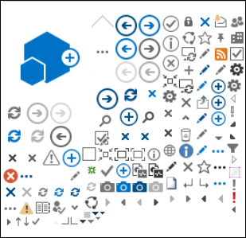
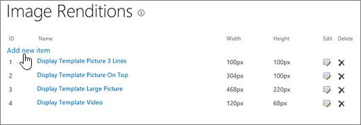

# Otimização de imagem para sites de publicação clássicas do SharePoint Online

A velocidade de carregamento de uma página da Web depende do tamanho combinado de todos os componentes necessários para renderizar a página, incluindo imagens, HTML, JavaScript e CSS. As imagens são uma ótima maneira de tornar seu site mais atraente, mas seu tamanho pode afetar o desempenho. Otimizando as imagens com compactação e redimensionamento e usando sprites, você pode deslocar os efeitos de imagens muito grandes. Usando as renderizações de imagem do SharePoint, você pode carregar uma única imagem grande e exibir seções da imagem, permitindo que ela seja reutilizada em vez de ser recarregada.

>[!NOTE]
>Este tópico se aplica aos sites de publicação clássica do SharePoint Online, não aos sites de portal modernos. Para obter informações sobre otimização de imagem nos sites de portal modernos do SharePoint Online, consulte [otimizar imagens nas páginas do portal moderno do SharePoint Online](modern-image-optimization.md).
  
## Usando sprites para acelerar o carregamento de imagens

|||
|:-----|:-----|
| Uma entidade de conteúdo de imagem contém muitas imagens menores. Usando o CSS, você seleciona uma parte da imagem composta para exibir em uma parte específica da página com posicionamento absoluto. Basicamente, você move uma única imagem em torno da página, em vez de carregar várias imagens, e tornar uma pequena parte dessa imagem visível através de uma pequena janela onde a parte necessária da imagem Sprite é mostrada para o usuário final. O SharePoint Online usa sprites para exibir seus vários ícones na spcommon.png Sprite.     O que é abordado aqui:     Compactação de imagem     Otimização de imagem     Renderizações de imagem do SharePoint    ||
   
Isso pode aumentar o desempenho porque você baixa apenas uma imagem em vez de várias e, em seguida, o cache e reutiliza essa imagem. Mesmo que a imagem não permaneça armazenada em cache, com uma única imagem em vez de várias imagens, esse método reduz o número total de solicitações HTTP para o servidor que reduzirá o tempo de carregamento da página. Na verdade, essa é uma forma de empacotamento de imagem. Essa é uma técnica muito útil se as imagens não estiverem mudando com muita frequência, por exemplo, ícones, conforme mostrado no exemplo do SharePoint fornecido acima. Você pode usar o [Web Essentials](https://vswebessentials.com/), um projeto de terceiros, de código-fonte aberto, baseado na Comunidade para conseguir isso facilmente no Microsoft Visual Studio. Para saber mais, confira [minificação e agrupamento no SharePoint Online](https://go.microsoft.com/fwlink/?LinkId=708698).
  
## Usando a compactação e otimização de imagem para acelerar o carregamento de página

A compactação e a otimização da imagem consistem em reduzir o tamanho do arquivo das imagens que você usa em seu site. Normalmente, a melhor técnica para reduzir o tamanho de uma imagem é redimensionar a imagem para as dimensões máximas que serão exibidas no site. Não há sentido em ter uma imagem maior do que nunca será exibida. Garantir que as imagens sejam das dimensões corretas usando um editor de imagens é uma maneira rápida e fácil de reduzir o tamanho da página.
  
Após as imagens serem o tamanho certo, a próxima etapa é otimizar a compactação dessas imagens. Há várias ferramentas disponíveis para usar para compactação e otimização, incluindo Galeria de fotos e ferramentas de terceiros. A chave para compactação é reduzir o tamanho do arquivo o máximo possível sem perder qualquer qualidade de distinguíveis para usuários finais. Certifique-se de testar seus arquivos compactados em uma exibição de alta definição para garantir que eles ainda terão uma boa aparência.
  
## Acelerar os downloads de página usando as renderizações de imagem do SharePoint

As representações de imagem são um recurso do SharePoint Online que permite atender a versões diferentes de imagens com base em dimensões de imagem predefinidas. Isso é especialmente importante quando há conteúdo de imagem gerado pelo usuário ou as dimensões de imagem, como largura e altura, são corrigidas pelo CSS no site. Mesmo se uma imagem for corrigida pelo CSS, a imagem de resolução completa ainda será carregada. Nesse caso, o tamanho do arquivo pode ser reduzido usando as representações de imagem.
  
> [!NOTE]
> As rendições só estão disponíveis para o SharePoint quando a publicação está habilitada. Você pode habilitar a publicação em configurações \> do site de configurações \> gerenciar recursos \> do site publicação do SharePoint Server. A opção não será exibida caso contrário.
  
O redimensionamento da representação de imagem funciona com a menor dimensão definida, a largura ou altura e, em seguida, o redimensionamento da imagem para que a outra dimensão seja automaticamente redimensionada com base na taxa de proporção bloqueada. Por padrão, ele cortará a imagem do centro pelas dimensões restantes. Por exemplo, se você definir uma representação de 100px Wide e 50px High e sua imagem original for 1000px Wide e 800px High, ela será redimensionada para que a dimensão 800px agora seja 50px e a dimensão 1000px (agora 62,5 px) seja cortada do centro da imagem.
  
As etapas são relativamente simples, mas para imagens usar as representações, as representações precisam estar no site do SharePoint antes de você adicionar as imagens. Além disso, você também precisa ter os recursos da infraestrutura de publicação do SharePoint Server (nível de conjunto de sites) e do SharePoint Server Publishing (nível do site) ativados.
  
### Adicionar uma representação de imagem para acelerar o carregamento da página
  
1. Verifique se a conta de usuário que está executando esse procedimento tem, no mínimo, permissões de design para o site de nível superior do conjunto de sites e se o site está sendo publicado em uma página da Web.

2. Em um navegador da Web, vá para o site de nível superior do conjunto de sites de publicação.

3. Escolha o ícone de **configurações**.

4. Na página **configurações do site** , na seção **aparência** , você verá as representações de imagem internas.

    Você pode usar as representações de ausência temporária ou escolher as **representações de imagem** para criar uma nova.

    
  
5. Na página **Representações de Imagem**, escolha **Adicionar novo item**.

    
  
6. Na página **Nova representação de imagem**, na caixa **nome**, digite um nome para a representação.

7. Nas caixas de texto **Largura** e **Altura**, digite a largura e a altura, em pixels, da representação e, em seguida, escolha **Salvar**.

    
  
## Corte personalizado com renderizações de imagem

Por padrão, uma representação de imagem é gerada a partir do centro da imagem. Você pode ajustar a representação de imagem para imagens individuais, cortando a parte da imagem que você deseja usar. Você pode cortar as imagens individualmente, por representação. Cortar as imagens acelera o carregamento da página usando o cache de blob do SharePoint para criar uma versão da imagem para cada representação. Dessa forma, a carga do servidor é reduzida porque a imagem é redimensionada apenas uma vez e, em seguida, está pronta para atender aos usuários finais várias vezes. Para obter mais informações sobre como cortar uma representação de imagem, confira [cortar uma representação de imagem](https://go.microsoft.com/fwlink/p/?LinkId=525626).
  

