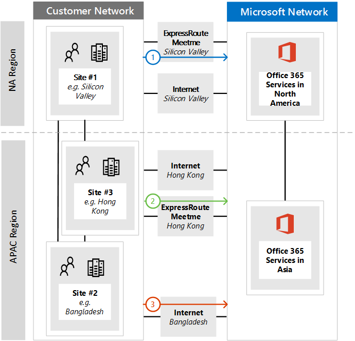

# <a name="implementing-expressroute-for-office-365"></a><span data-ttu-id="3f388-103">Como implementar o ExpressRoute para o Office 365</span><span class="sxs-lookup"><span data-stu-id="3f388-103">Implementing ExpressRoute for Office 365</span></span>

<span data-ttu-id="3f388-104">*Esse artigo se aplica ao Microsoft 365 Enterprise e ao Office 365 Enterprise.*</span><span class="sxs-lookup"><span data-stu-id="3f388-104">*This article applies to both Microsoft 365 Enterprise and Office 365 Enterprise.*</span></span>

<span data-ttu-id="3f388-105">O ExpressRoute para Office 365 fornece um caminho de roteamento alternativo para muitos serviços do Office 365 voltados para a Internet.</span><span class="sxs-lookup"><span data-stu-id="3f388-105">ExpressRoute for Office 365 provides an alternate routing path to many internet facing Office 365 services.</span></span> <span data-ttu-id="3f388-106">A arquitetura do ExpressRoute para Office 365 se baseia em prefixos ip públicos de publicidade de serviços do Office 365 que já estão acessíveis pela Internet em seus circuitos do ExpressRoute provisionados para redistribuição subsequente desses prefixos IP para sua rede.</span><span class="sxs-lookup"><span data-stu-id="3f388-106">The architecture of ExpressRoute for Office 365 is based on advertising public IP prefixes of Office 365 services that are already accessible over the Internet into your provisioned ExpressRoute circuits for subsequent redistribution of those IP prefixes into your network.</span></span> <span data-ttu-id="3f388-107">Com o ExpressRoute, você efetivamente habilita vários caminhos de roteamento diferentes, por meio da Internet e por meio do ExpressRoute, para muitos serviços do Office 365.</span><span class="sxs-lookup"><span data-stu-id="3f388-107">With ExpressRoute you effectively enable several different routing paths, through the internet and through ExpressRoute, for many Office 365 services.</span></span> <span data-ttu-id="3f388-108">Esse estado de roteamento em sua rede pode representar uma alteração significativa em como sua topologia de rede interna foi projetada.</span><span class="sxs-lookup"><span data-stu-id="3f388-108">This state of routing on your network may represent a significant change to how your internal network topology is designed.</span></span>
  
 <span data-ttu-id="3f388-109">**Status:** Guia completo v2</span><span class="sxs-lookup"><span data-stu-id="3f388-109">**Status:** Complete Guide v2</span></span>
  
<span data-ttu-id="3f388-110">Você deve planejar cuidadosamente sua implementação do ExpressRoute para Office 365 para acomodar as complexidades de rede de ter o roteamento disponível por meio de um circuito dedicado com rotas injetadas em sua rede principal e na Internet.</span><span class="sxs-lookup"><span data-stu-id="3f388-110">You must carefully plan your ExpressRoute for Office 365 implementation to accommodate for the network complexities of having routing available via both a dedicated circuit with routes injected into your core network and the internet.</span></span> <span data-ttu-id="3f388-111">Se você e sua equipe não realizarem o planejamento e os testes detalhados neste guia, há um alto risco de você experimentar uma perda intermitente ou total de conectividade com os serviços do Office 365 quando o circuito do ExpressRoute estiver habilitado.</span><span class="sxs-lookup"><span data-stu-id="3f388-111">If you and your team don't perform the detailed planning and testing in this guide, there is a high risk you'll experience intermittent or a total loss of connectivity to Office 365 services when the ExpressRoute circuit is enabled.</span></span>
  
<span data-ttu-id="3f388-112">Para ter uma implementação bem-sucedida, você precisará analisar seus requisitos de infraestrutura, passar por uma avaliação e design de rede detalhados, planejar cuidadosamente a distribuição de maneira controlada e em estágios e criar um plano detalhado de validação e teste.</span><span class="sxs-lookup"><span data-stu-id="3f388-112">To have a successful implementation, you will need to analyze your infrastructure requirements, go through detailed network assessment and design, carefully plan the rollout in a staged and controlled manner, and build a detailed validation and testing plan.</span></span> <span data-ttu-id="3f388-113">Para um ambiente grande e distribuído, não é incomum ver implementações por vários meses.</span><span class="sxs-lookup"><span data-stu-id="3f388-113">For a large, distributed environment it's not uncommon to see implementations span several months.</span></span> <span data-ttu-id="3f388-114">Este guia foi projetado para ajudá-lo a planejar com antecedência.</span><span class="sxs-lookup"><span data-stu-id="3f388-114">This guide is designed to help you plan ahead.</span></span>
  
<span data-ttu-id="3f388-115">Grandes implantações bem-sucedidas podem levar seis meses de planejamento e geralmente incluem membros da equipe de muitas áreas da organização, incluindo administradores de rede, firewall e servidor proxy, administradores do Office 365, segurança, suporte ao usuário final, gerenciamento de projetos e apoio executivo.</span><span class="sxs-lookup"><span data-stu-id="3f388-115">Large successful deployments may take six months in planning and often include team members from many areas in the organization including networking, Firewall and Proxy server administrators, Office 365 administrators, security, end-user support, project management, and executive sponsorship.</span></span> <span data-ttu-id="3f388-116">Seu investimento no processo de planejamento reduzirá a probabilidade de que você experimente falhas de implantação resultando em tempo de inatividade ou solução de problemas complexos e caros.</span><span class="sxs-lookup"><span data-stu-id="3f388-116">Your investment in the planning process will reduce the likelihood that you'll experience deployment failures resulting in downtime or complex and expensive troubleshooting.</span></span>
  
<span data-ttu-id="3f388-117">Esperamos que os pré-requisitos a seguir sejam concluídos antes do início deste guia de implementação.</span><span class="sxs-lookup"><span data-stu-id="3f388-117">We expect the following pre-requisites to be completed before this implementation guide is started.</span></span>
  
1. <span data-ttu-id="3f388-118">Você concluiu uma avaliação de rede para determinar se o ExpressRoute é recomendado e aprovado.</span><span class="sxs-lookup"><span data-stu-id="3f388-118">You've completed a network assessment to determine if ExpressRoute is recommended and approved.</span></span>

2. <span data-ttu-id="3f388-119">Você selecionou um provedor de serviços de rede do ExpressRoute.</span><span class="sxs-lookup"><span data-stu-id="3f388-119">You've selected an ExpressRoute network service provider.</span></span> <span data-ttu-id="3f388-120">Encontre detalhes sobre os [parceiros do ExpressRoute e locais de paring.](https://azure.microsoft.com/documentation/articles/expressroute-locations/)</span><span class="sxs-lookup"><span data-stu-id="3f388-120">Find details about the [ExpressRoute partners and peering locations](https://azure.microsoft.com/documentation/articles/expressroute-locations/).</span></span>

3. <span data-ttu-id="3f388-121">Você já leu e compreendeu a documentação do [ExpressRoute](https://azure.microsoft.com/documentation/services/expressroute/) e sua rede interna é capaz de atender aos pré-requisitos do ExpressRoute de ponta a ponta.</span><span class="sxs-lookup"><span data-stu-id="3f388-121">You've already read and understand the [ExpressRoute documentation](https://azure.microsoft.com/documentation/services/expressroute/) and your internal network is able to meet ExpressRoute pre-requisites end to end.</span></span>

4. <span data-ttu-id="3f388-122">Sua equipe leu todas as orientações públicas e documentação em , e viu a série de treinamento do [https://aka.ms/expressrouteoffice365](https://aka.ms/expressrouteoffice365) [https://aka.ms/ert](https://aka.ms/ert) [Azure ExpressRoute para Office 365](https://channel9.msdn.com/series/aer) no Canal 9 para obter uma compreensão de detalhes técnicos críticos, incluindo:</span><span class="sxs-lookup"><span data-stu-id="3f388-122">Your team has read all of the public guidance and documentation at [https://aka.ms/expressrouteoffice365](https://aka.ms/expressrouteoffice365), [https://aka.ms/ert](https://aka.ms/ert), and watched the [Azure ExpressRoute for Office 365 Training](https://channel9.msdn.com/series/aer) series on Channel 9 to gain an understanding of critical technical details including:</span></span>

      - <span data-ttu-id="3f388-123">As dependências de Internet dos serviços SaaS.</span><span class="sxs-lookup"><span data-stu-id="3f388-123">The internet dependencies of SaaS services.</span></span>

      - <span data-ttu-id="3f388-124">Como evitar rotas assimétricas e lidar com roteamento complexo.</span><span class="sxs-lookup"><span data-stu-id="3f388-124">How to avoid asymmetric routes and handle complex routing.</span></span>

      - <span data-ttu-id="3f388-125">Como incorporar a segurança de perímetro, a disponibilidade e os controles no nível do aplicativo.</span><span class="sxs-lookup"><span data-stu-id="3f388-125">How to incorporate perimeter security, availability, and application level controls.</span></span>

## <a name="begin-by-gathering-requirements"></a><span data-ttu-id="3f388-126">Comece coletando requisitos</span><span class="sxs-lookup"><span data-stu-id="3f388-126">Begin by gathering requirements</span></span>
<span data-ttu-id="3f388-127"><a name="requirements"> </a></span><span class="sxs-lookup"><span data-stu-id="3f388-127"><a name="requirements"> </a></span></span>

<span data-ttu-id="3f388-128">Comece determinando quais recursos e serviços você planeja adotar em sua organização.</span><span class="sxs-lookup"><span data-stu-id="3f388-128">Start by determining which features and services you plan to adopt within your organization.</span></span> <span data-ttu-id="3f388-129">Você precisa determinar quais recursos dos diferentes serviços do Office 365 serão usados e quais locais em sua rede hospedarão pessoas usando esses recursos.</span><span class="sxs-lookup"><span data-stu-id="3f388-129">You need to determine which features of the different Office 365 services will be used and which locations on your network will host people using those features.</span></span> <span data-ttu-id="3f388-130">Com o catálogo de cenários, você precisa adicionar os atributos de rede que cada um desses cenários exige; como fluxos de tráfego de rede de entrada e saída e se os pontos de extremidade do Office 365 estão disponíveis pelo ExpressRoute ou não.</span><span class="sxs-lookup"><span data-stu-id="3f388-130">With the catalog of scenarios, you need to add the network attributes that each of those scenarios require; such as inbound and outbound network traffic flows and if the Office 365 endpoints are available over ExpressRoute or not.</span></span>
  
<span data-ttu-id="3f388-131">Para reunir os requisitos da sua organização:</span><span class="sxs-lookup"><span data-stu-id="3f388-131">To gather your organization's requirements:</span></span>
  
- <span data-ttu-id="3f388-132">Cataloge o tráfego de rede de entrada e saída dos serviços do Office 365 que sua organização está usando.</span><span class="sxs-lookup"><span data-stu-id="3f388-132">Catalog the inbound and outbound network traffic for the Office 365 services your organization is using.</span></span> <span data-ttu-id="3f388-133">Consulte a página de intervalos de endereços IP e URLs do Office 365 para ver a descrição dos fluxos que diferentes cenários do Office 365 exigem.</span><span class="sxs-lookup"><span data-stu-id="3f388-133">Consult Office 365 URLs and IP address ranges page for the description of flows that different Office 365 scenarios require.</span></span>

- <span data-ttu-id="3f388-134">Reúna a documentação da topologia de rede existente mostrando detalhes de seu backbone e topologia da WAN interna, conectividade de sites via satélite, conectividade de usuário de última milha, roteamento para pontos de saída de perímetro de rede e serviços de proxy.</span><span class="sxs-lookup"><span data-stu-id="3f388-134">Gather documentation of existing network topology showing details of your internal WAN backbone and topology, connectivity of satellite sites, last mile user connectivity, routing to network perimeter egress points, and proxy services.</span></span>

  - <span data-ttu-id="3f388-135">Identifique os pontos de extremidade do serviço de entrada nos diagramas de rede aos quais o Office 365 e outros serviços Microsoft se conectarão, mostrando os caminhos de conexão da Internet e do ExpressRoute propostos.</span><span class="sxs-lookup"><span data-stu-id="3f388-135">Identify inbound service endpoints on the network diagrams that Office 365 and other Microsoft services will connect to, showing both internet and proposed ExpressRoute connection paths.</span></span>

  - <span data-ttu-id="3f388-136">Identifique todos os locais de usuário geográfico e conectividade WAN entre locais, juntamente com quais locais atualmente têm uma saída para a Internet e quais locais são propostos para ter uma saída para um local de paring ExpressRoute.</span><span class="sxs-lookup"><span data-stu-id="3f388-136">Identify all geographic user locations and WAN connectivity between locations along with which locations currently have an egress to the internet and which locations are proposed to have an egress to an ExpressRoute peering location.</span></span>

  - <span data-ttu-id="3f388-137">Identifique todos os dispositivos de borda, como proxies, firewalls e assim por diante, e cataloge sua relação com fluxos que vão pela Internet e pelo ExpressRoute.</span><span class="sxs-lookup"><span data-stu-id="3f388-137">Identify all edge devices, such as proxies, firewalls, and so on and catalog their relationship to flows going over the Internet and ExpressRoute.</span></span>

  - <span data-ttu-id="3f388-138">Documente se os usuários finais acessarão os serviços do Office 365 por meio de roteamento direto ou proxy de aplicativo indireto para fluxos da Internet e do ExpressRoute.</span><span class="sxs-lookup"><span data-stu-id="3f388-138">Document whether end users will access Office 365 services via direct routing or indirect application proxy for both Internet and ExpressRoute flows.</span></span>

- <span data-ttu-id="3f388-139">Adicione o local do locatário e os locais do meet-me ao diagrama de rede.</span><span class="sxs-lookup"><span data-stu-id="3f388-139">Add the location of your tenant and meet-me locations to your network diagram.</span></span>

- <span data-ttu-id="3f388-140">Es estimar as características esperadas e observadas de desempenho e latência da rede dos principais locais de usuários para o Office 365.</span><span class="sxs-lookup"><span data-stu-id="3f388-140">Estimate the expected and observed network performance and latency characteristics from major user locations to Office 365.</span></span> <span data-ttu-id="3f388-141">Tenha em mente que o Office 365 é um conjunto global e distribuído de serviços e os usuários estarão se conectando a locais que podem ser diferentes do local de seu locatário.</span><span class="sxs-lookup"><span data-stu-id="3f388-141">Keep in mind that Office 365 is a global and distributed set of services and users will be connecting to locations that may be different from the location of their tenant.</span></span> <span data-ttu-id="3f388-142">Por esse motivo, é recomendável medir e otimizar a latência entre o usuário e a borda mais próxima da rede global da Microsoft sobre conexões ExpressRoute e Internet.</span><span class="sxs-lookup"><span data-stu-id="3f388-142">For this reason, it is recommended to measure and optimize for latency between the user and the closest edge of Microsoft global network over ExpressRoute and Internet connections.</span></span> <span data-ttu-id="3f388-143">Você pode usar suas descobertas da avaliação de rede para auxiliar nessa tarefa.</span><span class="sxs-lookup"><span data-stu-id="3f388-143">You can use your findings from the network assessment to aid with this task.</span></span>

- <span data-ttu-id="3f388-144">Listar os requisitos de segurança e alta disponibilidade da rede da empresa que precisam ser atendidos com a nova conexão do ExpressRoute.</span><span class="sxs-lookup"><span data-stu-id="3f388-144">List company network security and high availability requirements that need to be met with the new ExpressRoute connection.</span></span> <span data-ttu-id="3f388-145">Por exemplo, como os usuários continuam a obter acesso ao Office 365 em caso de falha na saída da Internet ou do circuito expressRoute.</span><span class="sxs-lookup"><span data-stu-id="3f388-145">For example, how do users continue to get access to Office 365 in the event of the Internet egress or ExpressRoute circuit failure.</span></span>

- <span data-ttu-id="3f388-146">Documente quais fluxos de rede de entrada e saída do Office 365 usarão o caminho da Internet e qual usará o ExpressRoute.</span><span class="sxs-lookup"><span data-stu-id="3f388-146">Document which inbound and outbound Office 365 network flows will use the Internet path and which will use ExpressRoute.</span></span> <span data-ttu-id="3f388-147">As especificidades das localizações geográficas dos usuários e os detalhes da topologia de rede local podem exigir que o plano seja diferente de um local de usuário para outro.</span><span class="sxs-lookup"><span data-stu-id="3f388-147">The specifics of geographical locations of your users and details of your on-premises network topology may require the plan to be different from one user location to another.</span></span>

### <a name="catalog-your-outbound-and-inbound-network-traffic"></a><span data-ttu-id="3f388-148">Cataloge seu tráfego de rede de saída e de entrada</span><span class="sxs-lookup"><span data-stu-id="3f388-148">Catalog your outbound and inbound network traffic</span></span>
<span data-ttu-id="3f388-149"><a name="trafficCatalog"> </a></span><span class="sxs-lookup"><span data-stu-id="3f388-149"><a name="trafficCatalog"> </a></span></span>

<span data-ttu-id="3f388-150">Para minimizar o roteamento e outras complexidades de rede, recomendamos que você use apenas o ExpressRoute para o Office 365 para os fluxos de tráfego de rede necessários para passar por uma conexão dedicada devido a requisitos regulamentar ou como resultado da avaliação de rede.</span><span class="sxs-lookup"><span data-stu-id="3f388-150">To minimize routing and other network complexities, we recommend that you only use ExpressRoute for Office 365 for the network traffic flows that are required to go over a dedicated connection due to regulatory requirements or as the result of the network assessment.</span></span> <span data-ttu-id="3f388-151">Além disso, recomendamos que você estande o escopo do roteamento expressRoute e a abordagem dos fluxos de tráfego de rede de saída e de entrada como estágios diferentes do projeto de implementação.</span><span class="sxs-lookup"><span data-stu-id="3f388-151">Additionally, we recommend that you stage the scope of ExpressRoute routing and approach outbound and inbound network traffic flows as different and distinct stages of the implementation project.</span></span> <span data-ttu-id="3f388-152">Implantar o ExpressRoute para o Office 365 apenas para fluxos de tráfego de rede de saída iniciados pelo usuário e deixar fluxos de tráfego de rede de entrada pela Internet pode ajudar a controlar o aumento da complexidade e dos riscos de introduzir possibilidades adicionais de roteamento assimétrico.</span><span class="sxs-lookup"><span data-stu-id="3f388-152">Deploy ExpressRoute for Office 365 for just user initiated outbound network traffic flows and leave inbound network traffic flows across the Internet can help to control the increase in topological complexity and risks of introducing additional asymmetric routing possibilities.</span></span>
  
<span data-ttu-id="3f388-153">Seu catálogo de tráfego de rede deve conter listagem de todas as conexões de rede de entrada e saída que você terá entre sua rede local e a Microsoft.</span><span class="sxs-lookup"><span data-stu-id="3f388-153">Your network traffic catalog should contain listings of all the inbound and outbound network connections that you'll have between your on-premises network and Microsoft.</span></span>
  
- <span data-ttu-id="3f388-154">Fluxos de tráfego de rede de saída são qualquer cenário em que uma conexão é iniciada a partir do seu ambiente local, como de clientes ou servidores internos, com um destino dos serviços Microsoft.</span><span class="sxs-lookup"><span data-stu-id="3f388-154">Outbound network traffic flows are any scenarios where a connection is initiated from your on-premises environment, such as from internal clients or servers, with a destination of the Microsoft services.</span></span> <span data-ttu-id="3f388-155">Essas conexões podem ser diretas para o Office 365 ou indiretas, como quando a conexão passa por servidores proxy, firewalls ou outros dispositivos de rede no caminho para o Office 365.</span><span class="sxs-lookup"><span data-stu-id="3f388-155">These connections may be direct to Office 365 or indirect, such as when the connection goes through proxy servers, firewalls, or other networking devices on the path to Office 365.</span></span>

- <span data-ttu-id="3f388-156">Fluxos de tráfego de rede de entrada são qualquer cenário em que uma conexão é iniciada da nuvem da Microsoft para um host local.</span><span class="sxs-lookup"><span data-stu-id="3f388-156">Inbound network traffic flows are any scenarios where a connection is initiated from the Microsoft cloud to an on-premises host.</span></span> <span data-ttu-id="3f388-157">Essas conexões geralmente precisam passar pelo firewall e por outra infraestrutura de segurança que a política de segurança do cliente exige para fluxos originados externamente.</span><span class="sxs-lookup"><span data-stu-id="3f388-157">These connections typically need to go through firewall and other security infrastructure that customer security policy requires for externally originated flows.</span></span>

<span data-ttu-id="3f388-158">Leia  a seção Garantindo a simetria de rota do artigo Roteamento com [ExpressRoute para Office 365](https://support.office.com/article/Routing-with-ExpressRoute-for-Office-365-e1da26c6-2d39-4379-af6f-4da213218408) para determinar quais serviços enviarão tráfego de entrada e procurar a coluna marcada **expressRoute para Office 365** no artigo de referência de pontos de extremidade do [Office 365](https://support.office.com/article/Office-365-URLs-and-IP-address-ranges-8548a211-3fe7-47cb-abb1-355ea5aa88a2) para determinar o restante das informações de conectividade.</span><span class="sxs-lookup"><span data-stu-id="3f388-158">Read the **Ensuring route symmetry** section of the article [Routing with ExpressRoute for Office 365](https://support.office.com/article/Routing-with-ExpressRoute-for-Office-365-e1da26c6-2d39-4379-af6f-4da213218408) to determine which services will send inbound traffic and look for the column marked **ExpressRoute for Office 365** in the [Office 365 endpoints](https://support.office.com/article/Office-365-URLs-and-IP-address-ranges-8548a211-3fe7-47cb-abb1-355ea5aa88a2) reference article to determine the rest of the connectivity information.</span></span>
  
<span data-ttu-id="3f388-159">Para cada serviço que requer uma conexão de saída, você precisará descrever a conectividade planejada para o serviço, incluindo roteamento de rede, configuração de proxy, inspeção de pacotes e necessidades de largura de banda.</span><span class="sxs-lookup"><span data-stu-id="3f388-159">For each service that requires an outbound connection, you'll want to describe the planned connectivity for the service including network routing, proxy configuration, packet inspection, and bandwidth needs.</span></span>
  
<span data-ttu-id="3f388-160">Para cada serviço que requer uma conexão de entrada, você precisará de algumas informações adicionais.</span><span class="sxs-lookup"><span data-stu-id="3f388-160">For each service that requires an inbound connection, you'll need some additional information.</span></span> <span data-ttu-id="3f388-161">Os servidores na nuvem da Microsoft estabelecerão conexões com sua rede local.</span><span class="sxs-lookup"><span data-stu-id="3f388-161">Servers in the Microsoft cloud will establish connections to your on-premises network.</span></span> <span data-ttu-id="3f388-162">para garantir que as conexões sejam feitas corretamente, você vai querer descrever todos os aspectos dessa conectividade, incluindo; as entradas DNS públicas para os serviços que aceitarão essas conexões de entrada, os endereços IP IPv4 formatados cidr, que o equipamento ISP está envolvido e como NAT de entrada ou NAT de origem é tratado para essas conexões.</span><span class="sxs-lookup"><span data-stu-id="3f388-162">to ensure the connections are made correctly, you'll want to describe all aspects of this connectivity, including; the public DNS entries for the services that will accept these inbound connections, the CIDR formatted IPv4 IP addresses, which ISP equipment is involved, and how inbound NAT or source NAT is handled for these connections.</span></span>
  
<span data-ttu-id="3f388-163">As conexões de entrada devem ser revisadas independentemente de se estão se conectando pela Internet ou pela Rota Expressa para garantir que o roteamento assimétrico não tenha sido introduzido.</span><span class="sxs-lookup"><span data-stu-id="3f388-163">Inbound connections should be reviewed regardless of whether they're connecting over the internet or ExpressRoute to ensure asymmetric routing hasn't been introduced.</span></span> <span data-ttu-id="3f388-164">Em alguns casos, os pontos de extremidade locais aos quais os serviços do Office 365 iniciam conexões de entrada também podem precisar ser acessados por outros serviços da Microsoft e que não são da Microsoft.</span><span class="sxs-lookup"><span data-stu-id="3f388-164">In some cases, on-premises endpoints that Office 365 services initiate inbound connections to may also need to be accessed by other Microsoft and non-Microsoft services.</span></span> <span data-ttu-id="3f388-165">É fundamental que habilitar o roteamento ExpressRoute para esses serviços para fins do Office 365 não quebre outros cenários.</span><span class="sxs-lookup"><span data-stu-id="3f388-165">It is paramount that enabling ExpressRoute routing to these services for Office 365 purposes doesn't break other scenarios.</span></span> <span data-ttu-id="3f388-166">Em muitos casos, os clientes talvez precisem implementar alterações específicas em sua rede interna, como NAT com base na fonte, para garantir que os fluxos de entrada da Microsoft permaneçam simétricos depois que o ExpressRoute for habilitado.</span><span class="sxs-lookup"><span data-stu-id="3f388-166">In many cases, customers may need to implement specific changes to their internal network, such as source based NAT, to ensure that inbound flows from Microsoft remain symmetric after ExpressRoute is enabled.</span></span>
  
<span data-ttu-id="3f388-167">Aqui está um exemplo do nível de detalhe necessário.</span><span class="sxs-lookup"><span data-stu-id="3f388-167">Here's a sample of the level of detail required.</span></span> <span data-ttu-id="3f388-168">Nesse caso, o Exchange Híbrido seria roteado para o sistema local pela Rota Expressa.</span><span class="sxs-lookup"><span data-stu-id="3f388-168">In this case Exchange Hybrid would route to the on-premises system over ExpressRoute.</span></span>

|<span data-ttu-id="3f388-169">**Propriedade Connection**</span><span class="sxs-lookup"><span data-stu-id="3f388-169">**Connection property**</span></span>|<span data-ttu-id="3f388-170">**Valor**</span><span class="sxs-lookup"><span data-stu-id="3f388-170">**Value**</span></span>|
|:-----|:-----|
|<span data-ttu-id="3f388-171">**Direção do tráfego de rede**</span><span class="sxs-lookup"><span data-stu-id="3f388-171">**Network traffic direction**</span></span> <br/> |<span data-ttu-id="3f388-172">Entrada</span><span class="sxs-lookup"><span data-stu-id="3f388-172">Inbound</span></span>  <br/> |
|<span data-ttu-id="3f388-173">**Serviço**</span><span class="sxs-lookup"><span data-stu-id="3f388-173">**Service**</span></span> <br/> |<span data-ttu-id="3f388-174">Exchange Híbrido</span><span class="sxs-lookup"><span data-stu-id="3f388-174">Exchange Hybrid</span></span>  <br/> |
|<span data-ttu-id="3f388-175">**Ponto de extremidade público do Office 365 (origem)**</span><span class="sxs-lookup"><span data-stu-id="3f388-175">**Public Office 365 endpoint (source)**</span></span> <br/> |<span data-ttu-id="3f388-176">Exchange Online (endereços IP)</span><span class="sxs-lookup"><span data-stu-id="3f388-176">Exchange Online (IP addresses)</span></span>  <br/> |
|<span data-ttu-id="3f388-177">**Ponto de extremidade local público (destino)**</span><span class="sxs-lookup"><span data-stu-id="3f388-177">**Public On-Premises Endpoint (destination)**</span></span> <br/> |<span data-ttu-id="3f388-178">5.5.5.5</span><span class="sxs-lookup"><span data-stu-id="3f388-178">5.5.5.5</span></span>  <br/> |
|<span data-ttu-id="3f388-179">**Entrada DNS pública (Internet)**</span><span class="sxs-lookup"><span data-stu-id="3f388-179">**Public (Internet) DNS entry**</span></span> <br/> |<span data-ttu-id="3f388-180">Autodiscover.contoso.com</span><span class="sxs-lookup"><span data-stu-id="3f388-180">Autodiscover.contoso.com</span></span>  <br/> |
|<span data-ttu-id="3f388-181">**Esse ponto de extremidade local será usado por outros serviços Microsoft (que não sejam do Office 365)**</span><span class="sxs-lookup"><span data-stu-id="3f388-181">**Will this on-premises endpoint be used for by other (non-Office 365) Microsoft services**</span></span> <br/> |<span data-ttu-id="3f388-182">Não</span><span class="sxs-lookup"><span data-stu-id="3f388-182">No</span></span>  <br/> |
|<span data-ttu-id="3f388-183">**Esse ponto de extremidade local será usado por usuários/sistemas na Internet**</span><span class="sxs-lookup"><span data-stu-id="3f388-183">**Will this on-premises endpoint be used by users/systems on the Internet**</span></span> <br/> |<span data-ttu-id="3f388-184">Sim</span><span class="sxs-lookup"><span data-stu-id="3f388-184">Yes</span></span>  <br/> |
|<span data-ttu-id="3f388-185">**Sistemas internos publicados por meio de pontos de extremidade públicos**</span><span class="sxs-lookup"><span data-stu-id="3f388-185">**Internal systems published through public endpoints**</span></span> <br/> |<span data-ttu-id="3f388-186">Função de acesso para cliente do Exchange Server (local) 192.168.101, 192.168.102, 192.168.103</span><span class="sxs-lookup"><span data-stu-id="3f388-186">Exchange Server client access role (on-premises) 192.168.101, 192.168.102, 192.168.103</span></span>  <br/> |
|<span data-ttu-id="3f388-187">**Anúncio IP do ponto de extremidade público**</span><span class="sxs-lookup"><span data-stu-id="3f388-187">**IP advertisement of the public endpoint**</span></span> <br/> |<span data-ttu-id="3f388-188">**Para a Internet**: 5.5.0.0/16</span><span class="sxs-lookup"><span data-stu-id="3f388-188">**To Internet**: 5.5.0.0/16</span></span>  <br/> <span data-ttu-id="3f388-189">**Para o ExpressRoute**: 5.5.5.0/24</span><span class="sxs-lookup"><span data-stu-id="3f388-189">**To ExpressRoute**: 5.5.5.0/24</span></span>  <br/> |
|<span data-ttu-id="3f388-190">**Controles de segurança/perímetro**</span><span class="sxs-lookup"><span data-stu-id="3f388-190">**Security/Perimeter Controls**</span></span> <br/> |<span data-ttu-id="3f388-191">**Caminho da Internet**: DeviceID_002</span><span class="sxs-lookup"><span data-stu-id="3f388-191">**Internet path**: DeviceID_002</span></span>  <br/> <span data-ttu-id="3f388-192">**Caminho do ExpressRoute**: DeviceID_003</span><span class="sxs-lookup"><span data-stu-id="3f388-192">**ExpressRoute path**: DeviceID_003</span></span>  <br/> |
|<span data-ttu-id="3f388-193">**Alta Disponibilidade**</span><span class="sxs-lookup"><span data-stu-id="3f388-193">**High Availability**</span></span> <br/> |<span data-ttu-id="3f388-194">Ativo/Ativo em 2 com redundância geográfica</span><span class="sxs-lookup"><span data-stu-id="3f388-194">Active/Active across 2 geo-redundant</span></span>  <br/> <span data-ttu-id="3f388-195">Circuitos expressRoute - Chicago e Dallas</span><span class="sxs-lookup"><span data-stu-id="3f388-195">ExpressRoute circuits - Chicago and Dallas</span></span>  <br/> |
|<span data-ttu-id="3f388-196">**Controle de simetria do caminho**</span><span class="sxs-lookup"><span data-stu-id="3f388-196">**Path symmetry control**</span></span> <br/> |<span data-ttu-id="3f388-197">**Método**: NAT de origem</span><span class="sxs-lookup"><span data-stu-id="3f388-197">**Method**: Source NAT</span></span>  <br/> <span data-ttu-id="3f388-198">**Caminho da Internet:** conexões de entrada NAT de origem para 192.168.5.5</span><span class="sxs-lookup"><span data-stu-id="3f388-198">**Internet path**: Source NAT inbound connections to 192.168.5.5</span></span>  <br/> |<span data-ttu-id="3f388-199">**Caminho expressRoute:** conexões NAT de origem para 192.168.1.0 (Chicago) e 192.168.2.0 (Dallas)</span><span class="sxs-lookup"><span data-stu-id="3f388-199">**ExpressRoute path**: Source NAT connections to 192.168.1.0 (Chicago) and 192.168.2.0 (Dallas)</span></span>  <br/> |

<span data-ttu-id="3f388-200">Aqui está um exemplo de um serviço que é somente de saída:</span><span class="sxs-lookup"><span data-stu-id="3f388-200">Here's a sample of a service that is outbound only:</span></span>

|<span data-ttu-id="3f388-201">**Propriedade Connection**</span><span class="sxs-lookup"><span data-stu-id="3f388-201">**Connection property**</span></span>|<span data-ttu-id="3f388-202">**Valor**</span><span class="sxs-lookup"><span data-stu-id="3f388-202">**Value**</span></span>|
|:-----|:-----|
|<span data-ttu-id="3f388-203">**Direção do tráfego de rede**</span><span class="sxs-lookup"><span data-stu-id="3f388-203">**Network traffic direction**</span></span> <br/> |<span data-ttu-id="3f388-204">Saída</span><span class="sxs-lookup"><span data-stu-id="3f388-204">Outbound</span></span>  <br/> |
|<span data-ttu-id="3f388-205">**Serviço**</span><span class="sxs-lookup"><span data-stu-id="3f388-205">**Service**</span></span> <br/> |<span data-ttu-id="3f388-206">SharePoint Online</span><span class="sxs-lookup"><span data-stu-id="3f388-206">SharePoint Online</span></span>  <br/> |
|<span data-ttu-id="3f388-207">**Ponto de extremidade local (origem)**</span><span class="sxs-lookup"><span data-stu-id="3f388-207">**On-premises endpoint (source)**</span></span> <br/> |<span data-ttu-id="3f388-208">Estação de trabalho do usuário</span><span class="sxs-lookup"><span data-stu-id="3f388-208">User workstation</span></span>  <br/> |
|<span data-ttu-id="3f388-209">**Ponto de extremidade público do Office 365 (destino)**</span><span class="sxs-lookup"><span data-stu-id="3f388-209">**Public Office 365 endpoint (destination)**</span></span> <br/> |<span data-ttu-id="3f388-210">SharePoint Online (endereços IP)</span><span class="sxs-lookup"><span data-stu-id="3f388-210">SharePoint Online (IP addresses)</span></span>  <br/> |
|<span data-ttu-id="3f388-211">**Entrada DNS pública (Internet)**</span><span class="sxs-lookup"><span data-stu-id="3f388-211">**Public (Internet) DNS entry**</span></span> <br/> |<span data-ttu-id="3f388-212">\*.sharepoint.com (e FQDNs adicionais)</span><span class="sxs-lookup"><span data-stu-id="3f388-212">\*.sharepoint.com (and additional FQDNs)</span></span>  <br/> |
|<span data-ttu-id="3f388-213">**Indicações de CDN**</span><span class="sxs-lookup"><span data-stu-id="3f388-213">**CDN Referrals**</span></span> <br/> |<span data-ttu-id="3f388-214">cdn.sharepointonline.com (e FQDNs adicionais) - endereços IP mantidos por provedores de CDN)</span><span class="sxs-lookup"><span data-stu-id="3f388-214">cdn.sharepointonline.com (and additional FQDNs) - IP addresses maintained by CDN providers)</span></span>  <br/> |
|<span data-ttu-id="3f388-215">**Anúncio IP e NAT em uso**</span><span class="sxs-lookup"><span data-stu-id="3f388-215">**IP advertisement and NAT in use**</span></span> <br/> |<span data-ttu-id="3f388-216">**Caminho da Internet/NAT de** origem: 1.1.1.0/24</span><span class="sxs-lookup"><span data-stu-id="3f388-216">**Internet path/Source NAT**: 1.1.1.0/24</span></span>  <br/> <span data-ttu-id="3f388-217">**Caminho do ExpressRoute/NAT** de origem: 1.1.2.0/24 (Chicago) e 1.1.3.0/24 (Dallas)</span><span class="sxs-lookup"><span data-stu-id="3f388-217">**ExpressRoute path/Source NAT**: 1.1.2.0/24 (Chicago) and 1.1.3.0/24 (Dallas)</span></span>  <br/> |
|<span data-ttu-id="3f388-218">**Método de conectividade**</span><span class="sxs-lookup"><span data-stu-id="3f388-218">**Connectivity method**</span></span> <br/> |<span data-ttu-id="3f388-219">**Internet**: via proxy de camada 7 (arquivo .pac)</span><span class="sxs-lookup"><span data-stu-id="3f388-219">**Internet**: via layer 7 proxy (.pac file)</span></span>  <br/> <span data-ttu-id="3f388-220">**ExpressRoute**: roteamento direto (sem proxy)</span><span class="sxs-lookup"><span data-stu-id="3f388-220">**ExpressRoute**: direct routing (no proxy)</span></span>  <br/> |
|<span data-ttu-id="3f388-221">**Controles de segurança/perímetro**</span><span class="sxs-lookup"><span data-stu-id="3f388-221">**Security/Perimeter Controls**</span></span> <br/> |<span data-ttu-id="3f388-222">**Caminho da Internet**: DeviceID_002</span><span class="sxs-lookup"><span data-stu-id="3f388-222">**Internet path**: DeviceID_002</span></span>  <br/> <span data-ttu-id="3f388-223">**Caminho do ExpressRoute**: DeviceID_003</span><span class="sxs-lookup"><span data-stu-id="3f388-223">**ExpressRoute path**: DeviceID_003</span></span>  <br/> |
|<span data-ttu-id="3f388-224">**Alta Disponibilidade**</span><span class="sxs-lookup"><span data-stu-id="3f388-224">**High Availability**</span></span> <br/> |<span data-ttu-id="3f388-225">**Caminho da Internet**: saída redundante da Internet</span><span class="sxs-lookup"><span data-stu-id="3f388-225">**Internet path**: Redundant internet egress</span></span>  <br/> <span data-ttu-id="3f388-226">**Caminho do ExpressRoute**: roteamento ativo/ativo de "hot routing" entre dois circuitos do ExpressRoute com redundância geográfica - Chicago e Dallas</span><span class="sxs-lookup"><span data-stu-id="3f388-226">**ExpressRoute path**: Active/Active 'hot potato' routing across 2 geo-redundant ExpressRoute circuits - Chicago and Dallas</span></span>  <br/> |
|<span data-ttu-id="3f388-227">**Controle de simetria do caminho**</span><span class="sxs-lookup"><span data-stu-id="3f388-227">**Path symmetry control**</span></span> <br/> |<span data-ttu-id="3f388-228">**Método**: NAT de origem para todas as conexões</span><span class="sxs-lookup"><span data-stu-id="3f388-228">**Method**: Source NAT for all connections</span></span>  <br/> |

### <a name="your-network-topology-design-with-regional-connectivity"></a><span data-ttu-id="3f388-229">Seu design de topologia de rede com conectividade regional</span><span class="sxs-lookup"><span data-stu-id="3f388-229">Your network topology design with regional connectivity</span></span>
<span data-ttu-id="3f388-230"><a name="topology"> </a></span><span class="sxs-lookup"><span data-stu-id="3f388-230"><a name="topology"> </a></span></span>

<span data-ttu-id="3f388-231">Depois de entender os serviços e os fluxos de tráfego de rede associados, você pode criar um diagrama de rede que incorpore esses novos requisitos de conectividade e ilustra as alterações que você fará para usar o ExpressRoute para o Office 365.</span><span class="sxs-lookup"><span data-stu-id="3f388-231">Once you understand the services and their associated network traffic flows, you can create a network diagram that incorporates these new connectivity requirements and illustrates the changes you'll make to use ExpressRoute for Office 365.</span></span> <span data-ttu-id="3f388-232">Seu diagrama deve incluir:</span><span class="sxs-lookup"><span data-stu-id="3f388-232">Your diagram should include:</span></span>
  
1. <span data-ttu-id="3f388-233">Todos os locais de usuários dos quais o Office 365 e outros serviços serão acessados.</span><span class="sxs-lookup"><span data-stu-id="3f388-233">All user locations where Office 365 and other services will be accessed from.</span></span>

2. <span data-ttu-id="3f388-234">Todos os pontos de saída da Internet e do ExpressRoute.</span><span class="sxs-lookup"><span data-stu-id="3f388-234">All internet and ExpressRoute egress points.</span></span>

3. <span data-ttu-id="3f388-235">Todos os dispositivos de saída e de entrada que gerenciam a conectividade de entrada e saída da rede, incluindo roteadores, firewalls, servidores proxy de aplicativos e detecção/prevenção de intrusões.</span><span class="sxs-lookup"><span data-stu-id="3f388-235">All outbound and inbound devices that manage connectivity in and out of the network, including routers, firewalls, application proxy servers, and intrusion detection/prevention.</span></span>

4. <span data-ttu-id="3f388-236">Destinos internos de todo o tráfego de entrada, como servidores ADFS internos que aceitam conexões dos servidores proxy de aplicativo Web do ADFS.</span><span class="sxs-lookup"><span data-stu-id="3f388-236">Internal destinations for all inbound traffic, such as internal ADFS servers that accept connections from the ADFS web application proxy servers.</span></span>

5. <span data-ttu-id="3f388-237">Catálogo de todas as sub-redes IP que serão anunciadas</span><span class="sxs-lookup"><span data-stu-id="3f388-237">Catalog of all IP subnets that will be advertised</span></span>

6. <span data-ttu-id="3f388-238">Identifique cada local de onde as pessoas acessarão o Office 365 e liste os locais do meet-me que serão usados para o ExpressRoute.</span><span class="sxs-lookup"><span data-stu-id="3f388-238">Identify each location where people will access Office 365 from and list the meet-me locations that will be used for ExpressRoute.</span></span>

7. <span data-ttu-id="3f388-239">Locais e partes de sua topologia de rede interna, onde os prefixos IP da Microsoft aprendidas na Rota Expressa serão aceitos, filtrados e propagados.</span><span class="sxs-lookup"><span data-stu-id="3f388-239">Locations and portions of your internal network topology, where Microsoft IP prefixes learned from ExpressRoute will be accepted, filtered and propagated to.</span></span>

8. <span data-ttu-id="3f388-240">A topologia de rede deve ilustrar a localização geográfica de cada segmento de rede e como ela se conecta à rede da Microsoft pela Rota Expressa e/ou pela Internet.</span><span class="sxs-lookup"><span data-stu-id="3f388-240">The network topology should illustrate the geographic location of each network segment and how it connects to the Microsoft network over ExpressRoute and/or the Internet.</span></span>

<span data-ttu-id="3f388-241">O diagrama abaixo mostra cada local de onde as pessoas usarão o Office 365 juntamente com os anúncios de roteamento de entrada e saída para o Office 365.</span><span class="sxs-lookup"><span data-stu-id="3f388-241">The diagram below shows each location where people will be using Office 365 from along with the inbound and outbound routing advertisements to Office 365.</span></span>
  

  
<span data-ttu-id="3f388-243">Para o tráfego de saída, as pessoas acessam o Office 365 de uma das três maneiras:</span><span class="sxs-lookup"><span data-stu-id="3f388-243">For outbound traffic, the people access Office 365 in one of three ways:</span></span>
  
1. <span data-ttu-id="3f388-244">Por meio de um local meet-me na América do Norte para as pessoas da Califórnia.</span><span class="sxs-lookup"><span data-stu-id="3f388-244">Through a meet-me location in North America for the people in California.</span></span>

2. <span data-ttu-id="3f388-245">Por meio de um local meet-me em Hong Kong para as pessoas em Hong Kong.</span><span class="sxs-lookup"><span data-stu-id="3f388-245">Through a meet-me location in Hong Kong for the people in Hong Kong.</span></span>

3. <span data-ttu-id="3f388-246">Pela Internet em Bangladesh, onde há menos pessoas e nenhum circuito ExpressRoute provisionado.</span><span class="sxs-lookup"><span data-stu-id="3f388-246">Through the internet in Bangladesh where there are fewer people and no ExpressRoute circuit provisioned.</span></span>


  
<span data-ttu-id="3f388-248">Da mesma forma, o tráfego de rede de entrada do Office 365 retorna de uma das três maneiras:</span><span class="sxs-lookup"><span data-stu-id="3f388-248">Similarly, the inbound network traffic from Office 365 returns in one of three ways:</span></span>
  
1. <span data-ttu-id="3f388-249">Por meio de um local meet-me na América do Norte para as pessoas da Califórnia.</span><span class="sxs-lookup"><span data-stu-id="3f388-249">Through a meet-me location in North America for the people in California.</span></span>

2. <span data-ttu-id="3f388-250">Por meio de um local meet-me em Hong Kong para as pessoas em Hong Kong.</span><span class="sxs-lookup"><span data-stu-id="3f388-250">Through a meet-me location in Hong Kong for the people in Hong Kong.</span></span>

3. <span data-ttu-id="3f388-251">Pela Internet em Bangladesh, onde há menos pessoas e nenhum circuito ExpressRoute provisionado.</span><span class="sxs-lookup"><span data-stu-id="3f388-251">Through the internet in Bangladesh where there are fewer people and no ExpressRoute circuit provisioned.</span></span>


  
### <a name="determine-the-appropriate-meet-me-location"></a><span data-ttu-id="3f388-253">Determinar o local apropriado do meet-me</span><span class="sxs-lookup"><span data-stu-id="3f388-253">Determine the appropriate meet-me location</span></span>

<span data-ttu-id="3f388-254">A seleção de locais meet-me, que são o local físico onde o circuito expressroute conecta sua rede à rede da Microsoft, é influenciada pelos locais de onde as pessoas acessarão o Office 365.</span><span class="sxs-lookup"><span data-stu-id="3f388-254">The selection of meet-me locations, which are the physical location where your ExpressRoute circuit connects your network to the Microsoft network, is influenced by the locations where people will access Office 365 from.</span></span> <span data-ttu-id="3f388-255">Como uma oferta de SaaS, o Office 365 não opera sob o modelo regional IaaS ou PaaS da mesma maneira que o Azure.</span><span class="sxs-lookup"><span data-stu-id="3f388-255">As a SaaS offering, Office 365 does not operate under the IaaS or PaaS regional model in the same way Azure does.</span></span> <span data-ttu-id="3f388-256">Em vez disso, o Office 365 é um conjunto distribuído de serviços de colaboração, onde os usuários podem precisar se conectar aos pontos de extremidade em vários datacenters e regiões, que podem não estar necessariamente no mesmo local ou região onde o locatário do usuário está hospedado.</span><span class="sxs-lookup"><span data-stu-id="3f388-256">Instead, Office 365 is a distributed set of collaboration services, where users may need to connect to endpoints across multiple datacenters and regions, which may not necessarily be in the same location or region where the user's tenant is hosted.</span></span>
  
<span data-ttu-id="3f388-257">Isso significa que a consideração mais importante que você precisa fazer ao selecionar locais meet-me para o ExpressRoute para Office 365 é de onde as pessoas em sua organização estarão se conectando.</span><span class="sxs-lookup"><span data-stu-id="3f388-257">This means the most important consideration you need to make when selecting meet-me locations for ExpressRoute for Office 365 is where the people in your organization will be connecting from.</span></span> <span data-ttu-id="3f388-258">A recomendação geral para a conectividade ideal do Office 365 é implementar o roteamento, para que as solicitações de usuário aos serviços do Office 365 sejam entregues na rede Da Microsoft pelo caminho de rede mais curto, isso também costuma ser chamado de roteamento "hot hot routing".</span><span class="sxs-lookup"><span data-stu-id="3f388-258">The general recommendation for optimal Office 365 connectivity is implement routing, so that user requests to Office 365 services are handed off into the Microsoft network over the shortest network path, this is also often being referred to as 'hot potato' routing.</span></span> <span data-ttu-id="3f388-259">Por exemplo, se a maioria dos usuários do Office 365 estiver em um ou dois locais, selecionar locais meet-me que estão mais próximos do local desses usuários criará o design ideal.</span><span class="sxs-lookup"><span data-stu-id="3f388-259">For example, if most of the Office 365 users are in one or two locations, selecting meet-me locations that are in the closest proximity to the location of those users will create the optimal design.</span></span> <span data-ttu-id="3f388-260">Se sua empresa tiver grandes populações de usuários em muitas regiões diferentes, considere ter vários circuitos expressRoute e locais meet-me.</span><span class="sxs-lookup"><span data-stu-id="3f388-260">If your company has large user populations in many different regions, you may want to consider having multiple ExpressRoute circuits and meet-me locations.</span></span> <span data-ttu-id="3f388-261">Para alguns de seus locais de usuário, o caminho mais curto/ideal para a rede da Microsoft e o Office 365 pode não ser através de sua WAN interna e pontos de reunião do ExpressRoute, mas pela Internet.</span><span class="sxs-lookup"><span data-stu-id="3f388-261">For some of your user locations, the shortest/most optimal path into Microsoft network and Office 365, may not be through your internal WAN and ExpressRoute meet-me points, but via the Internet.</span></span>
  
<span data-ttu-id="3f388-262">Muitas vezes, há vários locais meet-me que podem ser selecionados dentro de uma região com proximidade relativa aos seus usuários.</span><span class="sxs-lookup"><span data-stu-id="3f388-262">Often times, there are multiple meet-me locations that could be selected within a region with relative proximity to your users.</span></span> <span data-ttu-id="3f388-263">Preencha a tabela a seguir para orientar suas decisões.</span><span class="sxs-lookup"><span data-stu-id="3f388-263">Fill out the following table to guide your decisions.</span></span>

|<span data-ttu-id="3f388-264">**Locais planejados de meet-me do ExpressRoute na Califórnia e em Nova York**</span><span class="sxs-lookup"><span data-stu-id="3f388-264">**Planned ExpressRoute meet-me locations in California and New York**</span></span>||
|:-----|:-----|
|<span data-ttu-id="3f388-265">Localização</span><span class="sxs-lookup"><span data-stu-id="3f388-265">Location</span></span>  <br/> |<span data-ttu-id="3f388-266">Número de pessoas</span><span class="sxs-lookup"><span data-stu-id="3f388-266">Number of people</span></span>  <br/> |<span data-ttu-id="3f388-267">Latência esperada para a rede Microsoft pela saída da Internet</span><span class="sxs-lookup"><span data-stu-id="3f388-267">Expected latency to Microsoft network over Internet egress</span></span>  <br/> |<span data-ttu-id="3f388-268">Latência esperada para a rede da Microsoft pelo ExpressRoute</span><span class="sxs-lookup"><span data-stu-id="3f388-268">Expected latency to Microsoft network over ExpressRoute</span></span>  <br/> |
|<span data-ttu-id="3f388-269">Los Angeles</span><span class="sxs-lookup"><span data-stu-id="3f388-269">Los Angeles</span></span>  <br/> |<span data-ttu-id="3f388-270">10.000</span><span class="sxs-lookup"><span data-stu-id="3f388-270">10,000</span></span>  <br/> |<span data-ttu-id="3f388-271">~15 ms</span><span class="sxs-lookup"><span data-stu-id="3f388-271">~15ms</span></span>  <br/> |<span data-ttu-id="3f388-272">~10 ms (via Silicon Valley)</span><span class="sxs-lookup"><span data-stu-id="3f388-272">~10ms (via Silicon Valley)</span></span>  <br/> |
|<span data-ttu-id="3f388-273">Washington DC</span><span class="sxs-lookup"><span data-stu-id="3f388-273">Washington DC</span></span>  <br/> |<span data-ttu-id="3f388-274">15,000</span><span class="sxs-lookup"><span data-stu-id="3f388-274">15,000</span></span>  <br/> |<span data-ttu-id="3f388-275">~20 ms</span><span class="sxs-lookup"><span data-stu-id="3f388-275">~20ms</span></span>  <br/> |<span data-ttu-id="3f388-276">~10 ms (via Nova York)</span><span class="sxs-lookup"><span data-stu-id="3f388-276">~10ms (via New York)</span></span>  <br/> |
|<span data-ttu-id="3f388-277">Dallas</span><span class="sxs-lookup"><span data-stu-id="3f388-277">Dallas</span></span>  <br/> |<span data-ttu-id="3f388-278">5.000</span><span class="sxs-lookup"><span data-stu-id="3f388-278">5,000</span></span>  <br/> |<span data-ttu-id="3f388-279">~15 ms</span><span class="sxs-lookup"><span data-stu-id="3f388-279">~15ms</span></span>  <br/> |<span data-ttu-id="3f388-280">~40 ms (via Nova York)</span><span class="sxs-lookup"><span data-stu-id="3f388-280">~40ms (via New York)</span></span>  <br/> |

<span data-ttu-id="3f388-281">Depois que a arquitetura de rede global que mostra a região do Office 365, o provedor de serviços de rede ExpressRoute encontra-se com os locais e a quantidade de pessoas por local é desenvolvida, ela pode ser usada para identificar se alguma otimização pode ser feita.</span><span class="sxs-lookup"><span data-stu-id="3f388-281">Once the global network architecture showing the Office 365 region, ExpressRoute network service provider meet-me locations, and the quantity of people by location has been developed, it can be used to identify if any optimizations can be made.</span></span> <span data-ttu-id="3f388-282">Ele também pode mostrar conexões de rede hairpin globais onde o tráfego é encaminhado para um local distante para obter o local meet-me.</span><span class="sxs-lookup"><span data-stu-id="3f388-282">It may also show global hairpin network connections where traffic routes to a distant location in order to get the meet-me location.</span></span> <span data-ttu-id="3f388-283">Se um hairpin na rede global for descoberto, ele deverá ser remediado antes de continuar.</span><span class="sxs-lookup"><span data-stu-id="3f388-283">If a hairpin on the global network is discovered it should be remediated before continuing.</span></span> <span data-ttu-id="3f388-284">Encontre outro local meet-me ou use pontos de saída seletivos de quebra de Internet para evitar o hairpin.</span><span class="sxs-lookup"><span data-stu-id="3f388-284">Either find another meet-me location, or use selective Internet breakout egress points to avoid the hairpin.</span></span>
  
<span data-ttu-id="3f388-285">O primeiro diagrama mostra um exemplo de um cliente com dois locais físicos na América do Norte.</span><span class="sxs-lookup"><span data-stu-id="3f388-285">The first diagram, shows an example of a customer with two physical locations in North America.</span></span> <span data-ttu-id="3f388-286">Você pode ver as informações sobre locais de escritório, locais de locatário do Office 365 e várias opções para locais do ExpressRoute meet-me.</span><span class="sxs-lookup"><span data-stu-id="3f388-286">You can see the information about office locations, Office 365 tenant locations, and several choices for ExpressRoute meet-me locations.</span></span> <span data-ttu-id="3f388-287">Neste exemplo, o cliente selecionou o local meet-me com base em dois princípios, na ordem:</span><span class="sxs-lookup"><span data-stu-id="3f388-287">In this example, the customer has selected the meet-me location based on two principles, in order:</span></span>
  
1. <span data-ttu-id="3f388-288">Proximidade mais próxima com as pessoas em sua organização.</span><span class="sxs-lookup"><span data-stu-id="3f388-288">Closest proximity to the people in their organization.</span></span>

2. <span data-ttu-id="3f388-289">Mais próximo de um datacenter da Microsoft onde o Office 365 está hospedado.</span><span class="sxs-lookup"><span data-stu-id="3f388-289">Closest in proximity to a Microsoft datacenter where Office 365 is hosted.</span></span>


  
<span data-ttu-id="3f388-291">Expandindo esse conceito um pouco mais, o segundo diagrama mostra um exemplo de cliente multinacional enfrentando informações semelhantes e tomada de decisões.</span><span class="sxs-lookup"><span data-stu-id="3f388-291">Expanding this concept slightly further, the second diagram shows an example multi-national customer faced with similar information and decision making.</span></span> <span data-ttu-id="3f388-292">Esse cliente tem um escritório pequeno em Bangladesh com apenas uma pequena equipe de dez pessoas focada em aumentar seu espaço na região.</span><span class="sxs-lookup"><span data-stu-id="3f388-292">This customer has a small office in Bangladesh with only a small team of ten people focused on growing their footprint in the region.</span></span> <span data-ttu-id="3f388-293">Há um local meet-me em Chennai e um datacenter da Microsoft com o Office 365 hospedado em Chennai para que um local meet-me faça sentido; No entanto, para dez pessoas, a despesa do circuito adicional é pesada.</span><span class="sxs-lookup"><span data-stu-id="3f388-293">There is a meet-me location in Chennai and a Microsoft datacenter with Office 365 hosted in Chennai so a meet-me location would make sense; however, for ten people, the expense of the additional circuit is burdensome.</span></span> <span data-ttu-id="3f388-294">Ao olhar para sua rede, você precisará determinar se a latência envolvida no envio do tráfego de rede pela rede é mais eficaz do que gastar o capital para adquirir outro circuito do ExpressRoute.</span><span class="sxs-lookup"><span data-stu-id="3f388-294">As you look at your network, you'll need to determine if the latency involved in sending your network traffic across your network is more effective than spending the capital to acquire another ExpressRoute circuit.</span></span>
  
<span data-ttu-id="3f388-295">Como alternativa, as dez pessoas em Bangladesh podem ter melhor desempenho com o tráfego de rede enviado pela Internet para a rede Microsoft do que seriam roteados em sua rede interna, conforme mostramos nos diagramas introdutórios e reproduzidos abaixo.</span><span class="sxs-lookup"><span data-stu-id="3f388-295">Alternatively, the ten people in Bangladesh may experience better performance with their network traffic sent over the internet to the Microsoft network than they would routing on their internal network as we showed in the introductory diagrams and reproduced below.</span></span>
  

  
## <a name="create-your-expressroute-for-office-365-implementation-plan"></a><span data-ttu-id="3f388-297">Criar seu Plano de Implementação do ExpressRoute para Office 365</span><span class="sxs-lookup"><span data-stu-id="3f388-297">Create your ExpressRoute for Office 365 implementation plan</span></span>
<span data-ttu-id="3f388-298"><a name="implementation"> </a></span><span class="sxs-lookup"><span data-stu-id="3f388-298"><a name="implementation"> </a></span></span>

<span data-ttu-id="3f388-299">Seu plano de implementação deve abranger os detalhes técnicos da configuração do ExpressRoute, bem como os detalhes da configuração de toda a outra infraestrutura em sua rede, como a seguir.</span><span class="sxs-lookup"><span data-stu-id="3f388-299">Your implementation plan should encompass both the technical details of configuring ExpressRoute as well as the details of configuring all the other infrastructure on your network, such as the following.</span></span>
  
- <span data-ttu-id="3f388-300">Planejar quais serviços são divididos entre o ExpressRoute e a Internet.</span><span class="sxs-lookup"><span data-stu-id="3f388-300">Plan which services split between ExpressRoute and Internet.</span></span>

- <span data-ttu-id="3f388-301">Planeje largura de banda, segurança, alta disponibilidade e failover.</span><span class="sxs-lookup"><span data-stu-id="3f388-301">Plan for bandwidth, security, high availability and failover.</span></span>

- <span data-ttu-id="3f388-302">Projetar o roteamento de entrada e saída, incluindo otimizações adequadas de caminho de roteamento para locais diferentes</span><span class="sxs-lookup"><span data-stu-id="3f388-302">Design inbound and outbound routing, including proper routing path optimizations for different locations</span></span>

- <span data-ttu-id="3f388-303">Decida até que ponto as rotas do ExpressRoute serão anunciadas em sua rede e qual é o mecanismo para os clientes selecionarem o caminho da Internet ou do ExpressRoute; por exemplo, roteamento direto ou proxy de aplicativo.</span><span class="sxs-lookup"><span data-stu-id="3f388-303">Decide how far ExpressRoute routes will be advertised into your network and what is the mechanism for clients to select Internet or ExpressRoute path; for example, direct routing or application proxy.</span></span>

- <span data-ttu-id="3f388-304">Planejar alterações de registro DNS, incluindo [entradas do Sender Policy Framework.](https://technet.microsoft.com/library/dn789058%28v=exchg.150%29.aspx)</span><span class="sxs-lookup"><span data-stu-id="3f388-304">Plan DNS record changes, including [Sender Policy Framework](https://technet.microsoft.com/library/dn789058%28v=exchg.150%29.aspx) entries.</span></span>

- <span data-ttu-id="3f388-305">Planejar a estratégia NAT, incluindo NAT de origem de saída e de entrada.</span><span class="sxs-lookup"><span data-stu-id="3f388-305">Plan NAT strategy including outbound and inbound source NAT.</span></span>

### <a name="plan-your-routing-with-both-internet-and-expressroute-network-paths"></a><span data-ttu-id="3f388-306">Planejar seu roteamento com caminhos de rede da Internet e do ExpressRoute</span><span class="sxs-lookup"><span data-stu-id="3f388-306">Plan your routing with both internet and ExpressRoute network paths</span></span>
<span data-ttu-id="3f388-307"><a name="paths"> </a></span><span class="sxs-lookup"><span data-stu-id="3f388-307"><a name="paths"> </a></span></span>

- <span data-ttu-id="3f388-308">Para sua implantação inicial, todos os serviços de entrada, como email de entrada ou conectividade híbrida, são recomendados para usar a Internet.</span><span class="sxs-lookup"><span data-stu-id="3f388-308">For your initial deployment, all inbound services, such as inbound email or hybrid connectivity, are recommended to use the internet.</span></span>

- <span data-ttu-id="3f388-309">Planeje o roteamento de LAN do cliente final, como configurar um arquivo [PAC/WPAD, rota](https://aka.ms/manageo365endpoints)padrão, servidores proxy e anúncios de rota BGP.</span><span class="sxs-lookup"><span data-stu-id="3f388-309">Plan end user client LAN routing, such as [configuring a PAC/WPAD file](https://aka.ms/manageo365endpoints), default route, proxy servers, and BGP route advertisements.</span></span>

- <span data-ttu-id="3f388-310">Planeje o roteamento de perímetro, incluindo servidores proxy, firewalls e proxies de nuvem.</span><span class="sxs-lookup"><span data-stu-id="3f388-310">Plan perimeter routing, including proxy servers, firewalls, and cloud proxies.</span></span>

### <a name="plan-your-bandwidth-security-high-availability-and-failover"></a><span data-ttu-id="3f388-311">Planejar sua largura de banda, segurança, alta disponibilidade e failover</span><span class="sxs-lookup"><span data-stu-id="3f388-311">Plan your bandwidth, security, high availability and failover</span></span>
<span data-ttu-id="3f388-312"><a name="availability"> </a></span><span class="sxs-lookup"><span data-stu-id="3f388-312"><a name="availability"> </a></span></span>

<span data-ttu-id="3f388-313">Crie um plano de largura de banda necessário para cada carga de trabalho principal do Office 365.</span><span class="sxs-lookup"><span data-stu-id="3f388-313">Create a plan for bandwidth required for each major Office 365 workload.</span></span> <span data-ttu-id="3f388-314">Estimar separadamente os requisitos de largura de banda do Exchange Online, SharePoint Online e Skype for Business Online.</span><span class="sxs-lookup"><span data-stu-id="3f388-314">Separately estimate Exchange Online, SharePoint Online, and Skype for Business Online bandwidth requirements.</span></span> <span data-ttu-id="3f388-315">Você pode usar as calculadoras de estimativa fornecidas para o Exchange Online e o Skype for Business como um ponto de partida; No entanto, um teste piloto com um exemplo representativo dos perfis de usuário e locais é necessário para compreender totalmente as necessidades de largura de banda da sua organização.</span><span class="sxs-lookup"><span data-stu-id="3f388-315">You can use the estimation calculators we've provided for Exchange Online and Skype for Business as a starting place; however, a pilot test with a representative sample of the user profiles and locations is required to fully understand the bandwidth needs of your organization.</span></span>
  
<span data-ttu-id="3f388-316">Adicione como a segurança é tratada em cada local de saída da Internet e do ExpressRoute ao seu plano, lembre-se de que todas as conexões do ExpressRoute com o Office 365 usam o peering público e ainda devem ser protegidas de acordo com as políticas de segurança da empresa de conexão com redes externas.</span><span class="sxs-lookup"><span data-stu-id="3f388-316">Add how security is handled at each internet and ExpressRoute egress location to your plan, remember all ExpressRoute connections to Office 365 use public peering and must still be secured in accordance with your company security policies of connecting to external networks.</span></span>
  
<span data-ttu-id="3f388-317">Adicione detalhes ao seu plano sobre quais pessoas serão afetadas pelo tipo de paralisação e como essas pessoas serão capazes de executar seu trabalho com capacidade total da maneira mais simples.</span><span class="sxs-lookup"><span data-stu-id="3f388-317">Add details to your plan about which people will be affected by what type of outage and how those people will be able to perform their work at full capacity in the simplest manner.</span></span>
  
#### <a name="plan-bandwidth-requirements-including-skype-for-business-requirements-on-jitter-latency-congestion-and-headroom"></a><span data-ttu-id="3f388-318">Planejar requisitos de largura de banda, incluindo os requisitos do Skype for Business sobre trem tremência, latência, congestionamento e headroom</span><span class="sxs-lookup"><span data-stu-id="3f388-318">Plan bandwidth requirements including Skype for Business requirements on Jitter, Latency, Congestion, and Headroom</span></span>
  
<span data-ttu-id="3f388-319">O Skype for Business Online também tem requisitos de rede adicionais específicos, que são detalhados no artigo Qualidade de Mídia e Desempenho de Conectividade de [Rede no Skype for Business Online.](https://support.office.com/article/Media-Quality-and-Network-Connectivity-Performance-in-Skype-for-Business-Online-5fe3e01b-34cf-44e0-b897-b0b2a83f0917)</span><span class="sxs-lookup"><span data-stu-id="3f388-319">Skype for Business Online also has specific additional network requirements which are detailed in the article [Media Quality and Network Connectivity Performance in Skype for Business Online](https://support.office.com/article/Media-Quality-and-Network-Connectivity-Performance-in-Skype-for-Business-Online-5fe3e01b-34cf-44e0-b897-b0b2a83f0917).</span></span>
  
<span data-ttu-id="3f388-320">Leia a seção **Planejamento de largura de banda do Azure ExpressRoute** no planejamento de rede com o [ExpressRoute para Office 365.](https://support.office.com/article/Network-planning-with-ExpressRoute-for-Office-365-103208f1-e788-4601-aa45-504f896511cd)</span><span class="sxs-lookup"><span data-stu-id="3f388-320">Read the section **Bandwidth planning for Azure ExpressRoute** in [Network planning with ExpressRoute for Office 365](https://support.office.com/article/Network-planning-with-ExpressRoute-for-Office-365-103208f1-e788-4601-aa45-504f896511cd).</span></span>
  
<span data-ttu-id="3f388-321">Ao executar uma avaliação de largura de banda com seus usuários piloto, você pode usar nosso guia; [Ajuste de desempenho do Office 365 usando linhas de base e histórico de desempenho.](https://support.office.com/article/Office-365-performance-tuning-using-baselines-and-performance-history-1492cb94-bd62-43e6-b8d0-2a61ed88ebae)</span><span class="sxs-lookup"><span data-stu-id="3f388-321">When performing a bandwidth assessment with your pilot users, you can use our guide; [Office 365 performance tuning using baselines and performance history](https://support.office.com/article/Office-365-performance-tuning-using-baselines-and-performance-history-1492cb94-bd62-43e6-b8d0-2a61ed88ebae).</span></span>
  
#### <a name="plan-for-high-availability-requirements"></a><span data-ttu-id="3f388-322">Planejar requisitos de alta disponibilidade</span><span class="sxs-lookup"><span data-stu-id="3f388-322">Plan for high availability requirements</span></span>
  
<span data-ttu-id="3f388-323">Crie um plano para alta disponibilidade para atender às suas necessidades e incorporá-lo ao diagrama atualizado da topologia de rede.</span><span class="sxs-lookup"><span data-stu-id="3f388-323">Create a plan for high availability to meet your needs and incorporate this into your updated network topology diagram.</span></span> <span data-ttu-id="3f388-324">Leia a seção **Alta disponibilidade e failover com o Azure ExpressRoute** no planejamento de rede com [o ExpressRoute para Office 365.](https://support.office.com/article/Network-planning-with-ExpressRoute-for-Office-365-103208f1-e788-4601-aa45-504f896511cd)</span><span class="sxs-lookup"><span data-stu-id="3f388-324">Read the section **High availability and failover with Azure ExpressRoute** in [Network planning with ExpressRoute for Office 365](https://support.office.com/article/Network-planning-with-ExpressRoute-for-Office-365-103208f1-e788-4601-aa45-504f896511cd).</span></span>
  
#### <a name="plan-for-network-security-requirements"></a><span data-ttu-id="3f388-325">Planejar requisitos de segurança de rede</span><span class="sxs-lookup"><span data-stu-id="3f388-325">Plan for network security requirements</span></span>
  
<span data-ttu-id="3f388-326">Crie um plano para atender aos seus requisitos de segurança de rede e incorpore-o ao diagrama atualizado da topologia de rede.</span><span class="sxs-lookup"><span data-stu-id="3f388-326">Create a plan to meet your network security requirements and incorporate this into your updated network topology diagram.</span></span> <span data-ttu-id="3f388-327">Leia a seção Aplicando controles de segurança ao **Azure ExpressRoute para cenários do Office 365** no planejamento de rede com [o ExpressRoute para Office 365.](https://support.office.com/article/Network-planning-with-ExpressRoute-for-Office-365-103208f1-e788-4601-aa45-504f896511cd)</span><span class="sxs-lookup"><span data-stu-id="3f388-327">Read the section **Applying security controls to Azure ExpressRoute for Office 365 scenarios** in [Network planning with ExpressRoute for Office 365](https://support.office.com/article/Network-planning-with-ExpressRoute-for-Office-365-103208f1-e788-4601-aa45-504f896511cd).</span></span>
  
### <a name="design-outbound-service-connectivity"></a><span data-ttu-id="3f388-328">Projetar conectividade do serviço de saída</span><span class="sxs-lookup"><span data-stu-id="3f388-328">Design outbound service connectivity</span></span>
<span data-ttu-id="3f388-329"><a name="outbound"> </a></span><span class="sxs-lookup"><span data-stu-id="3f388-329"><a name="outbound"> </a></span></span>

<span data-ttu-id="3f388-330">O ExpressRoute para Office 365 tem requisitos  *de*  rede de saída que podem ser desconhecidos.</span><span class="sxs-lookup"><span data-stu-id="3f388-330">ExpressRoute for Office 365 has  *outbound*  network requirements that may be unfamiliar.</span></span> <span data-ttu-id="3f388-331">Especificamente, os endereços IP que representam seus usuários e redes para o Office 365 e atuam como pontos de extremidade de origem para conexões de rede de saída com a Microsoft devem seguir requisitos específicos descritos abaixo.</span><span class="sxs-lookup"><span data-stu-id="3f388-331">Specifically, the IP addresses that represent your users and networks to Office 365 and act as the source endpoints for outbound network connections to Microsoft must follow specific requirements outlined below.</span></span>
  
1. <span data-ttu-id="3f388-332">Os pontos de extremidade devem ser endereços IP públicos, que são registrados para sua empresa ou operadora que fornece conectividade ExpressRoute para você.</span><span class="sxs-lookup"><span data-stu-id="3f388-332">The endpoints must be public IP addresses, that are registered to your company or to carrier providing ExpressRoute connectivity to you.</span></span>

2. <span data-ttu-id="3f388-333">Os pontos de extremidade devem ser anunciados para a Microsoft e validados/aceitos pelo ExpressRoute.</span><span class="sxs-lookup"><span data-stu-id="3f388-333">The endpoints must be advertised to Microsoft and validated/accepted by ExpressRoute.</span></span>

3. <span data-ttu-id="3f388-334">Os pontos de extremidade não devem ser divulgados na Internet com a mesma ou mais métrica de roteamento preferencial.</span><span class="sxs-lookup"><span data-stu-id="3f388-334">The endpoints must not be advertised to the Internet with the same or more preferred routing metric.</span></span>

4. <span data-ttu-id="3f388-335">Os pontos de extremidade não devem ser usados para conectividade com os serviços Microsoft que não estão configurados pelo ExpressRoute.</span><span class="sxs-lookup"><span data-stu-id="3f388-335">The endpoints must not be used for connectivity to Microsoft services that are not configured over ExpressRoute.</span></span>

<span data-ttu-id="3f388-336">Se o design de rede não atender a esses requisitos, há um alto risco de que os usuários experimentem falhas de conectividade para o Office 365 e outros serviços Microsoft devido à rota de holing preto ou roteamento assimétrico.</span><span class="sxs-lookup"><span data-stu-id="3f388-336">If your network design doesn't meet these requirements, there is a high risk your users will experience connectivity failures to Office 365 and other Microsoft services due to route black holing or asymmetric routing.</span></span> <span data-ttu-id="3f388-337">Isso ocorre quando as solicitações para os serviços Microsoft são roteadas pela Rota Expressa, mas as respostas são roteadas de volta pela Internet ou vice-versa, e as respostas são retiradas por dispositivos de rede com estado, como firewalls.</span><span class="sxs-lookup"><span data-stu-id="3f388-337">This occurs when requests to Microsoft services are routed over ExpressRoute, but responses are routed back across the internet, or vice versa, and the responses are dropped by stateful network devices such as firewalls.</span></span>
  
<span data-ttu-id="3f388-338">O método mais comum que você pode usar para atender aos requisitos acima é usar NAT de origem, implementado como parte de sua rede ou fornecido por sua operadora do ExpressRoute.</span><span class="sxs-lookup"><span data-stu-id="3f388-338">The most common method you can use to meet the above requirements is to use source NAT, either implemented as a part of your network or provided by your ExpressRoute carrier.</span></span> <span data-ttu-id="3f388-339">O NAT de origem permite que você abstraa os detalhes e o endereçamento IP privado de sua rede de Internet do ExpressRoute e; juntamente com anúncios de rota IP apropriados, forneça um mecanismo fácil para garantir a simetria do caminho.</span><span class="sxs-lookup"><span data-stu-id="3f388-339">Source NAT allows you to abstract the details and private IP addressing of your internet network from ExpressRoute and; coupled with proper IP route advertisements, provide an easy mechanism to ensure path symmetry.</span></span> <span data-ttu-id="3f388-340">Se você estiver usando dispositivos de rede com estado específicos para locais de pares do ExpressRoute, deverá implementar pools NAT separados para cada ponto do ExpressRoute para garantir a simetria do caminho.</span><span class="sxs-lookup"><span data-stu-id="3f388-340">If you're using stateful network devices that are specific to ExpressRoute peering locations, you must implement separate NAT pools for each ExpressRoute peering to ensure path symmetry.</span></span>
  
<span data-ttu-id="3f388-341">Leia mais sobre os [requisitos de NAT do ExpressRoute.](https://azure.microsoft.com/documentation/articles/expressroute-nat/)</span><span class="sxs-lookup"><span data-stu-id="3f388-341">Read more about the [ExpressRoute NAT requirements](https://azure.microsoft.com/documentation/articles/expressroute-nat/).</span></span>
  
<span data-ttu-id="3f388-342">Adicione as alterações da conectividade de saída ao diagrama de topologia de rede.</span><span class="sxs-lookup"><span data-stu-id="3f388-342">Add the changes for the outbound connectivity to the network topology diagram.</span></span>
  
### <a name="design-inbound-service-connectivity"></a><span data-ttu-id="3f388-343">Projetar conectividade do serviço de entrada</span><span class="sxs-lookup"><span data-stu-id="3f388-343">Design inbound service connectivity</span></span>
<span data-ttu-id="3f388-344"><a name="inbound"> </a></span><span class="sxs-lookup"><span data-stu-id="3f388-344"><a name="inbound"> </a></span></span>

<span data-ttu-id="3f388-345">A maioria das implantações corporativas do Office 365 assume alguma forma de conectividade de entrada do Office 365 para serviços locais, como cenários híbridos do Exchange, SharePoint e Skype for Business, migrações de caixa de correio e autenticação usando a infraestrutura do ADFS.</span><span class="sxs-lookup"><span data-stu-id="3f388-345">The majority of enterprise Office 365 deployments assume some form of inbound connectivity from Office 365 to on-premises services, such as for Exchange, SharePoint, and Skype for Business hybrid scenarios, mailbox migrations, and authentication using ADFS infrastructure.</span></span> <span data-ttu-id="3f388-346">Quando o ExpressRoute habilita um caminho de roteamento adicional entre sua rede local e a Microsoft para conectividade de saída, essas conexões de entrada podem ser inadvertidamente impactadas pelo roteamento assimétrico, mesmo que você pretenda que esses fluxos continuem a usar a Internet.</span><span class="sxs-lookup"><span data-stu-id="3f388-346">When ExpressRoute you enable an additional routing path between your on-premises network and Microsoft for outbound connectivity, these inbound connections may inadvertently be impacted by asymmetric routing, even if you intend to have those flows continue to use the Internet.</span></span> <span data-ttu-id="3f388-347">Algumas precauções descritas abaixo são recomendadas para garantir que não haja impacto nos fluxos de entrada baseados na Internet do Office 365 para sistemas locais.</span><span class="sxs-lookup"><span data-stu-id="3f388-347">A few precautions described below are recommended to ensure there is no impact to Internet based inbound flows from Office 365 to on-premises systems.</span></span>
  
<span data-ttu-id="3f388-348">Para minimizar os riscos de roteamento assimétrico para fluxos de tráfego de rede de entrada, todas as conexões de entrada devem usar NAT de origem antes que elas são roteadas para segmentos de sua rede que têm visibilidade de roteamento no ExpressRoute.</span><span class="sxs-lookup"><span data-stu-id="3f388-348">To minimize the risks of asymmetric routing for inbound network traffic flows, all of the inbound connections should use source NAT before they're routed into segments of your network which have routing visibility into ExpressRoute.</span></span> <span data-ttu-id="3f388-349">Se as conexões de entrada são permitidas em um segmento de rede com visibilidade de roteamento no ExpressRoute sem NAT de origem, as solicitações provenientes do Office 365 entrarão pela Internet, mas a resposta que voltar para o Office 365 preferirá o caminho de rede do ExpressRoute de volta para a rede da Microsoft, causando roteamento assimétrico.</span><span class="sxs-lookup"><span data-stu-id="3f388-349">If the incoming connections are allowed onto a network segment with routing visibility into ExpressRoute without source NAT, requests originating from Office 365 will enter from the internet, but the response going back to Office 365 will prefer the ExpressRoute network path back to the Microsoft network, causing asymmetric routing.</span></span>
  
<span data-ttu-id="3f388-350">Você pode considerar um dos seguintes padrões de implementação para atender a esse requisito:</span><span class="sxs-lookup"><span data-stu-id="3f388-350">You may consider one of the following implementation patterns to satisfy this requirement:</span></span>
  
1. <span data-ttu-id="3f388-351">Execute NAT de origem antes que as solicitações sejam roteados para sua rede interna usando equipamentos de rede como firewalls ou balanceadores de carga no caminho da Internet para seus sistemas locais.</span><span class="sxs-lookup"><span data-stu-id="3f388-351">Perform source NAT before requests are routed into your internal network using networking equipment such as firewalls or load balancers on the path from the Internet to your on-premises systems.</span></span>

2. <span data-ttu-id="3f388-352">Certifique-se de que as rotas do ExpressRoute não sejam propagadas para os segmentos de rede onde residem os serviços de entrada, como servidores front-end ou sistemas de proxy reverso, que lidam com conexões com a Internet.</span><span class="sxs-lookup"><span data-stu-id="3f388-352">Ensure that ExpressRoute routes are not propagated to the network segments where inbound services, such as front end servers or reverse proxy systems, handling Internet connections reside.</span></span>

<span data-ttu-id="3f388-353">Contabilizar explicitamente esses cenários em sua rede e manter todos os fluxos de tráfego de rede de entrada pela Internet ajuda a minimizar a implantação e o risco operacional de roteamento assimétrico.</span><span class="sxs-lookup"><span data-stu-id="3f388-353">Explicitly accounting for these scenarios in your network and keeping all inbound network traffic flows over the Internet helps to minimize deployment and operational risk of asymmetric routing.</span></span>
  
<span data-ttu-id="3f388-354">Pode haver casos em que você pode optar por direcionar alguns fluxos de entrada sobre conexões expressRoute.</span><span class="sxs-lookup"><span data-stu-id="3f388-354">There may be cases where you may choose to direct some inbound flows over ExpressRoute connections.</span></span> <span data-ttu-id="3f388-355">Para esses cenários, leve em consideração as considerações adicionais a seguir.</span><span class="sxs-lookup"><span data-stu-id="3f388-355">For these scenarios, take the following additional considerations into account.</span></span>
  
1. <span data-ttu-id="3f388-356">O Office 365 só pode direcionar pontos de extremidade locais que usam IPs públicos.</span><span class="sxs-lookup"><span data-stu-id="3f388-356">Office 365 can only target on-premises endpoints that use public IPs.</span></span> <span data-ttu-id="3f388-357">Isso significa que, mesmo que o ponto de extremidade de entrada local seja exposto apenas ao Office 365 sobre o ExpressRoute, ele ainda precisa ter um IP público associado a ele.</span><span class="sxs-lookup"><span data-stu-id="3f388-357">This means that even if the on-premises inbound endpoint is only exposed to Office 365 over ExpressRoute, it still needs to have public IP associated with it.</span></span>

2. <span data-ttu-id="3f388-358">Toda a resolução de nome DNS que os serviços do Office 365 executam para resolver pontos de extremidade locais ocorrem usando DNS público.</span><span class="sxs-lookup"><span data-stu-id="3f388-358">All DNS name resolution that Office 365 services perform to resolve on-premises endpoints happen using public DNS.</span></span> <span data-ttu-id="3f388-359">Isso significa que você deve registrar o FQDN dos pontos de extremidade do serviço de entrada para mapeamentos IP na Internet.</span><span class="sxs-lookup"><span data-stu-id="3f388-359">This means that you must register inbound service endpoints' FQDN to IP mappings on the Internet.</span></span>

3. <span data-ttu-id="3f388-360">Para receber conexões de rede de entrada pela Rota Expressa, as sub-redes IP públicas para esses pontos de extremidade devem ser anunciadas à Microsoft pela Rota Expressa.</span><span class="sxs-lookup"><span data-stu-id="3f388-360">In order to receive inbound network connections over ExpressRoute, the public IP subnets for these endpoints must to be advertised to Microsoft over ExpressRoute.</span></span>

4. <span data-ttu-id="3f388-361">Avalie cuidadosamente esses fluxos de tráfego de rede de entrada para garantir que os controles de rede e segurança adequados sejam aplicados a eles de acordo com a segurança da empresa e as políticas de rede.</span><span class="sxs-lookup"><span data-stu-id="3f388-361">Carefully evaluate these inbound network traffic flows to ensure that proper security and network controls are applied to them in accordance with your company security and network policies.</span></span>

5. <span data-ttu-id="3f388-362">Depois que seus pontos de extremidade de entrada locais são anunciados para a Microsoft sobre o ExpressRoute, o ExpressRoute efetivamente se tornará o caminho de roteamento preferencial para os pontos de extremidade de todos os serviços Microsoft, incluindo o Office 365.</span><span class="sxs-lookup"><span data-stu-id="3f388-362">Once your on-premises inbound endpoints are advertised to Microsoft over ExpressRoute, ExpressRoute will effectively become the preferred routing path to those endpoints for all Microsoft services, including Office 365.</span></span> <span data-ttu-id="3f388-363">Isso significa que essas sub-redes de ponto de extremidade só devem ser usadas para comunicações com serviços do Office 365 e nenhum outro serviço na rede da Microsoft.</span><span class="sxs-lookup"><span data-stu-id="3f388-363">This means that those endpoint subnets must only be used for communications with Office 365 services and no other services on the Microsoft network.</span></span> <span data-ttu-id="3f388-364">Caso contrário, seu design causará roteamento assimétrico onde as conexões de entrada de outros serviços Microsoft preferem rotear a entrada sobre o ExpressRoute, enquanto o caminho de retorno usará a Internet.</span><span class="sxs-lookup"><span data-stu-id="3f388-364">Otherwise, your design will cause asymmetric routing where inbound connections from other Microsoft services prefer to route inbound over ExpressRoute, while the return path will use the Internet.</span></span>

6. <span data-ttu-id="3f388-365">Caso um circuito do ExpressRoute ou um local meet-me esteja inocatado, você precisará garantir que os pontos de extremidade de entrada locais ainda estão disponíveis para aceitar solicitações em um caminho de rede separado.</span><span class="sxs-lookup"><span data-stu-id="3f388-365">In the event an ExpressRoute circuit or meet-me location is down, you'll need to ensure the on-premises inbound endpoints are still available to accept requests over a separate network path.</span></span> <span data-ttu-id="3f388-366">Isso pode significar sub-redes de publicidade para esses pontos de extremidade por meio de vários circuitos expressRoute.</span><span class="sxs-lookup"><span data-stu-id="3f388-366">This may mean advertising subnets for those endpoints through multiple ExpressRoute circuits.</span></span>

7. <span data-ttu-id="3f388-367">Recomendamos aplicar NAT de origem para todos os fluxos de tráfego de rede de entrada que entram em sua rede por meio do ExpressRoute, especialmente quando esses fluxos fluem entre dispositivos de rede com estado, como firewalls.</span><span class="sxs-lookup"><span data-stu-id="3f388-367">We recommend applying source NAT for all inbound network traffic flows entering your network through ExpressRoute, especially when these flows cross stateful network devices such as firewalls.</span></span>

8. <span data-ttu-id="3f388-368">Alguns serviços locais, como proxy ADFS ou Descoberta Automática do Exchange, podem receber solicitações de entrada de serviços do Office 365 e usuários da Internet.</span><span class="sxs-lookup"><span data-stu-id="3f388-368">Some on-premises services, such as ADFS proxy or Exchange autodiscover, may receive inbound requests from both Office 365 services and users from the Internet.</span></span> <span data-ttu-id="3f388-369">Para essas solicitações, o Office 365 direcionará o mesmo FQDN que as solicitações de usuário pela Internet.</span><span class="sxs-lookup"><span data-stu-id="3f388-369">For these requests Office 365 will target the same FQDN as user requests over the Internet.</span></span> <span data-ttu-id="3f388-370">Permitir conexões de entrada do usuário da Internet para os pontos de extremidade locais, forçando as conexões do Office 365 a usar o ExpressRoute, representa uma complexidade de roteamento significativa.</span><span class="sxs-lookup"><span data-stu-id="3f388-370">Allowing inbound user connections from the internet to those on-premises endpoints, while forcing Office 365 connections to use ExpressRoute, represents significant routing complexity.</span></span> <span data-ttu-id="3f388-371">Para a maioria dos clientes que implementam cenários complexos no ExpressRoute, não é recomendável devido a considerações operacionais.</span><span class="sxs-lookup"><span data-stu-id="3f388-371">For the vast majority of customers implementing such complex scenarios over ExpressRoute is not recommended due to operational considerations.</span></span> <span data-ttu-id="3f388-372">Essa sobrecarga adicional inclui o gerenciamento de riscos de roteamento assimétrico e exigirá que você gerencie cuidadosamente anúncios e políticas de roteamento em várias dimensões.</span><span class="sxs-lookup"><span data-stu-id="3f388-372">This additional overhead includes, managing risks of asymmetric routing and will require you to carefully manage routing advertisements and policies across multiple dimensions.</span></span>

### <a name="update-your-network-topology-plan-to-show-how-you-would-avoid-asymmetric-routes"></a><span data-ttu-id="3f388-373">Atualize seu plano de topologia de rede para mostrar como você evitaria rotas assimétricas</span><span class="sxs-lookup"><span data-stu-id="3f388-373">Update your network topology plan to show how you would avoid asymmetric routes</span></span>
<span data-ttu-id="3f388-374"><a name="asymmetric"> </a></span><span class="sxs-lookup"><span data-stu-id="3f388-374"><a name="asymmetric"> </a></span></span>

<span data-ttu-id="3f388-375">Você deseja evitar o roteamento assimétrico para garantir que as pessoas em sua organização possam usar facilmente o Office 365, bem como outros serviços importantes na Internet.</span><span class="sxs-lookup"><span data-stu-id="3f388-375">You want to avoid asymmetric routing to ensure people in your organization can seamlessly use Office 365 as well as other important services on the internet.</span></span> <span data-ttu-id="3f388-376">Há duas configurações comuns que os clientes têm que causam roteamento assimétrico.</span><span class="sxs-lookup"><span data-stu-id="3f388-376">There are two common configurations customers have that cause asymmetric routing.</span></span> <span data-ttu-id="3f388-377">Agora é um bom momento para revisar a configuração de rede que você está planejando usar e verificar se um desses cenários de roteamento assimétrico pode existir.</span><span class="sxs-lookup"><span data-stu-id="3f388-377">Now's a good time to review the network configuration you're planning to use and check if one of these asymmetric routing scenarios could exist.</span></span>
  
<span data-ttu-id="3f388-378">Para começar, examinaremos algumas situações diferentes associadas ao diagrama de rede a seguir.</span><span class="sxs-lookup"><span data-stu-id="3f388-378">To begin, we'll examine a few different situations associated with the following network diagram.</span></span> <span data-ttu-id="3f388-379">Neste diagrama, todos os servidores que recebem solicitações de entrada, como a ADFS ou servidores híbridos locais, estão no data center de New Jersey e são anunciados na Internet.</span><span class="sxs-lookup"><span data-stu-id="3f388-379">In this diagram, all servers that receive inbound requests, such as ADFS or on-premises hybrid servers are in the New Jersey data center and are advertised to the internet.</span></span>
  
1. <span data-ttu-id="3f388-380">Embora a rede de perímetro seja segura, não há NAT de origem disponível para solicitações de entrada.</span><span class="sxs-lookup"><span data-stu-id="3f388-380">While the perimeter network is secure, there is no Source NAT available for incoming requests.</span></span>

2. <span data-ttu-id="3f388-381">Os servidores no data center de Nova Jersey podem ver as rotas da Internet e do ExpressRoute.</span><span class="sxs-lookup"><span data-stu-id="3f388-381">The servers in the New Jersey data center are able to see both internet and ExpressRoute routes.</span></span>


  
<span data-ttu-id="3f388-383">Também temos sugestões sobre como corrigi-las.</span><span class="sxs-lookup"><span data-stu-id="3f388-383">We also have suggestions on how to fix them.</span></span>
  
#### <a name="problem-1-cloud-to-on-premises-connection-over-the-internet"></a><span data-ttu-id="3f388-384">Problema 1: Nuvem para conexão local pela Internet</span><span class="sxs-lookup"><span data-stu-id="3f388-384">Problem 1: Cloud to on-premises connection over the Internet</span></span>
  
<span data-ttu-id="3f388-385">O diagrama a seguir ilustra o caminho de rede assimétrico tomado quando sua configuração de rede não fornece NAT para solicitações de entrada da nuvem da Microsoft pela Internet.</span><span class="sxs-lookup"><span data-stu-id="3f388-385">The following diagram illustrates the asymmetric network path taken when your network configuration doesn't provide NAT for inbound requests from the Microsoft cloud over the internet.</span></span>
  
1. <span data-ttu-id="3f388-386">A solicitação de entrada do Office 365 recupera o endereço IP do ponto de extremidade local do DNS público e envia a solicitação para sua rede de perímetro.</span><span class="sxs-lookup"><span data-stu-id="3f388-386">The inbound request from Office 365 retrieves the IP address of the on-premises endpoint from public DNS and sends the request to your perimeter network.</span></span>

2. <span data-ttu-id="3f388-387">Nesta configuração com falha, não há NAT de origem configurado ou disponível na rede de perímetro para a qual o tráfego é enviado, resultando no endereço IP de origem real sendo usado como destino de retorno.</span><span class="sxs-lookup"><span data-stu-id="3f388-387">In this faulty configuration, there is no Source NAT configured or available at the perimeter network where the traffic is sent resulting in the actual source IP address being used as the return destination.</span></span>

  - <span data-ttu-id="3f388-388">O servidor em sua rede encaminha o tráfego de retorno para o Office 365 por meio de qualquer conexão de rede disponível do ExpressRoute.</span><span class="sxs-lookup"><span data-stu-id="3f388-388">The server on your network routes the return traffic to Office 365 through any available ExpressRoute network connection.</span></span>

  - <span data-ttu-id="3f388-389">O resultado é um caminho assimétrico para esse fluxo para o Office 365, resultando em uma conexão interrompida.</span><span class="sxs-lookup"><span data-stu-id="3f388-389">The result is an Asymmetric path for that flow to Office 365, resulting in a broken connection.</span></span>


  
##### <a name="solution-1a-source-nat"></a><span data-ttu-id="3f388-391">Solução 1a: NAT de origem</span><span class="sxs-lookup"><span data-stu-id="3f388-391">Solution 1a: Source NAT</span></span>
  
<span data-ttu-id="3f388-392">Simplesmente adicionar um NAT de origem à solicitação de entrada resolve essa rede configurada incompatibilidade.</span><span class="sxs-lookup"><span data-stu-id="3f388-392">Simply adding a source NAT to the inbound request resolves this misconfigured network.</span></span> <span data-ttu-id="3f388-393">Neste diagrama:</span><span class="sxs-lookup"><span data-stu-id="3f388-393">In this diagram:</span></span>
  
1. <span data-ttu-id="3f388-394">A solicitação de entrada continua a entrar pela rede de perímetro do data center de Nova York.</span><span class="sxs-lookup"><span data-stu-id="3f388-394">The incoming request continues to enter through the New Jersey data center's perimeter network.</span></span> <span data-ttu-id="3f388-395">Desta vez, NAT de origem está disponível.</span><span class="sxs-lookup"><span data-stu-id="3f388-395">This time Source NAT is available.</span></span>

2. <span data-ttu-id="3f388-396">A resposta do servidor é encaminhada de volta para o IP associado ao NAT de origem em vez do endereço IP original, resultando na resposta retornando ao longo do mesmo caminho de rede.</span><span class="sxs-lookup"><span data-stu-id="3f388-396">The response from the server routes back toward the IP associated with the Source NAT instead of the original IP address, resulting in the response returning along the same network path.</span></span>


  
##### <a name="solution-1b-route-scoping"></a><span data-ttu-id="3f388-398">Solução 1b: Roteamento de Roteamento</span><span class="sxs-lookup"><span data-stu-id="3f388-398">Solution 1b: Route Scoping</span></span>
  
<span data-ttu-id="3f388-399">Como alternativa, você pode optar por não permitir que os prefixos BGP do ExpressRoute sejam anunciados, removendo o caminho de rede alternativo para esses computadores.</span><span class="sxs-lookup"><span data-stu-id="3f388-399">Alternatively, you can choose to not allow the ExpressRoute BGP prefixes to be advertised, removing the alternate network path for those computers.</span></span> <span data-ttu-id="3f388-400">Neste diagrama:</span><span class="sxs-lookup"><span data-stu-id="3f388-400">In this diagram:</span></span>
  
1. <span data-ttu-id="3f388-401">A solicitação de entrada continua a entrar pela rede de perímetro do data center de New Jersey.</span><span class="sxs-lookup"><span data-stu-id="3f388-401">The incoming request continues to enter through the New Jersey data center's perimeter network.</span></span> <span data-ttu-id="3f388-402">Desta vez, os prefixos anunciados pela Microsoft sobre o circuito ExpressRoute não estarão disponíveis para o data center de New Jersey.</span><span class="sxs-lookup"><span data-stu-id="3f388-402">This time the prefixes advertised from Microsoft over the ExpressRoute circuit are not available to the New Jersey data center.</span></span>

2. <span data-ttu-id="3f388-403">A resposta do servidor é roteada de volta para o IP associado ao endereço IP original pela única rota disponível, resultando na resposta retornando ao longo do mesmo caminho de rede.</span><span class="sxs-lookup"><span data-stu-id="3f388-403">The response from the server routes back toward the IP associated with the original IP address over the only route available, resulting in the response returning along the same network path.</span></span>


  
#### <a name="problem-2-cloud-to-on-premises-connection-over-expressroute"></a><span data-ttu-id="3f388-405">Problema 2: Nuvem para conexão local via ExpressRoute</span><span class="sxs-lookup"><span data-stu-id="3f388-405">Problem 2: Cloud to on-premises connection over ExpressRoute</span></span>
  
<span data-ttu-id="3f388-406">O diagrama a seguir ilustra o caminho de rede assimétrico tomado quando sua configuração de rede não fornece NAT para solicitações de entrada da nuvem da Microsoft sobre o ExpressRoute.</span><span class="sxs-lookup"><span data-stu-id="3f388-406">The following diagram illustrates the asymmetric network path taken when your network configuration doesn't provide NAT for inbound requests from the Microsoft cloud over ExpressRoute.</span></span>
  
1. <span data-ttu-id="3f388-407">A solicitação de entrada do Office 365 recupera o endereço IP do DNS e envia a solicitação para sua rede de perímetro.</span><span class="sxs-lookup"><span data-stu-id="3f388-407">The inbound request from Office 365 retrieves the IP address from DNS and sends the request to your perimeter network.</span></span>

2. <span data-ttu-id="3f388-408">Nesta configuração com falha, não há NAT de origem configurado ou disponível na rede de perímetro para a qual o tráfego é enviado, resultando no endereço IP de origem real sendo usado como destino de retorno.</span><span class="sxs-lookup"><span data-stu-id="3f388-408">In this faulty configuration, there is no Source NAT configured or available at the perimeter network where the traffic is sent resulting in the actual source IP address being used as the return destination.</span></span>

  - <span data-ttu-id="3f388-409">O computador em sua rede encaminha o tráfego de retorno para o Office 365 por meio de qualquer conexão de rede disponível do ExpressRoute.</span><span class="sxs-lookup"><span data-stu-id="3f388-409">The computer on your network routes the return traffic to Office 365 through any available ExpressRoute network connection.</span></span>

  - <span data-ttu-id="3f388-410">O resultado é uma conexão assimétrica com o Office 365.</span><span class="sxs-lookup"><span data-stu-id="3f388-410">The result is an Asymmetric connection to Office 365.</span></span>


  
##### <a name="solution-2-source-nat"></a><span data-ttu-id="3f388-412">Solução 2: NAT de origem</span><span class="sxs-lookup"><span data-stu-id="3f388-412">Solution 2: Source NAT</span></span>
  
<span data-ttu-id="3f388-413">Simplesmente adicionar um NAT de origem à solicitação de entrada resolve essa rede configurada incompatibilidade.</span><span class="sxs-lookup"><span data-stu-id="3f388-413">Simply adding a source NAT to the inbound request resolves this misconfigured network.</span></span> <span data-ttu-id="3f388-414">Neste diagrama:</span><span class="sxs-lookup"><span data-stu-id="3f388-414">In this diagram:</span></span>
  
1. <span data-ttu-id="3f388-415">A solicitação de entrada continua a entrar pela rede de perímetro do data center de Nova York.</span><span class="sxs-lookup"><span data-stu-id="3f388-415">The incoming request continues to enter through the New York data center's perimeter network.</span></span> <span data-ttu-id="3f388-416">Desta vez, NAT de origem está disponível.</span><span class="sxs-lookup"><span data-stu-id="3f388-416">This time Source NAT is available.</span></span>

2. <span data-ttu-id="3f388-417">A resposta do servidor é encaminhada de volta para o IP associado ao NAT de origem em vez do endereço IP original, resultando na resposta retornando ao longo do mesmo caminho de rede.</span><span class="sxs-lookup"><span data-stu-id="3f388-417">The response from the server routes back toward the IP associated with the Source NAT instead of the original IP address, resulting in the response returning along the same network path.</span></span>


  
### <a name="paper-verify-that-the-network-design-has-path-symmetry"></a><span data-ttu-id="3f388-419">Paper verify that the network design has path symmetry</span><span class="sxs-lookup"><span data-stu-id="3f388-419">Paper verify that the network design has path symmetry</span></span>

<span data-ttu-id="3f388-420">Neste ponto, você precisa verificar no papel se seu plano de implementação oferece simetria de rota para os diferentes cenários em que você estará usando o Office 365.</span><span class="sxs-lookup"><span data-stu-id="3f388-420">At this point, you need to verify on paper that your implementation plan offers route symmetry for the different scenarios in which you'll be using Office 365.</span></span> <span data-ttu-id="3f388-421">Você identificará a rota de rede específica que deve ser tomada quando uma pessoa usar diferentes recursos do serviço.</span><span class="sxs-lookup"><span data-stu-id="3f388-421">You'll identify the specific network route that is expected to be taken when a person uses different features of the service.</span></span> <span data-ttu-id="3f388-422">Da rede local e do roteamento WAN, para os dispositivos de perímetro, para o caminho de conectividade; ExpressRoute ou a Internet e a conexão com o ponto de extremidade online.</span><span class="sxs-lookup"><span data-stu-id="3f388-422">From the on-premises network and WAN routing, to the perimeter devices, to the connectivity path; ExpressRoute or the internet, and on to the connection to the online endpoint.</span></span>
  
<span data-ttu-id="3f388-423">Você precisará fazer isso para todos os serviços de rede do Office 365 que foram identificados anteriormente como serviços que sua organização adotará.</span><span class="sxs-lookup"><span data-stu-id="3f388-423">You'll need to do this for all of the Office 365 network services that were previously identified as services that your organization will adopt.</span></span>
  
<span data-ttu-id="3f388-424">Ele ajuda a fazer este documento passo a passo de rotas com uma segunda pessoa.</span><span class="sxs-lookup"><span data-stu-id="3f388-424">It helps to do this paper walk through of routes with a second person.</span></span> <span data-ttu-id="3f388-425">Explique para eles de onde cada salto de rede deve obter sua próxima rota e certifique-se de que você está familiarizado com os caminhos de roteamento.</span><span class="sxs-lookup"><span data-stu-id="3f388-425">Explain to them where each network hop is expected to get its next route from and ensure that you're familiar with the routing paths.</span></span> <span data-ttu-id="3f388-426">Lembre-se de que o ExpressRoute sempre fornecerá uma rota mais com escopo para endereços IP do servidor microsoft, o que lhe dá um custo de rota menor do que uma rota padrão da Internet.</span><span class="sxs-lookup"><span data-stu-id="3f388-426">Remember that ExpressRoute will always provide a more scoped route to Microsoft server IP addresses giving it lower route cost than an Internet default route.</span></span>
  
### <a name="design-client-connectivity-configuration"></a><span data-ttu-id="3f388-427">Projetar a configuração de conectividade do cliente</span><span class="sxs-lookup"><span data-stu-id="3f388-427">Design Client Connectivity Configuration</span></span>
<span data-ttu-id="3f388-428"><a name="asymmetric"> </a></span><span class="sxs-lookup"><span data-stu-id="3f388-428"><a name="asymmetric"> </a></span></span>


  
<span data-ttu-id="3f388-430">Se você estiver usando um servidor proxy para tráfego ligado à Internet, precisará ajustar qualquer arquivo de configuração do PAC ou cliente para garantir que os computadores cliente em sua rede sejam configurados corretamente para enviar o tráfego expressRoute desejado para o Office 365 sem transitar seu servidor proxy, e o tráfego restante, incluindo algum tráfego do Office 365, será enviado para o proxy relevante.</span><span class="sxs-lookup"><span data-stu-id="3f388-430">If you're using a proxy server for internet bound traffic then you need to adjust any PAC or client configuration files to ensure client computers on your network are correctly configured to send the ExpressRoute traffic you desire to Office 365 without transiting your proxy server, and the remaining traffic, including some Office 365 traffic, is sent to the relevant proxy.</span></span> <span data-ttu-id="3f388-431">Leia nosso guia sobre como [gerenciar pontos de extremidade do Office 365](https://aka.ms/manageo365endpoints) para exemplos de arquivos PAC.</span><span class="sxs-lookup"><span data-stu-id="3f388-431">Read our guide on [managing Office 365 endpoints](https://aka.ms/manageo365endpoints) for example PAC files.</span></span>
  
> [!NOTE]
> <span data-ttu-id="3f388-432">Os pontos de extremidade mudam com frequência, com a frequência semanal.</span><span class="sxs-lookup"><span data-stu-id="3f388-432">The endpoints change frequently, as often as weekly.</span></span> <span data-ttu-id="3f388-433">Você só deve fazer alterações com base nos serviços e recursos que sua organização adotou para reduzir o número de alterações que você precisará fazer para se manter atualizado.</span><span class="sxs-lookup"><span data-stu-id="3f388-433">You should only make changes based on the services and features your organization has adopted to reduce the number of changes you'll need to make to stay current.</span></span> <span data-ttu-id="3f388-434">Preste muita atenção  à Data Efetiva no RSS feed onde as alterações são anunciadas e um registro é mantido de todas as alterações anteriores, os endereços IP anunciados podem não ser anunciados ou removidos do anúncio, até que a data efetiva seja atingida.</span><span class="sxs-lookup"><span data-stu-id="3f388-434">Pay close attention to the **Effective Date** in the RSS feed where the changes are announced and a record is kept of all past changes, IP addresses that are announced may not be advertised, or removed from advertisement, until the effective date is reached.</span></span>
  
## <a name="build-your-deployment-and-testing-procedures"></a><span data-ttu-id="3f388-435">Criar seus procedimentos de implantação e teste</span><span class="sxs-lookup"><span data-stu-id="3f388-435">Build your deployment and testing procedures</span></span>
<span data-ttu-id="3f388-436"><a name="testing"> </a></span><span class="sxs-lookup"><span data-stu-id="3f388-436"><a name="testing"> </a></span></span>

<span data-ttu-id="3f388-437">Seu plano de implementação deve incluir testes e planejamento de replicação.</span><span class="sxs-lookup"><span data-stu-id="3f388-437">Your implementation plan should include both testing and rollback planning.</span></span> <span data-ttu-id="3f388-438">Se sua implementação não estiver funcionando conforme o esperado, o plano deve ser projetado para afetar o menor número de pessoas antes que os problemas sejam descobertos.</span><span class="sxs-lookup"><span data-stu-id="3f388-438">If your implementation isn't functioning as expected, the plan should be designed to affect the least number of people before problems are discovered.</span></span> <span data-ttu-id="3f388-439">A seguir estão alguns princípios de alto nível que seu plano deve considerar.</span><span class="sxs-lookup"><span data-stu-id="3f388-439">The following are some high level principles your plan should consider.</span></span>
  
1. <span data-ttu-id="3f388-440">Stage the network segment and user service onboarding to minimize disruption.</span><span class="sxs-lookup"><span data-stu-id="3f388-440">Stage the network segment and user service onboarding to minimize disruption.</span></span>

2. <span data-ttu-id="3f388-441">Planeje o teste de rotas com o traceroute e a conexão TCP de um host conectado à Internet separado.</span><span class="sxs-lookup"><span data-stu-id="3f388-441">Plan for testing routes with traceroute and TCP connect from a separate internet connected host.</span></span>

3. <span data-ttu-id="3f388-442">De preferência, os testes de serviços de entrada e de saída devem ser feitos em uma rede de teste isolada com um locatário de teste do Office 365.</span><span class="sxs-lookup"><span data-stu-id="3f388-442">Preferably, testing of inbound and outbound services should be done on an isolated test network with a test Office 365 tenant.</span></span>

      - <span data-ttu-id="3f388-443">Como alternativa, os testes podem ser executados em uma rede de produção se o cliente ainda não estiver usando o Office 365 ou estiver no piloto.</span><span class="sxs-lookup"><span data-stu-id="3f388-443">Alternatively, testing can be performed on a production network if the customer is not yet using Office 365 or is in pilot.</span></span>

      - <span data-ttu-id="3f388-444">Como alternativa, os testes podem ser executados durante uma paralisação de produção que é configurada apenas para teste e monitoramento.</span><span class="sxs-lookup"><span data-stu-id="3f388-444">Alternatively, testing can be performed during a production outage that is set aside for test and monitoring only.</span></span>

      - <span data-ttu-id="3f388-445">Como alternativa, os testes podem ser feitos verificando as rotas de cada serviço em cada nó roteador de camada 3.</span><span class="sxs-lookup"><span data-stu-id="3f388-445">Alternatively, testing can be done by checking routes for each service on each layer 3 router node.</span></span> <span data-ttu-id="3f388-446">Esse fall back só deve ser usado se nenhum outro teste for possível, pois a falta de testes físicos introduz risco.</span><span class="sxs-lookup"><span data-stu-id="3f388-446">This fall back should only be used if no other testing is possible since a lack of physical testing introduces risk.</span></span>

### <a name="build-your-deployment-procedures"></a><span data-ttu-id="3f388-447">Criar seus procedimentos de implantação</span><span class="sxs-lookup"><span data-stu-id="3f388-447">Build your deployment procedures</span></span>

<span data-ttu-id="3f388-448">Seus procedimentos de implantação devem ser implantados em pequenos grupos de pessoas em estágios para permitir o teste antes da implantação em grupos maiores de pessoas.</span><span class="sxs-lookup"><span data-stu-id="3f388-448">Your deployment procedures should roll out to small groups of people in stages to allow for testing before deploying to larger groups of people.</span></span> <span data-ttu-id="3f388-449">A seguir estão várias maneiras de estágio da implantação do ExpressRoute.</span><span class="sxs-lookup"><span data-stu-id="3f388-449">The following are several ways to stage the deployment of ExpressRoute.</span></span>
  
1. <span data-ttu-id="3f388-450">Configurar o ExpressRoute com o peering da Microsoft e ter os anúncios de rota encaminhados para um único host apenas para fins de teste em estágios.</span><span class="sxs-lookup"><span data-stu-id="3f388-450">Set up ExpressRoute with Microsoft peering and have the route advertisements forwarded to a single host only for staged testing purposes.</span></span>

2. <span data-ttu-id="3f388-451">Anunciar rotas para a rede do ExpressRoute para um único segmento de rede primeiro e expandir anúncios de rota por segmento de rede ou região.</span><span class="sxs-lookup"><span data-stu-id="3f388-451">Advertise routes to the ExpressRoute network to a single network segment at first and expand route advertisements by network segment or region.</span></span>

3. <span data-ttu-id="3f388-452">Se estiver implantando o Office 365 pela primeira vez, use a implantação de rede do ExpressRoute como piloto para um pequeno número de pessoas.</span><span class="sxs-lookup"><span data-stu-id="3f388-452">If deploying Office 365 for the first time, use the ExpressRoute network deployment as a pilot for a small number of people.</span></span>

4. <span data-ttu-id="3f388-453">Se estiver usando servidores proxy, você também pode configurar um arquivo PAC de teste para direcionar um pequeno número de pessoas para o ExpressRoute com testes e comentários antes de adicionar mais.</span><span class="sxs-lookup"><span data-stu-id="3f388-453">If using proxy servers, you can alternatively configure a test PAC file to direct a small number of people to ExpressRoute with testing and feedback before adding more.</span></span>

<span data-ttu-id="3f388-454">Seu plano de implementação deve listar cada um dos procedimentos de implantação que devem ser realizados ou comandos que precisam ser usados para implantar a configuração de rede.</span><span class="sxs-lookup"><span data-stu-id="3f388-454">Your implementation plan should list each of the deployment procedures that must be taken or commands that need to be used to deploy the networking configuration.</span></span> <span data-ttu-id="3f388-455">Quando o tempo de paralisação de rede chega, todas as alterações que estão sendo feitas devem ser do plano de implantação escrito que foi escrito com antecedência e analisado por pares.</span><span class="sxs-lookup"><span data-stu-id="3f388-455">When the network outage time arrives all of the changes being made should be from the written deployment plan which was written in advance and peer reviewed.</span></span> <span data-ttu-id="3f388-456">Consulte nossas diretrizes sobre a configuração técnica do ExpressRoute.</span><span class="sxs-lookup"><span data-stu-id="3f388-456">See our guidance on the technical configuration of ExpressRoute.</span></span>
  
- <span data-ttu-id="3f388-457">Atualizando seus registros TXT SPF se você tiver alterado os endereços IP de todos os servidores locais que continuarão a enviar emails.</span><span class="sxs-lookup"><span data-stu-id="3f388-457">Updating your SPF TXT records if you've changed IP addresses for any on-premises servers that will continue to send email.</span></span>

- <span data-ttu-id="3f388-458">Atualizando quaisquer entradas DNS para servidores locais se você tiver alterado endereços IP para acomodar uma nova configuração NAT.</span><span class="sxs-lookup"><span data-stu-id="3f388-458">Updating any DNS entries for on-premises servers if you've changed IP addresses to accommodate a new NAT configuration.</span></span>

- <span data-ttu-id="3f388-459">Certifique-se de que você se inscreveu no RSS feed para notificações de ponto de extremidade do Office 365 para manter qualquer configuração de roteamento ou proxy.</span><span class="sxs-lookup"><span data-stu-id="3f388-459">Ensure you've subscribed to the RSS feed for Office 365 endpoint notifications to maintain any routing or proxy configurations.</span></span>

<span data-ttu-id="3f388-460">Depois que sua implantação do ExpressRoute for concluída, os procedimentos no plano de teste deverão ser executados.</span><span class="sxs-lookup"><span data-stu-id="3f388-460">After your ExpressRoute deployment is complete the procedures in the test plan should be executed.</span></span> <span data-ttu-id="3f388-461">Os resultados de cada procedimento devem ser registrados.</span><span class="sxs-lookup"><span data-stu-id="3f388-461">Results for each procedure should be logged.</span></span> <span data-ttu-id="3f388-462">Você deve incluir procedimentos para reverter para o ambiente de produção original caso os resultados do plano de teste indiquem que a implementação não foi bem-sucedida.</span><span class="sxs-lookup"><span data-stu-id="3f388-462">You must include procedures for rolling back to the original production environment in the event the test plan results indicate the implementation was not successful.</span></span>
  
### <a name="build-your-test-procedures"></a><span data-ttu-id="3f388-463">Criar seus procedimentos de teste</span><span class="sxs-lookup"><span data-stu-id="3f388-463">Build your test procedures</span></span>

<span data-ttu-id="3f388-464">Seus procedimentos de teste devem incluir testes para cada serviço de rede de saída e de entrada do Office 365 que usarão o ExpressRoute e aqueles que não usarão.</span><span class="sxs-lookup"><span data-stu-id="3f388-464">Your testing procedures should include tests for each outbound and inbound network service for Office 365 both that will be using ExpressRoute and ones that will not.</span></span> <span data-ttu-id="3f388-465">Os procedimentos devem incluir testes de cada local de rede exclusivo, incluindo usuários que não estão no local na LAN corporativa.</span><span class="sxs-lookup"><span data-stu-id="3f388-465">The procedures should include testing from each unique network location including users who are not on-premises in the corporate LAN.</span></span>
  
<span data-ttu-id="3f388-466">Alguns exemplos de atividades de teste incluem o seguinte.</span><span class="sxs-lookup"><span data-stu-id="3f388-466">Some examples of test activities include the following.</span></span>
  
1. <span data-ttu-id="3f388-467">Ping do seu roteador local para o roteador da operadora de rede.</span><span class="sxs-lookup"><span data-stu-id="3f388-467">Ping from your on-premises router to your network operator router.</span></span>

2. <span data-ttu-id="3f388-468">Valide se os mais de 500 anúncios de endereço IP do Office 365 e CRM Online são recebidos pelo seu roteador local.</span><span class="sxs-lookup"><span data-stu-id="3f388-468">Validate the 500+ Office 365 and CRM Online IP address advertisements are received by your on-premises router.</span></span>

3. <span data-ttu-id="3f388-469">Valide se o NAT de entrada e saída está operando entre o ExpressRoute e a rede interna.</span><span class="sxs-lookup"><span data-stu-id="3f388-469">Validate your inbound and outbound NAT is operating between ExpressRoute and the internal network.</span></span>

4. <span data-ttu-id="3f388-470">Valide se as rotas para o NAT estão sendo anunciadas do seu roteador.</span><span class="sxs-lookup"><span data-stu-id="3f388-470">Validate that routes to your NAT are being advertised from your router.</span></span>

5. <span data-ttu-id="3f388-471">Valide se o ExpressRoute aceitou seus prefixos anunciados.</span><span class="sxs-lookup"><span data-stu-id="3f388-471">Validate that ExpressRoute has accepted your advertised prefixes.</span></span>

      - <span data-ttu-id="3f388-472">Use o seguinte cmdlet para verificar anúncios de pares:</span><span class="sxs-lookup"><span data-stu-id="3f388-472">Use the following cmdlet to verify peering advertisements:</span></span>

      ```PowerShell
      Get-AzureRmExpressRouteCircuitRouteTable -DevicePath Primary -ExpressRouteCircuitName TestER -ResourceGroupName RG -PeeringType MicrosoftPeering
      ```

6. <span data-ttu-id="3f388-473">Valide se seu intervalo de IP NAT público não é anunciado para a Microsoft por meio de qualquer outro circuito de rede ExpressRoute ou internet pública, a menos que seja um subconjunto específico de um intervalo maior, como no exemplo anterior.</span><span class="sxs-lookup"><span data-stu-id="3f388-473">Validate your public NAT IP range is not advertised to Microsoft through any other ExpressRoute or public Internet network circuit unless it is a specific subset of a larger range as in the previous example.</span></span>

7. <span data-ttu-id="3f388-474">Os circuitos do ExpressRoute estão emparelhados, valide se ambas as sessões BGP estão em execução.</span><span class="sxs-lookup"><span data-stu-id="3f388-474">ExpressRoute circuits are paired, validate that both BGP sessions are running.</span></span>

8. <span data-ttu-id="3f388-475">Configurar um único host dentro do NAT e usar ping, tracert e tcpping para testar a conectividade entre o novo circuito e o outlook.office365.com.</span><span class="sxs-lookup"><span data-stu-id="3f388-475">Set up a single host on the inside of your NAT and use ping, tracert, and tcpping to test connectivity across the new circuit to the host outlook.office365.com.</span></span> <span data-ttu-id="3f388-476">Como alternativa, você pode usar uma ferramenta como o Wireshark ou o Microsoft Network Monitor 3.4 em uma porta espelhada para o MSEE para validar que é possível se conectar ao endereço IP associado ao outlook.office365.com.</span><span class="sxs-lookup"><span data-stu-id="3f388-476">Alternatively, you could use a tool such as Wireshark or Microsoft Network Monitor 3.4 on a mirrored port to the MSEE to validate you're able to connect to the IP address associated with outlook.office365.com.</span></span>

9. <span data-ttu-id="3f388-477">Teste a funcionalidade no nível do aplicativo para o Exchange Online.</span><span class="sxs-lookup"><span data-stu-id="3f388-477">Test application level functionality for Exchange Online.</span></span>

  - <span data-ttu-id="3f388-478">O Outlook de teste é capaz de se conectar ao Exchange Online e enviar/receber emails.</span><span class="sxs-lookup"><span data-stu-id="3f388-478">Test Outlook is able to connect to Exchange Online and send/receive email.</span></span>

  - <span data-ttu-id="3f388-479">O Outlook de teste é capaz de usar o modo online.</span><span class="sxs-lookup"><span data-stu-id="3f388-479">Test Outlook is able to use online-mode.</span></span>

  - <span data-ttu-id="3f388-480">Teste a conectividade do smartphone e a capacidade de envio/recebimento.</span><span class="sxs-lookup"><span data-stu-id="3f388-480">Test smartphone connectivity and send/receive capability.</span></span>

10. <span data-ttu-id="3f388-481">Testar a funcionalidade de nível de aplicativo para o SharePoint Online</span><span class="sxs-lookup"><span data-stu-id="3f388-481">Test application level functionality for SharePoint Online</span></span>

  - <span data-ttu-id="3f388-482">Teste o cliente de sincronização do OneDrive for Business.</span><span class="sxs-lookup"><span data-stu-id="3f388-482">Test OneDrive for Business sync client.</span></span>

  - <span data-ttu-id="3f388-483">Teste o acesso à Web do SharePoint Online.</span><span class="sxs-lookup"><span data-stu-id="3f388-483">Test SharePoint Online web access.</span></span>

11. <span data-ttu-id="3f388-484">Teste a funcionalidade no nível do aplicativo para cenários de chamada do Skype for Business:</span><span class="sxs-lookup"><span data-stu-id="3f388-484">Test application level functionality for Skype for Business calling scenarios:</span></span>

  - <span data-ttu-id="3f388-485">Ingressar na chamada em conferência como usuário autenticado [convite iniciado pelo usuário final].</span><span class="sxs-lookup"><span data-stu-id="3f388-485">Join to conference call as authenticated user [invite initiated by end user].</span></span>

  - <span data-ttu-id="3f388-486">Convidar usuário para chamada em conferência [convite enviado da MCU].</span><span class="sxs-lookup"><span data-stu-id="3f388-486">Invite user to conference call [invite sent from MCU].</span></span>

  - <span data-ttu-id="3f388-487">Participe da conferência como usuário anônimo usando o aplicativo Web do Skype for Business.</span><span class="sxs-lookup"><span data-stu-id="3f388-487">Join conference as anonymous user using the Skype for Business web application.</span></span>

  - <span data-ttu-id="3f388-488">Participe da chamada da conexão do computador com fio, do telefone IP e do dispositivo móvel.</span><span class="sxs-lookup"><span data-stu-id="3f388-488">Join call from your wired PC connection, IP phone, and mobile device.</span></span>

  - <span data-ttu-id="3f388-489">Chamada para usuário federado o Chamada para Validação PSTN: chamada concluída, qualidade da chamada aceitável, tempo de conexão aceitável.</span><span class="sxs-lookup"><span data-stu-id="3f388-489">Call to federated user o Call to PSTN Validation: call is completed, call quality is acceptable, connection time is acceptable.</span></span>

  - <span data-ttu-id="3f388-490">Verifique se o status de presença dos contatos está atualizado para os membros do locatário e usuários federados.</span><span class="sxs-lookup"><span data-stu-id="3f388-490">Verify presence status for contacts is updated for both members of the tenant and federated users.</span></span>

### <a name="common-problems"></a><span data-ttu-id="3f388-491">Problemas comuns</span><span class="sxs-lookup"><span data-stu-id="3f388-491">Common problems</span></span>

<span data-ttu-id="3f388-492">O roteamento assimétrico é o problema de implementação mais comum.</span><span class="sxs-lookup"><span data-stu-id="3f388-492">Asymmetric routing is the most common implementation problem.</span></span> <span data-ttu-id="3f388-493">Aqui estão algumas fontes comuns para procurar:</span><span class="sxs-lookup"><span data-stu-id="3f388-493">Here are some common sources to look for:</span></span>
  
- <span data-ttu-id="3f388-494">Usar uma topologia de roteamento de rede simples ou aberta sem NAT de origem no local.</span><span class="sxs-lookup"><span data-stu-id="3f388-494">Using an open or flat network routing topology without source NAT in place.</span></span>

- <span data-ttu-id="3f388-495">Não usar o SNAT para rotear para serviços de entrada através das conexões da Internet e do ExpressRoute.</span><span class="sxs-lookup"><span data-stu-id="3f388-495">Not using SNAT to route to inbound services through both the internet and ExpressRoute connections.</span></span>

- <span data-ttu-id="3f388-496">Não testar serviços de entrada no ExpressRoute em uma rede de teste antes de implantar amplamente.</span><span class="sxs-lookup"><span data-stu-id="3f388-496">Not testing inbound services on ExpressRoute on a test network prior to deploying broadly.</span></span>

## <a name="deploying-expressroute-connectivity-through-your-network"></a><span data-ttu-id="3f388-497">Implantando a conectividade do ExpressRoute por meio de sua rede</span><span class="sxs-lookup"><span data-stu-id="3f388-497">Deploying ExpressRoute connectivity through your network</span></span>
<span data-ttu-id="3f388-498"><a name="testing"> </a></span><span class="sxs-lookup"><span data-stu-id="3f388-498"><a name="testing"> </a></span></span>

<span data-ttu-id="3f388-499">Stage your deployment to one segment of the network at a time, progressively rolling out the connectivity to different parts of the network with a plan to roll back for each new network segment.</span><span class="sxs-lookup"><span data-stu-id="3f388-499">Stage your deployment to one segment of the network at a time, progressively rolling out the connectivity to different parts of the network with a plan to roll back for each new network segment.</span></span> <span data-ttu-id="3f388-500">Se sua implantação estiver alinhada com uma implantação do Office 365, implante os usuários piloto do Office 365 primeiro e estenda a partir daí.</span><span class="sxs-lookup"><span data-stu-id="3f388-500">If your deployment is aligned with an Office 365 deployment, deploy to your Office 365 pilot users first and extend from there.</span></span>
  
<span data-ttu-id="3f388-501">Primeiro para seu teste e, em seguida, para produção:</span><span class="sxs-lookup"><span data-stu-id="3f388-501">First for your test and then for production:</span></span>
  
- <span data-ttu-id="3f388-502">Execute as etapas de implantação para habilitar o ExpressRoute.</span><span class="sxs-lookup"><span data-stu-id="3f388-502">Run the deployment steps to enable ExpressRoute.</span></span>

- <span data-ttu-id="3f388-503">Teste se as rotas de rede estão como esperado.</span><span class="sxs-lookup"><span data-stu-id="3f388-503">Test your seeing the network routes are as expected.</span></span>

- <span data-ttu-id="3f388-504">Execute testes em cada serviço de entrada e de saída.</span><span class="sxs-lookup"><span data-stu-id="3f388-504">Perform testing on each inbound and outbound service.</span></span>

- <span data-ttu-id="3f388-505">Reback if you discover any issues.</span><span class="sxs-lookup"><span data-stu-id="3f388-505">Rollback if you discover any issues.</span></span>

### <a name="set-up-a-test-connection-to-expressroute-with-a-test-network-segment"></a><span data-ttu-id="3f388-506">Configurar uma conexão de teste para o ExpressRoute com um segmento de rede de teste</span><span class="sxs-lookup"><span data-stu-id="3f388-506">Set up a test connection to ExpressRoute with a test network segment</span></span>

<span data-ttu-id="3f388-507">Agora que você tem o plano concluído no papel, é hora de testar em pequena escala.</span><span class="sxs-lookup"><span data-stu-id="3f388-507">Now that you have the completed plan on paper it is time to test at a small scale.</span></span> <span data-ttu-id="3f388-508">Neste teste, você estabelecerá uma única conexão do ExpressRoute com o Microsoft Peering para uma sub-rede de teste em sua rede local.</span><span class="sxs-lookup"><span data-stu-id="3f388-508">In this test you will establish a single ExpressRoute connection with Microsoft Peering to a test subnet on your on-premises network.</span></span> <span data-ttu-id="3f388-509">Você pode configurar um locatário de avaliação do [Office 365](https://go.microsoft.com/fwlink/p/?LinkID=403802) com conectividade de e para a sub-rede de teste e incluir todos os serviços de saída e de entrada que você utilizará em produção na sub-rede de teste.</span><span class="sxs-lookup"><span data-stu-id="3f388-509">You can configure a [trial Office 365 tenant](https://go.microsoft.com/fwlink/p/?LinkID=403802) with connectivity to and from the test subnet and include all outbound and inbound services that you will be using in production in the test subnet.</span></span> <span data-ttu-id="3f388-510">Configurar o DNS para o segmento de rede de teste e estabelecer todos os serviços de entrada e de saída.</span><span class="sxs-lookup"><span data-stu-id="3f388-510">Set up DNS for the test network segment and establish all inbound and outbound services.</span></span> <span data-ttu-id="3f388-511">Execute seu plano de teste e certifique-se de que você está familiarizado com o roteamento para cada serviço e a propagação da rota.</span><span class="sxs-lookup"><span data-stu-id="3f388-511">Execute your test plan and ensure that you are familiar with the routing for each service and the route propagation.</span></span>
  
### <a name="execute-the-deployment-and-test-plans"></a><span data-ttu-id="3f388-512">Executar os planos de implantação e teste</span><span class="sxs-lookup"><span data-stu-id="3f388-512">Execute the deployment and test plans</span></span>

<span data-ttu-id="3f388-513">Conforme você conclui os itens descritos acima, verifique as áreas que você concluiu e certifique-se de que você e sua equipe as revisaram antes de executar seus planos de implantação e teste.</span><span class="sxs-lookup"><span data-stu-id="3f388-513">As you complete the items described above, check off the areas you've completed and ensure you and your team have reviewed them before executing your deployment and testing plans.</span></span>
  
- <span data-ttu-id="3f388-514">Lista de serviços de saída e de entrada envolvidos na mudança de rede.</span><span class="sxs-lookup"><span data-stu-id="3f388-514">List of outbound and inbound services that are involved in the network change.</span></span>

- <span data-ttu-id="3f388-515">Diagrama de arquitetura de rede global mostrando a saída da Internet e os locais meet-me do ExpressRoute.</span><span class="sxs-lookup"><span data-stu-id="3f388-515">Global network architecture diagram showing both internet egress and ExpressRoute meet-me locations.</span></span>

- <span data-ttu-id="3f388-516">Diagrama de roteamento de rede demonstrando os diferentes caminhos de rede usados para cada serviço implantado.</span><span class="sxs-lookup"><span data-stu-id="3f388-516">Network routing diagram demonstrating the different network paths used for each service deployed.</span></span>

- <span data-ttu-id="3f388-517">Um plano de implantação com etapas para implementar as alterações e a replicação, se necessário.</span><span class="sxs-lookup"><span data-stu-id="3f388-517">A deployment plan with steps to implement the changes and rollback if needed.</span></span>

- <span data-ttu-id="3f388-518">Um plano de teste para testar cada serviço de rede e Office 365.</span><span class="sxs-lookup"><span data-stu-id="3f388-518">A test plan for testing each Office 365 and network service.</span></span>

- <span data-ttu-id="3f388-519">Validação de papel concluída das rotas de produção para serviços de entrada e saída.</span><span class="sxs-lookup"><span data-stu-id="3f388-519">Completed paper validation of production routes for inbound and outbound services.</span></span>

- <span data-ttu-id="3f388-520">Um teste concluído em um segmento de rede de teste, incluindo teste de disponibilidade.</span><span class="sxs-lookup"><span data-stu-id="3f388-520">A completed test across a test network segment including availability testing.</span></span>

<span data-ttu-id="3f388-521">Escolha uma janela de paralisação longa o suficiente para executar todo o plano de implantação e o plano de teste, tem algum tempo disponível para solução de problemas e tempo para reverter, se necessário.</span><span class="sxs-lookup"><span data-stu-id="3f388-521">Choose an outage window that is long enough to run through the entire deployment plan and the test plan, has some time available for troubleshooting and time for rolling back if required.</span></span>
  
> [!CAUTION]
> <span data-ttu-id="3f388-522">Devido à natureza complexa do roteamento pela Internet e pelo ExpressRoute, é recomendável que um tempo de buffer adicional seja adicionado a essa janela para lidar com a solução de problemas de roteamento complexo.</span><span class="sxs-lookup"><span data-stu-id="3f388-522">Due to the complex nature of routing over both the internet and ExpressRoute, it is recommended that additional buffer time is added to this window to handle troubleshooting complex routing.</span></span>
  
### <a name="configure-qos-for-skype-for-business-online"></a><span data-ttu-id="3f388-523">Configurar qoS para o Skype for Business Online</span><span class="sxs-lookup"><span data-stu-id="3f388-523">Configure QoS for Skype for Business Online</span></span>

<span data-ttu-id="3f388-524">A QoS é necessária para obter benefícios de voz e reunião para o Skype for Business Online.</span><span class="sxs-lookup"><span data-stu-id="3f388-524">QoS is necessary to obtain voice and meeting benefits for Skype for Business Online.</span></span> <span data-ttu-id="3f388-525">Você pode configurar a QoS depois de garantir que a conexão de rede do ExpressRoute não bloqueie nenhum outro acesso de serviço do Office 365.</span><span class="sxs-lookup"><span data-stu-id="3f388-525">You can configure QoS after you have ensured that the ExpressRoute network connection does not block any of your other Office 365 service access.</span></span> <span data-ttu-id="3f388-526">A configuração de QoS é descrita no artigo [ExpressRoute e QoS no Skype for Business Online.](https://support.office.com/article/ExpressRoute-and-QoS-in-Skype-for-Business-Online-20c654da-30ee-4e4f-a764-8b7d8844431d)</span><span class="sxs-lookup"><span data-stu-id="3f388-526">Configuration for QoS is described in the article [ExpressRoute and QoS in Skype for Business Online](https://support.office.com/article/ExpressRoute-and-QoS-in-Skype-for-Business-Online-20c654da-30ee-4e4f-a764-8b7d8844431d) .</span></span>
  
## <a name="troubleshooting-your-implementation"></a><span data-ttu-id="3f388-527">Solução de problemas de sua implementação</span><span class="sxs-lookup"><span data-stu-id="3f388-527">Troubleshooting your implementation</span></span>
<span data-ttu-id="3f388-528"><a name="troubleshooting"> </a></span><span class="sxs-lookup"><span data-stu-id="3f388-528"><a name="troubleshooting"> </a></span></span>

<span data-ttu-id="3f388-529">O primeiro lugar a ser encontrado é nas etapas deste guia de implementação, que foram perdidas em seu plano de implementação?</span><span class="sxs-lookup"><span data-stu-id="3f388-529">The first place to look is at the steps in this implementation guide, were any missed in your implementation plan?</span></span> <span data-ttu-id="3f388-530">Volte e execute outros pequenos testes de rede, se possível, para replicar o erro e depurá-lo lá.</span><span class="sxs-lookup"><span data-stu-id="3f388-530">Go back and run further small network testing if possible to replicate the error and debug it there.</span></span>
  
<span data-ttu-id="3f388-531">Identifique quais serviços de entrada ou de saída falharam durante o teste.</span><span class="sxs-lookup"><span data-stu-id="3f388-531">Identify which inbound or outbound services failed during testing.</span></span> <span data-ttu-id="3f388-532">Obter especificamente os endereços IP e sub-redes para cada um dos serviços que falharam.</span><span class="sxs-lookup"><span data-stu-id="3f388-532">Get specifically the IP addresses and subnets for each of the services which failed.</span></span> <span data-ttu-id="3f388-533">Vá em frente e ande pelo diagrama de topologia de rede no papel e valide o roteamento.</span><span class="sxs-lookup"><span data-stu-id="3f388-533">Go ahead and walk the network topology diagram on paper and validate the routing.</span></span> <span data-ttu-id="3f388-534">Valide especificamente onde o roteamento do ExpressRoute é anunciado, teste esse roteamento durante a paralisação, se possível, com rastreamentos.</span><span class="sxs-lookup"><span data-stu-id="3f388-534">Validate specifically where the ExpressRoute routing is advertised to, Test that routing during the outage if possible with traces.</span></span>
  
<span data-ttu-id="3f388-535">Execute o PSPing com um rastreamento de rede para cada ponto de extremidade do cliente e avalie os endereços IP de origem e destino para validar se eles são conforme o esperado.</span><span class="sxs-lookup"><span data-stu-id="3f388-535">Run PSPing with a network trace to each customer endpoint and evaluate source and destination IP addresses to validate that they are as expected.</span></span> <span data-ttu-id="3f388-536">Execute telnet para qualquer host de email que você exponha na porta 25 e verifique se o SNAT está ocultando o endereço IP de origem original, se isso for esperado.</span><span class="sxs-lookup"><span data-stu-id="3f388-536">Run telnet to any mail host that you expose on port 25 and verify that SNAT is hiding the original source IP address if this is expected.</span></span>
  
<span data-ttu-id="3f388-537">Lembre-se de que, ao implantar o Office 365 com uma conexão ExpressRoute, você precisará garantir que a configuração de rede do ExpressRoute foi projetada de forma ideal e você também otimizou os outros componentes em sua rede, como computadores cliente.</span><span class="sxs-lookup"><span data-stu-id="3f388-537">Keep in mind that while deploying Office 365 with an ExpressRoute connection you'll need to ensure both the network configuration for ExpressRoute is optimally designed and you've also optimized the other components on your network such as client computers.</span></span> <span data-ttu-id="3f388-538">Além de usar este guia de planejamento para solucionar problemas das etapas que você pode ter perdido, também escrevemos um plano de solução de problemas de desempenho para [o Office 365.](https://support.office.com/article/Performance-troubleshooting-plan-for-Office-365-e241e5d9-b1d8-4f1d-a5c8-4106b7325f8c)</span><span class="sxs-lookup"><span data-stu-id="3f388-538">In addition to using this planning guide to troubleshoot the steps you may have missed, we also have written a [Performance troubleshooting plan for Office 365](https://support.office.com/article/Performance-troubleshooting-plan-for-Office-365-e241e5d9-b1d8-4f1d-a5c8-4106b7325f8c) .</span></span>
  
<span data-ttu-id="3f388-539">Aqui está um link curto que você pode usar para voltar: [https://aka.ms/implementexpressroute365](https://aka.ms/implementexpressroute365)</span><span class="sxs-lookup"><span data-stu-id="3f388-539">Here's a short link you can use to come back: [https://aka.ms/implementexpressroute365](https://aka.ms/implementexpressroute365)</span></span>
  
## <a name="related-topics"></a><span data-ttu-id="3f388-540">Tópicos Relacionados</span><span class="sxs-lookup"><span data-stu-id="3f388-540">Related Topics</span></span>

[<span data-ttu-id="3f388-541">Avaliando a conectividade de rede do Office 365</span><span class="sxs-lookup"><span data-stu-id="3f388-541">Assessing Office 365 network connectivity</span></span>](assessing-network-connectivity.md)
  
[<span data-ttu-id="3f388-542">Microsoft Azure ExpressRoute para Office 365</span><span class="sxs-lookup"><span data-stu-id="3f388-542">Azure ExpressRoute for Office 365</span></span>](azure-expressroute.md)
  
[<span data-ttu-id="3f388-543">Como gerenciar o ExpressRoute para a conectividade do Office 365</span><span class="sxs-lookup"><span data-stu-id="3f388-543">Managing ExpressRoute for Office 365 connectivity</span></span>](managing-expressroute-for-connectivity.md)
  
[<span data-ttu-id="3f388-544">Como rotear com o ExpressRoute para Office 365</span><span class="sxs-lookup"><span data-stu-id="3f388-544">Routing with ExpressRoute for Office 365</span></span>](routing-with-expressroute.md)
  
[<span data-ttu-id="3f388-545">Planejamento de rede com o ExpressRoute para Office 365</span><span class="sxs-lookup"><span data-stu-id="3f388-545">Network planning with ExpressRoute for Office 365</span></span>](network-planning-with-expressroute.md)
  
[<span data-ttu-id="3f388-546">Usando comunidades BGP no ExpressRoute para cenários do Office 365</span><span class="sxs-lookup"><span data-stu-id="3f388-546">Using BGP communities in ExpressRoute for Office 365 scenarios</span></span>](bgp-communities-in-expressroute.md)
  
[<span data-ttu-id="3f388-547">Qualidade da mídia e desempenho de conectividade de rede no Skype for Business Online</span><span class="sxs-lookup"><span data-stu-id="3f388-547">Media Quality and Network Connectivity Performance in Skype for Business Online</span></span>](https://support.office.com/article/5fe3e01b-34cf-44e0-b897-b0b2a83f0917)
  
[<span data-ttu-id="3f388-548">Como otimizar a sua rede para o Skype for Business Online</span><span class="sxs-lookup"><span data-stu-id="3f388-548">Optimizing your network for Skype for Business Online</span></span>](https://support.office.com/article/b363bdca-b00d-4150-96c3-ec7eab5a8a43)
  
[<span data-ttu-id="3f388-549">ExpressRoute e QoS no Skype for Business Online</span><span class="sxs-lookup"><span data-stu-id="3f388-549">ExpressRoute and QoS in Skype for Business Online</span></span>](https://support.office.com/article/20c654da-30ee-4e4f-a764-8b7d8844431d)
  
[<span data-ttu-id="3f388-550">Fluxo de chamadas usando o ExpressRoute</span><span class="sxs-lookup"><span data-stu-id="3f388-550">Call flow using ExpressRoute</span></span>](https://support.office.com/article/413acb29-ad83-4393-9402-51d88e7561ab)
  
[<span data-ttu-id="3f388-551">Ajuste de desempenho do Office 365 usando linhas de base e histórico de desempenho</span><span class="sxs-lookup"><span data-stu-id="3f388-551">Office 365 performance tuning using baselines and performance history</span></span>](performance-tuning-using-baselines-and-history.md)
  
[<span data-ttu-id="3f388-552">Plano de solução de problemas de desempenho do Office 365</span><span class="sxs-lookup"><span data-stu-id="3f388-552">Performance troubleshooting plan for Office 365</span></span>](performance-troubleshooting-plan.md)
  
[<span data-ttu-id="3f388-553">URLs e intervalos de endereços IP do Office 365</span><span class="sxs-lookup"><span data-stu-id="3f388-553">Office 365 URLs and IP address ranges</span></span>](https://support.office.com/article/8548a211-3fe7-47cb-abb1-355ea5aa88a2)
  
[<span data-ttu-id="3f388-554">Rede do Office 365 e ajuste de desempenho</span><span class="sxs-lookup"><span data-stu-id="3f388-554">Office 365 network and performance tuning</span></span>](network-planning-and-performance.md)
