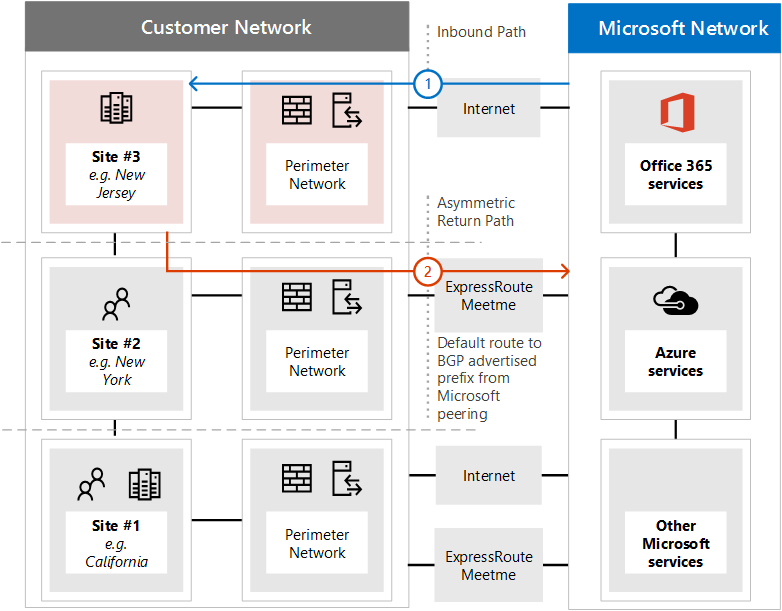
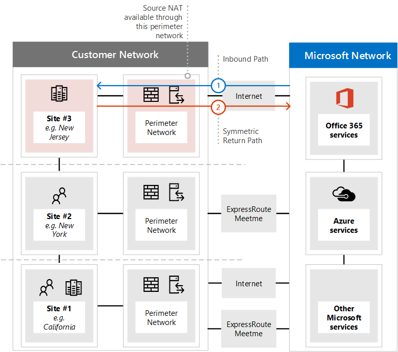

# <a name="implementing-expressroute-for-office-365"></a>Como implementar o ExpressRoute para o Office 365

*Esse artigo se aplica ao Microsoft 365 Enterprise e ao Office 365 Enterprise.*

O ExpressRoute para Office 365 fornece um caminho de roteamento alternativo para muitos serviços do Office 365 voltados para a Internet. A arquitetura do ExpressRoute para Office 365 se baseia em prefixos ip públicos de publicidade de serviços do Office 365 que já estão acessíveis pela Internet em seus circuitos do ExpressRoute provisionados para redistribuição subsequente desses prefixos IP para sua rede. Com o ExpressRoute, você efetivamente habilita vários caminhos de roteamento diferentes, por meio da Internet e por meio do ExpressRoute, para muitos serviços do Office 365. Esse estado de roteamento em sua rede pode representar uma alteração significativa em como sua topologia de rede interna foi projetada.
  
 **Status:** Guia completo v2
  
Você deve planejar cuidadosamente sua implementação do ExpressRoute para Office 365 para acomodar as complexidades de rede de ter o roteamento disponível por meio de um circuito dedicado com rotas injetadas em sua rede principal e na Internet. Se você e sua equipe não realizarem o planejamento e os testes detalhados neste guia, há um alto risco de você experimentar uma perda intermitente ou total de conectividade com os serviços do Office 365 quando o circuito do ExpressRoute estiver habilitado.
  
Para ter uma implementação bem-sucedida, você precisará analisar seus requisitos de infraestrutura, passar por uma avaliação e design de rede detalhados, planejar cuidadosamente a distribuição de maneira controlada e em estágios e criar um plano detalhado de validação e teste. Para um ambiente grande e distribuído, não é incomum ver implementações por vários meses. Este guia foi projetado para ajudá-lo a planejar com antecedência.
  
Grandes implantações bem-sucedidas podem levar seis meses de planejamento e geralmente incluem membros da equipe de muitas áreas da organização, incluindo administradores de rede, firewall e servidor proxy, administradores do Office 365, segurança, suporte ao usuário final, gerenciamento de projetos e apoio executivo. Seu investimento no processo de planejamento reduzirá a probabilidade de que você experimente falhas de implantação resultando em tempo de inatividade ou solução de problemas complexos e caros.
  
Esperamos que os pré-requisitos a seguir sejam concluídos antes do início deste guia de implementação.
  
1. Você concluiu uma avaliação de rede para determinar se o ExpressRoute é recomendado e aprovado.

2. Você selecionou um provedor de serviços de rede do ExpressRoute. Encontre detalhes sobre os [parceiros do ExpressRoute e locais de paring.](https://azure.microsoft.com/documentation/articles/expressroute-locations/)

3. Você já leu e compreendeu a documentação do [ExpressRoute](https://azure.microsoft.com/documentation/services/expressroute/) e sua rede interna é capaz de atender aos pré-requisitos do ExpressRoute de ponta a ponta.

4. Sua equipe leu todas as orientações públicas e documentação em , e viu a série de treinamento do [https://aka.ms/expressrouteoffice365](https://aka.ms/expressrouteoffice365) [https://aka.ms/ert](https://aka.ms/ert) [Azure ExpressRoute para Office 365](https://channel9.msdn.com/series/aer) no Canal 9 para obter uma compreensão de detalhes técnicos críticos, incluindo:

      - As dependências de Internet dos serviços SaaS.

      - Como evitar rotas assimétricas e lidar com roteamento complexo.

      - Como incorporar a segurança de perímetro, a disponibilidade e os controles no nível do aplicativo.

## <a name="begin-by-gathering-requirements"></a>Comece coletando requisitos
<a name="requirements"> </a>

Comece determinando quais recursos e serviços você planeja adotar em sua organização. Você precisa determinar quais recursos dos diferentes serviços do Office 365 serão usados e quais locais em sua rede hospedarão pessoas usando esses recursos. Com o catálogo de cenários, você precisa adicionar os atributos de rede que cada um desses cenários exige; como fluxos de tráfego de rede de entrada e saída e se os pontos de extremidade do Office 365 estão disponíveis pelo ExpressRoute ou não.
  
Para reunir os requisitos da sua organização:
  
- Cataloge o tráfego de rede de entrada e saída dos serviços do Office 365 que sua organização está usando. Consulte a página de intervalos de endereços IP e URLs do Office 365 para ver a descrição dos fluxos que diferentes cenários do Office 365 exigem.

- Reúna a documentação da topologia de rede existente mostrando detalhes de seu backbone e topologia da WAN interna, conectividade de sites via satélite, conectividade de usuário de última milha, roteamento para pontos de saída de perímetro de rede e serviços de proxy.

  - Identifique os pontos de extremidade do serviço de entrada nos diagramas de rede aos quais o Office 365 e outros serviços Microsoft se conectarão, mostrando os caminhos de conexão da Internet e do ExpressRoute propostos.

  - Identifique todos os locais de usuário geográfico e conectividade WAN entre locais, juntamente com quais locais atualmente têm uma saída para a Internet e quais locais são propostos para ter uma saída para um local de paring ExpressRoute.

  - Identifique todos os dispositivos de borda, como proxies, firewalls e assim por diante, e cataloge sua relação com fluxos que vão pela Internet e pelo ExpressRoute.

  - Documente se os usuários finais acessarão os serviços do Office 365 por meio de roteamento direto ou proxy de aplicativo indireto para fluxos da Internet e do ExpressRoute.

- Adicione o local do locatário e os locais do meet-me ao diagrama de rede.

- Es estimar as características esperadas e observadas de desempenho e latência da rede dos principais locais de usuários para o Office 365. Tenha em mente que o Office 365 é um conjunto global e distribuído de serviços e os usuários estarão se conectando a locais que podem ser diferentes do local de seu locatário. Por esse motivo, é recomendável medir e otimizar a latência entre o usuário e a borda mais próxima da rede global da Microsoft sobre conexões ExpressRoute e Internet. Você pode usar suas descobertas da avaliação de rede para auxiliar nessa tarefa.

- Listar os requisitos de segurança e alta disponibilidade da rede da empresa que precisam ser atendidos com a nova conexão do ExpressRoute. Por exemplo, como os usuários continuam a obter acesso ao Office 365 em caso de falha na saída da Internet ou do circuito expressRoute.

- Documente quais fluxos de rede de entrada e saída do Office 365 usarão o caminho da Internet e qual usará o ExpressRoute. As especificidades das localizações geográficas dos usuários e os detalhes da topologia de rede local podem exigir que o plano seja diferente de um local de usuário para outro.

### <a name="catalog-your-outbound-and-inbound-network-traffic"></a>Cataloge seu tráfego de rede de saída e de entrada
<a name="trafficCatalog"> </a>

Para minimizar o roteamento e outras complexidades de rede, recomendamos que você use apenas o ExpressRoute para o Office 365 para os fluxos de tráfego de rede necessários para passar por uma conexão dedicada devido a requisitos regulamentar ou como resultado da avaliação de rede. Além disso, recomendamos que você estande o escopo do roteamento expressRoute e a abordagem dos fluxos de tráfego de rede de saída e de entrada como estágios diferentes do projeto de implementação. Implantar o ExpressRoute para o Office 365 apenas para fluxos de tráfego de rede de saída iniciados pelo usuário e deixar fluxos de tráfego de rede de entrada pela Internet pode ajudar a controlar o aumento da complexidade e dos riscos de introduzir possibilidades adicionais de roteamento assimétrico.
  
Seu catálogo de tráfego de rede deve conter listagem de todas as conexões de rede de entrada e saída que você terá entre sua rede local e a Microsoft.
  
- Fluxos de tráfego de rede de saída são qualquer cenário em que uma conexão é iniciada a partir do seu ambiente local, como de clientes ou servidores internos, com um destino dos serviços Microsoft. Essas conexões podem ser diretas para o Office 365 ou indiretas, como quando a conexão passa por servidores proxy, firewalls ou outros dispositivos de rede no caminho para o Office 365.

- Fluxos de tráfego de rede de entrada são qualquer cenário em que uma conexão é iniciada da nuvem da Microsoft para um host local. Essas conexões geralmente precisam passar pelo firewall e por outra infraestrutura de segurança que a política de segurança do cliente exige para fluxos originados externamente.

Leia  a seção Garantindo a simetria de rota do artigo Roteamento com [ExpressRoute para Office 365](https://support.office.com/article/Routing-with-ExpressRoute-for-Office-365-e1da26c6-2d39-4379-af6f-4da213218408) para determinar quais serviços enviarão tráfego de entrada e procurar a coluna marcada **expressRoute para Office 365** no artigo de referência de pontos de extremidade do [Office 365](https://support.office.com/article/Office-365-URLs-and-IP-address-ranges-8548a211-3fe7-47cb-abb1-355ea5aa88a2) para determinar o restante das informações de conectividade.
  
Para cada serviço que requer uma conexão de saída, você precisará descrever a conectividade planejada para o serviço, incluindo roteamento de rede, configuração de proxy, inspeção de pacotes e necessidades de largura de banda.
  
Para cada serviço que requer uma conexão de entrada, você precisará de algumas informações adicionais. Os servidores na nuvem da Microsoft estabelecerão conexões com sua rede local. para garantir que as conexões sejam feitas corretamente, você vai querer descrever todos os aspectos dessa conectividade, incluindo; as entradas DNS públicas para os serviços que aceitarão essas conexões de entrada, os endereços IP IPv4 formatados cidr, que o equipamento ISP está envolvido e como NAT de entrada ou NAT de origem é tratado para essas conexões.
  
As conexões de entrada devem ser revisadas independentemente de se estão se conectando pela Internet ou pela Rota Expressa para garantir que o roteamento assimétrico não tenha sido introduzido. Em alguns casos, os pontos de extremidade locais aos quais os serviços do Office 365 iniciam conexões de entrada também podem precisar ser acessados por outros serviços da Microsoft e que não são da Microsoft. É fundamental que habilitar o roteamento ExpressRoute para esses serviços para fins do Office 365 não quebre outros cenários. Em muitos casos, os clientes talvez precisem implementar alterações específicas em sua rede interna, como NAT com base na fonte, para garantir que os fluxos de entrada da Microsoft permaneçam simétricos depois que o ExpressRoute for habilitado.
  
Aqui está um exemplo do nível de detalhe necessário. Nesse caso, o Exchange Híbrido seria roteado para o sistema local pela Rota Expressa.

|**Propriedade Connection**|**Valor**|
|:-----|:-----|
|**Direção do tráfego de rede** <br/> |Entrada  <br/> |
|**Serviço** <br/> |Exchange Híbrido  <br/> |
|**Ponto de extremidade público do Office 365 (origem)** <br/> |Exchange Online (endereços IP)  <br/> |
|**Ponto de extremidade local público (destino)** <br/> |5.5.5.5  <br/> |
|**Entrada DNS pública (Internet)** <br/> |Autodiscover.contoso.com  <br/> |
|**Esse ponto de extremidade local será usado por outros serviços Microsoft (que não sejam do Office 365)** <br/> |Não  <br/> |
|**Esse ponto de extremidade local será usado por usuários/sistemas na Internet** <br/> |Sim  <br/> |
|**Sistemas internos publicados por meio de pontos de extremidade públicos** <br/> |Função de acesso para cliente do Exchange Server (local) 192.168.101, 192.168.102, 192.168.103  <br/> |
|**Anúncio IP do ponto de extremidade público** <br/> |**Para a Internet**: 5.5.0.0/16  <br/> **Para o ExpressRoute**: 5.5.5.0/24  <br/> |
|**Controles de segurança/perímetro** <br/> |**Caminho da Internet**: DeviceID_002  <br/> **Caminho do ExpressRoute**: DeviceID_003  <br/> |
|**Alta Disponibilidade** <br/> |Ativo/Ativo em 2 com redundância geográfica  <br/> Circuitos expressRoute - Chicago e Dallas  <br/> |
|**Controle de simetria do caminho** <br/> |**Método**: NAT de origem  <br/> **Caminho da Internet:** conexões de entrada NAT de origem para 192.168.5.5  <br/> |**Caminho expressRoute:** conexões NAT de origem para 192.168.1.0 (Chicago) e 192.168.2.0 (Dallas)  <br/> |

Aqui está um exemplo de um serviço que é somente de saída:

|**Propriedade Connection**|**Valor**|
|:-----|:-----|
|**Direção do tráfego de rede** <br/> |Saída  <br/> |
|**Serviço** <br/> |SharePoint Online  <br/> |
|**Ponto de extremidade local (origem)** <br/> |Estação de trabalho do usuário  <br/> |
|**Ponto de extremidade público do Office 365 (destino)** <br/> |SharePoint Online (endereços IP)  <br/> |
|**Entrada DNS pública (Internet)** <br/> |\*.sharepoint.com (e FQDNs adicionais)  <br/> |
|**Indicações de CDN** <br/> |cdn.sharepointonline.com (e FQDNs adicionais) - endereços IP mantidos por provedores de CDN)  <br/> |
|**Anúncio IP e NAT em uso** <br/> |**Caminho da Internet/NAT de** origem: 1.1.1.0/24  <br/> **Caminho do ExpressRoute/NAT** de origem: 1.1.2.0/24 (Chicago) e 1.1.3.0/24 (Dallas)  <br/> |
|**Método de conectividade** <br/> |**Internet**: via proxy de camada 7 (arquivo .pac)  <br/> **ExpressRoute**: roteamento direto (sem proxy)  <br/> |
|**Controles de segurança/perímetro** <br/> |**Caminho da Internet**: DeviceID_002  <br/> **Caminho do ExpressRoute**: DeviceID_003  <br/> |
|**Alta Disponibilidade** <br/> |**Caminho da Internet**: saída redundante da Internet  <br/> **Caminho do ExpressRoute**: roteamento ativo/ativo de "hot routing" entre dois circuitos do ExpressRoute com redundância geográfica - Chicago e Dallas  <br/> |
|**Controle de simetria do caminho** <br/> |**Método**: NAT de origem para todas as conexões  <br/> |

### <a name="your-network-topology-design-with-regional-connectivity"></a>Seu design de topologia de rede com conectividade regional
<a name="topology"> </a>

Depois de entender os serviços e os fluxos de tráfego de rede associados, você pode criar um diagrama de rede que incorpore esses novos requisitos de conectividade e ilustra as alterações que você fará para usar o ExpressRoute para o Office 365. Seu diagrama deve incluir:
  
1. Todos os locais de usuários dos quais o Office 365 e outros serviços serão acessados.

2. Todos os pontos de saída da Internet e do ExpressRoute.

3. Todos os dispositivos de saída e de entrada que gerenciam a conectividade de entrada e saída da rede, incluindo roteadores, firewalls, servidores proxy de aplicativos e detecção/prevenção de intrusões.

4. Destinos internos de todo o tráfego de entrada, como servidores ADFS internos que aceitam conexões dos servidores proxy de aplicativo Web do ADFS.

5. Catálogo de todas as sub-redes IP que serão anunciadas

6. Identifique cada local de onde as pessoas acessarão o Office 365 e liste os locais do meet-me que serão usados para o ExpressRoute.

7. Locais e partes de sua topologia de rede interna, onde os prefixos IP da Microsoft aprendidas na Rota Expressa serão aceitos, filtrados e propagados.

8. A topologia de rede deve ilustrar a localização geográfica de cada segmento de rede e como ela se conecta à rede da Microsoft pela Rota Expressa e/ou pela Internet.

O diagrama abaixo mostra cada local de onde as pessoas usarão o Office 365 juntamente com os anúncios de roteamento de entrada e saída para o Office 365.
  

  
Para o tráfego de saída, as pessoas acessam o Office 365 de uma das três maneiras:
  
1. Por meio de um local meet-me na América do Norte para as pessoas da Califórnia.

2. Por meio de um local meet-me em Hong Kong para as pessoas em Hong Kong.

3. Pela Internet em Bangladesh, onde há menos pessoas e nenhum circuito ExpressRoute provisionado.


  
Da mesma forma, o tráfego de rede de entrada do Office 365 retorna de uma das três maneiras:
  
1. Por meio de um local meet-me na América do Norte para as pessoas da Califórnia.

2. Por meio de um local meet-me em Hong Kong para as pessoas em Hong Kong.

3. Pela Internet em Bangladesh, onde há menos pessoas e nenhum circuito ExpressRoute provisionado.


  
### <a name="determine-the-appropriate-meet-me-location"></a>Determinar o local apropriado do meet-me

A seleção de locais meet-me, que são o local físico onde o circuito expressroute conecta sua rede à rede da Microsoft, é influenciada pelos locais de onde as pessoas acessarão o Office 365. Como uma oferta de SaaS, o Office 365 não opera sob o modelo regional IaaS ou PaaS da mesma maneira que o Azure. Em vez disso, o Office 365 é um conjunto distribuído de serviços de colaboração, onde os usuários podem precisar se conectar aos pontos de extremidade em vários datacenters e regiões, que podem não estar necessariamente no mesmo local ou região onde o locatário do usuário está hospedado.
  
Isso significa que a consideração mais importante que você precisa fazer ao selecionar locais meet-me para o ExpressRoute para Office 365 é de onde as pessoas em sua organização estarão se conectando. A recomendação geral para a conectividade ideal do Office 365 é implementar o roteamento, para que as solicitações de usuário aos serviços do Office 365 sejam entregues na rede Da Microsoft pelo caminho de rede mais curto, isso também costuma ser chamado de roteamento "hot hot routing". Por exemplo, se a maioria dos usuários do Office 365 estiver em um ou dois locais, selecionar locais meet-me que estão mais próximos do local desses usuários criará o design ideal. Se sua empresa tiver grandes populações de usuários em muitas regiões diferentes, considere ter vários circuitos expressRoute e locais meet-me. Para alguns de seus locais de usuário, o caminho mais curto/ideal para a rede da Microsoft e o Office 365 pode não ser através de sua WAN interna e pontos de reunião do ExpressRoute, mas pela Internet.
  
Muitas vezes, há vários locais meet-me que podem ser selecionados dentro de uma região com proximidade relativa aos seus usuários. Preencha a tabela a seguir para orientar suas decisões.

|**Locais planejados de meet-me do ExpressRoute na Califórnia e em Nova York**||
|:-----|:-----|
|Localização  <br/> |Número de pessoas  <br/> |Latência esperada para a rede Microsoft pela saída da Internet  <br/> |Latência esperada para a rede da Microsoft pelo ExpressRoute  <br/> |
|Los Angeles  <br/> |10.000  <br/> |~15 ms  <br/> |~10 ms (via Silicon Valley)  <br/> |
|Washington DC  <br/> |15,000  <br/> |~20 ms  <br/> |~10 ms (via Nova York)  <br/> |
|Dallas  <br/> |5.000  <br/> |~15 ms  <br/> |~40 ms (via Nova York)  <br/> |

Depois que a arquitetura de rede global que mostra a região do Office 365, o provedor de serviços de rede ExpressRoute encontra-se com os locais e a quantidade de pessoas por local é desenvolvida, ela pode ser usada para identificar se alguma otimização pode ser feita. Ele também pode mostrar conexões de rede hairpin globais onde o tráfego é encaminhado para um local distante para obter o local meet-me. Se um hairpin na rede global for descoberto, ele deverá ser remediado antes de continuar. Encontre outro local meet-me ou use pontos de saída seletivos de quebra de Internet para evitar o hairpin.
  
O primeiro diagrama mostra um exemplo de um cliente com dois locais físicos na América do Norte. Você pode ver as informações sobre locais de escritório, locais de locatário do Office 365 e várias opções para locais do ExpressRoute meet-me. Neste exemplo, o cliente selecionou o local meet-me com base em dois princípios, na ordem:
  
1. Proximidade mais próxima com as pessoas em sua organização.

2. Mais próximo de um datacenter da Microsoft onde o Office 365 está hospedado.


  
Expandindo esse conceito um pouco mais, o segundo diagrama mostra um exemplo de cliente multinacional enfrentando informações semelhantes e tomada de decisões. Esse cliente tem um escritório pequeno em Bangladesh com apenas uma pequena equipe de dez pessoas focada em aumentar seu espaço na região. Há um local meet-me em Chennai e um datacenter da Microsoft com o Office 365 hospedado em Chennai para que um local meet-me faça sentido; No entanto, para dez pessoas, a despesa do circuito adicional é pesada. Ao olhar para sua rede, você precisará determinar se a latência envolvida no envio do tráfego de rede pela rede é mais eficaz do que gastar o capital para adquirir outro circuito do ExpressRoute.
  
Como alternativa, as dez pessoas em Bangladesh podem ter melhor desempenho com o tráfego de rede enviado pela Internet para a rede Microsoft do que seriam roteados em sua rede interna, conforme mostramos nos diagramas introdutórios e reproduzidos abaixo.
  

  
## <a name="create-your-expressroute-for-office-365-implementation-plan"></a>Criar seu Plano de Implementação do ExpressRoute para Office 365
<a name="implementation"> </a>

Seu plano de implementação deve abranger os detalhes técnicos da configuração do ExpressRoute, bem como os detalhes da configuração de toda a outra infraestrutura em sua rede, como a seguir.
  
- Planejar quais serviços são divididos entre o ExpressRoute e a Internet.

- Planeje largura de banda, segurança, alta disponibilidade e failover.

- Projetar o roteamento de entrada e saída, incluindo otimizações adequadas de caminho de roteamento para locais diferentes

- Decida até que ponto as rotas do ExpressRoute serão anunciadas em sua rede e qual é o mecanismo para os clientes selecionarem o caminho da Internet ou do ExpressRoute; por exemplo, roteamento direto ou proxy de aplicativo.

- Planejar alterações de registro DNS, incluindo [entradas do Sender Policy Framework.](https://technet.microsoft.com/library/dn789058%28v=exchg.150%29.aspx)

- Planejar a estratégia NAT, incluindo NAT de origem de saída e de entrada.

### <a name="plan-your-routing-with-both-internet-and-expressroute-network-paths"></a>Planejar seu roteamento com caminhos de rede da Internet e do ExpressRoute
<a name="paths"> </a>

- Para sua implantação inicial, todos os serviços de entrada, como email de entrada ou conectividade híbrida, são recomendados para usar a Internet.

- Planeje o roteamento de LAN do cliente final, como configurar um arquivo [PAC/WPAD, rota](https://aka.ms/manageo365endpoints)padrão, servidores proxy e anúncios de rota BGP.

- Planeje o roteamento de perímetro, incluindo servidores proxy, firewalls e proxies de nuvem.

### <a name="plan-your-bandwidth-security-high-availability-and-failover"></a>Planejar sua largura de banda, segurança, alta disponibilidade e failover
<a name="availability"> </a>

Crie um plano de largura de banda necessário para cada carga de trabalho principal do Office 365. Estimar separadamente os requisitos de largura de banda do Exchange Online, SharePoint Online e Skype for Business Online. Você pode usar as calculadoras de estimativa fornecidas para o Exchange Online e o Skype for Business como um ponto de partida; No entanto, um teste piloto com um exemplo representativo dos perfis de usuário e locais é necessário para compreender totalmente as necessidades de largura de banda da sua organização.
  
Adicione como a segurança é tratada em cada local de saída da Internet e do ExpressRoute ao seu plano, lembre-se de que todas as conexões do ExpressRoute com o Office 365 usam o peering público e ainda devem ser protegidas de acordo com as políticas de segurança da empresa de conexão com redes externas.
  
Adicione detalhes ao seu plano sobre quais pessoas serão afetadas pelo tipo de paralisação e como essas pessoas serão capazes de executar seu trabalho com capacidade total da maneira mais simples.
  
#### <a name="plan-bandwidth-requirements-including-skype-for-business-requirements-on-jitter-latency-congestion-and-headroom"></a>Planejar requisitos de largura de banda, incluindo os requisitos do Skype for Business sobre trem tremência, latência, congestionamento e headroom
  
O Skype for Business Online também tem requisitos de rede adicionais específicos, que são detalhados no artigo Qualidade de Mídia e Desempenho de Conectividade de [Rede no Skype for Business Online.](https://support.office.com/article/Media-Quality-and-Network-Connectivity-Performance-in-Skype-for-Business-Online-5fe3e01b-34cf-44e0-b897-b0b2a83f0917)
  
Leia a seção **Planejamento de largura de banda do Azure ExpressRoute** no planejamento de rede com o [ExpressRoute para Office 365.](https://support.office.com/article/Network-planning-with-ExpressRoute-for-Office-365-103208f1-e788-4601-aa45-504f896511cd)
  
Ao executar uma avaliação de largura de banda com seus usuários piloto, você pode usar nosso guia; [Ajuste de desempenho do Office 365 usando linhas de base e histórico de desempenho.](https://support.office.com/article/Office-365-performance-tuning-using-baselines-and-performance-history-1492cb94-bd62-43e6-b8d0-2a61ed88ebae)
  
#### <a name="plan-for-high-availability-requirements"></a>Planejar requisitos de alta disponibilidade
  
Crie um plano para alta disponibilidade para atender às suas necessidades e incorporá-lo ao diagrama atualizado da topologia de rede. Leia a seção **Alta disponibilidade e failover com o Azure ExpressRoute** no planejamento de rede com [o ExpressRoute para Office 365.](https://support.office.com/article/Network-planning-with-ExpressRoute-for-Office-365-103208f1-e788-4601-aa45-504f896511cd)
  
#### <a name="plan-for-network-security-requirements"></a>Planejar requisitos de segurança de rede
  
Crie um plano para atender aos seus requisitos de segurança de rede e incorpore-o ao diagrama atualizado da topologia de rede. Leia a seção Aplicando controles de segurança ao **Azure ExpressRoute para cenários do Office 365** no planejamento de rede com [o ExpressRoute para Office 365.](https://support.office.com/article/Network-planning-with-ExpressRoute-for-Office-365-103208f1-e788-4601-aa45-504f896511cd)
  
### <a name="design-outbound-service-connectivity"></a>Projetar conectividade do serviço de saída
<a name="outbound"> </a>

O ExpressRoute para Office 365 tem requisitos  *de*  rede de saída que podem ser desconhecidos. Especificamente, os endereços IP que representam seus usuários e redes para o Office 365 e atuam como pontos de extremidade de origem para conexões de rede de saída com a Microsoft devem seguir requisitos específicos descritos abaixo.
  
1. Os pontos de extremidade devem ser endereços IP públicos, que são registrados para sua empresa ou operadora que fornece conectividade ExpressRoute para você.

2. Os pontos de extremidade devem ser anunciados para a Microsoft e validados/aceitos pelo ExpressRoute.

3. Os pontos de extremidade não devem ser divulgados na Internet com a mesma ou mais métrica de roteamento preferencial.

4. Os pontos de extremidade não devem ser usados para conectividade com os serviços Microsoft que não estão configurados pelo ExpressRoute.

Se o design de rede não atender a esses requisitos, há um alto risco de que os usuários experimentem falhas de conectividade para o Office 365 e outros serviços Microsoft devido à rota de holing preto ou roteamento assimétrico. Isso ocorre quando as solicitações para os serviços Microsoft são roteadas pela Rota Expressa, mas as respostas são roteadas de volta pela Internet ou vice-versa, e as respostas são retiradas por dispositivos de rede com estado, como firewalls.
  
O método mais comum que você pode usar para atender aos requisitos acima é usar NAT de origem, implementado como parte de sua rede ou fornecido por sua operadora do ExpressRoute. O NAT de origem permite que você abstraa os detalhes e o endereçamento IP privado de sua rede de Internet do ExpressRoute e; juntamente com anúncios de rota IP apropriados, forneça um mecanismo fácil para garantir a simetria do caminho. Se você estiver usando dispositivos de rede com estado específicos para locais de pares do ExpressRoute, deverá implementar pools NAT separados para cada ponto do ExpressRoute para garantir a simetria do caminho.
  
Leia mais sobre os [requisitos de NAT do ExpressRoute.](https://azure.microsoft.com/documentation/articles/expressroute-nat/)
  
Adicione as alterações da conectividade de saída ao diagrama de topologia de rede.
  
### <a name="design-inbound-service-connectivity"></a>Projetar conectividade do serviço de entrada
<a name="inbound"> </a>

A maioria das implantações corporativas do Office 365 assume alguma forma de conectividade de entrada do Office 365 para serviços locais, como cenários híbridos do Exchange, SharePoint e Skype for Business, migrações de caixa de correio e autenticação usando a infraestrutura do ADFS. Quando o ExpressRoute habilita um caminho de roteamento adicional entre sua rede local e a Microsoft para conectividade de saída, essas conexões de entrada podem ser inadvertidamente impactadas pelo roteamento assimétrico, mesmo que você pretenda que esses fluxos continuem a usar a Internet. Algumas precauções descritas abaixo são recomendadas para garantir que não haja impacto nos fluxos de entrada baseados na Internet do Office 365 para sistemas locais.
  
Para minimizar os riscos de roteamento assimétrico para fluxos de tráfego de rede de entrada, todas as conexões de entrada devem usar NAT de origem antes que elas são roteadas para segmentos de sua rede que têm visibilidade de roteamento no ExpressRoute. Se as conexões de entrada são permitidas em um segmento de rede com visibilidade de roteamento no ExpressRoute sem NAT de origem, as solicitações provenientes do Office 365 entrarão pela Internet, mas a resposta que voltar para o Office 365 preferirá o caminho de rede do ExpressRoute de volta para a rede da Microsoft, causando roteamento assimétrico.
  
Você pode considerar um dos seguintes padrões de implementação para atender a esse requisito:
  
1. Execute NAT de origem antes que as solicitações sejam roteados para sua rede interna usando equipamentos de rede como firewalls ou balanceadores de carga no caminho da Internet para seus sistemas locais.

2. Certifique-se de que as rotas do ExpressRoute não sejam propagadas para os segmentos de rede onde residem os serviços de entrada, como servidores front-end ou sistemas de proxy reverso, que lidam com conexões com a Internet.

Contabilizar explicitamente esses cenários em sua rede e manter todos os fluxos de tráfego de rede de entrada pela Internet ajuda a minimizar a implantação e o risco operacional de roteamento assimétrico.
  
Pode haver casos em que você pode optar por direcionar alguns fluxos de entrada sobre conexões expressRoute. Para esses cenários, leve em consideração as considerações adicionais a seguir.
  
1. O Office 365 só pode direcionar pontos de extremidade locais que usam IPs públicos. Isso significa que, mesmo que o ponto de extremidade de entrada local seja exposto apenas ao Office 365 sobre o ExpressRoute, ele ainda precisa ter um IP público associado a ele.

2. Toda a resolução de nome DNS que os serviços do Office 365 executam para resolver pontos de extremidade locais ocorrem usando DNS público. Isso significa que você deve registrar o FQDN dos pontos de extremidade do serviço de entrada para mapeamentos IP na Internet.

3. Para receber conexões de rede de entrada pela Rota Expressa, as sub-redes IP públicas para esses pontos de extremidade devem ser anunciadas à Microsoft pela Rota Expressa.

4. Avalie cuidadosamente esses fluxos de tráfego de rede de entrada para garantir que os controles de rede e segurança adequados sejam aplicados a eles de acordo com a segurança da empresa e as políticas de rede.

5. Depois que seus pontos de extremidade de entrada locais são anunciados para a Microsoft sobre o ExpressRoute, o ExpressRoute efetivamente se tornará o caminho de roteamento preferencial para os pontos de extremidade de todos os serviços Microsoft, incluindo o Office 365. Isso significa que essas sub-redes de ponto de extremidade só devem ser usadas para comunicações com serviços do Office 365 e nenhum outro serviço na rede da Microsoft. Caso contrário, seu design causará roteamento assimétrico onde as conexões de entrada de outros serviços Microsoft preferem rotear a entrada sobre o ExpressRoute, enquanto o caminho de retorno usará a Internet.

6. Caso um circuito do ExpressRoute ou um local meet-me esteja inocatado, você precisará garantir que os pontos de extremidade de entrada locais ainda estão disponíveis para aceitar solicitações em um caminho de rede separado. Isso pode significar sub-redes de publicidade para esses pontos de extremidade por meio de vários circuitos expressRoute.

7. Recomendamos aplicar NAT de origem para todos os fluxos de tráfego de rede de entrada que entram em sua rede por meio do ExpressRoute, especialmente quando esses fluxos fluem entre dispositivos de rede com estado, como firewalls.

8. Alguns serviços locais, como proxy ADFS ou Descoberta Automática do Exchange, podem receber solicitações de entrada de serviços do Office 365 e usuários da Internet. Para essas solicitações, o Office 365 direcionará o mesmo FQDN que as solicitações de usuário pela Internet. Permitir conexões de entrada do usuário da Internet para os pontos de extremidade locais, forçando as conexões do Office 365 a usar o ExpressRoute, representa uma complexidade de roteamento significativa. Para a maioria dos clientes que implementam cenários complexos no ExpressRoute, não é recomendável devido a considerações operacionais. Essa sobrecarga adicional inclui o gerenciamento de riscos de roteamento assimétrico e exigirá que você gerencie cuidadosamente anúncios e políticas de roteamento em várias dimensões.

### <a name="update-your-network-topology-plan-to-show-how-you-would-avoid-asymmetric-routes"></a>Atualize seu plano de topologia de rede para mostrar como você evitaria rotas assimétricas
<a name="asymmetric"> </a>

Você deseja evitar o roteamento assimétrico para garantir que as pessoas em sua organização possam usar facilmente o Office 365, bem como outros serviços importantes na Internet. Há duas configurações comuns que os clientes têm que causam roteamento assimétrico. Agora é um bom momento para revisar a configuração de rede que você está planejando usar e verificar se um desses cenários de roteamento assimétrico pode existir.
  
Para começar, examinaremos algumas situações diferentes associadas ao diagrama de rede a seguir. Neste diagrama, todos os servidores que recebem solicitações de entrada, como a ADFS ou servidores híbridos locais, estão no data center de New Jersey e são anunciados na Internet.
  
1. Embora a rede de perímetro seja segura, não há NAT de origem disponível para solicitações de entrada.

2. Os servidores no data center de Nova Jersey podem ver as rotas da Internet e do ExpressRoute.


  
Também temos sugestões sobre como corrigi-las.
  
#### <a name="problem-1-cloud-to-on-premises-connection-over-the-internet"></a>Problema 1: Nuvem para conexão local pela Internet
  
O diagrama a seguir ilustra o caminho de rede assimétrico tomado quando sua configuração de rede não fornece NAT para solicitações de entrada da nuvem da Microsoft pela Internet.
  
1. A solicitação de entrada do Office 365 recupera o endereço IP do ponto de extremidade local do DNS público e envia a solicitação para sua rede de perímetro.

2. Nesta configuração com falha, não há NAT de origem configurado ou disponível na rede de perímetro para a qual o tráfego é enviado, resultando no endereço IP de origem real sendo usado como destino de retorno.

  - O servidor em sua rede encaminha o tráfego de retorno para o Office 365 por meio de qualquer conexão de rede disponível do ExpressRoute.

  - O resultado é um caminho assimétrico para esse fluxo para o Office 365, resultando em uma conexão interrompida.


  
##### <a name="solution-1a-source-nat"></a>Solução 1a: NAT de origem
  
Simplesmente adicionar um NAT de origem à solicitação de entrada resolve essa rede configurada incompatibilidade. Neste diagrama:
  
1. A solicitação de entrada continua a entrar pela rede de perímetro do data center de Nova York. Desta vez, NAT de origem está disponível.

2. A resposta do servidor é encaminhada de volta para o IP associado ao NAT de origem em vez do endereço IP original, resultando na resposta retornando ao longo do mesmo caminho de rede.


  
##### <a name="solution-1b-route-scoping"></a>Solução 1b: Roteamento de Roteamento
  
Como alternativa, você pode optar por não permitir que os prefixos BGP do ExpressRoute sejam anunciados, removendo o caminho de rede alternativo para esses computadores. Neste diagrama:
  
1. A solicitação de entrada continua a entrar pela rede de perímetro do data center de New Jersey. Desta vez, os prefixos anunciados pela Microsoft sobre o circuito ExpressRoute não estarão disponíveis para o data center de New Jersey.

2. A resposta do servidor é roteada de volta para o IP associado ao endereço IP original pela única rota disponível, resultando na resposta retornando ao longo do mesmo caminho de rede.


  
#### <a name="problem-2-cloud-to-on-premises-connection-over-expressroute"></a>Problema 2: Nuvem para conexão local via ExpressRoute
  
O diagrama a seguir ilustra o caminho de rede assimétrico tomado quando sua configuração de rede não fornece NAT para solicitações de entrada da nuvem da Microsoft sobre o ExpressRoute.
  
1. A solicitação de entrada do Office 365 recupera o endereço IP do DNS e envia a solicitação para sua rede de perímetro.

2. Nesta configuração com falha, não há NAT de origem configurado ou disponível na rede de perímetro para a qual o tráfego é enviado, resultando no endereço IP de origem real sendo usado como destino de retorno.

  - O computador em sua rede encaminha o tráfego de retorno para o Office 365 por meio de qualquer conexão de rede disponível do ExpressRoute.

  - O resultado é uma conexão assimétrica com o Office 365.


  
##### <a name="solution-2-source-nat"></a>Solução 2: NAT de origem
  
Simplesmente adicionar um NAT de origem à solicitação de entrada resolve essa rede configurada incompatibilidade. Neste diagrama:
  
1. A solicitação de entrada continua a entrar pela rede de perímetro do data center de Nova York. Desta vez, NAT de origem está disponível.

2. A resposta do servidor é encaminhada de volta para o IP associado ao NAT de origem em vez do endereço IP original, resultando na resposta retornando ao longo do mesmo caminho de rede.


  
### <a name="paper-verify-that-the-network-design-has-path-symmetry"></a>Paper verify that the network design has path symmetry

Neste ponto, você precisa verificar no papel se seu plano de implementação oferece simetria de rota para os diferentes cenários em que você estará usando o Office 365. Você identificará a rota de rede específica que deve ser tomada quando uma pessoa usar diferentes recursos do serviço. Da rede local e do roteamento WAN, para os dispositivos de perímetro, para o caminho de conectividade; ExpressRoute ou a Internet e a conexão com o ponto de extremidade online.
  
Você precisará fazer isso para todos os serviços de rede do Office 365 que foram identificados anteriormente como serviços que sua organização adotará.
  
Ele ajuda a fazer este documento passo a passo de rotas com uma segunda pessoa. Explique para eles de onde cada salto de rede deve obter sua próxima rota e certifique-se de que você está familiarizado com os caminhos de roteamento. Lembre-se de que o ExpressRoute sempre fornecerá uma rota mais com escopo para endereços IP do servidor microsoft, o que lhe dá um custo de rota menor do que uma rota padrão da Internet.
  
### <a name="design-client-connectivity-configuration"></a>Projetar a configuração de conectividade do cliente
<a name="asymmetric"> </a>


  
Se você estiver usando um servidor proxy para tráfego ligado à Internet, precisará ajustar qualquer arquivo de configuração do PAC ou cliente para garantir que os computadores cliente em sua rede sejam configurados corretamente para enviar o tráfego expressRoute desejado para o Office 365 sem transitar seu servidor proxy, e o tráfego restante, incluindo algum tráfego do Office 365, será enviado para o proxy relevante. Leia nosso guia sobre como [gerenciar pontos de extremidade do Office 365](https://aka.ms/manageo365endpoints) para exemplos de arquivos PAC.
  
> [!NOTE]
> Os pontos de extremidade mudam com frequência, com a frequência semanal. Você só deve fazer alterações com base nos serviços e recursos que sua organização adotou para reduzir o número de alterações que você precisará fazer para se manter atualizado. Preste muita atenção  à Data Efetiva no RSS feed onde as alterações são anunciadas e um registro é mantido de todas as alterações anteriores, os endereços IP anunciados podem não ser anunciados ou removidos do anúncio, até que a data efetiva seja atingida.
  
## <a name="build-your-deployment-and-testing-procedures"></a>Criar seus procedimentos de implantação e teste
<a name="testing"> </a>

Seu plano de implementação deve incluir testes e planejamento de replicação. Se sua implementação não estiver funcionando conforme o esperado, o plano deve ser projetado para afetar o menor número de pessoas antes que os problemas sejam descobertos. A seguir estão alguns princípios de alto nível que seu plano deve considerar.
  
1. Stage the network segment and user service onboarding to minimize disruption.

2. Planeje o teste de rotas com o traceroute e a conexão TCP de um host conectado à Internet separado.

3. De preferência, os testes de serviços de entrada e de saída devem ser feitos em uma rede de teste isolada com um locatário de teste do Office 365.

      - Como alternativa, os testes podem ser executados em uma rede de produção se o cliente ainda não estiver usando o Office 365 ou estiver no piloto.

      - Como alternativa, os testes podem ser executados durante uma paralisação de produção que é configurada apenas para teste e monitoramento.

      - Como alternativa, os testes podem ser feitos verificando as rotas de cada serviço em cada nó roteador de camada 3. Esse fall back só deve ser usado se nenhum outro teste for possível, pois a falta de testes físicos introduz risco.

### <a name="build-your-deployment-procedures"></a>Criar seus procedimentos de implantação

Seus procedimentos de implantação devem ser implantados em pequenos grupos de pessoas em estágios para permitir o teste antes da implantação em grupos maiores de pessoas. A seguir estão várias maneiras de estágio da implantação do ExpressRoute.
  
1. Configurar o ExpressRoute com o peering da Microsoft e ter os anúncios de rota encaminhados para um único host apenas para fins de teste em estágios.

2. Anunciar rotas para a rede do ExpressRoute para um único segmento de rede primeiro e expandir anúncios de rota por segmento de rede ou região.

3. Se estiver implantando o Office 365 pela primeira vez, use a implantação de rede do ExpressRoute como piloto para um pequeno número de pessoas.

4. Se estiver usando servidores proxy, você também pode configurar um arquivo PAC de teste para direcionar um pequeno número de pessoas para o ExpressRoute com testes e comentários antes de adicionar mais.

Seu plano de implementação deve listar cada um dos procedimentos de implantação que devem ser realizados ou comandos que precisam ser usados para implantar a configuração de rede. Quando o tempo de paralisação de rede chega, todas as alterações que estão sendo feitas devem ser do plano de implantação escrito que foi escrito com antecedência e analisado por pares. Consulte nossas diretrizes sobre a configuração técnica do ExpressRoute.
  
- Atualizando seus registros TXT SPF se você tiver alterado os endereços IP de todos os servidores locais que continuarão a enviar emails.

- Atualizando quaisquer entradas DNS para servidores locais se você tiver alterado endereços IP para acomodar uma nova configuração NAT.

- Certifique-se de que você se inscreveu no RSS feed para notificações de ponto de extremidade do Office 365 para manter qualquer configuração de roteamento ou proxy.

Depois que sua implantação do ExpressRoute for concluída, os procedimentos no plano de teste deverão ser executados. Os resultados de cada procedimento devem ser registrados. Você deve incluir procedimentos para reverter para o ambiente de produção original caso os resultados do plano de teste indiquem que a implementação não foi bem-sucedida.
  
### <a name="build-your-test-procedures"></a>Criar seus procedimentos de teste

Seus procedimentos de teste devem incluir testes para cada serviço de rede de saída e de entrada do Office 365 que usarão o ExpressRoute e aqueles que não usarão. Os procedimentos devem incluir testes de cada local de rede exclusivo, incluindo usuários que não estão no local na LAN corporativa.
  
Alguns exemplos de atividades de teste incluem o seguinte.
  
1. Ping do seu roteador local para o roteador da operadora de rede.

2. Valide se os mais de 500 anúncios de endereço IP do Office 365 e CRM Online são recebidos pelo seu roteador local.

3. Valide se o NAT de entrada e saída está operando entre o ExpressRoute e a rede interna.

4. Valide se as rotas para o NAT estão sendo anunciadas do seu roteador.

5. Valide se o ExpressRoute aceitou seus prefixos anunciados.

      - Use o seguinte cmdlet para verificar anúncios de pares:

      ```PowerShell
      Get-AzureRmExpressRouteCircuitRouteTable -DevicePath Primary -ExpressRouteCircuitName TestER -ResourceGroupName RG -PeeringType MicrosoftPeering
      ```

6. Valide se seu intervalo de IP NAT público não é anunciado para a Microsoft por meio de qualquer outro circuito de rede ExpressRoute ou internet pública, a menos que seja um subconjunto específico de um intervalo maior, como no exemplo anterior.

7. Os circuitos do ExpressRoute estão emparelhados, valide se ambas as sessões BGP estão em execução.

8. Configurar um único host dentro do NAT e usar ping, tracert e tcpping para testar a conectividade entre o novo circuito e o outlook.office365.com. Como alternativa, você pode usar uma ferramenta como o Wireshark ou o Microsoft Network Monitor 3.4 em uma porta espelhada para o MSEE para validar que é possível se conectar ao endereço IP associado ao outlook.office365.com.

9. Teste a funcionalidade no nível do aplicativo para o Exchange Online.

  - O Outlook de teste é capaz de se conectar ao Exchange Online e enviar/receber emails.

  - O Outlook de teste é capaz de usar o modo online.

  - Teste a conectividade do smartphone e a capacidade de envio/recebimento.

10. Testar a funcionalidade de nível de aplicativo para o SharePoint Online

  - Teste o cliente de sincronização do OneDrive for Business.

  - Teste o acesso à Web do SharePoint Online.

11. Teste a funcionalidade no nível do aplicativo para cenários de chamada do Skype for Business:

  - Ingressar na chamada em conferência como usuário autenticado [convite iniciado pelo usuário final].

  - Convidar usuário para chamada em conferência [convite enviado da MCU].

  - Participe da conferência como usuário anônimo usando o aplicativo Web do Skype for Business.

  - Participe da chamada da conexão do computador com fio, do telefone IP e do dispositivo móvel.

  - Chamada para usuário federado o Chamada para Validação PSTN: chamada concluída, qualidade da chamada aceitável, tempo de conexão aceitável.

  - Verifique se o status de presença dos contatos está atualizado para os membros do locatário e usuários federados.

### <a name="common-problems"></a>Problemas comuns

O roteamento assimétrico é o problema de implementação mais comum. Aqui estão algumas fontes comuns para procurar:
  
- Usar uma topologia de roteamento de rede simples ou aberta sem NAT de origem no local.

- Não usar o SNAT para rotear para serviços de entrada através das conexões da Internet e do ExpressRoute.

- Não testar serviços de entrada no ExpressRoute em uma rede de teste antes de implantar amplamente.

## <a name="deploying-expressroute-connectivity-through-your-network"></a>Implantando a conectividade do ExpressRoute por meio de sua rede
<a name="testing"> </a>

Stage your deployment to one segment of the network at a time, progressively rolling out the connectivity to different parts of the network with a plan to roll back for each new network segment. Se sua implantação estiver alinhada com uma implantação do Office 365, implante os usuários piloto do Office 365 primeiro e estenda a partir daí.
  
Primeiro para seu teste e, em seguida, para produção:
  
- Execute as etapas de implantação para habilitar o ExpressRoute.

- Teste se as rotas de rede estão como esperado.

- Execute testes em cada serviço de entrada e de saída.

- Reback if you discover any issues.

### <a name="set-up-a-test-connection-to-expressroute-with-a-test-network-segment"></a>Configurar uma conexão de teste para o ExpressRoute com um segmento de rede de teste

Agora que você tem o plano concluído no papel, é hora de testar em pequena escala. Neste teste, você estabelecerá uma única conexão do ExpressRoute com o Microsoft Peering para uma sub-rede de teste em sua rede local. Você pode configurar um locatário de avaliação do [Office 365](https://go.microsoft.com/fwlink/p/?LinkID=403802) com conectividade de e para a sub-rede de teste e incluir todos os serviços de saída e de entrada que você utilizará em produção na sub-rede de teste. Configurar o DNS para o segmento de rede de teste e estabelecer todos os serviços de entrada e de saída. Execute seu plano de teste e certifique-se de que você está familiarizado com o roteamento para cada serviço e a propagação da rota.
  
### <a name="execute-the-deployment-and-test-plans"></a>Executar os planos de implantação e teste

Conforme você conclui os itens descritos acima, verifique as áreas que você concluiu e certifique-se de que você e sua equipe as revisaram antes de executar seus planos de implantação e teste.
  
- Lista de serviços de saída e de entrada envolvidos na mudança de rede.

- Diagrama de arquitetura de rede global mostrando a saída da Internet e os locais meet-me do ExpressRoute.

- Diagrama de roteamento de rede demonstrando os diferentes caminhos de rede usados para cada serviço implantado.

- Um plano de implantação com etapas para implementar as alterações e a replicação, se necessário.

- Um plano de teste para testar cada serviço de rede e Office 365.

- Validação de papel concluída das rotas de produção para serviços de entrada e saída.

- Um teste concluído em um segmento de rede de teste, incluindo teste de disponibilidade.

Escolha uma janela de paralisação longa o suficiente para executar todo o plano de implantação e o plano de teste, tem algum tempo disponível para solução de problemas e tempo para reverter, se necessário.
  
> [!CAUTION]
> Devido à natureza complexa do roteamento pela Internet e pelo ExpressRoute, é recomendável que um tempo de buffer adicional seja adicionado a essa janela para lidar com a solução de problemas de roteamento complexo.
  
### <a name="configure-qos-for-skype-for-business-online"></a>Configurar qoS para o Skype for Business Online

A QoS é necessária para obter benefícios de voz e reunião para o Skype for Business Online. Você pode configurar a QoS depois de garantir que a conexão de rede do ExpressRoute não bloqueie nenhum outro acesso de serviço do Office 365. A configuração de QoS é descrita no artigo [ExpressRoute e QoS no Skype for Business Online.](https://support.office.com/article/ExpressRoute-and-QoS-in-Skype-for-Business-Online-20c654da-30ee-4e4f-a764-8b7d8844431d)
  
## <a name="troubleshooting-your-implementation"></a>Solução de problemas de sua implementação
<a name="troubleshooting"> </a>

O primeiro lugar a ser encontrado é nas etapas deste guia de implementação, que foram perdidas em seu plano de implementação? Volte e execute outros pequenos testes de rede, se possível, para replicar o erro e depurá-lo lá.
  
Identifique quais serviços de entrada ou de saída falharam durante o teste. Obter especificamente os endereços IP e sub-redes para cada um dos serviços que falharam. Vá em frente e ande pelo diagrama de topologia de rede no papel e valide o roteamento. Valide especificamente onde o roteamento do ExpressRoute é anunciado, teste esse roteamento durante a paralisação, se possível, com rastreamentos.
  
Execute o PSPing com um rastreamento de rede para cada ponto de extremidade do cliente e avalie os endereços IP de origem e destino para validar se eles são conforme o esperado. Execute telnet para qualquer host de email que você exponha na porta 25 e verifique se o SNAT está ocultando o endereço IP de origem original, se isso for esperado.
  
Lembre-se de que, ao implantar o Office 365 com uma conexão ExpressRoute, você precisará garantir que a configuração de rede do ExpressRoute foi projetada de forma ideal e você também otimizou os outros componentes em sua rede, como computadores cliente. Além de usar este guia de planejamento para solucionar problemas das etapas que você pode ter perdido, também escrevemos um plano de solução de problemas de desempenho para [o Office 365.](https://support.office.com/article/Performance-troubleshooting-plan-for-Office-365-e241e5d9-b1d8-4f1d-a5c8-4106b7325f8c)
  
Aqui está um link curto que você pode usar para voltar: [https://aka.ms/implementexpressroute365](https://aka.ms/implementexpressroute365)
  
## <a name="related-topics"></a>Tópicos Relacionados

[Avaliando a conectividade de rede do Office 365](assessing-network-connectivity.md)
  
[Microsoft Azure ExpressRoute para Office 365](azure-expressroute.md)
  
[Como gerenciar o ExpressRoute para a conectividade do Office 365](managing-expressroute-for-connectivity.md)
  
[Como rotear com o ExpressRoute para Office 365](routing-with-expressroute.md)
  
[Planejamento de rede com o ExpressRoute para Office 365](network-planning-with-expressroute.md)
  
[Usando comunidades BGP no ExpressRoute para cenários do Office 365](bgp-communities-in-expressroute.md)
  
[Qualidade da mídia e desempenho de conectividade de rede no Skype for Business Online](https://support.office.com/article/5fe3e01b-34cf-44e0-b897-b0b2a83f0917)
  
[Como otimizar a sua rede para o Skype for Business Online](https://support.office.com/article/b363bdca-b00d-4150-96c3-ec7eab5a8a43)
  
[ExpressRoute e QoS no Skype for Business Online](https://support.office.com/article/20c654da-30ee-4e4f-a764-8b7d8844431d)
  
[Fluxo de chamadas usando o ExpressRoute](https://support.office.com/article/413acb29-ad83-4393-9402-51d88e7561ab)
  
[Ajuste de desempenho do Office 365 usando linhas de base e histórico de desempenho](performance-tuning-using-baselines-and-history.md)
  
[Plano de solução de problemas de desempenho do Office 365](performance-troubleshooting-plan.md)
  
[URLs e intervalos de endereços IP do Office 365](https://support.office.com/article/8548a211-3fe7-47cb-abb1-355ea5aa88a2)
  
[Rede do Office 365 e ajuste de desempenho](network-planning-and-performance.md)
