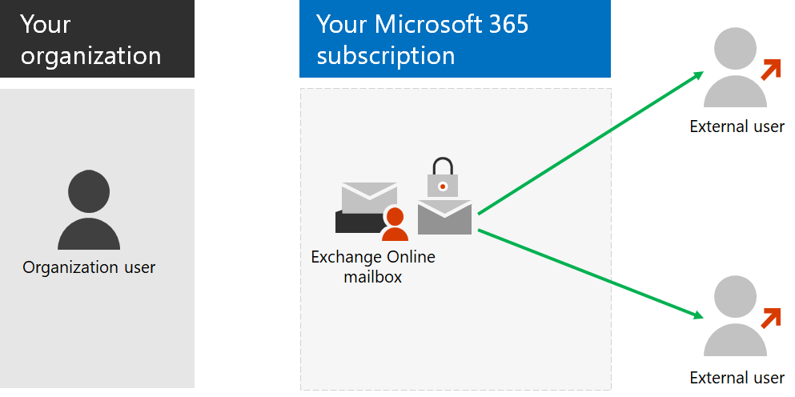

# Etapa 6: configurar a criptografia de emailStep 6: Configure email encryption

*Esta etapa é opcional e se aplica às versões E3 e E5 do Microsoft 365 Enterprise**This step is optional and applies to both the E3 and E5 versions of Microsoft 365 Enterprise*

Há três tipos de criptografia de email no Microsoft 365.There are three types of email encryption in Microsoft 365.

|||
|:-------|:-----|
| Criptografia de Mensagem do Office (OME)Office Message Encryption (OME) | Criptografia para email do Exchange Online enviado fora da sua organização.Encryption for Exchange Online email sent outside your organization. |
| Gerenciamento de Direitos de Informação (IRM)Information Rights Management (IRM) | Criptografia e permissões que trafegam com o email.Encryption and permissions that travel with the email. |
| S/MIME (Secure/Multipurpose Internet Mail Extensions)Secure/Multipurpose Internet Mail Extensions (S/MIME) | Proteção de email com criptografia e assinaturas digitais.Email protection with encryption and digital signatures. |
|||

## Criptografia de Mensagem do Office 365Office 365 Message Encryption

Com o OME, sua organização pode enviar e receber mensagens de email criptografadas entre pessoas dentro e fora da sua organização.With OME, your organization can send and receive encrypted email messages between people inside and outside your organization. O OME funciona com o Outlook.com, o Yahoo!, o Gmail e outros serviços de email.OME works with Outlook.com, Yahoo!, Gmail, and other email services. A criptografia de mensagens de email ajuda a garantir que apenas destinatários pretendidos possam exibir a mensagem.Email message encryption helps ensure that only intended recipients can view the message.

Você configura regras de transporte que definem as condições de criptografia.You set up transport rules that define the conditions for encryption. Quando um usuário envia uma mensagem que corresponde a uma regra, a criptografia é aplicada automaticamente.When a user sends a message that matches a rule, encryption is applied automatically.

Para exibir mensagens criptografadas, os destinatários podem obter uma senha de uso único, entrar com uma conta da Microsoft ou entrar com uma conta corporativa ou de estudante associada ao Microsoft 365.To view encrypted messages, recipients can either get a one-time passcode, sign in with a Microsoft account, or sign in with a work or school account associated with Microsoft 365. Os destinatários também podem enviar respostas criptografadas.Recipients can also send encrypted replies. Eles não precisam de sua própria assinatura do Microsoft 365 para exibir mensagens criptografadas ou enviar respostas criptografadas.They don't need their own Microsoft 365 subscription to view encrypted messages or send encrypted replies.

Para saber mais, veja [Criptografia de Mensagens do Office 365](https://docs.microsoft.com/Office365/SecurityCompliance/ome).For more information, see [Office 365 Message Encryption](https://docs.microsoft.com/Office365/SecurityCompliance/ome).

## IRMIRM

O IRM no Microsoft 365 ajuda você a proteger suas informações com criptografia adicional e aplicando uma política inteligente que especifica quem tem acesso ao que eles podem fazer.IRM in Microsoft 365 helps you secure your information with additional encryption and by applying an intelligent policy that specifies who has access what they can do. Para mensagens de email, você pode usar o IRM para criptografia e aplicar restrições de uso.For email messages, you can use IRM for encryption and to apply usage restrictions. Por exemplo, você pode especificar que alguns destinatários tenham todos os recursos para gerenciar o email e alguns não tenham a capacidade de imprimir ou encaminhar o email.For example, you can specify that some recipients have all abilities to manage the email and some do not have the ability to print or forward the email. 

As políticas de IRM são configuradas no Microsoft 365 e podem ser aplicadas a documentos no SharePoint Online e mensagens de email.IRM policies are configured within Microsoft 365 and can apply to documents in SharePoint Online and email messages. Um email protegido por IRM inclui as configurações de política aplicadas aplicadas e viajar com ela.An IRM-protected email includes the applied policy settings applied and travel with it. 

Quando o destinatário abre o email com a política incluída, as configurações de política são usadas para descriptografar a mensagem e determinar o que o destinatário pode fazer com ele.When the recipient opens the email with the included policy, the policy settings are used to decrypt the message and determine what the recipient can do with it. 

Confira mais informações em [Gerenciamento de Direitos de Informação no Exchange Online]( https://docs.microsoft.com/office365/SecurityCompliance/information-rights-management-in-exchange-online).For more information, see [Information Rights Management in Exchange Online]( https://docs.microsoft.com/office365/SecurityCompliance/information-rights-management-in-exchange-online).

## S/MIMES/MIME

O S/MIME é uma solução de proteção baseada em email digital baseada em certificado que permite criptografar e assinar digitalmente uma mensagem.S/MIME is a digital certificate-based email-based protection solution that allows you to both encrypt and digitally sign a message. A criptografia de mensagem ajuda a garantir que somente o destinatário pretendido poderá abrir e ler a mensagem.The message encryption helps ensure that only the intended recipient can open and read the message. Uma assinatura digital ajuda o destinatário a validar a identidade do remetente e a determinar que apenas o remetente poderia enviá-lo.A digital signature helps the recipient validate the identity of the sender and determine that only the sender could have sent it.

O S/MIME pode ser usado para emails para outras caixas de correio em sua assinatura do Microsoft 365 ou para usuários externos.S/MIME can be used for email to other mailboxes in your Microsoft 365 subscription or to external users.
Tanto a criptografia de mensagens quanto as assinaturas digitais são possibilitadas por meio do uso de certificados digitais que contenham as chaves pública e privada para criptografar ou descriptografar mensagens e criar e verificar assinaturas digitais.Both message encryption and digital signatures are made possible through the use of digital certificates that contain the public and private keys for encrypting or decrypting messages and creating and verifying digital signatures.
Para usar S/MIME, você deve ter as chaves públicas para cada destinatário.To use S/MIME, you must have the public keys for each recipient. Os destinatários mantêm suas próprias chaves privadas, o que deve permanecer seguro.Recipients maintain their own private keys, which must remain secure. Se sua chave privada estiver comprometida, você precisará obter um novo certificado digital e redistribuir as chaves públicas para todos os remetentes potenciais.If your private key is compromised, you need to get a new digital certificate and redistribute public keys to all potential senders.

Para obter mais informações, consulte [S/MIME para assinatura e criptografia de mensagens](https://docs.microsoft.com/Exchange/policy-and-compliance/smime).For more information, see [S/MIME for message signing and encryption](https://docs.microsoft.com/Exchange/policy-and-compliance/smime).

Como um ponto de verificação provisório, confira o [Critério de saída](infoprotect-exit-criteria.md#crit-infoprotect-step6) correspondente desta etapa.As an interim checkpoint, see the [exit criteria](infoprotect-exit-criteria.md#crit-infoprotect-step6) corresponding to this step.

## Próxima etapaNext step

|||
|:-------|:-----|
||[Configurar o gerenciamento de acesso privilegiado do Office 365Configure privileged access management for Office 365](infoprotect-configure-privileged-access-management.md)|
