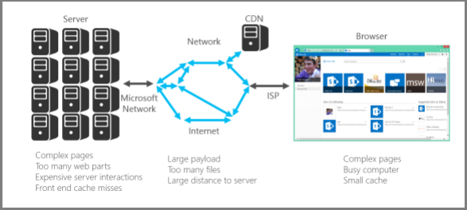

# Introdução ao ajuste de desempenho para o SharePoint Online

Este artigo explica quais aspectos específicos você precisa considerar ao projetar páginas para melhorar o desempenho no SharePoint Online.
     
## Métricas do SharePoint Online

As seguintes métricas amplas do SharePoint Online fornecem dados reais sobre desempenho:
  
- Como as páginas são carregadas rapidamente
    
- Quantas viagens de ida e volta são necessárias por página
    
- Problemas com o serviço
    
- Outras coisas que causam degradação do desempenho
    
### Conclusões alcançadas por causa dos dados

Os dados nos informam:
  
- A maioria das páginas tem um bom desempenho no SharePoint Online.
    
- Páginas não personalizadas carregam muito rapidamente.
    
- O OneDrive for Business, os sites de equipe e as páginas do sistema, _layouts, etc., são carregados rapidamente.
    
- O 1% mais lento de páginas do SharePoint Online leva mais de 5.000 milissegundos para ser carregado.
    
Um teste de parâmetro de comparação simples que você pode usar seria medir o desempenho comparando o tempo de carregamento do seu próprio portal com o tempo de carregamento da home page do OneDrive for Business, pois ele usa poucos recursos personalizados. Essa geralmente será a primeira etapa que o Suporte solicitará que você conclua ao solucionar problemas de desempenho de rede.
  
## Usar uma conta de usuário padrão ao verificar o desempenho

Um Administrador de Conjunto de Sites, Proprietário de Site, Editor ou Colaborador pertencem a grupos de segurança adicionais, têm permissões adicionais e, portanto, têm elementos adicionais que o SharePoint carrega em uma página.
  
Isso é aplicável ao SharePoint local e ao SharePoint Online, mas em um cenário local, as diferenças não serão notáveis tão facilmente quanto no SharePoint Online.
  
Para avaliar corretamente o desempenho de uma página para os usuários, você deve usar uma conta de usuário padrão para evitar carregar os controles de autoria e o tráfego adicional relacionado a grupos de segurança.
  
## Categorias de conexão para ajuste de desempenho

Você pode categorizar as conexões entre o servidor e o usuário em três componentes principais. Considere-os ao projetar páginas do SharePoint Online para informações sobre tempos de carregamento.
  
- **Servidor** Os servidores que a Microsoft hospeda em datacenters.
    
- **Rede** A rede da Microsoft, a Internet e sua rede local entre o datacenter e seus usuários.
    
- **Navegador** Onde a página é carregada.
    
Nessas três conexões, normalmente há cinco motivos que causam 95% de páginas lentas. Cada um desses motivos é discutido neste artigo:
  
- Problemas de navegação
    
- Roll up de conteúdo
    
- Arquivos grandes
    
- Muitas solicitações para o servidor
    
- Processamento de Web Part
    
### Conexão do servidor

Muitos dos problemas que afetam o desempenho com o SharePoint local também se aplicam ao SharePoint Online.
  
Como esperado, você tem muito mais controle sobre o desempenho dos servidores com o SharePoint local. Com o SharePoint Online, as coisas são um pouco diferentes. Quanto mais trabalho você faz um servidor, mais tempo leva para renderizar uma página. Com o SharePoint, o maior responsável por esse aspecto são as páginas complexas com várias Web Parts.
  
SharePoint Server local
  

  
SharePoint Online
  

  
Com o SharePoint Online, determinadas solicitações de página podem acabar chamando vários servidores. Você pode acabar com uma matriz de solicitações entre servidores para uma solicitação individual. Essas interações são caras de uma perspectiva de carregamento de página e tornarão as coisas lentas.
  
Exemplos dessas interações de servidor para servidor são:
  
- Web para SQL Servers
    
- Web para servidores de aplicativos
    
A outra coisa que pode diminuir a velocidade das interações do servidor são erros de cache. Ao contrário do SharePoint local, há uma chance muito grande de você atingir o mesmo servidor para uma página que você tenha visitado anteriormente; Isso torna o cache de objetos obsoleto.
  
### Conexão de rede

Com o SharePoint local que não usa uma WAN, você pode usar uma conexão de alta velocidade entre o datacenter e os usuários finais. Geralmente, as coisas são fáceis de gerenciar a partir de uma perspectiva de rede.
  
Com o SharePoint Online, há mais alguns fatores a considerar; por exemplo:
  
- A rede da Microsoft
    
- A Internet
    
- O ISP
    
Independentemente da versão do SharePoint (e de qual rede) você está usando, as coisas que normalmente fazem a rede estar ocupada incluem:
  
- Carga grande
    
- Muitos arquivos
    
- Distância física grande até o servidor
    
Um recurso que você pode aproveitar no SharePoint Online é a CDN da Microsoft (Rede de Distribuição de Conteúdo). Uma CDN é basicamente uma coleção distribuída de servidores implantados em vários datacenters. Com uma CDN, o conteúdo nas páginas pode ser hospedado em um servidor próximo ao cliente mesmo se o cliente estiver longe do SharePoint Server originado. A Microsoft estará usando isso mais no futuro para armazenar instâncias locais de páginas que não podem ser personalizadas, por exemplo, a home page do administrador do SharePoint Online. Para obter mais informações sobre CDNs, consulte [Redes de distribuição de conteúdo.](content-delivery-networks.md)
  
Algo que você precisa estar ciente, mas pode não ser capaz de fazer muito sobre a velocidade de conexão do seu ISP. Uma ferramenta de teste de velocidade simples dirá a velocidade da conexão.
  
### Conexão do navegador

Há alguns fatores a considerar com os navegadores da Web de uma perspectiva de desempenho.
  
A visita a páginas complexas afetará o desempenho. A maioria dos navegadores tem apenas um pequeno cache (cerca de 90 MB), enquanto a página da Web média é geralmente de cerca de 1,6 MB. Isso não leva muito tempo para ser usado.
  
A largura de banda também pode ser um problema. Por exemplo, se um usuário estiver assistindo a vídeos em outra sessão, isso afetará o desempenho da sua página do SharePoint. Embora você não possa impedir que os usuários streaming de mídia, você pode controlar a maneira como uma página será carregada para os usuários.
  
Confira os artigos a seguir para obter diferentes técnicas de personalização de página do SharePoint Online e outras práticas recomendadas para ajudá-lo a obter o desempenho ideal.
  
- [Opções de navegação para o SharePoint Online](navigation-options-for-sharepoint-online.md)
    
- [Usar a ferramenta Diagnóstico de Página para SharePoint Online](page-diagnostics-for-spo.md)
    
- [Otimização de imagem para o SharePoint Online](image-optimization-for-sharepoint-online.md)
    
- [Atraso no carregamento de imagens e JavaScript no SharePoint Online](delay-loading-images-and-javascript-in-sharepoint-online.md)
    
- [Minificação e agrupamento no SharePoint Online](minification-and-bundling-in-sharepoint-online.md)
    
- [Usar a Rede de Distribuição de Conteúdo (CDN) do Office 365 com o SharePoint Online](use-microsoft-365-cdn-with-spo.md)
    
- [Usar a Web Part de Pesquisa de Conteúdo em vez de Web Part de Consulta de Conteúdo para melhorar o desempenho no SharePoint Online](using-content-search-web-part-instead-of-content-query-web-part-to-improve-perfo.md)
    
- [Planejamento de capacidade e teste de carregamento do SharePoint Online](capacity-planning-and-load-testing-sharepoint-online.md)
    
- [Diagnóstico de problemas de desempenho no SharePoint Online](diagnosing-performance-issues-with-sharepoint-online.md)
    
- [Usando o cache de objetos com o SharePoint Online](using-the-object-cache-with-sharepoint-online.md)
    
- [Como evitar ficar limitado ou bloqueado no SharePoint Online](https://msdn.microsoft.com/library/office/dn889829.aspx)
    

