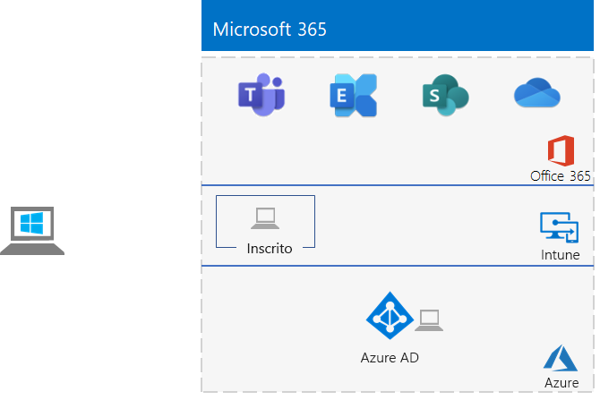

# <a name="the-lightweight-base-configuration"></a><span data-ttu-id="a34bb-103">A configuração de base leve</span><span class="sxs-lookup"><span data-stu-id="a34bb-103">The lightweight base configuration</span></span>

<span data-ttu-id="a34bb-104">*Este Guia de Laboratório de Teste pode ser usado para ambientes de teste do Microsoft 365 para empresas e do Office 365 Enterprise.*</span><span class="sxs-lookup"><span data-stu-id="a34bb-104">*This Test Lab Guide can be used for both Microsoft 365 for enterprise and Office 365 Enterprise test environments.*</span></span>

<span data-ttu-id="a34bb-105">Este artigo descreve como criar um ambiente simplificado com uma assinatura do Microsoft 365 E5 e um computador executando o Windows 10 Enterprise.</span><span class="sxs-lookup"><span data-stu-id="a34bb-105">This article describes how to create a simplified environment with a Microsoft 365 E5 subscription and a computer running Windows 10 Enterprise.</span></span>



<span data-ttu-id="a34bb-107">A criação de um ambiente de teste leve envolve cinco fases:</span><span class="sxs-lookup"><span data-stu-id="a34bb-107">Creating a lightweight test environment involves five phases:</span></span>
- [<span data-ttu-id="a34bb-108">Fase 1: Criar sua assinatura do Microsoft 365 E5</span><span class="sxs-lookup"><span data-stu-id="a34bb-108">Phase 1: Create your Microsoft 365 E5 subscription</span></span>](#phase-1-create-your-microsoft-365-e5-subscription)
- [<span data-ttu-id="a34bb-109">Fase 2: configurar a sua assinatura de avaliação do Office 365</span><span class="sxs-lookup"><span data-stu-id="a34bb-109">Phase 2: Configure your Office 365 trial subscription</span></span>](#phase-2-configure-your-office-365-trial-subscription)
- [<span data-ttu-id="a34bb-110">Fase 3: adicionar uma assinatura de avaliação do Microsoft 365 E5</span><span class="sxs-lookup"><span data-stu-id="a34bb-110">Phase 3: Add a Microsoft 365 E5 trial subscription</span></span>](#phase-3-add-a-microsoft-365-e5-trial-subscription)
- [<span data-ttu-id="a34bb-111">Fase 4: criar um computador com o Windows 10 Enterprise</span><span class="sxs-lookup"><span data-stu-id="a34bb-111">Phase 4: Create a Windows 10 Enterprise computer</span></span>](#phase-4-create-a-windows-10-enterprise-computer)
- [<span data-ttu-id="a34bb-112">Fase 5: adicionar o computador com Windows 10 no Azure AD</span><span class="sxs-lookup"><span data-stu-id="a34bb-112">Phase 5: Join your Windows 10 computer to Azure AD</span></span>](#phase-5-join-your-windows-10-computer-to-azure-ad)

<span data-ttu-id="a34bb-113">Use o ambiente resultante para testar os recursos e funcionalidades do [Microsoft 365 para empresas.](https://www.microsoft.com/microsoft-365/enterprise)</span><span class="sxs-lookup"><span data-stu-id="a34bb-113">Use the resulting environment to test the features and functionality of [Microsoft 365 for enterprise](https://www.microsoft.com/microsoft-365/enterprise).</span></span>


  
> [!TIP]
> <span data-ttu-id="a34bb-115">Para ver um mapa visual de todos os artigos da pilha de guias do laboratório de teste do Microsoft 365 para empresas, confira a pilha de guias do laboratório de teste [do Microsoft 365](../downloads/Microsoft365EnterpriseTLGStack.pdf)para empresas.</span><span class="sxs-lookup"><span data-stu-id="a34bb-115">For a visual map to all the articles in the Microsoft 365 for enterprise Test Lab Guide stack, see [Microsoft 365 for enterprise Test Lab Guide Stack](../downloads/Microsoft365EnterpriseTLGStack.pdf).</span></span>

>[!NOTE]
><span data-ttu-id="a34bb-116">Talvez você queira imprimir este artigo para registrar as informações específicas necessárias para esse ambiente pelos 30 dias da assinatura de avaliação do Office 365.</span><span class="sxs-lookup"><span data-stu-id="a34bb-116">You might want to print this article to record the specific information that you will need for this environment over the 30 days of the Office 365 trial subscription.</span></span> <span data-ttu-id="a34bb-117">É possível estender facilmente a assinatura de avaliação por mais 30 dias.</span><span class="sxs-lookup"><span data-stu-id="a34bb-117">You can easily extend the trail subscription for another 30 days.</span></span> <span data-ttu-id="a34bb-118">Para um ambiente de teste permanente, crie uma nova assinatura paga com um locatário do Azure AD separado e uma pequena quantidade de licenças.</span><span class="sxs-lookup"><span data-stu-id="a34bb-118">For a permanent test environment, create a new paid subscription with a separate Azure AD tenant and a small number of licenses.</span></span>

## <a name="phase-1-create-your-microsoft-365-e5-subscription"></a><span data-ttu-id="a34bb-119">Fase 1: Criar sua assinatura do Microsoft 365 E5</span><span class="sxs-lookup"><span data-stu-id="a34bb-119">Phase 1: Create your Microsoft 365 E5 subscription</span></span>

<span data-ttu-id="a34bb-120">Começamos com uma assinatura de avaliação do Microsoft 365 E5 e, em seguida, adicionamos a assinatura do Microsoft 365 E5 a ela.</span><span class="sxs-lookup"><span data-stu-id="a34bb-120">We start with an Microsoft 365 E5 trial subscription and then add the Microsoft 365 E5 subscription to it.</span></span>

>[!NOTE]
><span data-ttu-id="a34bb-121">Recomendamos que você crie uma assinatura de avaliação do Office 365 para que seu ambiente de teste tenha um locatário separado do Azure AD de qualquer assinatura paga que você tenha no momento.</span><span class="sxs-lookup"><span data-stu-id="a34bb-121">We recommend that you create a trial subscription of Office 365 so that your test environment has a separate Azure AD tenant from any paid subscriptions you currently have.</span></span> <span data-ttu-id="a34bb-122">Essa separação significa que você pode adicionar e remover usuários e grupos no locatário de teste sem afetar suas assinaturas de produção.</span><span class="sxs-lookup"><span data-stu-id="a34bb-122">This separation means that you can add and remove users and groups in the test tenant without affecting your production subscriptions.</span></span>

<span data-ttu-id="a34bb-123">Para começar a usar a sua assinatura de avaliação do Microsoft 365 E5, primeiro é necessário um nome de empresa fictícia e uma nova conta da Microsoft.</span><span class="sxs-lookup"><span data-stu-id="a34bb-123">To start your Microsoft 365 E5 trial subscription, you first need a fictitious company name and a new Microsoft account.</span></span>
  
1. <span data-ttu-id="a34bb-p103">Recomendamos que você use uma variante do nome de empresa Contoso para o nome da sua empresa, que é uma empresa fictícia usada no conteúdo de exemplo da Microsoft, mas não é necessário. Registre o seu nome de empresa fictícia aqui:</span><span class="sxs-lookup"><span data-stu-id="a34bb-p103">We recommend that you use a variant of the company name Contoso for your company name, which is a fictitious company used in Microsoft sample content, but it isn't required. Record your fictitious company name here:</span></span> 
    
2. <span data-ttu-id="a34bb-p104">Para se inscrever em uma nova conta da Microsoft, acesse [https://outlook.com](https://outlook.com) e crie uma conta com um novo endereço e conta de email. Você usará essa conta para se inscrever no Office 365.</span><span class="sxs-lookup"><span data-stu-id="a34bb-p104">To sign up for a new Microsoft account, go to [https://outlook.com](https://outlook.com) and create an account with a new email account and address. You will use this account to sign up for Office 365.</span></span>
    
    - <span data-ttu-id="a34bb-129">Armazene o nome e sobrenome da sua nova conta aqui:</span><span class="sxs-lookup"><span data-stu-id="a34bb-129">Record the first and last name of your new account here:</span></span> 
    
    - <span data-ttu-id="a34bb-131">Armazene o novo endereço da conta de email aqui: </span><span class="sxs-lookup"><span data-stu-id="a34bb-131">Record the new email account address here:</span></span> <span data-ttu-id="a34bb-133">@outlook.com</span><span class="sxs-lookup"><span data-stu-id="a34bb-133">@outlook.com</span></span>
    
### <a name="sign-up-for-an-office-365-e5-trial-subscription"></a><span data-ttu-id="a34bb-134">Inscrever-se em uma assinatura de avaliação do Office 365 E5</span><span class="sxs-lookup"><span data-stu-id="a34bb-134">Sign up for an Office 365 E5 trial subscription</span></span>

1. <span data-ttu-id="a34bb-135">No navegador, vá [https://aka.ms/e5trial](https://aka.ms/e5trial) para.</span><span class="sxs-lookup"><span data-stu-id="a34bb-135">In your browser, go to [https://aka.ms/e5trial](https://aka.ms/e5trial).</span></span>
    
2. <span data-ttu-id="a34bb-136">Na etapa 1 da página Obrigado por escolher a página **do Office 365 E5,** insira seu novo endereço de conta de email.</span><span class="sxs-lookup"><span data-stu-id="a34bb-136">In step 1 of the **Thank you for choosing Office 365 E5** page, enter your new email account address.</span></span>
3. <span data-ttu-id="a34bb-137">Na etapa 2 do processo de assinatura de trilha, insira as informações solicitadas e execute a verificação.</span><span class="sxs-lookup"><span data-stu-id="a34bb-137">In step 2 of the trail subscription process, enter the requested information, and then perform the verification.</span></span>
4. <span data-ttu-id="a34bb-138">Na etapa 3, insira um nome de organização e, em seguida, um nome de conta que será o administrador global da assinatura.</span><span class="sxs-lookup"><span data-stu-id="a34bb-138">In step 3, enter an organization name and then an account name that will be the global admin for the subscription.</span></span>
5. <span data-ttu-id="a34bb-139">Para a etapa 4, armazene a URL da página de entrada aqui (selecione e copie): </span><span class="sxs-lookup"><span data-stu-id="a34bb-139">For step 4, record the sign-in page here (select and copy):</span></span> 
6. <span data-ttu-id="a34bb-141">Armazene a ID de usuário aqui: .onmicrosoft.com</span><span class="sxs-lookup"><span data-stu-id="a34bb-141">Record the user ID here: .onmicrosoft.com</span></span>  
   <span data-ttu-id="a34bb-142">Grave a senha inserida em um local seguro.</span><span class="sxs-lookup"><span data-stu-id="a34bb-142">Record the password that you entered in a secure location.</span></span>
   <span data-ttu-id="a34bb-143">Esse valor será chamado de **nome do administrador global**.</span><span class="sxs-lookup"><span data-stu-id="a34bb-143">This value will be referred to as the **global administrator name**.</span></span>
7. <span data-ttu-id="a34bb-144">Selecione **Ir para a Instalação.**</span><span class="sxs-lookup"><span data-stu-id="a34bb-144">Select **Go to Setup**.</span></span>
8. <span data-ttu-id="a34bb-145">Na Instalação do Office 365 E5, selecione Continuar usando o **.onmicrosoft.com** da sua organização para email e entrar e, em seguida, selecione Sair e **continuar mais tarde.**</span><span class="sxs-lookup"><span data-stu-id="a34bb-145">In Office 365 E5 Setup, select **Continue using *your organization*.onmicrosoft.com for email and signing in**, and then select **Exit and continue later**.</span></span>

<span data-ttu-id="a34bb-146">Você deve ver o centro de administração do Microsoft 365.</span><span class="sxs-lookup"><span data-stu-id="a34bb-146">You should see the Microsoft 365 admin center.</span></span>
    
## <a name="phase-2-configure-your-office-365-trial-subscription"></a><span data-ttu-id="a34bb-147">Fase 2: configurar a sua assinatura de avaliação do Office 365</span><span class="sxs-lookup"><span data-stu-id="a34bb-147">Phase 2: Configure your Office 365 trial subscription</span></span>

<span data-ttu-id="a34bb-148">Nesta fase, você configurará a sua assinatura com outros usuários, atribuindo a eles licenças do Office 365 E5.</span><span class="sxs-lookup"><span data-stu-id="a34bb-148">In this phase, you configure your subscription with additional users and assign them Office 365 E5 licenses.</span></span>
  
<span data-ttu-id="a34bb-149">Para se conectar à sua assinatura com o módulo Azure Active Directory PowerShell para Graph do seu computador, use as instruções em Conectar-se ao [Microsoft 365 com o PowerShell.](connect-to-microsoft-365-powershell.md#connect-with-the-azure-active-directory-powershell-for-graph-module)</span><span class="sxs-lookup"><span data-stu-id="a34bb-149">To connect to your subscription with the Azure Active Directory PowerShell for Graph module from your computer, use the instructions in [Connect to Microsoft 365 with PowerShell](connect-to-microsoft-365-powershell.md#connect-with-the-azure-active-directory-powershell-for-graph-module).</span></span>
    
<span data-ttu-id="a34bb-150">Na caixa de diálogo Solicitação de Credencial do **Windows PowerShell,** digite o nome do administrador global (por exemplo, *jdoe@contosotoycompany.onmicrosoft.com)* e senha.</span><span class="sxs-lookup"><span data-stu-id="a34bb-150">In the **Windows PowerShell Credential Request** dialog box, enter the global administrator name (for example, *jdoe@contosotoycompany.onmicrosoft.com*) and password.</span></span>
  
<span data-ttu-id="a34bb-151">Preencha o nome da sua organização (por exemplo, *contosotoycompany*), o código de país de dois caracteres do seu local, uma senha de conta comum e execute os seguintes comandos no prompt do PowerShell:</span><span class="sxs-lookup"><span data-stu-id="a34bb-151">Fill in your organization name (for example, *contosotoycompany*), the two-character country code for your location, a common account password, and then run the following commands from the PowerShell prompt:</span></span>

```powershell
$orgName="<organization name>"
$loc="<two-character country code, such as US>"
$commonPW="<common user account password>"
$PasswordProfile=New-Object -TypeName Microsoft.Open.AzureAD.Model.PasswordProfile
$PasswordProfile.Password=$commonPW

$userUPN= "user2@" + $orgName + ".onmicrosoft.com"
New-AzureADUser -DisplayName "User 2" -GivenName User -SurName 2 -UserPrincipalName $userUPN -UsageLocation $loc -AccountEnabled $true -PasswordProfile $PasswordProfile -MailNickName "user2"
$License = New-Object -TypeName Microsoft.Open.AzureAD.Model.AssignedLicense
$License.SkuId = (Get-AzureADSubscribedSku | Where-Object -Property SkuPartNumber -Value "ENTERPRISEPREMIUM" -EQ).SkuID
$LicensesToAssign = New-Object -TypeName Microsoft.Open.AzureAD.Model.AssignedLicenses
$LicensesToAssign.AddLicenses = $License
Set-AzureADUserLicense -ObjectId $userUPN -AssignedLicenses $LicensesToAssign

$userUPN= "user3@" + $orgName + ".onmicrosoft.com"
New-AzureADUser -DisplayName "User 3" -GivenName User -SurName 3 -UserPrincipalName $userUPN -UsageLocation $loc -AccountEnabled $true -PasswordProfile $PasswordProfile -MailNickName "user3"
$License = New-Object -TypeName Microsoft.Open.AzureAD.Model.AssignedLicense
$License.SkuId = (Get-AzureADSubscribedSku | Where-Object -Property SkuPartNumber -Value "ENTERPRISEPREMIUM" -EQ).SkuID
$LicensesToAssign = New-Object -TypeName Microsoft.Open.AzureAD.Model.AssignedLicenses
$LicensesToAssign.AddLicenses = $License
Set-AzureADUserLicense -ObjectId $userUPN -AssignedLicenses $LicensesToAssign

$userUPN= "user4@" + $orgName + ".onmicrosoft.com"
New-AzureADUser -DisplayName "User 4" -GivenName User -SurName 4 -UserPrincipalName $userUPN -UsageLocation $loc -AccountEnabled $true -PasswordProfile $PasswordProfile -MailNickName "user4"
$License = New-Object -TypeName Microsoft.Open.AzureAD.Model.AssignedLicense
$License.SkuId = (Get-AzureADSubscribedSku | Where-Object -Property SkuPartNumber -Value "ENTERPRISEPREMIUM" -EQ).SkuID
$LicensesToAssign = New-Object -TypeName Microsoft.Open.AzureAD.Model.AssignedLicenses
$LicensesToAssign.AddLicenses = $License
Set-AzureADUserLicense -ObjectId $userUPN -AssignedLicenses $LicensesToAssign
```
> [!NOTE]
> <span data-ttu-id="a34bb-152">O uso de uma senha comum aqui é para a automação e facilidade de configuração para um ambiente de teste.</span><span class="sxs-lookup"><span data-stu-id="a34bb-152">The use of a common password here is for automation and ease of configuration for a test environment.</span></span> <span data-ttu-id="a34bb-153">Obviamente, isso é recomendado para assinaturas de produção.</span><span class="sxs-lookup"><span data-stu-id="a34bb-153">Obviously, this is highly discouraged for production subscriptions.</span></span> 

### <a name="record-key-information-for-future-reference"></a><span data-ttu-id="a34bb-154">Registrar principais informações para referência futura</span><span class="sxs-lookup"><span data-stu-id="a34bb-154">Record key information for future reference</span></span>

<span data-ttu-id="a34bb-155">Se você ainda não tiver registrado esses valores, grave-os agora:</span><span class="sxs-lookup"><span data-stu-id="a34bb-155">If you haven't already recorded these values, record them now:</span></span>
  
- <span data-ttu-id="a34bb-156">Nome do administrador global:</span><span class="sxs-lookup"><span data-stu-id="a34bb-156">Global administrator name:</span></span> <span data-ttu-id="a34bb-158">onmicrosoft.com (na etapa 6 da Fase 1)</span><span class="sxs-lookup"><span data-stu-id="a34bb-158">.onmicrosoft.com (from step 6 of Phase 1)</span></span>
    
    <span data-ttu-id="a34bb-159">Também armazene a senha dessa conta em um local seguro.</span><span class="sxs-lookup"><span data-stu-id="a34bb-159">Also record the password for this account in a secure location.</span></span>
    
- <span data-ttu-id="a34bb-160">Nome da sua organização de assinatura de avaliação: </span><span class="sxs-lookup"><span data-stu-id="a34bb-160">Your trial subscription organization name:</span></span>  <span data-ttu-id="a34bb-162">(na etapa 4 da Fase 1)</span><span class="sxs-lookup"><span data-stu-id="a34bb-162">(from step 4 of Phase 1)</span></span>
    
- <span data-ttu-id="a34bb-163">Para listar as contas do usuário 2, Usuário 3, Usuário 4 e Usuário 5, execute o seguinte comando no prompt do Módulo do Windows Azure Active Directory para Windows PowerShell:</span><span class="sxs-lookup"><span data-stu-id="a34bb-163">To list the accounts for User 2, User 3, User 4, and User 5, run the following command from the Windows Azure Active Directory Module for Windows PowerShell prompt:</span></span>
    
  ```powershell
  Get-AzureADUser | Sort UserPrincipalName | Select UserPrincipalName
  ```

    <span data-ttu-id="a34bb-164">Armazene os nomes de contas aqui:</span><span class="sxs-lookup"><span data-stu-id="a34bb-164">Record the account names here:</span></span>
    
  - <span data-ttu-id="a34bb-165">Nome da conta do usuário 2: usuário2@</span><span class="sxs-lookup"><span data-stu-id="a34bb-165">User 2 account name: user2@</span></span><span data-ttu-id="a34bb-167">.onmicrosoft.com</span><span class="sxs-lookup"><span data-stu-id="a34bb-167">.onmicrosoft.com</span></span>
    
  - <span data-ttu-id="a34bb-168">Nome da conta do usuário 3: usuário3@</span><span class="sxs-lookup"><span data-stu-id="a34bb-168">User 3 account name: user3@</span></span><span data-ttu-id="a34bb-170">.onmicrosoft.com</span><span class="sxs-lookup"><span data-stu-id="a34bb-170">.onmicrosoft.com</span></span>
    
  - <span data-ttu-id="a34bb-171">Nome da conta do usuário 4: usuário4@</span><span class="sxs-lookup"><span data-stu-id="a34bb-171">User 4 account name: user4@</span></span><span data-ttu-id="a34bb-173">.onmicrosoft.com</span><span class="sxs-lookup"><span data-stu-id="a34bb-173">.onmicrosoft.com</span></span>
    
  - <span data-ttu-id="a34bb-174">Nome da conta do usuário 5: usuário5@</span><span class="sxs-lookup"><span data-stu-id="a34bb-174">User 5 account name: user5@</span></span><span data-ttu-id="a34bb-176">.onmicrosoft.com</span><span class="sxs-lookup"><span data-stu-id="a34bb-176">.onmicrosoft.com</span></span>
    
    <span data-ttu-id="a34bb-177">Também registre a senha em comum dessas contas em um local seguro.</span><span class="sxs-lookup"><span data-stu-id="a34bb-177">Also record the common password for these accounts in a secure location.</span></span>
   
### <a name="using-an-office-365-test-environment"></a><span data-ttu-id="a34bb-178">Usando um ambiente de teste do Office 365</span><span class="sxs-lookup"><span data-stu-id="a34bb-178">Using an Office 365 test environment</span></span>

<span data-ttu-id="a34bb-179">Se você precisar apenas de um ambiente de teste do Office 365, não precisará ler o restante deste artigo.</span><span class="sxs-lookup"><span data-stu-id="a34bb-179">If you need only an Office 365 test environment, you do not need to read the rest of this article.</span></span>

<span data-ttu-id="a34bb-180">Para obter guias de laboratório de teste adicionais que se aplicam ao Office 365 e ao Microsoft 365, confira Os Guias do Laboratório de Teste [do Microsoft 365](m365-enterprise-test-lab-guides.md)para empresas.</span><span class="sxs-lookup"><span data-stu-id="a34bb-180">For additional Test Lab Guides that apply to both Office 365 and Microsoft 365, see [Microsoft 365 for enterprise Test Lab Guides](m365-enterprise-test-lab-guides.md).</span></span>
  
## <a name="phase-3-add-a-microsoft-365-e5-trial-subscription"></a><span data-ttu-id="a34bb-181">Fase 3: adicionar uma assinatura de avaliação do Microsoft 365 E5</span><span class="sxs-lookup"><span data-stu-id="a34bb-181">Phase 3: Add a Microsoft 365 E5 trial subscription</span></span>

<span data-ttu-id="a34bb-182">Nesta fase, inscreva-se para a assinatura de avaliação do Microsoft 365 E5 e adicione-a à mesma organização de sua assinatura de avaliação do Office 365 E5.</span><span class="sxs-lookup"><span data-stu-id="a34bb-182">In this phase, you sign up for the Microsoft 365 E5 trial subscription and add it to the same organization as your Office 365 E5 trial subscription.</span></span>
  
<span data-ttu-id="a34bb-183">Primeiro, adicione a assinatura de avaliação do Microsoft 365 E5 e atribua a nova licença do Microsoft 365 à sua conta de administrador global.</span><span class="sxs-lookup"><span data-stu-id="a34bb-183">First, add the Microsoft 365 E5 trial subscription and assign the new Microsoft 365 license to your global administrator account.</span></span>
  
1. <span data-ttu-id="a34bb-184">Em uma janela privada do navegador da Internet, use suas credenciais de conta de administrador global para entrar no Centro de administração do Microsoft 365 em [https://admin.microsoft.com](https://admin.microsoft.com) .</span><span class="sxs-lookup"><span data-stu-id="a34bb-184">In an internet browser private window, use your global administrator account credentials to sign in to the Microsoft 365 admin center at [https://admin.microsoft.com](https://admin.microsoft.com).</span></span>
    
2. <span data-ttu-id="a34bb-185">Na página do Centro de administração do **Microsoft 365,** na navegação à esquerda, selecione Cobrança **> serviços de compra.**</span><span class="sxs-lookup"><span data-stu-id="a34bb-185">On the **Microsoft 365 admin center** page, in the left navigation, select **Billing > Purchase services**.</span></span>
    
3. <span data-ttu-id="a34bb-186">Na página **Comprar serviços,** selecione **Microsoft 365 E5** e, em seguida, selecione **Obter avaliação gratuita.**</span><span class="sxs-lookup"><span data-stu-id="a34bb-186">On the **Purchase services** page, select **Microsoft 365 E5**, and then select **Get free trial**.</span></span>

4. <span data-ttu-id="a34bb-187">Na página de avaliação do **Microsoft 365 E5,** decida receber uma mensagem de texto ou uma chamada telefônica, insira seu número de telefone e selecione **Text me** or **Call me**.</span><span class="sxs-lookup"><span data-stu-id="a34bb-187">On the **Microsoft 365 E5 Trial** page, decide to receive a text message or a phone call, enter your phone number, and then select **Text me** or **Call me**.</span></span> <span data-ttu-id="a34bb-188">Execute a verificação.</span><span class="sxs-lookup"><span data-stu-id="a34bb-188">Perform the verification.</span></span>

5. <span data-ttu-id="a34bb-189">Na página **Confirmar seu pedido,** selecione **Experimentar agora.**</span><span class="sxs-lookup"><span data-stu-id="a34bb-189">On the **Confirm your order** page, select **Try now**.</span></span>

6. <span data-ttu-id="a34bb-190">Na página **Recibo do pedido,** selecione **Continuar**.</span><span class="sxs-lookup"><span data-stu-id="a34bb-190">On the **Order receipt** page, select **Continue**.</span></span>

7. <span data-ttu-id="a34bb-191">No centro de administração do Microsoft 365, selecione **Usuários > Usuários ativos.**</span><span class="sxs-lookup"><span data-stu-id="a34bb-191">In the Microsoft 365 admin center, select **Users > Active users**.</span></span>

8. <span data-ttu-id="a34bb-192">Em **Usuários ativos,** selecione sua conta de administrador.</span><span class="sxs-lookup"><span data-stu-id="a34bb-192">In **Active users**, select your administrator account.</span></span>

9. <span data-ttu-id="a34bb-193">Selecione **licenças e aplicativos.**</span><span class="sxs-lookup"><span data-stu-id="a34bb-193">Select **Licenses and apps**.</span></span>

10. <span data-ttu-id="a34bb-194">Desabilite a licença do Office 365 Enterprise E5 e habilite a licença do Microsoft 365 E5.</span><span class="sxs-lookup"><span data-stu-id="a34bb-194">Disable the license for Office 365 Enterprise E5 and enable the license for Microsoft 365 E5.</span></span>

11. <span data-ttu-id="a34bb-195">Selecione **Salvar alterações** e feche o painel de informações da conta do usuário.</span><span class="sxs-lookup"><span data-stu-id="a34bb-195">Select **Save changes**, and then close the user account information pane.</span></span>

<span data-ttu-id="a34bb-196">Em seguida, repita as etapas de 8 a 11 do procedimento anterior para todas as outras contas (Usuário 2, Usuário 3, Usuário 4 e Usuário 5).</span><span class="sxs-lookup"><span data-stu-id="a34bb-196">Next, repeat steps 8 through 11 of the previous procedure for all of your other accounts (User 2, User 3, User 4, and User 5).</span></span>
  
> [!NOTE]
> <span data-ttu-id="a34bb-197">A duração da assinatura de avaliação do Microsoft 365 E5 é de 30 dias.</span><span class="sxs-lookup"><span data-stu-id="a34bb-197">The length of the Microsoft 365 E5 trial subscription is 30 days.</span></span> <span data-ttu-id="a34bb-198">Para um ambiente de teste permanente, converta esta assinatura de avaliação em uma assinatura paga com uma pequena quantidade de licenças.</span><span class="sxs-lookup"><span data-stu-id="a34bb-198">For a permanent test environment, convert this trial subscription into a paid subscription with a small number of licenses.</span></span>
  
<span data-ttu-id="a34bb-199">Seu ambiente de teste agora tem:</span><span class="sxs-lookup"><span data-stu-id="a34bb-199">Your test environment now has:</span></span>
  
- <span data-ttu-id="a34bb-200">Uma assinatura de avaliação do Microsoft 365 E5.</span><span class="sxs-lookup"><span data-stu-id="a34bb-200">A Microsoft 365 E5 trial subscription.</span></span>
- <span data-ttu-id="a34bb-201">Todas as suas contas de usuário apropriadas (tanto a conta de administrador global como todas as cinco contas de usuário) são habilitadas para usar o Microsoft 365 E5.</span><span class="sxs-lookup"><span data-stu-id="a34bb-201">All your appropriate user accounts (either just the global administrator or all five user accounts) are enabled to use Microsoft 365 E5.</span></span>
    
<span data-ttu-id="a34bb-202">A configuração resultante, que adiciona o Microsoft 365 E5, tem esta aparência:</span><span class="sxs-lookup"><span data-stu-id="a34bb-202">Your resulting configuration, which adds Microsoft 365 E5, looks like this:</span></span>
  

  
## <a name="phase-4-create-a-windows-10-enterprise-computer"></a><span data-ttu-id="a34bb-204">Fase 4: criar um computador com o Windows 10 Enterprise</span><span class="sxs-lookup"><span data-stu-id="a34bb-204">Phase 4: Create a Windows 10 Enterprise computer</span></span>

<span data-ttu-id="a34bb-205">Nesta fase, crie um computador autônomo executando o Windows 10 Enterprise como um computador físico, uma máquina virtual ou uma máquina virtual do Azure.</span><span class="sxs-lookup"><span data-stu-id="a34bb-205">In this phase, you create a standalone computer running Windows 10 Enterprise as either a physical computer, a virtual machine, or an Azure virtual machine.</span></span>
  
### <a name="physical-computer"></a><span data-ttu-id="a34bb-206">Computador físico</span><span class="sxs-lookup"><span data-stu-id="a34bb-206">Physical computer</span></span>

<span data-ttu-id="a34bb-207">Em um computador pessoal, instale o Windows 10 Enterprise.</span><span class="sxs-lookup"><span data-stu-id="a34bb-207">On a personal computer, install Windows 10 Enterprise.</span></span> <span data-ttu-id="a34bb-208">Você pode baixar a avaliação do Windows 10 Enterprise [aqui.](https://www.microsoft.com/evalcenter/evaluate-windows-10-enterprise)</span><span class="sxs-lookup"><span data-stu-id="a34bb-208">You can download the Windows 10 Enterprise trial [here](https://www.microsoft.com/evalcenter/evaluate-windows-10-enterprise).</span></span>
  
### <a name="virtual-machine"></a><span data-ttu-id="a34bb-209">Máquina virtual</span><span class="sxs-lookup"><span data-stu-id="a34bb-209">Virtual machine</span></span>

<span data-ttu-id="a34bb-210">Use o hipervisor de sua preferência para criar uma máquina virtual e instale o Windows 10 Enterprise nele.</span><span class="sxs-lookup"><span data-stu-id="a34bb-210">Use the hypervisor of your choice to create a virtual machine, and then install Windows 10 Enterprise on it.</span></span> <span data-ttu-id="a34bb-211">Você pode baixar a avaliação do Windows 10 Enterprise [aqui.](https://www.microsoft.com/evalcenter/evaluate-windows-10-enterprise)</span><span class="sxs-lookup"><span data-stu-id="a34bb-211">You can download the Windows 10 Enterprise trial [here](https://www.microsoft.com/evalcenter/evaluate-windows-10-enterprise).</span></span>
  
### <a name="virtual-machine-in-azure"></a><span data-ttu-id="a34bb-212">Máquina virtual no Azure</span><span class="sxs-lookup"><span data-stu-id="a34bb-212">Virtual machine in Azure</span></span>

<span data-ttu-id="a34bb-p111">Para criar uma máquina virtual do Windows 10 no Microsoft Azure, ***você deve ter uma assinatura baseada no Visual Studio***, que tem acesso à imagem do Windows 10 Enterprise. Outros tipos de assinatura do Azure, como assinaturas de avaliação e pagas, não têm acesso a esta imagem. Confira as informações mais recentes em [Usar o cliente do Windows no Azure para cenários de desenvolvimento/teste](https://docs.microsoft.com/azure/virtual-machines/windows/client-images).</span><span class="sxs-lookup"><span data-stu-id="a34bb-p111">To create a Windows 10 virtual machine in Microsoft Azure, ***you must have a Visual Studio-based subscription***, which has access to the image for Windows 10 Enterprise. Other types of Azure subscriptions, such as trial and paid subscriptions, do not have access to this image. For the latest information, see [Use Windows client in Azure for dev/test scenarios](https://docs.microsoft.com/azure/virtual-machines/windows/client-images).</span></span>
  
> [!NOTE]
> <span data-ttu-id="a34bb-216">[!OBSERVAçãO] O comando a seguir define o uso da versão mais recente do Azure PowerShell.</span><span class="sxs-lookup"><span data-stu-id="a34bb-216">The following command sets use the latest version of Azure PowerShell.</span></span> <span data-ttu-id="a34bb-217">Confira [Introdução aos cmdlets do Azure PowerShell](https://docs.microsoft.com/powershell/azureps-cmdlets-docs/).</span><span class="sxs-lookup"><span data-stu-id="a34bb-217">See [Get started with Azure PowerShell cmdlets](https://docs.microsoft.com/powershell/azureps-cmdlets-docs/).</span></span> <span data-ttu-id="a34bb-218">Esses conjuntos de comandos criarão uma máquina virtual do Windows 10 Enterprise chamada WIN10 e toda a infraestrutura necessária, incluindo um grupo de recursos, uma conta de armazenamento e uma rede virtual.</span><span class="sxs-lookup"><span data-stu-id="a34bb-218">These command sets build a Windows 10 Enterprise virtual machine named WIN10 and all of its required infrastructure, including a resource group, a storage account, and a virtual network.</span></span> <span data-ttu-id="a34bb-219">Se você já estiver familiarizado com os serviços de infraestrutura do Azure, adapte essas instruções para se adequar à infraestrutura implantada no momento.</span><span class="sxs-lookup"><span data-stu-id="a34bb-219">If you are already familiar with Azure infrastructure services, adapt these instructions to suit your currently deployed infrastructure.</span></span>
  
<span data-ttu-id="a34bb-220">Inicie um prompt do Microsoft PowerShell.</span><span class="sxs-lookup"><span data-stu-id="a34bb-220">First, start a Microsoft PowerShell prompt.</span></span>
  
<span data-ttu-id="a34bb-221">Em seguida, entre com sua conta do Azure usando este comando.</span><span class="sxs-lookup"><span data-stu-id="a34bb-221">Sign in to your Azure account with this command.</span></span>
  
```powershell
Connect-AzAccount
```

<span data-ttu-id="a34bb-222">Obter o nome da sua assinatura usando este comando.</span><span class="sxs-lookup"><span data-stu-id="a34bb-222">Get your subscription name using this  command.</span></span>
  
```powershell
Get-AzSubscription | Sort Name | Select Name
```

<span data-ttu-id="a34bb-223">Defina sua assinatura do Azure.</span><span class="sxs-lookup"><span data-stu-id="a34bb-223">Set your Azure subscription.</span></span> <span data-ttu-id="a34bb-224">Substitua tudo o que está entre aspas, incluindo \< and > os caracteres, pelo nome correto.</span><span class="sxs-lookup"><span data-stu-id="a34bb-224">Replace everything within the quotation marks, including the \< and > characters, with the correct name.</span></span>
  
```powershell
$subscr="<subscription name>"
Get-AzSubscription -SubscriptionName $subscr | Select-AzSubscription
```

<span data-ttu-id="a34bb-225">Depois, crie um novo grupo de recursos.</span><span class="sxs-lookup"><span data-stu-id="a34bb-225">Next, create a new resource group.</span></span> <span data-ttu-id="a34bb-226">Para determinar um nome exclusivo para o grupo de recursos, use este comando para listar os grupos de recursos existentes.</span><span class="sxs-lookup"><span data-stu-id="a34bb-226">To determine a unique resource group name, use this command to list your existing resource groups.</span></span>
  
```powershell
Get-AzResourceGroup | Sort ResourceGroupName | Select ResourceGroupName
```

<span data-ttu-id="a34bb-227">Crie o novo grupo de recursos com estes comandos.</span><span class="sxs-lookup"><span data-stu-id="a34bb-227">Create your new resource group with these commands.</span></span> <span data-ttu-id="a34bb-228">Substitua tudo o que está entre aspas, incluindo os \< and > caracteres, com os nomes corretos.</span><span class="sxs-lookup"><span data-stu-id="a34bb-228">Replace everything within the quotation marks, including the \< and > characters, with the correct names.</span></span>
  
```powershell
$rgName="<resource group name>"
$locName="<location name, such as West US>"
New-AzResourceGroup -Name $rgName -Location $locName
```

<span data-ttu-id="a34bb-229">Em seguida, crie uma nova rede virtual e a máquina virtual WIN10 com estes comandos.</span><span class="sxs-lookup"><span data-stu-id="a34bb-229">Next, create a new virtual network and the WIN10 virtual machine with these commands.</span></span> <span data-ttu-id="a34bb-230">Quando solicitado, forneça o nome e a senha da conta de administrador local para WIN10 e armazene-os em um local seguro.</span><span class="sxs-lookup"><span data-stu-id="a34bb-230">When prompted, provide the name and password of the local administrator account for WIN10 and store these in a secure location.</span></span>
  
```powershell
$corpnetSubnet=New-AzVirtualNetworkSubnetConfig -Name Corpnet -AddressPrefix 10.0.0.0/24
New-AzVirtualNetwork -Name "M365Ent-TestLab" -ResourceGroupName $rgName -Location $locName -AddressPrefix 10.0.0.0/8 -Subnet $corpnetSubnet
$rule1=New-AzNetworkSecurityRuleConfig -Name "RDPTraffic" -Description "Allow RDP to all VMs on the subnet" -Access Allow -Protocol Tcp -Direction Inbound -Priority 100 -SourceAddressPrefix Internet -SourcePortRange * -DestinationAddressPrefix * -DestinationPortRange 3389
New-AzNetworkSecurityGroup -Name Corpnet -ResourceGroupName $rgName -Location $locName -SecurityRules $rule1
$vnet=Get-AzVirtualNetwork -ResourceGroupName $rgName -Name "M365Ent-TestLab"
$nsg=Get-AzNetworkSecurityGroup -Name Corpnet -ResourceGroupName $rgName
Set-AzVirtualNetworkSubnetConfig -VirtualNetwork $vnet -Name Corpnet -AddressPrefix "10.0.0.0/24" -NetworkSecurityGroup $nsg
$vnet | Set-AzVirtualNetwork
$pip=New-AzPublicIpAddress -Name WIN10-PIP -ResourceGroupName $rgName -Location $locName -AllocationMethod Dynamic
$nic=New-AzNetworkInterface -Name WIN10-NIC -ResourceGroupName $rgName -Location $locName -SubnetId $vnet.Subnets[0].Id -PublicIpAddressId $pip.Id
$vm=New-AzVMConfig -VMName WIN10 -VMSize Standard_A2_V2
$cred=Get-Credential -Message "Type the name and password of the local administrator account for WIN10."
$vm=Set-AzVMOperatingSystem -VM $vm -Windows -ComputerName WIN10 -Credential $cred -ProvisionVMAgent -EnableAutoUpdate
$vm=Set-AzVMSourceImage -VM $vm -PublisherName MicrosoftWindowsDesktop -Offer Windows-10 -Skus RS3-Pro -Version "latest"
$vm=Add-AzVMNetworkInterface -VM $vm -Id $nic.Id
$vm=Set-AzVMOSDisk -VM $vm -Name WIN10-TestLab-OSDisk -DiskSizeInGB 128 -CreateOption FromImage
New-AzVM -ResourceGroupName $rgName -Location $locName -VM $vm
```

## <a name="phase-5-join-your-windows-10-computer-to-azure-ad"></a><span data-ttu-id="a34bb-231">Fase 5: adicionar o computador com Windows 10 no Azure AD</span><span class="sxs-lookup"><span data-stu-id="a34bb-231">Phase 5: Join your Windows 10 computer to Azure AD</span></span>

<span data-ttu-id="a34bb-232">Depois de criar a máquina física ou virtual com Windows 10 Enterprise, entre com uma conta Administrador local.</span><span class="sxs-lookup"><span data-stu-id="a34bb-232">After the physical or virtual machine with Windows 10 Enterprise is created, sign in with a local administrator account.</span></span>
  
> [!NOTE]
> <span data-ttu-id="a34bb-233">Para uma máquina virtual no Azure, use  [estas instruções para](https://docs.microsoft.com/azure/virtual-machines/windows/connect-logon) se conectar a ela.</span><span class="sxs-lookup"><span data-stu-id="a34bb-233">For a virtual machine in Azure, use  [these instructions](https://docs.microsoft.com/azure/virtual-machines/windows/connect-logon) to connect to it.</span></span>
  
<span data-ttu-id="a34bb-234">Em seguida, adicione o computador com Windows 10 no locatário do Azure AD das suas assinaturas do Microsoft 365 E5.</span><span class="sxs-lookup"><span data-stu-id="a34bb-234">Next, join the WIN10 computer to the Azure AD tenant of your Microsoft 365 E5 subscription.</span></span>
  
1. <span data-ttu-id="a34bb-235">Na área de trabalho do computador WIN10, selecione Iniciar > **Configurações > Contas**> Acessar trabalho ou escola > Conectar.</span><span class="sxs-lookup"><span data-stu-id="a34bb-235">On the desktop of the WIN10 computer, select **Start > Settings > Accounts > Access work or school > Connect**.</span></span>
    
2. <span data-ttu-id="a34bb-236">In the **Set up a work or school account** dialog box, select Join this device to **Azure Active Directory**.</span><span class="sxs-lookup"><span data-stu-id="a34bb-236">In the **Set up a work or school account** dialog box, select **Join this device to Azure Active Directory**.</span></span>
    
3. <span data-ttu-id="a34bb-237">In **Work or school account,** enter the global administrator account name of your Microsoft 365 E5 subscription, and then select **Next**.</span><span class="sxs-lookup"><span data-stu-id="a34bb-237">In **Work or school account**, enter the global administrator account name of your Microsoft 365 E5 subscription, and then select **Next**.</span></span>
    
4. <span data-ttu-id="a34bb-238">In **Enter password**, enter the password for your global administrator account, and then select Sign **in**.</span><span class="sxs-lookup"><span data-stu-id="a34bb-238">In **Enter password**, enter the password for your global administrator account, and then select **Sign in**.</span></span>
    
5. <span data-ttu-id="a34bb-239">Quando solicitado a garantir que esta é sua organização, selecione **Ingressar** e, em seguida, selecione **Done**.</span><span class="sxs-lookup"><span data-stu-id="a34bb-239">When prompted to make sure that this is your organization, select **Join**, and then select **Done**.</span></span>
    
6. <span data-ttu-id="a34bb-240">Feche a janela de configurações.</span><span class="sxs-lookup"><span data-stu-id="a34bb-240">Close the settings window.</span></span>
    
<span data-ttu-id="a34bb-241">Em seguida, instale o Microsoft 365 Apps para empresas no computador WIN10:</span><span class="sxs-lookup"><span data-stu-id="a34bb-241">Next, install Microsoft 365 Apps for enterprise on the WIN10 computer:</span></span>
  
1. <span data-ttu-id="a34bb-242">Abra o navegador Microsoft Edge e entre no Centro de administração do [Microsoft 365](https://admin.microsoft.com) com suas credenciais de conta de administrador global.</span><span class="sxs-lookup"><span data-stu-id="a34bb-242">Open the Microsoft Edge browser and sign in to the [Microsoft 365 admin center](https://admin.microsoft.com) with your global administrator account credentials.</span></span>
    
2. <span data-ttu-id="a34bb-243">Na guia **Microsoft Office Home,** selecione **Instalar o Office.**</span><span class="sxs-lookup"><span data-stu-id="a34bb-243">On the **Microsoft Office Home** tab, select **Install Office**.</span></span>
    
3. <span data-ttu-id="a34bb-244">Quando solicitado sobre o que fazer, selecione **Executar** e, em seguida, selecione **Sim** para **Controle de Conta de Usuário.**</span><span class="sxs-lookup"><span data-stu-id="a34bb-244">When prompted with what to do, select **Run**, and then select **Yes** for **User Account Control**.</span></span>
    
4. <span data-ttu-id="a34bb-245">Aguarde até que o Office conclua sua instalação.</span><span class="sxs-lookup"><span data-stu-id="a34bb-245">Wait for Office to complete its installation.</span></span> <span data-ttu-id="a34bb-246">Quando você vir **Que tudo está definido!**, selecione **Fechar duas** vezes.</span><span class="sxs-lookup"><span data-stu-id="a34bb-246">When you see **You're all set!**, select **Close** twice.</span></span>
    
<span data-ttu-id="a34bb-247">Seu ambiente resultante tem esta aparência:</span><span class="sxs-lookup"><span data-stu-id="a34bb-247">Your resulting environment looks like this:</span></span>


<span data-ttu-id="a34bb-249">Isso inclui o computador WIN10 que tem:</span><span class="sxs-lookup"><span data-stu-id="a34bb-249">This includes the WIN10 computer that has:</span></span>

- <span data-ttu-id="a34bb-250">Ingressou no locatário do Azure AD das suas assinaturas do Microsoft 365 E5.</span><span class="sxs-lookup"><span data-stu-id="a34bb-250">Joined the Azure AD tenant of your Microsoft 365 E5 subscription.</span></span>
- <span data-ttu-id="a34bb-251">Registrou um dispositivo do Azure AD no Microsoft Intune (EMS).</span><span class="sxs-lookup"><span data-stu-id="a34bb-251">Enrolled as an Azure AD device in Microsoft Intune (EMS).</span></span>
- <span data-ttu-id="a34bb-252">Aplicativos do Microsoft 365 para empresas instalados.</span><span class="sxs-lookup"><span data-stu-id="a34bb-252">Microsoft 365 Apps for enterprise installed.</span></span>
  
<span data-ttu-id="a34bb-253">Agora você está pronto para experimentar recursos adicionais do [Microsoft 365 para empresas.](https://www.microsoft.com/microsoft-365/enterprise)</span><span class="sxs-lookup"><span data-stu-id="a34bb-253">You are now ready to experiment with additional features of [Microsoft 365 for enterprise](https://www.microsoft.com/microsoft-365/enterprise).</span></span>
  
## <a name="next-steps"></a><span data-ttu-id="a34bb-254">Próximas etapas</span><span class="sxs-lookup"><span data-stu-id="a34bb-254">Next steps</span></span>

<span data-ttu-id="a34bb-255">Explore esses conjuntos adicionais de guias de laboratório de teste:</span><span class="sxs-lookup"><span data-stu-id="a34bb-255">Explore these additional sets of Test Lab Guides:</span></span>
  
- [<span data-ttu-id="a34bb-256">Identidade</span><span class="sxs-lookup"><span data-stu-id="a34bb-256">Identity</span></span>](m365-enterprise-test-lab-guides.md#identity)
- [<span data-ttu-id="a34bb-257">Gerenciamento de dispositivo móvel</span><span class="sxs-lookup"><span data-stu-id="a34bb-257">Mobile device management</span></span>](m365-enterprise-test-lab-guides.md#mobile-device-management)
- [<span data-ttu-id="a34bb-258">Proteção de informações</span><span class="sxs-lookup"><span data-stu-id="a34bb-258">Information protection</span></span>](m365-enterprise-test-lab-guides.md#information-protection)
   

## <a name="see-also"></a><span data-ttu-id="a34bb-259">Confira também</span><span class="sxs-lookup"><span data-stu-id="a34bb-259">See also</span></span>

[<span data-ttu-id="a34bb-260">Guias do Laboratório de Teste do Microsoft 365 para empresas</span><span class="sxs-lookup"><span data-stu-id="a34bb-260">Microsoft 365 for enterprise Test Lab Guides</span></span>](m365-enterprise-test-lab-guides.md)

[<span data-ttu-id="a34bb-261">Visão geral do Microsoft 365 para empresas</span><span class="sxs-lookup"><span data-stu-id="a34bb-261">Microsoft 365 for enterprise overview</span></span>](microsoft-365-overview.md)

[<span data-ttu-id="a34bb-262">Documentação do Microsoft 365 para empresas</span><span class="sxs-lookup"><span data-stu-id="a34bb-262">Microsoft 365 for enterprise documentation</span></span>](https://docs.microsoft.com/microsoft-365-enterprise/)
