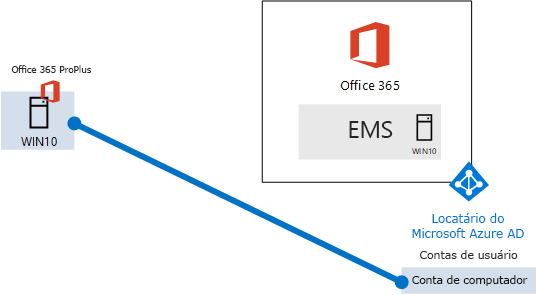
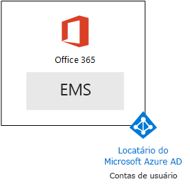

# <a name="the-lightweight-base-configuration"></a><span data-ttu-id="3e0c1-103">A configuração de base leve</span><span class="sxs-lookup"><span data-stu-id="3e0c1-103">The lightweight base configuration</span></span>

<span data-ttu-id="3e0c1-104">Este artigo fornece instruções passo a passo para criar um ambiente simplificado com a assinatura do Microsoft 365 E5 e um computador com o Windows 10 Enterprise.</span><span class="sxs-lookup"><span data-stu-id="3e0c1-104">This article provides you with step-by-step instructions to create a simplified environment with a Microsoft 365 E5 subscription and a computer running Windows 10 Enterprise.</span></span> 



<span data-ttu-id="3e0c1-106">Use o ambiente resultante para testar os recursos e as funcionalidades do [Microsoft 365 Enterprise](https://www.microsoft.com/microsoft-365/enterprise).</span><span class="sxs-lookup"><span data-stu-id="3e0c1-106">Use the resulting environment to test the features and functionality of [Microsoft 365 Enterprise](https://www.microsoft.com/microsoft-365/enterprise).</span></span>


  
> [!TIP]
> <span data-ttu-id="3e0c1-108">Clique [aqui](https://aka.ms/m365etlgstack) para ver um mapa visual de todos os artigos na pilha do Guia do Test Lab do Microsoft 365 Enterprise.</span><span class="sxs-lookup"><span data-stu-id="3e0c1-108">Click [here](https://aka.ms/m365etlgstack) for a visual map to all the articles in the Microsoft 365 Enterprise Test Lab Guide stack.</span></span>

## <a name="phase-1-create-your-office-365-e5-subscription"></a><span data-ttu-id="3e0c1-109">Fase 1: criar uma assinatura do Office 365 E5</span><span class="sxs-lookup"><span data-stu-id="3e0c1-109">Phase 1: Create your Office 365 E5 subscription</span></span>

<span data-ttu-id="3e0c1-110">Siga as etapas da Fase 2 e Fase 3 do [Ambiente de desenvolvimento/teste do Office 365](https://docs.microsoft.com/office365/enterprise/office-365-dev-test-environment) para criar um leve ambiente de desenvolvimento/teste do Office 365.</span><span class="sxs-lookup"><span data-stu-id="3e0c1-110">Follow the steps in Phase 2 and Phase 3 of the [Office 365 dev/test environment](https://docs.microsoft.com/office365/enterprise/office-365-dev-test-environment) to create a lightweight Office 365 dev/test environment.</span></span>

>[!Note]
><span data-ttu-id="3e0c1-111">A criação de uma assinatura de avaliação do Office 365 é necessária para que seu ambiente de desenvolvimento/teste tenha um locatário do Azure AD separado de qualquer assinatura paga que você possua.</span><span class="sxs-lookup"><span data-stu-id="3e0c1-111">We have you create a trial subscription of Office 365 so that your dev/test environment has a separate Azure AD tenant from any paid subscriptions you currently have.</span></span> <span data-ttu-id="3e0c1-112">Este separação significa que você pode adicionar e remover usuários e grupos no locatário de teste sem afetar suas assinaturas de produção.</span><span class="sxs-lookup"><span data-stu-id="3e0c1-112">This separation means you can add and remove users and groups in the test tenant without affecting your production subscriptions.</span></span>
>
  
## <a name="phase-2-add-a-microsoft-365-e5-trial-subscription"></a><span data-ttu-id="3e0c1-113">Fase 2: adicionar uma assinatura de avaliação do Microsoft 365 E5.</span><span class="sxs-lookup"><span data-stu-id="3e0c1-113">Phase 2: Add a Microsoft 365 E5 trial subscription</span></span>

<span data-ttu-id="3e0c1-114">Nesta fase, inscreva-se para a assinatura de avaliação do Microsoft 365 E5 e adicione-a à mesma organização de sua assinatura de avaliação do Office 365 E5.</span><span class="sxs-lookup"><span data-stu-id="3e0c1-114">In this phase, you sign up for the Microsoft 365 E5 trial subscription and add it to the same organization as your Office 365 E5 trial subscription.</span></span>
  
<span data-ttu-id="3e0c1-115">Primeiro, adicione a assinatura de avaliação do Microsoft 365 E5 e atribua uma licença do Microsoft 365 à sua conta de administrador global.</span><span class="sxs-lookup"><span data-stu-id="3e0c1-115">First, add the Microsoft 365 E5 trial subscription and assign a Microsoft 365 license to your global administrator account.</span></span>
  
1. <span data-ttu-id="3e0c1-116">Com uma instância particular de um navegador da Internet, acesse o Centro de administração do Microsoft 365 na [http://admin.microsoft.com](http://admin.microsoft.com) com suas credenciais da conta de administrador global.</span><span class="sxs-lookup"><span data-stu-id="3e0c1-116">With a private instance of an Internet browser, sign in to the Microsoft 365 admin center at [http://admin.microsoft.com](http://admin.microsoft.com) with your global administrator account credentials.</span></span>
    
2. <span data-ttu-id="3e0c1-117">Na página **Centro de administração do Microsoft 365**, na navegação à esquerda, clique em **Cobrança > Serviços de compra**.</span><span class="sxs-lookup"><span data-stu-id="3e0c1-117">On the **Microsoft 365 admin center** page, in the left navigation, click **Billing > Purchase services**.</span></span>
    
3. <span data-ttu-id="3e0c1-118">Na página **Serviços de compra**, encontre o item **Microsoft 365 E5**.</span><span class="sxs-lookup"><span data-stu-id="3e0c1-118">On the **Purchase services** page, find the **Microsoft 365 E5** item.</span></span> <span data-ttu-id="3e0c1-119">Passe o ponteiro do mouse sobre ele e clique em **Iniciar avaliação gratuita**.</span><span class="sxs-lookup"><span data-stu-id="3e0c1-119">Hover your mouse pointer over it and click **Start free trial**.</span></span>

4. <span data-ttu-id="3e0c1-120">Na página **Avaliação do Microsoft 365 E5**, escolha receber uma chamada ou um texto, insira seu número de telefone e clique em **Receber mensagem de texto** ou **Receber chamada**.</span><span class="sxs-lookup"><span data-stu-id="3e0c1-120">On the **Microsoft 365 E5 Trial** page, choose to receive a text or a call, enter your phone number, then click **Text me** or **Call me**.</span></span>

5. <span data-ttu-id="3e0c1-121">Na página **Confirmar seu pedido**, clique em **Experimentar agora**.</span><span class="sxs-lookup"><span data-stu-id="3e0c1-121">On the **Confirm your order** page, click **Try now**.</span></span>

6. <span data-ttu-id="3e0c1-122">Na página **Recibo do pedido**, clique em **Continuar**.</span><span class="sxs-lookup"><span data-stu-id="3e0c1-122">On the **Order receipt** page, click **Continue**.</span></span>

7. <span data-ttu-id="3e0c1-123">No Centro de administração do Microsoft 365 clique em **Usuários ativos**e, em seguida, sua conta de administrador.</span><span class="sxs-lookup"><span data-stu-id="3e0c1-123">In the Microsoft 365 admin center, click **Active users**, and then your administrator account.</span></span>

8. <span data-ttu-id="3e0c1-124">Clique em **Editar** para **Licenças de produto**.</span><span class="sxs-lookup"><span data-stu-id="3e0c1-124">Click **Edit** for **Product licenses**.</span></span>

9. <span data-ttu-id="3e0c1-125">Desative a licença do Office 365 Enterprise E5 e habilite a licença do Microsoft 365 E5.</span><span class="sxs-lookup"><span data-stu-id="3e0c1-125">Turn off the license for Office 365 Enterprise E5 and turn on the license for Microsoft 365 E5.</span></span>

10. <span data-ttu-id="3e0c1-126">Clique em **Salvar> Fechar >Fechar**.</span><span class="sxs-lookup"><span data-stu-id="3e0c1-126">Click **Save > Close > Close**.</span></span>

<span data-ttu-id="3e0c1-127">Em seguida, ***se você concluiu a Fase 3 do*** [Ambiente de desenvolvimento/teste do Office 365](https://docs.microsoft.com/office365/enterprise/office-365-dev-test-environment), repita as etapas de 8 a 11 do procedimento anterior para todas as suas contas (Usuário 2, Usuário 3, Usuário 4 e Usuário 5).</span><span class="sxs-lookup"><span data-stu-id="3e0c1-127">Next, ***if you completed Phase 3 of the*** [Office 365 dev/test environment](https://docs.microsoft.com/office365/enterprise/office-365-dev-test-environment), repeat steps 8 through 11 of the previous procedure for all of your other accounts (User 2, User 3, User 4, and User 5).</span></span>
  
> [!NOTE]
> <span data-ttu-id="3e0c1-128">A assinatura de avaliação do Microsoft 365 E5 é de 30 dias.</span><span class="sxs-lookup"><span data-stu-id="3e0c1-128">The Microsoft 365 E5 trial subscription is 30 days.</span></span> <span data-ttu-id="3e0c1-129">Para um ambiente de teste permanente, converta esta assinatura de avaliação para uma assinatura paga com uma pequena quantidade de licenças.</span><span class="sxs-lookup"><span data-stu-id="3e0c1-129">For a permanent test environment, convert this trial subscription to a paid subscription with a small number of licenses.</span></span> 
  
<span data-ttu-id="3e0c1-130">Seu ambiente de teste agora tem:</span><span class="sxs-lookup"><span data-stu-id="3e0c1-130">Your test environment now has:</span></span>
  
- <span data-ttu-id="3e0c1-131">Uma assinatura de avaliação do Microsoft 365 E5.</span><span class="sxs-lookup"><span data-stu-id="3e0c1-131">A Microsoft 365 E5 trial subscription.</span></span>
- <span data-ttu-id="3e0c1-132">Todas as suas contas de usuário apropriadas (tanto a conta de administrador global como todas as cinco contas de usuário) são habilitadas para usar o Microsoft 365 E5.</span><span class="sxs-lookup"><span data-stu-id="3e0c1-132">All your appropriate user accounts (either just the global administrator or all five user accounts) are enabled to use Microsoft 365 E5.</span></span>
    
<span data-ttu-id="3e0c1-133">A figura 1 mostra sua configuração resultante, que adiciona o Microsoft 365 E5, que inclui o Office 365 e o Enterprise Security + Management (EMS).</span><span class="sxs-lookup"><span data-stu-id="3e0c1-133">Figure 1 shows your resulting configuration, which adds Microsoft 365 E5, which includes both Office 365 and Enterprise Security + Management (EMS).</span></span>
  
<span data-ttu-id="3e0c1-134">**Figura 1: adicionar a assinatura de avaliação do Microsoft 365**</span><span class="sxs-lookup"><span data-stu-id="3e0c1-134">**Figure 1: Adding the Microsoft 365 trial subscription**</span></span>


  
## <a name="phase-3-create-a-windows-10-enterprise-computer"></a><span data-ttu-id="3e0c1-136">Fase 3: criar um computador com o Windows 10 Enterprise</span><span class="sxs-lookup"><span data-stu-id="3e0c1-136">Phase 3: Create a Windows 10 Enterprise computer</span></span>

<span data-ttu-id="3e0c1-137">Nesta fase, crie um computador autônomo executando o Windows 10 Enterprise como um computador físico, uma máquina virtual ou uma máquina virtual do Azure.</span><span class="sxs-lookup"><span data-stu-id="3e0c1-137">In this phase, you create a standalone computer running Windows 10 Enterprise as either a physical computer, a virtual machine, or an Azure virtual machine.</span></span>
  
### <a name="physical-computer"></a><span data-ttu-id="3e0c1-138">Computador físico</span><span class="sxs-lookup"><span data-stu-id="3e0c1-138">Physical computer</span></span>

<span data-ttu-id="3e0c1-p104">Obtenha um computador pessoal e instale o Windows 10 Enterprise. Você pode baixar a versão de avaliação do Windows 10 Enterprise [aqui](https://www.microsoft.com/evalcenter/evaluate-windows-10-enterprise).</span><span class="sxs-lookup"><span data-stu-id="3e0c1-p104">Obtain a personal computer and install Windows 10 Enterprise on it. You can download the Windows 10 Enterprise trial [here](https://www.microsoft.com/evalcenter/evaluate-windows-10-enterprise).</span></span>
  
### <a name="virtual-machine"></a><span data-ttu-id="3e0c1-141">Máquina virtual</span><span class="sxs-lookup"><span data-stu-id="3e0c1-141">Virtual machine</span></span>

<span data-ttu-id="3e0c1-p105">Crie uma máquina virtual usando o hipervisor de sua escolha e instale o Windows 10 Enterprise. Você pode baixar a versão de avaliação do Windows 10 Enterprise [aqui](https://www.microsoft.com/evalcenter/evaluate-windows-10-enterprise).</span><span class="sxs-lookup"><span data-stu-id="3e0c1-p105">Create a virtual machine using the hypervisor of your choice and install Windows 10 Enterprise on it. You can download the Windows 10 Enterprise trial [here](https://www.microsoft.com/evalcenter/evaluate-windows-10-enterprise).</span></span>
  
### <a name="virtual-machine-in-azure"></a><span data-ttu-id="3e0c1-144">Máquina virtual no Azure</span><span class="sxs-lookup"><span data-stu-id="3e0c1-144">Virtual machine in Azure</span></span>

<span data-ttu-id="3e0c1-p106">Para criar uma máquina virtual do Windows 10 no Microsoft Azure, ***você deve ter uma assinatura baseada no Visual Studio***, que tem acesso à imagem do Windows 10 Enterprise. Outros tipos de assinatura do Azure, como assinaturas de avaliação e pagas, não têm acesso a esta imagem. Confira as informações mais recentes em [Usar o cliente do Windows no Azure para cenários de desenvolvimento/teste](https://docs.microsoft.com/azure/virtual-machines/windows/client-images).</span><span class="sxs-lookup"><span data-stu-id="3e0c1-p106">To create a Windows 10 virtual machine in Microsoft Azure, ***you must have a Visual Studio-based subscription***, which has access to the image for Windows 10 Enterprise. Other types of Azure subscriptions, such as trial and paid subscriptions, do not have access to this image. For the latest information, see [Use Windows client in Azure for dev/test scenarios](https://docs.microsoft.com/azure/virtual-machines/windows/client-images).</span></span>
  
> [!NOTE]
> <span data-ttu-id="3e0c1-p107">Os conjuntos de comandos a seguir usam a versão mais recente do Azure PowerShell. Confira [Introdução aos cmdlets do Azure PowerShell](https://docs.microsoft.com/powershell/azureps-cmdlets-docs/). Esses conjuntos de comandos montam uma máquina virtual do Windows 10 Enterprise chamada WIN10 e toda a infraestrutura necessária, incluindo um grupo de recursos, uma conta de armazenamento e uma rede virtual. Se você já estiver familiarizado com os serviços de infraestrutura Azure, adapte estas instruções para se ajustar à sua infraestrutura implantada no momento.</span><span class="sxs-lookup"><span data-stu-id="3e0c1-p107">The following command sets use the latest version of Azure PowerShell. See [Get started with Azure PowerShell cmdlets](https://docs.microsoft.com/powershell/azureps-cmdlets-docs/). These command sets build a Windows 10 Enterprise virtual machine named WIN10 and all of its required infrastructure, including a resource group, a storage account, and a virtual network. If you are already familiar with Azure infrastructure services, please adapt these instructions to suit your currently deployed infrastructure.</span></span> 
  
<span data-ttu-id="3e0c1-152">Inicie um prompt do Microsoft PowerShell.</span><span class="sxs-lookup"><span data-stu-id="3e0c1-152">First, start a Microsoft PowerShell prompt.</span></span>
  
<span data-ttu-id="3e0c1-153">Entre na sua conta do Azure usando o comando a seguir.</span><span class="sxs-lookup"><span data-stu-id="3e0c1-153">Sign in to your Azure account with the following command.</span></span>
  
```
Connect-AzAccount
```

<span data-ttu-id="3e0c1-154">Para obter o nome de sua assinatura, use este comando.</span><span class="sxs-lookup"><span data-stu-id="3e0c1-154">Get your subscription name using the following command.</span></span>
  
```
Get-AzSubscription | Sort Name | Select Name
```

<span data-ttu-id="3e0c1-p108">Defina sua assinatura do Azure. Substitua tudo o que está entre aspas, incluindo os caracteres \< e >, pelo nome correto.</span><span class="sxs-lookup"><span data-stu-id="3e0c1-p108">Set your Azure subscription. Replace everything within the quotes, including the \< and > characters, with the correct name.</span></span>
  
```
$subscr="<subscription name>"
Get-AzSubscription -SubscriptionName $subscr | Select-AzSubscription
```

<span data-ttu-id="3e0c1-p109">Depois, crie um novo grupo de recursos. Para determinar um nome exclusivo para o grupo de recursos, use este comando para listar os grupos de recursos existentes.</span><span class="sxs-lookup"><span data-stu-id="3e0c1-p109">Next, create a new resource group. To determine a unique resource group name, use this command to list your existing resource groups.</span></span>
  
```
Get-AzResourceGroup | Sort ResourceGroupName | Select ResourceGroupName
```

<span data-ttu-id="3e0c1-p110">Crie seu novo grupo de recursos com estes comandos. Substitua tudo o que está entre aspas, incluindo os caracteres \< e >, pelos nomes corretos.</span><span class="sxs-lookup"><span data-stu-id="3e0c1-p110">Create your new resource group with these commands. Replace everything within the quotes, including the \< and > characters, with the correct names.</span></span>
  
```
$rgName="<resource group name>"
$locName="<location name, such as West US>"
New-AzResourceGroup -Name $rgName -Location $locName
```

<span data-ttu-id="3e0c1-p111">Em seguida, crie uma nova rede virtual e uma máquina virtual WIN10 com estes comandos. Quando solicitado, forneça o nome e a senha da conta de administrador local para WIN10 e armazene-os em um local seguro.</span><span class="sxs-lookup"><span data-stu-id="3e0c1-p111">Next, you create a new virtual network and the WIN10 virtual machine with these commands. When prompted, provide the name and password of the local administrator account for WIN10 and store these in a secure location.</span></span>
  
```
$corpnetSubnet=New-AzVirtualNetworkSubnetConfig -Name Corpnet -AddressPrefix 10.0.0.0/24
New-AzVirtualNetwork -Name "M365Ent-TestLab" -ResourceGroupName $rgName -Location $locName -AddressPrefix 10.0.0.0/8 -Subnet $corpnetSubnet
$rule1=New-AzNetworkSecurityRuleConfig -Name "RDPTraffic" -Description "Allow RDP to all VMs on the subnet" -Access Allow -Protocol Tcp -Direction Inbound -Priority 100 -SourceAddressPrefix Internet -SourcePortRange * -DestinationAddressPrefix * -DestinationPortRange 3389
New-AzNetworkSecurityGroup -Name Corpnet -ResourceGroupName $rgName -Location $locName -SecurityRules $rule1
$vnet=Get-AzVirtualNetwork -ResourceGroupName $rgName -Name "M365Ent-TestLab"
$nsg=Get-AzNetworkSecurityGroup -Name Corpnet -ResourceGroupName $rgName
Set-AzVirtualNetworkSubnetConfig -VirtualNetwork $vnet -Name Corpnet -AddressPrefix "10.0.0.0/24" -NetworkSecurityGroup $nsg
$vnet | Set-AzVirtualNetwork
$pip=New-AzPublicIpAddress -Name WIN10-PIP -ResourceGroupName $rgName -Location $locName -AllocationMethod Dynamic
$nic=New-AzNetworkInterface -Name WIN10-NIC -ResourceGroupName $rgName -Location $locName -SubnetId $vnet.Subnets[0].Id -PublicIpAddressId $pip.Id
$vm=New-AzVMConfig -VMName WIN10 -VMSize Standard_D1_V2
$cred=Get-Credential -Message "Type the name and password of the local administrator account for WIN10."
$vm=Set-AzVMOperatingSystem -VM $vm -Windows -ComputerName WIN10 -Credential $cred -ProvisionVMAgent -EnableAutoUpdate
$vm=Set-AzVMSourceImage -VM $vm -PublisherName MicrosoftWindowsDesktop -Offer Windows-10 -Skus RS3-Pro -Version "latest"
$vm=Add-AzVMNetworkInterface -VM $vm -Id $nic.Id
$vm=Set-AzVMOSDisk -VM $vm -Name WIN10-TestLab-OSDisk -DiskSizeInGB 128 -CreateOption FromImage
New-AzVM -ResourceGroupName $rgName -Location $locName -VM $vm
```

## <a name="phase-4-join-your-windows-10-computer-to-azure-ad"></a><span data-ttu-id="3e0c1-163">Fase 4: adicionar o computador com Windows 10 no Azure AD</span><span class="sxs-lookup"><span data-stu-id="3e0c1-163">Phase 4: Join your Windows 10 computer to Azure AD</span></span>

<span data-ttu-id="3e0c1-164">Depois de criar a máquina física ou virtual com Windows 10 Enterprise, entre com uma conta Administrador local.</span><span class="sxs-lookup"><span data-stu-id="3e0c1-164">After the physical or virtual machine with Windows 10 Enterprise is created, sign in with a local administrator account.</span></span>
  
> [!NOTE]
> <span data-ttu-id="3e0c1-165">Para uma máquina virtual no Azure, conecte-se usando [estas instruções](https://docs.microsoft.com/azure/virtual-machines/windows/connect-logon).</span><span class="sxs-lookup"><span data-stu-id="3e0c1-165">For a virtual machine in Azure, connect to it using [these instructions](https://docs.microsoft.com/azure/virtual-machines/windows/connect-logon).</span></span>
  
<span data-ttu-id="3e0c1-166">Em seguida, adicione o computador com Windows 10 no locatário do Azure AD das suas assinaturas do Microsoft 365 E5.</span><span class="sxs-lookup"><span data-stu-id="3e0c1-166">Next, join the WIN10 computer to the Azure AD tenant of your Microsoft 365 E5 subscription.</span></span>
  
1. <span data-ttu-id="3e0c1-167">Na área de trabalho do computador WIN10, clique em **Iniciar > Configurações > Contas > Acessar trabalho ou escola > Conectar**.</span><span class="sxs-lookup"><span data-stu-id="3e0c1-167">At the desktop of the WIN10 computer, click **Start > Settings > Accounts > Access work or school > Connect**.</span></span>
    
2. <span data-ttu-id="3e0c1-168">Na caixa de diálogo **Configurar uma conta corporativa ou de estudante**, clique em **Adicionar este dispositivo ao Azure Active Directory**.</span><span class="sxs-lookup"><span data-stu-id="3e0c1-168">In the **Set up a work or school account** dialog box, click **Join this device to Azure Active Directory**.</span></span>
    
3. <span data-ttu-id="3e0c1-169">Em **Conta corporativa ou de estudante**, digite o nome da conta do administrador global da sua assinatura do Microsoft 365 E5 e depois clique em **Avançar**.</span><span class="sxs-lookup"><span data-stu-id="3e0c1-169">In **Work or school account**, type the global administrator account name of your Microsoft 365 E5 subscription, and then click **Next**.</span></span>
    
4. <span data-ttu-id="3e0c1-170">Em **Digitar Senha**, digite a senha da conta de administrador global e clique em **Entrar**.</span><span class="sxs-lookup"><span data-stu-id="3e0c1-170">In **Enter password**, type the password for your global administrator account, and then click **Sign in**.</span></span>
    
5. <span data-ttu-id="3e0c1-171">Quando solicitado para garantir que esta é sua organização, clique em **Ingressar** e em **Concluído**.</span><span class="sxs-lookup"><span data-stu-id="3e0c1-171">When prompted to make sure this is your organization, click **Join**, and then click **Done**.</span></span>
    
6. <span data-ttu-id="3e0c1-172">Feche a janela de configurações.</span><span class="sxs-lookup"><span data-stu-id="3e0c1-172">Close the settings window.</span></span>
    
<span data-ttu-id="3e0c1-173">Em seguida, instale o Office 365 ProPlus no computador WIN10.</span><span class="sxs-lookup"><span data-stu-id="3e0c1-173">Next, install Office 365 ProPlus on the WIN10 computer.</span></span>
  
1. <span data-ttu-id="3e0c1-p112">Abra o navegador Microsoft Edge e entre no portal do Office com as credenciais da conta de administrador global. Para obter ajuda, consulte [Onde entrar no Office 365](https://support.office.com/Article/Where-to-sign-in-to-Office-365-e9eb7d51-5430-4929-91ab-6157c5a050b4).</span><span class="sxs-lookup"><span data-stu-id="3e0c1-p112">Open the Microsoft Edge browser and sign in to the Office portal with your global administrator account credentials. For help, see [Where to sign in to Office 365](https://support.office.com/Article/Where-to-sign-in-to-Office-365-e9eb7d51-5430-4929-91ab-6157c5a050b4).</span></span>
    
2. <span data-ttu-id="3e0c1-176">Na guia **Microsoft Office Home**, clique em **Instalar o Office**.</span><span class="sxs-lookup"><span data-stu-id="3e0c1-176">On the **Microsoft Office Home** tab, click **Install Office**.</span></span>
    
3. <span data-ttu-id="3e0c1-177">Quando solicitado sobre o que fazer, clique em **Executar** e em **Sim** para **Controle de Conta de Usuário**.</span><span class="sxs-lookup"><span data-stu-id="3e0c1-177">When prompted with what to do, click **Run**, and then click **Yes** for **User Account Control**.</span></span>
    
4. <span data-ttu-id="3e0c1-p113">Aguarde até concluir a instalação do Office. Quando você vir **Tudo pronto!**, clique duas vezes em **Fechar**.</span><span class="sxs-lookup"><span data-stu-id="3e0c1-p113">Wait for Office to complete its installation. When you see **You're all set!**, click **Close** twice.</span></span>
    
<span data-ttu-id="3e0c1-180">A Figura 3 mostra o ambiente resultante, que inclui o computador do WIN10 que:</span><span class="sxs-lookup"><span data-stu-id="3e0c1-180">Figure 3 shows your resulting environment, which includes the WIN10 computer that has:</span></span>

- <span data-ttu-id="3e0c1-181">Ingressou no locatário do Azure AD das suas assinaturas do Microsoft 365 E5.</span><span class="sxs-lookup"><span data-stu-id="3e0c1-181">Joined the Azure AD tenant of your Microsoft 365 E5 subscription.</span></span>
- <span data-ttu-id="3e0c1-182">Registrou um dispositivo do Azure AD no Microsoft Intune (EMS).</span><span class="sxs-lookup"><span data-stu-id="3e0c1-182">Enrolled as an Azure AD device in Microsoft Intune (EMS).</span></span>
- <span data-ttu-id="3e0c1-183">Instalou o Office 365 ProPlus.</span><span class="sxs-lookup"><span data-stu-id="3e0c1-183">Has Office 365 ProPlus installed.</span></span>
  
<span data-ttu-id="3e0c1-184">**Figura 2: a configuração final de um ambiente de teste do Microsoft 365**</span><span class="sxs-lookup"><span data-stu-id="3e0c1-184">**Figure 2: The final configuration of the Microsoft 365 test environment**</span></span>


  
<span data-ttu-id="3e0c1-186">Agora você está pronto para experimentar os recursos adicionais do [Microsoft 365 Enterprise](https://www.microsoft.com/microsoft-365/enterprise).</span><span class="sxs-lookup"><span data-stu-id="3e0c1-186">You are now ready to experiment with additional features of [Microsoft 365 Enterprise](https://www.microsoft.com/microsoft-365/enterprise).</span></span>
  
## <a name="next-steps"></a><span data-ttu-id="3e0c1-187">Próximas etapas</span><span class="sxs-lookup"><span data-stu-id="3e0c1-187">Next steps</span></span>

<span data-ttu-id="3e0c1-188">Explore esses conjuntos adicionais de guias de laboratório de teste:</span><span class="sxs-lookup"><span data-stu-id="3e0c1-188">Explore these additional sets of Test Lab Guides:</span></span>
  
- [<span data-ttu-id="3e0c1-189">Identidade</span><span class="sxs-lookup"><span data-stu-id="3e0c1-189">Identity</span></span>](m365-enterprise-test-lab-guides.md#identity)
- [<span data-ttu-id="3e0c1-190">Gerenciamento de dispositivo móvel</span><span class="sxs-lookup"><span data-stu-id="3e0c1-190">Mobile device management</span></span>](m365-enterprise-test-lab-guides.md#mobile-device-management)
- [<span data-ttu-id="3e0c1-191">Proteção de informações</span><span class="sxs-lookup"><span data-stu-id="3e0c1-191">Information protection</span></span>](m365-enterprise-test-lab-guides.md#information-protection)
   

## <a name="see-also"></a><span data-ttu-id="3e0c1-192">Confira também</span><span class="sxs-lookup"><span data-stu-id="3e0c1-192">See also</span></span>

[<span data-ttu-id="3e0c1-193">Guias do Laboratório de Teste do Microsoft 365 Enterprise</span><span class="sxs-lookup"><span data-stu-id="3e0c1-193">Microsoft 365 Enterprise Test Lab Guides</span></span>](m365-enterprise-test-lab-guides.md)

[<span data-ttu-id="3e0c1-194">Implantar o Microsoft 365 Enterprise</span><span class="sxs-lookup"><span data-stu-id="3e0c1-194">Deploy Microsoft 365 Enterprise</span></span>](deploy-microsoft-365-enterprise.md)

[<span data-ttu-id="3e0c1-195">Documentação do Microsoft 365 Enterprise</span><span class="sxs-lookup"><span data-stu-id="3e0c1-195">Microsoft 365 Enterprise documentation</span></span>](https://docs.microsoft.com/microsoft-365-enterprise/)
