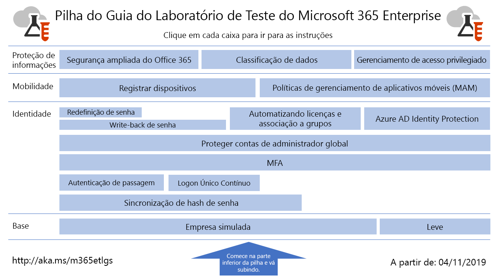

# Guias do laboratório de teste do Microsoft 365 EnterpriseMicrosoft 365 Enterprise Test Lab Guides

*Isso se aplica ao Microsoft 365 Enterprise e ao Office 365 Enterprise.**This applies to both Microsoft 365 Enterprise and Office 365 Enterprise.*

Os TLGs (Guias de Laboratório de Teste) ajudam a aprender rapidamente sobre os produtos da Microsoft. Eles fornecem instruções dirigidas para configurar os ambientes de testes representativos, mas simplificados. Você pode usar esses ambientes para demonstração, personalização ou criação de provas complexas de conceito durante a vigência de uma assinatura de avaliação ou paga.Test Lab Guides (TLGs) help you quickly learn about Microsoft products. They provide prescriptive instructions to configure simplified but representative test environments. You can use these environments for demonstration, customization, or creation of complex proofs of concept for the duration of a trial or paid subscription. 

Os TLGs foram projetados para serem modulares. Eles se complementam para criar várias configurações que correspondem melhor às suas necessidades de configuração de teste ou aprendizado. A experiência prática no estilo "criei por conta própria e funciona" ajuda você a entender os requisitos de implantação de um novo produto ou cenário para poder planejar melhor sua hospedagem em produção.TLGs are designed to be modular. They build upon each other to create multiple configurations that more closely match your learning or test configuration needs. The "I built it out myself and it works" hands-on experience helps you understand the deployment requirements of a new product or scenario so you can better plan for hosting it in production.

Você também pode usar os TLGs para criar ambientes representativos de desenvolvimento e teste de aplicativos, conhecidos como ambientes de desenvolvimento/teste.You can also use TLGs to create representative environments for development and testing of applications, also known as dev/test environments.
  

Clique [aqui](media/m365-enterprise-test-lab-guides/Microsoft365EnterpriseTLGStack.pdf) para ver um mapa visual de todos os artigos da pilha do Guia de Laboratório de Teste do Microsoft 365 Enterprise.Click [here](media/m365-enterprise-test-lab-guides/Microsoft365EnterpriseTLGStack.pdf) for a visual map to all the articles in the Microsoft 365 Enterprise Test Lab Guide stack.

## Configuração baseBase configuration

Primeiro, crie um ambiente de teste para o [Microsoft 365 Enterprise](https://docs.microsoft.com/microsoft-365-enterprise/) que inclua o Office 365 E5, o Enterprise Mobility+Security (EMS) E5 e o Windows 10 Enterprise. Você pode criar dois tipos diferentes de configurações básicas:First, you create a test environment for [Microsoft 365 Enterprise](https://docs.microsoft.com/microsoft-365-enterprise/) that includes Office 365 E5, Enterprise Mobility + Security (EMS) E5, and Windows 10 Enterprise. You can create two different types of base configurations:

- Use a [configuração básica leve](lightweight-base-configuration-microsoft-365-enterprise.md) quando quiser configurar e demonstrar recursos e capacidades do Microsoft 365 Enterprise em um ambiente exclusivamente em nuvem, que não inclui nenhum componente local.Use the [lightweight base configuration](lightweight-base-configuration-microsoft-365-enterprise.md) when you want to configure and demonstrate Microsoft 365 Enterprise features and capabilities in a cloud-only environment, which does not include any on-premises components.

- Use a [configuração básica corporativa simulada](simulated-ent-base-configuration-microsoft-365-enterprise.md) quando quiser configurar e demonstrar recursos e capacidades do Microsoft 365 Enterprise em um ambiente exclusivamente em nuvem híbrida, que usa componentes locais como o domínio dos Serviços de Domínio do Active Directory (AD DS).Use the [simulated enterprise base configuration](simulated-ent-base-configuration-microsoft-365-enterprise.md) when you want to configure and demonstrate Microsoft 365 Enterprise features and capabilities in a hybrid cloud environment, which uses on-premises components such as an Active Directory Domain Services (AD DS) domain.

Você também pode criar ambientes de teste do Office 365 E5, não adicionando a licença da Microsoft 365 E5 ao seu ambiente de avaliação ou produção.You can also create test environments for Office 365 E5 by not adding the Microsoft 365 E5 license to your trial or production test environment.
    
## IdentidadeIdentity

Para demonstrar recursos e capacidades relacionados à identidade, confira:To demonstrate identity-related features and capabilities, see:

- [Sincronização de hash de senhaPassword hash synchronization](password-hash-sync-m365-ent-test-environment.md)
  
   Habilite e teste a sincronização de diretório baseado em hash de senha de um controlador de domínio do AD DS.Enable and test password hash-based directory synchronization from an AD DS domain controller.

- [Autenticação de passagemPass-through authentication](pass-through-auth-m365-ent-test-environment.md)
  
   Habilite e teste a autenticação de passagem para um controlador de domínio do AD DS.Enable and test pass-through authentication to an AD DS domain controller.

- [Autenticação federadaFederated authentication](federated-identity-for-your-office-365-dev-test-environment.md)
  
   Habilite e teste a autenticação federada para um controlador de domínio do AD DS.Enable and test pass-through authentication to an AD DS domain controller.

- [Logon único contínuo do Azure Active DirectoryAzure AD Seamless Single Sign-on](single-sign-on-m365-ent-test-environment.md)
  
   Habilite e teste o Logon Único Contínuo (SSO) do Azure AD com um controlador de domínio do AD DS.Enable and test Azure AD Seamless Single Sign-on (SSO) with an AD DS domain controller.

- [Autenticação multifatorMulti-factor authentication](multi-factor-authentication-microsoft-365-test-environment.md)
  
   Habilite e teste a autenticação multifator com base em smartphone para uma conta de usuário específica.Enable and test smart phone-based multi-factor authentication for a specific user account.

- [Proteger contas de administradores globaisProtect global administrator accounts](protect-global-administrator-accounts-microsoft-365-test-environment.md)
 
   Bloqueie suas contas globais de administrador com políticas de acesso condicional.Lock down your global administrator accounts with conditional access policies.

- [Senha write-backPassword writeback](password-writeback-m365-ent-test-environment.md)

   Use senha write-back para alternar a senha na sua conta de usuário do AD DS do Azure AD.Use password writeback to change the password on your AD DS user account from Azure AD.

- [Redefinição de senhaPassword reset](password-reset-m365-ent-test-environment.md)

   Use SSPR (Redefinição de senha de autoatendimento) para redefinir sua senha.Use self-service password reset (SSPR) to reset your password.

- [Licenciamento automático e associação de grupoAutomatic licensing and group membership](automate-licenses-group-membership-microsoft-365-test-environment.md)

   Faça com que administrar novas contas seja mais fácil do que nunca com o licenciamento automático e associação dinâmica a grupos.Make administering new accounts easier than ever with automatic licensing and dynamic group membership.

- [Azure AD Identity ProtectionAzure AD Identity Protection](azure-ad-identity-protection-microsoft-365-test-environment.md)

   Verifique a existência de vulnerabilidades na sua conta de usuário atual.Scan your current user accounts for vulnerabilities.

- [Acesso a identidades e dispositivosIdentity and device access](identity-device-access-m365-test-environment.md)

   Crie um ambiente para testar configurações recomendadas de acesso a identidades e dispositivos e políticas de acesso condicional.Create an environment to test recommended identity and device access configurations and conditional access policies.

## Gerenciamento de dispositivo móvelMobile device management

Para demonstrar recursos relacionados ao gerenciamento de dispositivo móvel, confira:To demonstrate mobile device management-related features and capabilities, see:

- [Políticas de conformidade do dispositivoDevice compliance policies](mam-policies-for-your-microsoft-365-enterprise-dev-test-environment.md)
    
   Criar uma política de conformidade do dispositivo e um grupo de usuários para dispositivos com Windows 10.Create a user group and a device compliance policy for Windows 10 devices.
    
- [Registrar dispositivos iOS e AndroidEnroll iOS and Android devices](enroll-ios-and-android-devices-in-your-microsoft-enterprise-365-dev-test-environ.md)
   
   Registre os dispositivos iOS ou Android e gerencie-os remotamente.Enroll iOS or Android devices and manage them remotely.

## Proteção de informaçõesInformation protection

Para demonstrar recursos e capacidades relacionados à proteção da informação, confira:To demonstrate information protection-related features and capabilities, see:

- [Segurança ampliada do Office 365Increased Office 365 security](increased-o365-security-microsoft-365-enterprise-dev-test-environment.md)
    
   Configure definições de segurança ampliada no Office 365 e investigue ferramentas internas de segurança.Configure settings for increased Office 365 security and investigate built-in security tools.
  
- [Classificação de dadosData classification](data-classification-microsoft-365-enterprise-dev-test-environment.md)
    
   Configure e aplique rótulos do Office 365 a um documento em um site de equipe do SharePoint Online.Configure and apply Office 365 labels to a document in a SharePoint Online team site.
    
- [Gerenciamento de acesso privilegiadoPrivileged access management](privileged-access-microsoft-365-enterprise-dev-test-environment.md)
    
   Configure o gerenciamento de acesso privilegiado com acesso just-in-time para tarefas elevadas e privilegiadas na sua organização do Office 365.Configure privileged access management for just-in-time access to elevated and privileged tasks in your Office 365 organization.

