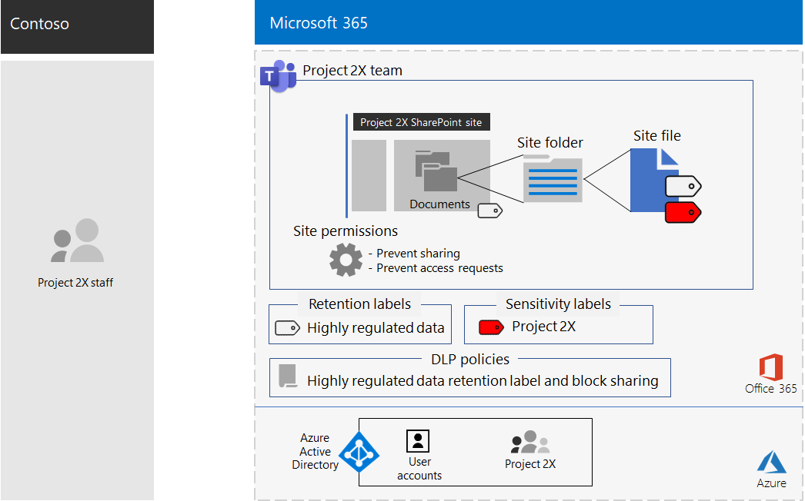
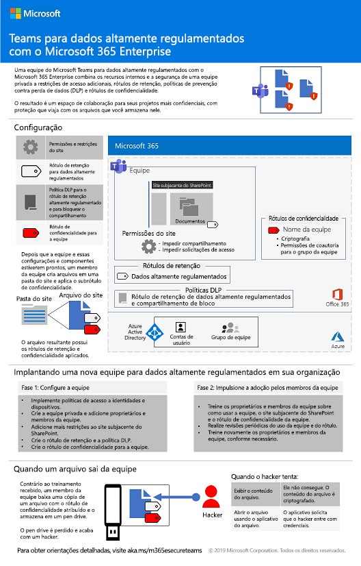
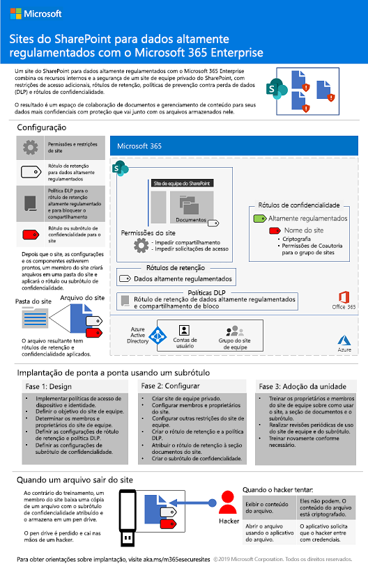
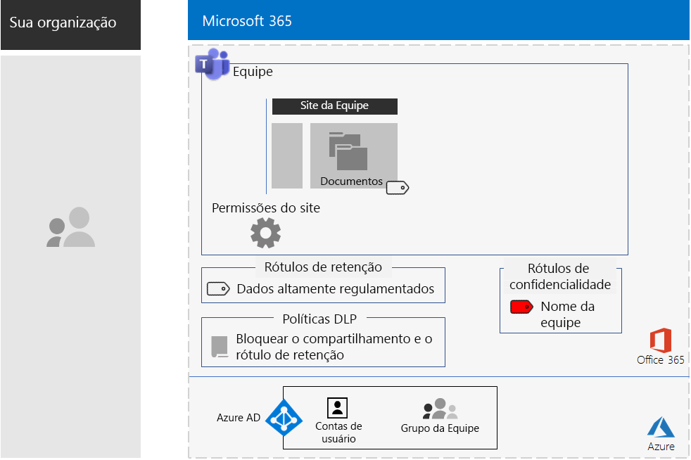
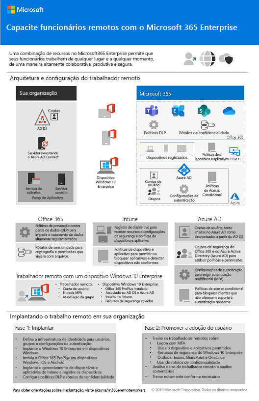

# Alterações no conteúdo de implantação do Microsoft 365 para empresasChanges to Microsoft 365 Enterprise deployment content

## Dezembro de 2019December 2019

### Novos conteúdosNew content 

- [Guia de laboratório de teste para Proteger o Teams para arquivosTest Lab Guide for Secure Teams for files](https://docs.microsoft.com/microsoft-365/security/office-365-security/secure-team-for-files-in-a-dev-test-environment)

### Atualizações e aprimoramentosUpdates and enhancements

- [Proteger sites e arquivos do SharePoint Online](https://docs.microsoft.com/microsoft-365/security/office-365-security/secure-sharepoint-online-sites-and-files) para usar os rótulos de confidencialidade[Secure SharePoint Online sites and files](https://docs.microsoft.com/microsoft-365/security/office-365-security/secure-sharepoint-online-sites-and-files) for the use of sensitivity labels
-  Atualização do conjunto de [Guias de Laboratório de Teste](m365-enterprise-test-lab-guides.md)Refresh of the set of [Test Lab Guides](m365-enterprise-test-lab-guides.md) 

## Novembro de 2019November 2019

### Novos conteúdosNew content 

- [Migrar do Microsoft 365 Business para o Microsoft 365 E3Migrate from Microsoft 365 Business to Microsoft 365 Enterprise E3](https://docs.microsoft.com/microsoft-365/business/migrate-from-microsoft-365-business-to-microsoft-365-enterprise)

- [Equipe para um projeto confidencial da Contoso CorporationTeam for a top-secret project of the Contoso Corporation](contoso-team-for-top-secret-project.md)

  

## Outubro de 2019October 2019

### Novos conteúdosNew content 

- [Teams para pôster de dados altamente regulamentadosTeams for highly regulated data poster](secure-teams-highly-regulated-data-scenario.md#poster)

  

  Você também pode baixar este pôster nos formatos [PDF](https://github.com/MicrosoftDocs/microsoft-365-docs/raw/public/microsoft-365/enterprise/media/secure-teams-highly-regulated-data-scenario/TeamsHighlyRegulatedData.pdf) ou [PowerPoint](https://github.com/MicrosoftDocs/microsoft-365-docs/raw/public/microsoft-365/enterprise/media/secure-teams-highly-regulated-data-scenario/Teams-Highly-Regulated-Data-Poster.pptx) e imprimir em papel tamanho carta, ofício ou tabloide (11 x 17).You can also download this poster in [PDF](https://github.com/MicrosoftDocs/microsoft-365-docs/raw/public/microsoft-365/enterprise/media/secure-teams-highly-regulated-data-scenario/TeamsHighlyRegulatedData.pdf) or [PowerPoint](https://github.com/MicrosoftDocs/microsoft-365-docs/raw/public/microsoft-365/enterprise/media/secure-teams-highly-regulated-data-scenario/Teams-Highly-Regulated-Data-Poster.pptx) formats and print it on letter, legal, or tabloid (11 x 17)-sized paper.

- [Sites do SharePoint para pôster de dados altamente regulamentadosSharePoint sites for highly regulated data poster](teams-sharepoint-online-sites-highly-regulated-data.md#poster)

  

  Você também pode baixar este pôster nos formatos [PDF](https://github.com/MicrosoftDocs/microsoft-365-docs/raw/public/microsoft-365/enterprise/media/teams-sharepoint-online-sites-highly-regulated-data/SharePointSitesHighlyRegulatedData.pdf) ou [PowerPoint](https://github.com/MicrosoftDocs/microsoft-365-docs/raw/public/microsoft-365/enterprise/media/teams-sharepoint-online-sites-highly-regulated-data/SharePoint-Sites-Highly-Regulated-Data.pptx) e imprimir em papel carta, oficial ou tabloide (11 x 17).You can also download this poster in [PDF](https://github.com/MicrosoftDocs/microsoft-365-docs/raw/public/microsoft-365/enterprise/media/teams-sharepoint-online-sites-highly-regulated-data/SharePointSitesHighlyRegulatedData.pdf) or [PowerPoint](https://github.com/MicrosoftDocs/microsoft-365-docs/raw/public/microsoft-365/enterprise/media/teams-sharepoint-online-sites-highly-regulated-data/SharePoint-Sites-Highly-Regulated-Data.pptx) formats and print it on letter, legal, or tabloid (11 x 17)-sized paper.

- [Pôster Implantar o Windows 10 com Piloto AutomáticoThe Deploy Windows 10 with Autopilot poster](windows10-deploy-autopilot.md) 

  

  Você também pode fazer o download deste pôster em formato [PDF](https://github.com/MicrosoftDocs/windows-itpro-docs/raw/public/windows/deployment/media/Windows10AutopilotFlowchart.pdf) ou do [Visio](https://github.com/MicrosoftDocs/windows-itpro-docs/raw/public/windows/deployment/media/Windows10Autopilotflowchart.vsdx).You can also download this poster in [PDF](https://github.com/MicrosoftDocs/windows-itpro-docs/raw/public/windows/deployment/media/Windows10AutopilotFlowchart.pdf) or [Visio](https://github.com/MicrosoftDocs/windows-itpro-docs/raw/public/windows/deployment/media/Windows10Autopilotflowchart.vsdx) format.

- [Pôster de implantação do Windows 10 com o Microsoft Endpoint Configuration ManagerThe Windows 10 deployment with Microsoft Endpoint Configuration Manager poster](windows10-deploy-inplaceupgrade.md)

  

  Você também pode fazer o download deste pôster em formato [PDF](https://github.com/MicrosoftDocs/windows-itpro-docs/raw/public/windows/deployment/media/Windows10DeploymentConfigManager.pdf) ou do [Visio](https://github.com/MicrosoftDocs/windows-itpro-docs/raw/public/windows/deployment/media/Windows10DeploymentConfigManager.vsdx).You can also download this poster in [PDF](https://github.com/MicrosoftDocs/windows-itpro-docs/raw/public/windows/deployment/media/Windows10DeploymentConfigManager.pdf) or [Visio](https://github.com/MicrosoftDocs/windows-itpro-docs/raw/public/windows/deployment/media/Windows10DeploymentConfigManager.vsdx) format.

- [Teams para dados altamente controladosTeams for highly regulated data scenario](secure-teams-highly-regulated-data-scenario.md)

  

  Anúncios: [Blog da Comunidade Técnica do Microsoft 365](https://techcommunity.microsoft.com/t5/Microsoft-365-Blog/Protect-your-highly-regulated-files-in-Teams-with-Microsoft-365/ba-p/962985)  |  [LinkedIn](https://www.linkedin.com/pulse/how-can-i-lock-down-team-sensitive-top-secret-joe-davies/?published=t)Announcements: [Microsoft 365 Technical Community blog](https://techcommunity.microsoft.com/t5/Microsoft-365-Blog/Protect-your-highly-regulated-files-in-Teams-with-Microsoft-365/ba-p/962985)  |  [LinkedIn](https://www.linkedin.com/pulse/how-can-i-lock-down-team-sensitive-top-secret-joe-davies/?published=t)

- [Pôster Capacitar trabalhadores remotosEmpower remote workers poster](empower-people-to-work-remotely.md#poster)

   

  Você também pode baixar este pôster nos formatos [PDF](https://github.com/MicrosoftDocs/microsoft-365-docs/raw/public/microsoft-365/enterprise/media/empower-people-to-work-remotely/empower-remote-workers-scenario.pdf) ou [PowerPoint](https://github.com/MicrosoftDocs/microsoft-365-docs/raw/public/microsoft-365/enterprise/media/empower-people-to-work-remotely/Empower-Remote-Workers-Poster.pptx) e imprimir em papel tamanho carta, ofício ou tabloide (11 x 17).You can also download this poster in [PDF](https://github.com/MicrosoftDocs/microsoft-365-docs/raw/public/microsoft-365/enterprise/media/empower-people-to-work-remotely/empower-remote-workers-scenario.pdf) or [PowerPoint](https://github.com/MicrosoftDocs/microsoft-365-docs/raw/public/microsoft-365/enterprise/media/empower-people-to-work-remotely/Empower-Remote-Workers-Poster.pptx) formats and print it on letter, legal, or tabloid (11 x 17)-sized paper.

### Atualizações e aprimoramentosUpdates and enhancements

- Atualização da [Fase 4: Office 365 ProPlus](office365proplus-infrastructure.md)Refresh of [Phase 4: Office 365 ProPlus](office365proplus-infrastructure.md)
- Atualização do [estudo de caso da Contoso](contoso-case-study.md)Refresh of the [Contoso case study](contoso-case-study.md)
- Atualização das cargas de trabalho [Microsoft Teams](teams-workload.md), [Exchange Online](exchangeonline-workload.md) e [SharePoint Online](sharepoint-online-onedrive-workload.md) Refresh of the [Microsoft Teams](teams-workload.md), [Exchange Online](exchangeonline-workload.md), and [SharePoint Online](sharepoint-online-onedrive-workload.md) workloads
- Atualização dos [sites do SharePoint para cenário de dados altamente regulamentados](teams-sharepoint-online-sites-highly-regulated-data.md)Refresh of the [SharePoint sites for highly regulated data](teams-sharepoint-online-sites-highly-regulated-data.md) scenario
 
  

- [Pôster do Microsoft 365 para empresas](microsoft-365-overview.md#get-the-big-picture) para novos cenários[Microsoft 365 Enterprise poster](microsoft-365-overview.md#get-the-big-picture) for new scenarios 

  

## Setembro de 2019September 2019

### Novos conteúdosNew content 

- [Cenário de trabalhadores remotosRemote workers scenario](empower-people-to-work-remotely.md)

   
 
  Anúncios: [Blog da Comunidade Técnica do Microsoft 365](https://techcommunity.microsoft.com/t5/Microsoft-365-Blog/Empower-your-remote-workers-with-Microsoft-365-Enterprise/ba-p/935196#M236)  |  [LinkedIn](https://www.linkedin.com/pulse/how-do-i-configure-microsoft-365-enterprise-empower-my-joe-davies/)Announcements: [Microsoft 365 Technical Community blog](https://techcommunity.microsoft.com/t5/Microsoft-365-Blog/Empower-your-remote-workers-with-Microsoft-365-Enterprise/ba-p/935196#M236)  |  [LinkedIn](https://www.linkedin.com/pulse/how-do-i-configure-microsoft-365-enterprise-empower-my-joe-davies/)

- [Etapa de criptografia de email](infoprotect-email-encryption.md) para a [Fase 6: Proteção de Informações](infoprotect-infrastructure.md)[Email encryption step](infoprotect-email-encryption.md) for [Phase 6: Information Protection](infoprotect-infrastructure.md)

### Atualizações e aprimoramentosUpdates and enhancements

- Reorganização e atualização da [Fase 2: Identidade](identity-infrastructure.md)Reorganization and refresh of [Phase 2: Identity](identity-infrastructure.md)
- Atualização da [Fase 1: Rede](networking-infrastructure.md) e [Fase 6: Proteção de Informações](infoprotect-infrastructure.md)Refresh of [Phase 1: Networking](networking-infrastructure.md) and [Phase 6: Information Protection](infoprotect-infrastructure.md)

## Agosto de 2019August 2019

### Novos conteúdosNew content 

- [Pôster sobre a Transição da Sua Organização para o Microsoft 365 para empresasTransition Your Organization to Microsoft 365 Enterprise poster](migration-microsoft-365-enterprise-workload.md#transition-your-entire-organization)

   
 
- [Pôster sobre a Infraestrutura de Identidade para o Microsoft 365 para empresasIdentity infrastructure for Microsoft 365 Enterprise poster](identity-infrastructure.md)

  

  Anúncios: [Blog da Comunidade Técnica do Microsoft 365](https://techcommunity.microsoft.com/t5/Microsoft-365-Blog/Get-the-new-Identity-infrastructure-for-Microsoft-365-Enterprise/ba-p/874941)  |  [LinkedIn](https://www.linkedin.com/pulse/how-can-i-quickly-ramp-up-key-concepts-features-identity-joe-davies/?published=t)Announcements: [Microsoft 365 Technical Community blog](https://techcommunity.microsoft.com/t5/Microsoft-365-Blog/Get-the-new-Identity-infrastructure-for-Microsoft-365-Enterprise/ba-p/874941)  |  [LinkedIn](https://www.linkedin.com/pulse/how-can-i-quickly-ramp-up-key-concepts-features-identity-joe-davies/?published=t)

- [Pôster de fim de suporte do Windows 7 e Office 10Windows 7 and Office 10 End-of-Support poster](migration-microsoft-365-enterprise-workload.md#summary-of-options-for-office-2010-clients-and-servers-and-windows-7)
  
  

  Anúncios: [Blog da Comunidade Técnica do Microsoft 365](https://techcommunity.microsoft.com/t5/Microsoft-365-Blog/Move-from-Office-2010-clients-and-servers-and-Windows-7-to/ba-p/846994)  |  [LinkedIn](https://www.linkedin.com/pulse/how-can-microsoft-365-enterprise-help-me-end-support-products-davies/)Announcements: [Microsoft 365 Technical Community blog](https://techcommunity.microsoft.com/t5/Microsoft-365-Blog/Move-from-Office-2010-clients-and-servers-and-Windows-7-to/ba-p/846994)  |  [LinkedIn](https://www.linkedin.com/pulse/how-can-microsoft-365-enterprise-help-me-end-support-products-davies/)

### Atualizações e aprimoramentosUpdates and enhancements

- [Pôster do Microsoft 365 para empresas](microsoft-365-overview.md#get-the-big-picture) para novos cenários de produtividade[Microsoft 365 Enterprise poster](microsoft-365-overview.md#get-the-big-picture) for new productivity scenarios

   

## Julho de 2019July 2019

### Novos conteúdosNew content

- Pasta de trabalho do Excel para o [artigo sobre Microsoft 365 para empresas de organizações não-empresariais](deploy-foundation-infrastructure-non-enterprises.md#onboarding)Excel workbook for [Microsoft 365 Enterprise for non-enterprise organizations article](deploy-foundation-infrastructure-non-enterprises.md#onboarding)

## Maio de 2019May 2019

### Novos conteúdosNew content

- [Cartaz da infraestrutura da fundaçãoFoundation Infrastructure poster](deploy-foundation-infrastructure.md#at-a-glance)

  

  Anúncios: [LinkedIn](https://www.linkedin.com/pulse/how-can-i-get-big-picture-microsoft-365-enterprise-joe-davies/)Announcements: [LinkedIn](https://www.linkedin.com/pulse/how-can-i-get-big-picture-microsoft-365-enterprise-joe-davies/)

 
- [Artigo sobre Microsoft 365 para empresas de organizações não empresariaisMicrosoft 365 Enterprise for non-enterprise organizations article](deploy-foundation-infrastructure-non-enterprises.md)

  

  Anúncios: [Blog da Comunidade Técnica do Microsoft 365](https://techcommunity.microsoft.com/t5/Microsoft-365-Blog/Deploy-Microsoft-365-Enterprise-infrastructure-even-if-you-re/ba-p/900012)  |  [LinkedIn](https://www.linkedin.com/pulse/how-do-i-deploy-microsoft-365-enterprise-without-joe-davies/)Announcements: [Microsoft 365 Technical Community blog](https://techcommunity.microsoft.com/t5/Microsoft-365-Blog/Deploy-Microsoft-365-Enterprise-infrastructure-even-if-you-re/ba-p/900012)  |  [LinkedIn](https://www.linkedin.com/pulse/how-do-i-deploy-microsoft-365-enterprise-without-joe-davies/)

## Abril de 2019April 2019

### Novos conteúdosNew content 

- Pré-requisito Guias de Laboratório de Testes de [Acesso a identidades e dispositivos](identity-device-access-m365-test-environment.md)[Identity and device access](identity-device-access-m365-test-environment.md) prerequisite Test Lab Guides
- Etapas de [Proteção de Informações do Windows](infoprotect-deploy-windows-information-protection.md) e [Prevenção de Perda de Dados](infoprotect-data-loss-prevention.md) do Office 365 para a [Fase 6: Proteção de Informações](infoprotect-infrastructure.md)[Windows Information Protection](infoprotect-deploy-windows-information-protection.md) and [Office 365 Data Loss Prevention](infoprotect-data-loss-prevention.md) steps for [Phase 6: Information Protection](infoprotect-infrastructure.md)

## Confira tambémSee also

[Guia de implantaçãoDeployment guide](deploy-microsoft-365-enterprise.md)
