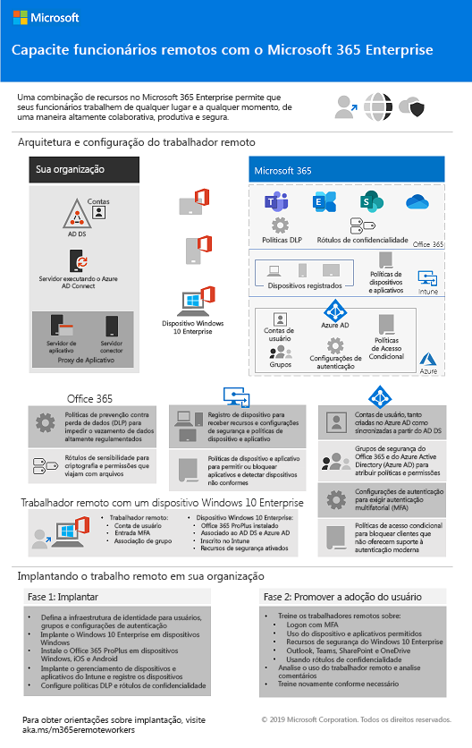
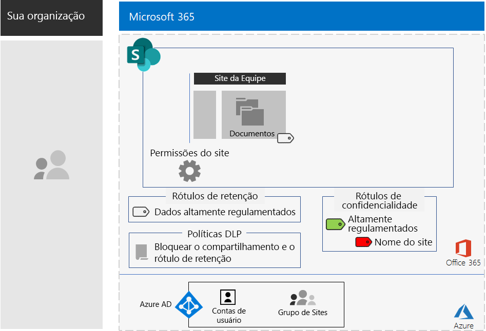
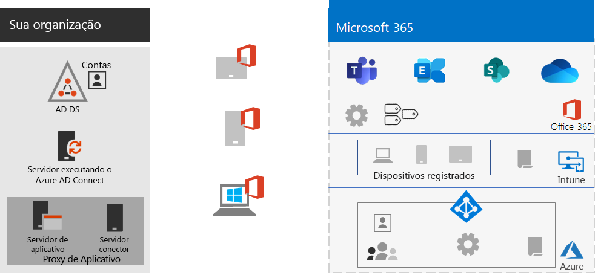
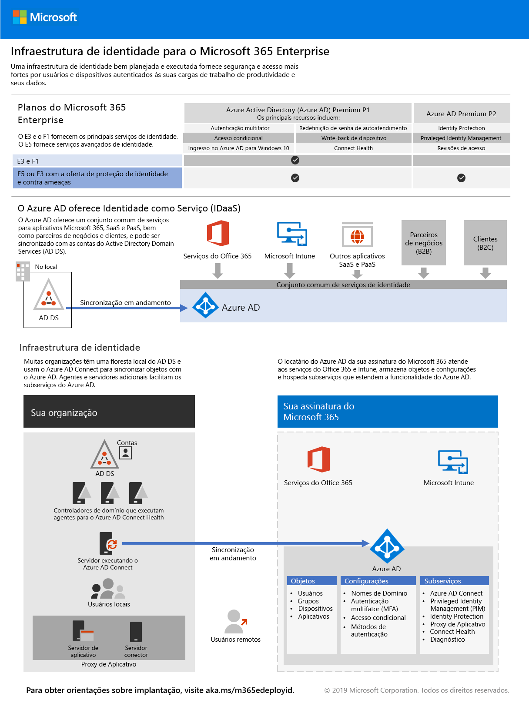
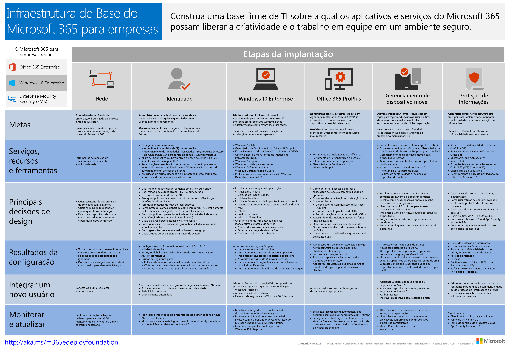
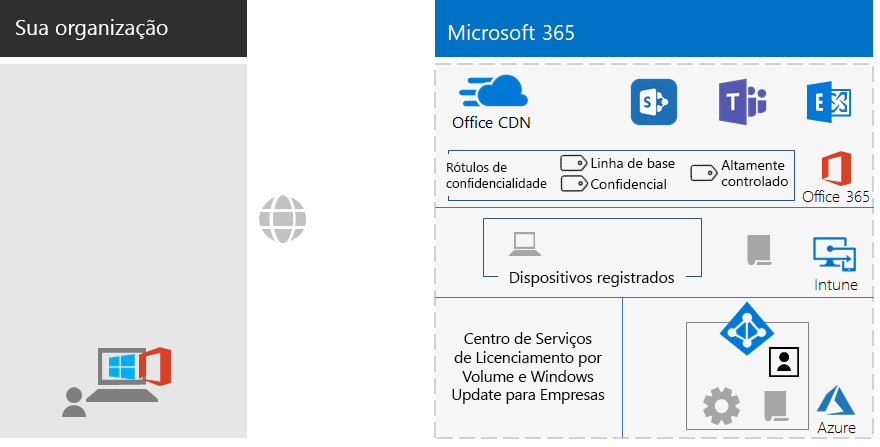

# Alterações no conteúdo de implantação do Microsoft 365 EnterpriseChanges to Microsoft 365 Enterprise deployment content

## Outubro de 2019October 2019

### Novos conteúdosNew content 

- [Pôster Capacitar trabalhadores remotosEmpower remote workers](empower-people-to-work-remotely.md#poster)

   
 

### Atualizações e aprimoramentosUpdates and enhancements

- Atualização do [estudo de caso da Contoso](contoso-case-study.md)Refresh of the [Contoso case study](contoso-case-study.md)
- Atualização da carga de trabalho do [Exchange Online](exchangeonline-workload.md)Refresh of the [Exchange Online](exchangeonline-workload.md) workload
- Atualização dos [sites do SharePoint para cenário de dados altamente regulamentados](teams-sharepoint-online-sites-highly-regulated-data.md)Refresh of the [SharePoint sites for highly regulated data](teams-sharepoint-online-sites-highly-regulated-data.md) scenario
 
  

- [Pôster do Microsoft 365 Enterprise](microsoft-365-overview.md#get-the-big-picture) para novos cenários[Microsoft 365 Enterprise poster](microsoft-365-overview.md#get-the-big-picture) for new scenarios 

  

## Setembro de 2019September 2019

### Novos conteúdosNew content 

- [Cenário de trabalhadores remotosRemote workers scenario](empower-people-to-work-remotely.md)

   
 
- [Etapa de criptografia de email](infoprotect-email-encryption.md) para a [Fase 6: Proteção de Informações](infoprotect-infrastructure.md)[Email encryption step](infoprotect-email-encryption.md) for [Phase 6: Information Protection](infoprotect-infrastructure.md)

### Atualizações e aprimoramentosUpdates and enhancements

- Reorganização e atualização da [Fase 2: Identidade](identity-infrastructure.md)Reorganization and refresh of [Phase 2: Identity](identity-infrastructure.md)
- Atualização da [Fase 1: Rede](networking-infrastructure.md) e [Fase 6: Proteção de Informações](infoprotect-infrastructure.md)Refresh of [Phase 1: Networking](networking-infrastructure.md) and [Phase 6: Information Protection](infoprotect-infrastructure.md)

## Agosto de 2019August 2019

### Novos conteúdosNew content 

- [Poster Transforme a Sua Organização com o Microsoft 365 EnterpriseTransition Your Organization to Microsoft 365 Enterprise poster](migration-microsoft-365-enterprise-workload.md#transition-your-entire-organization)

   
 
- [Pôster Infraestrutura de Identidade para o Microsoft 365 EnterpriseIdentity infrastructure for Microsoft 365 Enterprise poster](identity-infrastructure.md)

  

  Anúncios: [Blog da Comunidade Técnica do Microsoft 365](https://techcommunity.microsoft.com/t5/Microsoft-365-Blog/Get-the-new-Identity-infrastructure-for-Microsoft-365-Enterprise/ba-p/874941)  |  [LinkedIn](https://www.linkedin.com/pulse/how-can-i-quickly-ramp-up-key-concepts-features-identity-joe-davies/?published=t)Announcements: [Microsoft 365 Technical Community blog](https://techcommunity.microsoft.com/t5/Microsoft-365-Blog/Get-the-new-Identity-infrastructure-for-Microsoft-365-Enterprise/ba-p/874941)  |  [LinkedIn](https://www.linkedin.com/pulse/how-can-i-quickly-ramp-up-key-concepts-features-identity-joe-davies/?published=t)

- [Pôster de fim de suporte do Windows 7 e Office 10Windows 7 and Office 10 End-of-Support poster](migration-microsoft-365-enterprise-workload.md#summary-of-options-for-office-2010-clients-and-servers-and-windows-7)
  
  

  Anúncios: [Blog da Comunidade Técnica do Microsoft 365](https://techcommunity.microsoft.com/t5/Microsoft-365-Blog/Move-from-Office-2010-clients-and-servers-and-Windows-7-to/ba-p/846994)  |  [LinkedIn](https://www.linkedin.com/pulse/how-can-microsoft-365-enterprise-help-me-end-support-products-davies/)Announcements: [Microsoft 365 Technical Community blog](https://techcommunity.microsoft.com/t5/Microsoft-365-Blog/Move-from-Office-2010-clients-and-servers-and-Windows-7-to/ba-p/846994)  |  [LinkedIn](https://www.linkedin.com/pulse/how-can-microsoft-365-enterprise-help-me-end-support-products-davies/)

### Atualizações e aprimoramentosUpdates and enhancements

- [Pôster do Microsoft 365 Enterprise](microsoft-365-overview.md#get-the-big-picture) para novos cenários de produtividade[Microsoft 365 Enterprise poster](microsoft-365-overview.md#get-the-big-picture) for new productivity scenarios

   

## Julho de 2019July 2019

### Novos conteúdosNew content

- Pasta de trabalho do Excel para o [artigo sobre Microsoft 365 Enterprise para organizações não-empresariais](deploy-foundation-infrastructure-non-enterprises.md#onboarding)Excel workbook for [Microsoft 365 Enterprise for non-enterprise organizations article](deploy-foundation-infrastructure-non-enterprises.md#onboarding)

## Maio de 2019May 2019

### Novos conteúdosNew content

- [Cartaz da infraestrutura da fundaçãoFoundation Infrastructure poster](deploy-foundation-infrastructure.md#at-a-glance)

  

  Anúncios: [LinkedIn](https://www.linkedin.com/pulse/how-can-i-get-big-picture-microsoft-365-enterprise-joe-davies/)Announcements: [LinkedIn](https://www.linkedin.com/pulse/how-can-i-get-big-picture-microsoft-365-enterprise-joe-davies/)

 
- [Artigo sobre Microsoft 365 Enterprise para organizações não empresariaisMicrosoft 365 Enterprise for non-enterprise organizations article](deploy-foundation-infrastructure-non-enterprises.md)

  

  Anúncios: [Blog da Comunidade Técnica do Microsoft 365](https://techcommunity.microsoft.com/t5/Microsoft-365-Blog/Deploy-Microsoft-365-Enterprise-infrastructure-even-if-you-re/ba-p/900012)  |  [LinkedIn](https://www.linkedin.com/pulse/how-do-i-deploy-microsoft-365-enterprise-without-joe-davies/)Announcements: [Microsoft 365 Technical Community blog](https://techcommunity.microsoft.com/t5/Microsoft-365-Blog/Deploy-Microsoft-365-Enterprise-infrastructure-even-if-you-re/ba-p/900012)  |  [LinkedIn](https://www.linkedin.com/pulse/how-do-i-deploy-microsoft-365-enterprise-without-joe-davies/)

## Abril de 2019April 2019

### Novos conteúdosNew content 

- Pré-requisito Guias de Laboratório de Testes de [Acesso a identidades e dispositivos](identity-device-access-m365-test-environment.md)[Identity and device access](identity-device-access-m365-test-environment.md) prerequisite Test Lab Guides
- Etapas de [Proteção de Informações do Windows](infoprotect-deploy-windows-information-protection.md) e [Prevenção de Perda de Dados](infoprotect-data-loss-prevention.md) do Office 365 para a [Fase 6: Proteção de Informações](infoprotect-infrastructure.md)[Windows Information Protection](infoprotect-deploy-windows-information-protection.md) and [Office 365 Data Loss Prevention](infoprotect-data-loss-prevention.md) steps for [Phase 6: Information Protection](infoprotect-infrastructure.md)

## Confira tambémSee also

[Guia de implantaçãoDeployment guide](deploy-microsoft-365-enterprise.md)
