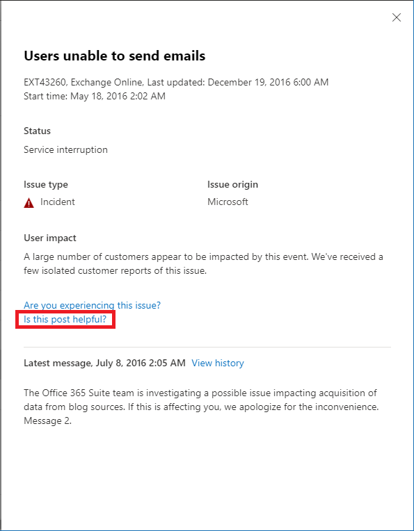

# Monitoramento do Exchange Online para Microsoft 365

É possível usar o monitoramento do Exchange Online no Centro de administração do Microsoft 365 para monitorar a integridade do serviço do Exchange para a assinatura do Microsoft 365 da sua organização. O monitoramento do Exchange Online fornece informações sobre incidentes e avisos que são coletados nestas categorias:

- **Infraestrutura**: O problema é detectado na infraestrutura do Microsoft 365 que a Microsoft possui para fornecer atualizações regulares e resolver o problema. Por exemplo, os usuários não podem acessar o Exchange Online devido a problemas com o Exchange ou outra infraestrutura de nuvem do Microsoft 365.
- **Infraestrutura de terceiros**: O problema é detectado em uma infraestrutura de terceiros da qual sua organização depende e requer a adoção de medidas da sua organização para sua resolução. Por exemplo, as transações de autenticação de usuários estão sendo aceleradas por um provedor de serviços de token de segurança (STS) de terceiros que impede que os usuários se conectem ao Exchange Online.
- **Infraestrutura do cliente**: O problema é detectado na infra-estrutura da sua organização e requer ação de sua organização para resolução. Por exemplo, os usuários não podem acessar o Exchange Online porque não conseguem obter um token de autenticação do provedor STS hospedado por sua organização devido a um certificado expirado.

Aqui está um exemplo da página **Integridade do serviço** no Centro de administração do Microsoft 365, disponível em **Integridade > Integridade do serviço**.

O valor da coluna **Status** indica se o serviço está funcionando bem ou se possui avisos ou incidentes baseados nos serviços de nuvem que a Microsoft mantém. 

O valor da coluna **Sua organização e edições de terceiros** indica que a infraestrutura da sua organização ou o software de terceiros estão afetando sua experiência com a integridade do serviço dos usuários do Exchange Online. Os avisos ou incidentes requerem a adoção de medidas *suas* para serem resolvidos.

Aqui está um exemplo da página de monitoramento do **Exchange Online** no Centro de administração do Microsoft 365, disponível em **Integridade > Integridade do serviço > Exchange Online**.

Com a página de **monitoramento do Exchange Online**, você pode ver se o serviço do Exchange Online está íntegro ou não e se há algum incidente ou aviso associado. Com o monitoramento do Exchange Online, você pode observar a integridade do serviço para cenários de email específicos e visualizar sinais em tempo quase real para determinar o impacto por cenário. 

## Requisitos

Esta pré-visualização está habilitada para os clientes que atendem a estes requisitos: 

- A organização precisa ter uma contagem de licenças de pelo menos 5.000, de um ou uma combinação destes produtos: Office 365 E3, Microsoft 365 E3, Office 365 E5 e Microsoft 365 E5. 

  Por exemplo, a organização pode ter 3.000 licenças do Office 365 E3 e 2.500 do Microsoft 365 E5, para um total de 5.500 licenças dos produtos qualificados.

- A organização precisa ter pelo menos 50 usuários ativos mensais do Exchange Online.

Com o monitoramento do Exchange Online, você pode ver a integridade dos seguintes clientes de email com base na atividade de leitura de email:

- Outlook para Desktop 
- Outlook na Web
- Clientes nativos do iOS e do Android 
- Aplicativo Móvel do Outlook no iOS e no Android 
- Cliente Outlook para o Mac

Para estes clientes, você pode ver o número de usuários ativos nos últimos 30 minutos com base nos usuários que leram um email, juntamente com o número de incidentes e avisos no painel de controle. Estes dados são comparados com o mesmo intervalo da semana anterior para ver se há algum problema. 

>[!Note]
> A contagem de usuários ativos é medida por uma única atividade, por exemplo, quando o usuário lê um email. Ela contabiliza apenas os últimos 30 minutos de atividade.
>

Também é possível monitorar a integridade do Exchange Online para os seguintes cenários:

- **Fluxo de Email do Outlook**: O número de mensagens entregues com sucesso a uma caixa postal sem qualquer atraso após a mensagem ter chegado à rede Microsoft 365. 
- **Autenticação Básica e Autenticação Moderna**: O número de usuários validados com êxito no serviço Exchange Online.

Para todos esses cenários, os números-chave são para os últimos 30 minutos no painel principal. As visualizações detalhadas para cada um desses cenários mostram a tendência quase em tempo real para sete dias com o agregado de 30 minutos em comparação com a semana anterior. 

## Envie-nos o seu feedback

Há duas maneiras de fornecer um feedback:

- Use a opção **Enviar feedback** disponível em todas as páginas do Centro de administração do Microsoft 365.
- Enviar o feedback usando o link **Esta postagem é útil?** para um incidente específico ou um aviso.

## Perguntas frequentes

#### 1. Por que não vejo “Monitoramento do Exchange Online” em Integridade no Centro de administração do Microsoft 365? 

Primeiro, certifique-se de ter ativado o novo Centro de administração na página **Início** do Centro de administração do Microsoft 365. 

Em seguida, certifique-se de atender a ambos os requisitos a seguir: 

- A organização precisa ter uma contagem de licenças de pelo menos 5.000, de um ou uma combinação destes produtos: Office 365 E3, Microsoft 365 E3, Office 365 E5 e Microsoft 365 E5. 
- A organização precisa ter pelo menos 50 usuários ativos mensais do Exchange Online.

Se a contagem de licenças para a organização ficar abaixo de 5.000 usuários e os usuários ativos mensais ficarem abaixo de 50 usuários, o monitoramento do Exchange Online não será habilitado até que esses requisitos sejam atendidos.

#### 2. A contagem de usuários ativos no painel de cada cliente parece ser baixa. Temos muitas licenças ativas atribuídas aos usuários. O que isto significa? 

A contagem de usuários ativos mostrada no monitoramento é baseada em uma janela de 30 minutos onde os usuários realizaram a atividade chamada no recurso. Isso não deve ser confundido com números de uso. Para visualizar os números de utilização, utilize relatórios de atividades no Centro de administração do Microsoft 365 (**Relatórios > Utilização**).

#### 3. Haverá outros cenários de monitoramento para outros serviços, tais como o Teams e o Microsoft Office SharePoint Online? 

A Microsoft está integrando essa experiência diretamente no painel de integridade do serviço no Centro de administração do Microsoft 365. Isto proporcionará oportunidades para a Microsoft ampliar os cenários de monitoramento para outros serviços, que serão anunciados quando houver novidades a serem compartilhadas. 

#### 4. Qual é o plano para a disponibilidade geral desta experiência? 

A Microsoft integrou o monitoramento do Exchange Online diretamente no painel **Integridade do Serviço** no Centro de administração do Microsoft 365. 

Com esta nova experiência integrada, o plano da Microsoft é coletar seu feedback e depois definir nosso plano de disponibilidade geral.

#### 5. Este é um recurso gratuito (incluído) ou pago (extra)? 

Este recurso está em Visualização Pública e disponível apenas para clientes que atendam aos requisitos da pergunta 1.

<!--
>[!Note]
>INTERNAL: That decision is pending
>
--> 

#### 6. Como faço para enviar meus comentários? 

Para obter comentários gerais, use o ícone **Fornecer comentários** no canto inferior direito da página de monitoramento do **Exchange Online**. 

Para comentários sobre incidentes ou avisos, use o link **Esta postagem é útil?**.

#### 7. Onde estão os dados instrumentados para os cenários que mostram tendências de atividade?

Os dados são instrumentados no serviço Exchange Online. Se houver uma falha que acontece antes da solicitação chegar no Exchange Online ou se houver uma falha no Exchange Online, você verá uma queda do sinal de atividade.
