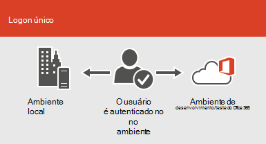

# Integração do Microsoft 365 com ambientes locaisMicrosoft 365 integration with on-premises environments

*Esse artigo se aplica ao Microsoft 365 Enterprise e ao Office 365 Enterprise.**This article applies to both Microsoft 365 Enterprise and Office 365 Enterprise.*

Você pode integrar o Microsoft 365 com os serviços de diretório existentes e com uma instalação local do Exchange Server, do Skype for Business Server 2015 ou do SharePoint Server.You can integrate Microsoft 365 with your existing directory services and with an on-premises installation of Exchange Server, Skype for Business Server 2015, or SharePoint Server.
  
 - Ao se integrar aos serviços de diretório, você pode sincronizar e gerenciar contas de usuário para ambos os ambientes.When you integrate with directory services, you can synchronize and manage user accounts for both environments. Você também pode adicionar a sincronização de hash de senha ou SSO (logon único) para que os usuários possam fazer logon em ambos os ambientes com suas credenciais locais.You can also add password hash synchronization or single sign-on (SSO) so users can log on to both environments with their on-premises credentials.
 - Ao se integrar aos produtos do servidor local, você cria um ambiente híbrido.When you integrate with on-premises server products, you create a hybrid environment. Um ambiente híbrido pode ajudar à medida que você migra usuários ou informações para a Microsoft 365, ou pode continuar a ter alguns usuários ou algumas informações no local e alguns na nuvem.A hybrid environment can help as you migrate users or information to Microsoft 365, or you can continue to have some users or some information on-premises and some in the cloud. Para obter mais informações sobre ambientes híbridos, consulte [Hybrid Cloud Overview](https://docs.microsoft.com/Office365/Enterprise/hybrid-cloud-overview).For more information about hybrid environments, see [Hybrid cloud overview](https://docs.microsoft.com/Office365/Enterprise/hybrid-cloud-overview).

Você também pode usar os supervisor do Azure Active Directory (Azure AD) para obter orientação de instalação personalizada (você deve estar conectado ao Microsoft 365):You can also use the Azure Active Directory (Azure AD) advisors for customized setup guidance (you must be signed in to Microsoft 365):

- [Sincronizar usuários do diretório da sua organizaçãoSync users from your org's directory](https://aka.ms/aadconnectpwsync)
- [Supervisor de implantação do AD FSAD FS deployment advisor](https://aka.ms/adfsguidance)
- [Guia de instalação do Azure ADAzure AD setup guide](https://aka.ms/aadpguidance)
   
## Antes de começarBefore you begin

Antes de integrar o Microsoft 365 e um ambiente local, você também precisará participar do [planejamento de rede e do ajuste de desempenho](network-planning-and-performance.md).Before you integrate Microsoft 365 and an on-premises environment, you also need to attend to [network planning and performance tuning](network-planning-and-performance.md). Você também vai querer entender os modelos de [identidade](about-microsoft-365-identity.md)disponíveis.You will also want to understand the available [identity models](about-microsoft-365-identity.md). 

Confira [onde gerenciar contas da microsoft 365](manage-microsoft-365-accounts.md) para obter uma lista de ferramentas que você pode usar para gerenciar usuários e contas do Microsoft 365.See [where to manage Microsoft 365 accounts](manage-microsoft-365-accounts.md) for a list of tools you can use to manage Microsoft 365 users and accounts. 
  
## Integrar o Microsoft 365 com os serviços de diretórioIntegrate Microsoft 365 with directory services
Se você tiver contas de usuário existentes em um diretório local, não será necessário recriar todas essas contas no Microsoft 365 e correr o risco de introdução a diferenças ou erros entre os ambientes.If you have existing user accounts in an on-premises directory, you don't want to re-create all of those accounts in Microsoft 365 and risk introducing differences or errors between the environments. A sincronização de diretórios ajuda você a espelhar essas contas entre seus ambientes online e local.Directory synchronization helps you mirror those accounts between your online and on-premises environments. Com a sincronização de diretórios, os usuários não precisam se lembrar de novas informações para cada ambiente, e você não precisa criar ou atualizar contas duas vezes.With directory synchronization, your users don't have to remember new information for each environment, and you don't have to create or update accounts twice. Você precisará [preparar o diretório local para a](prepare-for-directory-synchronization.md) sincronização de diretórios.You will need to [prepare your on-premises directory](prepare-for-directory-synchronization.md) for directory synchronization.
  

  
Se quiser que os usuários possam fazer logon no Microsoft 365 com suas credenciais locais, você também pode configurar o SSO.If you want users to be able to log on to Microsoft 365 with their on-premises credentials, you can also configure SSO. Com o SSO, a Microsoft 365 é configurada para confiar no ambiente local para autenticação do usuário.With SSO, Microsoft 365 is configured to trust the on-premises environment for user authentication.
  

  
Diferentes técnicas de gerenciamento de contas de usuário fornecem experiências diferentes para seus usuários, conforme mostrado na tabela a seguir.Different user account management techniques provide different experiences for your users, as shown in the following table.
 
### Sincronização de diretório com ou sem sincronização de hash de senha ou autenticação de passagemDirectory synchronization with or without password hash synchronization or pass-through authentication

Um usuário faz logon no seu ambiente local com a conta de usuário (domínio \ nome_de_usuário).A user logs on to their on-premises environment with their user account (domain\username). Quando eles acessam o Microsoft 365, eles devem fazer logon novamente com sua conta corporativa ou de estudante (user@domain.com).When they go to Microsoft 365, they must log on again with their work or school account (user@domain.com). O nome de usuário é o mesmo em ambos os ambientes.The user name is the same in both environments. Quando você adiciona a sincronização de hash de senha ou a autenticação de passagem, o usuário tem a mesma senha para os dois ambientes, mas precisará fornecer essas credenciais novamente ao fazer logon no Microsoft 365.When you add password hash sync or pass-through authentication, the user has the same password for both environments, but will have to provide those credentials again when logging on to Microsoft 365. A sincronização de diretórios com sincronização de hash de senha é o cenário de sincronização de diretório mais comumente usado.Directory synchronization with password hash sync is the most commonly used directory sync scenario.

Para configurar a sincronização de diretórios, use o Azure Active Directory Connect.To set up directory synchronization, use Azure Active Directory Connect. Para obter instruções, leia [Configurar a sincronização de diretório para o Microsoft 365 e o](set-up-directory-synchronization.md) [Azure ad Connect com as configurações expressas](https://go.microsoft.com/fwlink/p/?LinkId=698537).For instructions, read [Set up directory synchronization for Microsoft 365](set-up-directory-synchronization.md), and [Azure AD Connect with express settings](https://go.microsoft.com/fwlink/p/?LinkId=698537).

Saiba mais sobre [a preparação para a sincronização de diretório para o Microsoft 365](prepare-for-directory-synchronization.md) e [integração de seus identificações locais com o Azure Active Directory](https://go.microsoft.com/fwlink/?LinkId=518101).Learn more about [preparing for directory synchronization to Microsoft 365](prepare-for-directory-synchronization.md) and [integrating your on-premises identifies with Azure Active Directory](https://go.microsoft.com/fwlink/?LinkId=518101).

### Sincronização de diretórios com SSODirectory synchronization with SSO

Um usuário faz logon no seu ambiente local com a conta de usuário.A user logs on to their on-premises environment with their user account. Quando eles acessam o Microsoft 365, eles são conectados automaticamente ou fazem logon usando as mesmas credenciais que usam para seu ambiente local (domínio \ nome de usuário).When they go to Microsoft 365, they are either logged on automatically, or they log on using the same credentials they use for their on-premises environment (domain\username).

Para configurar o SSO, você também usa o Azure AD Connect.To set up SSO you also use Azure AD Connect. Para obter instruções, leia [instalação personalizada do Azure ad Connect](https://go.microsoft.com/fwlink/p/?LinkID=698430).For instructions, read [Custom installation of Azure AD Connect](https://go.microsoft.com/fwlink/p/?LinkID=698430).

Saiba mais sobre o [logon único para aplicativos no Azure Active Directory](https://go.microsoft.com/fwlink/p/?LinkId=698604).Learn more about [single sign-on to applications in Azure Active Directory](https://go.microsoft.com/fwlink/p/?LinkId=698604).

## Azure AD ConnectAzure AD Connect

O Azure AD Connect substitui versões antigas das ferramentas de integração de identidades como DirSync e sincronização do Azure AD. Para obter mais informações, consulte [o que é a identidade híbrida com o Azure Active Directory?](https://go.microsoft.com/fwlink/p/?LinkId=527969).Azure AD Connect replaces older versions of identity integration tools such as DirSync and Azure AD Sync. For more information, see [What is hybrid identity with Azure Active Directory?](https://go.microsoft.com/fwlink/p/?LinkId=527969). Se você deseja atualizar da sincronização do Azure Active Directory para o Azure AD Connect, consulte [as instruções de atualização](https://go.microsoft.com/fwlink/p/?LinkId=733240).If you want to update from Azure Active Directory Sync to Azure AD Connect, see [the upgrade instructions](https://go.microsoft.com/fwlink/p/?LinkId=733240). 

Confira também a [implantação da sincronização de diretórios do microsoft 365 no Microsoft Azure](https://go.microsoft.com/fwlink/?LinkId=517887).Also see [Deploy Microsoft 365 Directory Synchronization in Microsoft Azure](https://go.microsoft.com/fwlink/?LinkId=517887).

## Confira tambémSee also

[Visão geral do Microsoft 365 EnterpriseMicrosoft 365 Enterprise overview](microsoft-365-overview.md)
