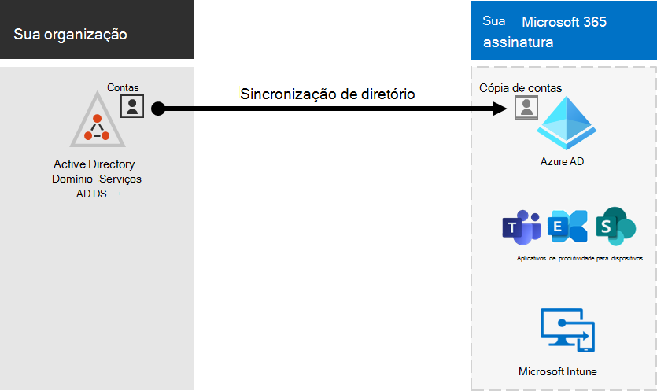
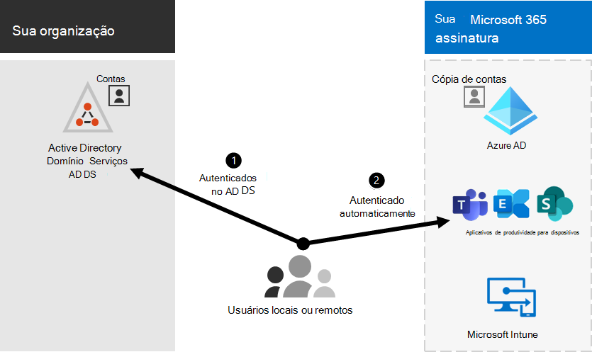

# Integração do Microsoft 365 com ambientes locaisMicrosoft 365 integration with on-premises environments

*Este artigo se aplica tanto ao Microsoft 365 Enterprise quanto ao Office 365 Enterprise.**This article applies to both Microsoft 365 Enterprise and Office 365 Enterprise.*

Você pode integrar o Microsoft 365 com seus Serviços de Domínio do Active Directory (AD DS) existentes e com instalações locais do Exchange Server, Skype for Business Server 2015 ou SharePoint Server.You can integrate Microsoft 365 with your existing on-premises Active Directory Domain Services (AD DS) and with on-premises installations of Exchange Server, Skype for Business Server 2015, or SharePoint Server.
  
 - Ao integrar o AD DS, você pode sincronizar e gerenciar contas de usuário para ambos os ambientes.When you integrate AD DS, you can synchronize and manage user accounts for both environments. Você também pode adicionar a sincronização de hash de senha (PHS) ou logoff único (SSO) para que os usuários possam fazer logoff em ambos os ambientes com suas credenciais locais.You can also add password hash synchronization (PHS) or single sign-on (SSO) so users can log on to both environments with their on-premises credentials.
 - Quando você se integra com produtos de servidor local, cria um ambiente híbrido.When you integrate with on-premises server products, you create a hybrid environment. Um ambiente híbrido pode ajudar à medida que você migra usuários ou informações para o Microsoft 365 ou pode continuar a ter alguns usuários ou algumas informações locais e algumas na nuvem.A hybrid environment can help as you migrate users or information to Microsoft 365, or you can continue to have some users or some information on-premises and some in the cloud. Para obter mais informações sobre ambientes híbridos, consulte [nuvem híbrida](../solutions/cloud-architecture-models.md#hybrid).For more information about hybrid environments, see [hybrid cloud](../solutions/cloud-architecture-models.md#hybrid).

Você também pode usar os consultores do Azure Active Directory (Azure AD) para orientação de configuração personalizada no Centro de administração do Microsoft 365 (você deve estar loco no Microsoft 365):You can also use the Azure Active Directory (Azure AD) advisors for customized setup guidance in the Microsoft 365 admin center (you must be signed in to Microsoft 365):

- [Guia de configuração do Azure ADAzure AD setup guide](https://aka.ms/aadpguidance)
- [Sincronizar usuários do diretório da sua organizaçãoSync users from your org's directory](https://aka.ms/aadconnectpwsync)
- [Consultor de implantação dos Serviços de Federação do Active Directory (AD FS)Active Directory Federation Services (AD FS) deployment advisor](https://aka.ms/adfsguidance)
   
## Antes de começarBefore you begin

Antes de integrar o Microsoft 365 e um ambiente local, você também precisa fazer planejamento de rede e ajuste [de desempenho.](network-planning-and-performance.md)Before you integrate Microsoft 365 and an on-premises environment, you also need to do [network planning and performance tuning](network-planning-and-performance.md). Você também vai querer entender os modelos de identidade [disponíveis.](about-microsoft-365-identity.md)You will also want to understand the available [identity models](about-microsoft-365-identity.md). 

Consulte [manage Microsoft 365 accounts](manage-microsoft-365-accounts.md) for a list of tools you can use to manage Microsoft 365 user accounts.See [manage Microsoft 365 accounts](manage-microsoft-365-accounts.md) for a list of tools you can use to manage Microsoft 365 user accounts. 
  
## Integrar o Microsoft 365 ao AD DSIntegrate Microsoft 365 with AD DS

Se você tiver contas de usuário existentes no AD DS, não deseja criar todas essas contas no Microsoft 365 e correr o risco de introduzir diferenças ou erros entre os ambientes.If you have existing user accounts in AD DS, you don't want to re-create all of those accounts in Microsoft 365 and risk introducing differences or errors between the environments. A sincronização de diretórios ajuda você a espelhar essas contas entre seus ambientes locais e online.Directory synchronization helps you mirror those accounts between your on-premises and online environments. Com a sincronização de diretórios, os usuários não têm que se lembrar de novas informações para cada ambiente e você não precisa criar ou atualizar contas duas vezes.With directory synchronization, your users don't have to remember new information for each environment, and you don't have to create or update accounts twice. Você precisará preparar [seu diretório local](prepare-for-directory-synchronization.md) para sincronização de diretórios.You will need to [prepare your on-premises directory](prepare-for-directory-synchronization.md) for directory synchronization.
  

  
Se você quiser que os usuários possam fazer logoff no Microsoft 365 com suas credenciais locais, você também pode configurar o SSO.If you want users to be able to log on to Microsoft 365 with their on-premises credentials, you can also configure SSO. Com o SSO, o Microsoft 365 é configurado para confiar no ambiente local para autenticação do usuário.With SSO, Microsoft 365 is configured to trust the on-premises environment for user authentication.
  

### Sincronização de diretório com ou sem sincronização de hash de senha ou autenticação de passagem (PTA)Directory synchronization with or without password hash synchronization or pass-through authentication (PTA)

Um usuário faz o login em seu ambiente local com sua conta de usuário (domínio\nome de usuário).A user logs on to their on-premises environment with their user account (domain\username). Quando eles vão para o Microsoft 365, eles devem fazer logoff novamente com sua conta de trabalho ou de estudante (user@domain.com).When they go to Microsoft 365, they must log on again with their work or school account (user@domain.com). O nome de usuário é o mesmo em ambos os ambientes.The user name is the same in both environments. Quando você adiciona PHS ou PTA, o usuário tem a mesma senha para ambos os ambientes, mas terá que fornecer essas credenciais novamente ao entrar no Microsoft 365.When you add PHS or PTA, the user has the same password for both environments, but will have to provide those credentials again when logging on to Microsoft 365. A sincronização de diretório com o PHS é a sincronização de diretório mais usada.Directory synchronization with PHS is the most commonly used directory synchronization .

Para configurar a sincronização de diretórios, use o Azure AD Connect.To set up directory synchronization, use Azure AD Connect. Para obter instruções, consulte [Set up directory synchronization for Microsoft 365](set-up-directory-synchronization.md) and [Azure AD Connect with express settings](/azure/active-directory/hybrid/how-to-connect-install-express).For instructions, see [Set up directory synchronization for Microsoft 365](set-up-directory-synchronization.md) and [Azure AD Connect with express settings](/azure/active-directory/hybrid/how-to-connect-install-express).

Saiba mais sobre [como preparar a sincronização de diretórios para o Microsoft 365](prepare-for-directory-synchronization.md).Learn more about [preparing for directory synchronization to Microsoft 365](prepare-for-directory-synchronization.md).

### Sincronização de diretório com SSODirectory synchronization with SSO

Um usuário faz o login em seu ambiente local com sua conta de usuário.A user logs on to their on-premises environment with their user account. Quando eles vão para o Microsoft 365, eles estão conectados automaticamente ou fazem logoff usando as mesmas credenciais que usam para seu ambiente local (domínio\nome de usuário).When they go to Microsoft 365, they are either logged on automatically, or they log on using the same credentials they use for their on-premises environment (domain\username).

Para configurar o SSO, você também usa o Azure AD Connect.To set up SSO you also use Azure AD Connect. Para obter instruções, consulte [Instalação personalizada do Azure AD Connect](/azure/active-directory/hybrid/how-to-connect-install-custom).For instructions, see [Custom installation of Azure AD Connect](/azure/active-directory/hybrid/how-to-connect-install-custom).

Para obter mais informações, consulte [single sign-on](/azure/active-directory/manage-apps/what-is-single-sign-on).For more information, see [single sign-on](/azure/active-directory/manage-apps/what-is-single-sign-on).

## Azure AD ConnectAzure AD Connect

O Azure AD Connect substitui versões mais antigas de ferramentas de integração de identidade, como DirSync e Sincronização do Azure AD. Se você quiser atualizar do Azure Active Directory Sync para o Azure AD Connect, consulte [as instruções de atualização](/azure/active-directory/hybrid/how-to-dirsync-upgrade-get-started).Azure AD Connect replaces older versions of identity integration tools such as DirSync and Azure AD Sync. If you want to update from Azure Active Directory Sync to Azure AD Connect, see [the upgrade instructions](/azure/active-directory/hybrid/how-to-dirsync-upgrade-get-started). 

## Confira tambémSee also

[Visão geral do Microsoft 365 EnterpriseMicrosoft 365 Enterprise overview](microsoft-365-overview.md)