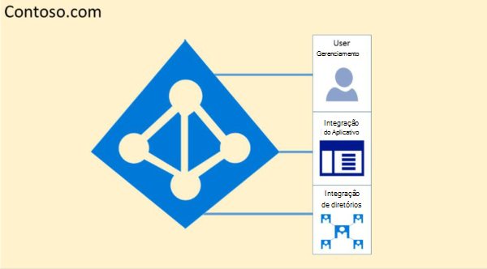
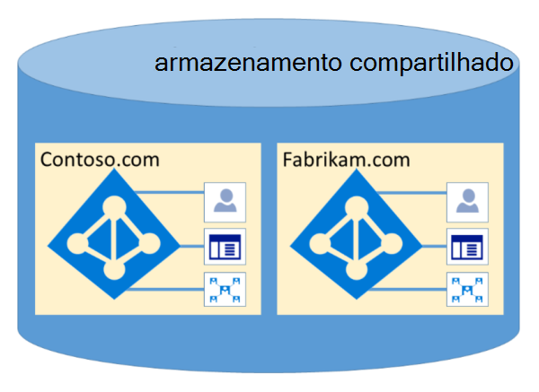

# Isolamento e controle de acesso do Microsoft 365 no Azure Active Directory

O Azure Active Directory (Azure AD) foi projetado para hospedar vários locatários de forma altamente segura através do isolamento lógico de dados. O acesso ao Azure AD é controlado por uma camada de autorização. O Azure AD isola os clientes que usam contêineres de locatário como limites de segurança para proteger o conteúdo de um cliente para que o conteúdo não possa ser acessado ou comprometido por colocatários. Três verificações são realizadas pela camada de autorização do Azure AD:

- O principal está habilitado para acesso ao locatário do Azure AD?
- O principal está habilitado para acesso aos dados neste locatário?
- A função do principal neste locatário é autorizada para o tipo de acesso a dados solicitado?

Nenhum aplicativo, usuário, servidor ou serviço pode acessar o Azure AD sem a autenticação apropriada e token ou certificado. As solicitações serão rejeitadas se não forem acompanhadas por credenciais adequadas.

Efetivamente, o Azure AD hospeda cada locatário em seu próprio contêiner protegido, com políticas e permissões para e dentro do contêiner exclusivamente proprietário e gerenciado pelo locatário.
 

O conceito de contêineres de locatário está profundamente refinado no serviço de diretório em todas as camadas, de portais de forma totalmente direcionada para o armazenamento persistente. Mesmo quando vários metadados do locatário do Azure AD são armazenados no mesmo disco físico, não há relação entre os contêineres que não são definidos pelo serviço de diretório, que, por sua vez, é determinado pelo administrador do locatário. Não pode haver conexões diretas com o armazenamento do Azure AD de qualquer aplicativo ou serviço solicitante sem passar pela camada de autorização.

No exemplo abaixo, a Contoso e a Fabrikam têm contêineres separados e dedicados, e mesmo que esses contêineres possam compartilhar algumas das mesmas infra-estruturas subjacentes, como servidores e armazenamento, eles permanecem separados e isolados uns dos outros e são restringidos por camadas de autorização e controle de acesso.
 

Além disso, não há componentes de aplicativo que podem ser executados no Azure AD, e não é possível que um locatário viole forçosamente a integridade de outro locatário, chaves de criptografia de acesso de outro locatário ou leia dados brutos do servidor.

Por padrão, o Azure AD proíbe todas as operações emitidas por identidades em outros locatários. Cada locatário é logicamente isolado no Azure AD por meio de controles de acesso baseados em declarações. Leituras e gravações de dados de diretório são delimitadas aos contêineres de locatários e restringidas por uma camada de abstração interna e uma camada de controle de acesso baseado em função (RBAC), que juntos aplicam o locatário como o limite de segurança. Todas as solicitações de acesso a dados de diretório são processadas por essas camadas e todas as solicitações de acesso no Microsoft 365 são policiadas pela lógica acima.

O Azure AD tem América do Norte, governo dos EUA, União Européia, Alemanha e partições World Wide. Há um locatário em uma única partição, e as partições podem conter vários locatários. As informações de partição são recortadas dos usuários. Uma determinada partição (incluindo todos os locatários dentro dela) é replicada em vários datacenters. A partição de um locatário é escolhida com base nas propriedades do locatário (por exemplo, o código do país). Segredos e outras informações confidenciais em cada partição são criptografados com uma chave dedicada. As chaves são geradas automaticamente quando uma nova partição é criada.

As funcionalidades do sistema do Azure AD são uma instância exclusiva para cada sessão do usuário. Além disso, o Azure AD usa tecnologias de criptografia para fornecer isolamento de recursos compartilhados do sistema no nível da rede para impedir a transferência não autorizada e indesejada das informações.
