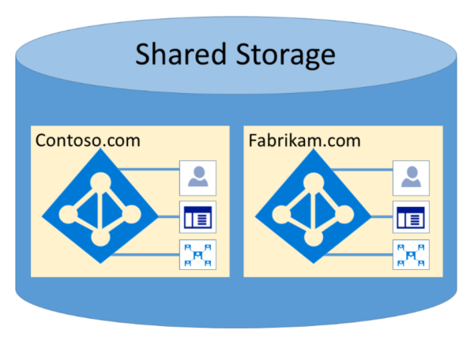

# Isolamento e controle de acesso do Microsoft 365 no Azure Active DirectoryMicrosoft 365 Isolation and Access Control in Azure Active Directory

O Azure Active Directory (Azure AD) foi projetado para hospedar vários locatários de maneira altamente segura por meio do isolamento de dados lógicos.Azure Active Directory (Azure AD) was designed to host multiple tenants in a highly secure way through logical data isolation. O acesso ao Azure AD é uma camada de autorização.Access to Azure AD is gated by an authorization layer. O Azure AD isola os clientes usando contêineres de locatário como limites de segurança para proteger o conteúdo do cliente para que o conteúdo não possa ser acessado ou comprometido por co-locatários.Azure AD isolates customers using tenant containers as security boundaries to safeguard a customer's content so that the content cannot be accessed or compromised by co-tenants. Três verificações são executadas pela camada de autorização do Azure AD:Three checks are performed by Azure AD's authorization layer:

- A entidade está habilitada para acessar o locatário do Azure AD?Is the principal enabled for access to Azure AD tenant?
- A entidade de segurança está habilitada para acessar dados neste locatário?Is the principal enabled for access to data in this tenant?
- A função da entidade de segurança neste locatário está autorizada para o tipo de acesso a dados solicitado?Is the principal's role in this tenant authorized for the type of data access requested?

Nenhum aplicativo, usuário, servidor ou serviço pode acessar o Azure AD sem a autenticação adequada e o token ou o certificado.No application, user, server, or service can access Azure AD without the proper authentication and token or certificate. As solicitações são rejeitadas se não são acompanhadas pelas credenciais adequadas.Requests are rejected if they are not accompanied by proper credentials.

Efetivamente, o Azure AD hospeda cada locatário em seu próprio contêiner protegido, com políticas e permissões para e dentro do contêiner exclusivamente de propriedade e gerenciados pelo locatário.Effectively, Azure AD hosts each tenant in its own protected container, with policies and permissions to and within the container solely owned and managed by the tenant.
 

O conceito de contêineres de locatário está profundamente insinuado no serviço de diretório em todas as camadas, desde portais até o armazenamento persistente.The concept of tenant containers is deeply ingrained in the directory service at all layers, from portals all the way to persistent storage. Mesmo quando vários metadados de locatário do Azure AD são armazenados no mesmo disco físico, não há relação entre os contêineres além do que é definido pelo serviço de diretório, que, por sua vez, é ditado pelo administrador de locatários.Even when multiple Azure AD tenant metadata is stored on the same physical disk, there is no relationship between the containers other than what is defined by the directory service, which in turn is dictated by the tenant administrator. Não pode haver conexões diretas com o armazenamento do Azure AD de qualquer aplicativo ou serviço solicitando sem passar primeiro pela camada de autorização.There can be no direct connections to Azure AD storage from any requesting application or service without first going through the authorization layer.

No exemplo a seguir, Contoso e Fabrikam têm contêineres separados e dedicados, e mesmo que esses contêineres possam compartilhar parte da mesma infraestrutura subjacente, como servidores e armazenamento, eles permanecem separados e isolados uns dos outros e isolados por camadas de autorização e controle de acesso.In the example below, Contoso and Fabrikam both have separate, dedicated containers, and even though those containers may share some of the same underlying infrastructure, such as servers and storage, they remain separate and isolated from each other, and gated by layers of authorization and access control.
 

Além disso, não há componentes de aplicativo que possam ser executados no Azure AD, e não é possível que um locatário viole à força a integridade de outro locatário, acesse chaves de criptografia de outro locatário ou leia dados brutos do servidor.In addition, there are no application components that can execute from within Azure AD, and it is not possible for one tenant to forcibly breach the integrity of another tenant, access encryption keys of another tenant, or read raw data from the server.

Por padrão, o Azure AD não permite todas as operações emitidas por identidades em outros locatários.By default, Azure AD disallows all operations issued by identities in other tenants. Cada locatário é logicamente isolado no Azure AD por meio de controles de acesso baseado em declarações.Each tenant is logically isolated within Azure AD through claims-based access controls. Leituras e gravações de dados de diretório são delimitadas para contêineres de locatários e delimitadas por uma camada de abstração interna e uma camada de controle de acesso baseado em função (RBAC), que juntos impõem o locatário como o limite de segurança.Reads and writes of directory data are scoped to tenant containers, and gated by an internal abstraction layer and a role-based access control (RBAC) layer, which together enforce the tenant as the security boundary. Cada solicitação de acesso a dados de diretório é processada por essas camadas e todas as solicitações de acesso no Microsoft 365 são controladas pela lógica acima.Every directory data access request is processed by these layers and every access request in Microsoft 365 is policed by the logic above.

O Azure AD tem partições América do Norte, Governo dos EUA, União Europeia, Alemanha e World Wide.Azure AD has North America, U.S. Government, European Union, Germany, and World Wide partitions. Um locatário existe em uma única partição, e as partições podem conter vários locatários.A tenant exists in a single partition, and partitions can contain multiple tenants. As informações de partição são abstraídos dos usuários.Partition information is abstracted away from users. Uma determinada partição (incluindo todos os locatários dentro dela) é replicada para vários datacenters.A given partition (including all the tenants within it) is replicated to multiple datacenters. A partição para um locatário é escolhida com base nas propriedades do locatário (por exemplo, o código do país).The partition for a tenant is chosen based on properties of the tenant (e.g., the country code). Segredos e outras informações confidenciais em cada partição são criptografados com uma chave dedicada.Secrets and other sensitive information in each partition is encrypted with a dedicated key. As chaves são geradas automaticamente quando uma nova partição é criada.The keys are generated automatically when a new partition is created.

As funcionalidades do sistema do Azure AD são uma instância exclusiva para cada sessão de usuário.Azure AD system functionalities are a unique instance to each user session. Além disso, o Azure AD usa tecnologias de criptografia para fornecer isolamento de recursos de sistema compartilhados no nível da rede para evitar a transferência não autorizada e não intencional de informações.In addition, Azure AD uses encryption technologies to provide isolation of shared system resources at the network level to prevent unauthorized and unintended transfer of information.
