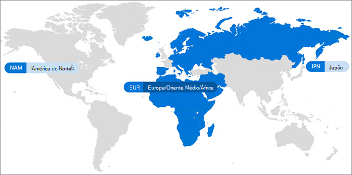

# Microsoft 365 Multi-Geo

Com o Microsoft 365 Multi-Geo, sua organização pode expandir sua presença no Microsoft 365 para várias regiões geográficas e/ou países do seu locatário existente. Entre em contato com sua equipe de contas da Microsoft para inscrever sua empresa multinacional no Microsoft 365 Multi-Geo.
  
Com o Microsoft 365 Multi-Geo, você pode provisionar e armazenar dados em repouso nos locais geográficos escolhidos para atender aos requisitos de residência de dados e, ao mesmo tempo, desbloquear sua distribuição global de experiências modernas de produtividade à sua força de trabalho.

Para obter uma introdução de vídeo ao Microsoft 365 multigeográfico, confira [SharePoint Online e onedrive multigeo para controlar onde seus dados residem](https://www.youtube.com/watch?v=Do9U3JuROhk).

## Arquitetura de várias GEOS

Em um ambiente de várias regiões, o locatário do Microsoft 365 consiste de um local central (onde sua assinatura do Microsoft 365 foi originalmente provisionada) e um ou mais locais de satélite. Em um locatário multigeográfico, as informações sobre localizações geográficas, grupos e informações do usuário são dominadas no Azure Active Directory (AAD). Como as informações de locatário são dominadas centralmente e sincronizadas em cada localização geográfica, compartilhamento e experiências envolvendo qualquer pessoa da sua empresa contêm percepção global.

Observe que o Microsoft 365 Multi-Geo não foi projetado para otimização de desempenho, ele foi projetado para atender aos requisitos da residência de dados. Para obter mais informações sobre otimização de desempenho do Microsoft 365, consulte [Planejamento de rede e ajuste de desempenho do Microsoft 365](https://support.office.com/article/e5f1228c-da3c-4654-bf16-d163daee8848) ou entre em contato com seu grupo de suporte.

## Terminologia

Aqui estão os principais termos usados na descrição do Microsoft 365 Multi-Geo:

- **Uma localização central** -a localização geográfica onde seu locatário foi originalmente provisionado.
- **Administrador geográfico**, um administrador que pode administrar um ou mais locais do satélite especificado.
- **Geocódigo** -um código de três letras de uma localização geográfica determinada.
- **Localização geográfica** – uma localização geográfica pode ser usada em um locatário multigeográfico para hospedar dados, incluindo caixas de correio do Exchange e o OneDrive e sites do SharePoint.
- **Preferenciais de dados local (PDL)** a propriedade do usuário definido pelo administrador que indica onde a localização geográfica onde a caixa de correio do Exchange usuários e do OneDrive devem ser provisionadas. A PDL determina também onde os sites do SharePoint criados pelo usuário estão provisionados.
- **Localização do satélite** – As localizações geográficas onde as cargas de trabalho do Microsoft 365 com reconhecimento geográfico (SharePoint, OneDrive e Exchange) são ativadas em um inquilino com várias geografias.
- **Locatário** – A representação de uma organização no Microsoft 365 que normalmente possui um ou mais domínios associados a ela (por exemplo, contoso.com).

## Licenciamento

O Microsoft 365 Multi-Geo está disponível como um complemento para os seguintes planos de assinatura do Microsoft 365 para os clientes da EA, com um mínimo de 250 assinaturas do Microsoft 365 em seus locatários e um mínimo de 5% desses usuários usando várias regiões. Entre em contato com a equipe de conta Microsoft para obter mais detalhes.

- Microsoft 365 F1, E1, E3 ou E5
- Exchange Online Plano 1 ou Plano 2
- OneDrive for Business Plano 1 ou Plano 2
- SharePoint Online Plano 1 ou Plano 2

## Disponibilidade do Microsoft 365 Multi-Geo

Atualmente, o Microsoft 365 Multi-Geo é oferecido nessas regiões e países:

[!INCLUDE [Microsoft 365 Multi-Geo locations](../includes/microsoft-365-multi-geo-locations.md)]

## Introdução

Siga estas etapas para iniciar com o multigeográfico:

1. Trabalhe com sua equipe de conta para adicionar os _Recursos de várias áreas geográficas no plano de serviço do Microsoft 365_. Elas orientarão você ra adicionar o número de licenças necessárias. O recurso de várias áreas geográficas está disponível para clientes da EA com no mínimo 250 assinaturas do Microsoft 365.

   Antes de começar a usar o Microsoft 365 Multi-Geo, a Microsoft precisa configurar seu locatário do Exchange Online do suporte multigeográfico. Esse processo de configuração única é acionado após o pedido do *Plano de serviços do Recursos Geográficos no Microsoft 365*, sendo que as licenças são exibidas no seu locatário. Você receberá notificações específicas de carga de trabalho no [centro de mensagens do Microsoft 365](https://support.office.com/article/38FB3333-BFCC-4340-A37B-DEDA509C2093) depois que o locatário tiver concluído o processo de configuração para cada carga de trabalho e você poderá começar a configurar e usar seus recursos multigeográfico do Microsoft 365. O tempo necessário para configurar um locatário para suporte de várias regiões varia de locatário para locatário, mas a maioria dos locatários terminam dentro de um mês após o recebimento das licenças de recurso. Locatários maiores ou mais complexos podem exigir mais tempo para concluir o processo de configuração. Entre em contato com a equipe da conta para obter detalhes sobre o seu locatário específico, caso seja necessário.

2. Leia [planejar o ambiente multigeográfico](plan-for-multi-geo.md).

3. Saiba mais sobre [administrar um ambiente multigeográfico](administering-a-multi-geo-environment.md) e [como seus usuários terão o ambiente](multi-geo-user-experience.md).

4. Quando você estiver pronto para configurar o Microsoft 365 Multi-Geo, [configure seu locatário para multigeográfico](multi-geo-tenant-configuration.md).

5. [Configurar pesquisa](configure-search-for-multi-geo.md).

## Confira também

[Multigeográfico no Exchange Online e no OneDrive](https://Aka.ms/GoMultiGeo)

[Recursos multigeográficos no OneDrive e SharePoint Online](multi-geo-capabilities-in-onedrive-and-sharepoint-online-in-microsoft-365.md)

[Recursos multigeográficos no Exchange Online](multi-geo-capabilities-in-exchange-online.md)

[Experiência da equipe em um ambiente multigeográfico](https://docs.microsoft.com/microsoftteams/teams-experience-o365odb-spo-multi-geo)
