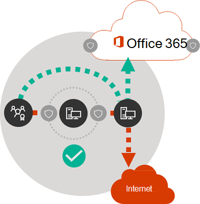

# Princípios de conectividade de rede do Microsoft 365Microsoft 365 network connectivity principles

*Este artigo se aplica tanto ao Microsoft 365 Enterprise quanto ao Office 365 Enterprise.**This article applies to both Microsoft 365 Enterprise and Office 365 Enterprise.*

Antes de começar a planejar sua rede para a conectividade de rede do Microsoft 365, é importante compreender os princípios de conectividade para gerenciar o tráfego do Microsoft 365 com segurança e obter o melhor desempenho possível.Before you begin planning your network for Microsoft 365 network connectivity, it is important to understand the connectivity principles for securely managing Microsoft 365 traffic and getting the best possible performance. Este artigo vai ajudá-lo a entender as diretrizes mais recentes para otimizar a conectividade de rede do Microsoft 365 com segurança.This article will help you understand the most recent guidance for securely optimizing Microsoft 365 network connectivity.
  
As redes corporativas tradicionais são projetadas principalmente para fornecer aos usuários acesso a aplicativos e dados hospedados em datacenters operados pela empresa com forte segurança de perímetro.Traditional enterprise networks are designed primarily to provide users access to applications and data hosted in company operated datacenters with strong perimeter security. O modelo tradicional presume que os usuários acessem aplicativos e dados de dentro do perímetro de rede corporativa, em links WAN de filiais ou remotamente por conexões VPN.The traditional model assumes that users will access applications and data from inside the corporate network perimeter, over WAN links from branch offices, or remotely over VPN connections.
  
A adoção de aplicativos SaaS como o Microsoft 365 move algumas combinações de serviços e dados de fora do perímetro de rede.Adoption of SaaS applications like Microsoft 365 moves some combination of services and data outside the network perimeter. Sem otimização, o tráfego entre usuários e aplicativos SaaS fica sujeito à latência introduzida pela inspeção de pacotes, hairpins de rede, conexões inadvertidas para pontos de extremidade geograficamente distantes e outros fatores.Without optimization, traffic between users and SaaS applications is subject to latency introduced by packet inspection, network hairpins, inadvertent connections to geographically distant endpoints and other factors. Você pode garantir o melhor desempenho e a confiabilidade da Microsoft 365 compreendendo e implementando as principais diretrizes de otimização.You can ensure the best Microsoft 365 performance and reliability by understanding and implementing key optimization guidelines.
  
Neste artigo, você aprenderá sobre:In this article, you will learn about:
  
- [A arquitetura Microsoft 365](microsoft-365-network-connectivity-principles.md#BKMK_Architecture)que se aplica à conectividade do cliente à nuvem[Microsoft 365 architecture](microsoft-365-network-connectivity-principles.md#BKMK_Architecture) as it applies to customer connectivity to the cloud
- [Princípios de conectividade do Microsoft 365](microsoft-365-network-connectivity-principles.md#BKMK_Principles) atualizados e estratégias para otimizar o tráfego de rede e a experiência do usuário finalUpdated [Microsoft 365 connectivity principles](microsoft-365-network-connectivity-principles.md#BKMK_Principles) and strategies for optimizing network traffic and the end-user experience
- O [serviço web dos pontos de extremidade do Office 365](microsoft-365-network-connectivity-principles.md#BKMK_WebSvc), que permite que os administradores de rede usem uma lista estruturada de pontos de extremidade para usar em otimização de redeThe [Office 365 Endpoints web service](microsoft-365-network-connectivity-principles.md#BKMK_WebSvc), which allows network administrators to consume a structured list of endpoints for use in network optimization
- [Novas categorias de pontos de extremidade do Office 365](microsoft-365-network-connectivity-principles.md#BKMK_Categories) e diretrizes de otimização[New Office 365 endpoint categories](microsoft-365-network-connectivity-principles.md#BKMK_Categories) and optimization guidance
- [Comparação de segurança de perímetro de rede com a segurança do ponto de extremidadeComparing network perimeter security with endpoint security](microsoft-365-network-connectivity-principles.md#BKMK_SecurityComparison)
- Opções de[otimização incremental](microsoft-365-network-connectivity-principles.md#BKMK_IncOpt) para o tráfego do Microsoft 365[Incremental optimization](microsoft-365-network-connectivity-principles.md#BKMK_IncOpt) options for Microsoft 365 traffic
- [Teste de conectividade do Microsoft 365](https://aka.ms/netonboard), uma nova ferramenta para testar a conectividade básica com o Microsoft 365The [Microsoft 365 connectivity test](https://aka.ms/netonboard), a new tool for testing basic connectivity to Microsoft 365

## Arquitetura do Microsoft 365Microsoft 365 architecture

O Microsoft 365 é uma nuvem distribuída de Software como Serviço (SaaS), que oferece cenários de produtividade e colaboração por meio de um conjunto diversificado de serviços e aplicativos, como o Exchange Online, o SharePoint Online, o Skype for Business Online, o Microsoft Teams, a Proteção do Exchange Online, o Office em um navegador e muitos outros.Microsoft 365 is a distributed Software-as-a-Service (SaaS) cloud that provides productivity and collaboration scenarios through a diverse set of micro-services and applications, such as Exchange Online, SharePoint Online, Skype for Business Online, Microsoft Teams, Exchange Online Protection, Office in a browser, and many others. Embora aplicativos específicos do Microsoft 365 possam ter seus recursos exclusivos, à medida que se aplicam à rede do cliente e conectividade com a nuvem, todos compartilham alguns princípios, metas e padrões de arquitetura.While specific Microsoft 365 applications may have their unique features as it applies to customer network and connectivity to the cloud, they all share some key principals, goals, and architecture patterns. Esses princípios e padrões de arquitetura para a conectividade são comuns em várias outras nuvens SaaS e, ao mesmo tempo, são diferentes dos modelos de implantação típicos das nuvens Plataforma como serviço e Infraestrutura como serviço, como o Microsoft Azure.These principles and architecture patterns for connectivity are typical for many other SaaS clouds and at the same time being different from the typical deployment models of Platform-as-a-Service and Infrastructure-as-a-Service clouds, such as Microsoft Azure.
  
Um dos recursos mais significativos da arquitetura Microsoft 365 (que geralmente é esquecido ou mal interpretado pelos arquitetos de rede) é um serviço distribuído verdadeiramente global, no contexto de como os usuários se conectam a ele.One of the most significant architectural features of Microsoft 365 (that is often missed or misinterpreted by network architects) is that it is a truly global distributed service, in the context of how users connect to it. O local do locatário de destino do Microsoft 365 é importante para compreender a localidade de onde os dados do cliente estão armazenados na nuvem, mas a experiência do usuário com o Microsoft 365 não envolve a conexão direta a discos que contêm os dados.The location of the target Microsoft 365 tenant is important to understand the locality of where customer data is stored within the cloud, but the user experience with Microsoft 365 doesn't involve connecting directly to disks containing the data. A experiência do usuário com o Microsoft 365 (incluindo desempenho, confiabilidade e outras características de qualidade importantes) envolve a conectividade por meio de uma porta frontal de serviço altamente distribuída que é ampliada entre centenas de locais da Microsoft em todo o mundo.The user experience with Microsoft 365 (including performance, reliability, and other important quality characteristics) involves connectivity through highly distributed service front doors that are scaled out across hundreds of Microsoft locations worldwide. Na maioria dos casos, é possível ter a melhor experiência de usuário permitindo que a rede do cliente encaminhe as solicitações de usuário para o ponto de entrada de serviço mais próximo do Microsoft 365, em vez de se conectar ao Microsoft 365 por meio de um ponto de saída em um local ou região central.In the majority of cases, the best user experience is achieved by allowing the customer network to route user requests to the closest Microsoft 365 service entry point, rather than connecting to Microsoft 365 through an egress point in a central location or region.
  
Para a maioria dos clientes, os usuários do Microsoft 365 são distribuídos em vários locais.For most customers, Microsoft 365 users are distributed across many locations. Para obter os melhores resultados, os princípios descritos neste documento devem ser examinados a partir do ponto de vista de expansão (não ampliação), concentrando-se em otimizar a conectividade para o ponto de presença mais próximo na rede global da Microsoft, não para a localização geográfica do locatário do Microsoft 365.To achieve the best results, the principles outlined in this document should be looked at from the scale-out (not scale-up) point of view, focusing on optimizing connectivity to the nearest point of presence in the Microsoft Global Network, not to the geographic location of the Microsoft 365 tenant. Em essência, isso significa que, embora os dados do locatário do Microsoft 365 possam estar armazenados em um local geográfico específico, a experiência do Microsoft 365 para esse locatário continua a ser distribuída e pode estar presente em uma localidade muito próxima (rede) de cada local do usuário final que o locatário possui.In essence, this means that even though Microsoft 365 tenant data may be stored in a specific geographic location, Microsoft 365 experience for that tenant remains distributed, and can be present in very close (network) proximity to every end-user location that the tenant has.
  
## Princípios de conectividade do Microsoft 365Microsoft 365 connectivity principles

A Microsoft recomenda os seguintes princípios para alcançar uma melhor conectividade e desempenho do Microsoft 365.Microsoft recommends the following principles to achieve optimal Microsoft 365 connectivity and performance. Use estes princípios de conectividade do Microsoft 365 para gerenciar seu tráfego e obter o melhor desempenho ao se conectar ao Microsoft 365.Use these Microsoft 365 connectivity principles to manage your traffic and get the best performance when connecting to Microsoft 365.
  
O objetivo principal no design de rede deve ser minimizar a latência, reduzindo o tempo de resposta (RTT) da sua rede para a Rede Global da Microsoft, o backbone de rede pública da Microsoft que se conecta a todos os datacenters da Microsoft com baixa latência e pontos de entrada de aplicativo em nuvem espalhados ao redor do mundo.The primary goal in the network design should be to minimize latency by reducing the round-trip time (RTT) from your network into the Microsoft Global Network, Microsoft's public network backbone that interconnects all of Microsoft's datacenters with low latency and cloud application entry points spread around the world. Você pode saber mais sobre a Rede Global da Microsoft no [Como a Microsoft cria uma rede global rápida e confiável](https://azure.microsoft.com/blog/how-microsoft-builds-its-fast-and-reliable-global-network/).You can learn more about the Microsoft Global Network at [How Microsoft builds its fast and reliable global network](https://azure.microsoft.com/blog/how-microsoft-builds-its-fast-and-reliable-global-network/).
  

### Identificar e diferenciar o tráfego do Microsoft 365Identify and differentiate Microsoft 365 traffic

  
Identificar o tráfego de rede do Microsoft 365 é o primeiro passo para diferenciar esse tráfego do tráfego de rede genérico vinculado à Internet.Identifying Microsoft 365 network traffic is the first step in being able to differentiate that traffic from generic Internet-bound network traffic. A conectividade do Microsoft 365 pode ser otimizada implementando uma combinação de abordagens, como otimização de rota de rede, regras de firewall, configurações de proxy do navegador e bypass de dispositivos de inspeção de rede para certos pontos de extremidade.Microsoft 365 connectivity can be optimized by implementing a combination of approaches like network route optimization, firewall rules, browser proxy settings, and bypass of network inspection devices for certain endpoints.
  
Diretrizes de otimização anterior do Microsoft 365 divididos em pontos de extremidade do Microsoft 365 em duas categorias, **Necessário** e **Opcional**.Previous Microsoft 365 optimization guidance divided Microsoft 365 endpoints into two categories, **Required** and **Optional**. Como os pontos de extremidade foram adicionados para dar suporte a novos recursos e serviços do Microsoft 365, reorganizamos os pontos de extremidade do Microsoft 365 em três categorias: **Otimizar**, **Permitir** e **Padrão**.As endpoints have been added to support new Microsoft 365 services and features, we have reorganized Microsoft 365 endpoints into three categories: **Optimize**, **Allow**, and **Default**. As diretrizes de cada categoria se aplicam a todos os pontos de extremidade da categoria, facilitando a compreensão e a implementação de otimizações.Guidelines for each category applies to all endpoints in the category, making optimizations easier to understand and implement.
  
Para obter mais informações sobre as categorias e os métodos de otimização do ponto de extremidade do Microsoft 365, confira a seção [Novas categorias de ponto de extremidade do Office 365](microsoft-365-network-connectivity-principles.md#BKMK_Categories).For more information on Microsoft 365 endpoint categories and optimization methods, see the [New Office 365 endpoint categories](microsoft-365-network-connectivity-principles.md#BKMK_Categories) section.
  
Agora a Microsoft publica todos os pontos de extremidade do Microsoft 365 como um serviço Web e fornece orientação sobre como usar esses dados.Microsoft now publishes all Microsoft 365 endpoints as a web service and provides guidance on how best to use this data. Para obter mais informações sobre como buscar e trabalhar com pontos de extremidade do Microsoft 365, confira o artigo [URLs e intervalos de endereços IP do Office 365](https://support.office.com/article/office-365-urls-and-ip-address-ranges-8548a211-3fe7-47cb-abb1-355ea5aa88a2?ui=en-US&amp;rs=en-US&amp;ad=US).For more information on how to fetch and work with Microsoft 365 endpoints, see the article [Office 365 URLs and IP address ranges](https://support.office.com/article/office-365-urls-and-ip-address-ranges-8548a211-3fe7-47cb-abb1-355ea5aa88a2?ui=en-US&amp;rs=en-US&amp;ad=US).
  

### Enviar conexões de rede de saída localmenteEgress network connections locally

  
O DNS local e a saída para a Internet são muito importantes para reduzir a latência da conexão e garantir que as conexões de usuários sejam feitas do ponto de entrada mais próximo para os serviços do Microsoft 365.Local DNS and Internet egress is of critical importance for reducing connection latency and ensuring that user connections are made to the nearest point of entry to Microsoft 365 services. Em uma topologia de rede complexa, é importante implementar o DNS local e a saída para a internet local juntos.In a complex network topology, it is important to implement both local DNS and local Internet egress together. Para obter mais informações sobre como o Microsoft 365 roteia as conexões do cliente para o ponto de entrada mais próximo, confira o artigo [Conectividade do Cliente](https://support.office.com/article/client-connectivity-4232abcf-4ae5-43aa-bfa1-9a078a99c78b).For more information about how Microsoft 365 routes client connections to the nearest point of entry, see the article [Client Connectivity](https://support.office.com/article/client-connectivity-4232abcf-4ae5-43aa-bfa1-9a078a99c78b).
  
Antes do surgimento dos serviços de nuvem, como o Microsoft 365, a conectividade da Internet para usuários finais como fator de design na arquitetura de rede era relativamente simples.Prior to the advent of cloud services such as Microsoft 365, end-user Internet connectivity as a design factor in network architecture was relatively simple. Quando os serviços de Internet e os sites são distribuídos em todo o mundo, a latência entre os pontos de saída corporativos e qualquer ponto de extremidade de destino é basicamente uma função de distância geográfica.When Internet services and web sites are distributed around the globe, latency between corporate egress points and any given destination endpoint is largely a function of geographical distance.
  
Em uma arquitetura de rede tradicional, todas as conexões de saída de Internet atravessam a rede corporativa e saem de um local central.In a traditional network architecture, all outbound Internet connections traverse the corporate network, and egress from a central location. À medida que as ofertas de nuvem da Microsoft amadureceram, uma arquitetura de rede distribuída voltada para a Internet se tornou fundamental para o suporte a serviços de nuvem sensível à latência.As Microsoft's cloud offerings have matured, a distributed Internet-facing network architecture has become critical for supporting latency-sensitive cloud services. A Rede Global da Microsoft foi projetada para atender aos requisitos de latência com a infraestrutura de Porta Frontal do Serviço Distribuído, uma malha dinâmica de pontos de entrada globais que roteia as conexões do serviço de nuvem de entrada para o ponto de entrada mais próximo.The Microsoft Global Network was designed to accommodate latency requirements with the Distributed Service Front Door infrastructure, a dynamic fabric of global entry points that routes incoming cloud service connections to the closest entry point. Isso se destina a reduzir o comprimento da "última quilometragem" para os clientes da nuvem da Microsoft, reduzindo a rota entre o cliente e a nuvem com eficácia.This is intended to reduce the length of the "last mile" for Microsoft cloud customers by effectively shortening the route between the customer and the cloud.
  
As WANs corporativas geralmente são projetadas para transportar o tráfego de rede para o escritório central da empresa para inspeção antes da saída para a Internet, geralmente por um ou mais servidores proxy.Enterprise WANs are often designed to backhaul network traffic to a central company head office for inspection before egress to the Internet, usually through one or more proxy servers. O diagrama a seguir ilustra essa topologia de rede.The diagram below illustrates such a network topology.
  

  
Como o Microsoft 365 é executado na Rede Global da Microsoft, que inclui servidores front-end em todo o mundo,geralmente haverá um servidor front-end próximo ao local do usuário.Because Microsoft 365 runs on the Microsoft Global Network, which includes front-end servers around the world, there will often be a front-end server close to the user's location. Fornecendo acesso à Internet local e configurando servidores DNS internos para fornecer a resolução de nomes locais para pontos de extremidade do Microsoft 365, o tráfego de rede destinado ao Microsoft 365 pode se conectar aos servidores front-end do Microsoft 365 o mais próximo possível do usuário.By providing local Internet egress and by configuring internal DNS servers to provide local name resolution for Microsoft 365 endpoints, network traffic destined for Microsoft 365 can connect to Microsoft 365 front end servers as close as possible to the user. O diagrama a seguir mostra um exemplo de uma topologia de rede que permite que os usuários se conectem a partir do escritório central, de uma filial e de locais remotos para seguir a rota mais curta até o ponto de entrada mais próximo do Microsoft 365.The diagram below shows an example of a network topology that allows users connecting from main office, branch office, and remote locations to follow the shortest route to the closest Microsoft 365 entry point.
  

  
Encurtar o caminho de rede para os pontos de entrada do Microsoft 365 dessa maneira pode melhorar o desempenho da conectividade e a experiência do usuário final no Microsoft 365, além de ajudar a reduzir o impacto de alterações futuras na arquitetura de rede no desempenho e na confiabilidade do Microsoft 365.Shortening the network path to Microsoft 365 entry points in this way can improve connectivity performance and the end-user experience in Microsoft 365, and can also help to reduce the impact of future changes to the network architecture on Microsoft 365 performance and reliability.
  
Além disso, as solicitações DNS poderão apresentar a latência se o servidor DNS de resposta estiver distante ou ocupado.Also, DNS requests can introduce latency if the responding DNS server is distant or busy. Você pode minimizar a latência de resolução de nomes ao provisionar os servidores DNS locais em filiais e verificar se eles estão configurados para armazenar em cache os registros DNS de forma adequada.You can minimize name resolution latency by provisioning local DNS servers in branch locations and making sure they are configured to cache DNS records appropriately.
  
Embora a saída regional possa funcionar bem para o Microsoft 365, o modelo de conectividade ideal seria sempre fornecer a saída de rede no local do usuário, independentemente de você estar na rede corporativa ou em locais remotos, como casas, hotéis, cafeterias e aeroportos.While regional egress can work well for Microsoft 365, the optimum connectivity model would be to always provide network egress at the user's location, regardless of whether this is on the corporate network or remote locations such as homes, hotels, coffee shops, and airports. Esse modelo de saída direta local é representado no diagrama a seguir.This local direct egress model is represented in the diagram below.
  

  
As empresas que adotaram o Microsoft 365 podem tirar proveito da arquitetura de Porta Frontal do Serviço Distribuído da Rede Global da Microsoft, garantindo que as conexões com o usuário da Microsoft 365 adotem a rota mais curta possível para o ponto de entrada mais próximo da Rede Global da Microsoft.Enterprises who have adopted Microsoft 365 can take advantage of the Microsoft Global Network's Distributed Service Front Door architecture by ensuring that user connections to Microsoft 365 take the shortest possible route to the nearest Microsoft Global Network entry point. A arquitetura de rede de saída local faz isso, permitindo que o tráfego do Microsoft 365 seja roteado pela saída mais próxima, independentemente do local do usuário.The local egress network architecture does this by allowing Microsoft 365 traffic to be routed over the nearest egress, regardless of user location.
  
A arquitetura de saída local tem os seguintes benefícios em relação ao modelo tradicional:The local egress architecture has the following benefits over the traditional model:
  
- Oferece o melhor desempenho do Microsoft 365, melhorando o comprimento da rota.Provides optimal Microsoft 365 performance by optimizing route length. as conexões de usuários finais são roteadas dinamicamente para o ponto de entrada mais próximo do Microsoft 365 pela infraestrutura de Porta Frontal do Serviço Distribuído.end-user connections are dynamically routed to the nearest Microsoft 365 entry point by the Distributed Service Front Door infrastructure.
- Reduz a carga da infraestrutura de rede corporativa, permitindo a saída local.Reduces the load on corporate network infrastructure by allowing local egress.
- Protege as conexões em ambas as extremidades, aproveitando a segurança do ponto de extremidades e os recursos de segurança da nuvem.Secures connections on both ends by leveraging client endpoint security and cloud security features.

### Evitar hairpins de redeAvoid network hairpins

  
Como regra geral, a rota mais curta e direta entre o usuário e o ponto de extremidade do Microsoft 365 oferecerão o melhor desempenho.As a general rule of thumb, the shortest, most direct route between user and closest Microsoft 365 endpoint will offer the best performance. Um hairpin de rede acontece quando o tráfego WAN ou VPN vinculado a um destino específico primeiro é direcionado primeiro para outro local intermediário (como a pilha de segurança, o broker de acesso à nuvem, ou gateway da Web baseado na nuvem), introduzindo latência e redirecionamento potencial para um ponto de extremidade distante geograficamente.A network hairpin happens when WAN or VPN traffic bound for a particular destination is first directed to another intermediate location (such as security stack, cloud access broker, of cloud-based web gateway), introducing latency and potential redirection to a geographically distant endpoint. Os hairpins de rede também podem ser causados por ineficiências de roteamento/emparelhamento ou de DNS (remoto).Network hairpins can also be caused by routing/peering inefficiencies or suboptimal (remote) DNS lookups.
  
Para garantir que a conectividade do Microsoft 365 não esteja sujeita à hairpins de rede mesmo no caso de saída local, verifique se o ISP que é usado para fornecer o acesso à Internet para o local do usuário tem uma relação de emparelhamento direto com a Rede Global da Microsoft próxima desse local.To ensure that Microsoft 365 connectivity is not subject to network hairpins even in the local egress case, check whether the ISP that is used to provide Internet egress for the user location has a direct peering relationship with the Microsoft Global Network in close proximity to that location. Você também pode configurar o roteamento de saída para enviar tráfego confiável do Microsoft 365 diretamente, em vez de fazer proxy ou encapsulamento por meio de um fornecedor terceirizado de segurança de rede baseado em nuvem ou na nuvem que processa o tráfego ligado à Internet.You may also want to configure egress routing to send trusted Microsoft 365 traffic directly, as opposed to proxying or tunneling through a third-party cloud or cloud-based network security vendor that processes your Internet-bound traffic. A resolução de nomes DNS local de pontos de extremidade do Microsoft 365 ajuda a garantir que, além do roteamento direto, os pontos de entrada mais próximos do Microsoft 365 estejam sendo usados para as conexões de usuário.Local DNS name resolution of Microsoft 365 endpoints helps to ensure that in addition to direct routing, the closest Microsoft 365 entry points are being used for user connections.
  
Se você usa serviços de rede ou segurança baseados em nuvem para o tráfego do Microsoft 365, certifique-se de que o resultado do hairpin seja avaliado e seu impacto no desempenho do Microsoft 365 seja compreendido.If you use cloud-based network or security services for your Microsoft 365 traffic, ensure that the result of the hairpin is evaluated and its impact on Microsoft 365 performance is understood. É possível fazer isso examinando o número e as localizações de locais de provedores de serviços por meio dos quais o tráfego é encaminhado em relação ao número de suas filiais e pontos de emparelhamento da Rede Global da Microsoft, qualidade da relação de emparelhamento de rede do provedor de serviços com seu ISP e com a Microsoft, e o impacto no desempenho de backhaul na infraestrutura do provedor de serviços.This can be done by examining the number and locations of service provider locations through which the traffic is forwarded in relationship to number of your branch offices and Microsoft Global Network peering points, quality of the network peering relationship of the service provider with your ISP and Microsoft, and the performance impact of backhauling in the service provider infrastructure.
  
Devido a um grande número de locais distribuídos com os pontos de entrada do Microsoft 365 e sua proximidade com os usuários finais, o roteamento de tráfego do Microsoft 365 para qualquer provedor de segurança ou rede de terceiros pode ter um impacto adverso nas conexões do Microsoft 365, caso a rede do provedor não esteja configurada para o emparelhamento ideal do Microsoft 365.Due to the large number of distributed locations with Microsoft 365 entry points and their proximity to end-users, routing Microsoft 365 traffic to any third-party network or security provider can have an adverse impact on Microsoft 365 connections if the provider network is not configured for optimal Microsoft 365 peering.
  

### Avaliar ignorar proxies, dispositivos de inspeção de tráfego e tecnologias de segurança duplicadasAssess bypassing proxies, traffic inspection devices, and duplicate security technologies

  
Os clientes empresariais devem revisar seus métodos de redução de risco e de segurança de rede especificamente para o tráfego vinculado ao Microsoft 365 e usar os recursos de segurança do Microsoft 365 para reduzir sua dependência de tecnologias de segurança de rede intrusivas, caras e com impacto no desempenho para o tráfego de rede do Microsoft 365.Enterprise customers should review their network security and risk reduction methods specifically for Microsoft 365 bound traffic and use Microsoft 365 security features to reduce their reliance on intrusive, performance impacting, and expensive network security technologies for Microsoft 365 network traffic.
  
A maioria das redes corporativas impõe a segurança de rede para o tráfego de Internet usando tecnologias como proxies, inspeção SSL, inspeção de pacotes e sistemas de prevenção contra perda de dados.Most enterprise networks enforce network security for Internet traffic using technologies like proxies, SSL inspection, packet inspection, and data loss prevention systems. Essas tecnologias oferecem redução de risco importantes para solicitações de Internet genéricas, mas podem reduzir significativamente o desempenho, a capacidade de expansão e a qualidade da experiência do usuário final quando aplicada aos pontos de extremidade do Microsoft 365.These technologies provide important risk mitigation for generic Internet requests but can dramatically reduce performance, scalability, and the quality of end user experience when applied to Microsoft 365 endpoints.
  

#### Serviços Web dos Pontos de extremidade do Office 365Office 365 Endpoints web service

Os administradores do Microsoft 365 podem usar um script ou uma chamada REST para consumir uma lista estruturada de pontos de extremidade do serviço Web de pontos de extremidade do Office 365 e atualizar as configurações de firewalls de perímetro e outros dispositivos de rede.Microsoft 365 administrators can use a script or REST call to consume a structured list of endpoints from the Office 365 Endpoints web service and update the configurations of perimeter firewalls and other network devices. Isso garantirá que o tráfego vinculado ao Microsoft 365 seja identificado, tratado adequadamente e gerenciado de forma diferente do tráfego de rede associado a sites genéricos e geralmente desconhecidos da Internet.This will ensure that traffic bound for Microsoft 365 is identified, treated appropriately and managed differently from network traffic bound for generic and often unknown Internet web sites. Para saber mais sobre como usar o serviço Web de pontos de extremidade do Office 365, confira o artigo [URLs e intervalos de endereços IP do Office 365](https://support.office.com/article/office-365-urls-and-ip-address-ranges-8548a211-3fe7-47cb-abb1-355ea5aa88a2?ui=en-US&amp;rs=en-US&amp;ad=US).For more information on how to use the Office 365 Endpoints web service, see the article [Office 365 URLs and IP address ranges](https://support.office.com/article/office-365-urls-and-ip-address-ranges-8548a211-3fe7-47cb-abb1-355ea5aa88a2?ui=en-US&amp;rs=en-US&amp;ad=US).
  
#### Scripts de PAC (Configuração Automática de Proxy)PAC (Proxy Automatic Configuration) scripts

Os administradores do Microsoft 365 podem criar scripts PAC (Configuração Automática de Proxy) que podem ser entregues aos computadores dos usuários por meio de WPAD ou de GPO.Microsoft 365 administrators can create PAC (Proxy Automatic Configuration) scripts that can be delivered to user computers via WPAD or GPO. Os scripts PAC podem ser usados para ignorar os proxies de solicitações do Microsoft 365 de usuários de WAN ou VPN, permitindo que o tráfego do Microsoft 365 use conexões diretas com a Internet em vez de atravessar a rede corporativa.PAC scripts can be used to bypass proxies for Microsoft 365 requests from WAN or VPN users, allowing Microsoft 365 traffic to use direct Internet connections rather than traversing the corporate network.
  
#### Recursos de segurança do Microsoft 365Microsoft 365 security features

A Microsoft é transparente sobre a segurança do datacenter, a segurança operacional e a redução de riscos em relação aos servidores da Microsoft 365 e aos pontos de extremidade de rede que eles representam.Microsoft is transparent about datacenter security, operational security, and risk reduction around Microsoft 365 servers and the network endpoints that they represent. Os recursos de segurança internos do Microsoft 365 estão disponíveis para reduzir o risco de segurança da rede, como Prevenção Contra Perda de Dados, Antivírus, Autenticação Multifator, Proteção de Dados do Cliente, Proteção Avançada contra Ameaças, Inteligência Contra Ameaças do Microsoft 365, Classificação de Segurança do Microsoft 365, Proteção do Exchange Online e Segurança de Rede contra DDOS.Microsoft 365 built-in security features are available for reducing network security risk, such as Data Loss Prevention, Anti-Virus, Multi-Factor Authentication, Customer Lock Box, Advanced Threat Protection, Microsoft 365 Threat Intelligence, Microsoft 365 Secure Score, Exchange Online Protection, and Network DDOS Security.
  
Para obter mais informações sobre o datacenter da Microsoft e a segurança da Rede Global, confira [Central de Confiabilidade da Microsoft](https://www.microsoft.com/trustcenter/security).For more information on Microsoft datacenter and Global Network security, see the [Microsoft Trust Center](https://www.microsoft.com/trustcenter/security).
  
## Novas categorias de pontos de extremidade do Office 365New Office 365 endpoint categories

Os pontos de extremidade do Office 365 representam um conjunto variado de endereços de rede e sub-redes.Office 365 endpoints represent a varied set of network addresses and subnets. Os pontos de extremidade podem ser URLs, endereços IP ou intervalos de IP, e alguns pontos de extremidade são listados com portas TCP/UDP específicas.Endpoints may be URLs, IP addresses or IP ranges, and some endpoints are listed with specific TCP/UDP ports. As URLs podem ser FQDN, como *account.office.net*ou uma URL curinga como *\*.office365.com*.URLs can either be an FQDN like *account.office.net*, or a wildcard URL like *\*.office365.com*.
  
> [!NOTE]
> Os locais dos pontos de extremidade do Office 365 dentro da rede não estão diretamente relacionados à localização dos dados do locatário do Microsoft 365.The locations of Office 365 endpoints within the network are not directly related to the location of the Microsoft 365 tenant data. Por esse motivo, os clientes devem examinar o Microsoft 365 como um serviço distribuído e global e não devem tentar bloquear as conexões de rede para os pontos de extremidade do Office 365 com base nos critérios geográficos.For this reason, customers should look at Microsoft 365 as a distributed and global service and should not attempt to block network connections to Office 365 endpoints based on geographical criteria.
  
Nas diretrizes anteriores para o gerenciamento de tráfego do Microsoft 365, os pontos de extremidade eram organizados em duas categorias, **Necessário** e **Opcional**.In our previous guidance for managing Microsoft 365 traffic, endpoints were organized into two categories, **Required** and **Optional**. Os pontos de extremidade de cada categoria exigiam otimizações diferentes dependendo da criticalidade do serviço e muitos clientes enfrentaram desafios ao justificar a aplicação das mesmas otimizações de rede à lista completa de URLs e endereços IP do Office 365.Endpoints within each category required different optimizations depending on the criticality of the service, and many customers faced challenges in justifying the application of the same network optimizations to the full list of Office 365 URLs and IP addresses.
  
No novo modelo, os pontos de extremidade são separados em três categorias, **Otimizar**, **Permitir**e **Padrão**, fornecendo uma tabela dinâmica baseada em prioridade sobre onde você deve focar os esforços de otimização de rede para obter os melhores aperfeiçoamentos de desempenho e retorno sobre o investimento.In the new model, endpoints are segregated into three categories, **Optimize**, **Allow**, and **Default**, providing a priority-based pivot on where to focus network optimization efforts to realize the best performance improvements and return on investment. Os pontos de extremidade são consolidados nas categorias acima, com base na sensibilidade da experiência efetiva do usuário à qualidade da rede, volume e envelope de desempenho dos cenários e facilidade de implementação.The endpoints are consolidated in the above categories based on the sensitivity of the effective user experience to network quality, volume, and performance envelope of scenarios and ease of implementation. As otimizações recomendadas podem ser aplicadas da mesma forma em todos os pontos de extremidade de uma determinada categoria.Recommended optimizations can be applied the same way to all endpoints in a given category.
  
- **Otimizar** os pontos de extremidades é necessário para a conectividade com todos os serviços do Microsoft 365 e representa mais de 75% da largura de banda, conexões e volume de dados do Office 365.**Optimize** endpoints are required for connectivity to every Office 365 service and represent over 75% of Office 365 bandwidth, connections, and volume of data. Esses pontos de extremidade representam os cenários do Office 365 mais confidenciais para o desempenho, latência e disponibilidade da rede.These endpoints represent Office 365 scenarios that are the most sensitive to network performance, latency, and availability. Todos os pontos de extremidade estão hospedados em datacenters da Microsoft.All endpoints are hosted in Microsoft datacenters. A taxa de alteração para os pontos de extremidade nesta categoria deve ser muito menor do que para os pontos de extremidade nas outras duas categorias.The rate of change to the endpoints in this category is expected to be much lower than for the endpoints in the other two categories. Essa categoria inclui um pequeno conjunto (na ordem de aproximadamente 10) de URLs principais e um conjunto de sub-redes IP dedicadas às cargas de trabalho principais do Office 365, como o Exchange Online, o SharePoint Online, o Skype for Business Online e o Microsoft Teams.This category includes a small (on the order of ~10) set of key URLs and a defined set of IP subnets dedicated to core Office 365 workloads such as Exchange Online, SharePoint Online, Skype for Business Online, and Microsoft Teams.

    Uma lista condensada de pontos de extremidade críticos muito definidos deve ajudar você a planejar e implementar otimizações de rede de alto valor para esses destinos de maneira mais rápida e fácil.A condensed list of well-defined critical endpoints should help you to plan and implement high value network optimizations for these destinations faster and easier.

    Exemplos de *Otimizar*  pontos de extremidade incluem *https://outlook.office365.com*, *https://\<tenant\>.sharepoint.com* e *https://\<tenant\>-my.sharepoint.com*.Examples of  *Optimize*  endpoints include *https://outlook.office365.com*, *https://\<tenant\>.sharepoint.com*, and *https://\<tenant\>-my.sharepoint.com*.

    Os métodos de otimização incluem:Optimization methods include:

  - Ignorar *a otimização* pontos de extremidades nos serviços e dispositivos de rede que executam a interceptação de tráfego, a descriptografia SSL, a inspeção profunda de pacotes e a filtragem de conteúdo.Bypass  *Optimize*  endpoints on network devices and services that perform traffic interception, SSL decryption, deep packet inspection, and content filtering.
  - Ignorar os dispositivos de proxy local e os serviços de proxy baseados na nuvem geralmente usados para navegação na Internet genérica.Bypass on-premises proxy devices and cloud-based proxy services commonly used for generic Internet browsing.
  - Priorizar a avaliação desses pontos de extremidade como totalmente confiável por sua infraestrutura de rede e pelos sistemas de perímetro.Prioritize the evaluation of these endpoints as fully trusted by your network infrastructure and perimeter systems.
  - Priorizar a redução ou a eliminação de backhaul da WAN e facilite o envio direto da saída baseada na Internet para esses pontos de extremidade, o mais próximo possível do que os usuários/filiais.Prioritize reduction or elimination of WAN backhauling, and facilitate direct distributed Internet-based egress for these endpoints as close to users/branch locations as possible.
  - Facilitar a conectividade direta a esses pontos de extremidade de nuvem para usuários VPN, implementando o tunelamento dividido.Facilitate direct connectivity to these cloud endpoints for VPN users by implementing split tunneling.
  - Certificar-se de que os endereços IP retornados pela resolução de nome DNS correspondam à trajetória de saída de roteamento para esses pontos de extremidade.Ensure that IP addresses returned by DNS name resolution match the routing egress path for these endpoints.
  - Priorize esses pontos de extremidade para a integração do SD-WAN para roteamento direto de latência mínima para o ponto de acesso à Internet mais próximo da rede global da Microsoft.Prioritize these endpoints for SD-WAN integration for direct, minimal latency routing into the nearest Internet peering point of the Microsoft global network.

- **Permitir** os pontos de extremidade é necessário para a conectividade com os recursos e serviços específicos do Office 365, mas não são tão sensíveis ao desempenho e à latência da rede quanto os da categoria *Otimizar*.**Allow** endpoints are required for connectivity to specific Office 365 services and features, but are not as sensitive to network performance and latency as those in the *Optimize* category. O espaço total de rede desses pontos de extremidade, desde o ponto de vista da largura de banda e a contagem de conexão também é menor.The overall network footprint of these endpoints from the standpoint of bandwidth and connection count is also smaller. Esses pontos de extremidade são dedicados ao Office 365 e estão hospedados em datacenters da Microsoft.These endpoints are dedicated to Office 365 and are hosted in Microsoft datacenters. Elas representam um amplo conjunto de microserviços do Office 365 e suas dependências (na ordem de aproximadamente 100 URLs) e devem mudar a uma taxa mais alta do que a da categoria *Otimizar*.They represent a broad set of Office 365 micro-services and their dependencies (on the order of ~100 URLs) and are expected to change at a higher rate than those in the  *Optimize*  category. Nem todos os pontos de extremidade nesta categoria estão associados a sub-redes IP dedicadas definidas.Not all endpoints in this category are associated with defined dedicated IP subnets.

    Otimizações de rede para  *Permitir*  que os pontos de extremidade possam melhorar a experiência do usuário do Office 365, mas alguns clientes podem optar por escolhê-los de forma mais restrita para minimizar as alterações na rede.Network optimizations for  *Allow*  endpoints can improve the Office 365 user experience, but some customers may choose to scope those optimizations more narrowly to minimize changes to their network.

    Exemplos de pontos de extremidade *Permitir* incluem*https://\*. protection.outlook.com* e *https://accounts.accesscontrol.windows.net*.Examples of *Allow* endpoints include *https://\*.protection.outlook.com* and *https://accounts.accesscontrol.windows.net*.

    Os métodos de otimização incluem:Optimization methods include:

  - Ignorar *a permissão* de pontos de extremidades nos serviços e dispositivos de rede que executam a interceptação de tráfego, a descriptografia SSL, a inspeção profunda de pacotes e a filtragem de conteúdo.Bypass *Allow*  endpoints on network devices and services that perform traffic interception, SSL decryption, deep packet inspection, and content filtering.
  - Priorizar a avaliação desses pontos de extremidade como totalmente confiável por sua infraestrutura de rede e pelos sistemas de perímetro.Prioritize the evaluation of these endpoints as fully trusted by your network infrastructure and perimeter systems.
  - Priorizar a redução ou a eliminação de backhaul da WAN e facilite o envio direto da saída baseada na Internet para esses pontos de extremidade, o mais próximo possível do que os usuários/filiais.Prioritize reduction or elimination of WAN backhauling, and facilitate direct distributed Internet-based egress for these endpoints as close to users/branch locations as possible.
  - Certificar-se de que os endereços IP retornados pela resolução de nome DNS correspondam à trajetória de saída de roteamento para esses pontos de extremidade.Ensure that IP addresses returned by DNS name resolution match the routing egress path for these endpoints.
  - Priorize esses pontos de extremidade para a integração do SD-WAN para roteamento direto de latência mínima para o ponto de acesso à Internet mais próximo da rede global da Microsoft.Prioritize these endpoints for SD-WAN integration for direct, minimal latency routing into the nearest Internet peering point of the Microsoft global network.

- **Os pontos de extremidade de** padrão representam as dependências e os serviços do Office 365 que não exigem otimização e podem ser tratados por redes de clientes como tráfego de Internet padrão.**Default** endpoints represent Office 365 services and dependencies that do not require any optimization, and can be treated by customer networks as normal Internet bound traffic. Alguns pontos de extremidade nesta categoria podem não estar hospedados em datacenters da Microsoft.Some endpoints in this category may not be hosted in Microsoft datacenters. Os exemplos incluem *https://odc.officeapps.live.com* e *https://appexsin.stb.s-msn.com*.Examples include  *https://odc.officeapps.live.com*  and  *https://appexsin.stb.s-msn.com*.

Para obter mais informações sobre as técnicas de otimização de rede do Office 365, confira o artigo [Gerenciando pontos de extremidade do Office 365](managing-office-365-endpoints.md).For more information about Office 365 network optimization techniques, see the article [Managing Office 365 endpoints](managing-office-365-endpoints.md).
  
## Comparando a segurança de perímetro de rede com a segurança do ponto de extremidadeComparing network perimeter security with endpoint security

O objetivo da segurança de rede tradicional é otimizar o perímetro da rede corporativa contra invasões e explorações maliciosas.The goal of traditional network security is to harden the corporate network perimeter against intrusion and malicious exploits. À medida que as organizações adotam o Microsoft 365, alguns serviços de rede e dados são parcialmente ou totalmente migrados para a nuvem.As organizations adopt Microsoft 365, some network services and data are partly or completely migrated to the cloud. Quanto à mudança fundamental da arquitetura de rede, esse processo exige uma reavaliação da segurança da rede que leva em consideração os fatores emergentes:As for any fundamental change to network architecture, this process requires a reevaluation of network security that takes emerging factors into account:
  
- À medida que os serviços de nuvem são adotados, os serviços de rede e os dados são distribuídos entre os datacenters locais e a nuvem, e a segurança de perímetro não é mais adequada por si só.As cloud services are adopted, network services and data are distributed between on-premises datacenters and the cloud, and perimeter security is no longer adequate on its own.
- Os usuários remotos se conectam aos recursos corporativos em datacenters locais e na nuvem contra locais não controlados, como casas, hotéis e cafeterias.Remote users connect to corporate resources both in on-premises datacenters and in the cloud from uncontrolled locations such as homes, hotels, and coffee shops.
- Os recursos de segurança criados para fins específicos estão cada vez mais incorporados ao serviços de nuvem e podem potencialmente complementar ou substituir os sistemas de segurança existentes.Purpose-built security features are increasingly built into cloud services and can potentially supplement or replace existing security systems.

A Microsoft oferece uma ampla variedade de recursos de segurança do Microsoft 365, além de uma orientação prescritiva para a aplicação de práticas recomendadas de segurança, que podem ajudar a garantir a segurança de dados e de rede da Microsoft 365.Microsoft offers a wide range of Microsoft 365 security features and provides prescriptive guidance for employing security best practices that can help you to ensure data and network security for Microsoft 365. As práticas recomendadas são as seguintes:Recommended best practices include the following:
  
- **Usar a MFA (autenticação multifator)** A MFA adiciona uma outra camada de proteção a uma estratégia de senha forte exigindo que os usuários confirmem uma chamada, mensagem de texto ou uma notificação de aplicativo no smartphone após inserir a senha corretamente.**Use multi-factor authentication (MFA)** MFA adds an additional layer of protection to a strong password strategy by requiring users to acknowledge a phone call, text message, or an app notification on their smart phone after correctly entering their password.

- **Usar o Microsoft Cloud App Security** Configurar políticas para controlar atividades anômalas e agir sobre ela.**Use Microsoft Cloud App Security** Configure policies to track anomalous activity and act on it. Configurar alertas com o Microsoft Cloud App Security, para que os administradores possam examinar atividades de usuário incomuns ou arriscadas, como o download de grandes quantidades de dados, várias tentativas de entrada com falha ou conexões de um endereço IP desconhecido ou perigoso.Set up alerts with Microsoft Cloud App Security so that admins can review unusual or risky user activity, such as downloading large amounts of data, multiple failed sign-in attempts, or connections from a unknown or dangerous IP addresses.

- **Configurar a Prevenção contra Perda de Dados (DLP)** A DLP permite que você identifique dados confidenciais e crie políticas que ajudam a impedir que os usuários compartilhem os dados acidentalmente ou intencionalmente.**Configure Data Loss Prevention (DLP)** DLP allows you to identify sensitive data and create policies that help prevent your users from accidentally or intentionally sharing the data. A DLP funciona em todo o Microsoft 365, incluindo o Exchange Online, o SharePoint Online e o OneDrive, para que os usuários possam se manter em conformidade sem interromper o fluxo de trabalho.DLP works across Microsoft 365 including Exchange Online, SharePoint Online, and OneDrive so that your users can stay compliant without interrupting their workflow.

- **Usar o Sistema de Proteção de Dados do Cliente** Como administrador do Microsoft 365, você pode usar o Sistema de Proteção de Dados do Cliente para controlar a forma como o engenheiro de suporte da Microsoft acessa seus dados durante uma sessão de ajuda.**Use Customer Lockbox** As a Microsoft 365 admin, you can use Customer Lockbox to control how a Microsoft support engineer accesses your data during a help session. Em casos em que o engenheiro requer acesso aos dados para solucionar e corrigir um problema, o Sistema de Proteção de Dados do Cliente permite que você aprove ou rejeite a solicitação de acesso.In cases where the engineer requires access to your data to troubleshoot and fix an issue, Customer Lockbox allows you to approve or reject the access request.

- **Usar a Classificação de Segurança do Office 365** Uma ferramenta de análise de segurança que recomenda o que você pode fazer para reduzir ainda mais o risco.**Use Office 365 Secure Score** A security analytics tool that recommends what you can do to further reduce risk. As pontuações de pontos de segurança analisa as suas configurações e atividades do Microsoft 365 e as compara a uma linha de base estabelecida pela Microsoft.Secure Score looks at your Microsoft 365 settings and activities and compares them to a baseline established by Microsoft. Você receberá uma pontuação baseada em quão alinhado você está com as práticas recomendadas de segurança.You'll get a score based on how aligned you are with best security practices.

Uma abordagem holística para a segurança aprimorada deve incluir o seguinte:A holistic approach to enhanced security should include consideration of the following:
  
- Mudar a ênfase do perímetro de segurança em relação à segurança do ponto de extremidade, aplicando recursos de segurança de cliente do Office e baseado na nuvem.Shift emphasis from perimeter security towards endpoint security by applying cloud-based and Office client security features.
  - Reduzir o perímetro de segurança para o datacenterShrink the security perimeter to the datacenter
  - Habilitação de confiança equivalente para dispositivos do usuário dentro do escritório ou em locais remotosEnable equivalent trust for user devices inside the office or at remote locations
  - Foco na proteção do local de dados e do local do usuárioFocus on securing the data location and the user location
  - As máquinas de usuário gerenciado têm confiança maior com a segurança do ponto de extremidadeManaged user machines have higher trust with endpoint security
- Gerenciar toda a segurança de informações de forma global, sem se concentrar exclusivamente no perímetroManage all information security holistically, not focusing solely on the perimeter
  - Redefinir a segurança da rede WAN e a criação da segurança de rede de perímetro, permitindo que o tráfego confiável ignore dispositivos de segurança e separe dispositivos não gerenciados para redes Wi-Fi convidadas.Redefine WAN and building perimeter network security by allowing trusted traffic to bypass security devices and separating unmanaged devices to guest Wi-Fi networks
  - Reduzir os requisitos de segurança de rede da borda da WAN corporativaReduce network security requirements of the corporate WAN edge
  - Alguns dispositivos de segurança de perímetro de rede, como firewalls, ainda são necessários, mas o carregamento é reduzidoSome network perimeter security devices such as firewalls are still required, but load is decreased
  - Garante a saída local do tráfego do Microsoft 365Ensures local egress for Microsoft 365 traffic
- Os aperfeiçoamentos podem ser abordados incrementalmente conforme descrito na seção de [Otimização incremental](microsoft-365-network-connectivity-principles.md#BKMK_IncOpt).Improvements can be addressed incrementally as described in the [Incremental optimization](microsoft-365-network-connectivity-principles.md#BKMK_IncOpt) section. Algumas técnicas de otimização podem oferecer melhores taxas de custo/benefício, dependendo de sua arquitetura de rede, e você deve escolher otimizações que fazem mais sentido para sua organização.Some optimization techniques may offer better cost/benefit ratios depending on your network architecture, and you should choose optimizations that make the most sense for your organization.

Para obter mais informações sobre segurança e conformidade com o Microsoft 365, confira o artigo [segurança do Microsoft 365](https://docs.microsoft.com/microsoft-365/security) e [segurança do Microsoft 365](https://docs.microsoft.com/microsoft-365/compliance).For more information on Microsoft 365 security and compliance, see the article [Microsoft 365 security](https://docs.microsoft.com/microsoft-365/security) and [Microsoft 365 security](https://docs.microsoft.com/microsoft-365/compliance).
  
## Otimização incrementalIncremental optimization

Representamos o modelo ideal de conectividade de rede para SaaS no início desse artigo, mas para muitas organizações de grande porte com arquiteturas de rede complexas, não será prático fazer todas essas alterações.We have represented the ideal network connectivity model for SaaS earlier in this article, but for many large organizations with historically complex network architectures, it will not be practical to directly make all of these changes. Nessa seção, discutimos várias alterações incrementais que podem ajudar a melhorar o desempenho e a confiabilidade do Microsoft 365.In this section, we discuss a number of incremental changes that can help to improve Microsoft 365 performance and reliability.
  
Os métodos que você usará para otimizar o tráfego do Microsoft 365 variam de acordo com a topologia de rede e os dispositivos de rede que você implementou.The methods you will use to optimize Microsoft 365 traffic will vary depending on your network topology and the network devices you have implemented. Grandes empresas com vários locais e práticas de segurança de rede complexas precisarão desenvolver uma estratégia que inclui a maioria dos princípios listados na seção [princípios de conectividade do Microsoft 365](microsoft-365-network-connectivity-principles.md#BKMK_Principles), enquanto organizações menores talvez precisem apenas considerar um ou dois.Large enterprises with many locations and complex network security practices will need to develop a strategy that includes most or all of the principles listed in the [Microsoft 365 connectivity principles](microsoft-365-network-connectivity-principles.md#BKMK_Principles) section, while smaller organizations might only need to consider one or two.
  
Você pode abordar a otimização como um processo incremental, aplicando cada método sucessivamente.You can approach optimization as an incremental process, applying each method successively. A tabela a seguir lista os principais métodos de otimização na ordem de seu impacto sobre a latência e a confiabilidade para o maior número de usuários.The following table lists key optimization methods in order of their impact on latency and reliability for the largest number of users.
  
|**Método de otimização****Optimization method**|**Descrição****Description**|**Impacto****Impact**|
|:-----|:-----|:-----|
|Resolução DNS local e saída da InternetLocal DNS resolution and Internet egress    |Provisionar servidores DNS locais em cada local e garantir a que as conexões do Microsoft 365 saiam para a Internet o mais próximo possível da localização do usuário.Provision local DNS servers in each location and ensure that Microsoft 365 connections egress to the Internet as close as possible to the user's location.    | Minimizar latênciaMinimize latency     Melhorar a conectividade confiável com o ponto de entrada mais próximo do Microsoft 365Improve reliable connectivity to the closest Microsoft 365 entry point    |
|Adicionar pontos de saída regionaisAdd regional egress points    |Se sua rede corporativa tiver vários locais, mas apenas um ponto de saída, adicione pontos de saída regionais para permitir que os usuários se conectem ao ponto de entrada mais próximo do Microsoft 365.If your corporate network has multiple locations but only one egress point, add regional egress points to enable users to connect to the closest Microsoft 365 entry point.    | Minimizar latênciaMinimize latency     Melhorar a conectividade confiável com o ponto de entrada mais próximo do Microsoft 365Improve reliable connectivity to the closest Microsoft 365 entry point    |
|Ignorar proxies e dispositivos de inspeçãoBypass proxies and inspection devices    |Configurar os navegadores com arquivos PAC que enviam solicitações do Microsoft 365 diretamente para pontos de saída.Configure browsers with PAC files that send Microsoft 365 requests directly to egress points.    Configurar roteadores de borda e firewalls para permitir o tráfego do Microsoft 365 sem inspeção.Configure edge routers and firewalls to permit Microsoft 365 traffic without inspection.    | Minimizar latênciaMinimize latency     Reduzir a carga em dispositivos de redeReduce load on network devices    |
|Habilitar a conexão direta para usuários VPNEnable direct connection for VPN users    |Para usuários VPN, habilite as conexões do Microsoft 365 para se conectar diretamente da rede do usuário, em vez de pelo túnel VPN, implementando o tunelamento dividido.For VPN users, enable Microsoft 365 connections to connect directly from the user's network rather than over the VPN tunnel by implementing split tunneling.    | Minimizar latênciaMinimize latency     Melhorar a conectividade confiável com o ponto de entrada mais próximo do Microsoft 365Improve reliable connectivity to the closest Microsoft 365 entry point    |
|Migrar da WAN tradicional para a SD-WANMigrate from traditional WAN to SD-WAN    |SD-WANs (Redes de Longa Distância Definidas por Software) simplificam o gerenciamento da WAN e melhoram o desempenho substituindo os roteadores WAN tradicionais por dispositivos virtuais, semelhante à virtualização de recursos de computação usando VMs (máquinas virtuais).SD-WANs (Software Defined Wide Area Networks) simplify WAN management and improve performance by replacing traditional WAN routers with virtual appliances, similar to the virtualization of compute resources using virtual machines (VMs).    | Melhorar o desempenho e a capacidade de gerenciamento do tráfego de WANImprove performance and manageability of WAN traffic     Reduzir a carga em dispositivos de redeReduce load on network devices    |

## Tópicos relacionadosRelated topics

[Visão Geral da Conectividade de Rede do Microsoft 365Microsoft 365 Network Connectivity Overview](microsoft-365-networking-overview.md)

[Gerenciar pontos de extremidade do Office 365Managing Office 365 endpoints](managing-office-365-endpoints.md)

[URLs e intervalos de endereços IP do Office 365Office 365 URLs and IP address ranges](urls-and-ip-address-ranges.md)

[URL do serviço Web e endereço IP do Office 365Office 365 IP Address and URL Web service](microsoft-365-ip-web-service.md)

[Avaliando a conectividade de rede do Microsoft 365Assessing Microsoft 365 network connectivity](assessing-network-connectivity.md)

[Planejamento de rede e ajuste de desempenho para o Microsoft 365Network planning and performance tuning for Microsoft 365](network-planning-and-performance.md)

[Ajuste de desempenho do Office 365 usando linhas de base e histórico de desempenhoOffice 365 performance tuning using baselines and performance history](performance-tuning-using-baselines-and-history.md)

[Plano de solução de problemas de desempenho do Office 365Performance troubleshooting plan for Office 365](performance-troubleshooting-plan.md)

[Redes de Distribuição de ConteúdoContent Delivery Networks](content-delivery-networks.md)

[Teste de conectividade do Microsoft 365Microsoft 365 connectivity test](https://aka.ms/netonboard)

[Como a Microsoft cria sua rede global confiável e rápidaHow Microsoft builds its fast and reliable global network](https://azure.microsoft.com/blog/how-microsoft-builds-its-fast-and-reliable-global-network/)

[Blog de rede do Office 365Office 365 Networking blog](https://techcommunity.microsoft.com/t5/Office-365-Networking/bd-p/Office365Networking)
