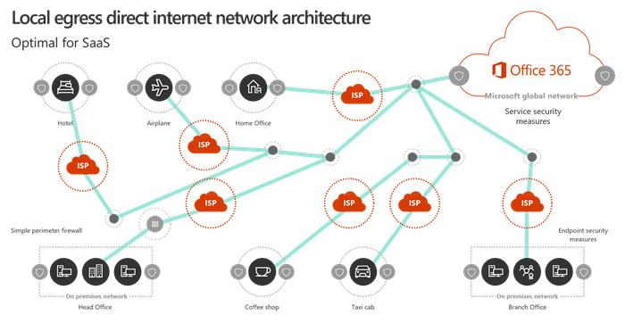

# Visão geral da conectividade de rede do Microsoft 365

*Esse artigo se aplica ao Microsoft 365 Enterprise e ao Office 365 Enterprise.*

A Microsoft 365 é uma nuvem de software (SaaS) distribuída que oferece cenários de produtividade e colaboração por meio de um conjunto variado de micro serviços e aplicativos. Os componentes do cliente do Microsoft 365 como o Outlook, o Word e o PowerPoint são executados nos computadores dos usuários e se conectam a outros componentes do Microsoft 365 executados nos datacenters da Microsoft. O fator mais significativo que determina a qualidade da experiência do usuário final da Microsoft 365 é a confiabilidade da rede e baixa latência entre os clientes do Microsoft 365 e as portas frontais de serviço do Microsoft 365.

Neste artigo, você aprenderá sobre as metas da rede do Microsoft 365 e por que a Microsoft 365 rede requer uma abordagem diferente da otimização do que o tráfego de Internet genérico.

## Metas de rede da Microsoft 365

O objetivo final da rede 365 da Microsoft é otimizar a experiência do usuário final, habilitando o acesso menos restritivo entre os clientes e os pontos de extremidade do Microsoft 365 mais próximos. A qualidade da experiência do usuário final está diretamente relacionada ao desempenho e à capacidade de resposta do aplicativo que o usuário está usando. Por exemplo, o Microsoft Teams depende de baixa latência para que as chamadas telefônicas de usuário, conferências e colaborações de tela compartilhada estejam sem problemas e o Outlook dependa da grande conectividade de rede para recursos de pesquisa instantânea que aproveitam os recursos de indexação do servidor e AI.

O objetivo principal no design de rede deve ser minimizar a latência, reduzindo o tempo de ida e volta (RTT) de máquinas clientes para a rede global da Microsoft, o backbone de rede pública da Microsoft que faz a conexão de todos os datacenters da Microsoft com a baixa latência e pontos de entrada do aplicativo de nuvem de alta disponibilidade espalhados pelo mundo. Você pode saber mais sobre a Rede Global da Microsoft no [Como a Microsoft cria uma rede global rápida e confiável](https://azure.microsoft.com/blog/how-microsoft-builds-its-fast-and-reliable-global-network/).

Otimizar o desempenho da rede Microsoft 365 não precisa ser complicado. Você pode obter o melhor desempenho possível, seguindo alguns princípios fundamentais:

- Identificar o tráfego de rede do Microsoft 365
- Permitir egresso de filial local do tráfego de rede 365 da Microsoft para a Internet de cada local onde os usuários se conectam ao Microsoft 365
- Permitir que o tráfego da Microsoft 365 ignore proxies e dispositivos de inspeção de pacotes

Para obter mais informações sobre os princípios de conectividade de rede da Microsoft 365, consulte [microsoft 365 princípios de conectividade de rede](microsoft-365-network-connectivity-principles.md).

## Arquiteturas de rede tradicionais e SaaS

Os princípios de arquitetura de rede tradicionais para cargas de trabalho do cliente/servidor são projetados em torno da pressuposição de que o tráfego entre os clientes e os pontos de extremidade não é estendido fora do perímetro da rede corporativa. Além disso, em muitas redes corporativas, todas as conexões de saída da Internet atravessam a rede corporativa e saem de um local central.

Nas arquiteturas de rede tradicionais, a maior latência para o tráfego de Internet genérico é uma compensação necessária para manter a segurança do perímetro de rede, e a otimização de desempenho para o tráfego da Internet geralmente envolve a atualização ou o dimensionamento do equipamento em pontos de saída de rede. No entanto, essa abordagem não aborda os requisitos para o desempenho ideal da rede de serviços SaaS como o Microsoft 365.

## Identificando o tráfego de rede do Microsoft 365

Estamos facilitando a identificação do tráfego de rede do Microsoft 365 e tornando mais simples o gerenciamento da identificação de rede.

- Novas categorias de pontos de extremidade de rede para diferenciar o tráfego de rede altamente crítico do tráfego de rede que não é afetado por latências de Internet. Há apenas algumas URLs e endereços IP de suporte na categoria "otimizar" mais importante.
- Serviços Web para uso de scripts ou configuração direta de dispositivos e gerenciamento de alterações da identificação de rede do Microsoft 365. As alterações estão disponíveis no serviço Web ou no formato RSS ou em email usando um modelo de fluxo da Microsoft.
- [Programa de parceria de rede do Office 365](https://aka.ms/Office365NPP) com parceiros da Microsoft que oferecem dispositivos ou serviços que seguem os princípios de conectividade de rede da Microsoft 365 e que possuem uma configuração simples.

## Protegendo conexões do Microsoft 365

O objetivo da segurança de rede tradicional é otimizar o perímetro da rede corporativa contra invasões e explorações maliciosas. A maioria das redes corporativas impõe a segurança de rede para o tráfego da Internet usando tecnologias como servidores proxy, firewalls, interrupção SSL e inspecionar, inspeção de pacote profunda e sistemas de prevenção contra perda de dados. Essas tecnologias oferecem redução de risco importantes para solicitações de Internet genéricas, mas podem reduzir significativamente o desempenho, a capacidade de expansão e a qualidade da experiência do usuário final quando aplicada aos pontos de extremidade do Microsoft 365.

A Microsoft 365 ajuda a atender às necessidades da sua organização quanto à segurança do conteúdo e à conformidade de uso de dados com recursos internos de segurança e governança projetados especificamente para os recursos e cargas de trabalho do Microsoft 365. Para obter mais informações sobre segurança e conformidade do Microsoft 365, consulte o [mapa de segurança do Office 365](https://docs.microsoft.com/office365/securitycompliance/security-roadmap). Para obter mais informações sobre as recomendações e a posição de suporte da Microsoft sobre soluções de rede avançadas que executam o processamento avançado no tráfego do Microsoft 365, consulte [usando dispositivos de rede de terceiros ou soluções no tráfego do Office 365](https://support.microsoft.com/help/2690045).

## Por que a rede Microsoft 365 é diferente?

A Microsoft 365 foi projetada para o desempenho ideal usando a segurança de ponto de extremidade e as conexões de rede criptografadas, reduzindo a necessidade de imposição de segurança do Os datacenters do Microsoft 365 estão localizados em todo o mundo e o serviço é projetado para usar vários métodos de conexão de clientes aos melhores pontos de extremidade do serviço disponíveis. Como os dados e o processamento do usuário são distribuídos entre vários datacenters da Microsoft, não há um único ponto de extremidade de rede ao qual as máquinas clientes podem se conectar. Na verdade, os dados e serviços em seu locatário do Microsoft 365 são dinamicamente otimizados pela rede global da Microsoft para se adaptar aos locais geográficos dos quais eles são acessados por usuários finais.

Determinados problemas comuns de desempenho são criados quando o tráfego do Microsoft 365 está sujeito à inspeção de pacotes e à saída centralizada:

- Alta latência pode causar um desempenho extremamente ruim de fluxos de áudio e vídeo e resposta lenta de recuperação de dados, pesquisas, colaboração em tempo real, informações de disponibilidade do calendário, conteúdo do produto e outros serviços
- As conexões de egresso de um local central derrotam os recursos de roteamento dinâmico da rede global do Microsoft 365, adicionando latência e tempo de ida e volta
- Descriptografar o tráfego de rede do Microsoft 365 protegido por SSL e criptografá-lo novamente pode causar erros de protocolo e ter risco de segurança

Reduzir o caminho de rede para os pontos de entrada do Microsoft 365, permitindo que o tráfego de saída do cliente seja o mais próximo possível do local geográfico pode melhorar o desempenho de conectividade e a experiência do usuário final no Microsoft 365. Também pode ajudar a reduzir o impacto de alterações futuras na arquitetura de rede no desempenho e na confiabilidade do Microsoft 365. O modelo de conectividade ideal é sempre fornecer egresso de rede no local do usuário, independentemente se isso está na rede corporativa ou locais remotos, como casa, hotéis, lanchonetes e aeroportos. O tráfego da Internet genérico e o tráfego de rede corporativa baseado em WAN seriam roteados separadamente e não usam o modelo de egresso direta local. Esse modelo de saída direta local é representado no diagrama a seguir.

A arquitetura de egresso local tem os seguintes benefícios para o tráfego de rede do Microsoft 365 em relação ao modelo tradicional:
  
- Oferece o melhor desempenho do Microsoft 365, melhorando o comprimento da rota. As conexões de usuário final são direcionadas dinamicamente para o ponto de entrada mais próximo da Microsoft 365 pela infraestrutura de _porta frontal de serviço distribuído_ da rede global da Microsoft, e o tráfego é então roteado internamente para os pontos de extremidade de dados e serviço na fibra de alta disponibilidade de latência ultra baixa da Microsoft.
- Reduz a carga na infraestrutura de rede corporativa, permitindo o egresso local para o tráfego do Microsoft 365, ignorando proxies e dispositivos de inspeção de tráfego.
- Protege as conexões em ambas as extremidades, aproveitando os recursos de segurança do ponto de extremidade do cliente e da nuvem, evitando a aplicação de tecnologias de segurança de rede redundantes.

> [!NOTE]
> A infraestrutura de _porta frontal de serviço distribuído_ é a borda de rede altamente disponível e escalonável da rede global da Microsoft com locais geograficamente distribuídos. Ela termina as conexões de usuário final e as roteia com eficiência dentro da rede global da Microsoft. Você pode saber mais sobre a Rede Global da Microsoft no [Como a Microsoft cria uma rede global rápida e confiável](https://azure.microsoft.com/blog/how-microsoft-builds-its-fast-and-reliable-global-network/).

Para obter mais informações sobre a compreensão e a aplicação dos princípios de conectividade de rede da Microsoft 365, consulte [microsoft 365 Network Connectivity principless](microsoft-365-network-connectivity-principles.md).

## Conclusão

Otimizar o desempenho da rede Microsoft 365 é muito bem possível para remover impedimentos desnecessários. Ao tratar as conexões do Microsoft 365 como tráfego confiável, você pode evitar que a latência seja introduzida pela inspeção de pacote e concorrência para a largura de banda do proxy. Permitir conexões locais entre máquinas clientes e pontos de extremidade do Office 365 permite que o tráfego seja direcionado dinamicamente através da rede global da Microsoft.

## Tópicos Relacionados

[Princípios de conectividade de rede do Microsoft 365](microsoft-365-network-connectivity-principles.md)

[Gerenciar pontos de extremidade do Office 365](managing-office-365-endpoints.md)

[URLs e intervalos de endereços IP do Office 365](urls-and-ip-address-ranges.md)

[URL do serviço Web e endereço IP do Office 365](microsoft-365-ip-web-service.md)

[Avaliando a conectividade de rede do Microsoft 365](assessing-network-connectivity.md)

[Planejamento de rede e ajuste de desempenho para o Microsoft 365](network-planning-and-performance.md)

[Ajuste de desempenho do Office 365 usando linhas de base e histórico de desempenho](performance-tuning-using-baselines-and-history.md)

[Plano de solução de problemas de desempenho do Office 365](performance-troubleshooting-plan.md)

[Redes de Distribuição de Conteúdo](content-delivery-networks.md)

[Teste de conectividade do Microsoft 365](https://aka.ms/netonboard)

[Como a Microsoft cria sua rede global confiável e rápida](https://azure.microsoft.com/blog/how-microsoft-builds-its-fast-and-reliable-global-network/)

[Blog de rede do Office 365](https://techcommunity.microsoft.com/t5/Office-365-Networking/bd-p/Office365Networking)
