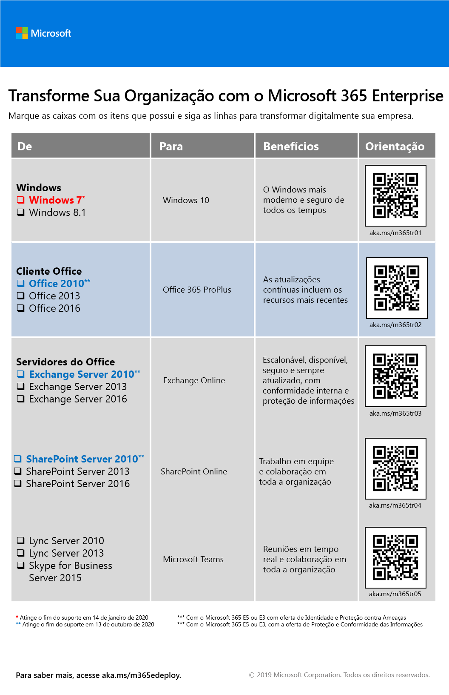
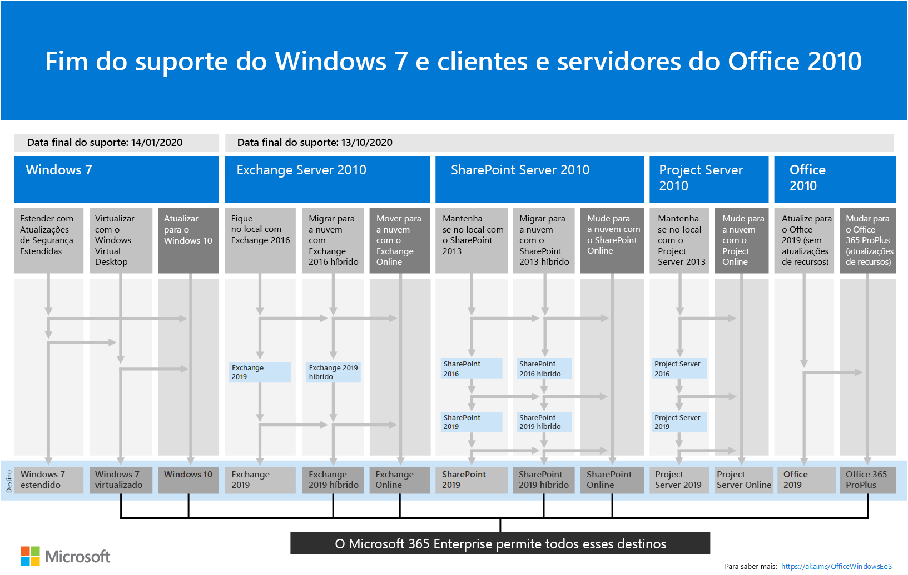

# Visão geral do Microsoft 365 Enterprise

O Microsoft 365 Enterprise é uma solução completa e inteligente que permite que todas as pessoas sejam criativas e trabalhem em conjunto com segurança. 

Embora projetado para grandes organizações, o Microsoft 365 Enterprise também pode ser usado para empresas de médio e pequeno porte que precisam dos recursos de segurança e produtividade mais avançados. 

## Componentes

O Microsoft 365 Enterprise consiste em:

|||
|:-------|:-----|
| Aplicativos baseados em nuvem e locais e serviços de produtividade | Inclui o Office 365 ProPlus, os aplicativos do Office mais recentes para seu PC e Mac (como Word, Excel, PowerPoint, Outlook e outros) e um pacote completo de serviços online para email, armazenamento de arquivos e colaboração, reuniões e muito mais. |
| Windows 10 Enterprise | Atende às necessidades de organizações de grande e médio porte, fornecendo aos usuários a versão mais produtiva e segura do Windows e dos profissionais de ti com implantação abrangente, dispositivo e gerenciamento de aplicativos. |
| Gerenciamento de dispositivos e serviços avançados de segurança | Inclui o Microsoft Intune, que é um serviço de gerenciamento de mobilidade corporativa (EMM) baseado em nuvem que ajuda a habilitar a sua força de produção, ao mesmo tempo em que os dados corporativos são protegidos. |
|||

## Planos

O Microsoft 365 Enterprise está disponível em três planos.

|||
|:-------|:-----|
| E3 | Acessar os principais produtos e recursos do Microsoft 365 para melhorar a produtividade do local de trabalho e promover a inovação, com segurança. |
| E5 | Acessar os produtos e recursos mais recentes no Microsoft 365, incluindo proteção avançada contra ameaças, ferramentas de segurança e colaboração.. Inclui todos os recursos do E3's, além de ferramentas avançadas de segurança, voz e análise de dados. |
| F1 | Conecte-se aos seus primeiros trabalhadores por meio de ferramentas e recursos desenvolvidos para fins de uso que permitam que eles façam o melhor trabalho. |
|||

Se você tiver o Microsoft 365 Enterprise E3, também poderá obter estas [ofertas](https://www.microsoft.com/microsoft-365/blog/2019/01/02/introducing-new-advanced-security-and-compliance-offerings-for-microsoft-365/):

- Identidade & proteção contra ameaças
- Proteção de informações & conformidade

Essas ofertas contêm recursos adicionais que estão incluídos no Microsoft 365 Enterprise e5.

Para obter mais informações, consulte [recursos e funcionalidades de cada plano](https://www.microsoft.com/microsoft-365/compare-all-microsoft-365-plans).

## Obter a visão geral

O [cartaz do Microsoft 365 Enterprise](media/m365-poster/Microsoft365Enterprise.pdf) é um local central para você exibir:

- Os benefícios do Microsoft 365 Enterprise e como os aplicativos e os serviços mapeiam para seus pilares de valor
- Planos do Microsoft 365 Enterprise e quais componentes eles contêm 
- Os principais componentes do local de trabalho moderno, que o Microsoft 365 Enterprise permite
- A [biblioteca de produtividade da Microsoft 365](https://www.microsoft.com/microsoft-365/success/) e os cenários representativos de alguns departamentos de organização comuns
- O roteiro de adoção que realça o guia de [implantação](deploy-microsoft-365-enterprise.md) do Microsoft 365 Enterprise

Para baixar uma cópia do pôster, clique [aqui](https://github.com/MicrosoftDocs/microsoft-365-docs/raw/public/microsoft-365/enterprise/media/m365-poster/Microsoft365Enterprise.pdf).

## Transição para toda a organização

Para ter uma ideia melhor de como migrar toda a organização para os produtos e serviços do Microsoft 365 Enterprise, baixe o [pôster de transição](media/deploy-microsoft-365-enterprise/transition-org-to-m365.pdf).

Esse pôster de duas páginas é uma maneira rápida de fazer o inventário da infraestrutura existente e obter diretrizes para migrar para o produto ou serviço correspondente no Microsoft 365 Enterprise. Ele inclui produtos do Windows e do Office, além de outros elementos de infraestrutura e segurança, como gerenciamento de dispositivo, identidade, proteção contra ameaças e informações sobre elas.

Você também pode [baixar esse pôster](https://github.com/MicrosoftDocs/microsoft-365-docs/raw/public/microsoft-365/enterprise/media/deploy-microsoft-365-enterprise/transition-org-to-m365.pdf) e imprimir em formatos de carta, oficial ou tablóide (11x17).

## Evite o fim do suporte para clientes e servidores do Windows 7 e do Office 2010

Os seguintes produtos atingem o fim do suporte em **14 de janeiro de 2020**:

- [Windows 7](https://aka.ms/win7upgrade)

Os seguintes produtos atingem o fim do suporte em **13 de outubro de 2020**:

- [Office 2010](https://docs.microsoft.com/DeployOffice/office-2010-end-support-roadmap)
- [Exchange Server 2010](https://docs.microsoft.com/office365/enterprise/exchange-2010-end-of-support)
- [SharePoint Server 2010](https://docs.microsoft.com/office365/enterprise/upgrade-from-sharepoint-2010)

Para obter um resumo visual das opções de atualização, migração e mover para nuvem para esses produtos, confira o [Pôster sobre o fim do suporte](media/migration-microsoft-365-enterprise-workload/Office2010Windows7EndOfSupport.pdf).

Este cartaz de uma página é uma maneira rápida de entender os vários caminhos que você pode tomar para impedir que os produtos de cliente e servidor do Windows 7 e Office 2010 atinjam o fim do suporte, com caminhos e suporte preferidos no Microsoft 365 Enterprise realçado.

Você também pode [baixar esse pôster](https://github.com/MicrosoftDocs/microsoft-365-docs/raw/public/microsoft-365/enterprise/media/migration-microsoft-365-enterprise-workload/Office2010Windows7EndOfSupport.pdf) e imprimir em formatos de carta, oficial ou tablóide (11x17).

## Implantar

Há três maneiras de implantar os produtos, recursos e componentes do Microsoft 365 Enterprise:

1. Em parceria com o FastTrack
  
   Com o FastTrack, os engenheiros da Microsoft ajudam você a migrar para a nuvem em seu próprio ritmo. Conferir [FastTrack para Microsoft 365](https://fasttrack.microsoft.com/microsoft365).
  
2. Com a ajuda dos serviços de consultoria da Microsoft ou de um [parceiro da Microsoft](https://partner.microsoft.com/).

   Os consultores podem analisar sua infraestrutura atual e ajudá-lo a desenvolver um plano para incorporar todos os softwares e serviços do Microsoft 365 Enterprise.

3. Faça você mesmo

   O [Guia de implantação do Microsoft 365 Enterprise](deploy-microsoft-365-enterprise.md) leva você passo a passo ao desenvolver as cargas de trabalho de infraestrutura e produtividade. 

Para obter mais informações sobre a implantação, consulte How:

- [Os clientes](deploy-microsoft-365-enterprise.md#how-customers-use-microsoft-365-enterprise) usam o Microsoft 365 Enterprise.
- A [Microsoft](deploy-microsoft-365-enterprise.md#how-microsoft-uses-microsoft-365-enterprise) usa o Microsoft 365 Enterprise.
- [A Contoso Corporation](contoso-overview.md), uma organização multinacional fictícia, mas representativa, implantou o Microsoft 365 Enterprise.

## Soluções adicionais do Microsoft 365

- [Microsoft 365 Business](https://docs.microsoft.com/microsoft-365/business/)
 
  Reúne a melhor produtividade disponível e as funcionalidades de colaboração do Office 365 com o gerenciamento de dispositivo e as soluções de segurança para proteger os dados comerciais de pequenas e médias empresas (PME).

- [Microsoft 365 Education](https://docs.microsoft.com/education)
 
  Permite aos educadores desbloquear a criatividade, além de promover o trabalho em equipe e fornecer uma experiência simples e segura em uma única solução acessível, criada para fins educacionais.

- [Governo Microsoft 365](https://www.microsoft.com/microsoft-365/government)
 
  Capacite funcionários públicos do setor público para trabalhar juntos, com segurança.

## Treinamento do Microsoft 365

|||
|:-------|:-----|
| Fique treinado e trabalhe em direção a uma certificação do Microsoft 365.   Comece com os [conceitos básicos do Microsoft 365](https://docs.microsoft.com/learn/paths/m365-fundamentals/).
|||

## Próxima etapa

Se você estiver fazendo a implantação sozinho, inicie sua [jornada de implantação do Microsoft 365 Enterprise](deploy-microsoft-365-enterprise.md).

## Confira também

[Página do produto do Microsoft 365 Enterprise](https://www.microsoft.com/microsoft-365/enterprise)
