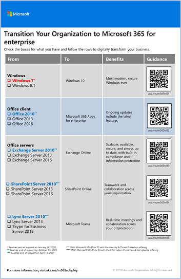

# Visão geral do Microsoft 365 para empresas

O Microsoft 365 para empresas é uma solução completa e inteligente que permite que todos sejam criativos e trabalhem juntos com segurança.

O Microsoft 365 para empresas foi projetado para grandes organizações, mas também pode ser usado para empresas de médio e pequeno porte que precisam de recursos de segurança e produtividade mais avançados.

## Componentes

O Microsoft 365 para empresas consiste em:

| Serviços | Descrição |
|:-------|:-----|
| Serviços de produtividade e aplicativos locais e baseados em nuvem | Inclui o Microsoft 365 Apps para Grandes Empresas, os Aplicativos do Office mais recentes para seu PC e Mac (como Word, Excel, PowerPoint, Outlook e outros) e um pacote completo de serviços online para email, armazenamento de arquivos e colaboração, reuniões e muito mais. |
| Windows 10 Enterprise | Atende às necessidades das organizações de grande e médio porte. É a versão mais produtiva e segura do Windows para usuários. Para profissionais de TI, ele também fornece implantação, dispositivos e gerenciamento de aplicativos abrangentes. |
| Gerenciamento de dispositivos e serviços avançados de segurança | Inclui o Microsoft Intune, que é um serviço de gerenciamento de mobilidade corporativa baseado em nuvem que ajuda a permitir que sua força de trabalho seja produtiva enquanto protege os dados de sua organização. |
|||

## Planos

O Microsoft 365 para empresas está disponível em três planos.

| Nome do plano | Recursos |
|:-------|:-----|
| E3 | Acesse os principais produtos e recursos no Microsoft 365 para melhorar a produtividade do local de trabalho e impulsionar a inovação com segurança. |
| E5 | Acesse os produtos e recursos mais recentes do Microsoft 365. Estes incluem proteção avançada contra ameaças, ferramentas de segurança e ferramentas de colaboração. Este plano inclui todos os recursos do E3, além de ferramentas avançadas de segurança, voz e análise de dados. |
| F3 | Conecte-se com seus trabalhadores de contato direito por meio de ferramentas e recursos criados especificamente para permitir que eles realizem o melhor trabalho. |
|||

Se você tem o Microsoft 365 E3, também pode obter estes complementos:

- Identidade e Proteção contra Ameaças
- Proteção de Informações e Conformidade
- [Microsoft 365 E5 Compliance](https://www.microsoft.com/microsoft-365/business/e5-compliance)
- Risco Interno do Microsoft 365 E5

Os usuários do Microsoft 365 E3 podem usar esses complementos para aproveitar os recursos adicionais que o Microsoft 365 E5 inclui.

Para saber mais, confira [Recursos e funcionalidade de cada plano](https://www.microsoft.com/microsoft-365/compare-all-microsoft-365-plans).

## Visão geral

O [pôster do Microsoft 365 para empresas](../downloads/Microsoft365Enterprise.pdf) é um local central para você exibir:

- Os benefícios do Microsoft 365 para empresas e como os aplicativos e serviços são mapeados para seus pilares de valor.
- Planos do Microsoft 365 para empresas e quais componentes eles contêm.
- Os principais componentes do Modern Workplace da Microsoft, que o Microsoft 365 para empresas habilitada.
- A [Biblioteca de Produtividade do Microsoft 365](https://www.microsoft.com/microsoft-365/success/) e cenários representativos para alguns departamentos comuns da organização.

Você também pode [baixar uma cópia do pôster](https://github.com/MicrosoftDocs/microsoft-365-docs/raw/public/microsoft-365/downloads/Microsoft365Enterprise.pdf).

## Transição para toda a organização

Para ter uma ideia melhor de como migrar toda a organização para os produtos e serviços do Microsoft 365 para empresas, consulte o [pôster de transição](../downloads/transition-org-to-m365.pdf).

Esse pôster de duas páginas é uma maneira rápida de fazer o inventário da infraestrutura existente. Ele ajuda você a encontrar orientação e a migrar para o produto ou serviço correspondente no Microsoft 365 para empresas. Ele inclui produtos do Windows e do Office, além de outros elementos de infraestrutura e segurança, como gerenciamento de dispositivo, identidade, proteção contra ameaças e informações sobre elas.

Você também pode [baixar esse pôster](https://github.com/MicrosoftDocs/microsoft-365-docs/raw/public/microsoft-365/downloads/transition-org-to-m365.pdf) e imprimir em formatos de carta, oficial ou tablóide (11x17).

## Fim do suporte para clientes e servidores do Windows 7 e Office 2010

O [Windows 7](https://aka.ms/win7upgrade) chega ao fim do suporte em **14 de janeiro de 2020**.

Esses produtos chegarão ao fim do suporte em **13 de outubro de 2020**:

- [Office 2010](https://docs.microsoft.com/DeployOffice/office-2010-end-support-roadmap)
- [Exchange Server 2010](exchange-2010-end-of-support.md)

O [SharePoint Server 2010](upgrade-from-sharepoint-2010.md) chegará ao fim do suporte em **13 de abril de 2021**.

Para obter um resumo visual das opções de atualização, migração e mover para nuvem para esses produtos, confira o [Pôster sobre o fim do suporte](../downloads/Office2010Windows7EndOfSupport.pdf).

Este pôster de uma página é uma maneira rápida de compreender os vários caminhos que você pode seguir para evitar que os produtos de cliente e servidor do Windows 7 e do Office 2010 cheguem ao fim do suporte, com caminhos preferenciais e suporte no Microsoft 365 para empresas em destaque.

Você também pode [baixar esse pôster](https://github.com/MicrosoftDocs/microsoft-365-docs/raw/public/microsoft-365/downloads/Office2010Windows7EndOfSupport.pdf) e imprimir em formatos de carta, oficial ou tablóide (11x17).

## Planejar e implantar

Há três maneiras de planejar a implantação de produtos, recursos e componentes do Microsoft 365 para empresas:

- Em parceria com o FastTrack:
  
   Com o FastTrack, os engenheiros da Microsoft ajudam você a migrar para a nuvem em seu próprio ritmo. Confira [FastTrack para Microsoft 365](https://fasttrack.microsoft.com/microsoft365).
  
- Com a ajuda dos Serviços de Consultoria da Microsoft ou de um [Parceiro da Microsoft](https://partner.microsoft.com/):

   Os consultores podem analisar sua infraestrutura atual e ajudá-lo a desenvolver um plano para incorporar todos os softwares e serviços do Microsoft 365 para empresas.

- Faça você mesmo:

   Comece com o [Roteiro de rede](networking-roadmap-microsoft-365.md) para construir ou verificar as cargas de trabalho de produtividade e infraestrutura existentes. 

Para ver um exemplo de como uma organização multinacional fictícia, mas representativa, implantou o Microsoft 365 para empresa, consulte a [Contoso Corporation](contoso-overview.md).

## Produtos adicionais do Microsoft 365

- [Microsoft 365 Business Premium](https://docs.microsoft.com/microsoft-365/business/)
 
  Reúne a melhor produtividade disponível e as funcionalidades de colaboração com o gerenciamento de dispositivo e as soluções de segurança para proteger os dados comerciais de pequenas e médias empresas.

- [Microsoft 365 Education](https://docs.microsoft.com/education)
 
  Permite aos educadores desbloquear a criatividade, além de promover o trabalho em equipe e fornecer uma experiência simples e segura em uma única solução acessível, criada para fins educacionais.

- [Microsoft 365 Government](https://www.microsoft.com/microsoft-365/government)
 
  Capacite os funcionários do setor público dos Estados Unidos a trabalharem juntos, com segurança.

## Treinamento do Microsoft 365

Para saber mais sobre o Microsoft 365 e trabalhar para obter uma certificação do Microsoft 365, comece com o [Microsoft 365 Certificado: conceitos básicos](https://docs.microsoft.com/learn/paths/m365-fundamentals/).

## Confira também

[Página de produtos do Microsoft 365 para empresas](https://www.microsoft.com/microsoft-365/enterprise)
