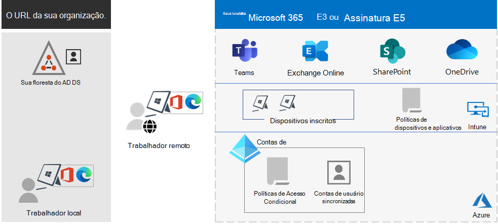

# Visão geral do Microsoft 365 para empresasMicrosoft 365 for enterprise overview

O Microsoft 365 para empresas é uma solução completa e inteligente que permite que todos sejam criativos e trabalhem juntos com segurança.Microsoft 365 for enterprise is a complete, intelligent solution that empowers everyone to be creative and work together securely.

O Microsoft 365 para empresas foi projetado para grandes organizações, mas também pode ser usado para empresas de médio e pequeno porte que precisam de recursos de segurança e produtividade mais avançados.Microsoft 365 for enterprise is designed for large organizations, but it can also be used for medium-sized and small businesses that need the most advanced security and productivity capabilities.

## ComponentesComponents

O Microsoft 365 para empresas consiste em:Microsoft 365 for enterprise consists of:

|ServiçosServices|DescriçãoDescription|
|---|---|
|Serviços de produtividade e aplicativos locais e baseados em nuvemLocal apps and cloud-based apps and productivity services|Inclui o Microsoft 365 Apps para Grandes Empresas, os Aplicativos do Office mais recentes para seu PC e Mac (como Word, Excel, PowerPoint, Outlook e outros) e um pacote completo de serviços online para email, armazenamento de arquivos e colaboração, reuniões e muito mais.Includes both Microsoft 365 Apps for enterprise, the latest Office apps for your PC and Mac (such as Word, Excel, PowerPoint, Outlook, and others), and a full suite of online services for email, file storage and collaboration, meetings, and more.|
|Windows 10 EnterpriseWindows 10 Enterprise|Atende às necessidades das organizações de grande e médio porte.Meets the needs of both large and midsize organizations. É a versão mais produtiva e segura do Windows para usuários.It's the most productive and secure version of Windows for users. Para profissionais de TI, ele também fornece implantação, dispositivos e gerenciamento de aplicativos abrangentes.For IT professionals, it also provides comprehensive deployment, device, and app management.|
|Gerenciamento de dispositivos e serviços avançados de segurançaDevice management and advanced security services|Inclui o Microsoft Intune, que é um serviço de gerenciamento de mobilidade corporativa baseado em nuvem que ajuda a permitir que sua força de trabalho seja produtiva enquanto protege os dados de sua organização.Includes Microsoft Intune, which is a cloud-based enterprise mobility management service that helps enable your workforce to be productive while protecting your organization data.|
|||

## PlanosPlans

O Microsoft 365 para empresas está disponível em três planos.Microsoft 365 for enterprise is available in three plans.

|Nome do planoPlan name|RecursosCapabilities|
|---|---|
|E3E3|Acesse os principais produtos e recursos no Microsoft 365 para melhorar a produtividade do local de trabalho e impulsionar a inovação com segurança.Access the Microsoft 365 core products and features to securely enhance workplace productivity and drive innovation.|
|E5E5|Acesse os produtos e recursos mais recentes do Microsoft 365.Access the Microsoft 365 latest products and features. Isso inclui Defender para Office 365, ferramentas de segurança e ferramentas de colaboração.These include Defender for Office 365, security tools, and collaboration tools. Este plano inclui todos os recursos do E3, além de ferramentas avançadas de segurança, voz e análise de dados.This plan includes all E3 capabilities, plus advanced security, voice, and data analysis tools.|
|F3F3|Conecte-se com seus trabalhadores de contato direito por meio de ferramentas e recursos criados especificamente para permitir que eles realizem o melhor trabalho.Connect with your first-line workers through purpose-built tools and resources that they can use to help them do their best work.|
|||

Se você tem o Microsoft 365 E3, também pode obter estes complementos:If you have Microsoft 365 E3, you can also get these add-ons:

- Identidade e Proteção contra AmeaçasIdentity & Threat Protection
- Proteção de Informações e ConformidadeInformation Protection & Compliance
- [Microsoft 365 E5 ComplianceMicrosoft 365 E5 Compliance](https://www.microsoft.com/microsoft-365/business/e5-compliance)
- Risco Interno do Microsoft 365 E5Microsoft 365 E5 Insider Risk

Os usuários do Microsoft 365 E3 podem usar esses complementos para aproveitar os recursos adicionais que o Microsoft 365 E5 inclui.Microsoft 365 E3 users can use these add-ons to take advantage of some of the additional features Microsoft 365 E5 includes.

Para saber mais, confira [Recursos e funcionalidade de cada plano](https://www.microsoft.com/microsoft-365/compare-all-microsoft-365-plans).For more information, see [Features and capabilities for each plan](https://www.microsoft.com/microsoft-365/compare-all-microsoft-365-plans).

## Visão geralGet the big picture

O [pôster do Microsoft 365 para empresas](../downloads/Microsoft365Enterprise.pdf) é um local central para você exibir:The [Microsoft 365 for enterprise poster](../downloads/Microsoft365Enterprise.pdf) is a central location for you to view:

- Os benefícios do Microsoft 365 para empresas e como os aplicativos e serviços são mapeados para seus pilares de valor.The benefits of Microsoft 365 for enterprise, and how apps and services map to its value pillars.
- Planos do Microsoft 365 para empresas e quais componentes eles contêm.Microsoft 365 for enterprise plans and which components they contain.
- Os principais componentes do Modern Workplace da Microsoft, que o Microsoft 365 para empresas habilitada.The key components of the Microsoft modern workplace, which Microsoft 365 for enterprise enables.
- A [Biblioteca de Produtividade do Microsoft 365](https://www.microsoft.com/microsoft-365/success/) e cenários representativos para alguns departamentos comuns da organização.The [Microsoft 365 Productivity Library](https://www.microsoft.com/microsoft-365/success/) and representative scenarios for some common organization departments.

Você também pode [baixar uma cópia do pôster](https://github.com/MicrosoftDocs/microsoft-365-docs/raw/public/microsoft-365/downloads/Microsoft365Enterprise.pdf).You can also [download a copy of the poster](https://github.com/MicrosoftDocs/microsoft-365-docs/raw/public/microsoft-365/downloads/Microsoft365Enterprise.pdf).

## Transição para toda a organizaçãoTransition your entire organization

Para ter uma ideia melhor de como migrar toda a organização para os produtos e serviços do Microsoft 365 para empresas, consulte o [pôster de transição](https://download.microsoft.com/download/2/c/7/2c7bcc04-aae3-4604-9707-1ffff66b9851/transition-org-to-m365.pdf).To get a better picture about how to move your entire organization to the products and services in Microsoft 365 for enterprise, see the [transition poster](https://download.microsoft.com/download/2/c/7/2c7bcc04-aae3-4604-9707-1ffff66b9851/transition-org-to-m365.pdf).

Esse pôster de duas páginas é uma maneira rápida de fazer o inventário da infraestrutura existente.This two-page poster is a quick way to inventory your existing infrastructure. Ele ajuda você a encontrar orientação e a migrar para o produto ou serviço correspondente no Microsoft 365 para empresas.It helps you to find guidance and move to the corresponding product or service in Microsoft 365 for enterprise. Ele inclui produtos do Windows e do Office, além de outros elementos de infraestrutura e segurança, como gerenciamento de dispositivo, identidade, proteção contra ameaças e informações sobre elas.It includes Windows and Office products and other infrastructure and security elements, such as device management, identity, and information and threat protection.

## Fim do suporte para clientes e servidores do Windows 7 e Office 2010End of support for Windows 7 and Office 2010 clients and servers

O [Windows 7](https://aka.ms/win7upgrade) chega ao fim do suporte em **14 de janeiro de 2020**.[Windows 7](https://aka.ms/win7upgrade) reached end of support on **January 14, 2020**.

Estes produtos chegaram ao fim do suporte em **13 de outubro de 2020**:These products reached end of support on **October 13, 2020**:

- [Office 2010Office 2010](https://docs.microsoft.com/DeployOffice/office-2010-end-support-roadmap)
- [Exchange Server 2010Exchange Server 2010](exchange-2010-end-of-support.md)

O [SharePoint Server 2010](upgrade-from-sharepoint-2010.md) chegará ao fim do suporte em **13 de abril de 2021**.[SharePoint Server 2010](upgrade-from-sharepoint-2010.md) will reach end of support on **April 13, 2021**.

Para obter um resumo visual das opções de atualização, migração e mover para nuvem para esses produtos, confira o [Pôster sobre o fim do suporte](../downloads/Office2010Windows7EndOfSupport.pdf).For a visual summary of the upgrade, migrate, and move-to-the-cloud options for these products, see the [end of support poster](../downloads/Office2010Windows7EndOfSupport.pdf).

Este pôster de uma página é uma maneira rápida de compreender os vários caminhos que você pode seguir para evitar que os produtos de cliente e servidor do Windows 7 e do Office 2010 cheguem ao fim do suporte, com caminhos preferenciais e suporte no Microsoft 365 para empresas em destaque.This one-page poster is a quick way to understand the various paths you can take to prevent Windows 7 and Office 2010 client and server products from reaching end of support, with preferred paths and support in Microsoft 365 for enterprise highlighted.

Você também pode [baixar esse pôster](https://github.com/MicrosoftDocs/microsoft-365-docs/raw/public/microsoft-365/downloads/Office2010Windows7EndOfSupport.pdf) e imprimir em formatos de carta, oficial ou tablóide (11x17).You can also [download this poster](https://github.com/MicrosoftDocs/microsoft-365-docs/raw/public/microsoft-365/downloads/Office2010Windows7EndOfSupport.pdf) and print it in letter, legal, or tabloid (11 x 17) formats.

## Planejar e implantarPlan for and deploy

Existem três maneiras de planejar e implementar os produtos, recursos e componentes do Microsoft 365 para empresas:There are three ways to plan for and deploy the products, features, and components of Microsoft 365 for enterprise:

- Em parceria com o FastTrackIn partnership with FastTrack

   Com o FastTrack, os engenheiros da Microsoft ajudam você a migrar para a nuvem em seu próprio ritmo.With FastTrack, Microsoft engineers help you move to the cloud at your own pace. Confira [FastTrack para Microsoft 365](https://fasttrack.microsoft.com/microsoft365).See [FastTrack for Microsoft 365](https://fasttrack.microsoft.com/microsoft365).

- Com a ajuda dos Serviços de Consultoria da Microsoft ou de um [parceiro da Microsoft](https://partner.microsoft.com/)With the help of Microsoft Consulting Services or a [Microsoft partner](https://partner.microsoft.com/)

   Os consultores podem analisar sua infraestrutura atual e ajudá-lo a desenvolver um plano para incorporar todos os softwares e serviços do Microsoft 365 para empresas.Consultants can analyze your current infrastructure and help you develop a plan to incorporate all the software and services of Microsoft 365 for enterprise.

- Faça você mesmoDo it yourself

   Inicie com o [Roteiro da Rede](networking-roadmap-microsoft-365.md) para construir ou verificar sua infra-estrutura existente e cargas de trabalho de produtividade.Start with the [Networking roadmap](networking-roadmap-microsoft-365.md) to build out or verify your existing infrastructure and productivity workloads.

Para um exemplo de como uma organização multinacional fictícia mas representativa implantou o Microsoft 365 para empresas, veja o [estudo de caso da Corporação Contoso](contoso-overview.md).For an example of how a fictional but representative multinational organization has deployed Microsoft 365 for enterprise, see the [Contoso Corporation case study](contoso-overview.md).

## Produtos adicionais do Microsoft 365Additional Microsoft 365 products

- [Microsoft 365 Business PremiumMicrosoft 365 Business Premium](https://docs.microsoft.com/microsoft-365/business/)

  Reúne a melhor produtividade disponível e as funcionalidades de colaboração com o gerenciamento de dispositivo e as soluções de segurança para proteger os dados comerciais de pequenas e médias empresas.Bring together the best-in-class productivity and collaboration capabilities with device management and security solutions to safeguard business data for small and midsize businesses.

- [Microsoft 365 EducationMicrosoft 365 Education](https://docs.microsoft.com/education)

  Permite aos educadores desbloquear a criatividade, além de promover o trabalho em equipe e fornecer uma experiência simples e segura em uma única solução acessível, criada para fins educacionais.Empower educators to unlock creativity, promote teamwork, and provide a simple and safe experience in a single, affordable solution built for education.

- [Microsoft 365 GovernmentMicrosoft 365 Government](https://www.microsoft.com/microsoft-365/government)

  Capacite os funcionários do setor público dos Estados Unidos a trabalharem juntos, com segurança.Empower United States public sector employees to work together, securely.

## Melhor junto com Surface e o navegador Microsoft EdgeBest together with Surface and the Edge browser

Otimize a produtividade integrada e segura do seu usuário com a melhor combinação conjunta do Microsoft 365 para empresas, dispositivos Microsoft Surface e o navegador Microsoft Edge.Optimize your user’s integrated and secure productivity with the best-together combination of Microsoft 365 for enterprise, Microsoft Surface devices, and the Microsoft Edge browser. Esta integração entre produtos oferece:This cross-product integration provides:

- Uma identidade comum e infraestrutura de segurança de entrada.A common identity and sign-in security infrastructure.
- Aplicativos locais e em nuvem integrados para pesquisa, colaboração, produtividade e conformidade.Integrated local and cloud apps for search, collaboration, productivity, and compliance.
- Segurança abrangente e integrada para hardware, navegador, aplicativo local e aplicativos em nuvem.Comprehensive and integrated security for hardware, browser, local app, and cloud apps.
- Uma infra-estrutura comum para o gerenciamento de instalações e atualizações de TI.A common infrastructure for IT management of installs and updates.

Aqui está um exemplo para uma organização empresarial.Here is an example for an enterprise organization.

Para obter mais informações e exemplos de configuração para uma pequena e média empresa e uma instituição educacional, baixe o [Cartaz Melhor Juntos](https://download.microsoft.com/download/2/8/d/28db0cf9-2f5a-4f63-91e2-46ff5c4d3baf/microsoft-best-together-poster.pdf).For more information and configuration examples for a small and medium business and an educational institution, download the [Best together poster](https://download.microsoft.com/download/2/8/d/28db0cf9-2f5a-4f63-91e2-46ff5c4d3baf/microsoft-best-together-poster.pdf).

## Treinamento do Microsoft 365Microsoft 365 training

Para saber mais sobre o Microsoft 365 e trabalhar para obter uma certificação do Microsoft 365, comece com o [Microsoft 365 Certificado: conceitos básicos](https://docs.microsoft.com/learn/paths/m365-fundamentals/).To learn more about Microsoft 365 and work toward a Microsoft 365 certification, you can start with [Microsoft 365 Certified: Fundamentals](https://docs.microsoft.com/learn/paths/m365-fundamentals/).

## Confira tambémSee also

[Página de produtos do Microsoft 365 para empresasMicrosoft 365 for enterprise product page](https://www.microsoft.com/microsoft-365/enterprise)
