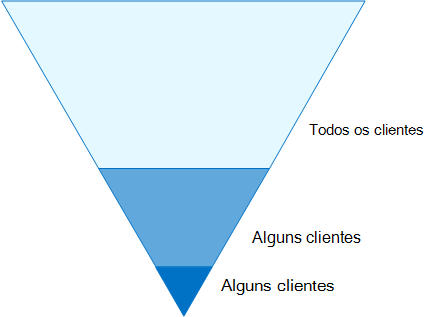
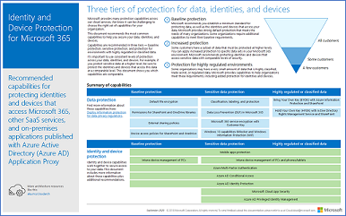
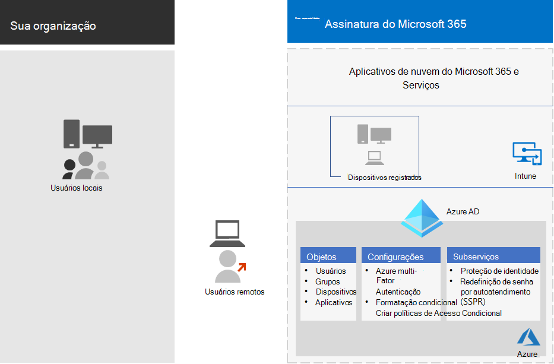
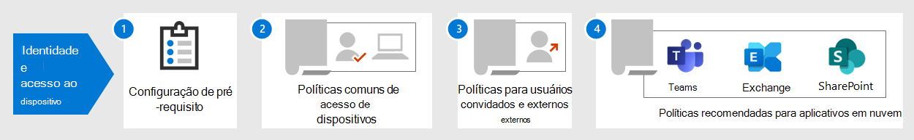

# Identidade e configurações de acesso ao dispositivo

Esta série de artigos descreve como configurar o acesso seguro aos serviços de nuvem através da Microsoft 365 para produtos corporativos, implementando um ambiente e uma configuração recomendados, incluindo um conjunto prescrito de políticas de acesso condicional e recursos relacionados. Você pode usar estas diretrizes para proteger o acesso a todos os serviços integrados ao Azure Active Directory (Azure AD), incluindo serviços do Microsoft 365, outros serviços SaaS e aplicativos locais publicados com o proxy de aplicativo do Azure AD.

Estas recomendações:

- São alinhados com a [Pontuação segura da Microsoft](https://docs.microsoft.com/microsoft-365/security/mtp/microsoft-secure-score) , bem como a [Pontuação de identidade no Azure ad](https://docs.microsoft.com/azure/active-directory/fundamentals/identity-secure-score), e aumentará essas pontuações para sua organização
- O ajudará a implementar essas [cinco etapas para proteger sua infraestrutura de identidade](https://docs.microsoft.com/azure/security/azure-ad-secure-steps). 

Se sua organização tiver requisitos ou complexidades de ambiente exclusivos, use essas recomendações como ponto de partida. No entanto, a maioria das organizações pode implementar essas recomendações conforme prescrito.

>[!Note]
>A Microsoft também vende licenças do Enterprise Mobility + Security (EMS) para assinaturas do Office 365. Os recursos do EMS E3 e do EMS E5 são aproximadamente equivalentes àqueles no Microsoft 365 E3 e Microsoft 365 e5. Consulte [EMS Plans](https://www.microsoft.com/en-us/microsoft-365/enterprise-mobility-security/compare-plans-and-pricing) para obter detalhes.
>

## Público-alvo

Essas recomendações são direcionadas para arquitetos corporativos e profissionais de ti que estão familiarizados com o Microsoft 365 Cloud Productivity and Security Services, que inclui o Azure AD (identidade), o Microsoft Intune (gerenciamento de dispositivos) e a proteção de informações do Azure (proteção de dados).

### Ambiente do cliente

As políticas recomendadas são aplicáveis a organizações corporativas operando totalmente dentro da nuvem da Microsoft e para clientes com infraestrutura de identidade híbrida, que é uma floresta local do AD DS (serviços de domínio Active Directory) que é sincronizada com um locatário do Azure AD.

Muitas das recomendações fornecidas dependem de serviços disponíveis somente no Microsoft 365 e5, Microsoft 365 E3 com a identidade & complemento de proteção contra ameaças, EMS E5 ou licenças do Azure Premium P2.

Para as organizações que não têm essas licenças, a Microsoft recomenda que você pelo menos implemente os [padrões de segurança](https://docs.microsoft.com/azure/active-directory/fundamentals/concept-fundamentals-security-defaults), que estão incluídos em todos os planos do Microsoft 365. 

### ADVERTÊNCIAS

Sua organização pode estar sujeita à regulamentação ou outros requisitos de conformidade, incluindo recomendações específicas que podem exigir que você aplique políticas que divergem dessas configurações recomendadas. Essas configurações recomendam controles de uso que historicamente não estavam disponíveis. Recomendamos esses controles, pois acreditamos que eles representam um equilíbrio entre segurança e produtividade.  

Fizemos nosso melhor para obter uma ampla variedade de requisitos de proteção organizacional, mas não é possível considerar todos os requisitos possíveis ou todos os aspectos exclusivos da sua organização.

## Três camadas de proteção

A maioria das organizações tem requisitos específicos sobre segurança e proteção de dados. Esses requisitos variam por segmento do setor e por funções de trabalho dentro das organizações. Por exemplo, seu departamento jurídico e seus administradores podem exigir segurança adicional e controles de proteção de informações em torno de suas correspondências de email que não são necessárias para outras unidades de negócios. 

Cada setor também tem seu próprio conjunto de normas especializadas. Em vez de fornecer uma lista de todas as opções de segurança possíveis ou uma recomendação por segmento do setor ou função de trabalho, as recomendações foram fornecidas para três camadas diferentes de segurança e proteção que podem ser aplicadas com base na granularidade das suas necessidades.

- **Proteção de linha de base**: Recomendamos que você estabeleça um padrão mínimo para proteger os dados, bem como as identidades e dispositivos que acessam seus dados. Você pode seguir estas recomendações de linha de base para fornecer uma proteção padrão forte que atenda às necessidades de muitas organizações.
- **Proteção confidencial**: alguns clientes têm um subconjunto de dados que devem ser protegidos em níveis mais altos ou podem exigir que todos os dados sejam protegidos em um nível mais alto. Você pode aplicar maior proteção a todos ou a conjuntos de dados específicos no seu ambiente do Microsoft 365. É recomendável proteger identidades e dispositivos que acessam dados confidenciais com níveis compatíveis de segurança.  
- **Altamente regulamentado**: algumas organizações podem ter uma pequena quantidade de dados altamente classificados, constituindo segredos comerciais ou dados regulamentados. A Microsoft fornece recursos para ajudar as organizações a atender a esses requisitos, incluindo proteção adicional para identidades e dispositivos.

Esta orientação mostra como implementar a proteção de identidades e dispositivos para cada uma dessas camadas de proteção. Use estas orientações como ponto de partida para sua organização e ajuste as políticas para atender aos requisitos específicos da sua organização.

É importante usar níveis consistentes de proteção para dados, identidades e dispositivos. Por exemplo, se você implementar este guia, certifique-se de proteger seus dados em níveis comparáveis. 

O modelo de arquitetura de **identidade e proteção de dispositivo para o Microsoft 365** mostra quais recursos são comparáveis.

    [Exibir como um PDF](../downloads/MSFT_cloud_architecture_identity&device_protection.pdf) \| [Baixar como um PDF](https://github.com/MicrosoftDocs/microsoft-365-docs/raw/public/microsoft-365/downloads/MSFT_cloud_architecture_identity&device_protection.pdf) \| [Baixar como um Visio](https://github.com/MicrosoftDocs/microsoft-365-docs/raw/public/microsoft-365/downloads/MSFT_cloud_architecture_identity&device_protection.vsdx)  

Além disso, consulte a solução [implantar o Information Protection for Data Privacy Regulations](../solutions/information-protection-deploy.md) para proteger as informações armazenadas no Microsoft 365.

## Vantagens e desvantagens de produtividade e segurança

Implementar qualquer estratégia de segurança exige variações entre segurança e produtividade. É útil avaliar como cada decisão afeta o equilíbrio de segurança, funcionalidade e facilidade de uso.

As recomendações fornecidas são baseadas nos seguintes princípios:

- Conheça seus usuários e seja flexível em seus requisitos de segurança e funcionais.
- Aplique uma política de segurança no momento e assegure-se de que ela seja significativa.

## Serviços e conceitos de proteção de acesso de dispositivo e identidade

O Microsoft 365 for Enterprise foi projetado para grandes organizações para permitir que todos sejam criativos e trabalhem em conjunto com segurança.

Esta seção fornece uma visão geral dos serviços e recursos do Microsoft 365 que são importantes para o acesso a identidades e dispositivos.

### Azure AD

O Azure AD fornece um pacote completo de recursos de gerenciamento de identidades. É recomendável usar esses recursos para proteger o acesso.

| Capcidade ou recurso | Descrição | Licenças |
|:-------|:-----|:-------|
| [MFA (Autenticação Multifator)](/azure/active-directory/authentication/concept-mfa-howitworks) | A MFA exige que os usuários forneçam duas formas de verificação, como a senha de um usuário, além de uma notificação do aplicativo Microsoft Authenticator ou de uma chamada telefônica. A MFA reduz muito o risco de que as credenciais roubadas podem ser usadas para acessar seu ambiente. A Microsoft 365 usa o serviço de autenticação multifator do Azure para os logins baseados em MFA. | Microsoft 365 E3 ou E5 |
| [Acesso condicional](/azure/active-directory/conditional-access/overview) | O Azure AD avalia as condições de entrada do usuário e usa políticas de acesso condicional para determinar o acesso permitido. Por exemplo, neste guia, mostraremos como criar uma política de acesso condicional para exigir a conformidade do dispositivo para acessar dados confidenciais. Isso reduz muito o risco de que um hacker com seu próprio dispositivo e credenciais roubadas possa acessar seus dados confidenciais. Ele também protege dados confidenciais nos dispositivos, porque os dispositivos devem atender a requisitos específicos de integridade e segurança. | Microsoft 365 E3 ou E5 |
| [Grupos do Azure AD](/azure/active-directory/fundamentals/active-directory-manage-groups) | As políticas de acesso condicional, gerenciamento de dispositivos com o Intune e até mesmo permissões para arquivos e sites em sua organização dependem da atribuição para contas de usuário ou grupos do Azure AD. Recomendamos que você crie grupos do Azure AD que correspondam aos níveis de proteção que você está implementando. Por exemplo, sua equipe executiva é provavelmente metas de valor mais alto para hackers. Portanto, faz sentido adicionar as contas de usuário desses funcionários a um grupo do Azure AD e atribuir esse grupo a políticas de acesso condicional e outras políticas que impõem um nível mais alto de proteção para o Access. | Microsoft 365 E3 ou E5 |
| [Registro do dispositivo](/azure/active-directory/devices/overview) | Você inscreve um dispositivo no Azure AD para criar uma identidade para o dispositivo. Essa identidade é usada para autenticar o dispositivo quando um usuário entra e para aplicar as políticas de acesso condicional que exigem computadores associados ou em conformidade com o domínio. Para este guia, usamos o registro de dispositivos para registrar automaticamente os computadores Windows associados ao domínio. O registro de dispositivo é um pré-requisito para gerenciar dispositivos com o Intune. | Microsoft 365 E3 ou E5 |
| [Azure AD Identity Protection](/azure/active-directory/identity-protection/overview) | Permite que você detecte possíveis vulnerabilidades que afetam as identidades da sua organização e configure a política de correção automatizada para riscos de entrada baixa, média e alta e o risco do usuário. Este guia depende dessa avaliação de risco para aplicar políticas de acesso condicional para a autenticação multifator. Este guia também inclui uma política de acesso condicional que exige que os usuários alterem a senha se for detectada atividade de alto risco para a conta. | Microsoft 365 e5, Microsoft 365 E3 com a identidade & Complementos de proteção contra ameaças, EMS E5 ou Azure Premium P2 licenças |
| [Redefinição de senha de autoatendimento (SSPR)](/azure/active-directory/authentication/concept-sspr-howitworks) | Permita que os usuários redefinam suas senhas com segurança e sem a intervenção do técnico, fornecendo a verificação de vários métodos de autenticação que o administrador pode controlar. | Microsoft 365 E3 ou E5 |
| [Proteção de senha do Azure ad](https://docs.microsoft.com/azure/active-directory/authentication/concept-password-ban-bad). Detectar e bloquear senhas fracas conhecidas e suas variantes e termos fracos adicionais que são específicos para sua organização. As listas de senhas globais excluídas padrão são automaticamente aplicadas a todos os usuários em um locatário do Azure AD. Você pode definir entradas adicionais em uma lista personalizada de senhas proibidas. Quando os usuários alteram ou redefinem suas senhas, essas listas de senhas proibidas são verificadas para impor o uso de senhas seguras. |  Microsoft 365 E3 ou E5 |
||||

### Microsoft Intune

O [Intune](https://docs.microsoft.com/intune/introduction-intune) é o serviço de gerenciamento de dispositivo móvel baseado em nuvem da Microsoft. Este guia recomenda o gerenciamento de dispositivos dos computadores Windows com o Intune e recomenda as configurações de política de conformidade de dispositivos. O Intune determina se os dispositivos são compatíveis e envia esses dados para o Azure AD usar ao aplicar políticas de acesso condicional.

#### Proteção de aplicativos do Intune

As políticas de [proteção de aplicativos do Intune](https://docs.microsoft.com/intune/app-protection-policy) podem ser usadas para proteger os dados da sua organização em aplicativos móveis, com ou sem registrar dispositivos no gerenciamento. O Intune ajuda a proteger as informações, assegurando que seus funcionários ainda possam ser produtivos e evitando a perda de dados. Ao implementar políticas de nível de aplicativo, você pode restringir o acesso aos recursos da empresa e manter os dados dentro do controle do departamento de ti.

Esta orientação mostra como criar políticas recomendadas para impor o uso de aplicativos aprovados e para determinar como esses aplicativos podem ser usados com seus dados corporativos.

### Microsoft 365

Esta orientação mostra como implementar um conjunto de políticas para proteger o acesso aos serviços de nuvem da Microsoft 365, incluindo o Microsoft Teams, o Exchange Online, o SharePoint Online e o OneDrive for Business. Além de implementar essas políticas, recomendamos que você também aumente o nível de proteção para o locatário usando estes recursos:

- [Configure seu locatário para aumentar a segurança](../security/office-365-security/tenant-wide-setup-for-increased-security.md)

  Recomendações que se aplicam à segurança de linha de base para seu locatário.

- [Mapa de segurança: as principais prioridades para os primeiros 30 dias, 90 dias e depois](../security/office-365-security/security-roadmap.md)

  Recomendações que incluem registro em log, governança de dados, acesso de administrador e proteção contra ameaças.

### Aplicativos do Windows 10 e do Microsoft 365 para empresas

O Windows 10 com o Microsoft 365 aplicativos para empresas é o ambiente de cliente recomendado para computadores. Recomendamos o Windows 10 porque o Azure foi projetado para fornecer a experiência mais suave possível para o AD local e o AD do Azure. O Windows 10 também inclui recursos avançados de segurança que podem ser gerenciados por meio do Intune. O Microsoft 365 Apps for Enterprise inclui as versões mais recentes dos aplicativos do Office. Eles usam autenticação moderna, que é mais segura e um requisito para acesso condicional. Esses aplicativos também incluem ferramentas aprimoradas de segurança e conformidade.

## Aplicação desses recursos nas três camadas de proteção

A tabela a seguir resume nossas recomendações para usar esses recursos nas três camadas de proteção.

|Mecanismo de proteção|Linha de base|Confidencial|Altamente controlado|
|:-------------------|:-------|:--------|:---------------|
|**Impor a MFA**|No risco de entrada médio ou acima|No risco de entrada baixo ou acima|Em todas as novas sessões|
|**Impor alteração de senha**|Para usuários de alto risco|Para usuários de alto risco|Para usuários de alto risco|
|**Impor a proteção de aplicativos do Intune**|Sim|Sim|Sim|
|**Impor o registro do Intune para o dispositivo de propriedade da organização**|Exigir um computador de conformidade ou ingressado no domínio, mas permitir que os telefones e tablets do BYOD (os próprios dispositivos)|Exigir um dispositivo em conformidade ou ingressado no domínio|Exigir um dispositivo em conformidade ou ingressado no domínio|

## Propriedade do dispositivo

A tabela acima reflete a tendência de muitas organizações a oferecer suporte a uma combinação de dispositivos de organização, bem como pessoais ou BYODs para habilitar a produtividade móvel em toda a força de mesa. As políticas de proteção de aplicativos do Intune garantem que o email seja protegido de exfiltrating fora do aplicativo móvel do Outlook e outros aplicativos do Office Mobile, em dispositivos de organização e no BYODs.  

Recomendamos que os dispositivos pertencentes à organização sejam gerenciados pelo Intune ou pelo ingresso no domínio para aplicar proteções e controle adicionais. Dependendo da confidencialidade de dados, sua organização pode optar por não permitir o BYODs para populações de usuários específicos ou aplicativos específicos.

## Etapas no processo de configuração de identidade e acesso de dispositivo

1. Configure os recursos de identidade de pré-requisito e suas configurações.
2. Configure as políticas de acesso condicional de identidade e acesso comuns.
3. Configure as políticas de acesso condicional para usuários convidados e externos.
4. Configure as políticas de acesso condicional para aplicativos de nuvem do Microsoft 365, como o Microsoft Teams, o Exchange Online e o SharePoint.

## Próxima etapa

[Trabalho de pré-requisito para implementar as políticas de acesso de dispositivo e identidade](identity-access-prerequisites.md)
