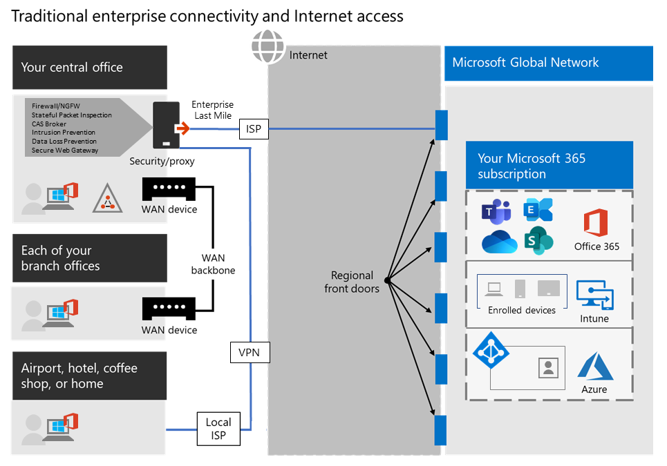

# <a name="implementing-vpn-split-tunneling-for-office-365"></a>Implementando o túnel dividido de VPN para Office 365

>[!NOTE]
>Este tópico faz parte de um conjunto de tópicos que abordam a otimização do Office 365 para usuários remotos.
>- Para obter uma visão geral de como usar o túnel dividido de VPN para otimizar a conectividade do Office 365 para usuários remotos, confira [Visão geral: túnel dividido de VPN Split o Office 365](microsoft-365-vpn-split-tunnel.md).
>- Para saber mais sobre como otimizar o desempenho do locatário mundial do Office 365 para usuários na China, confira [Otimização de desempenho do Office 365 para usuários da China](microsoft-365-networking-china.md).

Por muitos anos, as empresas usam VPNs para oferecer suporte a experiências remotas para seus usuários. Enquanto as cargas de trabalho principais permaneciam no local, uma VPN do cliente remoto roteada através de um datacenter na rede corporativa era o principal método para os usuários remotos acessarem os recursos corporativos. Para proteger essas conexões, as empresas criam camadas de soluções de segurança de rede em todos os caminhos de VPN. Isso foi feito para proteger a infraestrutura interna, e também para proteger a navegação móvel de sites externos redirecionando o tráfego para a VPN e, em seguida, no perímetro da Internet local. VpNs, perímetros de rede e infraestrutura de segurança associada geralmente eram construídos e dimensionados para um volume definido de tráfego, normalmente com a maioria da conectividade sendo iniciada de dentro da rede corporativa, e a maioria delas permanece dentro dos limites internos da rede.

Por algum tempo, os modelos de VPN onde todas as conexões do dispositivo de usuário remoto eram roteadas de volta para a rede local (conhecido como **túnel forçado**) eram muito sustentáveis, desde que a escala simultânea dos usuários remotos fosse modesta, e os volumes de tráfego que atravessavam a VPN fossem baixos.  Alguns clientes continuaram usando o túnel forçado de VPN como status quo, mesmo depois que os aplicativos migraram de dentro do perímetro corporativo para as nuvens de SaaS públicos, sendo o Office 365 um excelente exemplo.

O uso de tunelamento forçado de VPNs para conectar-se a aplicativos de nuvem de acesso distribuído e de desempenho é extremamente subótimo, mas o impacto negativo dele foi aceito por algumas empresas para manter o status quo a partir de um perspectiva de segurança. Veja um exemplo de diagrama deste cenário:



Esse problema vem crescendo há alguns anos, com vários clientes relatando uma mudança significativa de padrões de tráfego de rede. O tráfego que costumava permanecer no local agora se conecta a pontos de extremidade de nuvem externos. Vários clientes da Microsoft relatam que, anteriormente, cerca de 80% do tráfego de rede era para alguma fonte interna (representada pela linha pontilhada no diagrama acima). Em 2020, esse número agora está aproximadamente em 20% ou menos, já que eles mudaram as principais cargas de trabalho para a nuvem, essas tendências não são incomuns em outras empresas. Com o tempo, à medida que a jornada na nuvem progride, o modelo acima se torna cada vez mais complicado e insustentável, impedindo que uma organização se movimente durante a mudança para a nuvem.

A crise mundial do COVID-19 escalou esse problema para exigir correção imediata. A necessidade de garantir a segurança dos funcionários gerou demandas sem precedentes na TI corporativa para oferecer suporte à produtividade do trabalho em casa em grande escala. O Microsoft Office 365 está bem posicionado para ajudar os clientes a atender a essa demanda, mas a alta simulta dos usuários que trabalham em casa gera um grande volume de tráfego do Office 365 que, se roteado através de túnel forçado VPN e perímetros de rede local, causa saturação rápida e executa a infraestrutura VPN fora de capacidade. Nessa nova realidade, o uso da VPN para acessar o Office 365 não é mais apenas um impedimento de desempenho, mas uma parede dura que não só afeta o Office 365, mas operações comerciais críticas que ainda têm de depender da VPN para operar.

A Microsoft está trabalhando com os clientes e com o setor mais amplo há muitos anos para fornecer soluções eficazes e modernas para esses problemas dentro de nossos próprios serviços, além de se alinhar com a práticas recomendadas do setor. [Os princípios de conectividade](./microsoft-365-network-connectivity-principles.md) do serviço do Office 365 foram projetados para funcionar de forma eficiente para usuários remotos, embora ainda permitam que uma organização mantenha a segurança e o controle sobre a conectividade. Essas soluções também podem ser implementadas com mais rapidez, com um trabalho limitado, o que resulta em um impacto significativo considerável sobre os problemas descritos acima.

A estratégia recomendada pela Microsoft para otimizar a conectividade do trabalhador remoto tem como foco resolver rapidamente os problemas com a abordagem tradicional e oferecer alto desempenho com algumas etapas simples. Estas etapas ajustam a abordagem vpn herdada para um pequeno número de pontos de extremidade definidos que ignoram servidores VPN a gargalos. É possível aplicar um modelo de segurança equivalente ou superior a diferentes camadas para remover a necessidade de proteger todo o tráfego na saída da rede corporativa. Na maioria dos casos, isso pode ser efetivamente realizado em poucas horas e é escalonável para outras cargas de trabalho, conforme a demanda e o tempo dos requisitos.

## <a name="common-vpn-scenarios"></a>Cenários de VPN comuns

Na lista abaixo, você verá os cenários mais comuns de VPN vistos em ambientes corporativos. A maioria dos clientes tradicionalmente opera o modelo 1 (tunelamento forçado de VPN). Esta seção ajudará você a fazer uma transição rápida e segura para o **modelo 2**, que pode ser alcançado com relativamente pouco esforço e tem enormes benefícios para o desempenho da rede e a experiência do usuário.

| **Model** | **Descrição** |
| --- | --- |
| [1. Túnel forçado VPN ](#1-vpn-forced-tunnel) | 100% do tráfego entra no túnel VPN, incluindo local, Internet e todos os O365/M365 |
| [2. Túnel forçado de VPN com poucas exceções](#2-vpn-forced-tunnel-with-a-small-number-of-trusted-exceptions) | O túnel da VPN é usado por padrão (pontos de rota padrão para a VPN), com poucos cenários isentos mais importantes que têm permissão para ir direto |
| [3. Túnel forçado de VPN com várias exceções](#3-vpn-forced-tunnel-with-broad-exceptions) | O túnel VPN é usado por padrão (pontos de rota padrão para o VPN), com exceções abrangentes que podem ser acessadas diretamente (como todas as do Office 365, todas Salesforce, Zoom) |
| [4. Túnel seletivo de VPN](#4-vpn-selective-tunnel) | O túnel VPN é usado apenas para serviços baseados em corpnet. A rota padrão (Internet e todos os serviços baseados na Internet) é direta. |
| [5. sem VPN](#5-no-vpn) | Uma variação de #2, onde, em vez de VPN herdada, todos os serviços de corpnet são publicados por meio de abordagens de segurança modernas (como Zscaler ZPA, Proxy/MCAS do Azure Active Directory (Azure AD), etc.) |

### <a name="1-vpn-forced-tunnel"></a>1. Túnel forçado VPN 

Este é o cenário mais comum para a maioria dos clientes empresariais. Uma VPN forçada é usada, o que significa que 100% do tráfego é direcionado para a rede corporativa, independentemente de o ponto de extremidade residir na rede corporativa ou não. Qualquer tráfego de entrada externo (Internet), como o Office 365 ou a navegação na Internet, é retirado do equipamento de segurança local, como proxies. No ambiente atual, com aproximadamente 100% dos usuários trabalhando remotamente, esse modelo, portanto, coloca uma carga extremamente alta na infraestrutura de VPN e provavelmente prejudica significativamente o desempenho de todo o tráfego corporativo e, portanto, a empresa opera com eficiência em um hora da crise.


### <a name="2-vpn-forced-tunnel-with-a-small-number-of-trusted-exceptions"></a>2. VPN com tunelamento forçado com um pequeno número de exceções confiáveis

Esse modelo é significativamente mais eficiente para uma empresa operar sob, pois permite um pequeno número de pontos de extremidade controlados e definidos que são muito altos de carga e latência confidenciais para ignorar o túnel VPN e ir direto para o serviço do Office 365 neste exemplo. Isso melhora significativamente o desempenho dos serviços descarregados e também reduz a carga na infraestrutura VPN, permitindo que os elementos que ainda exigem que ele opere com menor contenção de recursos. É nesse modelo que este artigo se concentra em ajudar na transição, pois permite que ações simples e definidas sejam tomadas muito rapidamente com vários resultados positivos.


### <a name="3-vpn-forced-tunnel-with-broad-exceptions"></a>3. Túnel forçado de VPN com várias exceções

O terceiro modelo amplia o escopo do modelo dois, em vez de apenas enviar um pequeno grupo de pontos de extremidade definidos diretamente, em vez disso, envia todo o tráfego diretamente para serviços confiáveis, como Office 365 e SalesForce. Isso reduz ainda mais a carga da infraestrutura VPN corporativa e melhora o desempenho dos serviços definidos. Como esse modelo provavelmente levará mais tempo para avaliar a viabilidade de e implementar, provavelmente é uma etapa que pode ser tomada iterativamente em uma data posterior, uma vez que o modelo dois é implementado com êxito.


### <a name="4-vpn-selective-tunnel"></a>4. Túnel seletivo de VPN

Esse modelo inverte o terceiro modelo no caso de um endereço IP corporativo ser enviado para o encapsulamento VPN, portanto, o caminho da Internet é a rota padrão para todo o resto. Esse modelo exige que uma organização esteja bem no caminho para [Confiança Zero ](https://www.microsoft.com/security/zero-trust?rtc=1) em poder implementar esse modelo com segurança. Deve-se observar que esse modelo ou uma variação dele provavelmente se tornará o padrão necessário ao mesmo tempo, uma vez que mais serviços sairão da rede corporativa para a nuvem. A Microsoft usa esse modelo internamente; você pode encontrar mais informações sobre a implementação da rede de túnel dividido de VPN em [Execução em VPN: Como a Microsoft mantém sua força de trabalho remota conectada](https://www.microsoft.com/itshowcase/blog/running-on-vpn-how-microsoft-is-keeping-its-remote-workforce-connected/?elevate-lv).


### <a name="5-no-vpn"></a>5. sem VPN

Uma versão mais avançada do modelo número dois, em que qualquer serviço interno é publicado por meio de uma abordagem de segurança moderna ou solução SDWAN, como Proxy do Azure AD, MCAS, ZSCALER ZPA, etc.


## <a name="implement-vpn-split-tunneling"></a>Implementar o túnel dividido de VPN

Nesta seção, você encontrará as etapas simples necessárias para migrar a sua arquitetura de cliente VPN de um _túnel forçado de VPN_ para um _Túnel forçado de VPN com um pequeno número de exceções confiáveis_, [Modelo de túnel dividido VPN #2](#2-vpn-forced-tunnel-with-a-small-number-of-trusted-exceptions) na seção [cenários de VPN comuns](#common-vpn-scenarios).

O diagrama abaixo ilustra como a solução de túnel dividido de VPN recomendada funciona:


### <a name="1-identify-the-endpoints-to-optimize"></a>1. identifique os pontos de extremidade para otimizar

No tópico [URLs e intervalos de endereços IP do Office 365](urls-and-ip-address-ranges.md), a Microsoft identifica claramente os principais pontos de extremidade que você precisa otimizar e categorizar como **Otimizar**. Atualmente, há apenas quatro URLS e vinte sub-redes IP que precisam ser otimizadas. Esse pequeno grupo de pontos de extremidade representa entre 70% a 80% do volume de tráfego para o serviço do Office 365, incluindo os pontos de extremidade sensíveis à latência, como os para mídias do Teams. Essencialmente, esse é o tráfego que precisamos ter um cuidado especial e também é o tráfego que colocará uma pressão incrível sobre caminhos de rede tradicionais e infraestrutura VPN.

As URLs nesta categoria têm as características a seguir:

- São pontos de extremidade de propriedade e gerenciados peça Microsoft, hospedados na infraestrutura da Microsoft
- Tem IPs fornecidos
- Baixa taxa de alteração e espera-se que permaneça menor em número (20 sub-redes de IP)
- A largura de banda e/ou a latência são sensíveis
- É possível ter os elementos de segurança necessários no serviço, em vez de embutido na rede
- Representam aproximadamente 70-80% do volume de tráfego para o serviço do Office 365

Para obter mais informações sobre os pontos de extremidade do Office 365 e como eles são categorizados e gerenciados, confira o artigo [Gerenciamento de pontos de extremidade do Office 365](managing-office-365-endpoints.md).

#### <a name="optimize-urls"></a>Otimizar UX

As URLs de otimização atuais podem ser encontradas na tabela a seguir. Na maioria das circunstâncias, você só precisa usar pontos de extremidade de URL em um [arquivo PAC do navegador](managing-office-365-endpoints.md#use-a-pac-file-for-direct-routing-of-vital-office-365-traffic) em que os pontos de extremidade estão configurados para serem enviados diretamente, e não para o proxy.

| Otimizar UX | Porta/protocolo | Finalidade |
| --- | --- | --- |
| <https://outlook.office365.com> | TCP 443 | Esta é uma das principais URLs que o Outlook usa para se conectar ao seu servidor do Exchange Online e tem um grande volume de uso de largura de banda e contagem de conexão. É necessária baixa latência de rede para recursos online, incluindo: pesquisa instantânea, outros calendários de caixas de correio, pesquisa de disponibilidade, gerenciar regras e alertas, arquivar arquivos do Exchange online, e-mails saindo da caixa de saída. |
| <https://outlook.office.com> | TCP 443 | Essa URL é usada para o Outlook Online Web Access se conectar ao servidor Exchange Online e é sensível à latência da rede. A conectividade é particularmente necessária para carregar e baixar arquivos grandes com o SharePoint Online. |
| https:// \<tenant\> .sharepoint.com | TCP 443 | Esta é a principal URL do SharePoint Online e tem alto uso de largura de banda. |
| https:// \<tenant\> -my.sharepoint.com | TCP 443 | Esta é a principal URL do OneDrive for Business e tem uma grande quantidade de uso de largura de banda e uma possível contagem de conexão da ferramenta de sincronização do OneDrive for Business. |
| IPs de mídia do Teams (sem URL) | UDP 3478, 3479, 3480, and 3481 | Alocação de Descoberta de Retransmissão e tráfego em tempo real (3478), Áudio (3479), Vídeo (3480) e Compartilhamento de Tela de Vídeo (3481). Esses são os pontos de extremidade usados para o tráfego de Mídia do Skype for Business e do Microsoft Teams (chamadas, reuniões, etc.). A maioria dos pontos de extremidade são fornecidos quando o cliente do Microsoft Teams estabelece uma chamada (e está contida nos IPs necessários listados para o serviço). É necessário usar o protocolo UDP para obter a qualidade da mídia ideal.   |

Nos exemplos acima, **locatário** deve ser substituído pelo nome do locatário do Office 365. Por exemplo, **contoso.onmicrosoft.com** usaria _contoso.sharepoint.com_ e _constoso-my.sharepoint.com_.

#### <a name="optimize-ip-address-ranges"></a>Otimizar intervalos de endereços IP

No momento de escrever os intervalos IP aos que esses pontos de extremidade correspondem são os a seguir. É **altamente recomendável** que você use um [script como este](https://github.com/microsoft/Office365NetworkTools/tree/master/Scripts/Display%20URL-IPs-Ports%20per%20Category) exemplo, o [serviço da Web IP e URL do Office 365](microsoft-365-ip-web-service.md) ou a [página URL/IP](urls-and-ip-address-ranges.md) para verificar se há atualizações ao aplicar a configuração e implementar uma política para fazer isso regularmente.

```
104.146.128.0/17
13.107.128.0/22
13.107.136.0/22
13.107.18.10/31
13.107.6.152/31
13.107.64.0/18
131.253.33.215/32
132.245.0.0/16
150.171.32.0/22
150.171.40.0/22
191.234.140.0/22
204.79.197.215/32
23.103.160.0/20
40.104.0.0/15
40.108.128.0/17
40.96.0.0/13
52.104.0.0/14
52.112.0.0/14
52.96.0.0/14
52.120.0.0/14
```

### <a name="2-optimize-access-to-these-endpoints-via-the-vpn"></a>2. Otimizar o acesso a esses pontos de extremidade pela VPN

Agora que identificamos esses pontos de extremidade essenciais, precisamos desviar-os do túnel VPN e permitir que eles usem a conexão de Internet local do usuário para se conectar diretamente ao serviço. A maneira como isso é feito variará dependendo do produto e da plataforma da máquina VPN usada, mas a maioria das soluções VPN permitirá que você aplique essa lógica. Para obter informações sobre orientação de túnel dividido específico da plataforma VPN, consulte os guias [HOWTO para plataformas VPN comuns](#howto-guides-for-common-vpn-platforms).

Caso pretenda testar a solução manualmente, você poderá executar o exemplo a seguir do PowerShell para emular a solução no nível de tabela de roteiro. Este exemplo adiciona uma rota a todas as sub-redes IP de mídia do Teams na tabela de rotas. Você pode testar o desempenho da mídia do Teams antes e depois e observar a diferença nas rotas para os pontos de extremidade especificados.

#### <a name="example-add-teams-media-ip-subnets-into-the-route-table"></a>Exemplo: Adicionar sub-redes IP de mídia do Teams à tabela de rotas

```powershell
$intIndex = "" # index of the interface connected to the internet
$gateway = "" # default gateway of that interface
$destPrefix = "52.120.0.0/14", "52.112.0.0/14", "13.107.64.0/18" # Teams Media endpoints
# Add routes to the route table
foreach ($prefix in $destPrefix) {New-NetRoute -DestinationPrefix $prefix -InterfaceIndex $intIndex -NextHop $gateway}
```

No script acima, _$intIndex_ é o índice da interface conectada à Internet (localize, executando **Get-netadapter** no PowerShell; procure o valor de _ifIndex)_ e _$gateway_ é o gateway padrão dessa interface (localizar executando **ipconfig** em um aviso de comando ou **(Get-NetIPConfiguration | Foreach IPv4DefaultGateway). NextHop** no PowerShell).

Depois de adicionar as rotas, você poderá confirmar se a tabela de roteiro está correta, executando **o roteiro de impressão** em um aviso de comando ou no PowerShell. A saída deve conter as rotas que você adicionou, mostrando o índice da interface (_22_ neste exemplo) e o gateway dessa interface (_192.168.1.1_ neste exemplo):


Para adicionar rotas para **todos** os intervalos de endereços IP atuais na categoria otimizar, você pode usar a seguinte variação de script para consultar os [Serviço Web de IP e URL do Office 365](microsoft-365-ip-web-service.md) para o conjunto atual de sub-redes IP de Otimização e adicione-as à tabela de rotas.

#### <a name="example-add-all-optimize-subnets-into-the-route-table"></a>Exemplo: Adicionar sub-redes IP de Otimizar à tabela de rotas

```powershell
$intIndex = "" # index of the interface connected to the internet
$gateway = "" # default gateway of that interface
# Query the web service for IPs in the Optimize category
$ep = Invoke-RestMethod ("https://endpoints.office.com/endpoints/worldwide?clientrequestid=" + ([GUID]::NewGuid()).Guid)
# Output only IPv4 Optimize IPs to $optimizeIps
$destPrefix = $ep | where {$_.category -eq "Optimize"} | Select-Object -ExpandProperty ips | Where-Object { $_ -like '*.*' }
# Add routes to the route table
foreach ($prefix in $destPrefix) {New-NetRoute -DestinationPrefix $prefix -InterfaceIndex $intIndex -NextHop $gateway}
```

Se você adicionou rotas inadvertidamente com parâmetros incorretos ou pretende apenas reverter as suas alterações, é possível remover as rotas adicionadas com o seguinte comando:

```powershell
foreach ($prefix in $destPrefix) {Remove-NetRoute -DestinationPrefix $prefix -InterfaceIndex $intIndex -NextHop $gateway}
```

<!--- remmed until we add more reliable interface selection logic
#### Example script to add Teams Media subnets to the route table

```powershell
$adapter = get-netadapter | ? {$_.Status -eq "Up"}
$adapterIndex = $adapter.ifIndex
$gateway = (Get-NetIPConfiguration | Foreach IPv4DefaultGateway).NextHop

$destPrefix = "52.120.0.0/14", "52.112.0.0/14", "13.107.64.0/18"
foreach ($prefix in $destPrefix) {New-NetRoute -DestinationPrefix $prefix -InterfaceIndex $intIndex -NextHop $gateway}
```
-->

O cliente VPN deve ser configurado para que o tráfego para os IPs **Otimizar** sejam roteados dessa maneira. Isso permite que o tráfego utilize recursos locais da Microsoft, como Portas de Frente de Serviço do Office 365, como o Porta Da Frente do [Azure](https://azure.microsoft.com/blog/azure-front-door-service-is-now-generally-available/) que fornece serviços do Office 365 e pontos de extremidade de conectividade o mais próximo possível dos usuários. Isso nos permite oferecer níveis de desempenho extremamente altos aos usuários onde quer que estejam, no mundo inteiro, além de aproveitar ao máximo o [A rede global de classe mundial da Microsoft](https://azure.microsoft.com/blog/how-microsoft-builds-its-fast-and-reliable-global-network/), que é muito provável dentro de um pequeno número de milissegundos da saída direta de seus usuários.

## <a name="configuring-and-securing-teams-media-traffic"></a>Configurar e proteger o tráfego de mídia do Teams

Alguns administradores podem precisar de informações mais detalhadas sobre como os fluxos de chamadas operam no Teams usando um modelo de túnel dividido e como as conexões são protegidas.

### <a name="configuration"></a>Configuração

Para chamadas e reuniões, desde que as sub-redes IP otimizadas necessárias para mídia do Teams sejam corretamente colocadas na tabela de rota, quando o Teams chamar a [função GetBestRoute](/windows/win32/api/iphlpapi/nf-iphlpapi-getbestroute) para determinar qual interface local corresponde à rota que deve ser usada para um destino específico, a interface local será retornada para destinos da Microsoft nos blocos IP da Microsoft listados acima.

Algum softwares clientes VPN permitem a manipulação de roteamento baseado na URL. No entanto, o tráfego de mídia do Teams não tem nenhuma URL associada a ele. Portanto, o controle do roteamento desse tráfego deve ser feito usando sub-redes IP.

Em determinados cenários, frequentemente não relacionados à configuração do cliente do Teams, o tráfego de mídia ainda atravessa o túnel VPN, mesmo com as rotas corretas no local. Se você encontrar esse cenário, usar uma regra de firewall para impedir que as sub-redes ou redes IP do Teams usem a VPN deve ser suficiente.

>[!IMPORTANT]
>Para garantir que o tráfego de mídia do Teams seja roteado por meio do método desejado em todos os cenários de VPN, verifique se os usuários estão executando o cliente do Microsoft Teams versão **1.3.00.13565** ou superior. Esta versão inclui melhorias na maneira como o cliente detecta caminhos de rede disponíveis.

O tráfego de sinalização é executado por HTTPS e não é tão sensível à latência quanto o tráfego de mídia e é marcado como **Permitir** nos dados URL/IP e, portanto, pode ser roteado com segurança pelo cliente VPN, se desejado.

### <a name="security"></a>Segurança

Um argumento comum para evitar túneis divididos é que é menos seguro fazê-lo, ou seja, qualquer tráfego que não passe pelo túnel da VPN não se beneficiará de qualquer esquema de criptografia aplicado ao túnel VPN e, portanto, é menos seguro.

O principal contador-argumento para isso é que o tráfego da mídia já está criptografado por _Protocolo de transporte seguro em tempo real (SRTP)_, um perfil do Protocolo RTP (protocolo de transporte em tempo real) que fornece confidencialidade, autenticação e proteção contra ataque de reprodução ao tráfego RTP. O SRTP conta com uma chave de sessão gerada aleatoriamente, que é trocada por meio do canal de sinalização protegido por TLS. Isso é abordado em muito detalhes [neste guia de segurança](/skypeforbusiness/optimizing-your-network/security-guide-for-skype-for-business-online), mas a seção principal de interesse é a criptografia de mídia.

O tráfego de mídia é criptografado usando o SRTP, que usa uma chave de sessão gerada por um gerador de número aleatório seguro e trocado usando o canal TLS de sinalização. Além disso, a mídia que flui em ambas as direções entre o servidor de mediação e seu próximo nó interno também é criptografada usando o SRTP.

O Skype for Business online gera nome de usuário/senhas para acesso seguro a retransmissores de mídia por _Atravessamento usando retransmissões ao redor de NAT (TURN)_. As retransmissões de mídia trocam o nome de usuário/senha em um canal SIP protegido por TLS. Vale a pena observar que, embora um encapsulamento VPN possa ser usado para conectar o cliente à rede corporativa, o tráfego ainda precisa ser direcionado para o seu formato de SRTP quando deixar a rede corporativa entrar no serviço.

As informações sobre como o Teams reduz questões comuns de segurança, _Utilitários transversais de sessão para NAT (STUN)_ podem ser [encontradas neste artigo](/openspecs/office_protocols/ms-ice2/69525351-8c68-4864-b8a6-04bfbc87785c).

Você também pode saber mais sobre os controles de segurança modernos em cenários de trabalho remoto [Maneiras alternativas para profissionais de segurança e TI alcançarem controles de segurança modernos nos cenários atuais de trabalho remoto (blog da equipe de segurança da Microsoft)](https://www.microsoft.com/security/blog/2020/03/26/alternative-security-professionals-it-achieve-modern-security-controls-todays-unique-remote-work-scenarios/)

## <a name="testing"></a>Testando

Quando a política estiver em vigor, confirme se ela está funcionando conforme o esperado. Há várias maneiras de testar se a trajetória está corretamente configurada para usar a conexão de Internet local:

- Execute o teste de conectividade do [Microsoft 365](https://aka.ms/netonboard) que executará testes de conectividade para você, incluindo rotas de rastreamento como acima. Também estamos adicionando testes vpn a essa ferramenta que também devem fornecer informações adicionais.

- Um rastreamento simples para um nó de extremidade no escopo do túnel dividido deve mostrar o caminho percorrido, por exemplo:

  ```powershell
  tracert worldaz.tr.teams.microsoft.com
  ```

  Em seguida, você deve ver um caminho por meio do ISP local para esse ponto de extremidade que deve ser resolvido para um IP nos intervalos do Teams que configuramos para o túnel dividido.

- Faça uma captura de rede usando uma ferramenta como o Wireshark. Filtre o UDP durante uma chamada e você deverá ver o tráfego que flui para um IP no intervalo **Otimizar** do Teams. Se o túnel VPN estiver sendo usado para esse tráfego, o tráfego de mídia não ficará visível no rastreamento.

### <a name="additional-support-logs"></a>Logs de suporte adicionais

Se você precisar de mais dados para solucionar problemas ou estiver solicitando assistência do suporte da Microsoft, obter as informações a seguir devem permitir que você encontre uma solução. O microsoft support's **TSS Windows CMD toolset universal TroubleShooting Script toolset** can help you to collect the relevant logs in a simple manner. A ferramenta e as instruções de uso podem ser encontradas em <https://aka.ms/TssTools.>

## <a name="howto-guides-for-common-vpn-platforms"></a>Guias HOWTO para plataformas VPN comuns

Esta seção fornece links de guias detalhados para implementar o túnel dividido para o tráfego do Office 365 dos parceiros mais comuns neste espaço. Adicionaremos outras guias conforme elas estiverem disponíveis.

- **Cliente VPN do Windows 10**: [Otimização do tráfego do Office 365 para trabalhadores remotos com o cliente VPN nativo do Windows 10](/windows/security/identity-protection/vpn/vpn-office-365-optimization)
- **Cisco AnyConnect**: [Otimizar o túnel dividido AnyConnect para o Office 365](https://www.cisco.com/c/en/us/support/docs/security/anyconnect-secure-mobility-client/215343-optimize-anyconnect-split-tunnel-for-off.html)
- **Palo Alto GlobalProtect**: [Otimizar o tráfego do Office 365 por meio de tunelamento dividido VPN com exclusão de rota de acesso](https://live.paloaltonetworks.com/t5/Prisma-Access-Articles/GlobalProtect-Optimizing-Office-365-Traffic/ta-p/319669)
- **As redes F5 BIG-IP APM**: [Otimizar o tráfego do Office 365 no acesso remoto por meio de VPNs ao usar BIG-IP APM](https://devcentral.f5.com/s/articles/SSL-VPN-Split-Tunneling-and-Office-365)
- **Citrix Gateway**: [Otimização do túnel dividido Citrix Gateway VPN do Office365](https://docs.citrix.com/en-us/citrix-gateway/13/optimizing-citrix-gateway-vpn-split-tunnel-for-office365.html)
- **Pulse Secure**: [Túnel VPN: como configurar o túnel dividido para excluir aplicativos do Office 365](https://kb.pulsesecure.net/articles/Pulse_Secure_Article/KB44417)
- **VPN de ponto de** verificação: [como configurar o Túnel Dividido para o Office 365 e outros aplicativos SaaS](https://supportcenter.checkpoint.com/supportcenter/portal?eventSubmit_doGoviewsolutiondetails=&solutionid=sk167000)

## <a name="faq"></a>Perguntas frequentes

A Equipe de [](https://www.microsoft.com/security/blog/2020/03/26/alternative-security-professionals-it-achieve-modern-security-controls-todays-unique-remote-work-scenarios/) Segurança da Microsoft publicou um artigo que descreve as principais maneiras para profissionais de segurança e TI pode alcançar controles de segurança modernos nos cenários de trabalho remoto exclusivos de hoje. Além disso, abaixo estão algumas das perguntas e respostas comuns dos clientes sobre esse assunto.

### <a name="how-do-i-stop-users-accessing-other-tenants-i-do-not-trust-where-they-could-exfiltrate-data"></a>Como faço para impedir que os usuários acessem outros locatários que não confio, onde poderiam filtrar os dados?

A resposta é um [recurso chamado restrições de locatário](/azure/active-directory/manage-apps/tenant-restrictions). O tráfego de autenticação não é de alto volume nem é especialmente sensível à latência, para que possa ser enviado pela solução VPN para o proxy local no qual o recurso foi aplicado. Uma lista de permitir locatários confiáveis é mantida aqui e, se o cliente tentar obter um token para um locatário que não é confiável, o proxy simplesmente nega a solicitação. Se o locatário for confiável, um token poderá ser acessado se o usuário tiver as credenciais e direitos corretos.

Portanto, ainda que um usuário possa fazer uma conexão TCP/UDP com os pontos de extremidade de otimização marcados acima, sem um token válido para acessar o locatário em questão, ele simplesmente não poderá fazer logon e acessar/migrar dados.

### <a name="does-this-model-allow-access-to-consumer-services-such-as-personal-onedrive-accounts"></a>Esse modelo permite acesso aos serviços do consumidor, como contas pessoais do OneDrive?

Não, não permite. Os pontos de extremidade do Office 365 não são os mesmos que os serviços do consumidor (Onedrive.live.com como exemplo), portanto, o túnel de divisão não permite que um usuário acesse diretamente os serviços do consumidor. O tráfego para pontos de extremidade de consumidores continuará a usar o túnel VPN, e as políticas existentes continuarão a ser aplicadas.

### <a name="how-do-i-apply-dlp-and-protect-my-sensitive-data-when-the-traffic-no-longer-flows-through-my-on-premises-solution"></a>Como posso aplicar a DLP e proteger meus dados confidenciais quando o tráfego não flui pela minha solução local?

Para ajudar a evitar a divulgação acidental de informações confidenciais, o Office 365 tem um conjunto avançado de [ferramentas internas](../compliance/data-loss-prevention-policies.md). Você pode usar os recursos internos [DLP](../compliance/data-loss-prevention-policies.md) do Teams e do SharePoint para detectar informações confidenciais armazenadas ou armazenadas incorretamente. Se parte da sua estratégia de trabalho remoto envolver uma política byod [](/azure/active-directory/conditional-access/app-based-conditional-access) (bring-your-own-device), você poderá usar o Acesso Condicional baseado em aplicativo para impedir que dados confidenciais tenham sido baixados para dispositivos pessoais dos usuários

### <a name="how-do-i-evaluate-and-maintain-control-of-the-users-authentication-when-they-are-connecting-directly"></a>Como faço para avaliar e manter o controle da autenticação do usuário quando eles estão se conectando diretamente?

Além do recurso restrições de locatário observado no Q1, [as políticas de acesso condicional](/azure/active-directory/conditional-access/overview) podem ser aplicadas para avaliar dinamicamente o risco de uma solicitação de autenticação e reagir adequadamente. A Microsoft recomenda que o [Modelo de confiança zero](https://www.microsoft.com/security/zero-trust?rtc=1) seja implementado ao mesmo tempo e que possamos usar as políticas de acesso condicional do Azure AD para manter o controle em um celular e na nuvem. As políticas de acesso condicional podem ser usadas para tomar decisões em tempo real sobre se uma solicitação de autenticação teve êxito com base em vários fatores, como:

- Dispositivo, o dispositivo ingressado é um domínio conhecido/confiável?
- IP - a solicitação de autenticação vem de um endereço IP corporativo conhecido? Ou de um país no qual não é possível confiar?
- Aplicativo – o usuário está autorizado a usar o aplicativo?

Em seguida, podemos desencadear políticas, como aprovar, disparar a MFA ou bloquear a autenticação com base nessas políticas.

### <a name="how-do-i-protect-against-viruses-and-malware"></a>Como posso me proteger contra vírus e malware?

Mais uma vez, o Office 365 fornece proteção para os pontos de extremidade de otimização marcados em várias camadas no próprio serviço, [descritos neste documento](/office365/Enterprise/office-365-malware-and-ransomware-protection). Conforme mostrado, é muito mais eficiente fornecer esses elementos de segurança no próprio serviço, em vez de tentar fazê-lo em linha com dispositivos que podem não compreender totalmente os protocolos/tráfego. Por padrão, o SharePoint Online [verifica automaticamente os carregamentos de arquivos](../security/defender-365-security/virus-detection-in-spo.md) para malware conhecido

Para os pontos de extremidade do Exchange listados acima, a Proteção do [Exchange Online](/office365/servicedescriptions/exchange-online-protection-service-description/exchange-online-protection-service-description) e o Microsoft Defender para [Office 365](/office365/servicedescriptions/office-365-advanced-threat-protection-service-description) fazem um excelente trabalho de fornecer segurança do tráfego para o serviço.

### <a name="can-i-send-more-than-just-the-optimize-traffic-direct"></a>Posso enviar mais do que apenas o recurso Otimizar tráfego direto?

A prioridade deve ser fornecida para **Otimizar** os pontos de extremidade marcados pois eles oferecerão o máximo de benefícios para um baixo nível de trabalho. No entanto, se desejar, os pontos de extremidade Permitir marcados são necessários para que o serviço funcione e tenham IPs fornecidos para os pontos de extremidade que podem ser usados, se necessário.

Há também vários fornecedores que oferecem soluções de proxy/segurança baseadas em nuvem chamadas gateways web seguros que fornecem aplicativos de segurança central, controle e política corporativa para navegação geral na Web. Essas soluções podem funcionar bem em um primeiro mundo de nuvem, se altamente disponíveis, performantes e provisionadas perto de seus usuários, permitindo que o acesso seguro à Internet seja entregue de um local baseado em nuvem próximo ao usuário. Isso elimina a necessidade de um interseção por meio da rede VPN/corporação para o tráfego de navegação geral, embora ainda permita o controle de segurança central.

Mesmo com essas soluções, a Microsoft ainda é recomenda fortemente que o recurso otimizar o tráfego do Office 365 seja enviado diretamente para o serviço.

Para obter instruções sobre como permitir o acesso direto a uma rede virtual do Azure, confira o artigo [Trabalho remoto usando o Gateway VPN do Azure ponto a site](/azure/vpn-gateway/work-remotely-support).

### <a name="why-is-port-80-required-is-traffic-sent-in-the-clear"></a>Por que a porta 80 é necessária? O tráfego é enviado sem formatação?

A porta 80 só é usada para itens como redirecionar para uma sessão de porta 443, nenhum dado do cliente é enviado ou pode ser acessado pela porta 80. [Este artigo](../compliance/encryption.md) descreve a criptografia de dados em trânsito e em repouso para o Office 365 e [este artigo](/microsoftteams/microsoft-teams-online-call-flows#types-of-traffic) descreve como usamos o SRTP para proteger o tráfego de mídia do Teams.

### <a name="does-this-advice-apply-to-users-in-china-using-a-worldwide-instance-of-office-365"></a>Esse conselhos se aplicam aos usuários na China usando uma instância Mundial do Office 365?

**Não**, não se aplicam. A única ressalva aos conselhos acima são os usuários da RPC que estão se conectando a uma instância mundial do Office 365. Devido à ocorrência comum de congestionamento na rede entre fronteiras na região, o desempenho direto da Internet pode ser variável. A maioria dos clientes na região opera usando uma VPN para trazer o tráfego para a rede corporativa e utiliza seu circuito de MPLS autorizado ou similar à saída externa por um caminho otimizado. Isso é descrito mais adiante no artigo [Otimização de desempenho do Office 365 para usuários da China](microsoft-365-networking-china.md).

### <a name="does-split-tunnel-configuration-work-for-teams-running-in-a-browser"></a>A configuração de túnel dividido funciona para o Teams em execução em um navegador?

**Não**, não se aplicam. Ele funciona apenas na versão 1.3.00.13565 do cliente do Microsoft Teams ou superior. Esta versão inclui melhorias na maneira como o cliente detecta caminhos de rede disponíveis.

## <a name="related-topics"></a>Tópicos relacionados

[Visão geral: O túnel dividido de VPN para Office 365](microsoft-365-vpn-split-tunnel.md)

[Otimização de desempenho do Office 365 para usuários da China](microsoft-365-networking-china.md)

[Maneiras alternativas para profissionais de segurança e TI alcançarem controles de segurança modernos nos cenários atuais de trabalho remoto (blog da equipe de segurança da Microsoft)](https://www.microsoft.com/security/blog/2020/03/26/alternative-security-professionals-it-achieve-modern-security-controls-todays-unique-remote-work-scenarios/)

[Melhorar o desempenho da VPN na Microsoft: usar perfis VPN do Windows 10 para permitir conexões automáticas](https://www.microsoft.com/itshowcase/enhancing-remote-access-in-windows-10-with-an-automatic-vpn-profile)

[Trabalhando no VPN: Como a Microsoft mantém sua força de trabalho remota conectada](https://www.microsoft.com/itshowcase/blog/running-on-vpn-how-microsoft-is-keeping-its-remote-workforce-connected/?elevate-lv)

[Princípios de conectividade de rede do Office 365](microsoft-365-network-connectivity-principles.md)

[Avaliando a conectividade de rede do Office 365](assessing-network-connectivity.md)

[Rede do Office 365 e ajuste de desempenho](network-planning-and-performance.md)