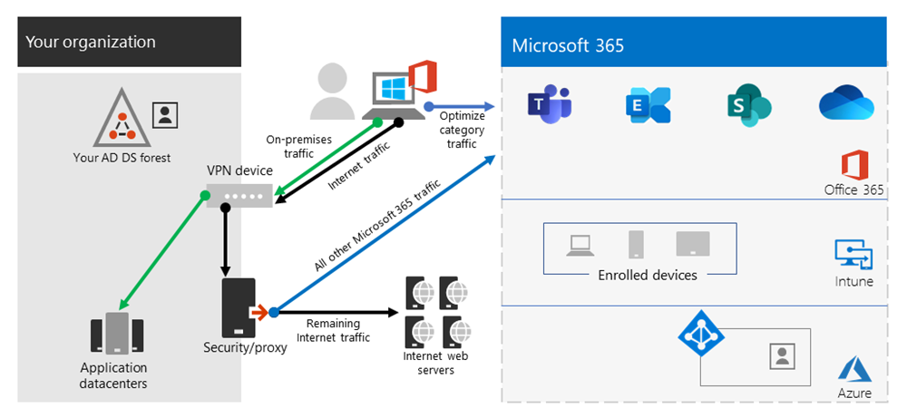

# Otimizar a conectividade do Office 365 dos usuários remotos usando o túnel dividido da VPN
<!---
>[!NOTE]
>This topic is part of a set of topics that address Office 365 optimization for remote users.
>- For VPN split tunnel implementation guidance, see [Implementing VPN split tunneling for Office 365](microsoft-365-vpn-implement-split-tunnel.md).
>- For information about optimizing Office 365 worldwide tenant performance for users in China, see [Office 365 performance optimization for China users](microsoft-365-networking-china.md).
-->

Para os clientes que conectam os dispositivos de funcionários remotos à rede corporativa ou à infraestrutura de nuvem através de VPN, a Microsoft recomenda que os principais cenários do Office 365, **Microsoft Teams**, **SharePoint Online** e **Exchange Online** sejam roteados através de uma configuração de _túnel dividido de VPN_. Isso se torna especialmente importante como a estratégia de primeira linha para facilitar a produtividade contínua dos funcionários durante eventos de trabalho em casa em larga escala, como a crise da COVID-19.

_Figura 1: uma solução VPN de túnel dividido com exceções definidas do Office 365, enviada diretamente para o serviço. Todo o tráfego restante atravessa o túnel VPN, independentemente do destino._

A essência dessa abordagem é fornecer um método simples para as empresas diminuírem o risco de saturação da infraestrutura VPN e melhorar drasticamente o desempenho do Office 365 no menor espaço de tempo possível. Para permitir que o tráfego de alto volume e mais crítico do Office 365 contorne o túnel VPN, a configuração de clientes VPN tem os seguintes benefícios:

- Ameniza imediatamente a causa raiz da maioria dos problemas de capacidade de rede e de desempenho relatados pelos clientes nas arquiteturas VPN corporativas que impactam a experiência do usuário do Office 365
  
  A solução recomendada visa especificamente os pontos de extremidade de serviço do Office 365 categorizados como **Otimizar** no tópico [URLs e intervalos de endereço IP do Office 365](https://aka.ms/o365ips). O tráfego para esses pontos de extremidade é altamente sensível à latência e limitação da largura de banda, e permitir que ele contorne o túnel VPN pode melhorar significativamente a experiência do usuário final, bem como reduzir a carga da rede corporativa. As conexões do Office 365 que não constituem a maior parte da largura de banda ou da área de cobertura da experiência do usuário podem continuar a ser roteadas através do túnel VPN juntamente com o resto do tráfego de Internet. Para obter mais informações, confira [A estratégia de túnel dividido de VPN](#the-vpn-split-tunnel-strategy).

- Pode ser configurado, testado e implementado rapidamente pelos clientes, sem requisitos adicionais de infraestrutura ou aplicativos

  Dependendo da plataforma VPN e da arquitetura de rede, a implementação pode levar apenas algumas horas. Para obter mais informações, confira [Implementar o túnel divido de VPN](microsoft-365-vpn-implement-split-tunnel.md#implement-vpn-split-tunneling).

- Preserva a postura de segurança das implementações de VPN do cliente, não alterando a forma como outras conexões são roteadas, incluindo o tráfego da Internet

  A configuração recomendada segue o princípio de **privilégios mínimos** para exceções de tráfego VPN, e permite aos clientes implementar o túnel dividido de VPN sem expor os usuários ou a infraestrutura a riscos de segurança adicionais. O tráfego de rede roteado diretamente aos pontos de extremidade do Office 365 é criptografado, validado para integridade pelas pilhas de aplicativos do cliente Office e escopo de endereços IP dedicados aos serviços do Office 365, que são reforçados no nível do aplicativo e da rede. Para obter mais informações, confira [Maneiras alternativas para profissionais de segurança e TI alcançarem controles de segurança modernos nos cenários atuais de trabalho remoto (blog da equipe de segurança da Microsoft) ](https://www.microsoft.com/security/blog/2020/03/26/alternative-security-professionals-it-achieve-modern-security-controls-todays-unique-remote-work-scenarios/)

- Tem suporte nativo pela maioria das plataformas de VPN corporativas

  A Microsoft continua colaborando com parceiros industriais que produzem soluções de VPN comerciais para ajudar os parceiros a desenvolver modelos de configuração e diretrizes direcionadas para as suas soluções, em alinhamento com as recomendações acima. Para obter mais informações, confira [Guias HOWTO para plataformas VPN comuns](microsoft-365-vpn-implement-split-tunnel.md#howto-guides-for-common-vpn-platforms).

>[!TIP]
>A Microsoft recomenda a configuração de VPN de túnel dividido em intervalos de IP dedicados e documentados para serviços do Office 365. As configurações de túnel dividido de FQDN ou baseadas no AppID, embora possível em determinadas plataformas de cliente VPN, podem não abranger todos os cenários essenciais do Office 365 e podem entrar em conflito com regras de roteamento VPN baseadas em IP. Por esse motivo, a Microsoft não recomenda usar os FQDNs do Office 365 para configurar a VPN de túnel dividido. O uso da configuração de FQDN pode ser útil em outros cenários relacionados, como personalizações de arquivos .pac ou para implementar um proxy ignorável.

Para obter diretrizes completas de implementação, confira [Implementar o túnel dividido de VPN para Office 365](microsoft-365-vpn-implement-split-tunnel.md).

## A estratégia de túnel dividido VPN

Geralmente, as redes corporativas tradicionais são projetadas para trabalhar de forma segura no mundo da nuvem, em que os dados, os serviços e os aplicativos mais importantes estão hospedados no local e podem ser conectados diretamente à rede corporativa interna, como a maioria dos usuários. Assim, a infraestrutura de rede é construída em torno desses elementos, em que as filiais estão conectadas à sede através de redes _MPLS (Multiprotocol Label Switching)_, e os usuários remotos se conectam à rede corporativa através de uma VPN para acessar os pontos de extremidade locais e a Internet. Nesse modelo, todo o tráfego de usuários remotos passa pela rede corporativa e é direcionado para o serviço de nuvem por meio de um ponto de saída comum.

_Figura 2: uma solução de VPN comum para usuários remotos onde todo o tráfego é forçado de volta para a rede corporativa, independentemente do destino_

À medida que as organizações movem dados e aplicativos para a nuvem, esse modelo começou a se tornar menos eficaz, pois rapidamente se torna incômodo, caro e instável, afetando significativamente o desempenho da rede e a eficiência dos usuários, bem com restringindo a capacidade da organização de se adaptar às necessidades de mudança. Muitos clientes da Microsoft relataram que há alguns anos atrás, 80% do tráfego da rede era para um destino interno, mas em 2020, mais de 80% do tráfego se conecta a um recurso externo baseado em nuvem.

A crise da COVID-19 agravou esse problema, exigindo soluções imediatas pela maioria das organizações. Muitos clientes descobriram que o modelo de VPN forçado não é escalável ou suficientemente eficaz para cenários de trabalho 100% remotos, como o que essa crise tem exigido. Soluções rápidas são necessárias para que essas organizações continuem a funcionar eficientemente.

Para o serviço do Office 365, a Microsoft desenvolveu os requisitos de conectividade para esse serviço tendo esse problema em mente, onde um focado conjunto de pontos de extremidade, fortemente controlado e relativamente estático pode ser otimizado de forma muito simples e rápida. De modo que ofereça alto desempenho aos usuários que acessam o serviço e reduzir a carga sobre a infraestrutura de VPN, para que ela possa ser usada pelo tráfego que ainda o requer.

O Office 365 categoriza os pontos de extremidade necessários para o Office 365 em três categorias: **Otimizar**, **Permitir** e **Padrão**. **Otimizar** os pontos de extremidade é o nosso foco aqui e têm as seguintes características:

- São pontos de extremidade de propriedade e gerenciados peça Microsoft, hospedados na infraestrutura da Microsoft
- São dedicados às cargas de trabalho principais do Office 365, como Exchange Online, SharePoint Online, Skype for Business Online e Microsoft Teams
- Tem IPs fornecidos
- Baixa taxa de alteração e espera-se que permaneça menor em número (20 sub-redes de IP)
- São sensíveis a alto volume e/ou latência
- É possível ter os elementos de segurança necessários no serviço, em vez de embutido na rede
- Representam aproximadamente 70-80% do volume de tráfego para o serviço do Office 365

Este conjunto de pontos de extremidade com um escopo apertado pode ser dividido do túnel de VPN forçado e enviado com segurança e diretamente para o serviço do Office 365 pela interface local do usuário. Isso é conhecido como **túnel dividido**.

Elementos de segurança como DLP, proteção antivírus, autenticação e controle de acesso podem ser entregues de forma muito mais eficiente em relação a esses pontos de extremidades em diferentes camadas dentro do serviço. Como também desviamos a maior parte do volume de tráfego da solução VPN, isto libera a capacidade do VPN para o tráfego crítico do negócio que ainda depende dele. Isso também deve eliminar a necessidade, em muitos casos, de passar por um longo e dispendioso programa de atualização para lidar com essa nova maneira de operar.

_Figura 3: uma solução VPN de túnel dividido com exceções definidas do Office 365, enviada diretamente para o serviço. Todo o restante tráfego é forçado a voltar para a rede corporativa, independentemente do destino._

Do ponto de vista da segurança, a Microsoft tem uma série de recursos de segurança que podem ser usados para fornecer segurança semelhante, ou mesmo melhor do que aquela entregue pela inspeção inline por pilhas de segurança locais. A postagem do blog da equipe de segurança da Microsoft [Maneiras alternativas para profissionais de segurança e TI alcançarem controles de segurança modernos nos cenários atuais de trabalho remoto](https://www.microsoft.com/security/blog/2020/03/26/alternative-security-professionals-it-achieve-modern-security-controls-todays-unique-remote-work-scenarios/), tem um resumo claro dos recursos disponíveis e você encontrará uma orientação mais detalhada neste artigo. Você também pode ler sobre a implementação da Microsoft de túneis divididos de VPN em [Trabalhando com VPN: como a Microsoft mantém sua força de trabalho remota conectada](https://www.microsoft.com/itshowcase/blog/running-on-vpn-how-microsoft-is-keeping-its-remote-workforce-connected/?elevate-lv).

Em muitos casos, esta implementação pode ser alcançada em questão de horas, permitindo uma solução rápida de um dos problemas mais urgentes que as organizações enfrentam à medida que mudam rapidamente para o trabalho remoto em escala real. Para obter orientações sobre a implementação de túneis divididos de VPN, confira [Implementar o túnel dividido de VPN para Office 365](microsoft-365-vpn-implement-split-tunnel.md).

## Tópicos relacionados

[Implementando o tunelamento dividido de VPN para Office 365](microsoft-365-vpn-implement-split-tunnel.md)

[Otimização de desempenho do Office 365 para usuários da China](microsoft-365-networking-china.md)

[Maneiras alternativas para profissionais de segurança e TI alcançarem controles de segurança modernos nos cenários atuais de trabalho remoto (blog da equipe de segurança da Microsoft)](https://www.microsoft.com/security/blog/2020/03/26/alternative-security-professionals-it-achieve-modern-security-controls-todays-unique-remote-work-scenarios/)

[Melhorar o desempenho da VPN na Microsoft: usar perfis VPN do Windows 10 para permitir conexões automáticas](https://www.microsoft.com/itshowcase/enhancing-remote-access-in-windows-10-with-an-automatic-vpn-profile)

[Trabalhando no VPN: Como a Microsoft mantém sua força de trabalho remota conectada](https://www.microsoft.com/itshowcase/blog/running-on-vpn-how-microsoft-is-keeping-its-remote-workforce-connected/?elevate-lv)

[Princípios de conectividade de rede do Office 365](microsoft-365-network-connectivity-principles.md)

[Avaliando a conectividade de rede do Office 365](assessing-network-connectivity.md)

[Teste de conectividade do Microsoft 365](https://aka.ms/netonboard)
