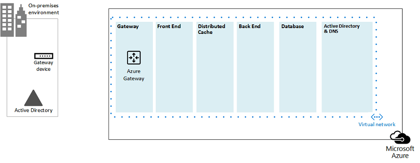
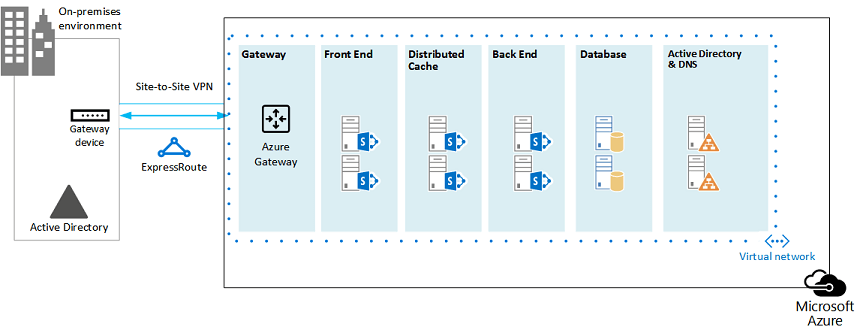
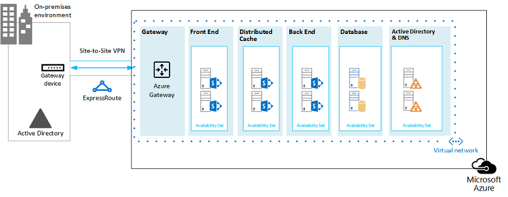

# Arquiteturas do Microsoft Azure para o SharePoint 2013Microsoft Azure Architectures for SharePoint 2013

O Azure é um bom ambiente para hospedar uma solução do SharePoint Server 2013.Azure is a good environment for hosting a SharePoint Server 2013 solution. Na maioria dos casos, recomendamos o Microsoft 365, mas um farm do SharePoint Server hospedado no Azure pode ser uma boa opção para soluções específicas.In most cases, we recommend Microsoft 365, but a SharePoint Server farm hosted in Azure can be a good option for specific solutions. Este artigo descreve como arquitetar soluções do SharePoint para que sejam um bom ajuste na plataforma do Azure.This article describes how to architect SharePoint solutions so they are a good fit in the Azure platform. As duas soluções específicas a seguir são usadas como exemplos:The following two specific solutions are used as examples:
  
- [Recuperação de Desastre do SharePoint Server 2013 no Microsoft AzureSharePoint Server 2013 Disaster Recovery in Microsoft Azure](sharepoint-server-2013-disaster-recovery-in-microsoft-azure.md)
    
- [Sites da Internet no Microsoft Azure usando o SharePoint Server 2013Internet Sites in Microsoft Azure using SharePoint Server 2013](internet-sites-in-microsoft-azure-using-sharepoint-server-2013.md)
    
## Soluções recomendadas do SharePoint para serviços de infraestrutura do AzureRecommended SharePoint solutions for Azure Infrastructure Services

Os serviços de infraestrutura do Azure são uma opção atraente para hospedar soluções do SharePoint.Azure infrastructure services is a compelling option for hosting SharePoint solutions. Algumas soluções são mais adequadas para essa plataforma do que outras.Some solutions are a better fit for this platform than others. A tabela a seguir mostra as soluções recomendadas.The following table shows recommended solutions.
  
|**Solução****Solution**|**Por que essa solução é recomendada para o Azure****Why this solution is recommended for Azure**|
|:-----|:-----|
|Ambientes de desenvolvimento e testeDevelopment and test environments    |É fácil criar e gerenciar esses ambientes.It's easy to create and manage these environments.    |
|Recuperação de desastre de farms locais do SharePoint para o AzureDisaster recovery of on-premises SharePoint farms to Azure    |**Datacenter secundário hospedado** Use o Azure em vez de investir em um datacenter secundário em uma região diferente.**Hosted secondary datacenter** Use Azure instead of investing in a secondary datacenter in a different region.   **Ambientes de recuperação de desastres de menor custo** Manter e pagar por menos recursos do que um ambiente de recuperação de desastres local.**Lower-cost disaster-recovery environments** Maintain and pay for fewer resources than an on-premises disaster recovery environment. O número de recursos depende do ambiente de recuperação de desastres escolhido: espera a frio, espera espera a frio ou espera a frio.The number of resources depends on the disaster recovery environment you choose: cold standby, warm standby, or hot standby.   **Plataforma mais elástica** Em caso de desastre, dimensione facilmente seu farm do SharePoint de recuperação para atender aos requisitos de carga.**More elastic platform** In the event of a disaster, easily scale-out your recovery SharePoint farm to meet load requirements. Dimensione quando não precisar mais dos recursos.Scale in when you no longer need the resources.   Consulte [Recuperação de desastre do SharePoint Server 2013 no Microsoft Azure.](sharepoint-server-2013-disaster-recovery-in-microsoft-azure.md)See [SharePoint Server 2013 Disaster Recovery in Microsoft Azure](sharepoint-server-2013-disaster-recovery-in-microsoft-azure.md).    |
|Sites voltados para a Internet que usam recursos e escala não estão disponíveis no Microsoft 365Internet-facing sites that use features and scale not available in Microsoft 365    |**Concentre-se em seus esforços** Concentre-se em criar um site excelente em vez de criar uma infraestrutura.**Focus your efforts** Concentrate on building a great site rather than building infrastructure.   **Aproveite a elasticidade no Azure** Size the farm for the demand by adding new servers, and pay only for resources you need.**Take advantage of elasticity in Azure** Size the farm for the demand by adding new servers, and pay only for resources you need. Não há suporte para a alocação dinâmica de máquina (dimensionamento automático).Dynamic machine allocation is not supported (auto scale).   **Usar o Azure Active Directory (AD)** Aproveite o Azure AD para contas de clientes.**Use Azure Active Directory (AD)** Take advantage of Azure AD for customer accounts.   **Adicionar funcionalidade do SharePoint não disponível no Microsoft 365** Adicione relatórios profundos e análise da Web.**Add SharePoint functionality not available in Microsoft 365** Add deep reporting and web analytics.   Consulte [Sites da Internet no Microsoft Azure usando o SharePoint Server 2013.](internet-sites-in-microsoft-azure-using-sharepoint-server-2013.md)See [Internet Sites in Microsoft Azure using SharePoint Server 2013](internet-sites-in-microsoft-azure-using-sharepoint-server-2013.md).    |
|Farms de aplicativos para dar suporte ao Microsoft 365 ou ambientes locaisApp farms to support Microsoft 365 or on-premises environments    |**Crie, teste e hospede aplicativos** no Azure para dar suporte a ambientes locais e de nuvem.**Build, test, and host apps** in Azure to support both on-premises and cloud environments.   **Hospede essa função** no Azure em vez de comprar novo hardware para ambientes locais.**Host this role** in Azure instead of buying new hardware for on-premises environments.   |
   
Para soluções de intranet e colaboração e cargas de trabalho, considere as seguintes opções:For intranet and collaboration solutions and workloads, consider the following options:
  
- Determine se o Microsoft 365 atende aos seus requisitos de negócios ou pode fazer parte da solução.Determine if Microsoft 365 meets your business requirements or can be part of the solution. O Microsoft 365 fornece um conjunto de recursos rico que está sempre atualizado.Microsoft 365 provides a rich feature set that is always up to date.
    
- Se o Microsoft 365 não atender a todos os seus requisitos de negócios, considere uma implementação padrão do SharePoint 2013 local dos Serviços de Consultoria da Microsoft (MCS).If Microsoft 365 does not meet all your business requirements, consider a standard implementation of SharePoint 2013 on premises from Microsoft Consulting Services (MCS). Uma arquitetura padrão pode ser uma solução mais rápida, barata e mais fácil de suportar do que uma solução personalizada.A standard architecture can be a quicker, cheaper, and easier solution for you to support than a customized one. 
    
- Se uma implementação padrão não atender aos seus requisitos de negócios, considere uma solução local personalizada.If a standard implementation doesn't meet your business requirements, consider a customized on-premises solution.
    
- Se usar uma plataforma de nuvem é importante para seus requisitos de negócios, considere uma implementação padrão ou personalizada do SharePoint 2013 hospedado nos serviços de infraestrutura do Azure.If using a cloud platform is important for your business requirements, consider a standard or customized implementation of SharePoint 2013 hosted in Azure infrastructure services. As soluções do SharePoint são muito mais fáceis de suportar no Azure do que em outras plataformas de nuvem pública não nativas da Microsoft.SharePoint solutions are much easier to support in Azure than other non-native Microsoft public cloud platforms.
    
## Antes de projetar o ambiente do AzureBefore you design the Azure environment

Embora este artigo use topologias de exemplo do SharePoint, você pode usar esses conceitos de design com qualquer topologia de farm do SharePoint.While this article uses example SharePoint topologies, you can use these design concepts with any SharePoint farm topology. Antes de projetar o ambiente do Azure, use as seguintes diretrizes de topologia, arquitetura, capacidade e desempenho para projetar o farm do SharePoint:Before you design the Azure environment, use the following topology, architecture, capacity, and performance guidance to design the SharePoint farm:
  
- [Design de arquitetura para profissionais de TI do SharePoint 2013Architecture design for SharePoint 2013 IT pros](https://technet.microsoft.com/sharepoint/fp123594.aspx)
    
- [Planejar o gerenciamento de desempenho e capacidade no SharePoint Server 2013Plan for performance and capacity management in SharePoint Server 2013](https://technet.microsoft.com/library/8dd52916-f77d-4444-b593-1f7d6f330e5f.aspx)
    
## Determinar o tipo de domínio do Active DirectoryDetermine the Active Directory domain type

Cada farm do SharePoint Server depende do Active Directory para fornecer contas administrativas para a configuração do farm.Each SharePoint Server farm relies on Active Directory to provide administrative accounts for farm setup. No momento, há duas opções para soluções do SharePoint no Azure.At this time, there are two options for SharePoint solutions in Azure. Eles são descritos na tabela a seguir.These are described in the following table.
  
|**Opção****Option**|**Descrição****Description**|
|:-----|:-----|
|Domínio dedicadoDedicated domain    |Você pode implantar um domínio do Active Directory dedicado e isolado no Azure para dar suporte ao seu farm do SharePoint.You can deploy a dedicated and isolated Active Directory domain to Azure to support your SharePoint farm. Essa é uma boa opção para sites da Internet voltados para o público.This is a good choice for public-facing Internet sites.    |
|Estender o domínio local por meio de uma conexão entre locaisExtend the on-premises domain through a cross-premises connection    |Quando você estende o domínio local através de uma conexão entre locais, os usuários acessam o farm do SharePoint pela intranet como se estivesse hospedado no local.When you extend the on-premises domain through a cross-premises connection, users access the SharePoint farm via your intranet as if it were hosted on-premises. Você pode tirar proveito da implementação do Active Directory local e do DNS.You can take advantage of your on-premises Active Directory and DNS implementation.    Uma conexão entre locais é necessária para a criação de um ambiente de recuperação de desastres no Azure a partir do seu farm local.A cross-premises connection is required for building a disaster-recovery environment in Azure to fail over to from your on-premises farm.    |
   
Este artigo inclui conceitos de design para estender o domínio local por meio de uma conexão entre locais.This article includes design concepts for extending the on-premises domain through a cross-premises connection. Se sua solução usa um domínio dedicado, você não precisa de uma conexão entre locais.If your solution uses a dedicated domain, you don't need a cross-premises connection.
  
## Projetar a rede virtualDesign the virtual network

Primeiro, você precisa de uma rede virtual no Azure, que inclui sub-redes nas quais você colocará suas máquinas virtuais.First you need a virtual network in Azure, which includes subnets on which you will place your virtual machines. A rede virtual precisa de um espaço de endereço IP privado, partes das quais você atribui às sub-redes.The virtual network needs a private IP address space, portions of which you assign to the subnets.
  
Se você estiver estendendo sua rede local para o Azure por meio de uma conexão entre locais (necessária para um ambiente de recuperação de desastres), você deve escolher um espaço de endereço privado que ainda não está em uso em outro lugar na rede da sua organização, que pode incluir seu ambiente local e outras redes virtuais do Azure.If you are extending your on-premises network to Azure through a cross-premises connection (required for a disaster recovery environment), you must choose a private address space that is not already in use elsewhere in your organization network, which can include your on-premises environment and other Azure virtual networks. 
  
**Figura 1: Ambiente local com uma rede virtual no Azure****Figure 1: On-premises environment with a virtual network in Azure**

  
Neste diagrama:In this diagram:
  
- Uma rede virtual no Azure é ilustrada lado a lado no ambiente local.A virtual network in Azure is illustrated side-by-side to the on-premises environment. Os dois ambientes ainda não estão conectados por uma conexão entre locais, que pode ser uma conexão VPN site a site ou ExpressRoute.The two environments are not yet connected by a cross-premises connection, which can be a site-to-site VPN connection or ExpressRoute.
    
- Neste ponto, a rede virtual só inclui as sub-redes e nenhum outro elemento arquitetônico.At this point, the virtual network just includes the subnets and no other architectural elements. Uma sub-rede hospedará o gateway do Azure e outras sub-redes hospedarão as camadas do farm do SharePoint, com uma outra para Active Directory e DNS.One subnet will host the Azure gateway and other subnets host the tiers of the SharePoint farm, with an additional one for Active Directory and DNS.
    
## Adicionar conectividade entre locaisAdd cross-premises connectivity

A próxima etapa de implantação é criar a conexão entre locais (se isso se aplicar à sua solução).The next deployment step is to create the cross-premises connection (if this applies to your solution). Para conexões entre locais, um gateway do Azure reside em uma sub-rede de gateway separada, que você deve criar e atribuir um espaço de endereço.For cross-premises connections, a Azure gateway resides in a separate gateway subnet, which you must create and assign an address space. 
  
Ao planejar uma conexão entre locais, você define e cria um gateway do Azure e uma conexão com um dispositivo de gateway local.When you plan for a cross-premises connection, you define and create an Azure gateway and connection to an on-premises gateway device.
  
**Figura 2: Usando um gateway do Azure e um dispositivo de gateway local para fornecer conectividade de site a site entre o ambiente local e o Azure****Figure 2: Using an Azure gateway and an on-premises gateway device to provide site-to-site connectivity between the on-premises environment and Azure**

  
Neste diagrama:In this diagram:
  
- Adicionando ao diagrama anterior, o ambiente local é conectado à rede virtual do Azure por uma conexão entre locais, que pode ser uma conexão VPN site a site ou ExpressRoute.Adding to the previous diagram, the on-premises environment is connected to the Azure virtual network by a cross-premise connection, which can be a site-to-site VPN connection or ExpressRoute.
    
- Um gateway do Azure está em uma sub-rede de gateway.An Azure gateway is on a gateway subnet.
    
- O ambiente local inclui um dispositivo de gateway, como um roteador ou um servidor VPN.The on-premises environment includes a gateway device, such as a router or VPN server.
    
Para obter informações adicionais para planejar e criar uma rede virtual entre locais, consulte Conectar uma rede local a uma rede virtual do [Microsoft Azure.](connect-an-on-premises-network-to-a-microsoft-azure-virtual-network.md)For additional information to plan for and create a cross-premises virtual network, see [Connect an on-premises network to a Microsoft Azure virtual network](connect-an-on-premises-network-to-a-microsoft-azure-virtual-network.md).
  
## Adicionar Serviços de Domínio do Active Directory (AD DS) e DNSAdd Active Directory Domain Services (AD DS) and DNS

Para recuperação de desastre no Azure, você implanta o Windows Server AD e o DNS em um cenário híbrido em que o Windows Server AD é implantado nas máquinas virtuais locais e do Azure.For disaster recovery in Azure, you deploy Windows Server AD and DNS in a hybrid scenario where Windows Server AD is deployed both on-premises and on Azure virtual machines.
  
**Figura 3: Configuração de domínio do Active Directory Híbrido****Figure 3: Hybrid Active Directory domain configuration**

  
Esse diagrama se baseia nos diagramas anteriores adicionando duas máquinas virtuais a um AD do Windows Server e uma sub-rede DNS.This diagram builds on the previous diagrams by adding two virtual machines to a Windows Server AD and DNS subnet. Essas máquinas virtuais são controladores de domínio de réplica e servidores DNS.These virtual machines are replica domain controllers and DNS servers. Eles são uma extensão do ambiente local do Windows Server AD.They are an extension of the on-premises Windows Server AD environment. 
  
A tabela a seguir fornece recomendações de configuração para essas máquinas virtuais no Azure.The following table provides configuration recommendations for these virtual machines in Azure. Use-os como ponto de partida para projetar seu próprio ambiente, mesmo para um domínio dedicado em que seu ambiente do Azure não se comunica com seu ambiente local.Use these as a starting point for designing your own environment—even for a dedicated domain where your Azure environment doesn't communicate with your on-premises environment.
  
|**Item****Item**|**Configuração****Configuration**|
|:-----|:-----|
|Tamanho da máquina virtual no AzureVirtual machine size in Azure    |Tamanho A1 ou A2 na camada PadrãoA1 or A2 size in the Standard tier    |
|Sistema operacionalOperating system    |Windows Server 2012 R2Windows Server 2012 R2    |
|Função do Active DirectoryActive Directory role    |Controlador de domínio do AD DS designado como um servidor de catálogo global.AD DS domain controller designated as a global catalog server. Essa configuração reduz o tráfego de saída na conexão entre locais.This configuration reduces egress traffic across the cross-premises connection.    Em um ambiente de terceiros com altas taxas de alteração (isso não é comum), configure os controladores de domínio no local para não sincronizar com os servidores de catálogo global no Azure, para reduzir o tráfego de replicação.In a multidomain environment with high rates of change (this is not common), configure domain controllers on premises not to sync with the global catalog servers in Azure, to reduce replication traffic.    |
|Função DNSDNS role    |Instale e configure o serviço de Servidor DNS nos controladores de domínio.Install and configure the DNS Server service on the domain controllers.    |
|Discos de dadosData disks    |Coloque o banco de dados, logs e SYSVOL do Active Directory em discos de dados adicionais do Azure.Place the Active Directory database, logs, and SYSVOL on additional Azure data disks. Não coloque-os no disco do sistema operacional ou nos discos temporários fornecidos pelo Azure.Do not place these on the operating system disk or the temporary disks provided by Azure.    |
|Endereços IPIP addresses    |Use endereços IP estáticos e configure a rede virtual para atribuir esses endereços às máquinas virtuais na rede virtual após a configuração dos controladores de domínio.Use static IP addresses and configure the virtual network to assign these addresses to the virtual machines in the virtual network after the domain controllers have been configured.    |
   
> [!IMPORTANT]
> Antes de implantar o Active Directory no Azure, leia Diretrizes para implantar o [Windows Server Active Directory em máquinas virtuais do Azure.](https://go.microsoft.com/fwlink/p/?linkid=392681)Before you deploy Active Directory in Azure, read [Guidelines for Deploying Windows Server Active Directory on Azure Virtual Machines](https://go.microsoft.com/fwlink/p/?linkid=392681). Isso ajuda a determinar se uma arquitetura diferente ou configurações diferentes são necessárias para sua solução.These help you determine if a different architecture or different configuration settings are needed for your solution. 
  
## Adicionar o farm do SharePointAdd the SharePoint farm

Coloque as máquinas virtuais do farm do SharePoint em camadas nas sub-redes apropriadas.Place the virtual machines of the SharePoint farm in tiers on the appropriate subnets.
  
**Figura 4: Posicionamento de máquinas virtuais do SharePoint****Figure 4: Placement of SharePoint virtual machines**

  
Esse diagrama se baseia nos diagramas anteriores adicionando as funções de servidor do farm do SharePoint em suas respectivas camadas.This diagram builds on the previous diagrams by adding the SharePoint farm server roles in their respective tiers.
  
- Duas máquinas virtuais de banco de dados executando o SQL Server criam a camada de banco de dados.Two database virtual machines running SQL Server create the database tier.
    
- Duas máquinas virtuais executando o SharePoint Server 2013 para cada uma das seguintes camadas: servidores front-end, servidores de cache distribuído e servidores back-end.Two virtual machines running SharePoint Server 2013 for each of the following tiers: front end servers, distributed cache servers, and back end servers.
    
## Projetar e ajustar as funções de servidor para conjuntos de disponibilidade e domínios de falhaDesign and fine tune server roles for availability sets and fault domains

Um domínio de falha é um grupo de hardware no qual as instâncias de função são executados.A fault domain is a grouping of hardware in which role instances run. As máquinas virtuais dentro do mesmo domínio de falha podem ser atualizadas pela infraestrutura do Azure ao mesmo tempo.Virtual machines within the same fault domain can be updated by the Azure infrastructure at the same time. Ou eles podem falhar ao mesmo tempo porque compartilham o mesmo rack.Or, they can fail at the same time because they share the same rack. Para evitar o risco de ter duas máquinas virtuais no mesmo domínio de falha, você pode configurar suas máquinas virtuais como um conjunto de disponibilidade, o que garante que cada máquina virtual está em um domínio de falha diferente.To avoid the risk of having two virtual machines on the same fault domain, you can configure your virtual machines as an availability set, which ensures that each virtual machine is in a different fault domain. Se três máquinas virtuais estão configuradas como um conjunto de disponibilidade, o Azure garante que não mais de duas máquinas virtuais estão localizadas no mesmo domínio de falha.If three virtual machines are configured as an availability set, Azure guarantees that no more than two of the virtual machines are located in the same fault domain.
  
Ao projetar a arquitetura do Azure para um farm do SharePoint, configure funções de servidor idênticas para fazer parte de um conjunto de disponibilidade.When you design the Azure architecture for a SharePoint farm, configure identical server roles to be part of an availability set. Isso garante que suas máquinas virtuais sejam distribuídas em vários domínios de falha.This ensures that your virtual machines are spread across multiple fault domains.
  
**Figura 5: Usar conjuntos de disponibilidade do Azure para fornecer alta disponibilidade para as camadas de farm do SharePoint****Figure 5: Use Azure Availability Sets to provide high availability for the SharePoint farm tiers**

  
Este diagrama destaca a configuração dos conjuntos de disponibilidade dentro da infraestrutura do Azure.This diagram calls out the configuration of availability sets within the Azure infrastructure. Cada uma das seguintes funções compartilham um conjunto de disponibilidade separado:Each of the following roles share a separate availability set:
  
- Active Directory e DNSActive Directory and DNS
    
- DatabaseDatabase
    
- Back-endBack end
    
- Distribuir cacheDistribute cache
    
- Front-endFront end
    
O farm do SharePoint pode precisar ser ajustado na plataforma do Azure.The SharePoint farm might need to be fine tuned in the Azure platform. Para garantir a alta disponibilidade de todos os componentes, verifique se as funções de servidor estão configuradas de forma idêntica.To ensure high availability of all components, ensure that the server roles are all configured identically.
  
Aqui está um exemplo que mostra uma arquitetura padrão de Sites da Internet que atende a metas específicas de capacidade e desempenho.Here is an example that shows a standard Internet Sites architecture that meets specific capacity and performance goals. Este exemplo é apresentado no seguinte modelo de arquitetura: Arquiteturas de Pesquisa de Sites da [Internet para SharePoint Server 2013.](https://go.microsoft.com/fwlink/p/?LinkId=261519)This example is featured in the following architecture model: [Internet Sites Search Architectures for SharePoint Server 2013](https://go.microsoft.com/fwlink/p/?LinkId=261519).
  
**Figura 6: Exemplo de planejamento para metas de capacidade e desempenho em um farm de três camadas****Figure 6: Planning example for capacity and performance goals in a three-tier farm**

  
Neste diagrama:In this diagram:
  
- Um farm de três camadas é representado: servidores web, servidores de aplicativos e servidores de banco de dados.A three-tier farm is represented: web servers, application servers, and database servers.
    
- Os três servidores Web são configurados de forma idêntica com vários componentes.The three web servers are configured identically with multiple components.
    
- Os dois servidores de banco de dados são configurados de forma idêntica.The two database servers are configured identically.
    
- Os três servidores de aplicativos não são configurados de forma idêntica.The three application servers are not configured identically. Essas funções de servidor exigem ajuste fino para conjuntos de disponibilidade no Azure.These server roles require fine tuning for availability sets in Azure.
    
Vamos dar uma olhada na camada do servidor de aplicativos.Let's look closer at the application server tier.
  
**Figura 7: Camada do servidor de aplicativos antes de ajustar****Figure 7: Application server tier before fine tuning**

  
Neste diagrama:In this diagram:
  
- Três servidores estão incluídos na camada de aplicativos.Three servers are included in the application tier.
    
- O primeiro servidor inclui quatro componentes.The first server includes four components.
    
- O segundo servidor inclui três componentes.The second server includes three components.
    
- O terceiro servidor inclui dois componentes.The third server includes two components.
    
Você determina o número de componentes pelas metas de desempenho e capacidade do farm.You determine the number of components by the performance and capacity targets for the farm. Para adaptar essa arquitetura para o Azure, replicamos os quatro componentes em todos os três servidores.To adapt this architecture for Azure, we'll replicate the four components across all three servers. Isso aumenta o número de componentes além do necessário para o desempenho e a capacidade.This increases the number of components beyond what is necessary for performance and capacity. O problema é que esse design garante a alta disponibilidade de todos os quatro componentes na plataforma do Azure quando essas três máquinas virtuais são atribuídas a um conjunto de disponibilidade.The tradeoff is that this design ensures high availability of all four components in the Azure platform when these three virtual machines are assigned to an availability set.
  
**Figura 8: Camada do servidor de aplicativos após o ajuste****Figure 8: Application server tier after fine tuning**

  
Este diagrama mostra todos os três servidores de aplicativos configurados de forma idêntica com os mesmos quatro componentes.This diagram shows all three application servers configured identically with the same four components.
  
Quando adicionamos conjuntos de disponibilidade às camadas do farm do SharePoint, a implementação é concluída.When we add availability sets to the tiers of the SharePoint farm, the implementation is complete.
  
**Figura 9: O farm do SharePoint concluído nos serviços de infraestrutura do Azure****Figure 9: The completed SharePoint farm in Azure infrastructure services**

  
Este diagrama mostra o farm do SharePoint implementado nos serviços de infraestrutura do Azure, com conjuntos de disponibilidade para fornecer domínios de falha para os servidores em cada camada.This diagram shows the SharePoint farm implemented in Azure infrastructure services, with availability sets to provide fault domains for the servers in each tier.
  
## Confira tambémSee Also

[Centro de soluções e arquitetura do Microsoft 365Microsoft 365 solution and architecture center](../solutions/solution-architecture-center.md)
  
[Sites da Internet no Microsoft Azure usando o SharePoint Server 2013Internet Sites in Microsoft Azure using SharePoint Server 2013](internet-sites-in-microsoft-azure-using-sharepoint-server-2013.md)
  
[Recuperação de Desastre do SharePoint Server 2013 no Microsoft AzureSharePoint Server 2013 Disaster Recovery in Microsoft Azure](sharepoint-server-2013-disaster-recovery-in-microsoft-azure.md)

