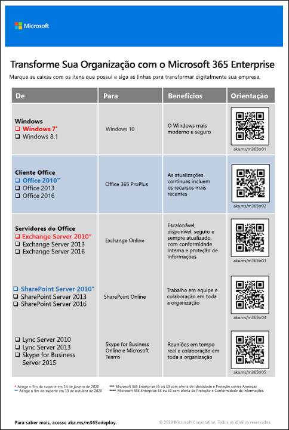

# Migração para o Microsoft 365 EnterpriseMigration to Microsoft 365 Enterprise

A maioria das organizações empresariais tem um ambiente heterogêneo com várias versões de sistemas operacionais, software cliente e software de servidor. O Microsoft 365 Enterprise inclui as versões mais seguras desses componentes principais de sua infraestrutura de TI com recursos de produtividade projetados para aproveitar as vantagens das tecnologias de nuvem.Most enterprise organizations have a heterogeneous environment with multiple releases of operating systems, client software, and server software. Microsoft 365 Enterprise includes the most secure versions of these key components of your IT infrastructure with productivity features that are designed to take advantage of cloud technologies.

Para maximizar o valor comercial do conjunto integrado de produtos do Microsoft 365 Enterprise, comece a planejar e implementar uma estratégia para migrar versões de:To maximize the business value of the Microsoft 365 Enterprise integrated suite of products, begin planning and implementing a strategy to migrate releases of:

- Cliente do Office instalado em seus computadores para o Office 365 ProPlusThe Office client installed on your computers to Office 365 ProPlus
- Servidores do Office instalados em seus servidores para seus serviços equivalentes no Office 365Office servers installed on your servers to their equivalent services in Office 365
- Windows 7 e Windows 8.1 em dispositivos Windows 10 EnterpriseWindows 7 and Windows 8.1 on your devices to Windows 10 Enterprise

>[!Note]
>O Windows 7 atinge o fim do suporte no dia 14 de janeiro de 2020.Windows 7 reaches end of support on January 14, 2020. Para saber mais, clique [aqui](https://support.microsoft.com/help/4057281/windows-7-support-will-end-on-january-14-2020).For more information, click [?](https://support.microsoft.com/help/4057281/windows-7-support-will-end-on-january-14-2020).
>

Realizar todas essas migrações ao longo do tempo aproxima a organização do [local de trabalho moderno](https://www.microsoft.com/microsoft-365/blog/2018/04/27/making-it-simpler-with-a-modern-workplace/), um ambiente seguro e integrado que desbloqueia o trabalho em equipe e a criatividade em sua organização, tudo possibilitado e habilitado pelo Microsoft 365 Enterprise.Accomplishing all of these migrations over time gets your organization closer to the [modern workplace](https://www.microsoft.com/microsoft-365/blog/2018/04/27/making-it-simpler-with-a-modern-workplace/), a secure and integrated environment that unlocks teamwork and creativity in your organization, all of which is enabled and empowered by Microsoft 365 Enterprise. 

Para saber sobre migração de usuários e dados para específicas cargas de trabalho do Office 365:For information about migrating users and data for specific Office 365 workloads:

- Caixas de correio do usuário do Exchange Server para o Exchange Online, consulte a [carga de trabalho do Exchange Online](exchangeonline-workload.md).User mailboxes from Exchange Server to Exchange Online, see the [Exchange Online workload](exchangeonline-workload.md).
- Dados do SharePoint, do SharePoint Server para o SharePoint Online, consulte a [carga de trabalho do SharePoint Online](sharepoint-online-onedrive-workload.md).SharePoint data from SharePoint Server to SharePoint Online, see the [SharePoint Online workload](sharepoint-online-onedrive-workload.md).
- Skype for Business Online para Microsoft Teams, consulte a [carga de trabalho do Microsoft Teams](teams-workload.md).Skype for Business Online to Microsoft Teams, see the [Microsoft Teams workload](teams-workload.md).

## Migração para produtos cliente do Microsoft OfficeMigration for Microsoft Office client products

Em muitas organizações grandes e pequenas, você pode usar uma combinação de versões mais antigas dos produtos clientes do Office, como Word, Excel e PowerPoint. Essas versões mais antigas:In many organizations both large and small, you might be using a combination of older versions of the Office client products, such as Word, Excel, and PowerPoint. These older versions:

- Podem ser [atualizadas](https://support.office.com/article/install-office-updates-2ab296f3-7f03-43a2-8e50-46de917611c5) com as atualizações de segurança mais recentes e correções de suporte, mas o processo às vezes é manual e pode não ser dimensionado na sua organização.Can be [updated](https://support.office.com/article/install-office-updates-2ab296f3-7f03-43a2-8e50-46de917611c5) with the latest security updates and support fixes, but the process is sometimes manual and might not scale across your organization.
- Não estão otimizadas para aproveitar as tecnologias de nuvem da Microsoft e ajudar você a transformar seus negócios digitalmente.Are not optimally enabled to leverage Microsoft’s cloud technologies and help you digitally transform your business.
 
O Microsoft 365 Enterprise inclui o Office 365 ProPlus, uma versão dos produtos cliente do Office que está disponível com uma licença do Microsoft 365 Enterprise e é instalada e atualizada a partir da nuvem da Microsoft. Confira [Sobre o Office 365 ProPlus na empresa](https://docs.microsoft.com/deployoffice/about-office-365-proplus-in-the-enterprise) para obter mais informações.Microsoft 365 Enterprise includes Office 365 ProPlus, a version of the Office client products that is available with a Microsoft 365 Enterprise license and is installed and updated from the Microsoft cloud. See [About Office 365 ProPlus in the enterprise](https://docs.microsoft.com/deployoffice/about-office-365-proplus-in-the-enterprise) for more information.

### Office 2007Office 2007

Para versões do Office na versão Office 2007, o fim do suporte já passou. Confira [Roteiro de fim do suporte do Office 2007](https://docs.microsoft.com/deployoffice/office-2007-end-support-roadmap) para obter mais informações.For versions of Office in the Office 2007 release, the end of support has already passed. See [Office 2007 End of Support Roadmap](https://docs.microsoft.com/deployoffice/office-2007-end-support-roadmap) for more information.

Em vez de atualizar seus computadores que executam o Office 2007 com o Office 2010, o Office 2013 ou o Office 2016, considere:Rather than upgrading your computers running Office 2007 with Office 2010, Office 2013, or Office 2016, consider:

1. Como adquirir e atribuir uma licença do Microsoft 365 aos usuários.Obtaining and assigning a Microsoft 365 license for your users.
2. Como desinstalar o Office 2007 em seus computadores.Uninstalling Office 2007 on their computers.
3. Como instalar o Office 365 ProPlus, individualmente ou em conjunto com uma distribuição de TI. Para mais informações, confira [Fase 4: Office 365 ProPlus](office365proplus-infrastructure.md).Installing Office 365 ProPlus, either individually or in conjunction with an IT rollout. For more information, see [Phase 4: Office 365 ProPlus](office365proplus-infrastructure.md).

O Office 365 ProPlus instala atualizações automaticamente e pode aproveitar os serviços baseados em nuvem no Office 365 para aumentar a segurança e a produtividade.Office 365 ProPlus installs updates automatically and can take advantage of cloud-based services in Office 365 for enhanced security and productivity.

### Office 2010Office 2010

Para versões do Office na versão Office 2010, o fim do suporte será 13 de outubro de 2020. Para saber mais, confira [Roteiro de fim do suporte do Office 2010](https://docs.microsoft.com/deployoffice/office-2010-end-support-roadmap).For versions of Office in the Office 2010 release, the end of support is October 13, 2020. For more information, see [Office 2010 end of support roadmap](https://docs.microsoft.com/deployoffice/office-2010-end-support-roadmap).

Em vez de atualizar seus computadores que executam o Office 2010 com o Office 2013 ou o Office 2016 (cujas atualizações devem ser feitas manualmente), considere:Rather than upgrading your computers running Office 2010 with Office 2013 or Office 2016, both of which must be manually updated, consider: 

1. Como adquirir e atribuir uma licença do Microsoft 365 aos usuários.Obtaining and assigning a Microsoft 365 license for your users.
2. Como desinstalar o Office 2010 em seus computadores.Uninstalling Office 2010 on their computers.
3. Como instalar o Office 365 ProPlus, individualmente ou em conjunto com uma distribuição de TI. Para mais informações, confira [Fase 4: Office 365 ProPlus](office365proplus-infrastructure.md).Installing Office 365 ProPlus, either individually or in conjunction with an IT rollout. For more information, see [Phase 4: Office 365 ProPlus](office365proplus-infrastructure.md).

O Office 365 ProPlus instala atualizações automaticamente e pode aproveitar os serviços baseados em nuvem no Office 365 para aumentar a segurança e a produtividade.Office 365 ProPlus installs updates automatically and can take advantage of cloud-based services in Office 365 for enhanced security and productivity.

### Office 2013 e Office 2016Office 2013 and Office 2016

O roteiro de fim do suporte para as versões do Office 2013 e Office 2016 do Office ainda não foi determinado. No entanto, como no Office 2010, você ainda deve [instalar as atualizações](https://support.office.com/article/install-office-updates-2ab296f3-7f03-43a2-8e50-46de917611c5), que podem não ser bem dimensionadas dependendo do tamanho da sua organização. Em vez de continuar atualizando seus computadores com as atualizações mais recentes do Office 2013 ou do Office 2016 ou atualizar seus computadores do Office 2013 para o Office 2016, considere:The end of support roadmap for the Office 2013 and Office 2016 versions of Office has not yet been determined. However, like Office 2010, you must still [install updates](https://support.office.com/article/install-office-updates-2ab296f3-7f03-43a2-8e50-46de917611c5), which might not scale well depending on the size of your organization. Rather than keep updating your computers with the latest updates for Office 2013 or Office 2016 or update your computers from Office 2013 to Office 2016, consider:

1. Como adquirir e atribuir uma licença do Microsoft 365 aos usuários.Obtaining and assigning a Microsoft 365 license for your users.
2. Como desinstalar o Office 2013 ou o Office 2016 em seus computadores.Uninstalling Office 2013 or Office 2016 on their computers.
3. Como instalar o Office 365 ProPlus, individualmente ou em conjunto com uma distribuição de TI. Para mais informações, confira [Fase 4: Office 365 ProPlus](office365proplus-infrastructure.md).Installing Office 365 ProPlus, either individually or in conjunction with an IT rollout. For more information, see [Phase 4: Office 365 ProPlus](office365proplus-infrastructure.md).

O Office 365 ProPlus instala atualizações automaticamente e pode aproveitar os serviços baseados em nuvem no Office 365 para aumentar a segurança e a produtividade.Office 365 ProPlus installs updates automatically and can take advantage of cloud-based services in Office 365 for enhanced security and productivity.

## Migração para produtos de servidor do Microsoft OfficeMigration for Microsoft Office server products

Em muitas organizações grandes e pequenas, você pode usar uma combinação de versões mais antigas dos produtos clientes do Office Server, como Exchange Server e SharePoint Server. Essas versões mais antigas:In many organizations both large and small, you might be using a combination of older versions of the Office Server products, such as Exchange Server and SharePoint Server. These older versions:

- Devem ser atualizadas com as últimas atualizações de segurança e correções de suporte. Em alguns casos, essas atualizações são liberadas mensalmente.Should be updated with the latest security updates and support fixes. In some cases, these updates are released monthly.
- Não estão otimizadas para aproveitar as tecnologias de nuvem da Microsoft e ajudar você a transformar seus negócios digitalmente.Are not optimally enabled to leverage Microsoft’s cloud technologies and help you digitally transform your business.
- Não incluem novos aplicativos de produtividade, como o Microsoft Teams.Do not include new productivity applications, such as Microsoft Teams.
- Não incluem os recursos de segurança mais recentes, como a Proteção Avançada contra Ameaças do Exchange.Do not include the latest security features, such as Exchange Advanced Threat Protection.

O Microsoft 365 Enterprise inclui o Office 365, que inclui versões baseadas em nuvem de serviços de servidor do Office que usam algumas das mesmas ferramentas que as versões locais do software do servidor do Office, como navegadores da Web e o cliente Outlook. Esses serviços são continuamente atualizados sem envolver a TI, poupando o tempo necessário para manter e atualizar os servidores locais. Esses serviços também possuem aprimoramentos que não estão presentes no software de servidor do Office.Microsoft 365 Enterprise includes Office 365, which includes cloud-based versions of Office server services that use some of the same tools as on-premises versions of Office server software, such as web browsers and the Outlook client. These services are continually updated without involving IT, saving you the time it takes to maintain and update on-premises servers. These services also have enhancements not present in Office server software. 

### Office Server 2007Office Server 2007

Para produtos de servidor na versão Office 2007, o fim do suporte já passou. Confira os artigos a seguir para saber mais:For server products in the Office 2007 release, the end of support has already passed. See these articles for the details:

- [Roteiro de fim do suporte do Exchange 2007Exchange 2007 end of support roadmap](https://docs.microsoft.com/office365/enterprise/exchange-2007-end-of-support)
- [Roteiro de fim do suporte do SharePoint Server 2007SharePoint Server 2007 end of support roadmap](https://docs.microsoft.com/office365/enterprise/sharepoint-2007-end-of-support)
- [Roteiro de fim do suporte do Project Server 2007Project Server 2007 end of support roadmap](https://docs.microsoft.com/office365/enterprise/project-server-2007-end-of-support)
- [Roteiro de fim do suporte do Office Communications ServerOffice Communications Server end of support roadmap](https://docs.microsoft.com/skypeforbusiness/plan-your-deployment/upgrade)
- [Roteiro de fim do suporte do PerformancePoint Server 2007PerformancePoint Server 2007 end of support roadmap](https://docs.microsoft.com/office365/enterprise/pps-2007-end-of-support)

Em vez de atualizar seus produtos de servidor na versão Office 2007 com produtos de servidor nas versões Office 2010, Office 2013 ou Office 2016, considere:Rather than upgrading your server products in the Office 2007 release with server products in the Office 2010, Office 2013, or Office 2016 releases, consider:

1. Migrar os dados em seus servidores do Office 2007 para o Office 365. Para ajudar com isso, contrate um parceiro da Microsoft.Migrating the data on your Office 2007 servers to Office 365. To help with this, hire a Microsoft partner.
2. Implantar a nova funcionalidade e os processos de trabalho para seus usuários.Rolling out the new functionality and work processes to your users.
3. Quando não houver mais a necessidade de servidores locais executando produtos de servidor do Office 2007, desative-os.When there is no longer a need for the on-premises servers running Office 2007 server products, decommissioning them.

### Office Server 2010Office Server 2010

Para produtos de servidor na versão Office 2010, o fim do suporte foi determinado para o seguinte:For server products in the Office 2010 release, the end of support has been determined for the following:

- [Exchange Server 2010Exchange Server 2010](https://docs.microsoft.com/office365/enterprise/exchange-2010-end-of-support)
- [SharePoint Server 2010SharePoint Server 2010](https://docs.microsoft.com/office365/enterprise/upgrade-from-sharepoint-2010)

Em vez de atualizar esses produtos de servidor na versão Office 2010 com produtos de servidor nas versões Office 2013 ou Office 2016, considere:Rather than upgrading these server products in the Office 2010 release with server products in the Office 2013 or Office 2016 release, consider:

1. Migrar os dados em seus servidores do Office 2010 para o Office 365. Para ajudar com isso, confira [FastTrack for Microsoft 365](https://fasttrack.microsoft.com/microsoft365) ou contrate um parceiro da Microsoft.Migrating the data on your Office 2010 servers to Office 365. To help with this, see [FastTrack for Microsoft 365](https://fasttrack.microsoft.com/microsoft365) or hire a Microsoft partner.
2. Implantar a nova funcionalidade e os processos de trabalho para seus usuários.Rolling out the new functionality and work processes to your users.
3. Quando não houver mais a necessidade de servidores locais executando produtos de servidor do Office 2010, desative-os.When there is no longer a need for the on-premises servers running Office 2010 server products, decommissioning them.

### Office Server 2013Office Server 2013

Para produtos de servidor na versão Office 2013, o fim do suporte não foi determinado. Em vez de atualizar seus produtos de servidor na versão Office 2013 com produtos de servidor na versão Office 2016, considere:For server products in the Office 2013 release, the end of support has not been determined. Rather than upgrading your server products in the Office 2013 release with server products in the Office 2016 release, consider:

1. Migrar os dados em seus servidores do Office 2013 para o Office 365. Para ajudar com isso, confira [FastTrack for Microsoft 365](https://fasttrack.microsoft.com/microsoft365) ou contrate um parceiro da Microsoft.Migrating the data on your Office 2013 servers to Office 365. To help with this, see [FastTrack for Microsoft 365](https://fasttrack.microsoft.com/microsoft365) or hire a Microsoft partner.
2. Implantar a nova funcionalidade e os processos de trabalho para seus usuários.Rolling out the new functionality and work processes to your users.
3. Quando não houver mais a necessidade de servidores locais executando produtos de servidor do Office 2013, desative-os.When there is no longer a need for the on-premises servers running Office 2013 server products, decommissioning them.

### Office Server 2016Office Server 2016

Para produtos de servidor na versão Office 2016, o fim do suporte não foi determinado. Para aproveitar o serviço baseado na nuvem e os aprimoramentos para transformar digitalmente seus negócios, considere:For server products in the Office 2016 release, the end of support has not been determined. To take advantage of the cloud-based service and enhancements to digitally transform your business, consider:

1. Migrar os dados em seus servidores do Office 2016 para o Office 365. Para ajudar com isso, confira [FastTrack for Microsoft 365](https://fasttrack.microsoft.com/microsoft365) ou contrate um parceiro da Microsoft.Migrating the data on your Office 2016 servers to Office 365. To help with this, see [FastTrack for Microsoft 365](https://fasttrack.microsoft.com/microsoft365) or hire a Microsoft partner.
2. Implantar a nova funcionalidade e os processos de trabalho para seus usuários.Rolling out the new functionality and work processes to your users.
3. Quando não houver mais a necessidade de servidores locais executando produtos de servidor do Office 2016, desative-os.When there is no longer a need for the on-premises servers running Office 2016 server products, decommissioning them.

## Migração para o Microsoft WindowsMigration for Microsoft Windows

Para migrar seus dispositivos que executam o Windows 7 ou o Windows 8.1, você pode executar uma [atualização in-loco](https://docs.microsoft.com/microsoft-365/enterprise/windows10-deploy-inplaceupgrade).To migrate your devices running Windows 7 or Windows 8.1, you can perform an [in-place upgrade](https://docs.microsoft.com/microsoft-365/enterprise/windows10-deploy-inplaceupgrade). 

Para outros métodos, confira [Cenários de implantação do Windows 10](https://docs.microsoft.com/windows/deployment/windows-10-deployment-scenarios). Você também pode [Planejar a implantação do Windows 10](https://aka.ms/planforwin10deployment) por conta própria.For additional methods, see [Windows 10 deployment scenarios](https://docs.microsoft.com/windows/deployment/windows-10-deployment-scenarios). You can also [plan for Windows 10 deployment](https://aka.ms/planforwin10deployment) on your own.

## Como a Microsoft desenvolve o Microsoft 365 EnterpriseHow Microsoft does Microsoft 365 Enterprise

Veja como os especialistas em TI da Microsoft migraram a empresa para o Microsoft 365 Enterprise com estes recursos:See how IT experts at Microsoft migrated the company to Microsoft 365 Enterprise with these resources: 

- [Implantar e atualizar o Microsoft Office 365 ProPlusDeploying and updating Microsoft Office 365 ProPlus](https://www.microsoft.com/itshowcase/Article/Content/757/Deploying-and-updating-Microsoft-Office-365-ProPlus)
- [A Microsoft migra 150 mil caixas de correio para o Exchange OnlineMicrosoft migrates 150,000 mailboxes to Exchange Online](https://www.microsoft.com/itshowcase/Article/Content/577/Microsoft-migrates-150000-mailboxes-to-Exchange-Online)
- [SharePoint para a nuvem: saiba como a Microsoft realizou a própria migraçãoSharePoint to the cloud: Learn how Microsoft ran its own migration](https://www.microsoft.com/itshowcase/Article/Content/691/SharePoint-to-the-cloud-Learn-how-Microsoft-ran-its-own-migration)
- [Implantar o Windows 10 na Microsoft como uma atualização in-locoDeploying Windows 10 at Microsoft as an in-place upgrade](https://www.microsoft.com/itshowcase/Article/Content/668/Deploying-Windows-10-at-Microsoft-as-an-inplace-upgrade)
- [Implantação do Windows 10: dicas e truques da TI da Microsoft](https://www.microsoft.com/itshowcase/Article/Content/951/Windows-10-deployment-tips-and-tricks-from-Microsoft-IT) (vídeo)[Windows 10 deployment: tips and tricks from Microsoft IT](https://www.microsoft.com/itshowcase/Article/Content/951/Windows-10-deployment-tips-and-tricks-from-Microsoft-IT) (video)

## Transição para toda a organizaçãoTransition your entire organization

Para ter uma ideia melhor de como migrar toda a organização para o Microsoft 365 Enterprise, baixe o [pôster de transição](https://github.com/MicrosoftDocs/microsoft-365-docs/raw/public/microsoft-365/enterprise/media/deploy-microsoft-365-enterprise/transitionorgtom365.pdf).To get a better picture of how to move your entire organization to Microsoft 365 Enterprise, download the [transition poster](https://github.com/MicrosoftDocs/microsoft-365-docs/raw/public/microsoft-365/enterprise/media/deploy-microsoft-365-enterprise/transitionorgtom365.pdf).

Esse pôster de duas páginas é uma maneira rápida de fazer o inventário da infraestrutura existente e obter diretrizes para migrar para o produto ou serviço correspondente no Microsoft 365 Enterprise.This two-page poster is a quick way to inventory your existing infrastructure and get to the guidance for moving to the corresponding product or service in Microsoft 365 Enterprise. Ele inclui os produtos neste artigo e outros elementos de infraestrutura e segurança, como gerenciamento de dispositivo, identidade, proteção contra ameaças e informações sobre elas.It includes the products in this article and other infrastructure and security elements such as device management, identity, and information and threat protection.

Você pode imprimir esse pôster em formato de carta, oficial ou de tabloide (11 x 17).You can print this poster in letter, legal, or tabloid (11 x 17) formats.

## ResultadoResult

A organização migrou versões anteriores do Microsoft Office, de servidores do Office e do Windows para o Microsoft 365 Enterprise.Your organization has migrated older versions of Microsoft Office, Office servers, and Windows to Microsoft 365 Enterprise.
