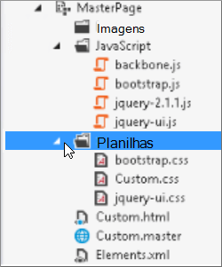

# Minificação e agrupamento no SharePoint Online

Este artigo descreve como usar técnicas de minificação e de aplicação de coquelamento com o Web Essentials para reduzir o número de solicitações HTTP e reduzir o tempo necessário para carregar páginas no SharePoint Online.
  
Ao personalizar seu site, você pode acabar adicionando um grande número de arquivos extras ao servidor para dar suporte à personalização. Adicionar javaScript extra, CSS e imagens aumenta o número de solicitações HTTP para o servidor que, por sua vez, aumenta o tempo necessário para exibir uma página da Web. Se você tiver vários arquivos do mesmo tipo, poderá agrupar esses arquivos para tornar o download desses arquivos mais rápido.
  
Para arquivos JavaScript e CSS, você também pode usar uma abordagem chamada minificação, onde você reduz o tamanho total de arquivos removendo o espaço em branco e outros caracteres que não são necessários.
  
## Minification and bundling JavaScript and CSS files with Web Essentials

Você pode usar softwares de terceiros, como o Web Essentials, para agrupar arquivos CSS e JavaScript.
  
> [!IMPORTANT]
> O Web Essentials é um projeto baseado em comunidade de terceiros, de código aberto. O software é uma extensão para Visual Studio 2012 e Visual Studio 2013 e não é suportado pela Microsoft. Para baixar o Web Essentials, visite o site em [https://vswebessentials.com/download](https://go.microsoft.com/fwlink/p/?LinkId=525629) . 
  
O Web Essentials oferece duas formas de adlinhamento:
  
- .bundle: para arquivos CSS e JavaScript
    
- .sprite: para imagens (disponível somente em Visual Studio 2013)
    
Você pode usar o Web Essentials se tiver um recurso existente com alguns elementos de identidade visual referenciados dentro de uma página mestra personalizada, como:
  

  
 **Para criar um pacote TE000127218 e CSS no Web Essentials**
  
1. Em Visual Studio, no Explorador de Soluções, selecione os arquivos que você deseja incluir no pacote.
    
2. Clique com o botão direito do mouse nos arquivos selecionados e selecione **Web Essentials** \> **Criar arquivo de pacote JavaScript** no menu de contexto. Por exemplo: 
    
    
  
## Exibindo os resultados de como a bundling de arquivos JavaScript e CSS

Quando você cria um pacote JavaScript e CSS, o Web Essentials cria um arquivo XML chamado um arquivo de receita que identifica os arquivos JavaScript e CSS, bem como algumas outras informações de configuração: 
  

  
Além disso, se o sinalizador de minify for definido como true na receita de empacotamento, os arquivos serão reduzidos em tamanho, bem como agrupados. Isso significa que novas versões minificadas dos arquivos JavaScript foram criadas que você pode fazer referência em sua página mestra.
  

  
Ao carregar uma página do seu site, você pode usar as ferramentas de desenvolvedor do navegador da Web, como o Internet Explorer 11, para ver o número de solicitações enviadas para o servidor e quanto tempo cada arquivo levou para carregar.
  
A figura a seguir é o resultado do carregamento dos arquivos JavaScript e CSS antes da minificação.
  

  
Depois de unir os arquivos CSS e JavaScript, o número de solicitações caiu para 74 e cada arquivo demorou apenas um pouco mais do que os arquivos originais para baixar individualmente:
  

  
Depois de agrupar, o arquivo de pacote JavaScript é reduzido significativamente de 815KB para 365KB:
  

  
## Criando um sprite de imagem

Semelhante à maneira como você empacota arquivos JavaScript e CSS, você pode combinar muitos ícones pequenos e outras imagens comuns em uma folha de sprite maior e, em seguida, usar CSS para revelar as imagens individuais. Em vez de baixar cada imagem individual, o navegador da Web do usuário baixa a planilha de sprite uma vez e a armazena em cache no computador local. Isso melhora o desempenho da carga da página reduzindo o número de downloads e viagens de ida e volta para o servidor Web.
  
 **Para criar um sprite de imagem no Web Essentials**
  
1. Em Visual Studio, no Explorador de Soluções, selecione os arquivos que você deseja incluir no pacote.
    
2. Clique com o botão direito do mouse nos arquivos selecionados e selecione **Web Essentials** \> **Criar sprite de** imagem no menu de contexto. Por exemplo: 
    
    
  
3. Escolha um local para salvar o arquivo sprite. O arquivo .sprite é um arquivo XML que descreve as configurações e arquivos no sprite. As figuras a seguir mostram um exemplo de um arquivo PNG sprite e seu arquivo .sprite XML correspondente.
    
    
  
    
  

