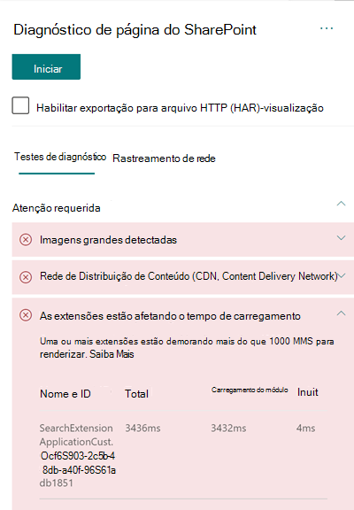

# Otimizar o desempenho da extensão personalizada nas páginas do site modernas do SharePoint Online

Este artigo ajudará você a entender como determinar de que modo as extensões personalizadas afetam a latência percebida pelo usuário e como corrigir problemas comuns.

## Usar a ferramenta Diagnóstico de Página para SharePoint para analisar as extensões personalizadas

A ferramenta Diagnóstico de Página para SharePoint é uma extensão do navegador para os novos navegadores Microsoft Edge (https://www.microsoft.com/edge) e Chrome que analisam o portal moderno do SharePoint Online e as páginas clássicas do site de publicação. A ferramenta fornece um relatório para cada página analisada que mostra o desempenho da página em relação a um conjunto definido de critérios de desempenho. Para instalar e saber mais sobre a ferramenta Diagnóstico de Página para SharePoint, acesse [Usar a ferramenta Diagnóstico de Página para SharePoint Online](page-diagnostics-for-spo.md).

>[!NOTE]
>A ferramenta de Diagnóstico de Página só funciona com o SharePoint Online e não pode ser usada em uma página do sistema do SharePoint.

Ao analisar uma página de site do SharePoint com a ferramenta Diagnóstico de Página para SharePoint, você pode visualizar informações sobre extensões personalizadas que excedem a métrica de linha de base em **As extensões estão afetando o tempo de carregamento** e/ou em **Excesso de extensões usadas** resultam no painel _Testes de diagnóstico_ 

Os resultados possíveis incluem:

- **Atenção necessária** (vermelho): Qualquer extensão _personalizada_ que leva mais do que **um** segundo para carregar. O tempo total de carregamento, conforme exibido nos resultados de teste, é dividido por carregamento do módulo, carga lenta, inicialização e renderização. Além disso, se houver muitas extensões em uma página, elas poderão afetar o tempo de carregamento da página e isso será destacado se **sete** ou mais extensões forem usadas na página.
- **Oportunidades de melhoria** (amarelo) Se **cinco** ou mais extensões forem usadas, elas serão destacadas nesta seção como um aviso até que sete ou mais sejam usadas, e então serão destacadas como Atenção Necessária.
- **Nenhuma ação é necessária** (verde): Nenhuma extensão está levando mais de um segundo para carregar.

Se uma extensão estiver afetando o tempo de carregamento da página ou  houver muitas extensões na página, o resultado aparecerá na seção Atenção necessária dos resultados. Clique no resultado para ver os detalhes sobre qual extensão está carregando lentamente ou se muitas extensões foram destacadas. Futuras atualizações da ferramenta Diagnóstico de Página para SharePoint podem incluir atualizações de regras de análise, portanto, garanta que você sempre tenha a versão mais recente da ferramenta.

As informações disponíveis nos resultados incluem:

- **Nome e ID** mostram informações de identificação que podem ajudá-lo a encontrar a extensão na página
- **O total** mostra o tempo total para a extensão carregar e inicializar o módulo. É o tempo relativo total que a extensão levou para executar na página, do início ao fim.
- **A Carga do** Módulo mostra o tempo de download, avaliação e carregamento das extensões javaScript e arquivos CSS. Em seguida, ele iniciará o processo de início.
- **Init** mostra o tempo que a extensão levou para inicializar os dados.
    Trata-se de uma chamada assíncrona e o tempo de emissão é o cálculo do tempo para a função onInit quando a promessa retornada é resolvida.

Essas informações são fornecidas para ajudar designers e desenvolvedores a solucionar problemas. Elas devem ser encaminhadas à equipe de design e desenvolvimento.

## Visão geral das extensões

As Extensões da Estrutura do SharePoint (SPFx) podem ser usadas para estender a experiência do usuário do SharePoint. Com as Extensões da Estrutura do SharePoint, é possível personalizar mais facetas da experiência do SharePoint, incluindo modos de exibição de dados de lista, barras de ferramentas e áreas de notificação.

As extensões podem ter uma influência ruim no desempenho de uma página do SharePoint, pois também são necessários recursos da CPU e da rede para o trabalho necessário.

Há quatro tipos de extensões:

- **Personalizadores de Aplicativos** adicionam scripts à página e acessam os espaços reservados de elementos HTML conhecidos e os estendem com renderizações personalizadas.
- **Personalizadores de campo** fornecem visualizações modificadas aos dados dos campos em uma lista.
- **Conjuntos de Comandos** estendem as superfícies de comando do SharePoint para adicionar novas ações e fornecem código do lado do cliente que você pode usar para implementar comportamentos.
- **Modificador de Consulta de Pesquisa (somente visualização)** são invocados antes de executar a consulta de pesquisa.

## Corrigir problemas de desempenho da extensão

Siga as orientações desta seção para identificar e corrigir problemas de desempenho com extensões listadas nos resultados **As extensões estão afetando o tempo de carregamento da página**.

>[!NOTE]
>Os personalizadores de aplicativos podem ser executados no estágio inicial durante o ciclo de vida de uma página e podem influenciar o desempenho de outras extensões na página.

Os resultados da auditoria na Ferramenta de Diagnóstico da Página exibirão dois estágios de execução de uma extensão para ajudar a identificar o potencial impacto no desempenho.

- **Carregamento do módulo** é o tempo que leva para carregar a extensão, que é impactado pelo tamanho de uma extensão, portanto, é uma boa ideia agrupar apenas as bibliotecas necessárias na extensão e também escolher bibliotecas mais leves.
- **Inicialização** é o tempo de inicialização da extensão e os desenvolvedores de extensão devem considerar se a extensão está executando um trabalho desnecessário ou executando muitos comandos durante o estágio de inicialização.

Os autores da página também podem usar o resultado da auditoria para verificar se uma página possui muitas extensões, pois muitas delas impactarão negativamente o desempenho de uma página.

- **Tamanho da extensão e dependências**
  - É necessário usar a CDN do Office 365 para baixar o recurso estático ideal. As origens da CDN pública são preferíveis para arquivos _js/css_. Para saber mais sobre como usar a CDN do Office 365, confira [Usar a CDN (Rede de Distribuição de Conteúdo) do Office 365 com o SharePoint Online](use-microsoft-365-cdn-with-spo.md).
  - Reutilize estruturas como _importações do React_ e do _Fabric_, que vêm como parte da Estrutura do SharePoint (SPFx). Para saber mais, confira [Visão geral da Estrutura do SharePoint](https://docs.microsoft.com/sharepoint/dev/spfx/sharepoint-framework-overview).
  - Verifique se você está usando a versão mais recente da Estrutura do SharePoint e atualize para novas versões quando elas estiverem disponíveis.
- **Busca/cache de dados**
  - Se a extensão contar com chamadas adicionais do servidor para buscar dados para exibição, verifique se as APIs do servidor são rápidas e/ou implemente cache do lado do cliente (por exemplo, use _localStorage_ ou _IndexDB_ para conjuntos maiores).
  - Se várias chamadas forem necessárias para renderizar dados críticos, considere o uso de envio em lote no servidor ou de outros métodos de consolidação de solicitações em uma única chamada.
  - Como alternativa, se alguns elementos de dados exigirem uma API mais lenta, mas não forem críticos para a renderização inicial, separe-os em outra chamada, executada após a renderização dos dados críticos.
  - Se várias partes usarem os mesmos dados, utilize uma camada de dados comum para evitar chamadas duplicadas.
- **Tempo de renderização**
  - Quaisquer fontes de mídia, como imagens e vídeos, devem ser dimensionadas de acordo com os limites do contêiner, dispositivo e/ou rede para evitar o download de grandes recursos desnecessários. Para saber mais sobre como usar dependências de conteúdo, confira [Usar a CDN (Rede de Distribuição de Conteúdo) do Office 365 com o SharePoint Online](use-microsoft-365-cdn-with-spo.md).
  - Evite chamadas de API que causem refluxo, regras CSS complexas ou animações complicadas. Para obter mais informações, confira [Minimizar o refluxo do navegador](https://developers.google.com/speed/docs/insights/browser-reflow).
  - Evite o uso de tarefas de longa execução encadeadas. Em vez disso, divida as tarefas de longa execução em filas separadas. Para obter mais informações, confira [Otimizar a execução do JavaScript](https://developers.google.com/web/fundamentals/performance/rendering/optimize-javascript-execution).
  - Reserve o espaço correspondente para renderizar de forma assíncrona mídia ou elementos visuais, a fim de evitar quadros ignorados e instabilidade (também conhecida como _jank_).
  - Se determinado navegador não oferecer suporte a um recurso usado na renderização, carregue um polyfill ou exclua o código dependente em execução. Se o recurso não for crítico, descarte recursos como manipuladores de eventos para evitar vazamentos de memória.

Antes de fazer as revisões das páginas para corrigir problemas de desempenho, anote o tempo de carregamento da página nos resultados da análise. Execute a ferramenta novamente após a revisão para ver se o novo resultado está dentro do padrão da linha de base e verifique o tempo de carregamento da nova página para ver se melhorou.

>[!NOTE]
>O tempo de carregamento da página pode variar de acordo com vários fatores, como a carga da rede, hora do dia e outras condições transitórias. Você deve testar o tempo de carregamento da página algumas vezes antes e depois de fazer as alterações para ajudá-lo a calcular uma média dos resultados.

## Tópicos relacionados

[Ajustar o desempenho do SharePoint Online](tune-sharepoint-online-performance.md)

[Ajustar o desempenho do Office 365](tune-microsoft-365-performance.md)

[Desempenho na experiência moderna do SharePoint](https://docs.microsoft.com/sharepoint/modern-experience-performance)

[Redes de distribuição de conteúdo](content-delivery-networks.md)

[Usar a Rede de Distribuição de Conteúdo (CDN) do Office 365 com o SharePoint Online](use-microsoft-365-cdn-with-spo.md)
