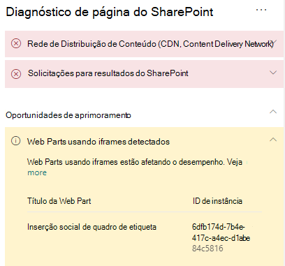

# Otimizar os iFrames em páginas do site de publicação clássico e moderno do SharePoint Online

Os iFrames podem ser útil para a visualização de conteúdo avançado, como vídeos ou outras mídias. No entanto, como os iFrames carregam uma página separada na página do site do SharePoint, o conteúdo carregado no iFrame pode conter imagens grandes, vídeos ou outros elementos que podem contribuir para o tempo total de carregamento da página e que você não pode controlar na página. Este artigo ajudará você a entender como determinar de que modo os iFrames nas suas páginas afetam a latência percebida pelo usuário e como corrigir problemas comuns.

>[!NOTE]
>Para obter mais informações sobre o desempenho dos sites modernos do SharePoint Online, confira [Desempenho na experiência moderna do SharePoint](/sharepoint/modern-experience-performance).

## Usar a ferramenta Diagnóstico de Página para SharePoint para analisar Web Parts usando os iFrames

A ferramenta Diagnóstico de Página para SharePoint é uma extensão do navegador para os novos navegadores Microsoft Edge (https://www.microsoft.com/edge) e Chrome que analisam o portal moderno do SharePoint Online e as páginas clássicas de site de publicação. A ferramenta fornece um relatório para cada página analisada que mostra o desempenho da página em relação a um conjunto definido de critérios de desempenho. Para instalar e saber mais sobre a ferramenta Diagnóstico de Página para SharePoint, acesse [Usar a ferramenta Diagnóstico de Página para SharePoint Online](page-diagnostics-for-spo.md).

>[!NOTE]
>A ferramenta de Diagnóstico de Página só funciona com o SharePoint Online e não pode ser usada em uma página do sistema do SharePoint.

Ao analisar uma página do site do SharePoint com a ferramenta Diagnóstico de página do SharePoint, você pode ver as informações sobre as Web Parts que contêm os iFrames no painel _Testes de diagnóstico_. A métrica da linha de base é a mesma para as páginas clássicas e modernas.

Os resultados possíveis incluem:

- **Atenção necessária** (vermelho): a página contém **três ou mais** Web Parts usando iFrames
- **Oportunidades de melhoria** (amarelo): a página contém **uma ou duas** Web Parts usando iFrames
- **Nenhuma ação necessária** (verde): a página não contém Web Parts usando iFrames

Se o resultado **Web Parts usando iFrames detectados** aparecer na seção **Oportunidades de melhoria** ou **Atenção necessária)**, você poderá clicar no resultado para ver a Web Parts que contêm iFrames.

## Solucionar problemas de desempenho de iFrame

Use o resultado **Web Parts usando iFrames detectados** na ferramenta Página de diagnóstico para determinar quais Web Parts contêm iFrames e podem estar contribuindo no tempo de carregamento lento da página.

Os iFrames são inerentemente lentos porque carregam uma página externa separada, incluindo todo o conteúdo associado, como elementos JavaScript, CSS e Framework, potencialmente aumentando a sobrecarga da página do site em um fator de dois ou mais.

Siga as orientações abaixo para garantir o uso ideal dos iFrames.

- Quando possível, use imagens em vez de iFrames se a visualização for não interativa ou pequena para começar.
- Se precisar usar os iFrames, minimize o número e/ou remova-os do visor.
- Os arquivos inseridos do Office, como o Word, Excel e PowerPoint são interativos, mas são lentos para carregar. As miniaturas de imagem com um link para o documento inteiro geralmente terão melhor desempenho.
- Os vídeos inseridos do YouTube e os feeds do Twitter tendem a funcionar melhor nos iFrames, mas você deve usar esses tipos de incorporações de forma criteriosa.
- As Web Parts isoladas são uma exceção razoável, mas minimize seu número e posicionamento no visor.
- Se um iFrame estiver fora do visor, considere o uso de um IntersectionObserver para atrasar a renderização do iFrame até que ele seja exibido.

Antes de fazer as revisões das páginas para corrigir problemas de desempenho, anote o tempo de carregamento da página nos resultados da análise. Execute a ferramenta novamente após a revisão para ver se o novo resultado está dentro do padrão da linha de base e verifique o tempo de carregamento da nova página para ver se melhorou.

>[!NOTE]
>O tempo de carregamento da página pode variar de acordo com vários fatores, como a carga da rede, hora do dia e outras condições transitórias. Você deve testar o tempo de carregamento da página algumas vezes antes e depois de fazer as alterações para ajudá-lo a calcular uma média dos resultados.

## Tópicos relacionados

[Ajustar o desempenho do SharePoint Online](tune-sharepoint-online-performance.md)

[Ajustar o desempenho do Office 365](tune-microsoft-365-performance.md)

[Desempenho na experiência moderna do SharePoint](/sharepoint/modern-experience-performance)