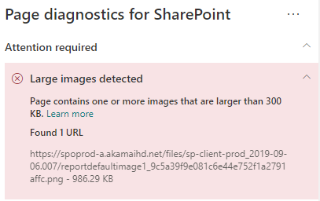

# Otimizar imagens nas páginas de site moderno do SharePoint OnlineOptimize images in SharePoint Online modern site pages

Este artigo vai ajudá-lo a entender como otimizar imagens nas páginas de site moderno do SharePoint Online.This article will help you understand how to optimize images in SharePoint Online modern site pages.

Para saber mais sobre como otimizar imagens em sites de publicação clássicos, confira [Otimização de imagem do SharePoint Online](image-optimization-for-sharepoint-online.md)..For information about optimizing images in classic publishing sites, see [Image optimization for SharePoint Online](image-optimization-for-sharepoint-online.md)..

>[!NOTE]
>Para obter mais informações sobre o desempenho dos portais modernos do SharePoint Online, confira [Desempenho na experiência moderna do SharePoint](https://docs.microsoft.com/sharepoint/modern-experience-performance).For more information about performance in SharePoint Online modern portals, see [Performance in the modern SharePoint experience](https://docs.microsoft.com/sharepoint/modern-experience-performance).

## Usar a ferramenta Diagnóstico de página do SharePoint para analisar a otimização de imagensUse the Page Diagnostics for SharePoint tool to analyze image optimization

A ferramenta Diagnóstico de Página para SharePoint é uma extensão do navegador para os novos navegadores Microsoft Edge (https://www.microsoft.com/edge) e Chrome que analisam o portal moderno do SharePoint Online e as páginas clássicas de site de publicação.The Page Diagnostics for SharePoint tool is a browser extension for the new Microsoft Edge (https://www.microsoft.com/edge) and Chrome browsers that analyzes both SharePoint Online modern portal and classic publishing site pages. A ferramenta fornece um relatório para cada página analisada que mostra o desempenho da página em relação a um conjunto definido de critérios de desempenho.The tool provides a report for each analyzed page showing how the page performs against a defined set of performance criteria. Para instalar e saber mais sobre a ferramenta Diagnóstico de Página para SharePoint, acesse [Usar a ferramenta Diagnóstico de Página para SharePoint Online](page-diagnostics-for-spo.md).To install and learn about the Page Diagnostics for SharePoint tool, visit [Use the Page Diagnostics tool for SharePoint Online](page-diagnostics-for-spo.md).

>[!NOTE]
>A ferramenta de Diagnóstico de Página só funciona com o SharePoint Online e não pode ser usada em uma página do sistema do SharePoint.The Page Diagnostics tool only works for SharePoint Online, and cannot be used on a SharePoint system page.

Ao analisar um site moderno do SharePoint com a ferramenta Diagnóstico de página do SharePoint, você pode ver as informações sobre imagens grandes no painel _Testes de diagnóstico_.When you analyze a SharePoint modern site with the Page Diagnostics for SharePoint tool, you can see information about large images in the _Diagnostic tests_ pane.

Os resultados possíveis incluem:Possible results include:

- **Atenção necessária** (vermelho): a página contém **uma ou mais** imagens com tamanho maior que 300 KB**Attention required** (red): The page contains **one or more** images over 300KB in size
- **Nenhuma ação necessária** (verde): a página não contém imagens com tamanho maior que 300 KB**No action required** (green): The page contains no images over 300KB in size

Se o resultado **Imagens grandes detectadas** aparecer na seção dos resultados **Atenção necessária**, você poderá clicar no resultado para ver mais detalhes.If the **Large images detected** result appears in the **Attention required** section of the results, you can click the result to see additional details.

## Solucionar problemas de imagens grandesRemediate large image issues

Se uma página contiver imagens com tamanho superior a 300 KB, selecione o resultado **Imagens grandes detectadas** para ver quais são as imagens muito grandes.If a page contains images over 300KB in size, select the **Large images detected** result to see which images are too large. Nas páginas modernas do SharePoint Online, as renderizações de imagens são fornecidas e dimensionadas automaticamente, dependendo do tamanho da janela do navegador e da resolução do monitor do cliente.In modern SharePoint Online pages, renditions of images are automatically provided and sized depending on the size of the browser window and the resolution of the client monitor. Você sempre deve otimizar as imagens para uso na Web antes de carregá-las no SharePoint Online.You should always optimize images for web use prior to upload to SharePoint Online. Imagens muito grandes serão reduzidas automaticamente em tamanho e resolução, o que pode resultar em características inesperadas de renderização.Very large images will be automatically reduced in size and resolution which can result in unexpected rendering characteristics.

Antes de fazer as revisões das páginas para corrigir problemas de desempenho, anote o tempo de carregamento da página nos resultados da análise.Before you make page revisions to remediate performance issues, make a note of the page load time in the analysis results. Execute a ferramenta novamente após a revisão para ver se o novo resultado está dentro do padrão da linha de base e verifique o tempo de carregamento da nova página para ver se melhorou.Run the tool again after your revision to see if the new result is within the baseline standard, and check the new page load time to see if there was an improvement.

>[!NOTE]
>O tempo de carregamento da página pode variar de acordo com vários fatores, como a carga da rede, hora do dia e outras condições transitórias.Page load time can vary based on a variety of factors such as network load, time of day, and other transient conditions. Você deve testar o tempo de carregamento da página algumas vezes antes e depois de fazer as alterações para ajudá-lo a calcular uma média dos resultados.You should test page load time a few times before and after making changes to help you average the results.

## Tópicos relacionadosRelated topics

[Ajustar o desempenho do SharePoint OnlineTune SharePoint Online performance](tune-sharepoint-online-performance.md)

[Ajustar o desempenho do Office 365Tune Office 365 performance](tune-microsoft-365-performance.md)

[Desempenho na experiência moderna do SharePointPerformance in the modern SharePoint experience](https://docs.microsoft.com/sharepoint/modern-experience-performance)

[Redes de distribuição de conteúdoContent delivery networks](content-delivery-networks.md)

[Usar a Rede de Distribuição de Conteúdo (CDN) do Office 365 com o SharePoint OnlineUse the Office 365 Content Delivery Network (CDN) with SharePoint Online](use-microsoft-365-cdn-with-spo.md)
