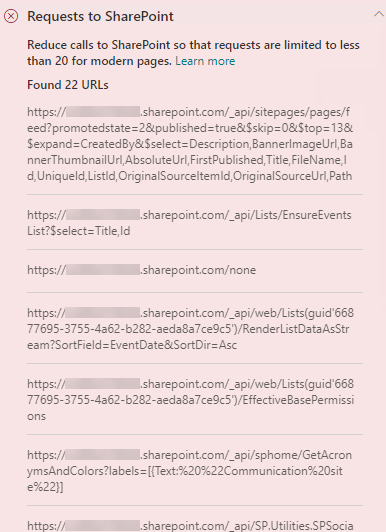

# Otimizar chamadas de página em páginas do site de publicação clássico e moderno do SharePoint OnlineOptimize page calls in SharePoint Online modern and classic publishing site pages

Os sites de publicação clássico e moderno do SharePoint Online contêm links que carregam dados de (ou fazem chamadas) recursos do SharePoint e CDNs.Both SharePoint Online modern and classic publishing sites contain links that load data from (or make calls to) SharePoint features and CDNs. Quanto mais chamadas forem feitas por uma página, maior será o tempo de carregamento da página.The more calls made by a page, the longer the page takes to load. Isso é conhecido como **latência percebida pelo usuário final** ou **EUPL**.This is known as **end user perceived latency** or **EUPL**.

Este artigo vai ajudá-lo a entender como determinar o número e o impacto das chamadas para pontos de extremidade externos nas páginas do site de publicação clássico e moderno e como limitar o efeito na latência percebida pelo usuário final.This article will help you understand how to determine the number and impact of calls to external endpoints from your modern and classic publishing site pages and how to limit their effect on end user perceived latency.

>[!NOTE]
>Para obter mais informações sobre o desempenho dos portais modernos do SharePoint Online, confira [Desempenho na experiência moderna do SharePoint](/sharepoint/modern-experience-performance).For more information about performance in SharePoint Online modern portals, see [Performance in the modern SharePoint experience](/sharepoint/modern-experience-performance).

## Usar a ferramenta Diagnóstico de Página do SharePoint para analisar as chamadas da páginaUse the Page Diagnostics for SharePoint tool to analyze page calls

A ferramenta Diagnóstico de Página para SharePoint é uma extensão do navegador para os novos navegadores Microsoft Edge (https://www.microsoft.com/edge) e Chrome que analisam o portal moderno do SharePoint Online e as páginas clássicas de site de publicação.The Page Diagnostics for SharePoint tool is a browser extension for the new Microsoft Edge (https://www.microsoft.com/edge) and Chrome browsers that analyzes both SharePoint Online modern portal and classic publishing site pages. A ferramenta fornece um relatório para cada página analisada que mostra o desempenho da página em relação a um conjunto definido de critérios de desempenho.The tool provides a report for each analyzed page showing how the page performs against a defined set of performance criteria. Para instalar e saber mais sobre a ferramenta Diagnóstico de Página para SharePoint, acesse [Usar a ferramenta Diagnóstico de Página para SharePoint Online](page-diagnostics-for-spo.md).To install and learn about the Page Diagnostics for SharePoint tool, visit [Use the Page Diagnostics tool for SharePoint Online](page-diagnostics-for-spo.md).

>[!NOTE]
>A ferramenta de Diagnóstico de Página só funciona com o SharePoint Online e não pode ser usada em uma página do sistema do SharePoint.The Page Diagnostics tool only works for SharePoint Online, and cannot be used on a SharePoint system page.

Ao analisar uma página de site do SharePoint com a ferramenta Diagnóstico de Página para SharePoint, você pode ver informações sobre as chamadas externas nos resultado das **Solicitações para o SharePoint** no painel de _Testes de Diagnóstico_.When you analyze a SharePoint site page with the Page Diagnostics for SharePoint tool, you can see information about external calls in the **Requests to SharePoint** result in the _Diagnostic tests_ pane. A linha aparecerá em verde se a página do site contiver menos que o número da linha de base de chamadas e em vermelho se a página ultrapassar o número da linha de base.The line will appear in green if the site page contains fewer than the baseline number of calls, and red if the page exceeds the baseline number. O número da linha de base é diferente para as páginas clássicas e modernas porque as páginas do site clássico usam HTTP1.1 e as modernas usam HTTP2.0:The baseline number is different for modern and classic pages because classic site pages use HTTP1.1 and modern pages use HTTP2.0:

- As páginas de site moderno não devem conter mais de **25** chamadasModern site pages should contain no more than **25** calls
- As páginas de publicação clássicas não devem conter mais de **6** chamadasClassic publishing pages should contain no more than **6** calls

Os resultados possíveis incluem:Possible results include:

- **Atenção necessária** (vermelho): a página ultrapassa o número da linha de base de chamadas**Attention required** (red): The page exceeds the baseline number of calls
- **Nenhuma ação necessária** (verde): a página contém menos do que o número da linha de base de chamadas**No action required** (green): The page contains fewer than the baseline number of calls

Se o resultado das **Solicitações para o SharePoint** aparecer na seção **Atenção necessária**, você poderá clicar no resultado para obter detalhes, incluindo o número total de chamadas na página e uma lista de URLs.If the **Requests to SharePoint** result appears in the **Attention required** section, you can click the result for details, including the total number of calls on the page and a list of the URLs.

## Solucionar problemas de desempenho relacionados a muitas chamadas em uma páginaRemediate performance issues related to too many calls on a page

Se uma página contiver muitas chamadas, você poderá usar a lista de URLs no resultado das **Solicitações do SharePoint** para determinar se há chamadas repetidas, chamadas que devem ser em lotes ou chamadas que retornam dados que devem ser armazenados em cache.If a page contains too many calls, you can use the list of URLs in the **Requests to Sharepoint** results to determine whether there are any repeated calls, calls that should be batched, or calls that return data that should be cached.

As **chamadas de REST em lote** podem ajudar a reduzir a sobrecarga de desempenho.**Batching REST calls** can help to reduce performance overhead. Para obter mais informações sobre a chamada da API em lote, confira [Fazer solicitações em lote com as APIs REST](/sharepoint/dev/sp-add-ins/make-batch-requests-with-the-rest-apis).For more information about API call batching, see [Make batch requests with the REST APIs](/sharepoint/dev/sp-add-ins/make-batch-requests-with-the-rest-apis).

**Usar um cache** para armazenar os resultados de uma chamada de API pode melhorar o desempenho de uma solicitação ativa, permitindo que o cliente use os dados armazenados em cache, em vez de fazer uma chamada adicional para cada carregamento de página subsequente.**Using a cache** to store the results of an API call can improve the performance of a warm request by allowing the client to use the cached data instead of making an additional call for each subsequent page load. Há várias maneiras de abordar essa solução dependendo da necessidade comercial.There are multiple ways to approach this solution depending on the business requirement. Geralmente, se os dados forem os mesmos para todos os usuários, o uso de um serviço de armazenamento hierárquico, como o [cache do _Azure Redis_](https://azure.microsoft.com/services/cache/), é uma ótima opção para reduzir significativamente o tráfego da API em um site, pois os usuários podem solicite os dados do serviço de cache, em vez de diretamente do SPO.Typically if the data will be the same for all users, using a middle-tier caching service like [_Azure Redis_ cache](https://azure.microsoft.com/services/cache/) is a great option to significantly reduce API traffic against a site, as the users would request the data from the caching service instead of directly from SPO. As únicas chamadas SPO necessárias seriam para atualizar o cache da camada intermediária.The only SPO calls needed would be to refresh the middle-tier's cache. Se os dados flutuarem com base no usuário individual, talvez seja melhor implementar um cache no lado do cliente, como LocalStorage ou até mesmo um cookie.If the data will fluctuate on an individual user basis, it may be best to implement a client side cache, like LocalStorage or even a Cookie. Isso ainda reduzirá os volumes de chamadas, eliminando as solicitações subsequentes feitas pelo mesmo usuário na duração do cache, mas será menos eficiente do que um serviço de cache dedicado.This will still reduce call volumes by eliminating subsequent requests made by the same user for the cache duration, but will be less efficient than a dedicated caching service. O PnP permite que você use o LocalStorage com um pequeno desenvolvimento adicional necessário.PnP allows you to use LocalStorage with little additional development required.

Antes de fazer as revisões das páginas para corrigir problemas de desempenho, anote o tempo de carregamento da página nos resultados da análise.Before you make page revisions to remediate performance issues, make a note of the page load time in the analysis results. Execute a ferramenta novamente após a revisão para ver se o novo resultado está dentro do padrão da linha de base e verifique o tempo de carregamento da nova página para ver se melhorou.Run the tool again after your revision to see if the new result is within the baseline standard, and check the new page load time to see if there was an improvement.

>[!NOTE]
>O tempo de carregamento da página pode variar de acordo com vários fatores, como a carga da rede, hora do dia e outras condições transitórias.Page load time can vary based on a variety of factors such as network load, time of day, and other transient conditions. Você deve testar o tempo de carregamento da página algumas vezes antes e depois de fazer as alterações para ajudá-lo a calcular uma média dos resultados.You should test page load time a few times before and after making changes to help you average the results.

## Tópicos relacionadosRelated topics

[Ajustar o desempenho do SharePoint OnlineTune SharePoint Online performance](tune-sharepoint-online-performance.md)

[Ajustar o desempenho do Office 365Tune Office 365 performance](tune-microsoft-365-performance.md)

[Desempenho na experiência moderna do SharePointPerformance in the modern SharePoint experience](/sharepoint/modern-experience-performance)

[Redes de distribuição de conteúdoContent delivery networks](content-delivery-networks.md)

[Usar a Rede de Distribuição de Conteúdo (CDN) do Office 365 com o SharePoint OnlineUse the Office 365 Content Delivery Network (CDN) with SharePoint Online](use-microsoft-365-cdn-with-spo.md)