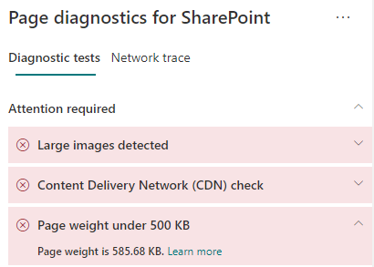

# Otimizar o peso da página nas páginas do site moderno do SharePoint Online.

As páginas do site moderno do SharePoint Online contêm o código serializado necessário para renderizar o conteúdo da página, incluindo imagens, texto, objetos na área de conteúdo embaixo das barras de navegação/comando e outro código HTML que forma a estrutura da página. A gramatura da página é uma medida desse código HTML e deve ser limitado para garantir o tempo de carregamento ideal da página.

Este artigo vai ajudá-lo a entender como reduzir o peso da página em suas páginas de site modernos.

>[!NOTE]
>Para obter mais informações sobre o desempenho dos portais modernos do SharePoint Online, confira [Desempenho na experiência moderna do SharePoint](/sharepoint/modern-experience-performance).

## Usar a ferramenta Diagnóstico de Página do SharePoint para analisar o peso da página

A ferramenta Diagnóstico de Página para SharePoint é uma extensão do navegador para os novos navegadores Microsoft Edge (https://www.microsoft.com/edge) e Chrome que analisam o portal moderno do SharePoint Online e as páginas clássicas de site de publicação. A ferramenta fornece um relatório para cada página analisada que mostra o desempenho da página em relação a um conjunto definido de critérios de desempenho. Para instalar e saber mais sobre a ferramenta Diagnóstico de Página para SharePoint, acesse [Usar a ferramenta Diagnóstico de Página para SharePoint Online](page-diagnostics-for-spo.md).

>[!NOTE]
>A ferramenta de Diagnóstico de Página só funciona com o SharePoint Online e não pode ser usada em uma página do sistema do SharePoint.

Ao analisar uma página de site do SharePoint com a ferramenta Diagnóstico de Página para SharePoint, você pode ver informações sobre a página **Peso da página em 500kB** resultado do painel dos _Testes de Diagnóstico_. O resultado será exibido em verde se o peso da página estiver abaixo do valor da linha de base e vermelho se o peso da página exceder o valor da linha de base.

Os resultados possíveis incluem:

- **Atenção necessária** (vermelho): O peso da página ultrapassa 500kB
- **Nenhuma ação necessário** (verde): O peso da página está abaixo de 500kB

Se o resultado **Peso da página abaixo de 500kB** aparecer na seção **Atenção necessária**, você pode clicar no resultado para obter detalhes.

## Solucionar problemas com o peso da página

Se o peso da página exceder 500KB, você pode aumentar o tempo geral de carregamento da página reduzindo o número de Web Parts e limitando o conteúdo da página a um grau apropriado.

As diretrizes gerais para reduzir o peso da página incluem:

- Limite o conteúdo da página a um valor razoável e use várias páginas para conteúdo relacionado.
- Minimize o uso de Web Parts com grandes bolsas de propriedades.
- Use modos de exibição cumulativos não interativos sempre que possível.
- Otimize os tamanhos das imagens dimensionando-as de forma adequada, usando formatos de imagem compactados e garantindo que eles sejam baixados de uma CDN.

Para saber mais, confira o artigo a seguir sobre como limitar o peso da página no seguinte artigo:

- [Otimizar o desempenho de página no SharePoint](/sharepoint/dev/general-development/optimize-page-performance-in-sharepoint)

Antes de criar revisões de página para corrigir problemas de desempenho, anote o tempo de carregamento da página nos resultados da análise. Execute a ferramenta novamente após a revisão para ver se o novo resultado está dentro do padrão da linha de base e verifique o tempo de carregamento da nova página para ver se melhorou.

>[!NOTE]
>O tempo de carregamento da página pode variar de acordo com vários fatores, como a carga da rede, hora do dia e outras condições transitórias. Você deve testar o tempo de carregamento da página algumas vezes antes e depois de fazer as alterações para ajudá-lo a calcular uma média dos resultados.

## Tópicos relacionados

[Ajustar o desempenho do SharePoint Online](tune-sharepoint-online-performance.md)

[Ajustar o desempenho do Office 365](tune-microsoft-365-performance.md)

[Desempenho na experiência moderna do SharePoint](/sharepoint/modern-experience-performance)

[Redes de distribuição de conteúdo](content-delivery-networks.md)

[Usar a Rede de Distribuição de Conteúdo (CDN) do Office 365 com o SharePoint Online](use-microsoft-365-cdn-with-spo.md)