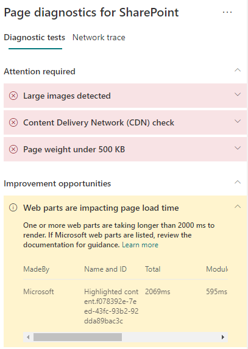

# Otimizar o desempenho de Web Parts em páginas de site moderno do SharePoint Online

As páginas de site moderno do SharePoint Online contêm Web Parts que podem contribuir para os tempos totais de carregamento de página. Este artigo ajudará você a entender como determinar de que modo as Web Parts em suas páginas afetam a latência percebida pelo usuário e como corrigir problemas comuns.

>[!NOTE]
>Para obter mais informações sobre o desempenho dos portais modernos do SharePoint Online, confira [Desempenho na experiência moderna do SharePoint](https://docs.microsoft.com/sharepoint/modern-experience-performance).

## Usar a ferramenta Diagnóstico de Página para SharePoint para analisar Web Parts

A ferramenta Diagnóstico de Página para SharePoint é uma extensão do navegador para os novos navegadores Microsoft Edge (https://www.microsoft.com/edge) e Chrome que analisam o portal moderno do SharePoint Online e as páginas clássicas do site de publicação. A ferramenta fornece um relatório para cada página analisada que mostra o desempenho da página em relação a um conjunto definido de critérios de desempenho. Para instalar e saber mais sobre a ferramenta Diagnóstico de Página para SharePoint, acesse [Usar a ferramenta Diagnóstico de Página para SharePoint Online](page-diagnostics-for-spo.md).

>[!NOTE]
>A ferramenta de Diagnóstico de Página só funciona com o SharePoint Online e não pode ser usada em uma página do sistema do SharePoint.

Ao analisar uma página de site do SharePoint com a ferramenta Diagnóstico de Página para SharePoint, você pode ver informações sobre Web Parts que excedem a métrica de linha de base no resultado de **As Web Parts estão afetando o tempo de carregamento da página**, no painel _Testes de diagnóstico_.

Os resultados possíveis incluem:

- **Atenção necessária** (vermelha): Qualquer web part _personalizada_ visível no visor (parte visível da tela da página que é carregada primeiro) que leva mais de **dois** segundos para carregar. Quaisquer web parts _personalizadas_ fora da janela de exibição que levam mais de **quatro** segundos para carregar. O tempo total de carregamento é exibido nos resultados do teste e é dividido por carga do módulo, carga lenta, inicialização e renderização.
- **Oportunidades de melhoria** (amarelo): os itens que podem estar afetando o tempo de carregamento da página são mostrados nesta seção e devem ser examinados e monitorados. Isso pode incluir Web Parts OOTB (“prontas para uso”) da Microsoft. Os resultados de todas as Web Parts da Microsoft mostradas nesta seção são automaticamente relatados à Microsoft, portanto, **nenhuma ação é necessária**. Você só precisará registrar um tíquete de suporte para investigação se estiver enfrentando um desempenho muito lento na página e **todas as Web Parts da Microsoft** na página aparecerem nos resultados na seção **Oportunidades de melhoria**. Observe que uma futura atualização da ferramenta Diagnóstico de Página para SharePoint detalhará ainda mais os resultados com base na configuração específica da web part da Microsoft.
- **Nenhuma ação necessária** (verde): nenhuma Web Part está demorando mais de **dois** segundos para retornar dados.

Se o resultado de **As Web Parts estão afetando o tempo de carregamento da página** aparecer na seção **Requer atenção** ou **Oportunidades de melhoria**, clique no resultado para ver detalhes sobre quais Web Parts estão com carregamento lento. Futuras atualizações da ferramenta Diagnóstico de Página para SharePoint podem incluir atualizações de regras de análise, portanto, garanta que você sempre tenha a versão mais recente da ferramenta.

As informações disponíveis nos resultados incluem:

- **Feita por** mostra se a Web Part é personalizada ou OOTB da Microsoft
- **Nome e ID** mostra informações de identificação que podem ajudar você a encontrar a Web Part na página
- **Total** mostra o tempo total de carregamento de Web Part
- **Carregamento do Módulo** mostra o tempo gasto para buscar e carregar os componentes de Web Part
- **Carregamento Lento** mostra o tempo de carregamento adiado de Web Parts não exibido na seção principal da página
- **Inicialização** mostra o tempo gasto para a inicialização da Web Part
- **Renderização** mostra o tempo gasto para a Web Part buscar e renderizar resultados

Essas informações são fornecidas para ajudar designers e desenvolvedores a solucionar problemas. Elas devem ser encaminhadas à equipe de design e desenvolvimento.

## Solucionar problemas de desempenho de Web Parts

Siga as orientações desta seção para identificar e corrigir problemas de desempenho com Web Parts indicados nos resultados de **As Web Parts estão afetando o tempo de carregamento da página**.

Há três categorias de possíveis causas do desempenho ruim de uma Web Part. Use as informações abaixo para determinar quais problemas se aplicam ao seu cenário e corrigi-los.

- Dependências e tamanho de script da Web Part
  - Otimize o script inicial que renderiza o cenário principal para _somente modo de exibição_.
  - Mova os cenários menos frequentes e o código do modo de edição (como o painel de propriedades) para partes separadas usando a instrução _import()_.
  - Examine as dependências do arquivo _package.json_ para remover completamente qualquer código morto. Mova todas as dependência apenas de teste/build para devDependencies.
  - É necessário usar a CDN do Office 365 para baixar o recurso estático ideal. As origens da CDN pública são preferíveis para arquivos _js/css_. Para saber mais sobre como usar a CDN do Office 365, confira [Usar a CDN (Rede de Distribuição de Conteúdo) do Office 365 com o SharePoint Online](use-microsoft-365-cdn-with-spo.md).
  - Reutilize estruturas como _importações do React_ e do _Fabric_, que vêm como parte da Estrutura do SharePoint (SPFx). Para saber mais, confira [Visão geral da Estrutura do SharePoint](https://docs.microsoft.com/sharepoint/dev/spfx/sharepoint-framework-overview).
  - Verifique se você está usando a versão mais recente da Estrutura do SharePoint e atualize para novas versões quando elas estiverem disponíveis.
- Busca/cache de dados
  - Se a Web Part depender de chamadas de servidor adicionais para buscar dados para exibição, verifique se essas APIs de servidor são rápidas e/ou implementam o cache no lado do cliente (como usar o _localStorage_ ou o _IndexedDB_ para conjuntos maiores).
  - Se várias chamadas forem necessárias para renderizar dados críticos, considere o uso de envio em lote no servidor ou de outros métodos de consolidação de solicitações em uma única chamada.
  - Como alternativa, se alguns elementos de dados exigirem uma API mais lenta, mas não forem críticos para a renderização inicial, separe-os em outra chamada, executada após a renderização dos dados críticos.
  - Se várias partes usarem os mesmos dados, utilize uma camada de dados comum para evitar chamadas duplicadas.
- Tempo de renderização
  - Quaisquer fontes de mídia, como imagens e vídeos, devem ser dimensionadas de acordo com os limites do contêiner, dispositivo e/ou rede para evitar o download de grandes recursos desnecessários. Para saber mais sobre como usar dependências de conteúdo, confira [Usar a CDN (Rede de Distribuição de Conteúdo) do Office 365 com o SharePoint Online](use-microsoft-365-cdn-with-spo.md).
  - Evite chamadas de API que causem refluxo, regras CSS complexas ou animações complicadas. Para obter mais informações, confira [Minimizar o refluxo do navegador](https://developers.google.com/speed/docs/insights/browser-reflow).
  - Evite o uso de tarefas de longa execução encadeadas. Em vez disso, divida as tarefas de longa execução em filas separadas. Para obter mais informações, confira [Otimizar a execução do JavaScript](https://developers.google.com/web/fundamentals/performance/rendering/optimize-javascript-execution).
  - Reserve o espaço correspondente para renderizar de forma assíncrona mídia ou elementos visuais, a fim de evitar quadros ignorados e instabilidade (também conhecida como _jank_).
  - Se determinado navegador não oferecer suporte a um recurso usado na renderização, carregue um polyfill ou exclua o código dependente em execução. Se o recurso não for crítico, descarte recursos como manipuladores de eventos para evitar vazamentos de memória.

Antes de fazer as revisões das páginas para corrigir problemas de desempenho, anote o tempo de carregamento da página nos resultados da análise. Execute a ferramenta novamente após a revisão para ver se o novo resultado está dentro do padrão da linha de base e verifique o tempo de carregamento da nova página para ver se melhorou.

>[!NOTE]
>O tempo de carregamento da página pode variar de acordo com vários fatores, como a carga da rede, hora do dia e outras condições transitórias. Você deve testar o tempo de carregamento da página algumas vezes antes e depois de fazer as alterações para ajudá-lo a calcular uma média dos resultados.

## Tópicos relacionados

[Ajustar o desempenho do SharePoint Online](tune-sharepoint-online-performance.md)

[Ajustar o desempenho do Office 365](tune-microsoft-365-performance.md)

[Desempenho na experiência moderna do SharePoint](https://docs.microsoft.com/sharepoint/modern-experience-performance)

[Redes de distribuição de conteúdo](content-delivery-networks.md)

[Usar a Rede de Distribuição de Conteúdo (CDN) do Office 365 com o SharePoint Online](use-microsoft-365-cdn-with-spo.md)
